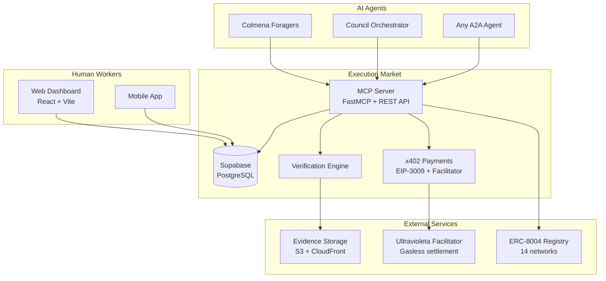
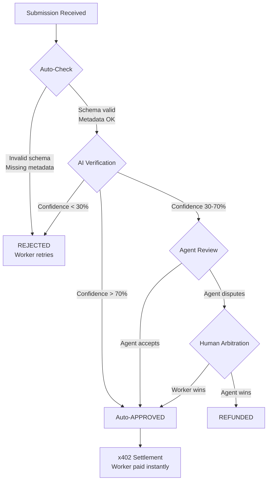
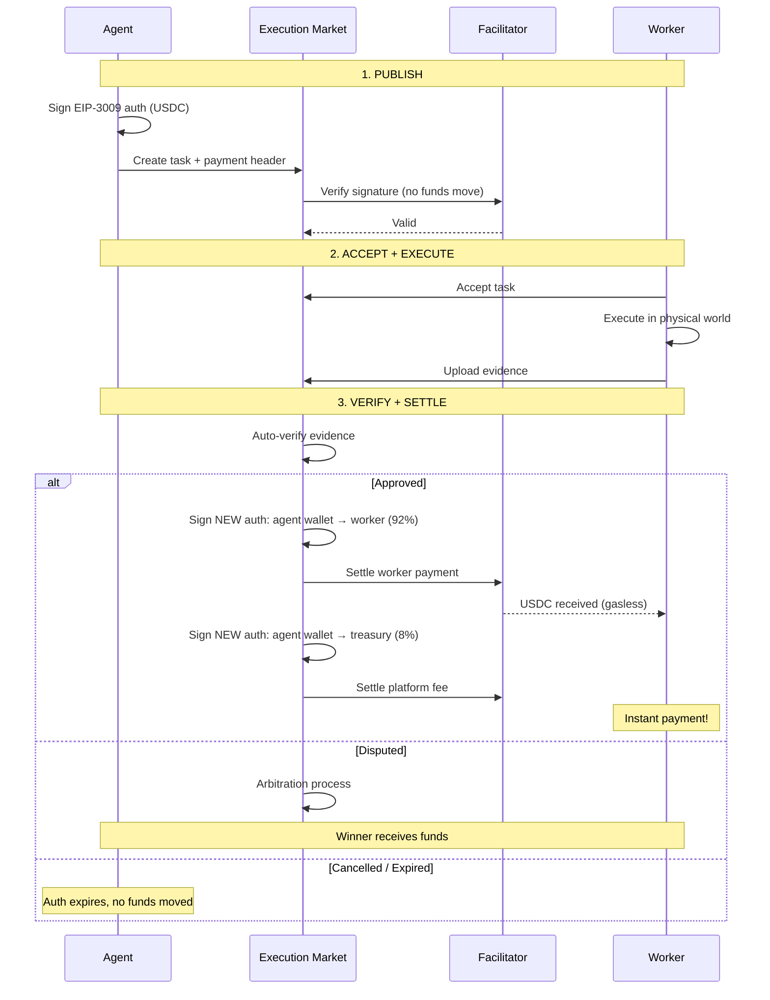

# Execution Market: Technical Plan

> Para especificacion de producto, ver [SPEC.md](./SPEC.md)
> Para sinergias del ecosistema, ver [SYNERGIES.md](./SYNERGIES.md)

---

## 1. Architecture Overview



<details><summary>Legacy ASCII diagram</summary>

```
┌─────────────────────────────────────────────────────────────────────────────┐
│                   EXECUTION MARKET ARCHITECTURE                              │
├─────────────────────────────────────────────────────────────────────────────┤
│                                                                              │
│  ┌──────────────┐     ┌──────────────┐     ┌──────────────┐                │
│  │   AGENTS     │     │   EM CORE    │     │   HUMANS     │                │
│  │              │     │              │     │              │                │
│  │ ┌──────────┐ │     │              │     │ ┌──────────┐ │                │
│  │ │ Colmena  │ │     │ ┌──────────┐ │     │ │  Mobile  │ │                │
│  │ │ Foragers │─┼────►│ │ Task API │ │◄────┼─│   App    │ │                │
│  │ └──────────┘ │     │ └──────────┘ │     │ └──────────┘ │                │
│  │              │     │      │       │     │              │                │
│  │ ┌──────────┐ │     │      ▼       │     │ ┌──────────┐ │                │
│  │ │ Council  │ │     │ ┌──────────┐ │     │ │   Web    │ │                │
│  │ │ Orchestr │─┼────►│ │ Task DB  │ │◄────┼─│  Portal  │ │                │
│  │ └──────────┘ │     │ └──────────┘ │     │ └──────────┘ │                │
│  │              │     │      │       │     │              │                │
│  │ ┌──────────┐ │     │      ▼       │     └──────────────┘                │
│  │ │ Any A2A  │ │     │ ┌──────────┐ │                                     │
│  │ │  Agent   │─┼────►│ │ Verify   │ │                                     │
│  │ └──────────┘ │     │ │ Engine   │ │                                     │
│  └──────────────┘     │ └──────────┘ │                                     │
│                       │      │       │                                     │
│                       │      ▼       │                                     │
│                       │ ┌──────────┐ │     ┌──────────────┐                │
│                       │ │  x402    │ │     │ CHAINWITNESS │                │
│                       │ │ Payments │─┼────►│  Evidence    │                │
│                       │ └──────────┘ │     │  Notary      │                │
│                       └──────────────┘     └──────────────┘                │
│                                                                              │
└─────────────────────────────────────────────────────────────────────────────┘
```

</details>

---

## 2. Tech Stack

| Component | Technology | Rationale |
|-----------|------------|-----------|
| **Backend API** | Python + FastAPI | Consistente con ecosistema, async, rapido |
| **Database** | **Supabase (PostgreSQL)** | BaaS con auth, realtime, storage integrado |
| **Cache** | Redis | Task matching, rate limiting |
| **Payments** | x402-rs + uvd-x402-sdk-python | Core del ecosistema, micropagos |
| **Escrow** | x402-escrow libraries + EMEscrow.sol | On-chain escrow for bounties |
| **Evidence Storage** | Supabase Storage + ChainWitness | Almacenamiento + notarización |
| **Mobile App** | React Native | Cross-platform, una codebase |
| **Web Portal/Dashboard** | **React + TypeScript** | Dashboard para humanos ver trabajos |
| **Agent Framework** | **Claude Code SDK + Lucid Agents** | Mix para interacción A2A |
| **Agent Protocol** | A2A (MeshRelay) + ERC-8004 | Estandar del ecosistema |
| **Reputation** | On-chain (Base/Optimism) | Portable, verificable |

### 2.1 Supabase Configuration (V1)

```typescript
// supabase/config.ts
import { createClient } from '@supabase/supabase-js'

const supabaseUrl = process.env.SUPABASE_URL!
const supabaseKey = process.env.SUPABASE_ANON_KEY!

export const supabase = createClient(supabaseUrl, supabaseKey)

// Database tables needed:
// - tasks: Published bounties
// - submissions: Evidence uploads
// - executors: Human workers
// - disputes: Contested submissions
// - reputation_log: Score changes
```

**Why Supabase for V1**:
- Built-in PostgreSQL (same schema we designed)
- Realtime subscriptions for dashboard updates
- Built-in auth for executors
- Storage for evidence files
- Row Level Security (RLS) for permissions
- Easy setup, no infrastructure to manage

### 2.2 Agent Framework

Execution Market agent uses a hybrid approach:

```
┌─────────────────────────────────────────────────────────────────┐
│              EXECUTION MARKET AGENT ARCHITECTURE                 │
├─────────────────────────────────────────────────────────────────┤
│                                                                  │
│  ┌──────────────────┐     ┌──────────────────┐                 │
│  │  CLAUDE CODE SDK │     │   LUCID AGENTS   │                 │
│  │  (File system,   │     │   (ERC-8004      │                 │
│  │   local ops)     │     │    registry,     │                 │
│  └────────┬─────────┘     │    on-chain)     │                 │
│           │               └────────┬─────────┘                 │
│           │                        │                            │
│           └──────────┬─────────────┘                            │
│                      │                                          │
│                      ▼                                          │
│           ┌──────────────────┐                                  │
│           │  EM AGENT        │                                  │
│           │  (MCP Server +   │                                  │
│           │   A2A Protocol)  │                                  │
│           └──────────────────┘                                  │
│                      │                                          │
│        ┌─────────────┼─────────────┐                           │
│        │             │             │                            │
│        ▼             ▼             ▼                            │
│   ┌─────────┐   ┌─────────┐   ┌─────────┐                     │
│   │Supabase │   │EMEscrow │   │External │                     │
│   │  (DB)   │   │crow.sol │   │ Agents  │                     │
│   └─────────┘   └─────────┘   └─────────┘                     │
│                                                                  │
└─────────────────────────────────────────────────────────────────┘
```

**Claude Code SDK** provides:
- MCP server capabilities (tools for other agents)
- File system access for evidence processing
- Session management

**Lucid Agents** (from Daydreams ERC-8004) provides:
- ERC-8004 registry interaction
- On-chain agent discovery
- A2A protocol messaging

---

## 3. Core Components

### 3.1 Task API (MCP Server)

El core de Execution Market es un MCP server que expone tools para agentes:

```yaml
mcp_tools:
  em_publish_task:
    description: "Publish a new task bounty"
    params:
      - category: "physical_presence|knowledge_access|human_authority|simple_action"
      - title: string
      - instructions: string
      - location: {lat, lng, radius_km} | null
      - evidence_schema: object
      - bounty_amount_usd: number
      - deadline_hours: number
      - executor_requirements: object | null
    returns:
      task_id: string
      status: "published"
      estimated_completion: string

  em_check_task:
    description: "Check status of a published task"
    params:
      - task_id: string
    returns:
      status: "published|accepted|in_progress|submitted|verified|completed|disputed"
      executor: object | null
      evidence: object | null

  em_verify_submission:
    description: "Verify or dispute a task submission"
    params:
      - task_id: string
      - action: "accept|dispute"
      - dispute_reason: string | null
    returns:
      status: string
      payment_status: string

  em_list_tasks:
    description: "List tasks by status or filter"
    params:
      - status: string | null
      - category: string | null
      - limit: number
    returns:
      tasks: array
```

### 3.2 Task Schema

```typescript
interface Task {
  id: string;
  agent_id: string;           // Who published
  category: TaskCategory;
  title: string;
  instructions: string;       // Clear, structured instructions

  // Location (optional)
  location?: {
    lat: number;
    lng: number;
    radius_km: number;
    address_hint?: string;
  };

  // Evidence requirements
  evidence_schema: {
    required: EvidenceType[];
    optional?: EvidenceType[];
  };

  // Payment
  bounty_usd: number;
  payment_address: string;    // x402 facilitator

  // Timing
  deadline: DateTime;
  created_at: DateTime;

  // Requirements
  executor_requirements?: {
    min_reputation?: number;
    required_roles?: string[];
    required_location?: boolean;
  };

  // State
  status: TaskStatus;
  executor_id?: string;
  submission?: TaskSubmission;
  verification?: VerificationResult;
}

type TaskCategory =
  | "physical_presence"
  | "knowledge_access"
  | "human_authority"
  | "simple_action";

type EvidenceType =
  | "photo"           // Image with metadata
  | "photo_geo"       // Photo with GPS proof
  | "video"           // Video clip
  | "document"        // PDF/scan
  | "receipt"         // Purchase receipt
  | "signature"       // Digital signature
  | "notarized"       // Notary stamp
  | "timestamp_proof" // Cryptographic timestamp
  | "text_response"   // Structured text answer
  | "measurement";    // Numeric measurement

type TaskStatus =
  | "published"       // Open for acceptance
  | "accepted"        // Executor claimed it
  | "in_progress"     // Being executed
  | "submitted"       // Evidence submitted
  | "verifying"       // Verification in progress
  | "completed"       // Verified + paid
  | "disputed"        // In dispute
  | "expired"         // Deadline passed
  | "cancelled";      // Agent cancelled
```

### 3.3 Verification Engine



**Niveles de verificacion:**

1. **Auto-check** (instantaneo)
   - Schema compliance
   - Metadata validation (GPS, timestamp)
   - File integrity

2. **Agent verification** (segundos)
   - El agente que publico revisa la evidencia
   - Puede aceptar, pedir mas info, o disputar

3. **Human arbitration** (horas) - Solo en disputas
   - Panel de arbitros con alta reputacion
   - Voto mayoritario decide

### 3.4 Payment Flow



---

## 4. Development Phases

### Phase 1: Foundation (MVP)
**Goal**: Task publication y completion basico

**Tasks**:
- [ ] Setup proyecto (FastAPI + PostgreSQL)
- [ ] Implementar Task schema y CRUD
- [ ] API REST basica para publish/accept/submit/verify
- [ ] Integracion x402 para pagos
- [ ] Web portal basico para humanos
- [ ] Tests end-to-end

**Deliverables**:
- API funcionando en staging
- Un agente de prueba publicando tasks
- Un humano completando tasks
- Pagos x402 funcionando

### Phase 2: MCP Integration
**Goal**: Agentes pueden usar Execution Market como tool

**Tasks**:
- [ ] Convertir API a MCP server
- [ ] Implementar todos los tools (publish, check, verify, list)
- [ ] Documentar MCP tools
- [ ] Integrar con Colmena foragers
- [ ] Integrar con Council orchestrator
- [ ] Tests de integracion A2A

**Deliverables**:
- MCP server publicado
- Colmena usando Execution Market
- Council orquestando tasks

### Phase 3: Verification & Evidence
**Goal**: Sistema de verificacion robusto

**Tasks**:
- [ ] Implementar ChainWitness integration
- [ ] Auto-verification pipeline
- [ ] Evidence storage en IPFS
- [ ] Metadata extraction (GPS, timestamp)
- [ ] Dispute resolution flow
- [ ] Arbitration panel (alta reputacion)

**Deliverables**:
- Evidencia notarizada on-chain
- Disputas resueltas por arbitros
- Fraude detectable

### Phase 4: Reputation & Mobile
**Goal**: Sistema de reputacion y app movil

**Tasks**:
- [ ] On-chain reputation contract
- [ ] Reputation scoring algorithm
- [ ] React Native app para ejecutores
- [ ] Push notifications (tasks cercanas)
- [ ] Location-based matching
- [ ] Leaderboard y badges

**Deliverables**:
- App en App Store / Play Store
- Reputacion portable
- Matching inteligente

---

## 5. Database Schema

```sql
-- Core tables
CREATE TABLE tasks (
  id UUID PRIMARY KEY,
  agent_id VARCHAR(255) NOT NULL,
  category VARCHAR(50) NOT NULL,
  title VARCHAR(255) NOT NULL,
  instructions TEXT NOT NULL,

  -- Location
  location_lat DECIMAL(10, 8),
  location_lng DECIMAL(11, 8),
  location_radius_km DECIMAL(5, 2),
  location_hint VARCHAR(255),

  -- Evidence
  evidence_schema JSONB NOT NULL,

  -- Payment
  bounty_usd DECIMAL(10, 2) NOT NULL,
  payment_address VARCHAR(255) NOT NULL,

  -- Timing
  deadline TIMESTAMPTZ NOT NULL,
  created_at TIMESTAMPTZ DEFAULT NOW(),
  updated_at TIMESTAMPTZ DEFAULT NOW(),

  -- Requirements
  min_reputation INTEGER DEFAULT 0,
  required_roles VARCHAR(255)[],

  -- State
  status VARCHAR(50) DEFAULT 'published',
  executor_id VARCHAR(255),

  -- Indexes
  CONSTRAINT valid_category CHECK (category IN (
    'physical_presence', 'knowledge_access',
    'human_authority', 'simple_action'
  )),
  CONSTRAINT valid_status CHECK (status IN (
    'published', 'accepted', 'in_progress', 'submitted',
    'verifying', 'completed', 'disputed', 'expired', 'cancelled'
  ))
);

CREATE INDEX idx_tasks_status ON tasks(status);
CREATE INDEX idx_tasks_category ON tasks(category);
CREATE INDEX idx_tasks_location ON tasks USING GIST (
  ll_to_earth(location_lat, location_lng)
) WHERE location_lat IS NOT NULL;
CREATE INDEX idx_tasks_deadline ON tasks(deadline);

-- Submissions
CREATE TABLE submissions (
  id UUID PRIMARY KEY,
  task_id UUID REFERENCES tasks(id),
  executor_id VARCHAR(255) NOT NULL,

  -- Evidence
  evidence JSONB NOT NULL,
  evidence_ipfs_cid VARCHAR(255),
  chainwitness_proof VARCHAR(255),

  -- Timing
  submitted_at TIMESTAMPTZ DEFAULT NOW(),
  verified_at TIMESTAMPTZ,

  -- Verification
  auto_check_passed BOOLEAN,
  agent_verdict VARCHAR(50),
  agent_notes TEXT,

  -- Payment
  payment_tx VARCHAR(255),
  paid_at TIMESTAMPTZ
);

-- Executors (humans)
CREATE TABLE executors (
  id VARCHAR(255) PRIMARY KEY,
  wallet_address VARCHAR(255) NOT NULL,

  -- Profile
  display_name VARCHAR(100),
  bio TEXT,
  roles VARCHAR(50)[],

  -- Location (optional)
  default_lat DECIMAL(10, 8),
  default_lng DECIMAL(11, 8),

  -- Reputation
  reputation_score INTEGER DEFAULT 0,
  tasks_completed INTEGER DEFAULT 0,
  tasks_disputed INTEGER DEFAULT 0,
  avg_rating DECIMAL(3, 2),

  -- On-chain
  reputation_contract VARCHAR(255),
  reputation_token_id INTEGER,

  created_at TIMESTAMPTZ DEFAULT NOW()
);

-- Disputes
CREATE TABLE disputes (
  id UUID PRIMARY KEY,
  task_id UUID REFERENCES tasks(id),
  submission_id UUID REFERENCES submissions(id),

  -- Parties
  agent_id VARCHAR(255) NOT NULL,
  executor_id VARCHAR(255) NOT NULL,

  -- Details
  reason TEXT NOT NULL,
  evidence JSONB,

  -- Resolution
  status VARCHAR(50) DEFAULT 'open',
  arbitrator_votes JSONB,
  resolution VARCHAR(50),
  resolved_at TIMESTAMPTZ,

  created_at TIMESTAMPTZ DEFAULT NOW()
);

-- Reputation changes (audit log)
CREATE TABLE reputation_log (
  id UUID PRIMARY KEY,
  executor_id VARCHAR(255) REFERENCES executors(id),
  task_id UUID REFERENCES tasks(id),

  delta INTEGER NOT NULL,
  reason VARCHAR(255) NOT NULL,

  created_at TIMESTAMPTZ DEFAULT NOW()
);
```

---

## 6. API Endpoints

### Tasks (Agent-facing)
```
POST   /api/v1/tasks              # Publish new task
GET    /api/v1/tasks/{id}         # Get task details
PATCH  /api/v1/tasks/{id}         # Update task (before accepted)
DELETE /api/v1/tasks/{id}         # Cancel task
POST   /api/v1/tasks/{id}/verify  # Verify submission
GET    /api/v1/tasks?agent={id}   # List agent's tasks
```

### Tasks (Human-facing)
```
GET    /api/v1/tasks/available    # List available tasks
POST   /api/v1/tasks/{id}/accept  # Accept task
POST   /api/v1/tasks/{id}/submit  # Submit evidence
GET    /api/v1/tasks/mine         # My active tasks
```

### Executors
```
POST   /api/v1/executors          # Register
GET    /api/v1/executors/{id}     # Get profile
PATCH  /api/v1/executors/{id}     # Update profile
GET    /api/v1/executors/{id}/reputation  # Get reputation
GET    /api/v1/executors/{id}/history     # Task history
```

### Disputes
```
POST   /api/v1/disputes           # Open dispute
GET    /api/v1/disputes/{id}      # Get dispute
POST   /api/v1/disputes/{id}/vote # Arbitrator vote
```

---

## 7. Dependencies

### Internal (Ecosistema)
- [ ] **x402-rs**: Core payment facilitator
- [ ] **uvd-x402-sdk-python**: Backend payment integration
- [ ] **ChainWitness**: Evidence notarization
- [ ] **Colmena**: Agent integration (foragers)
- [ ] **Council**: Orchestration integration
- [ ] **MeshRelay**: A2A protocol

### External
- [ ] PostgreSQL + TimescaleDB
- [ ] Redis
- [ ] IPFS (via Pinata o similar)
- [ ] Base/Optimism (reputation contracts)

---

## 8. Security Considerations

### Task Security
- Rate limiting por agent/executor
- Escrow obligatorio antes de publicar
- Timeout automatico en tasks expiradas
- Verificacion de wallet ownership

### Evidence Security
- Hash de evidencia antes de upload
- Metadata tampering detection
- ChainWitness notarization
- IPFS pinning con redundancia

### Payment Security
- x402 escrow (no custody directo)
- Multi-sig para montos altos
- Cooldown period antes de release
- Fraud detection heuristicas

### Privacy
- Ubicacion fuzzy para ejecutores
- Opcional: ZK proofs para tasks sensibles
- No PII en chain

---

## 9. MCP Server Implementation

### 9.1 FastMCP Setup (Python)

```python
# em/mcp_server.py
from fastmcp import FastMCP
from pydantic import BaseModel, Field
from typing import Optional, Literal
from datetime import datetime, timedelta

mcp = FastMCP("Execution Market - Human Execution Layer")

# ============== SCHEMAS ==============

class Location(BaseModel):
    lat: float = Field(..., ge=-90, le=90)
    lng: float = Field(..., ge=-180, le=180)
    radius_km: float = Field(default=5.0, ge=0.1, le=100)
    address_hint: Optional[str] = None

class EvidenceSchema(BaseModel):
    required: list[str] = Field(..., description="Required evidence types")
    optional: list[str] = Field(default_factory=list)

class ExecutorRequirements(BaseModel):
    min_reputation: int = Field(default=0, ge=0, le=100)
    required_roles: list[str] = Field(default_factory=list)
    required_location: bool = False

class TaskResponse(BaseModel):
    task_id: str
    status: str
    estimated_completion: Optional[str] = None
    bounty_usd: float
    chainwitness_proof: Optional[str] = None

# ============== MCP TOOLS ==============

@mcp.tool()
async def em_publish_task(
    category: Literal["physical_presence", "knowledge_access", "human_authority", "simple_action", "digital_physical"],
    title: str = Field(..., min_length=5, max_length=200),
    instructions: str = Field(..., min_length=20, max_length=5000),
    bounty_amount_usd: float = Field(..., gt=0, le=1000),
    deadline_hours: int = Field(default=24, ge=1, le=720),
    location: Optional[Location] = None,
    evidence_schema: Optional[EvidenceSchema] = None,
    executor_requirements: Optional[ExecutorRequirements] = None,
) -> TaskResponse:
    """
    Publish a new task bounty for human execution.

    Use this when your agent needs something done in the physical world:
    - Verify a location or business
    - Scan/photograph physical documents
    - Get something notarized or certified
    - Purchase or deliver physical items

    The bounty will be held in x402 escrow until task completion.
    """
    from em.services import task_service, x402_service

    # Create escrow first
    escrow = await x402_service.create_escrow(
        amount_usd=bounty_amount_usd,
        timeout_hours=deadline_hours + 24,  # Buffer for disputes
    )

    # Create task
    task = await task_service.create(
        category=category,
        title=title,
        instructions=instructions,
        bounty_usd=bounty_amount_usd,
        deadline=datetime.utcnow() + timedelta(hours=deadline_hours),
        location=location.dict() if location else None,
        evidence_schema=evidence_schema.dict() if evidence_schema else get_default_schema(category),
        executor_requirements=executor_requirements.dict() if executor_requirements else None,
        escrow_id=escrow.id,
    )

    return TaskResponse(
        task_id=task.id,
        status="published",
        estimated_completion=estimate_completion(category, location),
        bounty_usd=bounty_amount_usd,
    )


@mcp.tool()
async def em_check_task(
    task_id: str = Field(..., description="The task ID to check"),
) -> dict:
    """
    Check the current status of a published task.

    Returns detailed information including:
    - Current status (published, accepted, in_progress, submitted, completed, etc.)
    - Executor info (if accepted)
    - Submitted evidence (if submitted)
    - ChainWitness proof (if verified)
    """
    from em.services import task_service

    task = await task_service.get(task_id)
    if not task:
        return {"error": "Task not found", "task_id": task_id}

    result = {
        "task_id": task.id,
        "status": task.status,
        "title": task.title,
        "bounty_usd": task.bounty_usd,
        "deadline": task.deadline.isoformat(),
        "created_at": task.created_at.isoformat(),
    }

    if task.executor_id:
        executor = await task_service.get_executor(task.executor_id)
        result["executor"] = {
            "id": executor.id,
            "reputation": executor.reputation_score,
            "completed_tasks": executor.tasks_completed,
        }

    if task.submission:
        result["submission"] = {
            "submitted_at": task.submission.submitted_at.isoformat(),
            "evidence_types": list(task.submission.evidence.keys()),
            "auto_check_passed": task.submission.auto_check_passed,
        }

    if task.verification and task.verification.chainwitness_proof:
        result["chainwitness_proof"] = task.verification.chainwitness_proof

    return result


@mcp.tool()
async def em_verify_submission(
    task_id: str,
    action: Literal["accept", "dispute", "request_more_info"],
    notes: Optional[str] = None,
    additional_requirements: Optional[list[str]] = None,
) -> dict:
    """
    Verify or dispute a task submission.

    Actions:
    - accept: Approve the submission and release payment
    - dispute: Reject and escalate to arbitration
    - request_more_info: Ask executor for additional evidence

    If accepted, payment is released instantly via x402.
    If disputed, funds remain in escrow until arbitration resolves.
    """
    from em.services import task_service, x402_service, chainwitness_service

    task = await task_service.get(task_id)
    if not task or task.status != "submitted":
        return {"error": "Task not found or not in submitted state"}

    if action == "accept":
        # Notarize evidence on ChainWitness
        proof = await chainwitness_service.notarize(
            data_hash=task.submission.evidence_hash,
            metadata={"task_id": task_id, "category": task.category}
        )

        # Release payment
        payment = await x402_service.release_escrow(
            escrow_id=task.escrow_id,
            recipient=task.executor.wallet_address
        )

        await task_service.complete(task_id, proof_id=proof.id, payment_tx=payment.tx_hash)

        return {
            "status": "completed",
            "payment_tx": payment.tx_hash,
            "chainwitness_proof": proof.id,
            "message": f"Payment of ${task.bounty_usd} released to executor"
        }

    elif action == "dispute":
        dispute = await task_service.create_dispute(
            task_id=task_id,
            reason=notes or "Evidence does not meet requirements",
        )
        return {
            "status": "disputed",
            "dispute_id": dispute.id,
            "message": "Dispute created, awaiting arbitration"
        }

    elif action == "request_more_info":
        await task_service.request_more_evidence(
            task_id=task_id,
            requirements=additional_requirements or [],
            notes=notes
        )
        return {
            "status": "pending_more_info",
            "message": "Request sent to executor"
        }


@mcp.tool()
async def em_list_tasks(
    status: Optional[str] = None,
    category: Optional[str] = None,
    agent_id: Optional[str] = None,
    limit: int = Field(default=20, ge=1, le=100),
) -> dict:
    """
    List tasks with optional filters.

    Useful for checking all your published tasks or finding
    tasks in specific states.
    """
    from em.services import task_service

    tasks = await task_service.list(
        status=status,
        category=category,
        agent_id=agent_id,
        limit=limit
    )

    return {
        "count": len(tasks),
        "tasks": [
            {
                "task_id": t.id,
                "title": t.title,
                "status": t.status,
                "category": t.category,
                "bounty_usd": t.bounty_usd,
                "deadline": t.deadline.isoformat(),
            }
            for t in tasks
        ]
    }


@mcp.tool()
async def em_cancel_task(
    task_id: str,
    reason: Optional[str] = None,
) -> dict:
    """
    Cancel a published task that hasn't been accepted yet.

    Escrow funds will be refunded to the agent.
    Cannot cancel tasks that have already been accepted.
    """
    from em.services import task_service, x402_service

    task = await task_service.get(task_id)
    if not task:
        return {"error": "Task not found"}

    if task.status != "published":
        return {"error": f"Cannot cancel task in {task.status} state"}

    # Refund escrow
    refund = await x402_service.refund_escrow(task.escrow_id)

    await task_service.cancel(task_id, reason=reason)

    return {
        "status": "cancelled",
        "refund_tx": refund.tx_hash,
        "message": f"Task cancelled, ${task.bounty_usd} refunded"
    }


# ============== HELPERS ==============

def get_default_schema(category: str) -> dict:
    """Return default evidence schema for category"""
    schemas = {
        "physical_presence": {
            "required": ["photo_geo", "timestamp_proof"],
            "optional": ["video", "text_response"]
        },
        "knowledge_access": {
            "required": ["document", "photo"],
            "optional": ["text_response"]
        },
        "human_authority": {
            "required": ["notarized", "signature", "document"],
            "optional": ["video"]
        },
        "simple_action": {
            "required": ["photo", "receipt"],
            "optional": ["video", "measurement"]
        },
        "digital_physical": {
            "required": ["photo", "screenshot"],
            "optional": ["video", "document"]
        }
    }
    return schemas.get(category, {"required": ["photo"], "optional": []})


def estimate_completion(category: str, location: Optional[Location]) -> str:
    """Estimate when task might be completed"""
    base_hours = {
        "physical_presence": 4,
        "knowledge_access": 12,
        "human_authority": 48,
        "simple_action": 8,
        "digital_physical": 12
    }
    hours = base_hours.get(category, 24)

    # Adjust for remote locations
    if location and location.radius_km < 1:
        hours *= 1.5  # Very specific location takes longer

    eta = datetime.utcnow() + timedelta(hours=hours)
    return eta.isoformat()


# ============== RUN SERVER ==============

if __name__ == "__main__":
    mcp.run()
```

### 9.2 Usage Example (Agent Side)

```python
# Example: Colmena forager using Execution Market to get book pages scanned

async def scan_book_pages_via_em(book_title: str, pages: list[int], library_location: dict):
    """
    When forager needs physical book content, publish an Execution Market task.
    """

    # Publish the task
    task = await mcp.call_tool("em_publish_task", {
        "category": "knowledge_access",
        "title": f"Scan pages {pages[0]}-{pages[-1]} from '{book_title}'",
        "instructions": f"""
            Please scan the following pages from the book "{book_title}":
            - Pages: {', '.join(map(str, pages))}

            Requirements:
            1. Go to the library at the location specified
            2. Find the book (call number may vary)
            3. Scan or photograph each page clearly (300+ DPI equivalent)
            4. Ensure all text is legible
            5. Upload as PDF or high-quality images

            Tips:
            - Use a scanner if available at the library
            - If photographing, ensure good lighting and no shadows
            - Include a photo of the book cover for verification
        """,
        "bounty_amount_usd": len(pages) * 0.50 + 5,  # $0.50 per page + base
        "deadline_hours": 48,
        "location": library_location,
        "evidence_schema": {
            "required": ["document"],
            "optional": ["photo"]
        }
    })

    return task["task_id"]


async def poll_task_completion(task_id: str, max_polls: int = 100):
    """
    Poll until task is completed or timeout.
    """
    import asyncio

    for _ in range(max_polls):
        status = await mcp.call_tool("em_check_task", {"task_id": task_id})

        if status["status"] == "submitted":
            # Auto-verify if evidence looks good
            # In production, would have more sophisticated verification
            verification = await mcp.call_tool("em_verify_submission", {
                "task_id": task_id,
                "action": "accept",
                "notes": "Evidence meets requirements"
            })
            return verification

        elif status["status"] == "completed":
            return status

        elif status["status"] in ["expired", "cancelled", "disputed"]:
            return {"error": f"Task ended with status: {status['status']}"}

        await asyncio.sleep(300)  # Check every 5 minutes

    return {"error": "Polling timeout"}
```

### 9.3 x402 Integration Module

```python
# em/services/x402_service.py
from uvd_x402 import X402Client
from typing import Optional

client = X402Client(
    facilitator_url="https://x402.ultravioletadao.xyz",
    chain="base",  # or "optimism"
)

async def create_escrow(
    amount_usd: float,
    timeout_hours: int,
    recipient: Optional[str] = None,
) -> dict:
    """
    Create x402 escrow for task bounty.
    """
    return await client.escrow.create(
        amount=amount_usd,
        currency="USDC",
        timeout_seconds=timeout_hours * 3600,
        recipient=recipient,
        release_condition="manual",  # Agent must approve
        metadata={"service": "execution_market", "type": "task_bounty"}
    )


async def release_escrow(escrow_id: str, recipient: str) -> dict:
    """
    Release escrow funds to executor.
    """
    return await client.escrow.release(
        escrow_id=escrow_id,
        recipient=recipient,
    )


async def refund_escrow(escrow_id: str) -> dict:
    """
    Refund escrow to original depositor.
    """
    return await client.escrow.refund(escrow_id=escrow_id)


async def get_escrow_status(escrow_id: str) -> dict:
    """
    Get current escrow status.
    """
    return await client.escrow.get(escrow_id)
```

### 9.4 ChainWitness Integration

```python
# em/services/chainwitness_service.py
from chainwitness import ChainWitnessClient
import hashlib

client = ChainWitnessClient(
    api_url="https://witness.ultravioletadao.xyz",
    chain="base",
)

async def notarize(data_hash: str, metadata: dict) -> dict:
    """
    Notarize evidence hash on-chain via ChainWitness.
    """
    return await client.notarize(
        hash=data_hash,
        metadata=metadata,
        visibility="public",
    )


async def verify(proof_id: str, expected_hash: str) -> bool:
    """
    Verify that a proof matches the expected hash.
    """
    proof = await client.get_proof(proof_id)
    return proof.hash == expected_hash and proof.verified


def hash_evidence(evidence: dict) -> str:
    """
    Create deterministic hash of evidence package.
    """
    import json
    canonical = json.dumps(evidence, sort_keys=True, ensure_ascii=True)
    return hashlib.sha256(canonical.encode()).hexdigest()
```

---

## 10. Smart Contracts

### 10.1 EMEscrow.sol

The escrow contract holds task bounties until work is verified and released.

```solidity
// SPDX-License-Identifier: MIT
pragma solidity ^0.8.20;

import "@openzeppelin/contracts/token/ERC20/IERC20.sol";
import "@openzeppelin/contracts/token/ERC20/utils/SafeERC20.sol";
import "@openzeppelin/contracts/security/ReentrancyGuard.sol";
import "@openzeppelin/contracts/security/Pausable.sol";
import "@openzeppelin/contracts/access/Ownable2Step.sol";

/**
 * @title EMEscrow
 * @notice Escrow contract for human execution tasks (Execution Market)
 * @dev Holds bounties until work is verified by publishing agent
 */
contract EMEscrow is ReentrancyGuard, Pausable, Ownable2Step {
    using SafeERC20 for IERC20;

    // ============== ERRORS ==============
    error TaskNotFound();
    error TaskNotPublished();
    error TaskNotSubmitted();
    error TaskAlreadyAccepted();
    error TaskAlreadyCompleted();
    error TaskNotExpired();
    error NotTaskAgent();
    error NotTaskExecutor();
    error InvalidBounty();
    error InvalidDeadline();
    error InsufficientBalance();

    // ============== EVENTS ==============
    event TaskPublished(
        bytes32 indexed taskId,
        address indexed agent,
        address token,
        uint256 bounty,
        uint256 deadline
    );
    event TaskAccepted(bytes32 indexed taskId, address indexed executor);
    event EvidenceSubmitted(bytes32 indexed taskId, bytes32 evidenceHash);
    event TaskVerified(bytes32 indexed taskId, address indexed executor, uint256 payout);
    event TaskDisputed(bytes32 indexed taskId, string reason);
    event DisputeResolved(bytes32 indexed taskId, address winner, uint256 amount);
    event TaskRefunded(bytes32 indexed taskId, address indexed agent, uint256 amount);
    event TaskCancelled(bytes32 indexed taskId);

    // ============== TYPES ==============
    enum TaskStatus {
        None,
        Published,
        Accepted,
        Submitted,
        Verified,
        Disputed,
        Completed,
        Refunded,
        Cancelled
    }

    struct Task {
        bytes32 taskId;
        address agent;           // The agent (or user) publishing the task
        address executor;        // The human accepting the task
        address token;           // Payment token (USDC)
        uint256 bounty;          // Total bounty amount
        uint256 platformFee;       // Platform fee (calculated)
        uint256 deadline;        // Task deadline timestamp
        TaskStatus status;
        bytes32 evidenceHash;    // Hash of submitted evidence (ChainWitness compatible)
    }

    // ============== STATE ==============
    mapping(bytes32 => Task) public tasks;

    // Execution Market agent address (registered in ERC-8004)
    address public emAgent;

    // Fee configuration (basis points, 100 = 1%)
    uint256 public platformFeeBps = 250;  // 2.5% default
    uint256 public constant MAX_FEE_BPS = 1000;  // 10% max

    // Accepted tokens
    mapping(address => bool) public acceptedTokens;

    // Stats
    uint256 public totalTasksCreated;
    uint256 public totalVolumeProcessed;

    // ============== CONSTRUCTOR ==============
    constructor(address _emAgent, address _usdc) Ownable(msg.sender) {
        emAgent = _emAgent;
        acceptedTokens[_usdc] = true;
    }

    // ============== MODIFIERS ==============
    modifier onlyTaskAgent(bytes32 taskId) {
        if (tasks[taskId].agent != msg.sender) revert NotTaskAgent();
        _;
    }

    modifier onlyTaskExecutor(bytes32 taskId) {
        if (tasks[taskId].executor != msg.sender) revert NotTaskExecutor();
        _;
    }

    // ============== CORE FUNCTIONS ==============

    /**
     * @notice Publish a new task with bounty in escrow
     * @param taskId Unique task identifier (generated off-chain)
     * @param token Payment token address (must be accepted)
     * @param bounty Bounty amount in token units
     * @param deadline Task deadline timestamp
     */
    function publishTask(
        bytes32 taskId,
        address token,
        uint256 bounty,
        uint256 deadline
    ) external nonReentrant whenNotPaused {
        if (tasks[taskId].status != TaskStatus.None) revert TaskAlreadyAccepted();
        if (!acceptedTokens[token]) revert InvalidBounty();
        if (bounty == 0) revert InvalidBounty();
        if (deadline <= block.timestamp) revert InvalidDeadline();

        // Calculate fee
        uint256 fee = (bounty * platformFeeBps) / 10000;

        // Transfer bounty + fee to escrow
        IERC20(token).safeTransferFrom(msg.sender, address(this), bounty + fee);

        // Create task
        tasks[taskId] = Task({
            taskId: taskId,
            agent: msg.sender,
            executor: address(0),
            token: token,
            bounty: bounty,
            platformFee: fee,
            deadline: deadline,
            status: TaskStatus.Published,
            evidenceHash: bytes32(0)
        });

        totalTasksCreated++;

        emit TaskPublished(taskId, msg.sender, token, bounty, deadline);
    }

    /**
     * @notice Accept a published task (called by executor/human)
     * @param taskId Task identifier
     */
    function acceptTask(bytes32 taskId) external nonReentrant whenNotPaused {
        Task storage task = tasks[taskId];
        if (task.status != TaskStatus.Published) revert TaskNotPublished();
        if (block.timestamp >= task.deadline) revert TaskNotExpired();

        task.executor = msg.sender;
        task.status = TaskStatus.Accepted;

        emit TaskAccepted(taskId, msg.sender);
    }

    /**
     * @notice Submit evidence for task completion
     * @param taskId Task identifier
     * @param evidenceHash Hash of evidence (stored on IPFS, notarized via ChainWitness)
     */
    function submitEvidence(
        bytes32 taskId,
        bytes32 evidenceHash
    ) external nonReentrant onlyTaskExecutor(taskId) {
        Task storage task = tasks[taskId];
        if (task.status != TaskStatus.Accepted) revert TaskNotPublished();

        task.evidenceHash = evidenceHash;
        task.status = TaskStatus.Submitted;

        emit EvidenceSubmitted(taskId, evidenceHash);
    }

    /**
     * @notice Verify submission and release payment
     * @param taskId Task identifier
     */
    function verifyAndRelease(bytes32 taskId) external nonReentrant onlyTaskAgent(taskId) {
        Task storage task = tasks[taskId];
        if (task.status != TaskStatus.Submitted) revert TaskNotSubmitted();

        // Mark as completed
        task.status = TaskStatus.Completed;

        // Transfer bounty to executor
        IERC20(task.token).safeTransfer(task.executor, task.bounty);

        // Transfer fee to Execution Market treasury
        IERC20(task.token).safeTransfer(emAgent, task.platformFee);

        totalVolumeProcessed += task.bounty;

        emit TaskVerified(taskId, task.executor, task.bounty);
    }

    /**
     * @notice Dispute a submission
     * @param taskId Task identifier
     * @param reason Reason for dispute
     */
    function dispute(bytes32 taskId, string calldata reason) external onlyTaskAgent(taskId) {
        Task storage task = tasks[taskId];
        if (task.status != TaskStatus.Submitted) revert TaskNotSubmitted();

        task.status = TaskStatus.Disputed;

        emit TaskDisputed(taskId, reason);
    }

    /**
     * @notice Resolve dispute (only owner/arbitrator)
     * @param taskId Task identifier
     * @param winner Address to receive funds (agent or executor)
     */
    function resolveDispute(bytes32 taskId, address winner) external onlyOwner {
        Task storage task = tasks[taskId];
        if (task.status != TaskStatus.Disputed) revert TaskNotSubmitted();
        require(winner == task.agent || winner == task.executor, "Invalid winner");

        uint256 totalAmount = task.bounty + task.platformFee;
        task.status = TaskStatus.Completed;

        // Transfer to winner
        IERC20(task.token).safeTransfer(winner, totalAmount);

        emit DisputeResolved(taskId, winner, totalAmount);
    }

    /**
     * @notice Refund expired task to agent
     * @param taskId Task identifier
     */
    function refund(bytes32 taskId) external nonReentrant {
        Task storage task = tasks[taskId];

        // Can refund if: published and expired, OR accepted but expired without submission
        bool canRefund = (
            (task.status == TaskStatus.Published && block.timestamp > task.deadline) ||
            (task.status == TaskStatus.Accepted && block.timestamp > task.deadline + 1 days)
        );

        if (!canRefund) revert TaskNotExpired();

        task.status = TaskStatus.Refunded;

        // Refund bounty + fee to agent
        uint256 refundAmount = task.bounty + task.platformFee;
        IERC20(task.token).safeTransfer(task.agent, refundAmount);

        emit TaskRefunded(taskId, task.agent, refundAmount);
    }

    /**
     * @notice Cancel a published (not yet accepted) task
     * @param taskId Task identifier
     */
    function cancelTask(bytes32 taskId) external nonReentrant onlyTaskAgent(taskId) {
        Task storage task = tasks[taskId];
        if (task.status != TaskStatus.Published) revert TaskAlreadyAccepted();

        task.status = TaskStatus.Cancelled;

        // Refund bounty + fee
        uint256 refundAmount = task.bounty + task.platformFee;
        IERC20(task.token).safeTransfer(task.agent, refundAmount);

        emit TaskCancelled(taskId);
    }

    // ============== ADMIN FUNCTIONS ==============

    function setEMAgent(address _emAgent) external onlyOwner {
        emAgent = _emAgent;
    }

    function setPlatformFee(uint256 _feeBps) external onlyOwner {
        require(_feeBps <= MAX_FEE_BPS, "Fee too high");
        platformFeeBps = _feeBps;
    }

    function setAcceptedToken(address token, bool accepted) external onlyOwner {
        acceptedTokens[token] = accepted;
    }

    function pause() external onlyOwner {
        _pause();
    }

    function unpause() external onlyOwner {
        _unpause();
    }
}
```

### 10.2 Deployment Configuration

```yaml
# deploy-config.yaml
networks:
  # ============== TESTNETS ==============
  sepolia:
    chain_id: 11155111
    rpc: "https://rpc.sepolia.org"
    contracts:
      em_escrow: "0x..."  # TBD after deployment
      usdc_mock: "0x..."      # Test USDC
    erc8004:
      registry: "0x..."       # ERC-8004 testnet registry
      version: "testnet-v1"

  base_sepolia:
    chain_id: 84532
    rpc: "https://sepolia.base.org"
    contracts:
      em_escrow: "0x..."  # TBD after deployment
      usdc: "0x036CbD53842c5426634e7929541eC2318f3dCF7e"  # Base Sepolia USDC
    erc8004:
      registry: "0x..."       # ERC-8004 Base Sepolia registry
      version: "testnet-v1"

  # ============== MAINNETS (Ready for ERC-8004 v1 launch) ==============
  ethereum:
    chain_id: 1
    rpc: "${ETH_RPC_URL}"
    contracts:
      em_escrow: null     # Deploy when ERC-8004 v1 launches
      usdc: "0xA0b86991c6218b36c1d19D4a2e9Eb0cE3606eB48"
    erc8004:
      registry: null          # TBD - ERC-8004 v1 mainnet
      version: "v1"

  base:
    chain_id: 8453
    rpc: "https://mainnet.base.org"
    contracts:
      em_escrow: null     # Deploy when ERC-8004 v1 launches
      usdc: "0x833589fCD6eDb6E08f4c7C32D4f71b54bdA02913"
    erc8004:
      registry: null          # TBD - ERC-8004 v1 Base mainnet
      version: "v1"
```

---

## 11. ERC-8004 Agent Registry Integration

### 11.1 Architecture Overview

```
┌─────────────────────────────────────────────────────────────────────────────┐
│              EXECUTION MARKET ERC-8004 INTEGRATION                           │
├─────────────────────────────────────────────────────────────────────────────┤
│                                                                              │
│  ┌──────────────────┐     ┌──────────────────┐     ┌──────────────────┐    │
│  │   ERC-8004       │     │   EXEC MARKET    │     │   EXTERNAL       │    │
│  │   REGISTRY       │     │   AGENT          │     │   AGENTS         │    │
│  │                  │     │                  │     │                  │    │
│  │  ┌────────────┐  │     │  ┌────────────┐  │     │  ┌────────────┐  │    │
│  │  │ Identity   │  │◄────┼──│ Register   │  │     │  │ Colmena    │  │    │
│  │  │ Registry   │  │     │  │ Self       │  │     │  │ Foragers   │  │    │
│  │  └────────────┘  │     │  └────────────┘  │     │  └────────────┘  │    │
│  │        │         │     │        │         │     │        │         │    │
│  │        ▼         │     │        ▼         │     │        ▼         │    │
│  │  ┌────────────┐  │     │  ┌────────────┐  │     │  ┌────────────┐  │    │
│  │  │ Capability │  │◄────┼──│ Expose     │  │◄────┼──│ Discover   │  │    │
│  │  │ Discovery  │  │     │  │ Endpoints  │  │     │  │ EM         │  │    │
│  │  └────────────┘  │     │  └────────────┘  │     │  └────────────┘  │    │
│  │        │         │     │        │         │     │        │         │    │
│  │        ▼         │     │        ▼         │     │        ▼         │    │
│  │  ┌────────────┐  │     │  ┌────────────┐  │     │  ┌────────────┐  │    │
│  │  │ A2A        │  │────►│  │ MCP/A2A    │  │◄────│  │ Publish    │  │    │
│  │  │ Protocol   │  │     │  │ Server     │  │     │  │ Tasks      │  │    │
│  │  └────────────┘  │     │  └────────────┘  │     │  └────────────┘  │    │
│  │                  │     │        │         │     │                  │    │
│  └──────────────────┘     │        ▼         │     └──────────────────┘    │
│                           │  ┌────────────┐  │                              │
│                           │  │ EM         │  │                              │
│                           │  │ Escrow     │  │                              │
│                           │  │ (on-chain) │  │                              │
│                           │  └────────────┘  │                              │
│                           └──────────────────┘                              │
│                                                                              │
└─────────────────────────────────────────────────────────────────────────────┘
```

### 11.2 Execution Market Agent Identity Registration

```python
# em/erc8004/identity.py
from dataclasses import dataclass
from typing import Literal
import json

@dataclass
class EMAgentIdentity:
    """Execution Market's ERC-8004 identity configuration"""

    # Identity
    agent_id: str = "em.ultravioleta.eth"
    version: str = "1.0.0"

    # Type classification
    agent_type: Literal["service_provider"] = "service_provider"
    category: str = "human_execution_layer"

    # Capabilities (what Execution Market can do for other agents)
    capabilities: list[str] = None

    # Supported protocols
    protocols: list[str] = None

    # Service endpoints
    endpoints: dict = None

    def __post_init__(self):
        if self.capabilities is None:
            self.capabilities = [
                "physical_presence_tasks",
                "knowledge_access_tasks",
                "human_authority_tasks",
                "simple_action_tasks",
                "digital_physical_bridge",
                "evidence_notarization",
                "escrow_payments"
            ]

        if self.protocols is None:
            self.protocols = [
                "a2a/meshrelay/1.0",
                "mcp/1.0",
                "http/rest/1.0",
                "websocket/1.0"
            ]

        if self.endpoints is None:
            self.endpoints = {
                "a2a": "a2a://em.ultravioleta.eth",
                "mcp": "mcp://mcp.execution.market/v1",
                "http": "https://api.execution.market/v1",
                "websocket": "wss://ws.execution.market"
            }

    def to_erc8004_json(self, network: str = "base_sepolia") -> dict:
        """Generate ERC-8004 compliant registration JSON"""
        return {
            "agentId": self.agent_id,
            "version": self.version,
            "type": self.agent_type,
            "category": self.category,
            "capabilities": self.capabilities,
            "protocols": self.protocols,
            "endpoints": self.endpoints,
            "metadata": {
                "name": "Execution Market",
                "description": "Human execution layer for AI agents. Publish tasks, humans execute, get verified results.",
                "icon": "https://execution.market/icon.png",
                "documentation": "https://docs.execution.market",
                "pricing": {
                    "model": "per_task",
                    "currency": "USDC",
                    "min_bounty": 1.00,
                    "platform_fee_bps": 250
                },
                "sla": {
                    "availability": "99.9%",
                    "response_time_ms": 500,
                    "task_categories": 5
                }
            },
            "network": network,
            "contracts": {
                "escrow": get_escrow_address(network),
                "reputation": get_reputation_address(network)
            },
            "signature": None  # Added during on-chain registration
        }


def get_escrow_address(network: str) -> str:
    """Get EMEscrow contract address for network"""
    addresses = {
        "sepolia": "0x...",           # Ethereum Sepolia testnet
        "base_sepolia": "0x...",      # Base Sepolia testnet
        "ethereum": None,              # Mainnet TBD
        "base": None                   # Base mainnet TBD
    }
    return addresses.get(network)


def get_reputation_address(network: str) -> str:
    """Get reputation contract address for network"""
    addresses = {
        "sepolia": "0x...",
        "base_sepolia": "0x...",
        "ethereum": None,
        "base": None
    }
    return addresses.get(network)
```

### 11.3 ERC-8004 Registry Client

```python
# em/erc8004/registry.py
from web3 import Web3
from typing import Optional
import json

class ERC8004Registry:
    """Client for interacting with ERC-8004 Agent Identity Registry"""

    # Registry ABI (simplified)
    REGISTRY_ABI = [
        {
            "name": "registerAgent",
            "type": "function",
            "inputs": [
                {"name": "agentId", "type": "bytes32"},
                {"name": "metadata", "type": "string"},
                {"name": "capabilities", "type": "bytes32[]"}
            ],
            "outputs": [{"name": "tokenId", "type": "uint256"}]
        },
        {
            "name": "getAgent",
            "type": "function",
            "inputs": [{"name": "agentId", "type": "bytes32"}],
            "outputs": [
                {"name": "owner", "type": "address"},
                {"name": "metadata", "type": "string"},
                {"name": "capabilities", "type": "bytes32[]"},
                {"name": "active", "type": "bool"}
            ]
        },
        {
            "name": "findAgentsByCapability",
            "type": "function",
            "inputs": [{"name": "capability", "type": "bytes32"}],
            "outputs": [{"name": "agentIds", "type": "bytes32[]"}]
        }
    ]

    def __init__(self, network: str = "base_sepolia"):
        self.network = network
        self.config = self._load_network_config(network)
        self.w3 = Web3(Web3.HTTPProvider(self.config["rpc"]))

        if self.config["erc8004"]["registry"]:
            self.registry = self.w3.eth.contract(
                address=self.config["erc8004"]["registry"],
                abi=self.REGISTRY_ABI
            )
        else:
            self.registry = None

    def _load_network_config(self, network: str) -> dict:
        """Load network configuration"""
        configs = {
            "sepolia": {
                "chain_id": 11155111,
                "rpc": "https://rpc.sepolia.org",
                "erc8004": {"registry": "0x...", "version": "testnet-v1"}
            },
            "base_sepolia": {
                "chain_id": 84532,
                "rpc": "https://sepolia.base.org",
                "erc8004": {"registry": "0x...", "version": "testnet-v1"}
            },
            "base": {
                "chain_id": 8453,
                "rpc": "https://mainnet.base.org",
                "erc8004": {"registry": None, "version": "v1"}  # TBD
            }
        }
        return configs.get(network, configs["base_sepolia"])

    async def register_em(self, private_key: str) -> dict:
        """Register Execution Market agent in ERC-8004 registry"""
        if not self.registry:
            raise ValueError(f"ERC-8004 registry not available on {self.network}")

        from em.erc8004.identity import EMAgentIdentity

        identity = EMAgentIdentity()
        metadata = json.dumps(identity.to_erc8004_json(self.network))

        # Convert agent ID to bytes32
        agent_id_bytes = Web3.keccak(text=identity.agent_id)

        # Convert capabilities to bytes32 array
        capability_hashes = [
            Web3.keccak(text=cap)[:32]
            for cap in identity.capabilities
        ]

        # Build transaction
        account = self.w3.eth.account.from_key(private_key)

        tx = self.registry.functions.registerAgent(
            agent_id_bytes,
            metadata,
            capability_hashes
        ).build_transaction({
            "from": account.address,
            "nonce": self.w3.eth.get_transaction_count(account.address),
            "gas": 500000,
            "gasPrice": self.w3.eth.gas_price
        })

        # Sign and send
        signed = self.w3.eth.account.sign_transaction(tx, private_key)
        tx_hash = self.w3.eth.send_raw_transaction(signed.rawTransaction)
        receipt = self.w3.eth.wait_for_transaction_receipt(tx_hash)

        return {
            "tx_hash": tx_hash.hex(),
            "agent_id": identity.agent_id,
            "network": self.network,
            "status": "registered"
        }

    async def find_agent(
        self,
        capability: Optional[str] = None,
        category: Optional[str] = None
    ) -> list[dict]:
        """Find agents by capability or category"""
        if not self.registry:
            return []

        if capability:
            cap_hash = Web3.keccak(text=capability)
            agent_ids = self.registry.functions.findAgentsByCapability(cap_hash).call()

            agents = []
            for agent_id in agent_ids:
                owner, metadata, caps, active = self.registry.functions.getAgent(agent_id).call()
                if active:
                    agents.append({
                        "agent_id": agent_id.hex(),
                        "owner": owner,
                        "metadata": json.loads(metadata),
                        "capabilities": [c.hex() for c in caps]
                    })
            return agents

        return []

    def is_mainnet_ready(self) -> bool:
        """Check if network has ERC-8004 v1 deployed"""
        return self.config["erc8004"]["registry"] is not None


# ============== DISCOVERY HELPER ==============

async def discover_em(network: str = "base_sepolia") -> Optional[dict]:
    """
    Helper for external agents to discover Execution Market.

    Usage by other agents:
    ```python
    em = await discover_em("base_sepolia")
    if em:
        # Connect via A2A
        connection = await my_agent.connect(em["endpoints"]["a2a"])
        # Or use MCP
        mcp_client = MCPClient(em["endpoints"]["mcp"])
    ```
    """
    registry = ERC8004Registry(network)

    agents = await registry.find_agent(capability="human_execution_layer")

    for agent in agents:
        if "execution market" in agent["metadata"].get("name", "").lower():
            return agent["metadata"]

    return None
```

### 11.4 A2A Protocol Messages

```yaml
# em/a2a/messages.yaml
# Message schemas for agent-to-agent communication via MeshRelay

# ============== TASK MESSAGES ==============

task_publish_request:
  type: "task/publish"
  version: "1.0"
  payload:
    category: string           # physical_presence | knowledge_access | etc.
    title: string
    instructions: string
    bounty_usd: number
    deadline_hours: number
    location:                  # optional
      lat: number
      lng: number
      radius_km: number
    evidence_schema:
      required: [string]
      optional: [string]
    executor_requirements:     # optional
      min_reputation: number
      required_roles: [string]

task_publish_response:
  type: "task/publish_response"
  version: "1.0"
  payload:
    task_id: string
    status: "published"
    escrow_tx: string          # On-chain escrow transaction
    estimated_completion: string

task_status_request:
  type: "task/status"
  version: "1.0"
  payload:
    task_id: string

task_status_response:
  type: "task/status_response"
  version: "1.0"
  payload:
    task_id: string
    status: string             # published | accepted | submitted | completed | etc.
    executor:                  # if accepted
      id: string
      reputation: number
    submission:                # if submitted
      evidence_hash: string
      submitted_at: string
    chainwitness_proof: string # if verified

# ============== VERIFICATION MESSAGES ==============

task_verify_request:
  type: "task/verify"
  version: "1.0"
  payload:
    task_id: string
    action: "accept" | "dispute" | "request_more_info"
    notes: string              # optional
    additional_requirements: [string]  # for request_more_info

task_verify_response:
  type: "task/verify_response"
  version: "1.0"
  payload:
    task_id: string
    status: string
    payment_tx: string         # if accepted
    chainwitness_proof: string # if accepted
    dispute_id: string         # if disputed

# ============== DISCOVERY MESSAGES ==============

capability_query:
  type: "discovery/capabilities"
  version: "1.0"
  payload:
    requested_capabilities: [string]

capability_response:
  type: "discovery/capabilities_response"
  version: "1.0"
  payload:
    agent_id: string
    capabilities: [string]
    endpoints:
      a2a: string
      mcp: string
      http: string
    pricing:
      model: string
      min_bounty: number
      fee_bps: number
```

### 11.5 Multi-Network Support

```python
# em/config/networks.py
from dataclasses import dataclass
from typing import Optional
from enum import Enum

class Network(Enum):
    SEPOLIA = "sepolia"
    BASE_SEPOLIA = "base_sepolia"
    ETHEREUM = "ethereum"
    BASE = "base"

@dataclass
class NetworkConfig:
    chain_id: int
    name: str
    rpc_url: str

    # Contracts
    escrow_address: Optional[str]
    usdc_address: str

    # ERC-8004
    erc8004_registry: Optional[str]
    erc8004_version: str

    # Status
    is_testnet: bool
    is_active: bool  # Whether contracts are deployed

    @property
    def is_mainnet_ready(self) -> bool:
        """Ready for mainnet when ERC-8004 v1 launches"""
        return not self.is_testnet and self.erc8004_registry is not None


# ============== NETWORK CONFIGURATIONS ==============

NETWORKS: dict[Network, NetworkConfig] = {
    Network.SEPOLIA: NetworkConfig(
        chain_id=11155111,
        name="Ethereum Sepolia",
        rpc_url="https://rpc.sepolia.org",
        escrow_address=None,  # TODO: Deploy
        usdc_address="0x...",  # Test USDC
        erc8004_registry="0x...",  # ERC-8004 Sepolia
        erc8004_version="testnet-v1",
        is_testnet=True,
        is_active=False,  # TODO: Set True after deployment
    ),
    Network.BASE_SEPOLIA: NetworkConfig(
        chain_id=84532,
        name="Base Sepolia",
        rpc_url="https://sepolia.base.org",
        escrow_address=None,  # TODO: Deploy
        usdc_address="0x036CbD53842c5426634e7929541eC2318f3dCF7e",
        erc8004_registry="0x...",  # ERC-8004 Base Sepolia
        erc8004_version="testnet-v1",
        is_testnet=True,
        is_active=False,  # TODO: Set True after deployment
    ),
    Network.ETHEREUM: NetworkConfig(
        chain_id=1,
        name="Ethereum Mainnet",
        rpc_url="${ETH_RPC_URL}",
        escrow_address=None,  # Deploy when ERC-8004 v1 launches
        usdc_address="0xA0b86991c6218b36c1d19D4a2e9Eb0cE3606eB48",
        erc8004_registry=None,  # TBD - ERC-8004 v1
        erc8004_version="v1",
        is_testnet=False,
        is_active=False,
    ),
    Network.BASE: NetworkConfig(
        chain_id=8453,
        name="Base Mainnet",
        rpc_url="https://mainnet.base.org",
        escrow_address=None,  # Deploy when ERC-8004 v1 launches
        usdc_address="0x833589fCD6eDb6E08f4c7C32D4f71b54bdA02913",
        erc8004_registry=None,  # TBD - ERC-8004 v1
        erc8004_version="v1",
        is_testnet=False,
        is_active=False,
    ),
}


def get_active_networks() -> list[Network]:
    """Get networks where Execution Market is deployed and active"""
    return [n for n, c in NETWORKS.items() if c.is_active]


def get_config(network: Network) -> NetworkConfig:
    """Get configuration for a specific network"""
    return NETWORKS[network]


def get_default_testnet() -> Network:
    """Get default testnet for development"""
    return Network.BASE_SEPOLIA


def get_default_mainnet() -> Network:
    """Get default mainnet (when ERC-8004 v1 launches)"""
    return Network.BASE
```

---

## 12. Implementation Status

### Completed (January 2026)

#### Database Schema (`supabase/migrations/`)
- `001_initial_schema.sql` - Core tables with PostGIS support:
  - `executors` - Human workers with wallet, reputation, location
  - `tasks` - Bounties with evidence requirements, location, deadlines
  - `submissions` - Evidence uploads with auto-check
  - `disputes` - Contested submissions with arbitration
  - `reputation_log` - Audit trail for reputation changes
  - `task_applications` - Competitive task applications
- `002_storage_bucket.sql` - Evidence file storage with RLS
- `seed.sql` - Test data with sample tasks and executors

#### React Dashboard (`dashboard/`)
- **Tech Stack**: React 18 + TypeScript + Vite + Tailwind CSS
- **Components**:
  - `TaskCard` - Task preview with bounty, deadline, category
  - `TaskList` - Filterable task listing with loading states
  - `TaskDetail` - Full task view with accept action
  - `SubmissionForm` - Evidence upload with file preview
  - `CategoryFilter` - Category selection chips
- **Hooks**:
  - `useTasks` - Task fetching with realtime updates
  - `useAuth` - Authentication and executor profile
- **Features**:
  - Browse available tasks by category
  - View task details and requirements
  - Accept tasks (if meets reputation requirements)
  - Upload evidence with file preview
  - Real-time updates via Supabase subscriptions

#### Auth UI (`dashboard/src/components/AuthModal.tsx`)
- **Login/Signup Modal**: Toggle between login and signup modes
- **Auto-create executor**: On signup, automatically creates executor profile
- **Header integration**: "Iniciar Sesion" button opens modal, avatar shows when logged in
- **Wallet address collection**: New users provide wallet for payment

#### MCP Server (`mcp_server/`)
- **Tech Stack**: Python 3.10+ + FastMCP + Pydantic v2 + Supabase
- **Files**:
  - `server.py` - FastMCP server with 6 tools
  - `models.py` - Pydantic validation for all inputs
  - `supabase_client.py` - Database operations
  - `pyproject.toml` - Package configuration
  - `README.md` - Documentation with Claude Code configuration
- **MCP Tools**:
  - `em_publish_task` - Publish a new task for human execution
  - `em_get_tasks` - Get tasks with filters (agent, status, category)
  - `em_get_task` - Get details of a specific task
  - `em_check_submission` - Check submission status for a task
  - `em_approve_submission` - Approve or reject a submission
  - `em_cancel_task` - Cancel a published task
- **Features**:
  - Full Pydantic validation with field constraints
  - Markdown and JSON response formats
  - MCP annotations (readOnlyHint, destructiveHint, etc.)
  - Reputation updates on task completion
  - Comprehensive docstrings for agent discovery

#### Configuration
- `.env.local` - Supabase credentials (gitignored)
- Full TypeScript types matching database schema
- Supabase JS client with typed queries
- MCP server configuration for Claude Code

### To Install MCP Server

```bash
cd mcp_server
pip install -e .
# Or: pip install mcp pydantic supabase httpx
```

### To Configure Claude Code

Add to `~/.claude/settings.local.json`:
```json
{
  "mcpServers": {
    "execution-market": {
      "type": "stdio",
      "command": "python",
      "args": ["/path/to/execution-market/mcp_server/server.py"],
      "env": {
        "SUPABASE_URL": "https://YOUR_PROJECT_REF.supabase.co",
        "SUPABASE_SERVICE_KEY": "your-service-key"
      }
    }
  }
}
```

### To Apply Migrations

1. Go to Supabase SQL Editor: https://supabase.com/dashboard/project/YOUR_PROJECT_REF/sql
2. Run `supabase/migrations/001_initial_schema.sql`
3. Run `supabase/migrations/002_storage_bucket.sql`
4. (Optional) Run `supabase/seed.sql` for test data

### To Run Dashboard

```bash
cd dashboard
npm install
npm run dev
```

---

## 13. Open Technology Questions

These questions need user input before implementation:

### Database & Infrastructure
- [x] **Supabase project setup** - All credentials received ✓ (stored in `.env.local`)
  - URL: `YOUR_PROJECT_REF.supabase.co`
  - Anon key, DB password, token configured
- [ ] **Redis hosting** - Self-hosted or managed (Upstash)?
- [ ] **IPFS provider** - Pinata, Infura, or Supabase Storage only?

### Smart Contracts & Blockchain
- [ ] **x402-escrow libraries** - Which existing libraries to use?
- [ ] **ERC-8004 testnet addresses** - Sepolia and Base Sepolia registry addresses?
- [ ] **Daydreams Lucid Agents** - Repo access for ERC-8004 integration?

### Agent Framework
- [ ] **Claude Code SDK** - Which version/features needed?
- [ ] **Lucid Agents** - How to integrate with MCP server?

### Frontend
- [x] **React skills** - react-best-practices skill installed and used
- [x] **React dashboard** - Built with Vite + React + TypeScript + Tailwind
- [ ] **Hosting** - Vercel, Cloudflare Pages, or self-hosted?

### Payments
- [ ] **x402 facilitator** - Which endpoint to use for escrow?
- [ ] **USDC contracts** - Testnet addresses confirmed?

---

## 13. Next Actions

### Immediate (Testnet MVP)
1. [x] **Get Supabase API key** - Setup project ✓
2. [x] **Create database schema** - SQL migrations with RLS policies ✓
3. [x] **Build React dashboard** - Task listing, detail, submission pages ✓
4. [ ] **Apply migrations to Supabase** - Run SQL in Supabase dashboard
5. [ ] **Deploy EMEscrow.sol** - Base Sepolia first, then Sepolia
6. [ ] **Register in ERC-8004 testnet** - Both networks
7. [ ] **Integrar x402 escrow** - Use existing libraries

### Pre-Mainnet (When ERC-8004 v1 launches)
8. [ ] **Deploy to mainnet** - Base mainnet first
9. [ ] **Register in ERC-8004 v1** - Production identity
10. [ ] **Security audit** - EMEscrow.sol
11. [ ] **Primer agente de prueba** - Colmena forager publicando tasks
