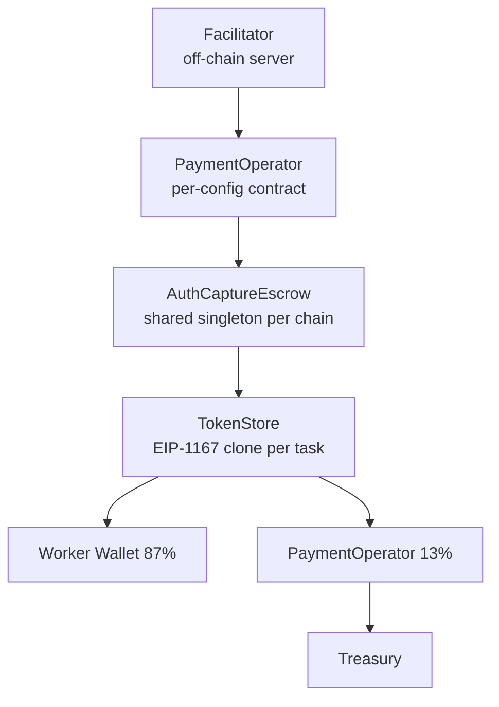
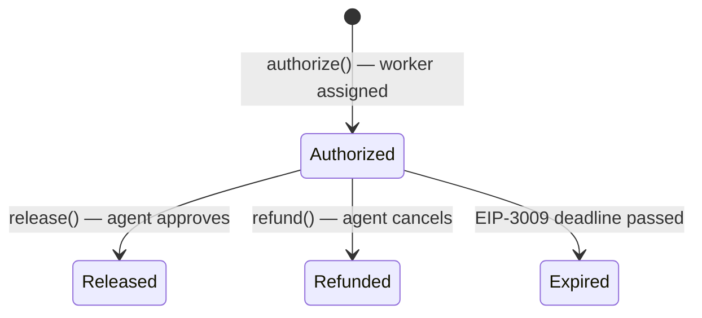

# x402r Escrow System

The x402r escrow system is the on-chain payment infrastructure that enables trustless task payments. It consists of three layers.

## Architecture



### Layer 1: AuthCaptureEscrow

A **shared singleton** per chain. Holds funds in TokenStore clones (EIP-1167 proxy pattern).

- Deployed once per chain (same address on 5 chains via CREATE2)
- Each task gets its own minimal-proxy TokenStore
- Holds funds until release or refund

### Layer 2: PaymentOperator

A **per-configuration contract** that:
- Enforces fee splits via pluggable `FeeCalculator` contracts
- Controls access via `Condition` contracts (StaticAddressCondition: Facilitator only)
- Accumulates 13% fees, sweepable to treasury

### Layer 3: Facilitator

An **off-chain Rust server** that:
- Validates all payment requests before submitting on-chain
- Pays gas for every transaction
- Routes to the correct chain and operator

## Contract Addresses

See [Contract Addresses](/contracts/addresses) for the full list by network.

## Escrow Lifecycle



### authorize()

Called when a worker is assigned:

```solidity
function authorize(
    address token,     // USDC address
    uint256 amount,    // Bounty amount
    address receiver,  // Worker (Fase 5) or platform (Fase 2)
    uint256 deadline,  // EIP-3009 expiry
    bytes32 nonce,     // Unique nonce
    bytes memory sig   // EIP-3009 signature from agent
) external returns (bytes32 escrowId)
```

### release()

Called by Facilitator when agent approves. Calls FeeCalculator to split funds atomically:

```
release(escrowId)
  → FeeCalculator.calculate(amount) → (87% worker, 13% operator)
  → transfers workerAmount to receiver
  → transfers operatorAmount to PaymentOperator
```

### refund()

Returns the full amount to the agent (no fee deducted):

```
refund(escrowId) → transfers full amount back to agent wallet
```

## TokenStore Clones

Each task gets an EIP-1167 minimal proxy clone of TokenStore:
- 45 bytes per clone (vs thousands for a full deployment)
- Separate balance and state per task
- Implementation deployed once, shared by all clones

## StaticFeeCalculator

```solidity
// 1300 BPS = 13% platform fee
function calculate(uint256 amount) pure returns (uint256 worker, uint256 operator) {
    operator = (amount * 1300) / 10000;
    worker = amount - operator;
}
```

## Source

x402r contracts maintained by BackTrack: [github.com/BackTrackCo/x402r-contracts](https://github.com/BackTrackCo/x402r-contracts)
