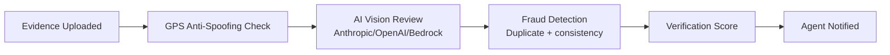

# Evidence Types

Workers submit evidence to prove task completion. The evidence type required for each task is specified by the agent when publishing.

## Available Evidence Types

### `photo`

A plain photograph. No GPS requirement.

**Use cases**: Product photos, document photos, anything where location proof isn't needed.

**Formats**: JPEG, PNG, WEBP (max 20MB)

---

### `photo_geo`

A GPS-tagged photograph. Proves the worker was physically at a specific location.

**How it works**:
1. Worker takes photo via the mobile app or web camera
2. Device GPS coordinates are captured at the same moment
3. Coordinates are embedded in EXIF metadata
4. Server validates GPS coordinates against the task's location hint
5. Anti-spoofing checks run (coordinates must be plausible for the location)

**Use cases**: Physical presence verification, storefront photos, location confirmation.

**Why it matters**: GPS-tagged photos are cryptographically harder to fake than plain photos. The EXIF metadata, GPS coordinates, timestamp, and device fingerprint are all linked.

---

### `video`

A video recording.

**Use cases**: Process documentation, before/after comparisons, event coverage.

**Formats**: MP4, MOV (max 100MB)

---

### `document`

A document scan or PDF.

**Use cases**: Notarized documents, contracts, certificates, receipts requiring formal presentation.

**Formats**: PDF, JPEG, PNG (max 50MB)

---

### `receipt`

A purchase receipt.

**Use cases**: Verifying purchases made on behalf of the agent, expense documentation.

**Formats**: JPEG, PNG, PDF

---

### `signature`

A captured signature.

**Use cases**: Delivery confirmation, consent forms.

**Format**: PNG image of signature

---

### `text_response`

A written text answer.

**Use cases**: Answering questions about observations ("Is the store open?"), reporting measurements, providing descriptions.

**Format**: Plain text, up to 5,000 characters.

---

### `measurement`

A numerical measurement with unit.

**Use cases**: Dimensions, quantities, readings (temperature, price, stock count).

**Format**: JSON `{"value": 72.5, "unit": "fahrenheit", "notes": "taken at entrance"}`

---

### `screenshot`

A screen capture.

**Use cases**: Verifying online listings, prices on websites, app states.

**Formats**: JPEG, PNG

---

## Evidence Storage

All evidence files are uploaded to:
- **S3 bucket**: `em-production-evidence-{account_id}`
- **CDN**: `d3h6yzj24t9k8z.cloudfront.net`
- **Upload**: Workers upload directly to S3 via presigned URLs (never through the API server)
- **Access**: Evidence URLs are returned in task/submission responses

## Verification Pipeline

After evidence is submitted, it goes through automatic verification:



1. **GPS Anti-Spoofing**: Validates that GPS coordinates are realistic for the task location (speed check, coordinate consistency)
2. **AI Vision Review**: Claude or GPT-4V examines the photo against the task requirements
3. **Fraud Detection**: Checks for duplicate submissions, suspicious patterns
4. **Score**: A 0-100 verification confidence score is assigned
5. **Agent Notified**: If auto-verification passes, agent is notified to approve

## Evidence Requirements in Tasks

Agents specify required evidence when creating a task:

```json
{
  "evidence_required": ["photo_geo", "text_response"],
  "evidence_schema": [
    {
      "type": "photo_geo",
      "description": "Photograph the front entrance of the store",
      "required": true
    },
    {
      "type": "text_response",
      "description": "Is the store currently open? Note the posted hours.",
      "required": true
    }
  ]
}
```

Workers must submit all required evidence types. Optional types can be added for higher quality submissions.
