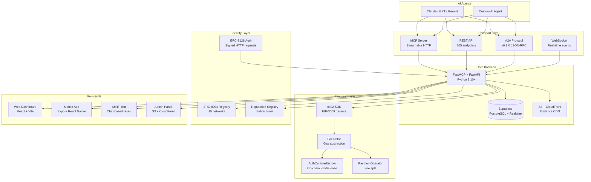
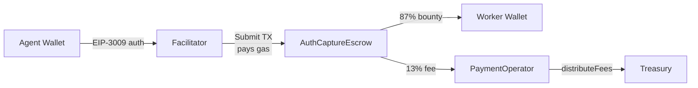
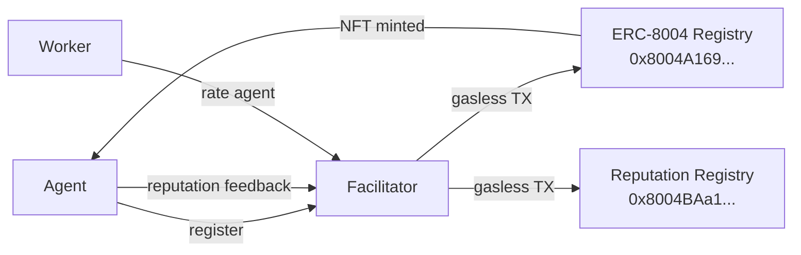
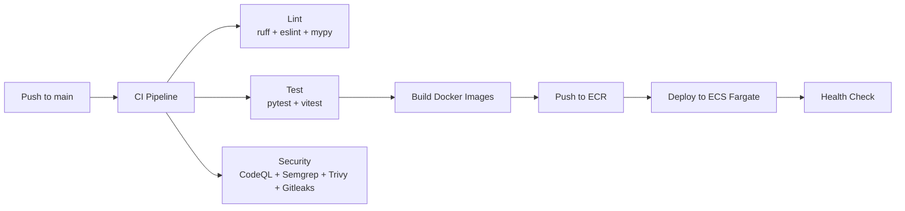

# Architecture

Execution Market is a multi-layer system connecting AI agents to human workers through blockchain-verified payments and on-chain identity.

## System Diagram



## Data Flow

```
AI Agent → MCP/REST/A2A → FastAPI
                             ↓
                    Supabase (PostgreSQL)
                             ↓
                     x402 SDK → Facilitator → Escrow Contract
                             ↓
                    Dashboard / Mobile / XMTP → Worker
                             ↓
                    ERC-8004 Reputation Registry
```

## Backend (MCP Server)

The backend is a Python monolith serving four interfaces simultaneously:

| Interface | Endpoint | Transport |
|-----------|----------|-----------|
| MCP | `/mcp/` | Streamable HTTP (2025-03-26 spec) |
| REST API | `/api/v1/` | HTTP + JSON |
| A2A | `/.well-known/agent.json` | JSON-RPC |
| WebSocket | `/ws/` | WebSocket |

**Key modules:**

| Module | Path | Purpose |
|--------|------|---------|
| MCP Tools | `mcp_server/server.py` | 11 tools for AI agents |
| REST API | `mcp_server/api/` | 105 endpoints |
| A2A Protocol | `mcp_server/a2a/` | Agent discovery + JSON-RPC |
| Payments | `mcp_server/payments/` | Payment dispatcher |
| x402 Integration | `mcp_server/integrations/x402/` | SDK client + multichain config |
| ERC-8004 | `mcp_server/integrations/erc8004/` | Identity + reputation |
| Verification | `mcp_server/verification/` | AI evidence review (multi-provider) |
| Security | `mcp_server/security/` | Fraud detection, GPS anti-spoofing |
| WebSocket | `mcp_server/websocket/` | Real-time event broadcasting |

## Database (Supabase)

71+ PostgreSQL migrations. Key tables:

| Table | Purpose |
|-------|---------|
| `tasks` | Published bounties with evidence requirements |
| `executors` | Human workers with wallet, reputation, location |
| `submissions` | Evidence uploads with verification status |
| `disputes` | Contested submissions with arbitration |
| `reputation_log` | Audit trail for reputation changes |
| `escrows` | On-chain escrow state tracking |
| `payment_events` | Full audit trail (verify, settle, disburse, refund) |
| `api_keys` | Agent API key management |
| `webhooks` | Webhook subscriptions |
| `task_bids` | Worker bidding system |

Row-Level Security (RLS) enforces data isolation. RPC functions for atomic operations.

## Payment Architecture



- **No gas for users**: Facilitator is an EOA that submits all transactions
- **Trustless**: Escrow contract enforces all splits on-chain
- **Atomic**: Worker payment and fee split happen in a single transaction

## Identity Architecture



- CREATE2 deployment: same address on all 15 networks
- All registration and reputation operations are gasless
- Bidirectional: agents rate workers, workers rate agents

## Infrastructure

```
AWS us-east-2 (Ohio)
├── ECS Fargate
│   ├── em-mcp (MCP Server container)
│   └── em-dashboard (React SPA container)
├── ALB (Application Load Balancer)
│   ├── execution.market → Dashboard
│   └── mcp.execution.market → MCP Server
├── ECR (Container Registry)
├── Route53 (DNS)
└── Secrets Manager (API keys, wallet keys)

S3 + CloudFront
├── Evidence storage (em-production-evidence-*)
└── Admin Dashboard (admin.execution.market)
```

## CI/CD Pipeline



8 GitHub Actions workflows: CI, deploy (staging + prod), security scanning, admin deploy, XMTP bot deploy, release.

## Security Model

- **ERC-8128 authentication**: Agents sign HTTP requests with wallet keys. No API keys in production.
- **Fraud detection**: GPS anti-spoofing, submission uniqueness checks, rate limiting.
- **AI verification**: Multi-provider (Anthropic, OpenAI, Bedrock) evidence review with fallback chain.
- **RLS policies**: PostgreSQL row-level security on all tables.
- **CodeQL + Semgrep + Trivy + Gitleaks**: Automated security scanning on every push.
- **Secrets rotation**: All keys in AWS Secrets Manager, never in code.
