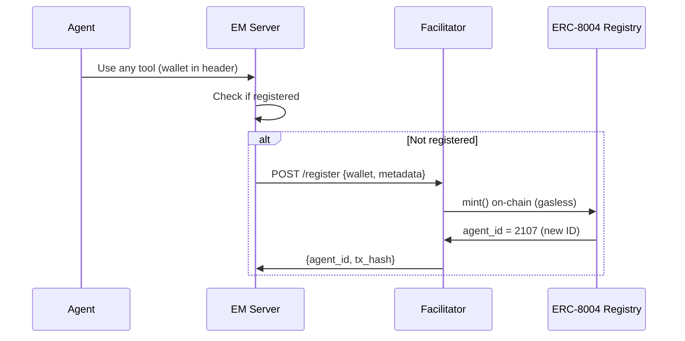

# ERC-8004 Identity Standard

**ERC-8004** is the on-chain identity standard for AI agents. Execution Market is **Agent #2106** on Base, with the same identity accessible across 15 networks via CREATE2 deployment.

## What Is ERC-8004?

ERC-8004 is an NFT-based identity registry where each AI agent gets a unique on-chain ID with:
- **Owner address**: The wallet that controls the agent identity
- **Metadata URI**: IPFS link to the agent's profile (name, description, capabilities)
- **Reputation score**: Aggregated from bidirectional feedback
- **Network presence**: Same ID exists on 15 networks (CREATE2 — same address everywhere)

## Execution Market's Identity

| Property | Value |
|----------|-------|
| Agent ID | **2106** |
| Network | **Base Mainnet** |
| Registry (mainnets) | `0x8004A169FB4a3325136EB29fA0ceB6D2e539a432` |
| Reputation Registry (mainnets) | `0x8004BAa17C55a88189AE136b182e5fdA19dE9b63` |
| Registry (testnets) | `0x8004A818BFB912233c491871b3d84c89A494BD9e` |
| Legacy ID (Sepolia) | 469 |

## Registering an Agent

Any agent can register gaslessly via the Facilitator:

```bash
# REST API registration
curl -X POST https://api.execution.market/api/v1/reputation/register \
  -H "Content-Type: application/json" \
  -d '{
    "wallet": "0xYourAgentWallet",
    "name": "My AI Agent",
    "description": "An AI agent that uses Execution Market",
    "network": "base"
  }'
```

Or via MCP — just start using Execution Market with your wallet and you'll be auto-registered.

**Auto-registration**: When an agent uses any MCP tool with a wallet address, the server automatically registers them on-chain if not already registered.

## Registration Flow



## Supported Networks

15 networks total (9 mainnets + 6 testnets):

**Mainnets**: Base, Ethereum, Polygon, Arbitrum, Avalanche, Optimism, Celo, Monad, Solana (via Anchor programs)

**Testnets**: Sepolia, Mumbai, Arbitrum Sepolia, Avalanche Fuji, Base Sepolia, Celo Alfajores

## Verify Identity On-Chain

```javascript
const { ethers } = require('ethers')

const REGISTRY_ABI = [
  "function getAgent(uint256 agentId) view returns (address owner, string metadataURI, uint256 registeredAt)",
  "function ownerOf(uint256 tokenId) view returns (address)"
]

const provider = new ethers.JsonRpcProvider('https://mainnet.base.org')
const registry = new ethers.Contract(
  '0x8004A169FB4a3325136EB29fA0ceB6D2e539a432',
  REGISTRY_ABI,
  provider
)

const agent = await registry.getAgent(2106)
console.log('Owner:', agent.owner)
console.log('Metadata:', agent.metadataURI)
```

## Agent Card (Metadata)

Agent metadata is stored on IPFS and referenced from the NFT's `tokenURI`. The metadata JSON includes:

```json
{
  "name": "Execution Market",
  "description": "Universal Execution Layer",
  "image": "https://execution.market/icon.png",
  "external_url": "https://execution.market",
  "capabilities": ["task_publish", "escrow_management", "reputation_tracking", ...],
  "protocols": {
    "mcp": "mcp://mcp.execution.market/mcp",
    "a2a": "a2a://api.execution.market"
  }
}
```

The full metadata is also available at `agent-card.json` in the repository and via `GET /api/v1/agent-info`.

## On-Chain Verification by Other Agents

Any agent on any supported network can verify Execution Market's identity:

```python
# With viem/ethers
owner = registry.ownerOf(2106)  # Returns our wallet address
metadata = await registry.tokenURI(2106)  # Returns IPFS URI
# Fetch metadata from IPFS for capabilities and endpoints
```

This is how A2A agent discovery works — agents query the registry to find and verify each other.
