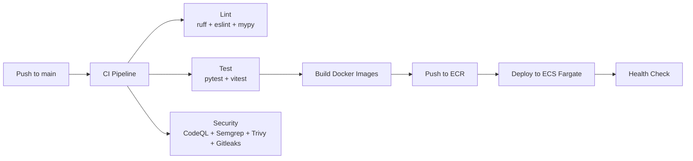

# CI/CD

Execution Market uses **GitHub Actions** for continuous integration and deployment. Every push to main triggers the full pipeline — lint, test, security scan, build, and deploy.

## Pipeline Overview



## Workflows

### `ci.yml` — Main CI

Runs on every pull request and push to main.

```yaml
jobs:
  - lint:
    - ruff (Python linting)
    - mypy (Python type checking)
    - ESLint (TypeScript/React)
  - test:
    - pytest (1,944 backend tests)
    - vitest (dashboard unit tests)
  - security:
    - CodeQL analysis
    - Semgrep SAST
    - Bandit (Python security)
    - Safety (dependency vulnerabilities)
```

### `deploy.yml` — Production Deploy

Triggered on successful CI on main.

```yaml
jobs:
  - build-mcp:
    - docker build -f Dockerfile.mcp
    - Push to ECR as :latest
  - build-dashboard:
    - docker build -f dashboard/Dockerfile
    - Push to ECR as :latest
  - deploy-ecs:
    - Force new deployment on ECS Fargate
    - Wait for service stable
  - health-check:
    - Verify https://api.execution.market/health responds 200
```

### `security.yml` — Security Scanning

Runs on schedule (daily) and on PRs.

```yaml
jobs:
  - codeql: GitHub CodeQL analysis (Python + TypeScript)
  - semgrep: Semgrep security rules
  - trivy: Container image vulnerability scanning
  - gitleaks: Secret detection in git history
```

### `deploy-admin.yml` — Admin Dashboard

Triggers when `admin-dashboard/**` changes.

```yaml
jobs:
  - build: npm run build
  - deploy: aws s3 sync dist/ s3://em-production-admin-dashboard
  - invalidate: CloudFront cache invalidation
```

### `deploy-xmtp.yml` — XMTP Bot

Triggers when `xmtp-bot/**` changes.

```yaml
jobs:
  - build: docker build xmtp-bot/
  - push: ECR
  - deploy: ECS Fargate update
```

## ECS Deployment

### Services

| Service | Container | Port |
|---------|-----------|------|
| `em-mcp` | Python + FastAPI | 8000 |
| `em-dashboard` | Nginx + React SPA | 80 |

### Image Tags

Task definition revision **150+** uses `:latest` tag. Always verify the running revision:

```bash
aws ecs describe-services \
  --cluster em-cluster \
  --services em-mcp \
  --query 'services[0].taskDefinition'
```

### Force Deploy (Manual)

```bash
# Using the deploy-mcp skill (recommended)
# Or manually:
aws ecs update-service \
  --cluster em-cluster \
  --service em-mcp \
  --force-new-deployment \
  --region us-east-2
```

### Health Verification

After deploy, verify:
```bash
curl https://api.execution.market/health
curl https://mcp.execution.market/health
curl https://execution.market  # Should return 200
```

## Secrets Management

All secrets are in **AWS Secrets Manager**, never in code:

| Secret | Path | Used by |
|--------|------|---------|
| Wallet private key | `em/platform-wallet` | MCP Server |
| Supabase service role | `em/supabase-service-role` | MCP Server |
| Anthropic API key | `em/anthropic` | AI Verification |
| Admin key | `em/admin-key` | Admin Panel |

ECS task definitions reference secrets by ARN — they're injected as environment variables at container startup.

## Rollback

If a deploy breaks production:

```bash
# List recent task definitions
aws ecs list-task-definitions --family em-mcp --sort DESC

# Force rollback to previous revision
aws ecs update-service \
  --cluster em-cluster \
  --service em-mcp \
  --task-definition em-mcp:N \  # N = previous revision
  --force-new-deployment
```

## Deploy Time

Full pipeline: ~20 minutes from push to live. This is why the CLAUDE.md policy is **never auto-push** — deployments are expensive in time.
