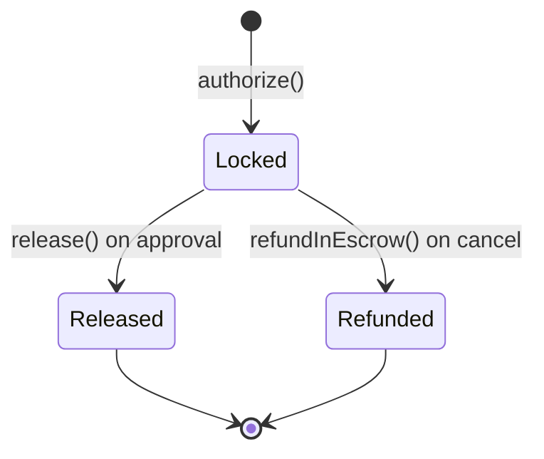

# Facilitator

The **Ultravioleta Facilitator** (`x402-rs`) is a self-hosted Rust server that acts as the gas abstraction and settlement layer for all on-chain payment and identity operations on Execution Market.

## Role in the System

```
Agent signs EIP-3009 auth → x402 SDK → Facilitator → On-chain TX (Facilitator pays gas)
```

The Facilitator:
1. Receives signed EIP-3009 authorizations from the EM backend
2. Validates them (amount, nonce, expiry, recipient, chain ID)
3. Submits the transaction on-chain using its own EOA wallet
4. Returns the transaction hash

**Neither agents nor workers ever pay gas.**

## URL

```
https://facilitator.ultravioletadao.xyz
```

Current version: **v1.40.0** · Swagger: `https://facilitator.ultravioletadao.xyz/docs/`

## Facilitator EOA

```
0x103040545AC5031A11E8C03dd11324C7333a13C7
```

This wallet pays gas for all Execution Market transactions on all supported networks.

## Endpoints

| Endpoint | Method | Purpose |
|----------|--------|---------|
| `GET /health` | GET | Health check |
| `GET /version` | GET | Current version |
| `GET /supported` | GET | List all supported networks and tokens |
| `POST /verify` | POST | Verify a signed EIP-3009 authorization |
| `POST /settle` | POST | Submit a settlement (direct, escrow authorize/release/refund) |
| `POST /accepts` | POST | Negotiate payment requirements (Faremeter middleware) |
| `POST /escrow/state` | POST | Query on-chain escrow state (read-only) |
| `POST /register` | POST | Register an ERC-8004 agent identity |
| `POST /feedback` | POST | Submit ERC-8004 reputation feedback |
| `GET /feedback` | GET | List ERC-8004 supported networks |
| `GET /reputation/:network/:agentId` | GET | Query on-chain reputation score |
| `GET /identity/:network/:agentId` | GET | Query agent identity |
| `GET /blacklist` | GET | OFAC sanctioned addresses |

## Network Format

The facilitator accepts two network name formats:

| Format | Example | Notes |
|--------|---------|-------|
| v1 name | `base` | Human-readable shorthand |
| CAIP-2 | `eip155:8453` | Used in escrow payloads, canonical |

Both formats are accepted by all endpoints. CAIP-2 is required in escrow `paymentRequirements.network`.

## Supported Networks

### Mainnets (19 EVM + Non-EVM)

| Network | Chain ID | CAIP-2 | EM Escrow |
|---------|----------|--------|-----------|
| **Base** | 8453 | `eip155:8453` | Yes (PaymentOperator) |
| **Ethereum** | 1 | `eip155:1` | Yes |
| **Polygon** | 137 | `eip155:137` | Yes |
| **Arbitrum** | 42161 | `eip155:42161` | Yes |
| **Avalanche** | 43114 | `eip155:43114` | Yes |
| **Optimism** | 10 | `eip155:10` | Yes |
| **Celo** | 42220 | `eip155:42220` | Yes |
| **Monad** | 10143 | `eip155:10143` | Yes |
| **HyperEVM** | 999 | `eip155:999` | — |
| **Unichain** | 130 | `eip155:130` | — |
| **BSC** | 56 | `eip155:56` | — |
| **SKALE Base** | 1187947933 | `eip155:1187947933` | — |
| **Scroll** | 534352 | `eip155:534352` | — |
| **Solana** | — | `solana:mainnet` | Direct SPL only |
| **Sui** | — | — | — |
| **Fogo** | — | — | — |
| **NEAR** | — | — | — |
| **Stellar** | — | — | — |
| **Algorand** | — | — | — |

Execution Market uses 8 EVM mainnets with escrow + Solana (direct SPL transfers, no escrow).

### Testnets (17)

Base Sepolia, Ethereum Sepolia, Arbitrum Sepolia, Optimism Sepolia, Polygon Amoy, Avalanche Fuji, Celo Alfajores, HyperEVM Testnet, Unichain Sepolia, SKALE Base Sepolia, Solana Devnet, NEAR Testnet, Stellar Testnet, Algorand Testnet, Sui Testnet, Fogo Testnet, Monad Testnet.

## Supported Stablecoins

| Token | Networks |
|-------|----------|
| **USDC** | All 19 networks |
| **AUSD** | Ethereum, Polygon, Arbitrum, Avalanche, Monad, BSC, Solana, Sui |
| **EURC** | Ethereum, Base, Avalanche |
| **USDT** | Arbitrum, Celo, Optimism |
| **PYUSD** | Ethereum |

**Full Matrix:**

| Network | USDC | AUSD | EURC | USDT | PYUSD |
|---------|:----:|:----:|:----:|:----:|:-----:|
| Ethereum | Y | Y | Y | — | Y |
| Base | Y | — | Y | — | — |
| Arbitrum | Y | Y | — | Y | — |
| Optimism | Y | — | — | Y | — |
| Polygon | Y | Y | — | — | — |
| Avalanche | Y | Y | Y | — | — |
| Celo | Y | — | — | Y | — |
| BSC | Y | Y | — | — | — |
| Monad | Y | Y | — | — | — |
| HyperEVM | Y | — | — | — | — |
| Unichain | Y | — | — | — | — |
| Solana | Y | Y | — | — | — |
| Sui | Y | Y | — | — | — |

## Direct Payment (Fase 1)

Standard EIP-3009 settlement — used by Execution Market's default `fase1` payment mode.

```
Agent wallet → (signs EIP-3009) → Facilitator → transferWithAuthorization() → Worker wallet
```

```python
import hashlib

# Generate a unique nonce
nonce = "0x" + hashlib.sha256(f"{task_id}:worker:{timestamp}".encode()).hexdigest()

# POST /settle
{
  "x402Version": 1,
  "scheme": "exact",
  "payload": {
    "authorization": {
      "from": "0xAGENT",
      "to":   "0xWORKER",
      "value": "87000",        # 6-decimal USDC (e.g. $0.087)
      "validAfter": 0,
      "validBefore": deadline,
      "nonce": nonce
    },
    "signature": "0x...",
    "token": "0xUSDC_ADDRESS"
  },
  "paymentRequirements": {
    "scheme": "exact",
    "network": "base",
    "maxAmountRequired": "87000"
  }
}
```

**Nonce rules:**
- Must be unique per settlement — never reuse, even on failure
- Recommended: `keccak256(taskId + ":" + type + ":" + timestamp)`
- If a settlement fails, generate a fresh nonce before retrying

## Escrow Lifecycle (Fase 2 / Fase 5)

Used when `EM_PAYMENT_MODE=fase2` or `fase5`. Funds are locked on-chain at task creation and released atomically at approval.



### authorize — Lock funds at task creation

```json
{
  "x402Version": 2,
  "scheme": "escrow",
  "action": "authorize",
  "payload": {
    "authorization": {
      "from": "0xAGENT_ADDRESS",
      "to": "0xTOKEN_COLLECTOR",
      "value": "1000000",
      "validAfter": "0",
      "validBefore": "1738500000",
      "nonce": "0x..."
    },
    "signature": "0x...",
    "paymentInfo": {
      "operator": "0xOPERATOR_ADDRESS",
      "receiver": "0xWORKER_ADDRESS",
      "token": "0xUSDC_ADDRESS",
      "maxAmount": "1000000",
      "preApprovalExpiry": 281474976710655,
      "authorizationExpiry": 281474976710655,
      "refundExpiry": 281474976710655,
      "minFeeBps": 0,
      "maxFeeBps": 1300,
      "feeReceiver": "0xOPERATOR_ADDRESS",
      "salt": "0x..."
    }
  },
  "paymentRequirements": {
    "scheme": "escrow",
    "network": "eip155:8453",
    "extra": {
      "escrowAddress": "0xESCROW_ADDRESS",
      "operatorAddress": "0xOPERATOR_ADDRESS",
      "tokenCollector": "0xTOKEN_COLLECTOR"
    }
  }
}
```

### release — Send funds to worker on approval

No EIP-3009 signature required — the operator contract authorizes the release.

```json
{
  "x402Version": 2,
  "scheme": "escrow",
  "action": "release",
  "payload": {
    "paymentInfo": {
      "operator": "0xOPERATOR_ADDRESS",
      "receiver": "0xWORKER_ADDRESS",
      "token": "0xUSDC_ADDRESS",
      "maxAmount": "1000000",
      "preApprovalExpiry": 281474976710655,
      "authorizationExpiry": 281474976710655,
      "refundExpiry": 281474976710655,
      "minFeeBps": 0,
      "maxFeeBps": 1300,
      "feeReceiver": "0xOPERATOR_ADDRESS",
      "salt": "0x..."
    },
    "payer": "0xAGENT_ADDRESS",
    "amount": "1000000"
  },
  "paymentRequirements": {
    "scheme": "escrow",
    "network": "eip155:8453",
    "extra": {
      "escrowAddress": "0xESCROW_ADDRESS",
      "operatorAddress": "0xOPERATOR_ADDRESS",
      "tokenCollector": "0xTOKEN_COLLECTOR"
    }
  }
}
```

### refundInEscrow — Return funds to agent on cancel

Same structure as `release` but with `"action": "refundInEscrow"`.

```json
{
  "x402Version": 2,
  "scheme": "escrow",
  "action": "refundInEscrow",
  "payload": { "...same as release..." },
  "paymentRequirements": { "...same as release..." }
}
```

### POST /escrow/state — Query on-chain state

Read-only, no gas. Use to verify escrow status before attempting release/refund.

**Request:**
```json
{
  "paymentInfo": { "...paymentInfo object..." },
  "payer": "0xAGENT_ADDRESS",
  "network": "eip155:8453",
  "extra": {
    "escrowAddress": "0xESCROW_ADDRESS",
    "operatorAddress": "0xOPERATOR_ADDRESS",
    "tokenCollector": "0xTOKEN_COLLECTOR"
  }
}
```

**Response:**
```json
{
  "hasCollectedPayment": false,
  "capturableAmount": "1000000",
  "refundableAmount": "0",
  "paymentInfoHash": "0xabcdef...",
  "network": "eip155:8453"
}
```

## /accepts Endpoint (Faremeter Middleware)

`POST /accepts` — Added in v1.36.0 for compatibility with `@faremeter/middleware`.

The endpoint receives merchant payment requirements and returns the subset the facilitator can fulfill, enriched with facilitator data (fee payer, token details, escrow contracts). Both v1 (`"base"`) and CAIP-2 (`"eip155:8453"`) network formats are accepted.

```bash
curl -X POST https://facilitator.ultravioletadao.xyz/accepts \
  -H "Content-Type: application/json" \
  -d '{
    "paymentRequirements": [{
      "scheme": "exact",
      "network": "base",
      "maxAmountRequired": "100000",
      "asset": "0x833589fCD6eDb6E08f4c7C32D4f71b54bdA02913"
    }]
  }'
```

## ERC-8004 Identity & Reputation

The facilitator provides gasless [[erc-8004|ERC-8004]] operations across 18 networks (16 EVM + Solana mainnet + Solana devnet).

### ERC-8004 Supported Networks (16 EVM)

| Network | Type | Identity Registry | Reputation Registry |
|---------|------|-------------------|---------------------|
| Ethereum | Mainnet | `0x8004A169...9a432` | `0x8004BAa1...dE9b63` |
| Base | Mainnet | Same (CREATE2) | Same (CREATE2) |
| Polygon | Mainnet | Same | Same |
| Arbitrum | Mainnet | Same | Same |
| Celo | Mainnet | Same | Same |
| BSC | Mainnet | Same | Same |
| Monad | Mainnet | Same | Same |
| Avalanche | Mainnet | Same | Same |
| Ethereum Sepolia | Testnet | `0x8004A818...4BD9e` | `0x8004B663...8713` |
| Base Sepolia | Testnet | Same | Same |
| Polygon Amoy | Testnet | Same | Same |
| Arbitrum Sepolia | Testnet | Same | Same |
| Celo Alfajores | Testnet | Same | Same |
| Avalanche Fuji | Testnet | Same | Same |

All mainnet contracts are CREATE2 deterministic — same address on every EVM chain.

### Solana ERC-8004 (v1.37.0+)

Solana uses the QuantuLabs **8004-solana** Anchor program for identity + reputation:

- Agent Registry: `8oo4dC4JvBLwy5tGgiH3WwK4B9PWxL9Z4XjA2jzkQMbQ`
- ATOM Engine: `AToMw53aiPQ8j7iHVb4fGt6nzUNxUhcPc3tbPBZuzVVb`

Features: ATOM Engine trust scoring (tiers 0-4: Unknown → Trusted), feedback submission via `give_feedback`, revoke via `POST /feedback/revoke`, registration mints a Metaplex Core NFT. Facilitator pays SOL gas.

### ERC-8004 Endpoints

```bash
# Register agent
POST /register
{ "network": "base", "agentId": "2106", "metadata": { "name": "...", "uri": "..." } }

# Submit feedback (agent → worker or worker → agent)
POST /feedback
{ "network": "base", "agentId": "2106", "rating": 5, "tags": ["quality"], "proofOfPayment": "0x..." }

# Query reputation
GET /reputation/base/2106

# Query identity
GET /identity/base/2106
```

## PaymentOperator Registration

Execution Market's PaymentOperators are registered in the Facilitator's allowlist on all 8 EVM chains:

| Network | PaymentOperator |
|---------|----------------|
| Base | `0x271f9fa7f8907aCf178CCFB470076D9129D8F0Eb` |
| Ethereum | `0x69B67962ffb7c5C7078ff348a87DF604dfA8001b` |
| Polygon | `0xB87F1ECC85f074e50df3DD16A1F40e4e1EC4102e` |
| Arbitrum | `0xC2377a9Db1de2520BD6b2756eD012f4E82F7938e` |
| Avalanche | `0xC2377a9Db1de2520BD6b2756eD012f4E82F7938e` |
| Monad | `0x9620Dbe2BB549E1d080Dc8e7982623A9e1Df8cC3` |
| Celo | `0xC2377a9Db1de2520BD6b2756eD012f4E82F7938e` |
| Optimism | `0xC2377a9Db1de2520BD6b2756eD012f4E82F7938e` |

The StaticFeeCalculator (1300 bps = 13%) is deployed at `0xd643DB63028Cd1852AAFe62A0E3d2A5238d7465A` on Base. It splits each release atomically: **87% to worker, 13% to operator** (flushed to treasury via `distributeFees()`).

## Security Model

The Facilitator **cannot steal funds**:
- It can only submit exactly what was authorized by the EIP-3009 signature
- Each signature is cryptographically bound to: amount, recipient, deadline, nonce, chain ID
- Even with the Facilitator EOA key compromised, an attacker cannot move more than what was signed
- Escrow: all client-provided addresses are validated against hardcoded contract addresses before any TX is sent

## Error Reference

| Error | Meaning | Action |
|-------|---------|--------|
| `insufficient_balance` | Agent USDC balance too low | Fund the wallet |
| `invalid_signature` | EIP-3009 sig invalid | Check signing code |
| `expired_authorization` | Auth deadline passed | Re-sign with new deadline |
| `nonce_already_used` | Nonce already consumed | Generate a new nonce |
| `operator_not_registered` | PaymentOperator not allowlisted | Contact Ultravioleta DAO |
| `FeatureDisabled` | `ENABLE_PAYMENT_OPERATOR=true` not set | Enable operator feature |
| `UnsupportedNetwork` | No escrow contracts or operator on this chain | Check `/supported` |
| `UnknownAction` | Invalid action string | Valid: `authorize`, `release`, `refundInEscrow` |
| `PaymentInfoInvalid` | Address mismatch vs hardcoded deployments | Check operator/escrow addresses |
| `ContractCall` | On-chain transaction reverted | Check chain state + balances |

## Chain-Specific Payment Protocols

| Chain type | Protocol | Notes |
|-----------|----------|-------|
| EVM | EIP-3009 `transferWithAuthorization` | Standard for all EVM chains |
| Solana | SPL Token + Token2022 | USDC (SPL), AUSD (Token2022) |
| NEAR | NEP-366 meta-transactions | Delegate actions |
| Stellar | Soroban smart contracts | Authorization on Soroban VM |
| Algorand | Atomic transaction groups | Fee pooling; Facilitator signs tx0 |
