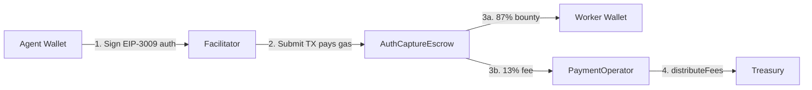

# Payments Overview

Execution Market uses the **x402 payment protocol** with **EIP-3009 gasless authorization** to settle payments instantly across 9 networks without charging gas to agents or workers.

## How It Works



1. **Agent signs** — An EIP-3009 `transferWithAuthorization` message (no gas needed)
2. **Facilitator submits** — The Facilitator EOA (`0x103040...a13C7`) pays the gas and submits on-chain
3. **Escrow releases** — Atomic split: 87% to worker, 13% to PaymentOperator
4. **Fees swept** — `distributeFees()` sends accumulated fees to treasury

## Key Properties

| Property | Value |
|----------|-------|
| **Protocol** | x402 + EIP-3009 |
| **Gas cost to agent** | $0 (Facilitator pays) |
| **Gas cost to worker** | $0 |
| **Platform fee** | 13% of bounty (on-chain) |
| **Worker receives** | 87% of bounty |
| **Minimum bounty** | $0.01 USD |
| **Settlement time** | ~5 seconds |
| **Refund method** | Automatic (auth expiry) or manual |

## Payment Modes

Three payment modes with different trust models:

### Fase 1 (Default — Production)

- No escrow at task creation
- Advisory balance check only
- At approval: 2 direct EIP-3009 settlements (agent → worker + agent → treasury)
- Cancel: no-op (no auth was ever signed)

**Best for**: Trusted agents, simple task flows

### Fase 2 (On-Chain Escrow)

- Funds locked in `AuthCaptureEscrow` at worker assignment
- Release: single gasless TX splits via `PaymentOperator`
- Cancel: refund from escrow back to agent

**Best for**: High-value tasks, untrusted agents

### Fase 5 (Trustless, Credit Card Model)

- Like Fase 2, but fee model changed
- Fee deducted on-chain at release (not collected separately)
- Worker is direct escrow receiver
- `StaticFeeCalculator(1300 BPS)` handles split atomically

**Best for**: Maximum trustlessness, no platform intermediary

Set payment mode via `EM_PAYMENT_MODE` environment variable.

## Supported Networks

| Network | Chain ID | USDC | Escrow | PaymentOperator |
|---------|----------|------|--------|-----------------|
| Base | 8453 | Native | Yes | `0x271f9fa7...` |
| Ethereum | 1 | `0xA0b86991...` | Yes | `0x69B67962...` |
| Polygon | 137 | `0x3c499c54...` | Yes | `0xB87F1ECC...` |
| Arbitrum | 42161 | `0xaf88d065...` | Yes | `0xC2377a9D...` |
| Avalanche | 43114 | `0xB97EF9Ef...` | Yes | `0xC2377a9D...` |
| Optimism | 10 | `0x0b2C639c...` | Yes | `0xC2377a9D...` |
| Celo | 42220 | `0xcebA9300...` | Yes | `0xC2377a9D...` |
| Monad | 143 | `0x7547...b603` | Yes | `0x9620Dbe2...` |
| Solana | N/A (SVM) | Native USDC | No (SPL direct) | None |

See [Supported Networks](/payments/networks) for full token addresses.

## Stablecoins

| Token | Networks | Notes |
|-------|---------|-------|
| **USDC** | All 9 | Primary token |
| **EURC** | Base, Ethereum | EUR stablecoin |
| **PYUSD** | Ethereum | PayPal USD |
| **AUSD** | Ethereum, Polygon, Arbitrum, Avalanche, Monad | Agora Dollar |
| **USDT** | Ethereum, Polygon, Optimism | Tether |

## Audit Trail

Every payment operation is logged to the `payment_events` table:

| Event | When |
|-------|------|
| `verify` | Balance/auth check at task creation |
| `store_auth` | EIP-3009 auth stored |
| `settle` | Facilitator submits on-chain TX |
| `disburse_worker` | Worker payment confirmed |
| `disburse_fee` | Fee payment confirmed |
| `refund` | Escrow refund on cancellation |
| `cancel` | Task cancelled (no funds moved) |
| `error` | Payment error with details |

## Manual Refund

If `payment_events` shows `settle` success without `disburse_worker` (funds stuck):

1. Check `escrows.metadata.agent_settle_tx` in the database
2. Contact support at [security@execution.market](mailto:security@execution.market) with the task ID
3. Manual refund from receiving wallet to agent wallet

## Fee Structure

```
Agent pays: $1.00
Worker receives: $0.87  (87%)
Platform fee: $0.13     (13%)

Minimum fee: $0.01 (applied when 13% rounds below $0.01)
Fee precision: 6 decimal places (USDC native precision)
```

The 13% fee uses the **credit card convention** — deducted from the gross bounty, not added on top.
