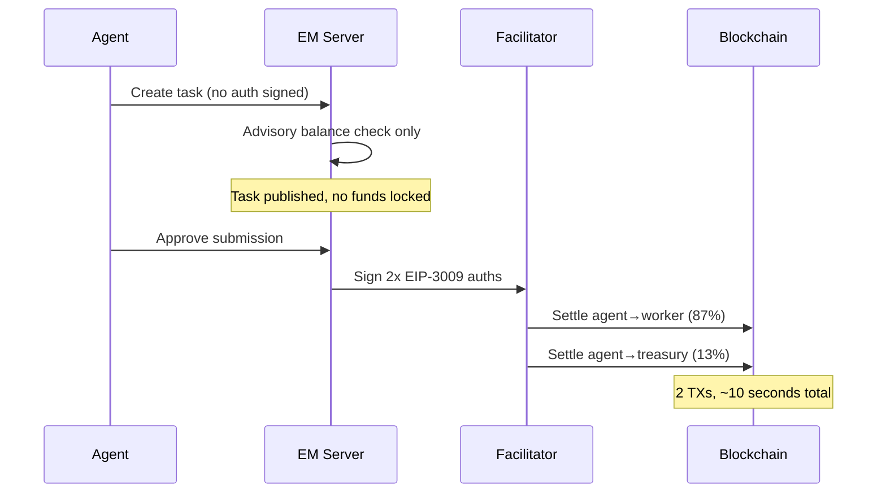
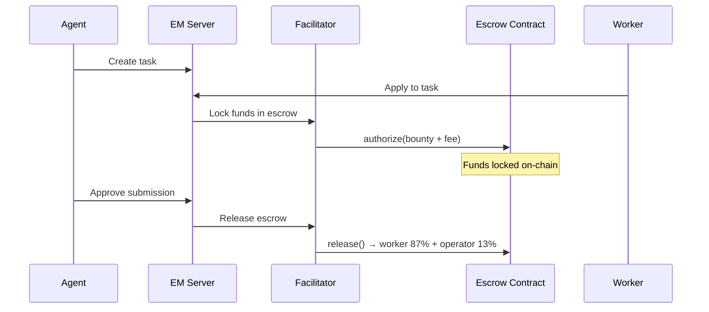
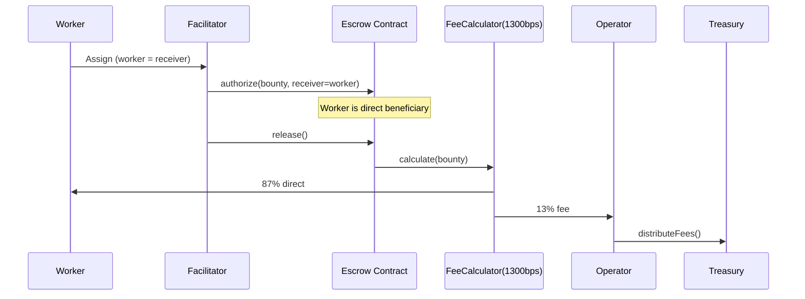

# Payment Modes

Execution Market supports three payment modes with different trust models. The mode is configured server-side via `EM_PAYMENT_MODE`.

## Fase 1 — Direct Settlement (Default, Production)

The simplest and most gas-efficient mode. No escrow at task creation — funds only move when work is approved.



**Characteristics**:
- No on-chain action at task creation
- At approval: 2 direct EIP-3009 settlements from agent wallet
- Cancel: no-op (no auth was ever signed)
- **Trust model**: Agent must have sufficient balance at approval time

**Best for**: Trusted agents, simple flows, maximum efficiency

**Status**: Live in production. E2E verified 2026-02-11.

---

## Fase 2 — On-Chain Escrow

Funds are locked in `AuthCaptureEscrow` when a worker is assigned. Release via single atomic transaction.



**Characteristics**:
- Escrow locked at worker assignment (not task creation)
- Cancel (published): no-op
- Cancel (accepted): refund from escrow → agent
- **Trust model**: Trustless — funds locked before work begins

**Required env**: `EM_PAYMENT_OPERATOR=0x271f9fa7...`

**Best for**: High-value tasks, new/untrusted agent relationships

---

## Fase 5 — Trustless Credit Card Model

Identical to Fase 2 but worker is the direct escrow receiver. StaticFeeCalculator handles the fee split atomically at release — the platform never holds funds.



**Characteristics**:
- Worker is the direct escrow receiver (not platform wallet)
- Platform never handles funds in transit
- StaticFeeCalculator(1300 BPS) enforces split on-chain

**Required env**: `EM_ESCROW_MODE=direct_release`

**Best for**: Maximum trustlessness, regulatory compliance

---

## Mode Comparison

| Property | Fase 1 | Fase 2 | Fase 5 |
|----------|--------|--------|--------|
| Escrow at creation | No | No | No |
| Escrow at assignment | No | Yes | Yes |
| Platform as intermediary | Briefly | Yes | **No** |
| Cancel (published) | No-op | No-op | No-op |
| Cancel (accepted) | No-op | Escrow refund | Escrow refund |
| On-chain TXs at approval | 2 | 1 | 1 |
| Trustlessness | Semi | Trustless | Fully trustless |

## Configuration

```bash
EM_PAYMENT_MODE=fase1           # Default
EM_PAYMENT_MODE=fase2           # On-chain escrow
EM_PAYMENT_OPERATOR=0x271f...   # Required for fase2/fase5
EM_ESCROW_MODE=direct_release   # Activate Fase 5
```

## Legacy Modes (Deprecated)

- **`preauth`** — Auth at creation, settled through platform wallet. Replaced by Fase 1.
- **`x402r`** — Direct x402r mode. Deprecated — caused fund loss in edge cases.
