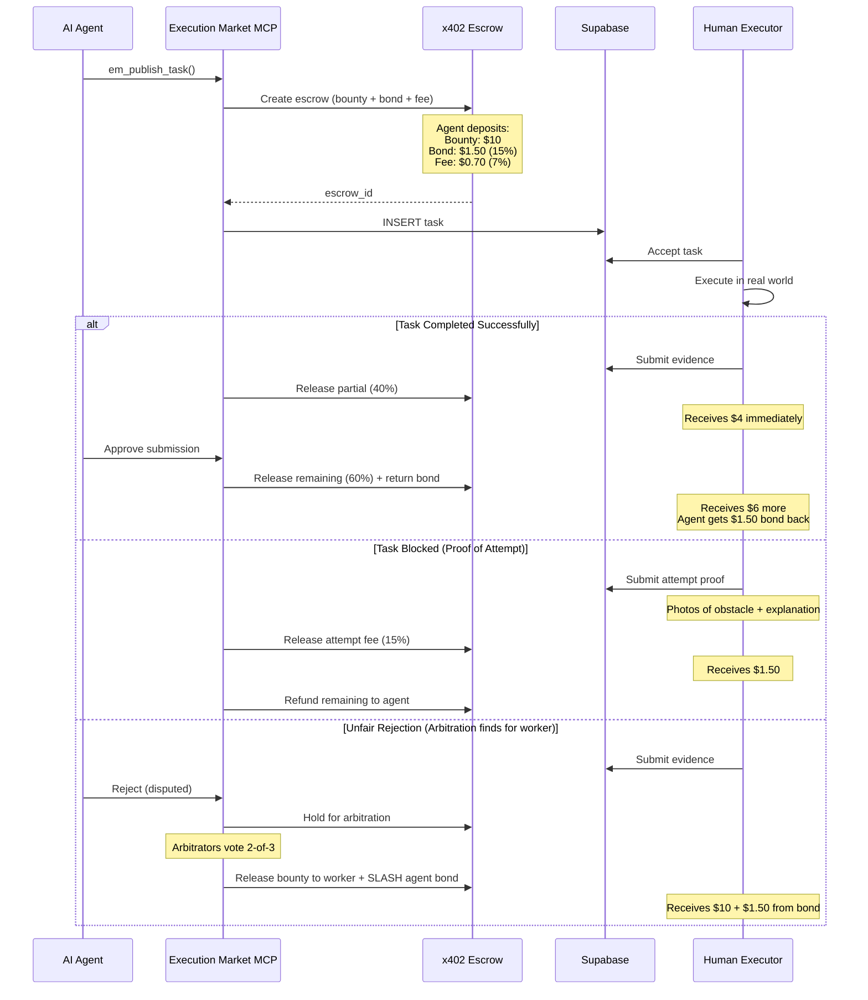

# Execution Market: Technical Architecture Document

> **Version**: 3.0.0
> **Last Updated**: 2026-01-24
> **Status**: Implementation in progress (MVP Phase)
> **Source**: Consolidated from SPEC.md, PLAN.md, V35 Article, Grok Brainstorming, Gemini Analysis, Dashboard Review

---

## Table of Contents

1. [System Overview](#1-system-overview)
2. [Component Architecture](#2-component-architecture)
3. [Data Models](#3-data-models)
4. [Payment Flows](#4-payment-flows)
5. [Verification System](#5-verification-system)
6. [Reputation System](#6-reputation-system)
7. [Worker Protection Mechanisms](#7-worker-protection-mechanisms)
8. [Integration Points](#8-integration-points)
9. [Deployment Architecture](#9-deployment-architecture)
10. [Security Considerations](#10-security-considerations)
11. [Bootstrap & Adoption Strategy](#11-bootstrap--adoption-strategy-new---from-grok-feedback) *(NEW v3.0)*
12. [Discovery/Auction Pricing](#12-discoveryauction-pricing-new---from-grok-feedback) *(NEW v3.0)*
13. [Goods Liability Insurance Pool](#13-goods-liability-insurance-pool-new---from-gemini-critique) *(NEW v3.0)*
14. [Hybrid Human-Robot Architecture](#14-hybrid-human-robot-architecture-new---from-grok-feedback) *(NEW v3.0)*
15. [Dashboard Implementation Status](#15-dashboard-implementation-status-new) *(NEW v3.0)*
16. [API Specification](#16-api-specification)

---

## 1. System Overview

### 1.1 Vision

Execution Market is the **Universal Execution Layer** - infrastructure that enables AI agents to contract executors (humans today, robots tomorrow) for tasks requiring physical presence, human authority, or specialized access.

**Key Framing** (from Grok analysis):
- **NOT** a full-time employment replacement
- **IS** a flexible side hustle / extra income option
- **Temporary bridge** during AI disruption (2-5 years window)
- **Optional** - tasks find you, you take them if you want

### 1.2 High-Level Architecture

```
┌─────────────────────────────────────────────────────────────────────────────────────────┐
│                              EXECUTION MARKET UNIVERSAL EXECUTION LAYER                            │
├─────────────────────────────────────────────────────────────────────────────────────────┤
│                                                                                          │
│  ┌─────────────────┐     ┌─────────────────────────────────────────┐     ┌───────────┐ │
│  │   AI AGENTS     │     │              EXECUTION MARKET CORE                 │     │ EXECUTORS │ │
│  │   (Requesters)  │     │                                         │     │           │ │
│  │                 │     │  ┌─────────────────────────────────────┐│     │ ┌───────┐ │ │
│  │ ┌─────────────┐ │     │  │           MCP SERVER               ││     │ │HUMANS │ │ │
│  │ │  Colmena    │─┼────►│  │  - em_publish_task             ││◄────┼─│ Web   │ │ │
│  │ │  Foragers   │ │     │  │  - em_get_tasks                ││     │ │ Mobile│ │ │
│  │ └─────────────┘ │     │  │  - em_check_submission         ││     │ └───────┘ │ │
│  │                 │     │  │  - em_approve_submission       ││     │           │ │
│  │ ┌─────────────┐ │     │  │  - em_cancel_task              ││     │ ┌───────┐ │ │
│  │ │  Council    │─┼────►│  └─────────────────────────────────────┘│     │ │ROBOTS │ │ │
│  │ │ Orchestrator│ │     │                   │                     │     │ │(Future│ │ │
│  │ └─────────────┘ │     │                   ▼                     │     │ └───────┘ │ │
│  │                 │     │  ┌─────────────────────────────────────┐│     │           │ │
│  │ ┌─────────────┐ │     │  │         SUPABASE BACKEND           ││     │ ┌───────┐ │ │
│  │ │ Any A2A     │─┼────►│  │  PostgreSQL + PostGIS + RLS        ││     │ │AI     │ │ │
│  │ │ Agent       │ │     │  │  Realtime Subscriptions            ││     │ │AGENTS │ │ │
│  │ └─────────────┘ │     │  │  Storage (Evidence)                ││     │ │(A2A)  │ │ │
│  └─────────────────┘     │  └─────────────────────────────────────┘│     │ └───────┘ │ │
│                          │                   │                     │     └───────────┘ │
│                          │                   ▼                     │                   │
│                          │  ┌─────────────────────────────────────┐│                   │
│                          │  │       PAYMENT & VERIFICATION        ││                   │
│                          │  │                                     ││                   │
│                          │  │  ┌───────────┐   ┌───────────────┐ ││                   │
│                          │  │  │  x402/    │   │  ChainWitness │ ││                   │
│                          │  │  │  x402r    │   │  (Evidence    │ ││                   │
│                          │  │  │  Escrow   │   │   Notary)     │ ││                   │
│                          │  │  └───────────┘   └───────────────┘ ││                   │
│                          │  │                                     ││                   │
│                          │  │  ┌───────────┐   ┌───────────────┐ ││                   │
│                          │  │  │Superfluid │   │   ERC-8004    │ ││                   │
│                          │  │  │ Streaming │   │  + Bayesian   │ ││                   │
│                          │  │  └───────────┘   └───────────────┘ ││                   │
│                          │  └─────────────────────────────────────┘│                   │
│                          └─────────────────────────────────────────┘                   │
│                                                                                          │
└─────────────────────────────────────────────────────────────────────────────────────────┘
```

### 1.3 Core Technology Stack

| Component | Technology | Purpose |
|-----------|------------|---------|
| **MCP Server** | Python + FastMCP + Pydantic v2 | AI agent interface via Model Context Protocol |
| **Database** | Supabase (PostgreSQL + PostGIS) | Task storage, geospatial queries, realtime |
| **Dashboard** | React 18 + TypeScript + Vite + Tailwind | Executor (human) interface |
| **Auth** | Supabase Auth + Anonymous + Wallet | Multi-modal authentication |
| **Payments** | x402-rs + x402r + Superfluid | Escrow, refunds, streaming |
| **Evidence** | Supabase Storage + ChainWitness | File storage + on-chain notarization |
| **Reputation** | ERC-8004 + Bayesian Layer | Bidirectional on-chain reputation + aggregation |
| **Wallet** | wagmi + WalletConnect + Crossmint | Multi-chain + email-based wallets |
| **i18n** | react-i18next | Spanish/English localization |

---

## 2. Component Architecture

### 2.1 MCP Server (`mcp_server/`)

The MCP (Model Context Protocol) server is the primary interface for AI agents.

```
mcp_server/
├── server.py           # FastMCP server with 6 tools
├── models.py           # Pydantic v2 validation models
├── supabase_client.py  # Database operations
├── __init__.py
└── pyproject.toml      # Package configuration
```

#### 2.1.1 Agent Tools (IMPLEMENTED)

These 6 tools are currently implemented for AI agents to publish and manage tasks:

```python
@mcp.tool(name="em_publish_task")
async def em_publish_task(params: PublishTaskInput) -> str:
    """Create escrow (bounty + agent_bond), publish task, return task_id"""

@mcp.tool(name="em_get_tasks")
async def em_get_tasks(params: GetTasksInput) -> str:
    """List tasks with filters (agent_id, status, category)"""

@mcp.tool(name="em_get_task")
async def em_get_task(params: GetTaskInput) -> str:
    """Get details of specific task"""

@mcp.tool(name="em_check_submission")
async def em_check_submission(params: CheckSubmissionInput) -> str:
    """Check submission status, retrieve evidence"""

@mcp.tool(name="em_approve_submission")
async def em_approve_submission(params: ApproveSubmissionInput) -> str:
    """Approve/dispute submission, release/hold payment, handle partial payouts"""

@mcp.tool(name="em_cancel_task")
async def em_cancel_task(params: CancelTaskInput) -> str:
    """Cancel unpublished task, refund escrow + agent_bond"""
```

#### 2.1.2 Worker Tools (NOT IMPLEMENTED - TODO)

These tools are needed for AI agents acting on behalf of workers:

```python
# TODO: Implement these tools
@mcp.tool(name="em_apply_to_task")
async def em_apply_to_task(...) -> str:
    """Worker applies to available task"""

@mcp.tool(name="em_submit_work")
async def em_submit_work(...) -> str:
    """Worker submits evidence, triggers partial payout"""

@mcp.tool(name="em_get_my_tasks")
async def em_get_my_tasks(...) -> str:
    """Worker views assigned/completed tasks"""

@mcp.tool(name="em_withdraw_earnings")
async def em_withdraw_earnings(...) -> str:
    """Worker withdraws to wallet or off-ramp"""
```

See TODO_MASTER.md items #11, #11b, #11c, #11d for implementation details.

### 2.2 React Dashboard (`dashboard/`)

```
dashboard/
├── src/
│   ├── App.tsx
│   ├── components/
│   │   ├── TaskCard.tsx
│   │   ├── TaskList.tsx
│   │   ├── TaskDetail.tsx
│   │   ├── SubmissionForm.tsx
│   │   ├── AuthModal.tsx
│   │   ├── LanguageSwitcher.tsx
│   │   ├── WalletSelector.tsx        # NEW: Email wallet + MetaMask + WalletConnect
│   │   ├── EarningsPanel.tsx         # NEW: Track earnings + pending
│   │   ├── ReputationBadge.tsx       # NEW: Bayesian score display
│   │   └── CategoryFilter.tsx
│   ├── hooks/
│   │   ├── useTasks.ts
│   │   ├── useAuth.ts
│   │   └── useBayesianScore.ts       # NEW: Calculate local Bayesian score
│   ├── lib/
│   │   ├── supabase.ts
│   │   ├── wagmi.ts
│   │   ├── crossmint.ts              # NEW: Email-based wallets
│   │   └── i18n.ts
│   └── types/
│       └── database.ts
```

---

## 3. Data Models

### 3.1 Database Schema (PostgreSQL)

```sql
-- Enable PostGIS for geospatial queries
CREATE EXTENSION IF NOT EXISTS postgis;

-- ============== ENUMS ==============

CREATE TYPE task_category AS ENUM (
  'physical_presence',
  'knowledge_access',
  'human_authority',
  'simple_action',
  'digital_physical'
);

CREATE TYPE task_status AS ENUM (
  'published', 'accepted', 'in_progress', 'submitted',
  'verifying', 'completed', 'disputed', 'expired', 'cancelled'
);

CREATE TYPE evidence_type AS ENUM (
  'photo', 'photo_geo', 'video', 'document', 'receipt',
  'signature', 'notarized', 'timestamp_proof',
  'text_response', 'measurement', 'screenshot'
);

-- ============== CORE TABLES ==============

CREATE TABLE executors (
  id UUID PRIMARY KEY DEFAULT gen_random_uuid(),
  user_id UUID REFERENCES auth.users(id) ON DELETE SET NULL,
  wallet_address TEXT NOT NULL UNIQUE,

  -- Profile
  display_name TEXT,
  bio TEXT,
  avatar_url TEXT,

  -- Geospatial (PostGIS)
  default_location GEOGRAPHY(POINT),

  -- Raw Reputation Data (for Bayesian calculation)
  tasks_completed INTEGER NOT NULL DEFAULT 0,
  tasks_disputed INTEGER NOT NULL DEFAULT 0,
  total_earnings_usd NUMERIC(12,2) DEFAULT 0,

  -- Calculated Bayesian Score (updated by trigger/job)
  bayesian_score NUMERIC(5,2) DEFAULT 50.0 CHECK (bayesian_score >= 0 AND bayesian_score <= 100),

  -- On-chain identity
  erc8004_id TEXT,

  -- Timestamps
  created_at TIMESTAMPTZ NOT NULL DEFAULT NOW(),
  last_active_at TIMESTAMPTZ,

  CONSTRAINT valid_wallet_format CHECK (wallet_address ~ '^0x[a-fA-F0-9]{40}$')
);

CREATE TABLE tasks (
  id UUID PRIMARY KEY DEFAULT gen_random_uuid(),
  agent_id TEXT NOT NULL,

  -- Content
  category task_category NOT NULL,
  title TEXT NOT NULL,
  instructions TEXT NOT NULL,

  -- Geospatial
  location GEOGRAPHY(POINT),
  location_radius_km NUMERIC(5,2),
  location_hint TEXT,

  -- Evidence requirements
  evidence_schema JSONB NOT NULL,

  -- Payment
  bounty_usd NUMERIC(10,2) NOT NULL CHECK (bounty_usd > 0),
  payment_token TEXT NOT NULL DEFAULT 'USDC',
  escrow_id TEXT,

  -- Agent Bond (NEW - from Grok feedback)
  agent_bond_usd NUMERIC(10,2) DEFAULT 0,  -- 10-20% extra, slashed on unfair rejection
  agent_bond_escrow_id TEXT,

  -- Partial Payout (NEW - from Grok feedback)
  partial_payout_percent INTEGER DEFAULT 0,  -- 30-50% paid on submission
  partial_payout_released BOOLEAN DEFAULT false,

  -- Timing
  deadline TIMESTAMPTZ NOT NULL,

  -- Requirements
  min_reputation INTEGER NOT NULL DEFAULT 0,

  -- State
  status task_status NOT NULL DEFAULT 'published',
  executor_id UUID REFERENCES executors(id),

  -- Timestamps
  created_at TIMESTAMPTZ NOT NULL DEFAULT NOW(),
  updated_at TIMESTAMPTZ NOT NULL DEFAULT NOW(),
  accepted_at TIMESTAMPTZ,
  completed_at TIMESTAMPTZ
);

CREATE TABLE submissions (
  id UUID PRIMARY KEY DEFAULT gen_random_uuid(),
  task_id UUID NOT NULL REFERENCES tasks(id) ON DELETE CASCADE,
  executor_id UUID NOT NULL REFERENCES executors(id),

  -- Evidence
  evidence JSONB NOT NULL,
  evidence_ipfs_cid TEXT,

  -- Verification
  auto_check_passed BOOLEAN,
  ai_verification_score NUMERIC(3,2),
  agent_verdict TEXT CHECK (agent_verdict IN ('accepted', 'disputed', 'more_info_requested')),
  agent_notes TEXT,

  -- Proof of Attempt (NEW - from Grok feedback)
  is_proof_of_attempt BOOLEAN DEFAULT false,
  attempt_reason TEXT,  -- Why task couldn't be completed
  attempt_payout_usd NUMERIC(10,2) DEFAULT 0,

  -- ChainWitness
  chainwitness_proof TEXT,

  -- Payment
  payment_tx TEXT,
  paid_at TIMESTAMPTZ,

  -- Timestamps
  submitted_at TIMESTAMPTZ NOT NULL DEFAULT NOW(),
  verified_at TIMESTAMPTZ
);

-- Reputation Feedback (for Bayesian calculation)
CREATE TABLE reputation_feedback (
  id UUID PRIMARY KEY DEFAULT gen_random_uuid(),

  -- Who is being rated
  target_type TEXT NOT NULL CHECK (target_type IN ('executor', 'agent')),
  target_id TEXT NOT NULL,  -- executor UUID or agent wallet

  -- Who is rating
  rater_type TEXT NOT NULL CHECK (rater_type IN ('executor', 'agent')),
  rater_id TEXT NOT NULL,

  -- Rating details
  task_id UUID REFERENCES tasks(id),
  score INTEGER NOT NULL CHECK (score >= 0 AND score <= 100),
  task_value_usd NUMERIC(10,2) NOT NULL,  -- For weighting

  -- Context tags (NEW - for appeals)
  tags TEXT[] DEFAULT '{}',  -- e.g., ['delayed-traffic', 'weather-issue']

  -- Timestamps
  created_at TIMESTAMPTZ NOT NULL DEFAULT NOW(),

  -- For decay calculation
  months_old INTEGER GENERATED ALWAYS AS (
    EXTRACT(MONTH FROM AGE(NOW(), created_at))
  ) STORED
);

-- Agent Reputation (bidirectional)
CREATE TABLE agent_reputation (
  agent_id TEXT PRIMARY KEY,
  tasks_published INTEGER DEFAULT 0,
  tasks_completed INTEGER DEFAULT 0,
  unfair_rejections INTEGER DEFAULT 0,
  avg_payment_time_hours NUMERIC(5,2) DEFAULT 0,
  bayesian_score NUMERIC(5,2) DEFAULT 50.0,
  total_bond_slashed_usd NUMERIC(12,2) DEFAULT 0,
  created_at TIMESTAMPTZ DEFAULT NOW()
);

-- ============== INDEXES ==============

CREATE INDEX idx_tasks_status ON tasks(status);
CREATE INDEX idx_tasks_category ON tasks(category);
CREATE INDEX idx_tasks_agent_id ON tasks(agent_id);
CREATE INDEX idx_tasks_location ON tasks USING GIST(location);
CREATE INDEX idx_executors_bayesian ON executors(bayesian_score DESC);
CREATE INDEX idx_feedback_target ON reputation_feedback(target_type, target_id);
CREATE INDEX idx_feedback_months ON reputation_feedback(months_old);
```

---

## 4. Payment Flows

### 4.1 Payment Architecture with Worker Protection

```
┌─────────────────────────────────────────────────────────────────────────────┐
│                    EXECUTION MARKET PAYMENT ARCHITECTURE V2                            │
├─────────────────────────────────────────────────────────────────────────────┤
│                                                                              │
│  ┌─────────────────────────────────────────────────────────────────────┐   │
│  │                    AGENT DEPOSITS                                    │   │
│  │                                                                      │   │
│  │  Bounty ($X)          Agent Bond (10-20%)        Platform Fee (13%) │   │
│  │  ────────────         ─────────────────────      ─────────────────  │   │
│  │  Goes to worker       Slashed if unfair          70% Execution Market         │   │
│  │  on completion        rejection per arbitration  30% Arbitration Pool│   │
│  │                                                                      │   │
│  └─────────────────────────────────────────────────────────────────────┘   │
│                                                                              │
│  ┌─────────────────────────────────────────────────────────────────────┐   │
│  │                    PARTIAL PAYOUT (NEW)                              │   │
│  │                                                                      │   │
│  │  On Submission:       On Approval:                                   │   │
│  │  30-50% released      Remaining 50-70% released                      │   │
│  │  immediately          after verification                             │   │
│  │                                                                      │   │
│  │  Purpose: Protect workers from agents who never review               │   │
│  │                                                                      │   │
│  └─────────────────────────────────────────────────────────────────────┘   │
│                                                                              │
│  ┌─────────────────────────────────────────────────────────────────────┐   │
│  │                    PROOF OF ATTEMPT (NEW)                            │   │
│  │                                                                      │   │
│  │  Worker documents obstacle (guard, closed, private property)         │   │
│  │  Receives base fee (10-20% of bounty) for displacement               │   │
│  │  Task returns to pool or gets refunded to agent                      │   │
│  │                                                                      │   │
│  │  Example: $10 task, attempt_bonus: 15% → $1.50 for valid attempt     │   │
│  │                                                                      │   │
│  └─────────────────────────────────────────────────────────────────────┘   │
│                                                                              │
│  ┌─────────────────────────────────────────────────────────────────────┐   │
│  │                    BASE MAINNET CONTRACTS                            │   │
│  │                                                                      │   │
│  │  x402r Escrow:     0xC409e6da89E54253fbA86C1CE3E553d24E03f6bC       │   │
│  │  DepositFactory:   0x41Cc4D337FEC5E91ddcf4C363700FC6dB5f3A814       │   │
│  │  RefundRequest:    0x55e0Fb85833f77A0d699346E827afa06bcf58e4e       │   │
│  │  MerchantRouter:   0xa48E8AdcA504D2f48e5AF6be49039354e922913F       │   │
│  │                                                                      │   │
│  └─────────────────────────────────────────────────────────────────────┘   │
│                                                                              │
└─────────────────────────────────────────────────────────────────────────────┘
```

### 4.2 Complete Escrow Flow with Protections



### 4.3 Fee Structure

| Bounty Tier | Platform Fee | Agent Bond | Partial Payout |
|-------------|--------------|------------|----------------|
| Micro ($0.50-$5) | Flat $0.25 | 20% | 50% on submit |
| Standard ($5-$50) | 8% | 15% | 40% on submit |
| Premium ($50-$200) | 6% | 12% | 30% on submit |
| Enterprise ($200+) | 4% negotiated | 10% | 25% on submit |

### 4.4 Regional Payout Scaling (NEW)

To address geographic cost-of-living differences:

```python
def get_regional_multiplier(location: str) -> float:
    """
    Agents set base bounty, protocol auto-adjusts by region
    """
    multipliers = {
        "US_TIER1": 1.0,    # SF, NYC, Miami
        "US_TIER2": 0.85,   # Other US cities
        "EU_TIER1": 0.95,   # London, Paris
        "EU_TIER2": 0.80,   # Other EU
        "LATAM_TIER1": 0.60,  # Mexico City, São Paulo
        "LATAM_TIER2": 0.45,  # Bogotá, Medellín, Lima
        "LATAM_TIER3": 0.35,  # Smaller cities
        "SEA": 0.40,        # Southeast Asia
        "AFRICA": 0.35,     # Africa
    }
    return multipliers.get(location, 0.70)

# Example: $10 base bounty
# - Miami: $10.00
# - Bogotá: $6.00 (but purchasing power equivalent)
```

---

## 5. Verification System

### 5.1 Four-Level Verification Pipeline

```
┌─────────────────────────────────────────────────────────────────────────────┐
│                    VERIFICATION PIPELINE                                     │
├─────────────────────────────────────────────────────────────────────────────┤
│                                                                              │
│  LEVEL 1: AUTO-CHECK (Instant, ~80% of tasks)                               │
│  ─────────────────────────────────────────────                              │
│  ┌──────────────┐  ┌──────────────┐  ┌──────────────┐  ┌──────────────┐   │
│  │   Schema     │  │   GPS        │  │   Duplicate  │  │   Hardware   │   │
│  │   Validation │  │   + Timestamp│  │   Detection  │  │   Attestation│   │
│  └──────────────┘  └──────────────┘  └──────────────┘  └──────────────┘   │
│                                                                              │
│  LEVEL 2: AI REVIEW (Seconds, ~15% of tasks)                                │
│  ─────────────────────────────────────────────                              │
│  Claude Vision / GPT-4V for image analysis, OCR, consistency                │
│  ONLY for complex/subjective tasks - NOT all tasks                          │
│                                                                              │
│  LEVEL 3: PAYER APPROVES (Variable, any task)                               │
│  ────────────────────────────────────────────                               │
│  Agent reviews directly and approves - simple, no overhead                  │
│                                                                              │
│  LEVEL 4: HUMAN ARBITRATION (Hours, ~1% of tasks)                           │
│  ─────────────────────────────────────────────                              │
│  Panel of 3 arbitrators, 2-of-3 consensus                                   │
│  Paid 5-15% of bounty from arbitration pool                                 │
│                                                                              │
└─────────────────────────────────────────────────────────────────────────────┘
```

### 5.2 Hardware Attestation (Anti-Spoofing)

```
┌─────────────────────────────────────────────────────────────────┐
│                HARDWARE ATTESTATION FLOW                         │
├─────────────────────────────────────────────────────────────────┤
│                                                                  │
│  iOS (Secure Enclave)           Android (StrongBox/TEE)         │
│  ─────────────────────          ────────────────────────        │
│                                                                  │
│  1. App captures photo using native camera API                   │
│  2. Photo hash signed by hardware security module               │
│  3. GPS coordinates signed at capture time                      │
│  4. Timestamp from secure clock                                 │
│  5. Device ID attestation                                       │
│                                                                  │
│  Result: Cryptographic proof that:                               │
│  - Photo taken by THIS device (not uploaded from gallery)       │
│  - At THIS location (GPS signed, not spoofable)                 │
│  - At THIS time (hardware timestamp)                            │
│  - Image not modified post-capture                              │
│                                                                  │
│  Required for: Tasks >$50, high-fraud-risk categories           │
│  Optional for: Micro-tasks (adds friction)                      │
│                                                                  │
└─────────────────────────────────────────────────────────────────┘
```

---

## 6. Reputation System

### 6.1 ERC-8004 + Bayesian Aggregation Layer

**CRITICAL ARCHITECTURE DECISION**: ERC-8004 stores raw ratings on-chain. The **Bayesian aggregation** is an **off-chain layer** specific to Execution Market that makes scores resistant to manipulation.

```
┌─────────────────────────────────────────────────────────────────────────────┐
│                    REPUTATION ARCHITECTURE                                   │
├─────────────────────────────────────────────────────────────────────────────┤
│                                                                              │
│  ┌─────────────────────────────────────────────────────────────────────┐   │
│  │                    ON-CHAIN (ERC-8004)                               │   │
│  │                                                                      │   │
│  │  - Raw ratings stored per task                                       │   │
│  │  - Bidirectional: workers rate agents, agents rate workers          │   │
│  │  - Immutable history                                                 │   │
│  │  - Portable between platforms                                        │   │
│  │                                                                      │   │
│  └─────────────────────────────────────────────────────────────────────┘   │
│                                      │                                       │
│                                      ▼                                       │
│  ┌─────────────────────────────────────────────────────────────────────┐   │
│  │                    OFF-CHAIN (Execution Market Bayesian Layer)                 │   │
│  │                                                                      │   │
│  │  Subgraph indexes on-chain ratings and calculates:                   │   │
│  │                                                                      │   │
│  │  Bayesian Score = (C × m + Σ(ratings × weight)) / (C + Σ weights)   │   │
│  │                                                                      │   │
│  │  Where:                                                              │   │
│  │  - C = 15-20 (minimum tasks to stabilize)                           │   │
│  │  - m = 50/100 (prior: neutral, not favorable)                       │   │
│  │  - weight = log(bounty_usd + 1) (task value weighting)              │   │
│  │  - decay = 0.9^(months_old) (old ratings lose weight)               │   │
│  │                                                                      │   │
│  │  Exposed via API for matching                                        │   │
│  │                                                                      │   │
│  └─────────────────────────────────────────────────────────────────────┘   │
│                                                                              │
└─────────────────────────────────────────────────────────────────────────────┘
```

### 6.2 Bayesian Average Formula (INTERNAL - NOT PUBLIC)

```python
def calculate_bayesian_score(executor_id: str) -> float:
    """
    Calculates Execution Market's internal Bayesian score.

    This formula is NOT published in the article - it's our secret sauce.
    In public docs we say: "The system has aggregation mechanisms that weight
    by value and volume — an isolated error doesn't destroy your history."
    """
    # Parameters (to be validated with simulations)
    C = 15  # Minimum tasks to stabilize
    m = 50  # Prior (neutral starting point)

    # Get all ratings for this executor
    ratings = get_ratings_for_executor(executor_id)

    if not ratings:
        return m  # Return prior for new workers

    weighted_sum = 0
    total_weight = 0

    for rating in ratings:
        # Weight by task value (log scale prevents $150 from totally dominating)
        value_weight = math.log(rating.task_value_usd + 1)

        # Apply decay for old ratings
        months_old = rating.months_old
        decay_factor = 0.9 ** months_old

        final_weight = value_weight * decay_factor

        weighted_sum += rating.score * final_weight
        total_weight += final_weight

    # Bayesian average
    bayesian_score = (C * m + weighted_sum) / (C + total_weight)

    return round(bayesian_score, 2)
```

### 6.3 Why Bayesian Solves Our Problems

| Problem | How Bayesian Solves It |
|---------|------------------------|
| **Sybil attacks** | Need many PAID high-value tasks to move score. Expensive in aggregate. |
| **Permanence without forgiveness** | Prior "pulls" toward average. One bad rating doesn't destroy you. |
| **All tasks weigh equal** | log(bounty) weighting: $150 notarization matters 10x more than $0.50 verif |
| **Old mistakes haunt forever** | Decay factor: old ratings lose weight over time |

### 6.4 Bidirectional Reputation

Workers rate agents too. Agents accumulate reputation for:
- Payment speed
- Fair rejection rate
- Clear instructions
- Response time on verification

```python
# Agent reputation affects worker behavior
if agent.bayesian_score < 3.5:
    show_warning("Este agente tiene historial de rechazos frecuentes")

if agent.unfair_rejections / agent.tasks_completed > 0.30:
    require_extra_agent_bond(1.5)  # 50% more bond required
```

### 6.5 Context Tags and Appeals (NEW)

Workers can tag their feedback with context:

```python
context_tags = [
    'delayed-traffic',      # Legitimate delay
    'weather-issue',        # Rain, storm
    'location-inaccessible', # Private property, guard
    'unclear-instructions',  # Agent's fault
    'equipment-failure',     # Phone died, etc.
]
```

Appeals process:
1. Worker disputes rating within 72 hours
2. Provides context tags + evidence
3. Arbitration panel reviews (paid from pool)
4. If overturned: rating removed or adjusted, agent reputation hit

---

## 7. Worker Protection Mechanisms

### 7.1 Summary of Protections

| Protection | What It Does | Source |
|------------|--------------|--------|
| **Partial Payout** | 30-50% released on submission | Grok feedback |
| **Agent Bond** | 10-20% extra deposit, slashed on unfair rejection | Grok feedback |
| **Proof of Attempt** | 10-20% of bounty for documented obstacles | Grok feedback |
| **Bayesian Rep** | Forgives errors, resists manipulation | Grok feedback |
| **Bidirectional Rating** | Workers rate agents | Article V35 |
| **Auto-Accept Timeout** | If agent doesn't verify in 48h, auto-approve if auto-check passed | SPEC.md |
| **x402r Refunds** | Agent gets money back if work fails - enables risk-taking on new workers | Article V35 |

### 7.2 Worker Protection Fund (Future)

```
┌─────────────────────────────────────────────────────────────────┐
│                WORKER PROTECTION FUND                            │
├─────────────────────────────────────────────────────────────────┤
│                                                                  │
│  Funding Sources:                                                │
│  - 1% of all platform fees                                       │
│  - Slashed agent bonds                                           │
│  - Voluntary agent contributions (badge: "Worker Protector")     │
│                                                                  │
│  Payout Conditions:                                              │
│  - Agent disappears/goes offline permanently                     │
│  - Platform error caused payment failure                         │
│  - High-value task dispute where worker clearly did work         │
│                                                                  │
│  NOT for:                                                        │
│  - Normal rejected work                                          │
│  - Worker mistakes                                               │
│  - Disputes that go against worker                               │
│                                                                  │
└─────────────────────────────────────────────────────────────────┘
```

### 7.3 Task Bundling for Flow Consistency (NEW)

Problem: Inconsistent task flow frustrates workers.

Solution: Encourage agents to bundle similar tasks:

```python
# Instead of 10 separate $0.50 tasks
task_bundle = {
    "type": "bundle",
    "individual_tasks": 10,
    "total_bounty": 7.50,  # Slight discount for bundling
    "location_radius_km": 2,
    "description": "Verify 10 storefronts in zona centro",
    "bonus_if_all_completed": 1.50,  # Extra for completing full bundle
}

# Worker takes entire bundle
# More consistent income, less notification spam
```

---

## 8. Integration Points

### 8.1 Ecosystem Integration Map

```
┌─────────────────────────────────────────────────────────────────────────────┐
│                    ULTRAVIOLETA ECOSYSTEM INTEGRATION                        │
├─────────────────────────────────────────────────────────────────────────────┤
│                                                                              │
│  PRIMARY (Score 8-10):                                                       │
│  ┌───────────────┐  ┌───────────────┐  ┌───────────────┐                   │
│  │   x402-rs     │  │   Colmena     │  │ ChainWitness  │                   │
│  │   (10)        │  │   (8)         │  │   (8)         │                   │
│  │ Core payments │  │ Foragers use  │  │ Evidence      │                   │
│  │ + refunds     │  │ Execution Market        │  │ notarization  │                   │
│  └───────────────┘  └───────────────┘  └───────────────┘                   │
│                                                                              │
│  SECONDARY (Score 5-7):                                                      │
│  ┌─────────────┐ ┌─────────────┐ ┌─────────────┐ ┌─────────────┐           │
│  │  Council    │ │ EnclaveOps  │ │  MeshRelay  │ │ Ultratrack  │           │
│  │  (7)        │ │ (7)         │ │ (6)         │ │ (6)         │           │
│  │ Orchestrate │ │ Secure TEE  │ │ A2A agent   │ │ Reputation  │           │
│  │ workflows   │ │ execution   │ │ messaging   │ │ analytics   │           │
│  └─────────────┘ └─────────────┘ └─────────────┘ └─────────────┘           │
│                                                                              │
└─────────────────────────────────────────────────────────────────────────────┘
```

### 8.2 Describe.net Integration (Future)

```python
# Bidirectional sync with Describe.net marketplace
describe_integration = {
    "connector": "mcp-server/src/integrations/describe/connector.py",
    "features": [
        "publish_tasks_to_describe",
        "import_describe_workers",
        "reputation_mapping",
        "unified_pool",
    ],
    "revenue_share": "50/50 based on task origin",
}
```

---

## 9. Deployment Architecture

### 9.1 Infrastructure Overview

```
┌─────────────────────────────────────────────────────────────────────────────┐
│                    DEPLOYMENT ARCHITECTURE                                   │
├─────────────────────────────────────────────────────────────────────────────┤
│                                                                              │
│  FRONTEND (Vercel/Cloudflare)                                               │
│  ├── Dashboard (React + Vite)                                               │
│  └── Landing Page (Static)                                                  │
│                                                                              │
│  BACKEND                                                                     │
│  ├── Supabase (Managed PostgreSQL + PostGIS + Auth + Storage)              │
│  └── MCP Server (Python - runs locally by AI agents)                       │
│                                                                              │
│  BAYESIAN LAYER                                                              │
│  ├── Subgraph (The Graph) - indexes ERC-8004 ratings                        │
│  └── API (FastAPI) - exposes calculated scores                              │
│                                                                              │
│  BLOCKCHAIN (Base Mainnet)                                                   │
│  ├── x402r Escrow                                                           │
│  ├── ERC-8004 Registry                                                      │
│  └── ChainWitness Notary                                                    │
│                                                                              │
└─────────────────────────────────────────────────────────────────────────────┘
```

---

## 10. Security Considerations

### 10.1 Authentication Layers

| User Type | Auth Method | Notes |
|-----------|-------------|-------|
| **Humans (Web)** | Wallet + Anonymous session | No KYC for basic tasks |
| **Humans (Email)** | Crossmint email wallet | Onboarding without crypto knowledge |
| **Agents** | agent_id field | ERC-8004 ID or wallet address |

### 10.2 Known Vulnerabilities & Mitigations

| Vulnerability | Status | Mitigation |
|---------------|--------|------------|
| GPS spoofing | Known | Hardware attestation + multi-factor location |
| AI evidence generation | Known | Secure Enclave signing, ChainWitness |
| Reputation farming | Addressed | Bayesian + task-value weighting makes it expensive |
| Agent respawning | Addressed | Agent bonds + reputation cost + staking |
| Sybil attacks | Addressed | Bayesian prior + paid tasks + value weighting |
| Agent going offline | Known | Auto-accept after 48h if auto-check passes |
| GenAI fake photos | Known | GenAI detection + EXIF analysis + hardware attestation |
| Goods theft (not task failure) | Known | Goods Liability Insurance Pool (separate from WPF) |

### 10.3 Advanced Fraud Mitigation (NEW - from Gemini/Grok analysis)

#### GPS Spoofing Detection

```
┌─────────────────────────────────────────────────────────────────┐
│                GPS ANTI-SPOOFING LAYERS                          │
├─────────────────────────────────────────────────────────────────┤
│                                                                  │
│  LAYER 1: Hardware Attestation                                   │
│  - Secure Enclave (iOS) / StrongBox (Android)                   │
│  - Cryptographically signed location                            │
│                                                                  │
│  LAYER 2: Network Triangulation Cross-Check                     │
│  - WiFi fingerprinting                                          │
│  - Cell tower triangulation                                     │
│  - Bluetooth beacons (where available)                          │
│                                                                  │
│  LAYER 3: Movement Pattern Analysis                              │
│  - Realistic walking speed (3-6 km/h expected)                  │
│  - Historical location consistency                              │
│  - Sudden teleportation = flag                                  │
│                                                                  │
│  LAYER 4: Behavioral Signals                                     │
│  - Device sensors (accelerometer, gyroscope)                    │
│  - Network latency patterns                                     │
│  - App usage patterns                                           │
│                                                                  │
└─────────────────────────────────────────────────────────────────┘
```

#### GenAI Photo Detection

```python
def detect_genai_photo(image: bytes, metadata: dict) -> float:
    """
    Returns probability (0-1) that image was AI-generated.
    Threshold: >0.7 triggers manual review.
    """
    checks = [
        check_exif_consistency(metadata),      # Missing/suspicious EXIF
        detect_ai_artifacts(image),            # Noise patterns, compression
        check_hardware_signature(metadata),     # Secure Enclave signature
        run_clip_classifier(image),            # OpenAI CLIP-based detection
        check_semantic_consistency(image),     # AI hallucination patterns
    ]
    return weighted_average(checks)
```

---

## 11. Bootstrap & Adoption Strategy (NEW - from Grok feedback)

### 11.1 Chicken-Egg Solution

```
┌─────────────────────────────────────────────────────────────────┐
│                BOOTSTRAP STRATEGY                                │
├─────────────────────────────────────────────────────────────────┤
│                                                                  │
│  PHASE 1: Seed Supply (Workers)                                  │
│  ────────────────────────────────                                │
│  Target: POAP hunters, STEPN/move-to-earn users, crypto meetups  │
│  Message: "Gana crypto caminando - como Pokémon GO, pero con $"  │
│  Locations: Medellín, Miami, Lagos (density over coverage)       │
│                                                                  │
│  PHASE 2: Seed Demand (Tasks)                                    │
│  ───────────────────────────────                                 │
│  - DAO injects $1-5K of real tasks first month                  │
│  - Enterprise pilots (logistics, retail verification)           │
│  - Enterprise overflow to public pool                           │
│                                                                  │
│  PHASE 3: Network Effects                                        │
│  ───────────────────────────                                     │
│  - Referral bonuses ($1-2 per active referred worker)           │
│  - Agent dev kit (free templates for MCP integration)           │
│  - Price analytics showing regional demand                      │
│                                                                  │
└─────────────────────────────────────────────────────────────────┘
```

### 11.2 Explicit Positioning (CRITICAL)

**Execution Market is NOT:**
- A full-time employment replacement
- A primary income source
- A permanent solution to AI displacement

**Execution Market IS:**
- Extra income ($5-15/day optional)
- Flexible (tasks find you, take if you want)
- A **temporary bridge** during AI disruption (2-5 year window)

This framing must be consistent across:
- Landing page copy
- Onboarding flow
- FAQ
- Marketing materials
- Income expectation calculator (shows realistic earnings with disclaimer)

---

## 12. Discovery/Auction Pricing (NEW - from Grok feedback)

### 12.1 Time-Based Price Discovery

Instead of fixed bounties, the protocol discovers the **real price of human work**:

```python
class PriceDiscovery:
    """
    Agents set initial bounty.
    If no one takes the task, bounty auto-escalates.
    """

    def __init__(self, initial_bounty: float, max_multiplier: float = 3.0):
        self.initial = initial_bounty
        self.max = initial_bounty * max_multiplier
        self.interval_minutes = 10
        self.escalation_percent = 0.15  # +15% per interval

    def current_bounty(self, minutes_elapsed: int) -> float:
        intervals = minutes_elapsed // self.interval_minutes
        current = self.initial * (1 + self.escalation_percent) ** intervals
        return min(current, self.max)

# Example:
# Task: "Verify storefront in SF"
# Initial: $2
# After 10 min: $2.30
# After 20 min: $2.65
# After 30 min: $3.04
# Eventually taken at $5 (SF is expensive)
#
# Same task in Bogotá: taken at $2 immediately
```

### 12.2 Bid/Offer System (Optional)

Workers can offer to do tasks for **less** than current bounty:

```
Agent posts: "Verify store" - $5
Worker A bids: $4.50
Worker B bids: $4.00
Agent can accept lower bid if they're willing to wait
```

Benefits:
- Workers compete on price where there's density
- Agents save money in high-supply areas
- Market-driven pricing

---

## 13. Goods Liability Insurance Pool (NEW - from Gemini critique)

Separate from **Worker Protection Fund** (which protects workers from unfair rejection).

### 13.1 Purpose

Protects **agents** from **actual theft** of physical goods:

| Pool | Protects | From |
|------|----------|------|
| Worker Protection Fund | Workers | Unfair rejection, agent disappearing |
| **Goods Insurance Pool** | **Agents** | **Worker stealing package/goods** |

### 13.2 Mechanism

```
┌─────────────────────────────────────────────────────────────────┐
│                GOODS LIABILITY INSURANCE                         │
├─────────────────────────────────────────────────────────────────┤
│                                                                  │
│  Funding: 0.5% extra fee on delivery/pickup tasks               │
│  Coverage: Up to $500 per claim (goods value, not bounty)       │
│                                                                  │
│  Claim Process:                                                  │
│  1. Agent reports theft with evidence                           │
│  2. Worker's reputation flagged                                  │
│  3. If worker has stake → slash first                           │
│  4. Insurance pool covers remainder up to $500                  │
│  5. Worker blacklisted from high-value tasks                    │
│                                                                  │
│  NOT covered:                                                    │
│  - Items >$500 without special arrangement                      │
│  - Agent negligence (unclear instructions, wrong address)       │
│  - Lost (not stolen) items                                      │
│                                                                  │
└─────────────────────────────────────────────────────────────────┘
```

---

## 14. Hybrid Human-Robot Architecture (NEW - from Grok feedback)

### 14.1 Human Oversight Mandate

During robot transition (2026-2027+), protocol mandates human involvement:

```python
HYBRID_CONFIG = {
    "human_oversight_percent": 0.30,  # 20-40% of physical tasks
    "human_required_categories": [
        "human_authority",      # Legal, notarization
        "statutory_roles",      # Regulated professions
        "subjective_judgment",  # Taste, cultural, experiential
    ],
    "human_premium_bonus": 1.25,  # +25% for human-guaranteed
}
```

### 14.2 Human-Robot Handoff Protocol

```
┌─────────────────────────────────────────────────────────────────┐
│                HYBRID TASK FLOW                                  │
├─────────────────────────────────────────────────────────────────┤
│                                                                  │
│  1. Robot initiates task (transport, basic capture)             │
│  2. Robot encounters edge case (stairs, guard, signature)       │
│  3. Task escalates to nearby human                              │
│  4. Human completes critical portion                            │
│  5. Robot documents completion                                  │
│  6. Bounty split: 60% human, 40% robot owner                   │
│                                                                  │
│  Example:                                                        │
│  - Robot delivers package to building                           │
│  - Human signs for delivery at door                             │
│  - Robot photographs completed delivery                         │
│                                                                  │
└─────────────────────────────────────────────────────────────────┘
```

### 14.3 Human Transition Fund

```python
# 1-2% of all robot earnings funds human transition
TRANSITION_FUND = {
    "percent_of_robot_earnings": 0.015,  # 1.5%
    "uses": [
        "worker_upskilling",        # Training for irreplaceable roles
        "robot_coownership_loans",  # Help workers become robot owners
        "basic_income_supplement",  # Bridge during transition
    ],
}
```

---

## 15. Dashboard Implementation Status (NEW)

### 15.1 Current State (75-80% Complete)

| Component | Status | Location |
|-----------|--------|----------|
| AuthModal | ✅ Done | `dashboard/src/components/AuthModal.tsx` |
| TaskList | ✅ Done | `dashboard/src/components/TaskList.tsx` |
| TaskCard | ✅ Done | `dashboard/src/components/TaskCard.tsx` |
| TaskDetail | ✅ Done | `dashboard/src/components/TaskDetail.tsx` |
| SubmissionForm | ✅ Done | `dashboard/src/components/SubmissionForm.tsx` |
| i18n (ES/EN) | ✅ Done | `dashboard/src/lib/i18n.ts` |
| **Profile Page** | ❌ Missing | TODO #249 |
| **Push Notifications** | ❌ Missing | TODO #250 |
| **Location Filter** | ❌ Missing | TODO #251 |
| **Disputes UI** | ❌ Missing | TODO #252 |
| **Payment Status** | ❌ Missing | TODO #253 |
| **Agent Dashboard** | ❌ Missing | TODO #254 |
| **Validator Panel** | ❌ Missing | TODO #255 |

### 15.2 Priority Order for MVP

1. Profile Page (Bayesian score, earnings, history)
2. Push Notifications (task alerts near location)
3. Disputes UI (evidence viewer, appeals)
4. Payment Status (escrow tracking, tx hashes)

---

## 16. API Specification

### 11.1 MCP Tools Reference

#### `em_publish_task`

**Input**:
```typescript
{
  agent_id: string;
  title: string;
  instructions: string;
  category: TaskCategory;
  bounty_usd: number;
  deadline_hours: number;
  evidence_required: EvidenceType[];
  evidence_optional?: EvidenceType[];
  location_hint?: string;
  min_reputation?: number;
  payment_token?: string;

  // NEW fields (from Grok feedback)
  agent_bond_percent?: number;      // Default: 15%
  partial_payout_percent?: number;  // Default: 40%
  attempt_bonus_percent?: number;   // Default: 15%
}
```

#### `em_approve_submission`

**Input**:
```typescript
{
  submission_id: string;
  agent_id: string;
  verdict: 'accepted' | 'disputed' | 'more_info_requested';
  notes?: string;

  // NEW: Context for disputes
  dispute_category?: 'quality' | 'fraud' | 'incomplete' | 'wrong_location';
}
```

---

## Document History

| Version | Date | Changes |
|---------|------|---------|
| 1.0.0 | 2026-01-24 | Initial architecture document |
| 2.0.0 | 2026-01-24 | Integrated ALL Grok feedback: Bayesian ranking, partial payouts, agent bonds, proof of attempt, regional scaling, worker protection fund, task bundling, context tags, appeals |
| **3.0.0** | **2026-01-24** | **COMPREHENSIVE GAP ANALYSIS**: Added 6 new sections from Grok/Gemini analysis: (11) Bootstrap & Adoption Strategy, (12) Discovery/Auction Pricing, (13) Goods Liability Insurance Pool, (14) Hybrid Human-Robot Architecture, (15) Dashboard Implementation Status. Advanced Fraud Mitigation (GPS spoofing, GenAI detection). Sources: grok-erc8004-overall-brainstorming.txt (777+ lines), gemini-v32-analisis.txt (307 lines), dashboard code review. |

---

*See [SPEC.md](./SPEC.md), [PLAN.md](./PLAN.md), [TODO_MASTER.md](./TODO_MASTER.md) for additional context.*
*Internal: See [.internal/REPUTATION_SECRET_SAUCE.md](./.internal/REPUTATION_SECRET_SAUCE.md) for Bayesian implementation details.*
