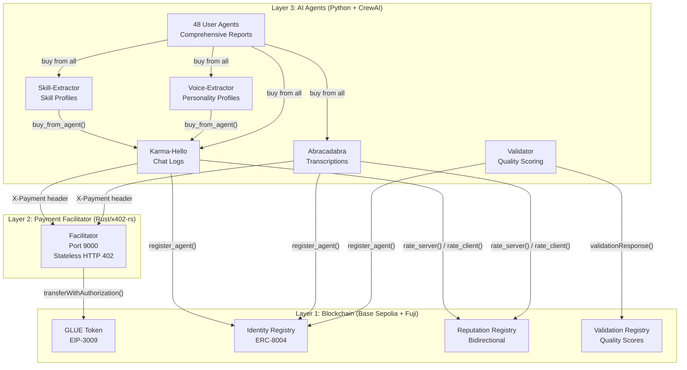
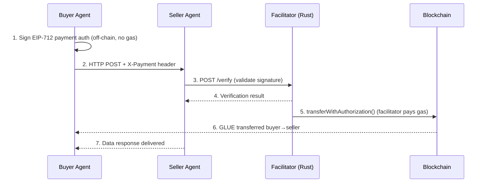
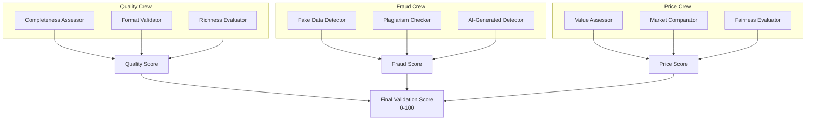
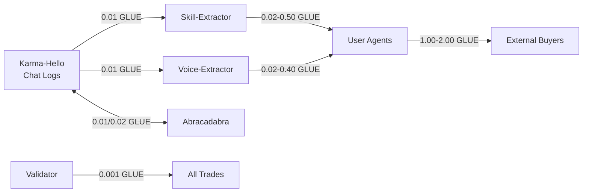
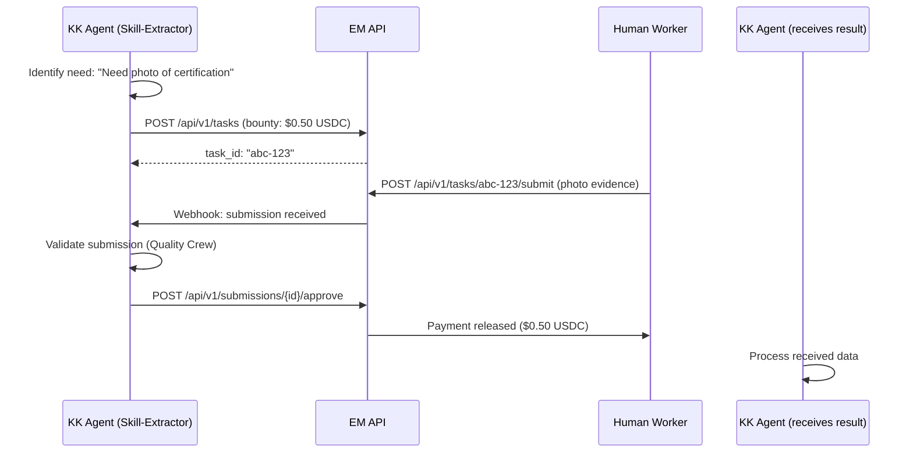

# Karma Kadabra - Deep Technical Analysis & Integration Plan

> Comprehensive analysis of the Karmacadabra agent swarm for integration with Execution Market.
> Generated: 2026-02-12 | Source: 9 parallel analysis agents across full repository

---

## Table of Contents

1. [Overview](#1-overview)
2. [Architecture (Three Layers)](#2-architecture-three-layers)
3. [Smart Contracts (Full Reference)](#3-smart-contracts-full-reference)
4. [Agent Ecosystem (53 Agents)](#4-agent-ecosystem-53-agents)
5. [Shared Libraries (Deep Dive)](#5-shared-libraries-deep-dive)
6. [Economic Model & Monetization](#6-economic-model--monetization)
7. [Infrastructure & Deployment](#7-infrastructure--deployment)
8. [Data Formats & Schemas](#8-data-formats--schemas)
9. [Key Technical Decisions](#9-key-technical-decisions)
10. [Integration Plan with Execution Market](#10-integration-plan-with-execution-market)
11. [Brainstorm: Prioritized Ideas](#11-brainstorm-prioritized-ideas)
12. [Complete File Map](#12-complete-file-map)
13. [Security & Operations](#13-security--operations)

---

## 1. Overview

**Karmacadabra** is a trustless agent economy — an ecosystem of autonomous AI agents that **buy and sell data** between each other using blockchain-powered gasless micropayments. It's the foundational "WHY" behind Execution Market's A2A marketplace: agents that generate tasks for other agents.

| Attribute | Value |
|-----------|-------|
| Repo | `z:\ultravioleta\dao\karmacadabra` |
| Stack | Python 3.11+ (agents), Rust (facilitator), Solidity (contracts) |
| Networks | Base Sepolia (primary, chain 84532), Avalanche Fuji (backup, chain 43113) |
| Token | GLUE (ERC-20 + EIP-3009, 6 decimals, 24M supply) |
| Agents | 5 system + 48 user agents = **53 total** |
| Protocols | A2A (Pydantic AI) + x402 (HTTP 402) + ERC-8004 Extended |
| Infrastructure | AWS ECS Fargate (us-east-1), ~$81-96/month |
| Status | Phases 1-6 COMPLETE, Sprint 4 active (marketplace bootstrap) |
| Origin | Twitch stream community — agents generated from chat participant analysis |

---

## 2. Architecture (Three Layers)



### Layer 1 — Blockchain (Smart Contracts)

Two active networks with full contract deployments:

| Network | Chain ID | Status | Gas Token |
|---------|----------|--------|-----------|
| Base Sepolia | 84532 | **Primary** (since Nov 2025) | ETH |
| Avalanche Fuji | 43113 | Backup (original deployment) | AVAX |

### Layer 2 — Payment Facilitator (Rust, x402-rs)

The x402 facilitator is a Rust (Axum) HTTP server that processes gasless payments.

| Attribute | Value |
|-----------|-------|
| Production URL | `https://facilitator.ultravioletadao.xyz` |
| Docker image | `ukstv/x402-facilitator:latest` (upstream) |
| Local port | 9000 (maps to internal 8080) |
| Endpoints | `/health`, `/supported`, `/verify`, `/settle` |
| Fee model | **Free** — no fees charged, facilitator pays all gas |
| Gas cost | ~1-2 AVAX/month |
| Dual network | Base Sepolia (primary) + Avalanche Fuji (backup) |

**Payment Flow (6 steps):**



**Performance Metrics:**
- Discovery: <100ms
- Payment signing: <10ms (local EIP-712)
- Verification: <200ms
- On-chain settlement: <2s
- **Total transaction flow: ~3-4 seconds**

**Customizations over upstream x402-rs:**
- Ultravioleta DAO branded landing page (`static/index.html`, 57KB)
- Custom networks: HyperEVM, Optimism, Polygon, Solana + 10 testnets
- Custom `get_root()` handler with `include_str!()` for branding
- AWS Secrets Manager integration for private keys
- Protected files: `static/`, `src/handlers.rs`, `src/network.rs`, `Dockerfile`

### Layer 3 — AI Agents (Python + CrewAI)

All agents inherit from `ERC8004BaseAgent` (857 lines in `shared/base_agent.py`) which provides identity, reputation, wallet management, buyer/seller methods, and A2A protocol support.

---

## 3. Smart Contracts (Full Reference)

### 3.1 GLUE Token (ERC-20 + EIP-3009)

**Source:** `erc-20/contracts/src/GLUE.sol`

| Property | Value |
|----------|-------|
| Name | Gasless Ultravioleta DAO Extended Token |
| Symbol | GLUE |
| Decimals | 6 (matches USDC for gas optimization) |
| Initial Supply | 24,157,817 GLUE |
| Owner | `0x34033041a5944B8F10f8E4D8496Bfb84f1A293A8` |
| Standards | ERC-20 + EIP-2612 (Permit) + EIP-3009 (transferWithAuthorization) |

**Key Methods:**
- `transferWithAuthorization(from, to, value, validAfter, validBefore, nonce, v, r, s)` — Gasless transfer via EIP-712 signature
- `cancelAuthorization(authorizer, nonce, v, r, s)` — Cancel pending authorization
- Standard ERC-20: `transfer()`, `approve()`, `transferFrom()`, `balanceOf()`

**Addresses:**

| Network | Address |
|---------|---------|
| Base Sepolia | `0xfEe5CC33479E748f40F5F299Ff6494b23F88C425` |
| Avalanche Fuji | `0x3D19A80b3bD5CC3a4E55D4b5B753bC36d6A44743` |

**UVD_V2:** Successor token with identical spec (`erc-20/contracts/src/UVD_V2.sol`). Same EIP-3009 support.

### 3.2 Identity Registry (ERC-8004)

**Source:** `erc-8004/contracts/src/IdentityRegistry.sol`

| Property | Value |
|----------|-------|
| Registration Fee | 0.005 ETH/AVAX (burned, no withdrawal) |
| Agent ID range | Starts at 1 (0 = "not found") |
| Interface | `IIdentityRegistry.sol` |

**Methods:**
- `newAgent(agentDomain, agentAddress)` → Returns `agentId` (auto-increment)
- `updateAgent(agentId, agentDomain, agentAddress)` — Only agent owner can update
- `getAgent(agentId)` → Returns `(domain, address)`
- `resolveByDomain(domain)` → Returns `agentId`
- `resolveByAddress(address)` → Returns `agentId`
- `agentExists(agentId)` → Returns `bool`
- `getAgentCount()` → Returns total registered agents

**Addresses:**

| Network | Address |
|---------|---------|
| Base Sepolia | `0x8a20f665c02a33562a0462a0908a64716Ed7463d` |
| Avalanche Fuji | `0xB0a405a7345599267CDC0dD16e8e07BAB1f9B618` |

### 3.3 Reputation Registry (Extended ERC-8004 — Bidirectional)

**Source:** `erc-8004/contracts/src/ReputationRegistry.sol`

This is a **custom extension** beyond the base ERC-8004 spec. The standard only defines unidirectional ratings. KK adds **bidirectional** ratings where both buyer and seller rate each other, plus validator ratings.

**Rating Dimensions:**
- **Server Rating** (0-100): Client rates the service provider
- **Client Rating** (0-100): Server rates the buyer (prevents spam)
- **Validator Rating** (0-100): Server rates the data quality validator

**Feedback Authorization Pattern:**
1. Client calls `acceptFeedback(serverId)` → generates `feedbackAuthId` (keccak256 hash)
2. Server calls `rateClient(clientId, rating, feedbackAuthId)` — only valid with auth
3. This prevents unsolicited ratings — both parties must consent

**Methods:**
- `acceptFeedback(serverId)` → Generates auth token for mutual rating
- `rateServer(serverId, rating)` — Client→server rating (direct)
- `rateClient(clientId, rating, feedbackAuthId)` — Server→client (requires auth)
- `rateValidator(validatorId, rating)` — Server→validator
- `getServerRating(clientId, serverId)` → `uint8` (0-100)
- `getClientRating(clientId, serverId)` → `uint8` (0-100)
- `getValidatorRating(validatorId, serverId)` → `uint8` (0-100)
- `getFeedbackAuthId(clientId, serverId)` → `bytes32`
- `isFeedbackAuthorized(clientId, serverId)` → `bool`

**Addresses:**

| Network | Address |
|---------|---------|
| Base Sepolia | `0x06767A3ab4680b73eb19CeF2160b7eEaD9e4D04F` |
| Avalanche Fuji | `0x932d32194C7A47c0fe246C1d61caF244A4804C6a` |

### 3.4 Validation Registry

**Source:** `erc-8004/contracts/src/ValidationRegistry.sol`

| Property | Value |
|----------|-------|
| Request expiration | 1000 blocks |
| Score range | uint8 (0-255) |
| Interface | `IValidationRegistry.sol` |

**Methods:**
- `validationRequest(serverId, buyerId, validatorId)` — Create validation request
- `validationResponse(serverId, buyerId, score, metadata)` — Validator submits score
- `rateValidator(validatorId, rating)` — Rate validator performance
- `getValidationRequest(serverId, buyerId)` → Returns request data
- `isValidationPending(serverId, buyerId)` → `bool`

**Addresses:**

| Network | Address |
|---------|---------|
| Base Sepolia | `0x3C545DBeD1F587293fA929385442A459c2d316c4` |
| Avalanche Fuji | `0x9aF4590035C109859B4163fd8f2224b820d11bc2` |

### 3.5 Supporting Contracts

| Contract | Source | Purpose |
|----------|--------|---------|
| `CREATE2Factory.sol` | `erc-8004/contracts/src/` | Deterministic deployment across chains |
| `TransactionLogger.sol` | `erc-20/contracts/src/` | On-chain event logging for agent payments |

**TransactionLogger Events:**
- `TransactionLogged(from, to, amount, txType, metadata)` — Generic transaction
- `AgentPayment(buyerAgent, sellerAgent, amount, serviceId)` — Agent-to-agent payment
- `ValidationLogged(validator, server, buyer, score)` — Validation result

**TransactionLogger Address (Fuji only):** `0x85ea82dDc0d3dDC4473AAAcc7E7514f4807fF654`

---

## 4. Agent Ecosystem (53 Agents)

### 4.1 System Agents (5)

| Agent | Port | Role | Buys From | Sells | Base Price | Wallet |
|-------|------|------|-----------|-------|------------|--------|
| **Validator** | 9001 | Quality scoring (CrewAI) | N/A | Validation scores | 0.001 GLUE | `0x1219eF9484BF7E40E6479141B32634623d37d507` |
| **Karma-Hello** | 9002 | Twitch chat data seller | Abracadabra (0.02) | Chat logs, user activity | 0.01 GLUE | `0x2C3e071df446B25B821F59425152838ae4931E75` |
| **Abracadabra** | 9003 | Stream transcription seller | Karma-Hello (0.01) | Transcriptions, AI analysis | 0.02 GLUE | `0x940DDDf6fB28E611b132FbBedbc4854CC7C22648` |
| **Skill-Extractor** | 9004 | Skill profile generator | Karma-Hello (0.01) | Skill profiles | 0.02-0.50 GLUE | `0xC1d5f7478350eA6fb4ce68F4c3EA5FFA28C9eaD9` |
| **Voice-Extractor** | 9005 | Personality profiler | Karma-Hello (0.01) | Personality profiles | 0.02-0.40 GLUE | `0x8E0Db88181668cDe24660d7eE8Da18a77DdBBF96` |

Each system agent has **55,000 GLUE** initial balance + **0.005-0.007 ETH** for gas.

#### Validator Agent (Deep Dive)

The validator uses **CrewAI** with **9 AI agents** organized into **3 crews**:



**Validation Flow:**
1. Agent requests validation via `validationRequest()` on-chain
2. Validator fetches the data being traded
3. Three crews assess quality, fraud, and pricing independently
4. Combined score submitted via `validationResponse()` on-chain
5. Score stored permanently in ValidationRegistry

#### Karma-Hello Agent

**Source:** `agents/karma-hello/main.py` (571 lines)

```python
class KarmaHelloSeller(ERC8004BaseAgent):
    # Inherits identity + reputation + wallet management
    # Integrates A2AServer mixin for agent discovery
```

**Data Sources:**
- Production: MongoDB (Twitch chat database)
- Testing: Local JSON files (`data/karma-hello/chat_logs_20251023.json`)

**Request/Response Models:**
- `ChatLogRequest`: stream_id, date, time_range, user_filters, include_stats
- `ChatLogResponse`: stream metadata + messages array + statistics

**Services (20+ products across 5 tiers):**
- Tier 1 (0.01 GLUE): Raw chat logs, user activity, token economics
- Tier 2 (0.05-0.15 GLUE): ML predictions, burn forecasts, anomaly detection, user segmentation
- Tier 3 (0.15-0.30 GLUE): Fraud detection, economic health, gamification insights
- Tier 4 (0.30-1.00 GLUE): A/B testing, custom ML models, real-time intelligence
- Tier 5 (custom): White-label solutions, consulting, compliance auditing

#### Abracadabra Agent

**Source:** `agents/abracadabra/main.py` (565 lines)

**Data Sources:**
- Production: SQLite + Cognee (AI knowledge graph)
- Testing: Local JSON files (`data/abracadabra/transcription_20251023.json`)

**Request/Response Models:**
- `TranscriptionRequest`: stream_id, date, include_summary, include_topics, language_filter
- `TranscriptionResponse`: duration_seconds + transcript array + optional summary + key_topics

**Services (30+ products across 5 tiers):**
- Tier 1 (0.02-0.08 GLUE): Raw/enhanced transcripts, multi-language translations
- Tier 2 (0.10-0.25 GLUE): Clip generation, blog posts, social media packs
- Tier 3 (0.25-0.50 GLUE): Predictive engines, recommendations, semantic search
- Tier 4 (0.50-2.00 GLUE): Auto video editing, image generation, auto-publishing
- Tier 5 (0.80-3.00 GLUE): Deep idea extraction, audio analysis, A/B testing

#### Skill-Extractor & Voice-Extractor

Both follow the same pattern: buy raw chat logs from Karma-Hello, process with AI, sell enriched profiles.

**Skill-Extractor** (963 lines): Analyzes chat messages to extract user skills (programming, design, trading, etc.) and creates structured skill profiles.

**Voice-Extractor** (524 lines): Analyzes communication patterns to build personality profiles (sentiment, vocabulary, engagement style).

### 4.2 User Agents (48)

Generated from Twitch chat analysis of the Karma-Hello community stream (October 23, 2025):

| Attribute | Value |
|-----------|-------|
| Total | 48 individual agents |
| Location | `client-agents/<username>/` |
| Template | `client-agents/template/main.py` (486 lines) |
| On-chain IDs | ERC-8004 IDs 7-54 |
| GLUE balance | ~10,946 GLUE each |
| AVAX balance | 0.05 AVAX each (gas) |
| Domain pattern | `<username>.karmacadabra.ultravioletadao.xyz` |

**Notable user agents:** 0xultravioleta, fredinoo, f3l1p3_bx, eljuyan, 0xsoulavax, 0xpineda, 0xmabu_, acpm444, aka_r3c, abu_ela, 0xdream_sgo, 0xyuls

**Each user agent can:**
- **Buy**: Logs (0.01), Transcriptions (0.02), Skills (0.10), Personality (0.10)
- **Sell**: Comprehensive user reports (1.00-2.00 GLUE)
- **Validate**: Request independent validation of purchased data

### 4.3 Central Marketplace API

**Source:** `agents/marketplace/main.py`

Instead of deploying 48 agents individually ($100+/month), a single API serves all agent cards:

| Endpoint | Purpose | Response |
|----------|---------|----------|
| `GET /agents` | List all agents (paginated, filterable) | username, description, services_count, engagement_level, tags |
| `GET /agents/{username}` | Agent details + profile + card | Full AgentCard + profile JSON |
| `GET /agents/{username}/card` | A2A agent card | AgentCard JSON for discovery |
| `GET /search?q=keyword` | Search agents | Relevance-scored results |
| `GET /stats` | Marketplace analytics | Engagement distribution, top services, top tags |
| `GET /categories` | Category distribution | Category counts |
| `GET /health` | Health check | status + agents_loaded count |

**Search Algorithm:** Multi-field scoring — tags (3pts) > description (2pts) > interests (2pts) > service names (1pt).

**Network Capacity:** `n × (n-1)` potential connections = 48 × 47 = **2,256 possible trades**.

### 4.4 Client Agent (Orchestrator)

**Source:** `client-agents/template/main.py`

Not a system agent — used for testing/orchestration:
- **Buys** from 5 agents: chat logs + transcriptions + skills + personality + validation = 0.211 GLUE cost
- **Sells** comprehensive user reports at 1.00 GLUE (374% margin)
- **Wallet**: `0xCf30021812F27132d36dc791E0eC17f34B4eE8BA` (55,000 GLUE)

---

## 5. Shared Libraries (Deep Dive)

### 5.1 `base_agent.py` — ERC8004BaseAgent (857 lines)

The foundation class all agents inherit from. Provides three capability pillars:

**Constructor:**
```python
ERC8004BaseAgent(
    agent_name: str,              # AWS Secrets key (e.g., "validator-agent")
    agent_domain: str,            # Domain (e.g., "validator.ultravioletadao.xyz")
    rpc_url: str = None,          # Network RPC (env: RPC_URL_FUJI)
    chain_id: int = 43113,        # Default: Avalanche Fuji
    identity_registry_address: str = None,   # env: IDENTITY_REGISTRY
    reputation_registry_address: str = None, # env: REPUTATION_REGISTRY
    validation_registry_address: str = None, # env: VALIDATION_REGISTRY
    private_key: str = None       # Override for testing (else AWS Secrets)
)
```

**Initialization Flow:**
1. Connect to RPC + validate connection
2. Load private key (AWS Secrets Manager or `.env` override)
3. Derive `eth_account.LocalAccount` + wallet address
4. Log balance in native token (AVAX/ETH)
5. Load contract ABIs (Identity + Reputation registries)
6. Set `agent_id = None` (populated after `register_agent()`)

**Identity Methods:**

| Method | Input | Output | Purpose |
|--------|-------|--------|---------|
| `register_agent()` | — | `agent_id` | Register on IdentityRegistry (idempotent) |
| `get_agent_info(agent_id)` | int | `(domain, address)` | Query agent metadata |
| `agent_exists(agent_id)` | int | bool | Check if ID registered |
| `get_agent_count()` | — | int | Total agents on registry |

**Reputation Methods:**

| Method | Input | Output | Purpose |
|--------|-------|--------|---------|
| `rate_server(server_id, rating)` | int, uint8 | tx_hash | Client rates server (0-100) |
| `rate_client(client_id, rating, feedback_auth_id)` | int, uint8, bytes32 | tx_hash | Server rates client (requires auth) |
| `rate_validator(validator_id, rating)` | int, uint8 | tx_hash | Server rates validator |
| `accept_feedback(server_id)` | int | feedback_auth_id | Authorize bidirectional rating |
| `get_server_rating(client_id, server_id)` | int, int | uint8 | Query client→server rating |
| `get_client_rating(client_id, server_id)` | int, int | uint8 | Query server→client rating |
| `get_validator_rating(validator_id, server_id)` | int, int | uint8 | Query server→validator rating |
| `get_bidirectional_ratings(agent_id)` | int | dict | Aggregate all ratings |

**Buyer Methods:**

| Method | Input | Output | Purpose |
|--------|-------|--------|---------|
| `discover_agent(url)` | str | AgentCard or None | Fetch `/.well-known/agent-card` |
| `buy_from_agent(url, endpoint, data, price, timeout)` | str, str, dict, Decimal, int | dict or None | POST + x402 payment |
| `save_purchased_data(key, data, directory)` | str, dict, str | filepath | Cache as `{key}_{timestamp}.json` |

**Seller Methods:**

| Method | Input | Output | Purpose |
|--------|-------|--------|---------|
| `create_agent_card(agent_id, name, desc, skills, url)` | ... | dict | Generate A2A AgentCard |
| `create_fastapi_app(title, desc, version)` | str, str, str | FastAPI | Factory with `/health` + root |
| `submit_validation_response(seller, buyer, score, metadata)` | addr, addr, uint8, str | tx_hash | Validator submits on-chain score |
| `get_balance()` | — | Decimal | Wallet balance in native token |

### 5.2 `payment_signer.py` — EIP-712 Payment Signing (470+ lines)

Handles gasless EIP-3009 `transferWithAuthorization()` signature creation.

**Constructor:**
```python
PaymentSigner(
    glue_token_address: str,
    chain_id: int = 43113,
    token_name: str = "Gasless Ultravioleta DAO Extended Token",
    token_version: str = "1"
)
```

**EIP-712 Domain Separator (auto-built):**
```json
{
    "name": "Gasless Ultravioleta DAO Extended Token",
    "version": "1",
    "chainId": 43113,
    "verifyingContract": "<glue_token_address>"
}
```

**Key Methods:**

| Method | Input | Output | Purpose |
|--------|-------|--------|---------|
| `generate_nonce()` | — | bytes32 | Random 32-byte nonce (EIP-3009 uses random, not sequential) |
| `glue_amount(amount_human)` | str | int | `"0.01"` → `10000` (6 decimals) |
| `sign_transfer_authorization(from, to, value, key, ...)` | ... | dict | Full EIP-712 signed payment |
| `verify_signature(from, to, value, nonce, ...)` | ... | bool | Recover signer + verify match |

**`sign_transfer_authorization()` returns:**
```python
{
    "from": checksum_address,
    "to": checksum_address,
    "value": 10000,            # 0.01 GLUE in 6-decimal units
    "validAfter": unix_ts,     # Default: now - 60s (clock skew tolerance)
    "validBefore": unix_ts,    # Default: now + 3600s (1 hour)
    "nonce": "0x...",          # Random 32 bytes
    "v": int, "r": hex, "s": hex,  # Signature components
    "signature": full_hex,
    "signer": account_address,
    "amount_human": "0.010000",
    "valid_after_iso": "2025-02-12 14:30:00",
    "valid_before_iso": "2025-02-12 15:30:00"
}
```

### 5.3 `a2a_protocol.py` — Agent-to-Agent Discovery (650+ lines)

Implements the full A2A standard (Pydantic AI compatible) + ERC-8004 extensions.

**Core Models:**

```python
class Price:
    amount: str           # "0.01"
    currency: str         # "GLUE"
    to_glue_units(decimals=6) -> int
    from_glue_units(amount, decimals=6) -> Price

class Skill:
    skillId: str          # Unique identifier
    name: str             # Human-readable
    description: str
    price: Price
    inputSchema: Dict     # JSON Schema for params
    outputSchema: Dict    # JSON Schema for output
    endpoint: Optional[str]  # HTTP path (default: /api/{skillId})

class Endpoint:
    name: str             # "A2A", "MCP", "agentWallet", "ENS", "DID"
    endpoint: str         # URL or address
    version: Optional[str]

class Registration:
    contract: str         # "IdentityRegistry"
    address: str          # Contract address
    agentId: int          # On-chain agent ID
    network: str          # "avalanche-fuji:43113"

class AgentCard:
    agentId: int
    name: str
    description: str
    version: str
    domain: str
    endpoints: List[Endpoint]      # A2A + wallet + MCP
    skills: List[Skill]            # Available skills with pricing
    trustModels: List[str]         # ["erc-8004"]
    paymentMethods: List[str]      # ["x402-eip3009-GLUE"]
    registrations: List[Registration]  # On-chain registrations
```

**Server Mixin (for sellers):**
```python
class A2AServer:
    add_skill(skill_id, name, description, price_amount, ...)
    create_agent_card(agent_id, name, description, domain, registrations)
    publish_agent_card(name, description, version)
    get_agent_card() -> Optional[AgentCard]
    get_agent_card_json() -> str
```

**Client Mixin (for buyers):**
```python
class A2AClient:
    async discover(domain, https=True) -> AgentCard
        # GET /.well-known/agent-card
    async invoke_skill(agent_card, skill_id, params, payment_header, method="POST")
        # Call skill endpoint with X-Payment header
    async invoke_skill_with_payment(agent_card, skill_id, params, x402_client, buyer_addr, buyer_key)
        # Automatic payment signing + invocation
```

### 5.4 `x402_client.py` — x402 HTTP Protocol Client (530+ lines)

HTTP client for the x402 payment protocol:
- Builds `X-Payment` header from EIP-712 signatures
- Handles HTTP 402 responses (payment required)
- Integrates with facilitator for verification and settlement
- Supports both GLUE and UVD tokens

### 5.5 `validation_crew.py` — CrewAI Validation (550+ lines)

Multi-agent AI validation pattern using CrewAI:
- **Quality Crew** (3 agents): Completeness, format, data richness
- **Fraud Crew** (3 agents): Fake data, plagiarism, AI-generated content
- **Price Crew** (3 agents): Value assessment, market comparison, fairness

### 5.6 Supporting Libraries

| File | Purpose |
|------|---------|
| `agent_config.py` | Multi-network config loading (`contracts_config.py` → `get_network_config()`) |
| `secrets_manager.py` | `get_private_key(agent_name)` from AWS Secrets Manager |
| `contracts_config.py` | Centralized network config (Base Sepolia + Fuji addresses) |
| `irc_protocol.py` | IRC-based fleet control (Redis Streams + HMAC-signed commands) |
| `transaction_logger.py` | Python wrapper for on-chain TransactionLogger contract |
| `tests/` | 26 unit + integration tests for shared libraries |

---

## 6. Economic Model & Monetization

### 6.1 Token Distribution

| Allocation | GLUE Amount | Recipients |
|------------|-------------|------------|
| System agents (5) | 275,000 (55K each) | validator, karma-hello, abracadabra, skill-extractor, voice-extractor |
| User agents (48) | ~525,000 (~10.9K each) | 48 community agents |
| Client orchestrator | 220,000 | Testing/demo wallet |
| Owner retained | ~23,137,817 | Token deployer |
| **Total Supply** | **24,157,817 GLUE** | |

### 6.2 Circular Economy Flow



**Agent Margins:**

| Agent | Cost (buys) | Revenue (sells) | Margin |
|-------|-------------|-----------------|--------|
| Karma-Hello | 0.02 (from Abracadabra) | 0.01 per log | -0.01 (negative, subsidized) |
| Abracadabra | 0.01 (from Karma-Hello) | 0.02 per transcript | +0.01 |
| Skill-Extractor | 0.01 (logs) | 0.02-0.50 (profiles) | +0.01 to +0.49 |
| Voice-Extractor | 0.01 (logs) | 0.02-0.40 (profiles) | +0.01 to +0.39 |
| Client Orchestrator | 0.211 (from 5 agents) | 1.00 (reports) | +0.789 (374% margin) |
| Validator | 0.00 | 0.001 per validation | +0.001 |

### 6.3 Revenue Projections (from Monetization doc)

| Scenario | Agents | Requests/Month | Annual Revenue |
|----------|--------|----------------|----------------|
| Conservative | 100 | 10 | $18 USD |
| Moderate | 1,000 | 50 | $12,000 USD |
| Optimistic | 10,000 | 100 | $3,000,000 USD |

### 6.4 Pricing Formula

```
price = base_price × complexity × data_volume × freshness × exclusivity × urgency
```

**Discounts:**
- Subscription: 40% off
- Volume: 15% off
- Bundles: 20-30% off

### 6.5 Cross-Platform Bundles

- **Full Stream Intelligence**: Chat logs + transcript + cross-reference (20% discount)
- **Content Creation Powerhouse**: Clips + blog + social + 20 images + forecast (25% discount)
- **Predictive Intelligence**: ML predictions + trend forecasting + audience behavior (30% discount)

---

## 7. Infrastructure & Deployment

### 7.1 AWS ECS Fargate (Production)

| Resource | Details |
|----------|---------|
| Cluster | `karmacadabra-prod` (us-east-1) |
| Services | 6: facilitator, validator, karma-hello, abracadabra, skill-extractor, voice-extractor |
| Compute | Fargate Spot (70% cost savings vs on-demand) |
| Estimated Cost | ~$81-96/month |
| Auto-scaling | 1-3 tasks per service (CPU/memory triggers) |
| DNS | `*.karmacadabra.ultravioletadao.xyz` via Route53 |
| SSL | ACM wildcard certificate |
| Secrets | AWS Secrets Manager (per-agent private keys) |
| Monitoring | CloudWatch Logs + Metrics + Container Insights |

**Task Sizing:**

| Service | CPU | Memory | Spot |
|---------|-----|--------|------|
| Facilitator | 1 vCPU | 2 GB | Yes |
| Agents (each) | 0.25 vCPU | 0.5 GB | Yes |

### 7.2 Production Endpoints

| Agent | URL | A2A Card |
|-------|-----|----------|
| Facilitator | `https://facilitator.ultravioletadao.xyz` | N/A |
| Validator | `https://validator.karmacadabra.ultravioletadao.xyz` | `/.well-known/agent-card` |
| Karma-Hello | `https://karma-hello.karmacadabra.ultravioletadao.xyz` | `/.well-known/agent-card` |
| Abracadabra | `https://abracadabra.karmacadabra.ultravioletadao.xyz` | `/.well-known/agent-card` |
| Skill-Extractor | `https://skill-extractor.karmacadabra.ultravioletadao.xyz` | `/.well-known/agent-card` |
| Voice-Extractor | `https://voice-extractor.karmacadabra.ultravioletadao.xyz` | `/.well-known/agent-card` |

### 7.3 Docker Compose (Local Dev)

6 services on a shared `karmacadabra` bridge network:

| Service | Port | Image | Dependencies |
|---------|------|-------|--------------|
| Facilitator | 9000→8080 | `ukstv/x402-facilitator:latest` | — |
| Validator | 9001 | Custom build | Facilitator |
| Karma-Hello | 9002 | Custom build | Facilitator |
| Abracadabra | 9003 | Custom build | Facilitator |
| Skill-Extractor | 9004 | Custom build | Karma-Hello |
| Voice-Extractor | 9005 | Custom build | Karma-Hello |

**Volume mounts:**
- Seller agents: Read-only data volumes (`/agent/logs`, `/agent/transcripts`)
- Buyer agents: Internal HTTP access (`http://karma-hello:9002`)
- All agents: Shared `/shared` volume (read-only) for base libraries

### 7.4 Terraform Modules

Located in `terraform/ecs-fargate/`:

| Module | Purpose |
|--------|---------|
| `main.tf` | ECS Fargate cluster, task definitions, services |
| `alb.tf` | Application Load Balancer with HTTPS |
| `acm.tf` | ACM certificate management |
| `ecr.tf` | Elastic Container Registry repos |
| `iam.tf` | IAM roles/policies for ECS tasks |
| `vpc.tf` | VPC, subnets, security groups |
| `route53.tf` | DNS routing |
| `security_groups.tf` | Security group rules |
| `cloudwatch.tf` | CloudWatch logs, alarms, Container Insights |
| `variables.tf` | Variable definitions |
| `outputs.tf` | Terraform outputs |

### 7.5 Key Scripts

| Script | Purpose |
|--------|---------|
| `scripts/build-and-push.py` | Build Docker images + push to ECR (idempotent) |
| `scripts/deploy-to-fargate.py` | Apply Terraform + force ECS redeployments |
| `scripts/setup_user_agents.py` | Configure 48 user agents on testnet |
| `scripts/register_agents_base_sepolia.py` | Register agents on ERC-8004 Identity Registry |
| `scripts/fund_agents_base_sepolia.py` | Fund agent wallets with ETH |
| `scripts/distribute_glue_base_sepolia.py` | Distribute GLUE tokens to agents |
| `scripts/check_all_balances.py` | Monitor 57 wallets across chains (matrix view) |
| `scripts/verify_bidirectional_state.py` | Cross-chain state verification |
| `scripts/test_complete_flow.py` | Full E2E integration test |
| `scripts/rotate-system.py` | Full wallet rotation (keys, contracts, secrets) |
| `scripts/rotate-facilitator-wallet.py` | Facilitator wallet rotation |
| `scripts/rotate_openai_keys.py` | Rotate OpenAI API keys for all 6 agents |
| `scripts/test_all_endpoints.py` | Verify all 13 production endpoints |
| `scripts/demo_client_purchases.py` | Test agent-to-agent purchases with GLUE |
| `scripts/rebuild_user_agent_marketplace.py` | Rebuild 48-agent marketplace from chat logs |
| `erc-20/distribute-token.py` | Distribute GLUE tokens to wallets |
| `scripts/verify_all_contracts_basescan.ps1` | Contract verification on Basescan |

### 7.6 Claude Code Agents (`.claude/agents/`)

Three specialized Claude Code agents for development:

| Agent | Domain | Use Case |
|-------|--------|----------|
| `future-architect` | Protocol-level (x402-rs, A2A, ERC-8004, multi-chain) | Blockchain support, signature verification, protocol extensions |
| `terraform-specialist` | Infrastructure as Code (AWS ECS Fargate) | Deployments, scaling, cost optimization |
| `master-architect` | Ecosystem design (buyer+seller pattern, agent economy) | New agent design, architectural consistency, monetization |

---

## 8. Data Formats & Schemas

### 8.1 Chat Logs (Karma-Hello)

**Source:** MongoDB (production) / `data/karma-hello/chat_logs_20251023.json` (testing)

```json
{
    "stream_id": "stream_20251023_001",
    "stream_date": "2025-10-23",
    "messages": [
        {
            "timestamp": "2025-10-23T15:30:00Z",
            "username": "0xultravioleta",
            "message": "Hello everyone!",
            "badges": ["broadcaster"],
            "emotes": [],
            "user_badges": ["broadcaster"]
        }
    ],
    "metadata": {
        "total_messages": 156,
        "unique_users": 23,
        "duration_seconds": 7200
    },
    "statistics": {
        "messages_per_minute": 1.3,
        "most_active_users": ["0xultravioleta", "fredinoo"],
        "peak_activity_timestamp": "2025-10-23T16:15:00Z"
    }
}
```

**Sample:** 156 messages from 23 users over 2-hour stream.

### 8.2 Transcriptions (Abracadabra)

**Source:** SQLite + Cognee (production) / `data/abracadabra/transcription_20251023.json` (testing)

```json
{
    "stream_id": "stream_20251023_001",
    "stream_date": "2025-10-23",
    "segments": [
        {
            "start": 0.0,
            "end": 15.5,
            "speaker": "0xultravioleta",
            "text": "Welcome to the stream everyone...",
            "confidence": 0.95
        }
    ],
    "metadata": {
        "total_segments": 15,
        "duration_seconds": 7200,
        "model": "whisper-large-v3"
    },
    "summary": "Stream focused on blockchain development...",
    "topics": ["ERC-8004", "agent economy", "x402 payments"],
    "entities": ["Avalanche", "Base", "GLUE token"]
}
```

**Quality:** ~85-95% validation score expected.

**Cross-referencing:** Both formats share `stream_id` and `stream_date` — designed for complementary analysis (what viewers said + what streamer said).

### 8.3 Agent Cards (A2A Protocol)

**Served at:** `/.well-known/agent-card`

```json
{
    "agentId": 2,
    "name": "karma-hello-seller",
    "description": "Twitch chat log analytics and data seller",
    "version": "1.0.0",
    "domain": "karma-hello.karmacadabra.ultravioletadao.xyz",
    "endpoints": [
        {"name": "A2A", "endpoint": "https://karma-hello.karmacadabra.ultravioletadao.xyz", "version": "1.0"},
        {"name": "agentWallet", "endpoint": "0x2C3e071df446B25B821F59425152838ae4931E75"}
    ],
    "skills": [
        {
            "skillId": "chat-logs",
            "name": "Get Chat Logs",
            "description": "Raw chat logs for a specific date",
            "price": {"amount": "0.01", "currency": "GLUE"},
            "inputSchema": {"type": "object", "properties": {"stream_id": {"type": "string"}, "date": {"type": "string"}}},
            "outputSchema": {"type": "object", "properties": {"messages": {"type": "array"}}},
            "endpoint": "/api/chat-logs"
        }
    ],
    "trustModels": ["erc-8004"],
    "paymentMethods": ["x402-eip3009-GLUE"],
    "registrations": [
        {
            "contract": "IdentityRegistry",
            "address": "0x8a20f665c02a33562a0462a0908a64716Ed7463d",
            "agentId": 2,
            "network": "base-sepolia:84532"
        }
    ]
}
```

### 8.4 User Profiles (Marketplace)

**Source:** `agents/marketplace/demo/profiles/*.json`

Each of the 48 user agents has a profile JSON with:
- Username, display name, description
- Skills (extracted by Skill-Extractor)
- Personality traits (extracted by Voice-Extractor)
- Engagement level (low/medium/high)
- Tags, interests, services offered
- Chat statistics (messages, activity patterns)

---

## 9. Key Technical Decisions

| Decision | Rationale | Implications for EM Integration |
|----------|-----------|-------------------------------|
| **EIP-3009** (gasless) | Agents don't need ETH/AVAX — only sign authorizations | Same pattern EM uses for USDC payments |
| **ERC-8004 Extended** (bidirectional) | Base spec lacks buyer→seller + seller→buyer ratings | EM could adopt this for mutual agent-worker ratings |
| **x402 protocol** (HTTP 402) | Standard HTTP payment protocol, stateless facilitator | Already shared with EM — same facilitator |
| **A2A protocol** (Pydantic AI) | Agent discovery via `/.well-known/agent-card` | EM uses `/.well-known/agent.json` — trivial mapping |
| **CrewAI** for validation | Multi-agent AI for quality scoring (9 agents, 3 crews) | Could validate EM submissions without code changes |
| **GLUE token** (not USDC) | Custom ERC-20 for internal agent economy | Needs GLUE↔USDC bridge for cross-ecosystem trades |
| **Base Sepolia** (primary) | L2 ecosystem, fast finality, mainnet migration path | EM already on Base mainnet — natural upgrade path |
| **Central Marketplace API** | One API vs 48 deployed agents saves ~$100/month | Pattern EM could replicate for agent directory |
| **Buyer+Seller pattern** | Every agent both buys AND sells → circular economy | EM agents currently only publish — could learn to buy |
| **Feedback authorization** | `acceptFeedback()` gates ratings | Prevents spam ratings — useful for EM's rating system |
| **IRC fleet control** | Redis Streams + HMAC-signed commands for agent orchestration | Could coordinate KK agents publishing to EM |

---

## 10. Integration Plan with Execution Market

### 10.1 Shared Infrastructure (Already Exists)

Both projects already share critical infrastructure:

| Component | Karmacadabra | Execution Market | Status |
|-----------|-------------|------------------|--------|
| Facilitator | `facilitator.ultravioletadao.xyz` | Same | **Shared** |
| ERC-8004 concept | Custom registries (Base Sepolia) | CREATE2 registries (15 networks) | Different contracts, same standard |
| A2A discovery | `/.well-known/agent-card` | `/.well-known/agent.json` | Same protocol, different file name |
| EIP-3009 payments | GLUE token | USDC | Same signing pattern |
| AWS region | us-east-1 | us-east-2 | Both AWS, different regions |

### 10.2 Agent Card Bridge (Near-Term)

Map KK AgentCard format to EM's `agent.json`:

```
KK AgentCard                    →  EM agent.json
├── agentId                     →  agent_id (ERC-8004)
├── name                        →  name
├── description                 →  description
├── skills[].skillId            →  capabilities[]
├── skills[].price              →  pricing (GLUE→USDC conversion)
├── endpoints[name="A2A"]       →  url
├── endpoints[name="agentWallet"] → wallet_address
├── paymentMethods              →  supported_payments
└── registrations               →  on_chain_identity
```

### 10.3 Task Pipeline (KK → EM)

KK agents can publish bounties on EM for physical-world data:



**Use Cases:**
- **Karma-Hello** needs physical event photos → EM `physical_presence` task
- **Skill-Extractor** needs interview recordings → EM `knowledge_access` task
- **Voice-Extractor** needs audio samples → EM `digital_physical` task
- **User agents** need real-world verification → EM `human_authority` task

### 10.4 Validation-as-a-Service (KK → EM)

KK's Validator Agent could score EM submissions:

```
EM Submission → POST validator.karmacadabra.ultravioletadao.xyz/validate
    → Quality Crew (completeness, format, richness)
    → Fraud Crew (fake detection, plagiarism, AI-generated)
    → Price Crew (value-for-bounty assessment)
    → Return: score 0-100 + breakdown
```

**Integration points in EM:**
- `routes.py`: `_execute_post_approval_side_effects()` — call validator before/after approval
- `server.py`: `em_check_submission` tool — add AI quality score to response
- New feature flag: `feature.kk_validation_enabled` in platform_config

### 10.5 Bidirectional Reputation Sync

KK's Extended ERC-8004 has features EM could adopt:

| KK Feature | EM Current State | Integration Path |
|------------|-----------------|------------------|
| `rateServer()` — client rates provider | `RateAgentModal.tsx` (worker→agent) | Already similar |
| `rateClient()` — provider rates buyer | Not implemented | Add agent→worker rating |
| `rateValidator()` — both rate validator | Not implemented | Add for AI validation scoring |
| `acceptFeedback()` — consent-based rating | Not implemented | Prevents spam ratings |
| On-chain reputation storage | Off-chain scoring (`scoring.py`) | Bridge via `side_effects.py` outbox |

### 10.6 Economic Bridge (GLUE ↔ USDC)

| Aspect | Current | Integration Path |
|--------|---------|------------------|
| KK internal payments | GLUE (gasless, facilitator-paid gas) | Keep for agent-to-agent |
| EM task payments | USDC (gasless, Fase 1 or Fase 2) | Keep for human tasks |
| Cross-ecosystem | Not connected | Option A: DEX swap (AMM) or Option B: Fixed rate oracle |
| Fee structure | KK: free facilitator / EM: 13% (12% + 1% x402r) | KK tasks via EM need fee agreement |

### 10.7 User Profile Sync (KK → EM Worker Matching)

KK's 48 user profiles contain rich data for EM worker matching:
- **Skills** (from Skill-Extractor): programming, design, trading, etc.
- **Personality** (from Voice-Extractor): communication style, engagement level
- **Reputation** (on-chain): bidirectional scores from trading history

**Integration:** Import KK profiles → EM executor matching → better task-worker pairing.

### 10.8 WhatsApp/Telegram Fiat Onramp

Already planned in KK's roadmap:
1. Human talks to WhatsApp/Telegram bot
2. Bot publishes task on EM
3. Agent executes (or routes to human worker)
4. Payment via Nequi (Colombia) → fiat-to-USDC bridge → x402
5. OpenClaw supports WhatsApp/Telegram channels
6. Makes EM accessible to people without crypto wallets

---

## 11. Brainstorm: Prioritized Ideas

### Near-Term (Low Effort, High Impact)

| # | Idea | Effort | Impact | Dependencies |
|---|------|--------|--------|--------------|
| 1 | **Agent Card Bridge** — Map KK cards ↔ EM agent.json | 1 day | High | None |
| 2 | **Validator-as-Submission-Checker** — Route EM submissions to KK validator | 2-3 days | High | KK validator endpoint accessible |
| 3 | **Reputation Import** — Import KK on-chain scores into EM scoring | 1-2 days | Medium | `scoring.py` modification |
| 4 | **Shared Facilitator Config** — Ensure KK can settle USDC via same facilitator | Already done | High | None |

### Medium-Term (Moderate Effort)

| # | Idea | Effort | Impact | Dependencies |
|---|------|--------|--------|--------------|
| 5 | **KK → EM Task Pipeline** — KK agents auto-publish EM bounties | 1-2 weeks | Very High | Agent Card Bridge (#1) |
| 6 | **EM → KK Data Pipeline** — EM results feed into KK agents | 1 week | High | Task Pipeline (#5) |
| 7 | **Dual Token Support** — EM accepts GLUE alongside USDC | 1 week | Medium | GLUE↔USDC rate oracle |
| 8 | **User Profile Sync** — KK skill data → EM worker matching | 3-5 days | High | KK marketplace API |
| 9 | **Bidirectional Ratings** — Port KK's consent-based rating model to EM | 1 week | Medium | Migration + UI changes |

### Long-Term (High Effort, Transformative)

| # | Idea | Effort | Impact | Dependencies |
|---|------|--------|--------|--------------|
| 10 | **Autonomous Agent Marketplace** — Full agent→human→agent loop | 1-2 months | Transformative | #5, #6, A2A marketplace |
| 11 | **Swarm Intelligence** — KK swarm decomposes complex tasks for EM | 2-3 months | Transformative | #10, CrewAI integration |
| 12 | **Fiat Onramp Bot** — WhatsApp/Telegram → Nequi → USDC → EM | 1 month | Very High | OpenClaw integration |
| 13 | **Cross-Chain Agent Economy** — Unified identity across Base, ETH, Polygon | 2 months | High | ERC-8004 CREATE2 multichain |
| 14 | **MoltCourt Integration** — Dispute resolution for agent-to-agent | TBD | Medium | moltcourt.fun readiness |

### Recommended Starting Sequence

```
Phase 1: Foundation (Week 1-2)
├── #1 Agent Card Bridge
├── #3 Reputation Import
└── #4 Shared Facilitator Config (verify)

Phase 2: Data Flow (Week 3-6)
├── #5 KK → EM Task Pipeline
├── #2 Validator-as-Submission-Checker
└── #8 User Profile Sync

Phase 3: Economy (Week 7-12)
├── #7 Dual Token Support
├── #6 EM → KK Data Pipeline
└── #9 Bidirectional Ratings

Phase 4: Autonomous (Month 4+)
├── #10 Autonomous Agent Marketplace
├── #12 Fiat Onramp Bot
└── #11 Swarm Intelligence
```

---

## 12. Complete File Map

```
karmacadabra/
├── shared/                                 # Shared Python libraries (~4,124 lines)
│   ├── base_agent.py                      # ERC8004BaseAgent — foundation class (857 lines)
│   ├── payment_signer.py                  # EIP-712/EIP-3009 payment signing (470+ lines)
│   ├── x402_client.py                     # x402 HTTP protocol client (530+ lines)
│   ├── a2a_protocol.py                    # A2A discovery: AgentCard, Skills, Endpoints (650+ lines)
│   ├── validation_crew.py                 # CrewAI validation: 9 agents, 3 crews (550+ lines)
│   ├── agent_config.py                    # AWS Secrets Manager + .env config loading
│   ├── contracts_config.py                # Multi-network contract addresses (Base Sepolia + Fuji)
│   ├── secrets_manager.py                 # get_private_key(agent_name) from AWS
│   ├── irc_protocol.py                    # IRC fleet control (Redis Streams + HMAC)
│   ├── transaction_logger.py              # On-chain TransactionLogger wrapper
│   └── tests/                             # 26 unit + integration tests
│
├── agents/                                 # System agent implementations
│   ├── karma-hello/                       # Twitch chat log seller
│   │   ├── main.py                        # KarmaHelloSeller(ERC8004BaseAgent) — 571 lines
│   │   ├── Dockerfile                     # Python 3.11+ slim
│   │   ├── requirements.txt               # FastAPI, web3, crewai, etc.
│   │   └── .env.example
│   ├── abracadabra/                       # Stream transcription seller
│   │   ├── main.py                        # AbracadraSeller(ERC8004BaseAgent) — 565 lines
│   │   ├── Dockerfile
│   │   └── requirements.txt
│   ├── validator/                          # CrewAI quality validator
│   │   ├── main.py                        # ValidatorAgent — 443 lines, 9 AI agents
│   │   ├── Dockerfile
│   │   └── requirements.txt
│   ├── skill-extractor/                   # Skill profile generator
│   │   ├── main.py                        # SkillExtractorAgent — 963 lines
│   │   ├── Dockerfile
│   │   └── requirements.txt
│   ├── voice-extractor/                   # Personality profiler
│   │   ├── main.py                        # VoiceExtractorAgent — 524 lines
│   │   ├── Dockerfile
│   │   └── requirements.txt
│   └── marketplace/                       # Central API for 48 agent cards
│       ├── main.py                        # FastAPI search + discovery
│       ├── demo/profiles/*.json           # 48 user profiles
│       └── demo/cards/*.json              # 48 AgentCards
│
├── client-agents/                          # 48 user agents + template
│   ├── template/                          # Base template (486 lines)
│   │   ├── main.py                        # Buyer+seller orchestrator
│   │   ├── test_client.py                 # Unit tests
│   │   ├── requirements.txt
│   │   ├── .env.example
│   │   └── README.md
│   ├── 0xultravioleta/                    # User agent (founder)
│   ├── fredinoo/                          # User agent
│   ├── f3l1p3_bx/                         # User agent
│   ├── eljuyan/                           # User agent
│   ├── 0xsoulavax/                        # User agent
│   └── ... (48 total agents)
│
├── erc-20/                                 # GLUE + UVD_V2 tokens
│   ├── contracts/src/
│   │   ├── GLUE.sol                       # ERC-20 + EIP-2612 + EIP-3009 (24M supply, 6 dec)
│   │   ├── UVD_V2.sol                     # Successor token (same spec)
│   │   └── TransactionLogger.sol          # On-chain payment event logging
│   └── distribute-token.py                # Token distribution script
│
├── erc-8004/                               # ERC-8004 Extended registries
│   └── contracts/src/
│       ├── IdentityRegistry.sol           # Agent registration (0.005 ETH fee, burned)
│       ├── ReputationRegistry.sol         # Bidirectional reputation (0-100)
│       ├── ValidationRegistry.sol         # Quality validation (1000-block expiry)
│       ├── CREATE2Factory.sol             # Deterministic cross-chain deployment
│       ├── IIdentityRegistry.sol          # Interface
│       ├── IReputationRegistry.sol        # Interface
│       └── IValidationRegistry.sol        # Interface
│
├── x402-rs/                                # Payment facilitator (Rust/Axum fork)
│   ├── src/
│   │   ├── handlers.rs                    # Custom branded handlers (PROTECTED)
│   │   ├── network.rs                     # Custom networks — 17 funded (PROTECTED)
│   │   └── ... (upstream x402-rs code)
│   ├── static/
│   │   └── index.html                     # Ultravioleta DAO branding (57KB, PROTECTED)
│   └── Dockerfile                         # Custom build (PROTECTED)
│
├── terraform/ecs-fargate/                  # AWS infrastructure (Terraform)
│   ├── main.tf                            # ECS cluster, task defs, services
│   ├── alb.tf                             # Application Load Balancer
│   ├── acm.tf                             # ACM certificates
│   ├── ecr.tf                             # Container Registry repos
│   ├── iam.tf                             # IAM roles/policies
│   ├── vpc.tf                             # VPC, subnets
│   ├── route53.tf                         # DNS routing
│   ├── security_groups.tf                 # Security rules
│   ├── cloudwatch.tf                      # Monitoring, alarms, Container Insights
│   ├── variables.tf                       # Variable definitions
│   └── outputs.tf                         # Terraform outputs
│
├── scripts/                                # Deployment, monitoring, operations
│   ├── build-and-push.py                  # Docker build + ECR push (idempotent)
│   ├── deploy-to-fargate.py               # Terraform apply + ECS redeployment
│   ├── setup_user_agents.py               # Configure 48 user agents
│   ├── register_agents_base_sepolia.py    # On-chain agent registration
│   ├── fund_agents_base_sepolia.py        # Fund wallets with ETH
│   ├── distribute_glue_base_sepolia.py    # Distribute GLUE tokens
│   ├── check_all_balances.py              # Monitor 57 wallets (matrix view)
│   ├── verify_bidirectional_state.py      # Cross-chain verification
│   ├── test_complete_flow.py              # E2E integration test
│   ├── test_all_endpoints.py              # Verify 13 production endpoints
│   ├── demo_client_purchases.py           # Agent-to-agent purchase demo
│   ├── rotate-system.py                   # Full wallet rotation
│   ├── rotate-facilitator-wallet.py       # Facilitator wallet rotation
│   ├── rotate_openai_keys.py             # OpenAI key rotation for 6 agents
│   ├── rebuild_user_agent_marketplace.py  # Rebuild marketplace from chat logs
│   ├── generate-wallet.py                 # Generate new EVM wallets
│   ├── verify_all_contracts_basescan.ps1  # Basescan verification
│   ├── task-def-*.json                    # ECS task definitions (5 files)
│   ├── DEPLOYMENT_CHECKLIST.md            # Deployment checklist
│   └── COST_ANALYSIS.md                   # Infrastructure cost breakdown
│
├── data/                                   # Sample data for testing
│   ├── karma-hello/
│   │   └── chat_logs_20251023.json        # 156 messages, 23 users, 2hr stream
│   └── abracadabra/
│       └── transcription_20251023.json    # 15 segments with speaker ID
│
├── docs/                                   # Documentation
│   ├── ARCHITECTURE.md                    # Technical stack overview
│   ├── MONETIZATION_OPPORTUNITIES.md      # 5-tier revenue model + projections
│   ├── AGENT_BUYER_SELLER_PATTERN.md      # Economic model documentation
│   ├── BASE_SEPOLIA_INTEGRATION_COMPLETE.md # Multi-chain deployment guide
│   └── ... (additional docs)
│
├── .claude/agents/                         # Claude Code development agents
│   ├── future-architect.md                # Protocol specialist
│   ├── terraform-specialist.md            # Infrastructure specialist
│   └── master-architect.md                # Ecosystem design specialist
│
├── docker-compose.yml                      # Local dev stack (6 services)
├── CLAUDE.md                               # Developer guidelines (1039 lines)
├── MASTER_PLAN.md                          # Vision & roadmap (Phases 1-6)
├── README.md                               # English documentation (1066 lines)
├── README.es.md                            # Spanish documentation (synced)
├── BASE_SEPOLIA_DEPLOYMENT_ADDRESSES.md   # All contract addresses
└── .env.example                            # Environment template
```

---

## 13. Security & Operations

### 13.1 Key Management

| Secret | Storage | Access |
|--------|---------|--------|
| Agent private keys (5) | AWS Secrets Manager | Per-agent named secrets |
| Facilitator private key | AWS Secrets Manager | ECS task definition |
| OpenAI API keys (6) | AWS Secrets Manager | Per-agent, rotated via script |
| ERC-20 deployer wallet | Separate rotation | Owns GLUE contract |
| User agent keys (48) | `.env` per agent (testnet only) | Local/dev access |

### 13.2 Operational Security

- All agent `.env` files have `PRIVATE_KEY=` empty (fetched from AWS at runtime)
- Repository developed on live streams — all output assumed public
- Full rotation available: `scripts/rotate-system.py` (wallets, contracts, secrets)
- OpenAI keys rotated independently: `scripts/rotate_openai_keys.py`
- 0.015 AVAX permanently stuck in Identity Registry (registration fees, non-recoverable)
- Protected files in x402-rs fork: `static/`, `src/handlers.rs`, `src/network.rs`, `Dockerfile`

### 13.3 Cost Optimization

| Strategy | Savings |
|----------|---------|
| Fargate Spot instances | 70% vs on-demand |
| Conservative auto-scaling (max 3 tasks) | Prevents runaway costs |
| Central marketplace API (1 service vs 48) | ~$100/month saved |
| Small agent task sizing (0.25 vCPU, 0.5 GB) | Minimal per-agent cost |
| Gasless payments (facilitator pays gas) | Agents don't need native tokens for operations |

**Total estimated monthly cost:** $81-96/month for 6 services + facilitator.

### 13.4 Monitoring

- CloudWatch Logs: All agent stdout/stderr
- CloudWatch Metrics: CPU, memory, network per service
- Container Insights: Cluster-level visibility
- Health endpoints: Every service exposes `/health`
- Balance checker: `scripts/check_all_balances.py` monitors 57 wallets across chains
- Endpoint verifier: `scripts/test_all_endpoints.py` checks all 13 production URLs
