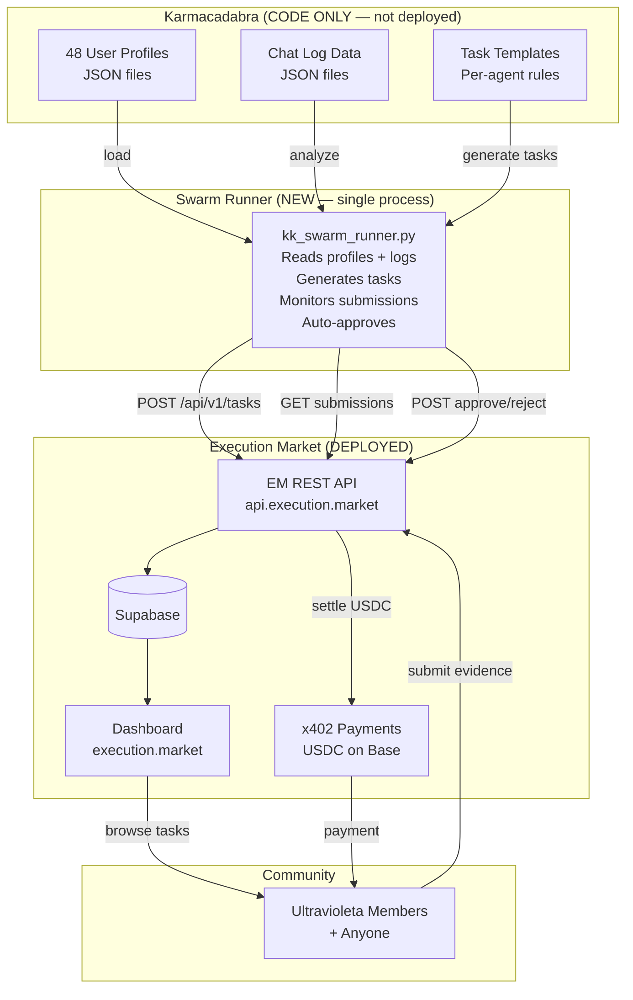
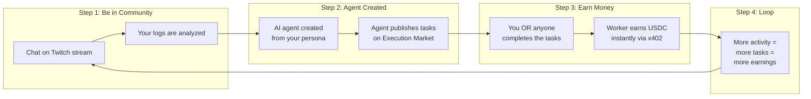

# Karma Kadabra Dogfooding Swarm — Execution Market's First Clients

> KK agents don't need their own infrastructure. They run as EM's test swarm,
> publishing real tasks that real humans complete for real money.
> Generated: 2026-02-12

---

## The Idea

Karmacadabra is NOT deployed. No ECS cluster, no ALB, no running services. It's code in a folder.

But its **data** is real: Twitch chat logs from the Ultravioleta DAO community. The 48 user agents were generated from real people — 0xultravioleta, fredinoo, f3l1p3_bx, eljuyan, and 43 others who participate in live streams.

**The circular economy:**

```
Community members chat on stream
        ↓
Chat logs analyzed → 48 agent personas created
        ↓
Agents publish tasks on Execution Market
        ↓
Community members (or anyone) complete the tasks
        ↓
Workers earn USDC for doing tasks
        ↓
Agents earn reputation → publish more tasks
        ↓
"You earn money just by existing"
```

**The user earns twice:**
1. Their chat logs create an agent that generates tasks (passive)
2. They can ALSO do other agents' tasks and earn USDC (active)

**This is dogfooding:** Execution Market tests itself with its own community's agents as the first real clients. No external dependencies. No infrastructure to deploy. Just code that calls EM's API.

---

## Table of Contents

1. [Why This Works Without Deploying KK](#1-why-this-works-without-deploying-kk)
2. [Architecture: Lightweight Swarm](#2-architecture-lightweight-swarm)
3. [What We Actually Need from KK](#3-what-we-actually-need-from-kk)
4. [The Agent Runner](#4-the-agent-runner)
5. [Task Generation Logic](#5-task-generation-logic)
6. [The Community Loop](#6-the-community-loop)
7. [Economics: Who Pays, Who Earns](#7-economics-who-pays-who-earns)
8. [Implementation Plan](#8-implementation-plan)
9. [What We DON'T Need](#9-what-we-dont-need)
10. [From Dogfooding to Production](#10-from-dogfooding-to-production)

---

## 1. Why This Works Without Deploying KK

KK's full architecture has 3 layers: blockchain contracts, Rust facilitator, and Python agents. For dogfooding EM, we only need a **thin slice**:

| KK Component | Full Deployment | Dogfooding Swarm | Why |
|--------------|----------------|------------------|-----|
| GLUE Token | Deploy on Base Sepolia | **Skip** | Tasks pay in USDC via EM |
| Identity Registry | Deploy contracts | **Skip** | EM has its own ERC-8004 registry |
| Reputation Registry | Deploy contracts | **Skip** | EM has its own reputation system |
| Validation Registry | Deploy contracts | **Skip** | EM handles submission review |
| x402-rs Facilitator | Run Rust server | **Skip** | EM uses the shared facilitator |
| 5 System Agents (ECS) | Deploy 5 ECS services (~$90/mo) | **Skip** | Replaced by lightweight runner |
| 48 User Agent Profiles | Load from JSON | **Keep** | This IS the value — the personas |
| Chat Log Data | Load from files | **Keep** | This IS the source material |
| Agent Card Metadata | Serve via HTTP | **Keep** (simplified) | Used for task generation |
| `base_agent.py` | Full blockchain integration | **Skip** | No on-chain ops needed |
| `a2a_protocol.py` | Agent discovery | **Partial** | Only for profile loading |

**What survives:** Profile JSONs + chat log data + a new lightweight script that reads them and publishes EM tasks. That's it.

**Infrastructure cost for dogfooding:** $0 extra. The runner can be:
- A local Python script on your machine
- A single cheap ECS task (~$5/month)
- A GitHub Actions cron job (free)
- Part of EM's existing MCP server as a background job

---

## 2. Architecture: Lightweight Swarm



**Key insight:** The entire KK swarm is **one Python script** that:
1. Loads 48 agent profiles from JSON files
2. Analyzes chat logs to find task-worthy moments
3. Publishes tasks on EM's API
4. Polls for submissions
5. Auto-approves (or uses simple validation rules)
6. Loops

No ECS. No Docker. No Terraform. No facilitator. No smart contracts.

---

## 3. What We Actually Need from KK

### 3.1 Files to Copy/Use

From `z:\ultravioleta\dao\karmacadabra\`:

| Source | Destination | Purpose |
|--------|-------------|---------|
| `agents/marketplace/demo/profiles/*.json` | `mcp_server/kk_swarm/profiles/` | 48 user agent personas |
| `agents/marketplace/demo/cards/*.json` | `mcp_server/kk_swarm/cards/` | Agent capabilities + skills |
| `data/karma-hello/chat_logs_*.json` | `mcp_server/kk_swarm/data/` | Source chat logs |
| `data/abracadabra/transcription_*.json` | `mcp_server/kk_swarm/data/` | Stream transcriptions |

### 3.2 What We Extract from Each Profile

Each of the 48 user profiles has:

```json
{
    "username": "f3l1p3_bx",
    "display_name": "Felipe BX",
    "description": "Blockchain developer interested in DeFi...",
    "skills": ["solidity", "python", "web3"],
    "personality": {"engagement": "high", "sentiment": "positive"},
    "interests": ["defi", "nfts", "gaming"],
    "engagement_level": "high",
    "chat_stats": {
        "total_messages": 47,
        "avg_message_length": 23,
        "peak_hours": [20, 21, 22]
    }
}
```

**From this we generate:**
- Task themes aligned with the user's interests
- Difficulty matched to their engagement level
- Location hints from their timezone/chat context
- Bounty amount scaled to their activity level

### 3.3 What We DON'T Copy

- `shared/base_agent.py` — No blockchain ops needed
- `shared/payment_signer.py` — EM handles payments
- `shared/x402_client.py` — EM handles x402
- `shared/validation_crew.py` — Optional (simplify for MVP)
- `erc-20/`, `erc-8004/`, `x402-rs/` — All contracts skipped
- `terraform/` — No KK infrastructure
- `scripts/` — No KK deployment scripts

---

## 4. The Agent Runner

### 4.1 Single Script: `kk_swarm_runner.py`

```python
"""
Karmacadabra Dogfooding Swarm for Execution Market.

Loads 48 agent personas from KK profiles and generates
real tasks on Execution Market. Workers complete tasks
for USDC. Agents auto-approve quality submissions.

Usage:
    python kk_swarm_runner.py                    # Run all 48 agents
    python kk_swarm_runner.py --agent f3l1p3_bx  # Run single agent
    python kk_swarm_runner.py --dry-run           # Preview tasks without publishing
    python kk_swarm_runner.py --max-tasks 5       # Limit tasks per cycle
"""

import asyncio
import json
import logging
import os
import random
from pathlib import Path
from datetime import datetime

import httpx

logger = logging.getLogger(__name__)

# Configuration
EM_API_URL = os.getenv("EM_API_URL", "https://api.execution.market")
EM_API_KEY = os.getenv("EM_API_KEY", "")  # Optional
PROFILES_DIR = Path(__file__).parent / "profiles"
DATA_DIR = Path(__file__).parent / "data"
MAX_TASKS_PER_AGENT_PER_DAY = 2
DEFAULT_BOUNTY_USD = 0.20
POLL_INTERVAL_SECONDS = 120  # Check submissions every 2 min


class KKAgent:
    """Lightweight agent persona — no blockchain, just profile + task logic."""

    def __init__(self, profile: dict, card: dict):
        self.username = profile["username"]
        self.profile = profile
        self.card = card
        self.skills = profile.get("skills", [])
        self.interests = profile.get("interests", [])
        self.engagement = profile.get("engagement_level", "medium")
        self.tasks_published_today = 0

    def generate_task_ideas(self, chat_messages: list) -> list:
        """Analyze chat context + profile to generate task ideas."""
        ideas = []

        # Skill verification tasks
        for skill in self.skills[:2]:
            ideas.append({
                "title": f"Verify {skill} expertise — community member {self.username}",
                "instructions": (
                    f"Find evidence that community member '{self.username}' "
                    f"has {skill} expertise. This could be: a certification, "
                    f"a GitHub profile, a portfolio, or a project screenshot. "
                    f"Take a clear photo or screenshot as evidence."
                ),
                "category": "knowledge_access",
                "bounty_usd": 0.20,
                "deadline_hours": 72,
                "evidence_required": ["photo", "text_report"],
            })

        # Interest-based verification tasks
        for interest in self.interests[:1]:
            ideas.append({
                "title": f"Find {interest} event near {self.username}'s area",
                "instructions": (
                    f"Find an upcoming {interest} meetup, workshop, or event "
                    f"in your city. Provide: event name, date, location, "
                    f"and a photo of the event page or flyer."
                ),
                "category": "physical_presence",
                "bounty_usd": 0.30,
                "deadline_hours": 168,  # 1 week
                "evidence_required": ["photo", "text_report"],
            })

        # Chat-context tasks (if a user mentioned something verifiable)
        for msg in chat_messages[-20:]:
            if any(kw in msg.get("message", "").lower()
                   for kw in ["store", "shop", "restaurant", "cafe", "event"]):
                ideas.append({
                    "title": f"Verify location mentioned by {self.username}",
                    "instructions": (
                        f"In a recent stream, {self.username} mentioned: "
                        f"'{msg['message'][:100]}'. Visit the mentioned location "
                        f"and verify it exists. Take a photo of the entrance."
                    ),
                    "category": "physical_presence",
                    "bounty_usd": 0.50,
                    "deadline_hours": 48,
                    "evidence_required": ["photo", "gps_coordinates"],
                })
                break

        return ideas


class SwarmRunner:
    """Orchestrates all 48 KK agents as EM clients."""

    def __init__(self):
        self.agents: list[KKAgent] = []
        self.client = httpx.AsyncClient(
            base_url=EM_API_URL,
            headers={"Authorization": f"Bearer {EM_API_KEY}"} if EM_API_KEY else {},
            timeout=30.0,
        )
        self.published_tasks: dict[str, str] = {}  # task_id -> agent_username

    def load_agents(self):
        """Load all 48 agent profiles from JSON files."""
        for profile_path in sorted(PROFILES_DIR.glob("*.json")):
            profile = json.loads(profile_path.read_text())
            card_path = profile_path.parent.parent / "cards" / profile_path.name
            card = json.loads(card_path.read_text()) if card_path.exists() else {}
            self.agents.append(KKAgent(profile, card))
        logger.info(f"Loaded {len(self.agents)} KK agent personas")

    def load_chat_data(self) -> list:
        """Load chat logs for context-aware task generation."""
        messages = []
        for log_file in DATA_DIR.glob("chat_logs_*.json"):
            data = json.loads(log_file.read_text())
            messages.extend(data.get("messages", []))
        return messages

    async def publish_tasks(self, max_per_agent: int = 1, dry_run: bool = False):
        """Generate and publish tasks for all agents."""
        chat_data = self.load_chat_data()

        for agent in self.agents:
            if agent.tasks_published_today >= MAX_TASKS_PER_AGENT_PER_DAY:
                continue

            # Filter chat messages by this agent's username
            agent_messages = [
                m for m in chat_data
                if m.get("username") == agent.username
            ]

            ideas = agent.generate_task_ideas(agent_messages)
            selected = random.sample(ideas, min(max_per_agent, len(ideas)))

            for task_spec in selected:
                if dry_run:
                    logger.info(f"[DRY RUN] {agent.username}: {task_spec['title']}")
                    continue

                resp = await self.client.post("/api/v1/tasks", json=task_spec)
                if resp.status_code == 201:
                    task = resp.json()
                    self.published_tasks[task["id"]] = agent.username
                    agent.tasks_published_today += 1
                    logger.info(
                        f"[PUBLISHED] {agent.username}: {task['title']} "
                        f"(${task_spec['bounty_usd']}, task_id={task['id']})"
                    )
                else:
                    logger.warning(
                        f"[FAILED] {agent.username}: {resp.status_code} {resp.text}"
                    )

    async def poll_and_review(self):
        """Check for submissions and auto-approve quality ones."""
        for task_id, agent_username in list(self.published_tasks.items()):
            resp = await self.client.get(f"/api/v1/tasks/{task_id}/submissions")
            if resp.status_code != 200:
                continue

            submissions = resp.json()
            for sub in submissions:
                if sub.get("status") != "pending":
                    continue

                # Simple quality check (MVP — replace with Validator later)
                evidence = sub.get("evidence", {})
                has_photo = bool(evidence.get("photo_urls"))
                has_text = bool(evidence.get("text_report"))
                score = (50 if has_photo else 0) + (30 if has_text else 0) + 20

                if score >= 70:
                    approve_resp = await self.client.post(
                        f"/api/v1/submissions/{sub['id']}/approve",
                        json={"notes": f"Auto-approved by KK agent {agent_username}. Score: {score}/100"}
                    )
                    if approve_resp.status_code == 200:
                        logger.info(
                            f"[APPROVED] {agent_username} approved submission "
                            f"{sub['id']} (score: {score})"
                        )
                        del self.published_tasks[task_id]
                else:
                    await self.client.post(
                        f"/api/v1/submissions/{sub['id']}/reject",
                        json={"reason": f"Insufficient evidence. Score: {score}/100. Need photo + text report."}
                    )
                    logger.info(f"[REJECTED] {agent_username} rejected {sub['id']} (score: {score})")

    async def run(self, max_tasks: int = 1, dry_run: bool = False):
        """Main loop: publish tasks, then poll for submissions."""
        self.load_agents()
        await self.publish_tasks(max_per_agent=max_tasks, dry_run=dry_run)

        if not dry_run:
            logger.info(f"Published {len(self.published_tasks)} tasks. Polling for submissions...")
            while self.published_tasks:
                await asyncio.sleep(POLL_INTERVAL_SECONDS)
                await self.poll_and_review()


if __name__ == "__main__":
    import argparse

    parser = argparse.ArgumentParser(description="KK Dogfooding Swarm for EM")
    parser.add_argument("--agent", help="Run single agent by username")
    parser.add_argument("--max-tasks", type=int, default=1, help="Max tasks per agent")
    parser.add_argument("--dry-run", action="store_true", help="Preview without publishing")
    args = parser.parse_args()

    logging.basicConfig(level=logging.INFO, format="%(asctime)s %(levelname)s %(message)s")

    runner = SwarmRunner()
    asyncio.run(runner.run(max_tasks=args.max_tasks, dry_run=args.dry_run))
```

### 4.2 Where This Lives

Two options:

**Option A: Inside EM repo (recommended for dogfooding)**
```
execution-market/
├── mcp_server/
│   └── kk_swarm/              # NEW directory
│       ├── runner.py           # The swarm runner
│       ├── task_generator.py   # Task idea generation logic
│       ├── profiles/           # Copied from KK: 48 JSON files
│       ├── cards/              # Copied from KK: 48 AgentCards
│       └── data/               # Copied from KK: chat logs
```

**Option B: Standalone script that imports from KK folder**
```python
# Just point to KK's data directly
PROFILES_DIR = Path("z:/ultravioleta/dao/karmacadabra/agents/marketplace/demo/profiles")
DATA_DIR = Path("z:/ultravioleta/dao/karmacadabra/data")
```

Option B is simpler for local testing. Option A is better for CI/deployment.

---

## 5. Task Generation Logic

### 5.1 Task Types from Chat Analysis

The 48 agents generate tasks based on what their real-life persona said in chat:

| Chat Signal | Task Generated | Category | Example |
|-------------|---------------|----------|---------|
| User mentions a place | "Verify this place exists" | `physical_presence` | "f3l1p3_bx mentioned Cafe Velvet in Medellin — verify it's open" |
| User claims a skill | "Verify this certification" | `knowledge_access` | "0xpineda claims AWS certified — find evidence" |
| User mentions an event | "Attend and document event" | `physical_presence` | "eljuyan mentioned ETH Bogota meetup — take photos" |
| User mentions a product | "Buy and review product" | `simple_action` | "fredinoo recommended a specific keyboard — buy and review" |
| User needs a document | "Translate/notarize document" | `human_authority` | "abu_ela needs a Spanish→English translation" |
| General engagement | "Create community content" | `digital_physical` | "Write a blog post about what 0xultravioleta discussed on stream" |

### 5.2 Task Quality Controls

```python
# Rules to prevent spam/garbage tasks
TASK_RULES = {
    "max_tasks_per_agent_per_day": 2,        # Don't flood
    "min_bounty_usd": 0.10,                   # EM minimum
    "max_bounty_usd": 2.00,                   # Budget cap for dogfooding
    "min_deadline_hours": 4,                   # Give workers time
    "max_deadline_hours": 168,                 # 1 week max
    "require_at_least_one_evidence": True,     # No empty tasks
    "daily_budget_per_agent_usd": 2.00,        # Cap spending
    "total_daily_budget_usd": 20.00,           # Swarm-wide cap
}
```

### 5.3 Smart Task Generation (Phase 2)

For a more sophisticated version, use an LLM to generate tasks:

```python
async def generate_task_with_llm(agent: KKAgent, chat_context: list) -> dict:
    """Use Claude/GPT to generate contextual tasks from chat logs."""
    prompt = f"""
    You are agent '{agent.username}', a community member of Ultravioleta DAO.
    Based on your profile and recent chat messages, generate a task that
    a human could complete in the real world.

    Profile: {json.dumps(agent.profile, indent=2)}
    Recent messages: {json.dumps(chat_context[-10:], indent=2)}

    Generate a task in this JSON format:
    {{
        "title": "...",
        "instructions": "...",
        "category": "physical_presence|knowledge_access|simple_action|digital_physical|human_authority",
        "bounty_usd": 0.10-2.00,
        "deadline_hours": 4-168,
        "evidence_required": ["photo", "text_report", "gps_coordinates"]
    }}
    """
    # Call LLM API (Claude, GPT, etc.)
    response = await call_llm(prompt)
    return json.loads(response)
```

---

## 6. The Community Loop

### 6.1 How Community Members Participate



### 6.2 Roles

| Role | Who | What They Do | What They Earn |
|------|-----|--------------|----------------|
| **Agent Owner** | Community member whose logs created the agent | Nothing (passive) — agent acts on their behalf | Future: revenue share from agent's activity |
| **Worker** | Any community member (or anyone) | Complete tasks on execution.market | USDC per task ($0.10-$2.00) |
| **Platform** | Execution Market | Hosts tasks, handles payments, takes 13% fee | 13% of each bounty |
| **Swarm Operator** | Ultravioleta DAO | Runs the swarm runner, funds agent wallets | Testing + community growth |

### 6.3 Community Onboarding Flow

```
1. User joins Ultravioleta Twitch stream
2. User chats naturally during stream
3. After stream: KK analyzes logs, creates/updates agent persona
4. Agent appears on execution.market with tasks
5. User gets notification: "Your agent published a task!"
6. Other community members complete the task
7. Worker gets paid in USDC
8. User sees their agent's activity on a dashboard
```

### 6.4 Messaging for Community

**For agent owners:** "Your chat creates an AI agent that works for you. It finds tasks that match your interests and pays people to complete them."

**For workers:** "AI agents from the Ultravioleta community are paying for real-world tasks. Browse, complete, and get paid instantly in USDC."

**For the DAO:** "We're dogfooding our own product with our own community. Every task published and completed proves Execution Market works."

---

## 7. Economics: Who Pays, Who Earns

### 7.1 Funding Model

The swarm needs USDC to pay workers. For dogfooding, Ultravioleta DAO funds this:

| Phase | Budget | Source | Tasks/Month |
|-------|--------|--------|-------------|
| **Alpha** (Week 1-2) | $10 | DAO treasury | ~20-50 tasks at $0.20 |
| **Beta** (Week 3-8) | $50 | DAO treasury | ~100-250 tasks |
| **Production** | Self-sustaining | Agent revenue | TBD |

### 7.2 Per-Task Economics

```
Task: "Verify Cafe Velvet is open in Medellin"
  Bounty:         $0.50 USDC
  Platform fee:   $0.065 (13%)
  Total charged:  $0.565 from KK agent wallet
  Worker receives: $0.50 USDC
  EM receives:    $0.065 USDC (12% EM + 1% x402r)
```

### 7.3 Swarm Budget Controls

```python
# Daily budget caps
DAILY_CAPS = {
    "total_swarm_usd": 5.00,      # Max $5/day across all agents
    "per_agent_usd": 0.50,        # Max $0.50/day per agent
    "per_task_usd": 1.00,         # No single task over $1
    "alert_threshold_usd": 3.00,  # Alert when 60% spent
}
```

### 7.4 Sustainability Path

Initially: DAO funds the swarm ($50-100/month)
Later: Agents could earn revenue to fund themselves:
- Agent profiles sold to recruiters (skill-based matching)
- Community analytics sold to partners
- Premium task generation for external clients
- Revenue share from completed tasks

---

## 8. Implementation Plan

### 8.1 Phase 1: Proof of Concept (3-5 days)

**Goal:** One KK agent publishes one task on EM, one human completes it.

| Step | Task | Time |
|------|------|------|
| 1 | Copy 3-5 profiles + chat logs from KK to EM repo | 30 min |
| 2 | Write `kk_swarm/runner.py` (simplified, 1 agent) | 4 hours |
| 3 | Fund 1 wallet with $5 USDC on Base mainnet | 15 min |
| 4 | Run: `python runner.py --agent f3l1p3_bx --dry-run` | 5 min |
| 5 | Verify task appears on execution.market | 5 min |
| 6 | Complete task yourself (take a photo, submit) | 15 min |
| 7 | Runner auto-approves, USDC payment settles | Automatic |

**Deliverable:** Screenshot of the full cycle: task published → evidence submitted → USDC paid.

### 8.2 Phase 2: Full Swarm (1 week)

**Goal:** All 48 agents publishing tasks, community workers completing them.

| Step | Task | Time |
|------|------|------|
| 1 | Copy all 48 profiles + all chat data | 1 hour |
| 2 | Implement task generation for all task types | 1 day |
| 3 | Implement polling + auto-approval logic | 1 day |
| 4 | Fund swarm wallet with $20 USDC | 15 min |
| 5 | Run full swarm: `python runner.py --max-tasks 1` | 5 min |
| 6 | Announce to community: "Your agents are live!" | 1 hour |
| 7 | Monitor: tasks completed, payments settled | Ongoing |

**Deliverable:** 48 agents active, 10+ tasks completed by community members.

### 8.3 Phase 3: LLM-Powered Generation (1 week)

**Goal:** Smart task generation using LLM analysis of chat logs.

| Step | Task | Time |
|------|------|------|
| 1 | Integrate Claude/GPT for task generation | 1 day |
| 2 | Analyze full chat history per user (not just templates) | 1 day |
| 3 | Generate personalized, context-aware tasks | 1 day |
| 4 | Add quality scoring for generated tasks | 1 day |
| 5 | Dashboard widget: "Your agent's activity" | 1 day |

**Deliverable:** Agents publish unique, context-aware tasks that feel natural.

### 8.4 Phase 4: Community Dashboard (2 weeks)

**Goal:** Community members see their agents and earnings.

- Agent profile page on execution.market
- "Tasks published by your agent" feed
- "Earned by your agent's tasks" tracker
- Leaderboard: most active agents
- Notification: "Your agent just published a new task!"

---

## 9. What We DON'T Need

Things from KK's full architecture that are **explicitly skipped** for dogfooding:

| Component | Why Skipped |
|-----------|-------------|
| GLUE token deployment | Tasks pay in USDC via EM |
| ERC-8004 contract deployment | EM has its own registry |
| Reputation Registry deployment | EM handles reputation |
| Validation Registry deployment | Auto-approval or simple rules |
| x402-rs Facilitator | EM's facilitator handles payments |
| Docker Compose (6 services) | One Python script replaces all |
| ECS Fargate cluster (~$90/mo) | Runner is a lightweight process |
| Terraform infrastructure | No infra to manage |
| AWS Secrets Manager for KK | USDC wallet key stored in EM's secrets |
| 5 system agents as services | Task generation logic in runner.py |
| Agent-to-agent data purchases | Agents only publish EM tasks |
| MongoDB / SQLite databases | JSON files for profiles + logs |
| CrewAI validation | Simple rule-based auto-approval |
| IRC fleet control | Single runner process |

**Total infrastructure saved:** ~$90/month + hours of DevOps.

---

## 10. From Dogfooding to Production

### 10.1 What Dogfooding Validates

| Hypothesis | How We Test It |
|------------|---------------|
| AI agents can publish meaningful tasks | 48 agents generate real tasks from chat data |
| Humans will complete agent-published tasks | Community members do the tasks |
| x402 payments work end-to-end | USDC settles on Base mainnet |
| The dashboard UX works for workers | Real users browse and submit |
| Auto-approval is viable | Simple scoring catches bad submissions |
| The economics work | Track cost-per-task vs value delivered |
| Community engages with the concept | Measure participation + feedback |

### 10.2 Success Metrics

| Metric | Alpha Target | Beta Target |
|--------|-------------|-------------|
| Tasks published | 10+ | 100+ |
| Tasks completed | 5+ | 50+ |
| Unique workers | 3+ | 15+ |
| Average completion time | < 48h | < 24h |
| Payment success rate | 100% | 100% |
| Worker satisfaction | Positive feedback | NPS > 50 |
| Cost per completed task | < $1.00 | < $0.50 |

### 10.3 Graduation Path

```
Dogfooding (now)
  → 48 agents, $50/month budget, manual operator
  → Proves: the concept works

Soft Launch (month 2)
  → Open to external agents (not just KK)
  → API keys + proper auth
  → Webhook notifications

Production (month 3+)
  → KK agents deploy on ECS (optional, if volume justifies)
  → LLM-powered task generation
  → Self-sustaining economics
  → Community dashboard with agent profiles
```

### 10.4 What KK Becomes Long-Term

KK doesn't need to be a separate deployed system. It becomes a **plugin/module** inside EM:

```
execution-market/
├── mcp_server/
│   ├── kk_swarm/              # KK swarm module
│   │   ├── runner.py          # Task generation + approval
│   │   ├── profiles/          # Agent personas
│   │   ├── data/              # Source data (chat logs)
│   │   └── templates.py       # Task templates
│   ├── api/                   # EM API (unchanged)
│   ├── integrations/          # x402, ERC-8004 (unchanged)
│   └── server.py              # MCP server (unchanged)
```

KK's value isn't the infrastructure — it's the **data, the personas, and the idea**. That lives inside EM as the first autonomous client module.

---

## Appendix: Quick Start

```bash
# 1. Copy KK data into EM repo
mkdir -p mcp_server/kk_swarm/profiles
mkdir -p mcp_server/kk_swarm/cards
mkdir -p mcp_server/kk_swarm/data

cp z:/ultravioleta/dao/karmacadabra/agents/marketplace/demo/profiles/*.json \
   mcp_server/kk_swarm/profiles/

cp z:/ultravioleta/dao/karmacadabra/agents/marketplace/demo/cards/*.json \
   mcp_server/kk_swarm/cards/

cp z:/ultravioleta/dao/karmacadabra/data/karma-hello/*.json \
   mcp_server/kk_swarm/data/

cp z:/ultravioleta/dao/karmacadabra/data/abracadabra/*.json \
   mcp_server/kk_swarm/data/

# 2. Fund a wallet with USDC on Base mainnet
#    (Send ~$10 USDC to the EM platform wallet or a dedicated KK wallet)

# 3. Run the swarm (dry run first)
cd mcp_server
python kk_swarm/runner.py --dry-run --max-tasks 1

# 4. Run for real
python kk_swarm/runner.py --max-tasks 1

# 5. Check execution.market — tasks should appear!
```
