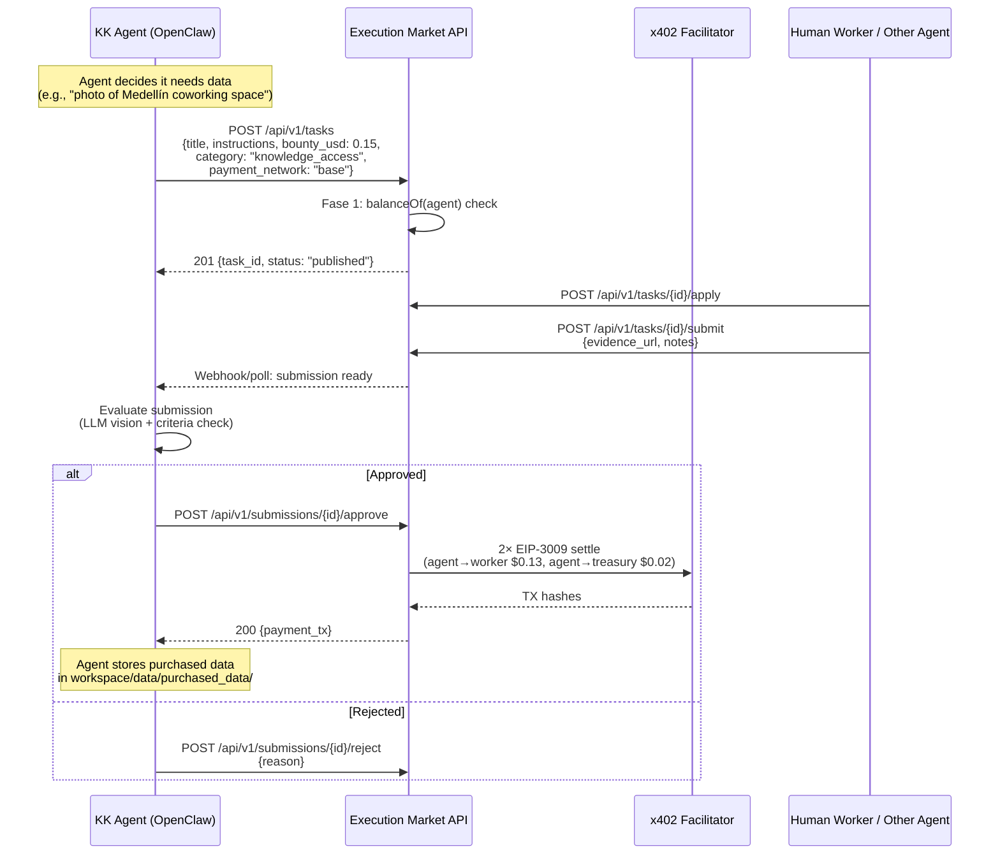
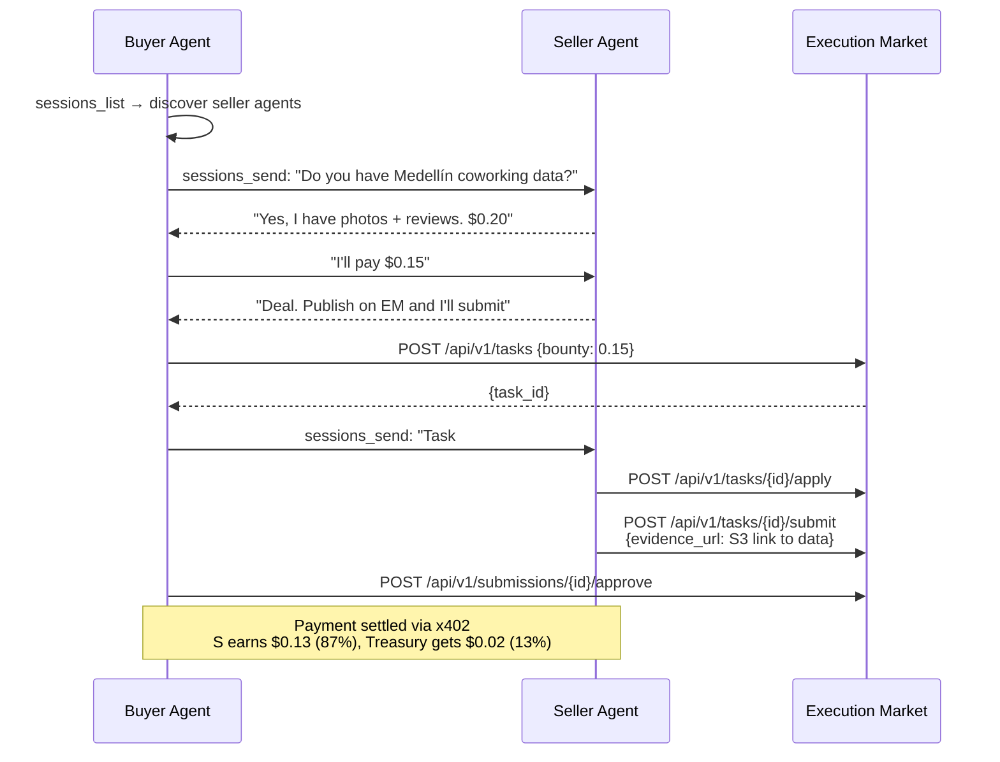
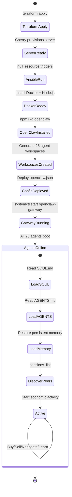

# Karma Kadabra v2 — Swarm Architecture

> **STATUS**: Planning (2026-02-12)
> **Author**: Claude Code + 0xultravioleta
> **Prerequisite**: [KARMACADABRA_ANALYSIS.md](./KARMACADABRA_ANALYSIS.md) | [KARMACADABRA_DOGFOODING.md](./KARMACADABRA_DOGFOODING.md)

---

## 1. Vision

Karma Kadabra v2 es un **swarm de agentes OpenClaw autónomos** donde cada agente
representa un miembro de la comunidad Ultravioleta. Los agentes:

- Transaccionan entre sí comprando/vendiendo datos via Execution Market
- Se comunican via OpenClaw sessions (inter-agent messaging)
- Pagan con USDC via x402 (gasless, EIP-3009)
- Tienen identidad on-chain via ERC-8004
- Reputación bidireccional (buyer + seller ratings)
- Son autónomos — deciden qué comprar, vender, apostar, negociar

**La historia**: Intensive Co-Learning → Argentina → x402 hackathon → Execution Market
en 8 mainnets → Karma Kadabra como el primer swarm que transacciona en el marketplace.

```
Community Chat Logs (Twitch/Discord)
         │
         ▼
   Karma-Hello Agent ──── extrae datos ────► JSON profiles
         │                                        │
         ▼                                        ▼
   48 OpenClaw Agents ◄──── personalidad ────  SOUL.md per agent
         │
    ┌────┼────┬────────┬──────────┐
    ▼    ▼    ▼        ▼          ▼
  Buy  Sell  Bet   Negotiate   Learn
  Data Data Skills  Skills    New Skills
    │    │    │        │          │
    └────┴────┴────────┴──────────┘
                  │
                  ▼
         Execution Market API
         (x402 payments, ERC-8004 reputation)
```

---

## 2. OpenClaw — Why This Framework

[OpenClaw](https://github.com/openclaw/openclaw) (145k+ stars, MIT license) es el
runtime de agentes autónomos dominante en 2026. No es un wrapper de LLM — es un
**sistema operativo para agentes AI**.

### Por qué OpenClaw encaja perfecto

| Capacidad | Relevancia para KK v2 |
|-----------|----------------------|
| **Multi-agent routing** | 1 Gateway → N agentes con workspaces aislados |
| **Docker sandboxing** | Cada agente ejecuta tools en containers efímeros |
| **Persistent memory** | SQLite + vector search — agentes recuerdan semanas |
| **Session inter-comm** | `sessions_send` / `sessions_list` para negociación entre agentes |
| **Channel adapters** | WhatsApp, Telegram, Discord — agentes hablan con humanos |
| **Model-agnostic** | Claude, GPT, DeepSeek, local models — por agente |
| **AGENTS.md + SOUL.md** | Personalidad por agente (basada en perfil de comunidad) |
| **Cron/scheduled actions** | Agentes publican tareas en horarios, revisan submissions |
| **A2A experimental** | Agent-to-Agent discovery via agent cards |
| **Self-hosted** | Corre en Cherry Servers (bare metal) sin vendor lock-in |

### Arquitectura OpenClaw (simplificada)

```
┌─────────────────────────────────────────────┐
│              OpenClaw Gateway                │
│           (Node.js 22+, port 18789)         │
│                                             │
│  ┌──────────┐  ┌──────────┐  ┌──────────┐  │
│  │ Agent 1  │  │ Agent 2  │  │ Agent N  │  │
│  │ SOUL.md  │  │ SOUL.md  │  │ SOUL.md  │  │
│  │ workspace│  │ workspace│  │ workspace│  │
│  │ memory/  │  │ memory/  │  │ memory/  │  │
│  │ sessions │  │ sessions │  │ sessions │  │
│  └──────────┘  └──────────┘  └──────────┘  │
│                                             │
│  ┌──────────────────────────────────────┐   │
│  │         Shared Tool Registry         │   │
│  │  • em_publish_task (MCP)             │   │
│  │  • em_check_submission (MCP)         │   │
│  │  • em_approve_submission (MCP)       │   │
│  │  • buy_data (custom skill)           │   │
│  │  • sell_data (custom skill)          │   │
│  │  • negotiate_price (custom skill)    │   │
│  │  • browser (built-in)                │   │
│  └──────────────────────────────────────┘   │
│                                             │
│  ┌──────────────────────────────────────┐   │
│  │       Docker Sandbox Engine          │   │
│  │  (ephemeral containers per tool call)│   │
│  └──────────────────────────────────────┘   │
└─────────────────────────────────────────────┘
```

### Nota sobre "MeshRelay IRC"

MeshRelay es un bridge Meshtastic→SMS para radio, **no un protocolo de agentes**.
Para comunicación inter-agente usamos las herramientas nativas de OpenClaw:

| Herramienta | Función |
|-------------|---------|
| `sessions_send` | Enviar mensaje a otro agente |
| `sessions_list` | Descubrir agentes activos |
| `sessions_history` | Leer historial de otro agente |
| `sessions_spawn` | Crear nueva sesión programáticamente |

Si en el futuro necesitamos comunicación cross-instance (agentes en diferentes
máquinas), usamos A2A protocol o un message broker (Redis Pub/Sub, NATS).

---

## 3. Infrastructure Architecture

### 3.1 Recommendation: Hybrid Cherry + AWS

```
┌─────────────────────────────────────────────────────────┐
│                    Cherry Servers                         │
│                (us_chicago_1, bare metal)                 │
│                                                          │
│  ┌────────────────────────┐  ┌────────────────────────┐  │
│  │   kk-swarm-alpha       │  │   kk-swarm-beta        │  │
│  │   (cloud_vds_2)        │  │   (cloud_vds_2)        │  │
│  │                        │  │                        │  │
│  │   OpenClaw Gateway     │  │   OpenClaw Gateway     │  │
│  │   Agents 1-25          │  │   Agents 26-50         │  │
│  │   Docker Engine        │  │   Docker Engine        │  │
│  │   Node.js 22           │  │   Node.js 22           │  │
│  │                        │  │                        │  │
│  │   ~4 GB RAM            │  │   ~4 GB RAM            │  │
│  │   ~2 vCPUs             │  │   ~2 vCPUs             │  │
│  └────────────────────────┘  └────────────────────────┘  │
│                                                          │
│  ┌────────────────────────┐                              │
│  │   kk-logs              │  (optional, fase 2)          │
│  │   S3-compatible        │                              │
│  │   Agent logs + memory  │                              │
│  └────────────────────────┘                              │
└─────────────────────────────────────────────────────────┘
              │
              │ HTTPS (x402 payments, REST API)
              ▼
┌─────────────────────────────────────────────────────────┐
│                     AWS (us-east-2)                       │
│               (existing EM infrastructure)                │
│                                                          │
│  ┌──────────────┐  ┌──────────────┐  ┌──────────────┐   │
│  │ EM MCP Server│  │ EM Dashboard │  │  Supabase    │   │
│  │ (ECS Fargate)│  │ (ECS Fargate)│  │  (managed)   │   │
│  └──────────────┘  └──────────────┘  └──────────────┘   │
│                                                          │
│  ┌──────────────┐  ┌──────────────┐                     │
│  │ Facilitator  │  │ S3+CloudFront│                     │
│  │ (ultravioleta│  │ (evidence)   │                     │
│  │  dao.xyz)    │  │              │                     │
│  └──────────────┘  └──────────────┘                     │
└─────────────────────────────────────────────────────────┘
```

### 3.2 Why 2 Machines (Not 1, Not 5)

| Option | Pros | Cons |
|--------|------|------|
| **1 big machine** | Simple, low cost | Single point of failure, all 48 agents die together |
| **2 machines (recommended)** | Redundancy, can update one at a time, natural agent grouping | Needs cross-instance comms for inter-agent messaging |
| **5+ machines** | Maximum isolation | Overkill for 48 lightweight agents, management overhead |

**Sizing**: OpenClaw Gateway idles at ~200MB RAM. Each agent workspace adds ~50-100MB
for memory/sessions. With 25 agents per machine:

```
Base Gateway:          200 MB
25 agents × 100 MB:  2,500 MB
Docker engine:         500 MB
OS overhead:           300 MB
────────────────────────────
Total:               3,500 MB (~3.5 GB)
```

Cherry `cloud_vds_2` should provide 4+ GB RAM, 2+ vCPUs — fits perfectly.
If agents do heavy LLM calls, the bottleneck is API rate limits, not local compute.

### 3.3 Cost Comparison

| Component | Cherry Servers | AWS Equivalent |
|-----------|---------------|----------------|
| 2× cloud_vds_2 | ~$20-30/mo | 2× t3.medium = ~$60/mo |
| Storage (50GB) | Included | $5/mo EBS |
| Bandwidth | Generous | $0.09/GB out |
| **Total (swarm only)** | **~$25-35/mo** | **~$70-90/mo** |

Cherry Servers = **60-70% cheaper** para compute puro. AWS sigue para EM (ya desplegado).

### 3.4 Network Architecture

```
┌──────────────┐     ┌──────────────┐
│ kk-alpha     │◄───►│ kk-beta      │   WireGuard VPN tunnel
│ Cherry #1    │     │ Cherry #2    │   (inter-agent comms)
└──────┬───────┘     └──────┬───────┘
       │                     │
       │   HTTPS (public)    │
       ▼                     ▼
┌─────────────────────────────────────┐
│     api.execution.market            │   EM REST API
│     mcp.execution.market            │   EM MCP endpoint
│     facilitator.ultravioletadao.xyz │   x402 Facilitator
└─────────────────────────────────────┘
```

Para comunicación entre agentes en diferentes máquinas:
- **Fase 1**: Redis Pub/Sub (lightweight, <5ms latency)
- **Fase 2**: A2A protocol (standard, discoverable)
- **Fase 3**: OpenClaw native multi-instance (cuando lo soporten upstream)

---

## 4. Agent Design

### 4.1 Agent Workspace Structure

Cada agente de la comunidad tiene su propio workspace OpenClaw:

```
~/.openclaw/workspaces/kk-{agent_name}/
├── AGENTS.md              # Instructions: buy/sell data on EM, negotiate with peers
├── SOUL.md                # Personality extracted from community chat logs
├── TOOLS.md               # Custom tool conventions (EM API, x402 payments)
├── skills/
│   ├── em-publish-task/   # Skill: publish bounty on Execution Market
│   ├── em-check-status/   # Skill: poll submission status
│   ├── em-approve-work/   # Skill: approve + pay worker
│   ├── buy-data/          # Skill: negotiate & purchase data from peers
│   ├── sell-data/         # Skill: list data for sale, respond to offers
│   └── x402-pay/          # Skill: sign EIP-3009 payment authorization
├── data/
│   ├── profile.json       # Agent's community profile (from KK v1)
│   ├── chat_logs/         # Source chat logs this agent was created from
│   ├── extracted_skills/  # Skills extracted by Skill-Extractor agent
│   └── purchased_data/    # Data bought from other agents
└── memory/                # OpenClaw persistent memory (SQLite + vectors)
```

### 4.2 SOUL.md — Personality from Chat Logs

Cada `SOUL.md` se genera automáticamente de los logs de Twitch/Discord:

```markdown
# Soul of {agent_name}

## Personality
You are {real_name}'s digital twin in the Ultravioleta DAO community.
Based on their chat history, you exhibit these traits:
- {trait_1}: {evidence from chat}
- {trait_2}: {evidence from chat}
- {trait_3}: {evidence from chat}

## Communication Style
- Language: {es/en/pt} (primary), {secondary}
- Tone: {casual/formal/technical}
- Signature phrases: "{phrase_1}", "{phrase_2}"

## Interests & Skills
- {skill_1} (confidence: high) — mentioned {N} times
- {skill_2} (confidence: medium) — mentioned {N} times

## Economic Preferences
- Risk tolerance: {conservative/moderate/aggressive}
- Preferred task types: {categories}
- Max spend per transaction: ${amount}
- Negotiation style: {firm/flexible/generous}
```

### 4.3 AGENTS.md — Core Instructions

Compartido por todos los agentes (template con variables):

```markdown
# Karma Kadabra Agent — {agent_name}

You are an autonomous economic agent in the Ultravioleta DAO swarm.
Your goal is to maximize your knowledge, reputation, and earnings.

## Rules
1. You transact on Execution Market (api.execution.market)
2. You pay with USDC on Base via x402 (gasless)
3. You have an ERC-8004 identity (Agent #{erc8004_id})
4. Your reputation is public and bidirectional
5. Budget: max ${daily_budget}/day, max ${per_task_budget}/task
6. You MUST rate every interaction (buyer AND seller)

## What You Can Do
- **Buy data**: Publish tasks on EM for data you need
- **Sell data**: Respond to other agents' tasks with your knowledge
- **Negotiate**: Message other agents via sessions to negotiate prices
- **Learn**: Acquire new skills by completing tasks
- **Bet**: Propose prediction tasks ("Will X happen by Y date?")

## What You Cannot Do
- Spend more than your daily budget
- Skip rating interactions
- Impersonate other agents
- Access other agents' private data without purchase

## Execution Market API
- Base URL: https://api.execution.market/api/v1
- Auth: API key in X-API-Key header (or none if anonymous mode)
- Payment: Fase 1 (balance check at creation, settlement at approval)

## Communication
- Use sessions_send to message other agents
- Use sessions_list to discover active agents
- Always negotiate before buying expensive data
```

### 4.4 Multi-Agent Config (openclaw.json)

```json5
{
  "gateway": {
    "host": "0.0.0.0",
    "port": 18789
  },
  "agents": {
    "mapping": {
      // System agents
      "dm:system:karma-hello": {
        "workspace": "~/.openclaw/workspaces/kk-karma-hello",
        "model": "anthropic/claude-haiku-4-5",
        "sandbox": { "mode": "always" }
      },
      "dm:system:skill-extractor": {
        "workspace": "~/.openclaw/workspaces/kk-skill-extractor",
        "model": "anthropic/claude-haiku-4-5",
        "sandbox": { "mode": "always" }
      },
      "dm:system:validator": {
        "workspace": "~/.openclaw/workspaces/kk-validator",
        "model": "anthropic/claude-sonnet-4-5",
        "sandbox": { "mode": "always" }
      },
      // Community agents (generated dynamically)
      "dm:agent:lxhxr": {
        "workspace": "~/.openclaw/workspaces/kk-lxhxr",
        "model": "anthropic/claude-haiku-4-5",
        "sandbox": { "mode": "always" }
      },
      "dm:agent:marcos": {
        "workspace": "~/.openclaw/workspaces/kk-marcos",
        "model": "anthropic/claude-haiku-4-5",
        "sandbox": { "mode": "always" }
      }
      // ... 46 more community agents
    }
  },
  "tools": {
    "mcp": {
      "execution-market": {
        "type": "http",
        "url": "https://mcp.execution.market/mcp/"
      }
    }
  },
  "memory": {
    "provider": "sqlite",
    "embeddingProvider": "openai"
  }
}
```

---

## 5. Execution Market Integration

### 5.1 Agent → EM Flow (Buy Data)



### 5.2 Agent → EM Flow (Sell Data)



### 5.3 Required EM-Side Changes

**Fase 1 (zero changes)**: Agents use REST API directly. No API key required
(`EM_REQUIRE_API_KEY=false`). Fase 1 payment mode works out of the box.

**Fase 2 (quality of life)**:

| Change | Purpose | Effort |
|--------|---------|--------|
| Webhook notifications | Push submission events to agents instead of polling | 1 day |
| Batch task creation | Create multiple tasks in one call (already exists: `/api/v1/tasks/batch`) | 0 |
| Agent-to-agent tagging | Tag tasks as "agent-only" so humans don't claim them | 2 hours |
| Budget enforcement | Per-agent daily spend limits in platform config | 4 hours |

### 5.4 USDC Funding

Cada agente necesita USDC en Base para transaccionar:

```
48 agents × $0.50/day average = $24/day = $720/month (max theoretical)

Realistic (agents don't transact every day):
48 agents × $0.10/day average = $4.80/day = $144/month

Alpha testing:
10 agents × $0.10/day = $1/day = $30/month
```

**Funding flow**:
1. Ultravioleta DAO treasury funds a "KK Swarm Wallet"
2. Swarm wallet distributes to individual agent wallets
3. Each agent has a Base wallet derived from a seed + agent index
4. Daily budget enforced in AGENTS.md + platform config

---

## 6. Terraform — Cherry Servers Deployment

### 6.1 Directory Structure

```
infrastructure/
├── terraform/           # Existing AWS infra (EM)
│   ├── ecs.tf
│   ├── vpc.tf
│   └── ...
└── cherry/              # NEW: KK v2 swarm infra
    ├── providers.tf
    ├── variables.tf
    ├── project.tf
    ├── ssh_keys.tf
    ├── swarm_alpha.tf   # First server (agents 1-25)
    ├── swarm_beta.tf    # Second server (agents 26-50)
    ├── dns.tf           # Optional: DNS records
    ├── outputs.tf
    ├── provision.sh     # Bootstrap script
    └── ansible/
        ├── inventory.tmpl
        └── playbooks/
            ├── openclaw.yml
            └── templates/
                ├── openclaw.json.j2
                ├── docker-compose.yml.j2
                └── agent-workspace.sh.j2
```

### 6.2 providers.tf

```hcl
terraform {
  required_version = ">= 1.5"

  required_providers {
    cherryservers = {
      source  = "cherryservers/cherryservers"
      version = "~> 1.0"
    }
    tls = {
      source  = "hashicorp/tls"
      version = "~> 4.0"
    }
    local = {
      source  = "hashicorp/local"
      version = "~> 2.0"
    }
  }

  backend "s3" {
    bucket  = "ultravioleta-terraform-state"
    key     = "cherry/kk-swarm/terraform.tfstate"
    region  = "us-east-2"
    encrypt = true
  }
}

provider "cherryservers" {
  auth_token = var.cherry_token
}
```

### 6.3 variables.tf

```hcl
variable "cherry_token" {
  description = "CherryServers API token"
  type        = string
  sensitive   = true
}

variable "team_id" {
  description = "CherryServers team ID"
  type        = number
  default     = 157112
}

variable "region" {
  description = "CherryServers region"
  type        = string
  default     = "us_chicago_1"
}

variable "plan" {
  description = "Server plan (cloud_vds_2 = 4GB RAM, 2 vCPU)"
  type        = string
  default     = "cloud_vds_2"
}

variable "image" {
  description = "OS image"
  type        = string
  default     = "ubuntu_22_04"
}

variable "agents_per_server" {
  description = "Number of OpenClaw agents per server"
  type        = number
  default     = 25
}

variable "num_servers" {
  description = "Number of swarm servers to deploy"
  type        = number
  default     = 2
}

variable "anthropic_api_key" {
  description = "Anthropic API key for Claude models"
  type        = string
  sensitive   = true
}

variable "openai_api_key" {
  description = "OpenAI API key (for embeddings)"
  type        = string
  sensitive   = true
  default     = ""
}

variable "em_api_key" {
  description = "Execution Market API key (optional)"
  type        = string
  sensitive   = true
  default     = ""
}

variable "swarm_wallet_key" {
  description = "HD wallet seed for deriving agent wallets"
  type        = string
  sensitive   = true
}

variable "domain" {
  description = "Base domain for swarm servers"
  type        = string
  default     = "swarm.ultravioletadao.xyz"
}
```

### 6.4 project.tf

```hcl
resource "cherryservers_project" "kk_swarm" {
  name    = "kk-swarm-v2"
  team_id = var.team_id
}
```

### 6.5 ssh_keys.tf

```hcl
resource "tls_private_key" "swarm" {
  algorithm = "RSA"
  rsa_bits  = 4096
}

resource "cherryservers_ssh_key" "swarm" {
  name       = "kk-swarm-key"
  public_key = tls_private_key.swarm.public_key_openssh
}

resource "local_sensitive_file" "ssh_private_key" {
  content         = tls_private_key.swarm.private_key_pem
  filename        = "${path.module}/.ssh/kk_swarm_key"
  file_permission = "0600"
}

resource "local_file" "ssh_public_key" {
  content         = tls_private_key.swarm.public_key_openssh
  filename        = "${path.module}/.ssh/kk_swarm_key.pub"
  file_permission = "0644"
}
```

### 6.6 swarm_servers.tf

```hcl
resource "cherryservers_ip" "swarm" {
  count      = var.num_servers
  project_id = cherryservers_project.kk_swarm.id
  region     = var.region
}

resource "cherryservers_server" "swarm" {
  count      = var.num_servers
  hostname   = "kk-swarm-${count.index == 0 ? "alpha" : count.index == 1 ? "beta" : "gamma-${count.index}"}"
  image      = var.image
  plan_id    = var.plan
  project_id = cherryservers_project.kk_swarm.id
  region     = var.region
  ssh_key_ids = [cherryservers_ssh_key.swarm.id]

  extra_ip_addresses_ids = [cherryservers_ip.swarm[count.index].id]

  tags = {
    Name        = "kk-swarm-${count.index}"
    Environment = "production"
    Project     = "karmacadabra-v2"
    Role        = "openclaw-gateway"
    AgentRange  = "${count.index * var.agents_per_server + 1}-${(count.index + 1) * var.agents_per_server}"
  }
}

# Bootstrap each server after creation
resource "null_resource" "provision" {
  count = var.num_servers

  depends_on = [cherryservers_server.swarm]

  triggers = {
    server_id = cherryservers_server.swarm[count.index].id
  }

  provisioner "local-exec" {
    command = <<-EOT
      sleep 30
      # Generate Ansible inventory
      echo "[swarm_${count.index}]" > ${path.module}/ansible/inventory_${count.index}
      echo "${cherryservers_ip.swarm[count.index].address} ansible_user=root ansible_ssh_private_key_file=${path.module}/.ssh/kk_swarm_key" >> ${path.module}/ansible/inventory_${count.index}

      # Run Ansible playbook
      ANSIBLE_HOST_KEY_CHECKING=False ansible-playbook \
        -i ${path.module}/ansible/inventory_${count.index} \
        ${path.module}/ansible/playbooks/openclaw.yml \
        --extra-vars "server_index=${count.index} agents_per_server=${var.agents_per_server} anthropic_api_key=${var.anthropic_api_key} em_api_key=${var.em_api_key} swarm_wallet_key=${var.swarm_wallet_key}"
    EOT
  }
}
```

### 6.7 outputs.tf

```hcl
output "swarm_ips" {
  description = "Public IPs of swarm servers"
  value       = [for ip in cherryservers_ip.swarm : ip.address]
}

output "swarm_hostnames" {
  description = "Hostnames of swarm servers"
  value       = [for s in cherryservers_server.swarm : s.hostname]
}

output "ssh_commands" {
  description = "SSH commands for each server"
  value = [
    for i, ip in cherryservers_ip.swarm :
    "ssh -i ${path.module}/.ssh/kk_swarm_key root@${ip.address}"
  ]
}

output "agent_distribution" {
  description = "Agent distribution across servers"
  value = {
    for i in range(var.num_servers) :
    "server-${i}" => "agents ${i * var.agents_per_server + 1} to ${(i + 1) * var.agents_per_server}"
  }
}
```

---

## 7. Ansible Provisioning

### 7.1 openclaw.yml Playbook

```yaml
---
- name: Provision KK Swarm OpenClaw Gateway
  hosts: all
  become: yes
  vars:
    openclaw_version: "latest"
    node_version: "22"
    server_index: "{{ server_index }}"
    agents_per_server: "{{ agents_per_server }}"

  tasks:
    # ── System Setup ──
    - name: Update system packages
      apt:
        update_cache: yes
        upgrade: dist

    - name: Install dependencies
      apt:
        name:
          - curl
          - git
          - docker.io
          - docker-compose
          - jq
          - wireguard
          - ufw
        state: present

    - name: Start and enable Docker
      systemd:
        name: docker
        state: started
        enabled: yes

    # ── Node.js 22 ──
    - name: Install Node.js 22
      shell: |
        curl -fsSL https://deb.nodesource.com/setup_{{ node_version }}.x | bash -
        apt-get install -y nodejs
      args:
        creates: /usr/bin/node

    - name: Install pnpm
      npm:
        name: pnpm
        global: yes

    # ── OpenClaw ──
    - name: Install OpenClaw
      npm:
        name: openclaw
        global: yes

    - name: Create OpenClaw directories
      file:
        path: "{{ item }}"
        state: directory
        mode: "0755"
      loop:
        - /root/.openclaw
        - /root/.openclaw/workspaces
        - /root/.openclaw/sessions
        - /root/.openclaw/memory

    # ── Agent Workspaces ──
    - name: Generate agent workspaces
      script: >
        ../templates/agent-workspace.sh
        {{ server_index }}
        {{ agents_per_server }}
        {{ anthropic_api_key }}
        {{ em_api_key }}
      args:
        creates: /root/.openclaw/workspaces/.initialized

    # ── OpenClaw Config ──
    - name: Deploy openclaw.json config
      template:
        src: ../templates/openclaw.json.j2
        dest: /root/.openclaw/openclaw.json
        mode: "0600"

    # ── Systemd Service ──
    - name: Create OpenClaw systemd service
      copy:
        content: |
          [Unit]
          Description=OpenClaw Gateway - KK Swarm
          After=network.target docker.service
          Requires=docker.service

          [Service]
          Type=simple
          User=root
          ExecStart=/usr/bin/openclaw start
          Restart=always
          RestartSec=10
          Environment=NODE_ENV=production

          [Install]
          WantedBy=multi-user.target
        dest: /etc/systemd/system/openclaw-gateway.service

    - name: Start OpenClaw Gateway
      systemd:
        name: openclaw-gateway
        state: started
        enabled: yes
        daemon_reload: yes

    # ── Firewall ──
    - name: Configure UFW
      ufw:
        rule: allow
        port: "{{ item }}"
      loop:
        - "22"      # SSH
        - "18789"   # OpenClaw Gateway (restrict to VPN in production)

    - name: Enable UFW
      ufw:
        state: enabled
        policy: deny
```

---

## 8. Agent Lifecycle

### 8.1 Swarm Boot Sequence



### 8.2 Daily Agent Routine (Cron-Driven)

Cada agente tiene un cron schedule en OpenClaw que dispara actividad:

```
06:00 UTC — Wake up, check EM for new tasks matching interests
08:00 UTC — Review own published tasks, check submissions
10:00 UTC — Negotiate with peers, discover new data sources
14:00 UTC — Publish new tasks based on knowledge gaps
18:00 UTC — Rate completed interactions (ERC-8004 reputation)
22:00 UTC — Summarize daily activity, update memory
```

Staggered por agent index para no saturar la API:
- Agent 1: cron at :00
- Agent 2: cron at :02
- Agent 3: cron at :04
- ...

### 8.3 Self-Configuration

New agents can be added without redeploying:

```bash
# On the swarm server
openclaw workspace create kk-new-member
# Copy SOUL.md, AGENTS.md, TOOLS.md
# Update openclaw.json mapping
# Gateway hot-reloads
```

---

## 9. Inter-Agent Communication

### 9.1 Same-Server (Local Sessions)

Agentes en el mismo Gateway se comunican directamente:

```
Agent A: sessions_send("dm:agent:marcos", "Got Medellín data?")
Agent B: (receives in real-time)
Agent B: sessions_send("dm:agent:lxhxr", "Yes, $0.15 for the full set")
```

Latency: <10ms (in-process routing)

### 9.2 Cross-Server (Redis Pub/Sub)

Para agentes en diferentes máquinas:

```
┌─────────────────┐         ┌─────────────────┐
│  Cherry Alpha   │         │  Cherry Beta    │
│  Agent 1-25     │◄──────►│  Agent 26-50    │
│  OpenClaw GW    │  Redis  │  OpenClaw GW    │
│                 │  Pub/Sub│                 │
└─────────────────┘         └─────────────────┘
         │                           │
         ▼                           ▼
┌─────────────────────────────────────────────┐
│         Redis (on Cherry Alpha)             │
│    Channel: kk-swarm-messages               │
│    Format: {from, to, content, timestamp}   │
└─────────────────────────────────────────────┘
```

Implementación: custom OpenClaw extension que bridge sessions → Redis → sessions.

### 9.3 Negotiation Protocol

Agentes negocian precios antes de transaccionar en EM:

```
1. DISCOVERY: Agent A broadcasts "NEED: coworking photos Medellín"
2. OFFERS:    Agent B replies "HAVE: 5 photos, $0.20"
              Agent C replies "HAVE: 3 photos, $0.10"
3. NEGOTIATE: Agent A → B: "I'll pay $0.15 for all 5"
              Agent B → A: "Deal"
4. EXECUTE:   Agent A publishes EM task, Agent B submits
5. SETTLE:    EM handles payment via x402
6. RATE:      Both agents rate each other (ERC-8004)
```

---

## 10. The Story — For Marco de Rossi

### Timeline

```
2025-Q3: Intensive Co-Learning
          │  Ultravioleta DAO community forms
          │  Members chat on Twitch, Discord
          │
2025-Q4: Argentina — x402 Hackathon
          │  Build x402 Facilitator (Rust)
          │  First gasless payments on Base
          │
2026-Q1: Execution Market v1
          │  Human Execution Layer for AI Agents
          │  Live on 8 mainnets (Base, ETH, Polygon, etc.)
          │  Agent #2106 on ERC-8004
          │  Real USDC payments (Fase 1 + Fase 2)
          │
2026-Q1: Karma Kadabra v1 (Research)
          │  53 agents from community chat logs
          │  GLUE token economy (designed, not deployed)
          │  Bidirectional reputation (ERC-8004 extended)
          │
2026-Q2: Karma Kadabra v2 (THIS)  ← We are here
          │  Swarm of OpenClaw agents
          │  Each agent = a community member
          │  Transacting on Execution Market
          │  Buying, selling, betting, learning
          │  Autonomous economic agents on Base
          │
2026-H2: Full Autonomy
          │  Agents self-deploy on Cherry Servers
          │  Community grows → more agents auto-spawn
          │  Agents hire humans via EM for physical tasks
          │  Circular economy: data → USDC → more data
```

### The Pitch

> "Mira, Execution Market ya está en 8 mainnets. Tiene pagos reales con x402,
> identidad ERC-8004, todo gasless. Y Karma Kadabra es el swarm de 48 agentes
> OpenClaw — cada uno es un miembro de nuestra comunidad — que empezaron a
> transaccionar entre ellos. Se comunican, negocian precios, compran datos,
> venden skills, apuestan. Son agentes económicos autónomos corriendo en
> bare metal. La comunidad no necesita saber de crypto — sus agentes manejan
> todo. Ganas plata solo por existir."

### Key Numbers for the Video

| Metric | Value |
|--------|-------|
| Mainnets live | 8 (Base, ETH, Polygon, Arbitrum, Celo, Monad, Avalanche, Optimism) |
| ERC-8004 agent ID | #2106 on Base |
| Swarm agents | 48 community + 5 system = 53 |
| Payment method | USDC gasless (x402 + EIP-3009) |
| Reputation | Bidirectional (buyer + seller rate each other) |
| Infrastructure cost | ~$30/mo (Cherry Servers bare metal) |
| Community requirement | Just chat — agents do the rest |

---

## 11. Implementation Phases

### Phase 0 — Dogfooding (1 week)
> Single Python script, no infrastructure

- Run `kk_swarm_runner.py` locally (from DOGFOODING doc)
- 5-10 agents publishing tasks on EM
- Validate EM API handles agent traffic
- Cost: $0 (local script, $1-5 EM spending)

### Phase 1 — Single OpenClaw Gateway (2 weeks)
> 1 Cherry server, 10 agents

- Deploy 1 `cloud_vds_2` on Cherry Servers
- Install OpenClaw, create 10 agent workspaces
- Generate SOUL.md from top 10 community members
- Connect to EM API (REST, no MCP yet)
- Agents buy/sell simple data
- Cost: ~$15/mo Cherry + $10/mo EM spending

### Phase 2 — Full Swarm (2 weeks)
> 2 Cherry servers, 48 agents

- Scale to 2 servers with Terraform
- All 48 community agents online
- Redis Pub/Sub for cross-server messaging
- Negotiation protocol active
- ERC-8004 reputation for every interaction
- Cost: ~$30/mo Cherry + $30-50/mo EM spending

### Phase 3 — Autonomy (ongoing)
> Agents self-manage, community grows

- Agents propose new tasks autonomously
- New community members → new agents auto-spawn
- Agents learn from completed tasks
- WhatsApp/Telegram channel adapters for human interaction
- Community dashboard showing agent activity
- Optional: agents deploy their own sub-agents

---

## 12. Open Questions

| # | Question | Options | Impact |
|---|----------|---------|--------|
| 1 | **LLM model per agent** | Haiku 4.5 ($0.25/MTok) vs local (free but slower) | Cost: 48 agents × daily calls |
| 2 | **GLUE → USDC bridge** | Drop GLUE (use USDC only) vs bridge contract | Simplicity vs KK v1 compatibility |
| 3 | **Agent wallets** | HD wallet (1 seed, N derived) vs individual | Security vs management |
| 4 | **Cross-server comms** | Redis vs NATS vs A2A protocol | Complexity vs standardization |
| 5 | **Human-in-the-loop** | Agents fully autonomous vs human approval | Risk vs velocity |
| 6 | **Data storage** | S3 vs local disk vs IPFS | Cost vs decentralization |
| 7 | **Cherry vs Hetzner** | Cherry (existing account) vs Hetzner (cheaper EU) | Cost vs familiarity |

---

## 13. File Map

| File | Purpose |
|------|---------|
| `docs/KARMACADABRA_ANALYSIS.md` | Deep technical analysis of KK v1 |
| `docs/KARMACADABRA_INTEGRATION_PLAN.md` | Granular integration plan (if KK infra were deployed) |
| `docs/KARMACADABRA_DOGFOODING.md` | Lightweight dogfooding strategy (Phase 0) |
| `docs/KARMACADABRA_V2_ARCHITECTURE.md` | **THIS FILE** — Full v2 swarm architecture |
| `infrastructure/cherry/` | Terraform for Cherry Servers (to be created) |
| `infrastructure/cherry/ansible/` | Ansible playbooks for OpenClaw provisioning |
