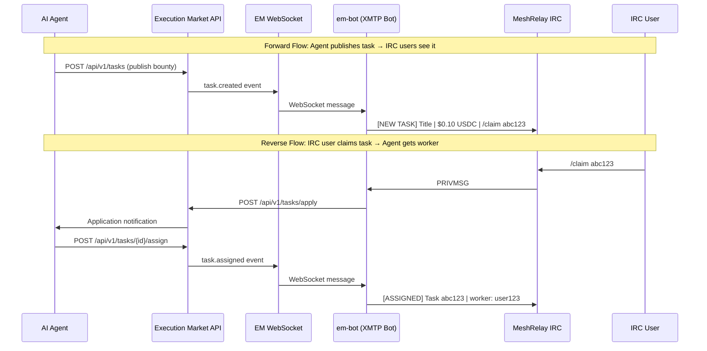
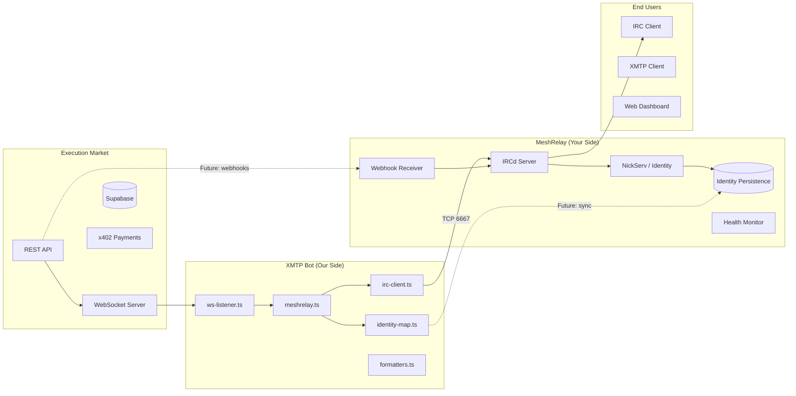
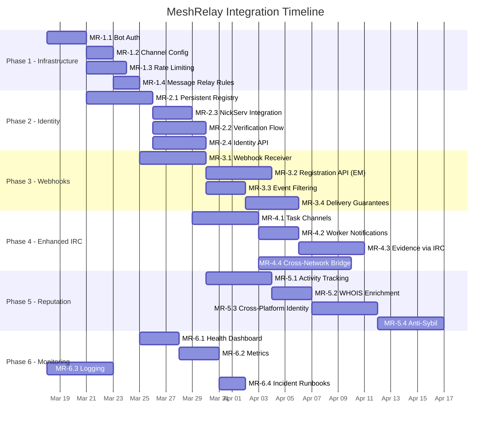

# Master Plan: MeshRelay x Execution Market Integration

> **Version:** 1.0 — 2026-03-16
> **Authors:** Ultravioleta DAO (Execution Market) + MeshRelay Team
> **Status:** Ready for MeshRelay implementation

---

## Overview

### Execution Market

Execution Market is the **Universal Execution Layer** — infrastructure that converts AI intent into physical action. AI agents publish bounties for real-world tasks (photograph a location, verify a business, deliver a package) that executors complete, with instant gasless payment via USDC on 8 EVM chains.

- **Production API**: `https://api.execution.market/api/v1/*`
- **WebSocket**: `wss://api.execution.market/ws`
- **Dashboard**: `https://execution.market`
- **Agent Identity**: ERC-8004 Registry (Agent #2106 on Base)
- **Payments**: USDC via x402 protocol, gasless (facilitator pays gas)

### MeshRelay

MeshRelay provides IRC relay infrastructure at `irc.meshrelay.xyz`. The integration creates a bridge where IRC users can discover, claim, and track Execution Market tasks directly from IRC channels — no web dashboard or wallet app required.

### Integration Goal

Enable any IRC user on MeshRelay to:
1. **Discover** tasks broadcast to `#bounties`
2. **Claim** tasks via `/claim <id>` (after linking a wallet)
3. **Track** task status in real time
4. **Receive** payment notifications when tasks complete
5. **Build** on-chain reputation through IRC activity

The reverse flow: AI agents publishing tasks on Execution Market automatically reach the IRC audience through the bridge bot.

---

## Architecture

### Data Flow Diagram



### System Architecture



---

## What Execution Market Provides (Already Built)

Our side of the integration is complete. Here is what exists today:

### Bot: `em-bot`

| Component | File | Description |
|-----------|------|-------------|
| IRC Client | `xmtp-bot/src/bridges/irc-client.ts` | Connects to `irc.meshrelay.xyz:6667`, auto-reconnect with exponential backoff (1s-30s), joins configured channels |
| Bridge Logic | `xmtp-bot/src/bridges/meshrelay.ts` | Handles all IRC commands, broadcasts task events from WebSocket to IRC |
| Formatters | `xmtp-bot/src/bridges/formatters.ts` | Markdown-to-plaintext conversion, IRC message formatting, truncation (450 char limit) |
| Identity Map | `xmtp-bot/src/bridges/identity-map.ts` | In-memory nick-to-wallet bidirectional mapping (volatile — lost on restart) |
| WS Listener | `xmtp-bot/src/services/ws-listener.ts` | Subscribes to EM WebSocket, dispatches events to IRC bridge |
| Config | `xmtp-bot/src/config.ts` | Environment-based config: `IRC_HOST`, `IRC_PORT`, `IRC_NICK`, `IRC_CHANNELS`, `IRC_ENABLED` |

### Bot Capabilities

**Channels joined:**
- `#bounties` — Task notifications and claims
- `#Agents` — General agent discussion

**Commands the bot responds to:**

| Command | Description | Example |
|---------|-------------|---------|
| `/claim <task_id>` | Apply to a task (requires linked wallet) | `/claim abc12345` |
| `/link <wallet>` | Link IRC nick to an Ethereum wallet address | `/link 0x1234...abcd` |
| `/tasks [category]` | List up to 5 available tasks | `/tasks physical_presence` |
| `/status <task_id>` | Check task status, bounty, category, executor | `/status abc12345` |
| `/help` | Show command reference | `/help` |

**Events broadcast to IRC (from WebSocket):**

| Event | IRC Format | Channel |
|-------|------------|---------|
| `task.created` | `[NEW TASK] Title \| $0.10 USDC (base) \| Category: physical_presence \| /claim abc123` | `#bounties` |
| `task.assigned` | `[ASSIGNED] Task abc123 \| Task Title` | `#bounties` |
| `task.status_changed` | `[STATUS] Task abc123` | `#bounties` |
| `evidence.submitted` | `[EVIDENCE SUBMITTED] Task abc123` | `#bounties` |
| `submission.approved` | (triggers payment broadcast) | `#bounties` |
| `payment.settled` | `[PAID] Task abc123 \| $0.10 USDC (base) \| TX: 0xf373e414...` | `#bounties` |

### API Endpoints Available

Full API documentation: `https://api.execution.market/docs` (Swagger UI)

### Known Limitations (What We Need MeshRelay to Solve)

1. **Identity is volatile**: The `identity-map.ts` stores nick-to-wallet in memory. If the bot restarts, all `/link` mappings are lost. MeshRelay should provide persistent identity storage.
2. **No NickServ verification**: Anyone can use any nick. Without NickServ, identity spoofing is trivial. An attacker could `/link` someone else's nick to their own wallet.
3. **No rate limiting on IRC side**: The bot rate-limits outgoing messages, but there is no protection against spam or abuse from the IRC side.
4. **No webhook fallback**: If the WebSocket disconnects, events are lost. A webhook endpoint on MeshRelay's side would provide guaranteed delivery.
5. **No per-task channels**: All conversation happens in `#bounties`. Task-specific channels would improve UX for active tasks.

---

## Phase 1: IRC Relay Infrastructure (MeshRelay Side)

> **Goal**: Ensure `em-bot` can connect reliably, with proper permissions and protection against abuse.

### MR-1.1: Bot Authentication and Permissions

- **Description**: Register `em-bot` as a recognized service bot on MeshRelay's IRCd. Grant it permissions to: join channels, send messages at elevated rate, and receive channel operator status in `#bounties` and `#Agents`. The bot should authenticate via SASL or server password on connect so its identity is verified and cannot be impersonated.
- **Owner**: MeshRelay
- **Dependencies**: None
- **Deliverable**:
  - A registered bot account (`em-bot`) with SASL credentials
  - Bot auto-opped in `#bounties` and `#Agents`
  - Connection credentials shared securely (we will add `IRC_SASL_USER` and `IRC_SASL_PASS` to our config)
  - Documentation of the auth mechanism (SASL PLAIN, EXTERNAL, or server password)

### MR-1.2: Channel Configuration

- **Description**: Create and configure the official integration channels. `#bounties` is the primary task feed — it should be moderated so only `em-bot` and opped users can post (prevents spam drowning out task announcements). `#Agents` is open discussion. Optionally, create `#em-support` for integration debugging.
- **Owner**: MeshRelay
- **Dependencies**: MR-1.1 (bot account exists)
- **Deliverable**:
  - `#bounties` — Channel mode: `+m` (moderated), `em-bot` voiced or opped, topic set to "Execution Market task feed — use /claim <id> to apply"
  - `#Agents` — Open channel for agent discussion
  - `#em-support` — (optional) Debug channel for integration issues
  - Channel registration with ChanServ so settings persist across restarts

### MR-1.3: Rate Limiting and Spam Protection

- **Description**: Implement rate limiting rules to protect both the bot and the channels from abuse. The bot should be exempt from normal user rate limits (it may need to send bursts of messages when multiple tasks are created simultaneously). Regular users should be rate-limited to prevent command flooding.
- **Owner**: MeshRelay
- **Dependencies**: MR-1.1
- **Deliverable**:
  - Bot exempted from per-user message rate limits (or granted a higher limit, e.g., 20 messages/10 seconds)
  - Per-user rate limit on IRC commands: max 5 commands per 30 seconds to `em-bot`
  - Auto-kick or quiet for users exceeding rate limits in `#bounties`
  - Optional: DNSBL or connection throttle for known abuse networks

### MR-1.4: Message Relay Rules

- **Description**: Define and enforce message format rules for the `#bounties` channel. Task announcements from `em-bot` should be visually distinct. User messages in response should be limited to commands (in moderated mode). If `#bounties` is not fully moderated, implement a relay-bot pattern where user commands go through a filter.
- **Owner**: MeshRelay
- **Dependencies**: MR-1.2
- **Deliverable**:
  - Documentation of channel behavior rules
  - If moderated: mechanism for users to send commands to the bot (either via PRIVMSG to `em-bot` directly, or by temporarily voicing users who issue commands)
  - If open: spam filter that auto-removes non-command messages from `#bounties`
  - Agreed format: bot messages prefixed with `[EM]` or use IRC color codes for visibility

---

## Phase 2: Identity Service (MeshRelay Side)

> **Goal**: Replace the volatile in-memory identity map with a persistent, verifiable nick-to-wallet registry.

### MR-2.1: Persistent Nick-to-Wallet Registry

- **Description**: Build a persistent store that maps IRC nicknames to Ethereum wallet addresses. This replaces our in-memory `identity-map.ts`. The store should survive bot restarts, IRC server restarts, and network splits. It should support the same operations our current map does: link, unlink, lookup by nick, lookup by wallet.
- **Owner**: MeshRelay
- **Dependencies**: MR-1.1 (NickServ integration is ideal)
- **Deliverable**:
  - Persistent storage (database, key-value store, or IRC services DB extension)
  - Data model:
    ```
    {
      nick: string,           // IRC nick (normalized to lowercase)
      wallet_address: string, // 0x-prefixed Ethereum address (checksummed)
      linked_at: timestamp,   // When the link was created
      verified: boolean,      // Whether identity was cryptographically verified
      last_seen: timestamp    // Last activity
    }
    ```
  - One-to-one mapping enforced: one nick = one wallet, one wallet = one nick
  - Lookup API or IRC command: `WHOIS nick` includes wallet, or custom `/wallet nick` command

### MR-2.2: Identity Verification Flow

- **Description**: Implement a challenge-response verification so that linking a nick to a wallet proves ownership. Without this, anyone can claim any wallet address. The simplest approach: generate a nonce, user signs it with their wallet's private key, bot verifies the signature matches the claimed address.
- **Owner**: Both (MeshRelay builds the flow, Execution Market verifies signatures)
- **Dependencies**: MR-2.1
- **Deliverable**:
  - Verification flow:
    1. User sends: `/link 0xABC...123`
    2. Bot responds: "Sign this message with your wallet: `meshrelay:em:verify:<nonce>:<nick>`"
    3. User signs via any wallet (MetaMask, CLI, etc.) and sends: `/verify <signature>`
    4. Bot recovers address from signature, confirms it matches the claimed address
    5. If valid: link is marked `verified: true`
  - Unverified links should still work (for ease of use) but display differently
  - Verified links get a visual badge: `[V]` prefix in WHOIS or similar
  - Execution Market will provide a signature verification helper if needed

### MR-2.3: NickServ Integration

- **Description**: Tie identity persistence to NickServ registration. Only NickServ-registered nicks should be allowed to link wallets. This prevents nick-squatting attacks where someone connects with a victim's nick and links their own wallet. If NickServ is not available, implement an equivalent nick registration system.
- **Owner**: MeshRelay
- **Dependencies**: MR-2.1
- **Deliverable**:
  - `/link` command only works for NickServ-authenticated users
  - If a nick's NickServ registration lapses, the wallet link is suspended (not deleted)
  - Nick changes (NickServ GROUP) propagate to the wallet link
  - On nick collision or takeover, wallet link requires re-verification

### MR-2.4: Identity API Endpoint

- **Description**: Expose an HTTP API that the Execution Market bot can query to resolve identities. This allows our bot to look up wallets by nick (and vice versa) without maintaining its own state. This replaces our `identity-map.ts` entirely.
- **Owner**: MeshRelay
- **Dependencies**: MR-2.1
- **Deliverable**:
  - REST API endpoints:
    ```
    GET /api/v1/identity/by-nick/{nick}
    Response: { nick, wallet_address, verified, linked_at }

    GET /api/v1/identity/by-wallet/{address}
    Response: { nick, wallet_address, verified, linked_at }

    POST /api/v1/identity/link
    Body: { nick, wallet_address, signature? }
    Response: { success, verified }

    DELETE /api/v1/identity/link/{nick}
    Response: { success }
    ```
  - Authentication: API key or shared secret for bot-to-service calls
  - Rate limiting: 100 requests/minute per API key
  - Documentation (OpenAPI/Swagger preferred)

---

## Phase 3: Webhook Integration (Both Sides)

> **Goal**: Add a push-based notification channel (webhooks) as a reliable alternative to the WebSocket connection. This ensures events are never lost due to network issues.

### MR-3.1: Webhook Receiver (MeshRelay)

- **Description**: Build an HTTP endpoint on MeshRelay's infrastructure that receives webhook POST requests from Execution Market. When a task event occurs, our API sends a signed payload to this endpoint, and MeshRelay relays it to the appropriate IRC channel. This is the fallback when the WebSocket bridge is down, and can eventually become the primary delivery mechanism.
- **Owner**: MeshRelay
- **Dependencies**: MR-1.2 (channels configured)
- **Deliverable**:
  - HTTPS endpoint: `https://hooks.meshrelay.xyz/em/events` (or similar)
  - Accepts POST with JSON body:
    ```json
    {
      "event": "task.created",
      "timestamp": "2026-03-16T12:00:00Z",
      "data": {
        "id": "uuid",
        "title": "Photograph the Cafe Tortoni entrance",
        "bounty_usdc": "0.10",
        "payment_network": "base",
        "category": "physical_presence",
        "status": "published",
        "deadline": "2026-03-16T12:15:00Z"
      },
      "signature": "HMAC-SHA256 of payload"
    }
    ```
  - Signature verification using shared secret (HMAC-SHA256)
  - Returns `200 OK` on success, `4xx` on validation error
  - Formats the event and sends to `#bounties` using the same format as bot broadcasts
  - Idempotency: deduplicate by event ID to prevent double-posts

### MR-3.2: Webhook Registration API (Execution Market to Provide)

- **Description**: Execution Market will build a webhook registration endpoint where MeshRelay registers their receiver URL and subscribes to specific event types. This is future work on our side — documenting the planned interface here for coordination.
- **Owner**: Execution Market
- **Dependencies**: MR-3.1 (receiver must exist before we can send)
- **Deliverable** (from Execution Market):
  - `POST /api/v1/webhooks` — Register a webhook
    ```json
    {
      "url": "https://hooks.meshrelay.xyz/em/events",
      "events": ["task.created", "task.assigned", "submission.approved", "payment.settled"],
      "secret": "shared_hmac_secret"
    }
    ```
  - `GET /api/v1/webhooks` — List registered webhooks
  - `DELETE /api/v1/webhooks/{id}` — Remove a webhook
  - Retry policy: 3 retries with exponential backoff (1s, 5s, 25s)
  - Event types: `task.created`, `task.assigned`, `task.status_changed`, `evidence.submitted`, `submission.approved`, `submission.rejected`, `payment.settled`, `payment.released`, `rating.created`

### MR-3.3: Event Filtering and Routing

- **Description**: Not all events should go to all channels. Implement routing rules so MeshRelay can direct events to the right place. For example: new tasks go to `#bounties`, payment completions go to `#bounties`, but task-specific updates could go to per-task channels (Phase 4).
- **Owner**: MeshRelay
- **Dependencies**: MR-3.1
- **Deliverable**:
  - Configurable routing table:
    ```yaml
    routes:
      task.created:     "#bounties"
      task.assigned:    "#bounties"
      payment.settled:  "#bounties"
      task.status_changed: "#bounties"     # or per-task channel if exists
      evidence.submitted:  "#bounties"
      rating.created:      "#Agents"       # reputation events in discussion channel
    ```
  - Filter by category: e.g., only `physical_presence` tasks to `#bounties-local`
  - Filter by bounty threshold: e.g., only tasks > $0.50 to `#bounties-premium`
  - Configuration via file or admin command

### MR-3.4: Delivery Guarantees

- **Description**: Ensure webhook events are reliably delivered to IRC. Handle cases where the IRCd is down, the bot is disconnected, or messages fail to send. Implement a queue so events are buffered and replayed when connectivity is restored.
- **Owner**: MeshRelay
- **Dependencies**: MR-3.1
- **Deliverable**:
  - Message queue (Redis, SQLite, or filesystem-based) that buffers events when IRC is unavailable
  - Replay on reconnection: send missed events in order, with a staleness threshold (events older than 1 hour are dropped with a summary: "Missed N events while offline")
  - Dead letter queue for events that fail after 3 delivery attempts
  - Metrics: events received, events delivered, events queued, events dropped

---

## Phase 4: Enhanced IRC Features (MeshRelay Side)

> **Goal**: Improve the IRC user experience with task-specific channels, notifications, evidence submission, and cross-network bridging.

### MR-4.1: Task-Specific Channels (Auto-Create)

- **Description**: When a task is assigned to an IRC user, automatically create a temporary channel `#task-<short_id>` where the assigned worker, the publishing agent (via bot), and any observers can discuss the task. The channel is archived or deleted when the task completes or is cancelled.
- **Owner**: MeshRelay
- **Dependencies**: MR-1.1, MR-2.1
- **Deliverable**:
  - On `task.assigned` event where the executor has a linked IRC nick:
    1. Create `#task-<first_8_chars_of_task_id>` (e.g., `#task-abc12345`)
    2. Set topic: "Task: <title> | Bounty: $<amount> USDC | Status: assigned"
    3. Invite the assigned worker's nick
    4. `em-bot` joins and relays task-specific events to this channel
  - Channel lifecycle:
    - Created on assignment
    - Topic updated on status changes
    - Read-only (mode `+m`) after completion, deleted after 24 hours
  - Limit: max 50 active task channels (configurable)
  - Naming collision handling: append `-2`, `-3` if channel exists

### MR-4.2: IRC Notifications for Assigned Workers

- **Description**: Send private messages (NOTICE or PRIVMSG) to workers when they have task-relevant events: assignment confirmation, deadline reminders, approval/rejection, payment received. This requires the worker to be online; if offline, queue the notification for delivery on next connect.
- **Owner**: MeshRelay
- **Dependencies**: MR-2.1 (identity needed to find the nick)
- **Deliverable**:
  - Direct notifications via `em-bot` PRIVMSG:
    - `[ASSIGNED] You've been assigned task abc123 — "Photo of Cafe Tortoni". Deadline: 15 min. Join #task-abc12345`
    - `[REMINDER] Task abc123 deadline in 5 minutes`
    - `[APPROVED] Task abc123 approved! Payment: $0.10 USDC. TX: 0xf373...`
    - `[REJECTED] Task abc123 submission rejected. Reason: "Photo is blurry"`
  - Offline notification queue:
    - Store pending notifications per nick
    - Deliver on NickServ identify / channel join
    - Expire after 24 hours
  - User opt-out: `/em notifications off` to disable DMs

### MR-4.3: Evidence Submission via IRC

- **Description**: Allow workers to submit evidence (photos, text) directly from IRC. For text evidence, the worker sends a message in the task channel. For file evidence (photos), the worker uploads via DCC or shares a URL. The bot forwards the evidence to the Execution Market API.
- **Owner**: Both
- **Dependencies**: MR-4.1 (task channels), MR-2.2 (verified identity)
- **Deliverable**:
  - Text evidence: Worker sends `/submit <task_id> <description>` in channel or DM
  - URL evidence: Worker sends `/submit <task_id> https://imgur.com/abc.jpg` — bot downloads and re-uploads to EM's S3/CloudFront CDN via presigned URL
  - DCC file transfer: Worker sends file via DCC — bot receives, uploads to EM CDN, submits
  - Bot confirms: "Evidence submitted for task abc123. Waiting for review."
  - **Security**: Only the assigned worker (verified identity) can submit evidence for their task
  - Execution Market will provide a presigned upload URL endpoint: `POST /api/v1/evidence/upload-url`

### MR-4.4: IRC Bridge to Other Networks (Matrix, Discord)

- **Description**: Bridge the `#bounties` and `#Agents` channels to other chat networks so Execution Market tasks reach a wider audience. MeshRelay may already have bridging infrastructure (Matrix, Discord). The bridge should relay task announcements outward and commands inward.
- **Owner**: MeshRelay
- **Dependencies**: MR-1.2, MR-3.3 (event routing)
- **Deliverable**:
  - Matrix bridge: `#bounties:meshrelay.xyz` room mirroring `#bounties` IRC channel
  - Discord bridge: `#bounties` channel in a MeshRelay Discord server
  - One-way minimum: task announcements flow out to all networks
  - Two-way ideal: users on Matrix/Discord can issue `/claim`, `/tasks`, etc.
  - Bot messages are attributed as `[em-bot]` on all networks
  - Identity linking works cross-network: `/link` on Discord/Matrix also registers in MR-2.1

---

## Phase 5: Cross-Platform Reputation (Both Sides)

> **Goal**: IRC activity contributes to on-chain reputation, and on-chain reputation is visible in IRC.

### MR-5.1: IRC Activity to Reputation Score

- **Description**: Track meaningful IRC activity (tasks claimed, tasks completed, helpful discussions) and report it to Execution Market as a reputation signal. This is NOT about message count — it is about task-related engagement quality.
- **Owner**: Both
- **Dependencies**: MR-2.1 (identity), Phase 3 (data flow)
- **Deliverable**:
  - Activity metrics tracked per verified nick:
    - Tasks claimed via IRC
    - Tasks completed by IRC users
    - Response time (time between task broadcast and `/claim`)
    - Completion rate (claimed vs completed)
  - Periodic report to EM API: `POST /api/v1/reputation/irc-activity`
    ```json
    {
      "wallet_address": "0xABC...123",
      "platform": "irc.meshrelay.xyz",
      "period": "2026-03-01/2026-03-16",
      "tasks_claimed": 5,
      "tasks_completed": 4,
      "avg_response_time_seconds": 120,
      "completion_rate": 0.80
    }
    ```
  - Execution Market incorporates this into the executor's reputation score (weighted alongside on-chain data)
  - **Privacy**: Only aggregated metrics, never raw message logs

### MR-5.2: Reputation Display in IRC (WHOIS Enrichment)

- **Description**: Display a user's Execution Market reputation score in IRC. When someone does `/whois nick`, or when a user claims a task, show their reputation badge. This builds trust — task publishers (AI agents) can see that an IRC worker has a track record.
- **Owner**: MeshRelay
- **Dependencies**: MR-2.1 (identity), EM reputation API
- **Deliverable**:
  - WHOIS enrichment (if IRCd supports custom WHOIS fields):
    ```
    nick is a registered Execution Market executor
    nick has reputation: 4.7/5.0 (23 tasks completed)
    nick wallet: 0xABC...123 [verified]
    ```
  - Fallback: `/rep nick` command handled by `em-bot`:
    ```
    [REP] user123: 4.7/5.0 | 23 tasks completed | Verified wallet: 0xABC...123
    ```
  - Reputation fetched from: `GET /api/v1/reputation/{wallet_address}`
  - Cache reputation locally (TTL: 5 minutes) to avoid API spam
  - Display alongside `/claim` messages: "[REP 4.7] user123 applied to task abc123"

### MR-5.3: Cross-Platform Identity Resolution

- **Description**: Enable identity resolution across platforms. A user with wallet `0xABC` might be `user123` on IRC, `user123.eth` on-chain, and `@user123` on XMTP. MeshRelay's identity service should support querying by any identifier and returning all known aliases.
- **Owner**: Both
- **Dependencies**: MR-2.4 (identity API)
- **Deliverable**:
  - Extended identity record:
    ```json
    {
      "wallet_address": "0xABC...123",
      "irc_nick": "user123",
      "ens_name": "user123.eth",
      "xmtp_address": "0xABC...123",
      "em_executor_id": "uuid",
      "platforms": ["irc", "xmtp", "web"]
    }
    ```
  - Resolution endpoint: `GET /api/v1/identity/resolve?q=user123` — returns all known identifiers
  - Execution Market will provide: `GET /api/v1/workers/by-wallet/{address}` which returns the executor profile including `executor_id`, `name`, `reputation`
  - Bidirectional sync: when a new link is created on either side, notify the other

### MR-5.4: Anti-Sybil Measures

- **Description**: Prevent reputation gaming through multiple accounts (sybil attacks). An attacker could create many IRC nicks, link them to different wallets, and self-deal tasks to inflate reputation. Implement detection and prevention measures.
- **Owner**: Both
- **Dependencies**: MR-2.2 (identity verification), MR-5.1 (activity tracking)
- **Deliverable**:
  - One wallet per IP address limit (configurable, default 2)
  - Velocity checks: flag accounts that link + claim + complete tasks within minutes of creation
  - Shared IP detection: flag multiple verified nicks from the same IP
  - Reputation weight: IRC-sourced reputation has a weight multiplier (e.g., 0.8x) until the account is >7 days old and has >3 completed tasks
  - Manual review queue: flagged accounts require human verification before reputation is credited
  - Execution Market will provide: `POST /api/v1/reputation/flag` to report suspicious accounts

---

## Phase 6: Monitoring and Operations (Both Sides)

> **Goal**: Ensure the integration is reliable, observable, and recoverable.

### MR-6.1: Bridge Health Dashboard

- **Description**: Build a simple health dashboard showing the status of all integration components. Both teams should be able to see at a glance whether the bridge is healthy.
- **Owner**: Both
- **Dependencies**: All previous phases (monitors their output)
- **Deliverable**:
  - Health endpoint on MeshRelay side: `GET https://meshrelay.xyz/api/health/em-bridge`
    ```json
    {
      "status": "healthy",
      "irc_connected": true,
      "bot_nick": "em-bot",
      "channels": ["#bounties", "#Agents"],
      "webhook_receiver": "up",
      "identity_store": "up",
      "last_event_received": "2026-03-16T12:05:00Z",
      "events_today": 47,
      "active_task_channels": 3
    }
    ```
  - Execution Market health (already exists): `GET https://api.execution.market/health`
    - Includes: `irc_bridge: { enabled, connected, reconnects, messages_in, messages_out }`
  - Optional: shared status page (e.g., Uptime Kuma, Grafana dashboard)

### MR-6.2: Metrics and Alerting

- **Description**: Track key metrics for the integration and alert when things go wrong. Metrics should cover both throughput (messages/events per minute) and errors (failed deliveries, disconnects).
- **Owner**: Both
- **Dependencies**: MR-6.1
- **Deliverable**:
  - Metrics to track:
    - `em_irc_events_received_total` — Events received from EM (WebSocket or webhook)
    - `em_irc_events_delivered_total` — Events successfully posted to IRC
    - `em_irc_events_dropped_total` — Events that could not be delivered
    - `em_irc_commands_received_total` — Commands received from IRC users (by command type)
    - `em_irc_commands_failed_total` — Commands that failed (API errors, auth errors)
    - `em_irc_identity_links_total` — Active identity links
    - `em_irc_reconnects_total` — IRC reconnection count
    - `em_irc_latency_seconds` — Time from EM event to IRC delivery
  - Alerts (via Discord webhook, email, or PagerDuty):
    - Bot disconnected for >5 minutes
    - Event delivery failure rate >10% in 15-minute window
    - Zero events received for >30 minutes (during expected activity hours)
    - Identity store unreachable

### MR-6.3: Logging and Audit Trail

- **Description**: Maintain structured logs for all bridge activity. Logs should be searchable and retained for at least 30 days. They are essential for debugging issues and investigating disputes.
- **Owner**: Both
- **Dependencies**: None (can start immediately)
- **Deliverable**:
  - Log format (JSON, structured):
    ```json
    {
      "timestamp": "2026-03-16T12:00:00Z",
      "level": "info",
      "component": "meshrelay-bridge",
      "event": "command.claim",
      "nick": "user123",
      "task_id": "abc12345-...",
      "wallet": "0xABC...123",
      "result": "success",
      "api_response_ms": 230
    }
    ```
  - Log retention: 30 days minimum
  - Sensitive data masking: wallet addresses truncated in logs (`0xABC...123`), never log full private keys or API secrets
  - Log aggregation: both sides send to a shared log viewer (optional) or maintain independent logs
  - Execution Market logs: CloudWatch (us-east-2), queryable by `component=irc-bridge`

### MR-6.4: Incident Response Procedures

- **Description**: Define runbooks for common failure scenarios so either team can diagnose and recover quickly.
- **Owner**: Both
- **Dependencies**: MR-6.1, MR-6.2, MR-6.3
- **Deliverable**:
  - Runbook document covering:
    1. **Bot disconnected**: Check IRC server status, verify SASL credentials, check firewall rules, manually reconnect
    2. **Events not reaching IRC**: Check WebSocket connection (EM side), check webhook delivery logs (MR side), verify event routing config
    3. **Identity store down**: Bot falls back to in-memory map (degraded mode), alert MR team, restore from backup
    4. **Spam attack on #bounties**: Enable channel mode `+R` (registered users only), review rate limits, ban offending IPs
    5. **Payment notification missing**: Check `payment_events` table in EM DB, verify WebSocket delivered the event, check IRC delivery log
    6. **Nick impersonation**: Suspend wallet link for affected nick, require re-verification, investigate IP logs
  - Contact escalation path (see Contact section below)

---

## API Reference

### Execution Market REST API

Base URL: `https://api.execution.market/api/v1`

| Method | Endpoint | Description | Auth Required |
|--------|----------|-------------|---------------|
| `GET` | `/tasks` | List tasks. Params: `status`, `category`, `limit`, `offset`, `payment_network` | No |
| `GET` | `/tasks/{id}` | Get task detail by UUID | API key |
| `POST` | `/tasks/apply` | Apply to a task. Body: `{ task_id, wallet_address, message }` | API key |
| `GET` | `/workers/by-wallet/{address}` | Get worker profile by wallet address | No |
| `GET` | `/reputation/{address}` | Get reputation score and history | No |
| `GET` | `/health` | Health check (includes IRC bridge status) | No |
| `POST` | `/webhooks` | Register webhook (future) | API key |
| `GET` | `/webhooks` | List registered webhooks (future) | API key |
| `DELETE` | `/webhooks/{id}` | Remove webhook (future) | API key |
| `POST` | `/reputation/irc-activity` | Submit IRC activity metrics (future) | API key |
| `POST` | `/reputation/flag` | Flag suspicious account (future) | API key |
| `POST` | `/evidence/upload-url` | Get presigned S3 upload URL (future) | API key |

**Authentication**: API key passed as `X-API-Key` header or `api_key` query parameter.

### Execution Market WebSocket

URL: `wss://api.execution.market/ws`

**Connection**: Optional `api_key` query parameter for authenticated subscriptions.

**Subscribe to global events:**
```json
{ "type": "subscribe", "payload": { "room": "global" } }
```

**Event types:**

| Event | Payload Fields |
|-------|---------------|
| `task.created` | `id`, `title`, `bounty_usdc`, `payment_network`, `category`, `status`, `deadline` |
| `task.assigned` | `id`, `title`, `executor_wallet`, `worker_address`, `agent_wallet` |
| `task.status_changed` | `id`, `status`, `new_status`, `title` |
| `evidence.submitted` | `task_id`, `submission_id`, `evidence_type` |
| `submission.approved` | `id`, `task_id`, `executor_wallet`, `tx_hash`, `bounty_usdc` |
| `submission.rejected` | `id`, `task_id`, `executor_wallet`, `reason` |
| `payment.settled` | `task_id`, `tx_hash`, `amount`, `network`, `token` |
| `payment.released` | `task_id`, `tx_hash`, `worker_address`, `amount` |
| `rating.created` | `task_id`, `from_address`, `target_address`, `score`, `comment` |

**Heartbeat**: Server sends `{ "type": "heartbeat" }` every 30 seconds. Client should respond with `{ "type": "pong" }`.

---

## IRC Protocol Reference

### Bot Message Formats

All bot messages in `#bounties` follow these formats:

```
[NEW TASK] <title (max 80 chars)> | $<bounty> USDC (<chain>) | Category: <category> | /claim <short_id>
[ASSIGNED] Task <short_id> | <title>
[IN PROGRESS] Task <short_id>
[EVIDENCE SUBMITTED] Task <short_id>
[COMPLETED] Task <short_id>
[PAID] Task <short_id> | $<bounty> USDC (<chain>) | TX: <tx_hash_prefix>...
[CANCELLED] Task <short_id>
[DISPUTED] Task <short_id>
```

Where:
- `<short_id>` = first 8 characters of the UUID (e.g., `abc12345`)
- `<chain>` = payment network name: `base`, `ethereum`, `polygon`, `arbitrum`, `avalanche`, `celo`, `monad`, `optimism`
- `<bounty>` = USD amount with 2 decimals (e.g., `0.10`)

### User Command Syntax

```
/claim <task_id>          — Apply to a task. task_id can be short (8 chars) or full UUID.
/link <wallet_address>    — Link IRC nick to Ethereum wallet. Address must be 0x + 40 hex chars.
/tasks [category]         — List up to 5 available tasks. Optional category filter.
/status <task_id>         — Show task status, bounty, category, executor.
/help                     — Show command list.
/verify <signature>       — Verify wallet ownership (Phase 2).
/submit <task_id> <data>  — Submit evidence for a task (Phase 4).
/rep <nick>               — Show reputation for a user (Phase 5).
/em notifications off     — Disable direct message notifications (Phase 4).
```

### Task Categories

```
physical_presence    — Visit a location, verify something in person
knowledge_access     — Scan documents, photograph records
human_authority      — Notarize, certify, translate officially
simple_action        — Buy item, deliver package
digital_physical     — Print and deliver, configure device
```

---

## Timeline

### Suggested Implementation Order



### Priority Order

| Priority | Tasks | Rationale |
|----------|-------|-----------|
| **P0 — Do First** | MR-1.1, MR-1.2, MR-2.1, MR-6.3 | Bot must connect reliably with identity persistence. Logging from day one. |
| **P1 — Core UX** | MR-1.3, MR-1.4, MR-2.2, MR-2.3, MR-2.4, MR-6.1 | Spam protection, identity verification, and health monitoring. |
| **P2 — Reliability** | MR-3.1, MR-3.3, MR-3.4, MR-6.2 | Webhooks as reliable event delivery. Metrics and alerting. |
| **P3 — Enhanced UX** | MR-4.1, MR-4.2, MR-4.3, MR-5.1, MR-5.2 | Task channels, notifications, reputation display. |
| **P4 — Scale** | MR-3.2, MR-4.4, MR-5.3, MR-5.4, MR-6.4 | Cross-network bridging, anti-sybil, incident procedures. |

### Milestones

| Milestone | Phases | Definition of Done |
|-----------|--------|-------------------|
| **MVP** | Phase 1 + MR-2.1 | Bot connects with SASL, channels configured, identity persisted across restarts |
| **Identity Complete** | Phase 2 | Verified wallet links, NickServ integration, identity API live |
| **Reliable Delivery** | Phase 3 | Webhooks operational, no event loss during bot disconnects |
| **Full UX** | Phase 4 | Task channels, DM notifications, evidence submission from IRC |
| **Reputation Live** | Phase 5 | IRC activity feeds reputation, scores visible in IRC |
| **Production Ready** | Phase 6 | Dashboards, alerts, runbooks, incident response tested |

---

## Contact and Coordination

### Execution Market Team

| Role | Contact | Availability |
|------|---------|-------------|
| Technical Lead | IRC: `#em-support` on `irc.meshrelay.xyz` | UTC-3 business hours |
| API Questions | Swagger UI: `https://api.execution.market/docs` | 24/7 (self-serve) |
| Bug Reports | GitHub Issues: `github.com/UltravioletaDAO/execution-market` | Async |
| Urgent Issues | XMTP: Contact via `em-bot` DM | Best effort |

### MeshRelay Team

| Role | Contact | Availability |
|------|---------|-------------|
| IRC Admin | *To be filled by MeshRelay* | |
| API/Webhook Dev | *To be filled by MeshRelay* | |
| Identity Service | *To be filled by MeshRelay* | |

### Coordination Protocol

1. **Weekly sync**: 30-minute call or async IRC standup in `#em-support`
2. **API changes**: 7-day notice before any breaking changes on either side
3. **Shared test environment**: MeshRelay provides a staging IRCd; EM provides staging API at `https://staging-api.execution.market` (if available)
4. **Integration testing**: Before each phase goes live, both teams run the test checklist together
5. **Incident communication**: Post in `#em-support` immediately, escalate via DM if no response in 15 minutes

### Test Checklist (Run Before Each Phase Launch)

- [ ] Bot connects to MeshRelay and joins all channels
- [ ] `/help` command responds correctly
- [ ] `/tasks` returns current available tasks
- [ ] `/link` persists across bot restart
- [ ] `/claim` creates an application in EM API
- [ ] Task creation on EM broadcasts to `#bounties`
- [ ] Payment event broadcasts to `#bounties`
- [ ] Health endpoint returns healthy status on both sides
- [ ] Rate limiting prevents command flooding
- [ ] Identity spoofing is blocked (NickServ required)

---

## Appendix: Environment Variables

### Execution Market Bot (Our Side)

```bash
# Already configured in xmtp-bot/.env
IRC_HOST=irc.meshrelay.xyz
IRC_PORT=6667
IRC_NICK=em-bot
IRC_CHANNELS=#bounties,#Agents
IRC_ENABLED=true

# To be added after MR-1.1:
IRC_SASL_USER=em-bot
IRC_SASL_PASS=<provided by MeshRelay>

# To be added after MR-2.4:
MESHRELAY_IDENTITY_API_URL=https://meshrelay.xyz/api/v1/identity
MESHRELAY_IDENTITY_API_KEY=<shared secret>
```

### MeshRelay Webhook Receiver (Your Side)

```bash
# Suggested env vars for MeshRelay's webhook service
EM_WEBHOOK_SECRET=<shared HMAC secret>
EM_API_URL=https://api.execution.market
EM_API_KEY=<provided by Execution Market>
IRC_BOUNTIES_CHANNEL=#bounties
IRC_AGENTS_CHANNEL=#Agents
IDENTITY_DB_PATH=/var/lib/meshrelay/identity.db
LOG_LEVEL=info
```
