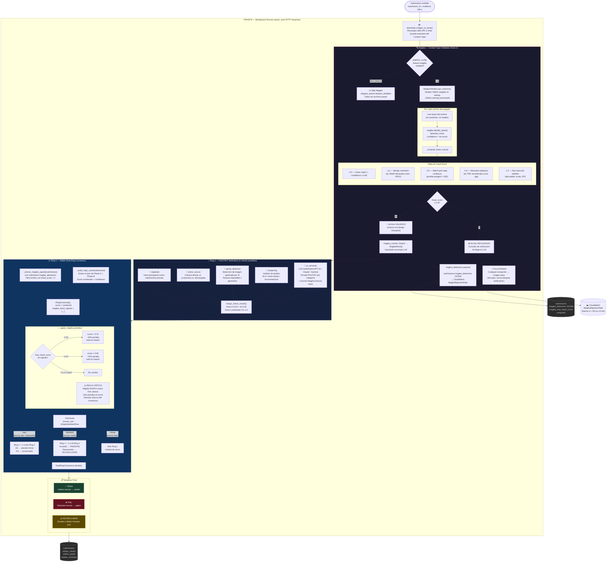

# Magika → Ring 1 → Ring 2: Flujo Completo de Verificación de Evidencia

Diagrama completo del pipeline de verificación de evidencia en Execution Market,
desde la detección de tipo de archivo (Magika) hasta el veredicto final del árbitro dual.

---

## Diagrama



---

## Resumen del Flujo

### 1. Magika (Pre-verificación)

Corre **antes** de los 5 checks paralelos. Opera sobre bytes reales del archivo — no sobre extensión ni HTTP headers.

| Fraud Score | Significado | Acción |
|-------------|-------------|--------|
| `0.0` | Match limpio, alta confianza | Pasa |
| `0.3` | Benign mismatch (misma familia: WebP→JPEG) | Pasa con warning |
| `0.5` | Confianza baja (posible polyglot) | Pasa con nota al LLM |
| `0.8` | Mismatch peligroso (PDF→JPEG) | **Bloqueado** |
| `1.0` | Tipo fuera del whitelist (ejecutable, script) | **Bloqueado** |

**Circuit breaker**: cualquier excepción en Magika → imagen pasa (fail open). Nunca bloquea verificación.

**Feature flag**: `platform_config.feature.magika.enabled` — se puede desactivar en < 30s sin redeploy.

---

### 2. Ring 1 — PHOTINT

5 checks corren en paralelo. El check `ai_semantic` recibe el `magika_context` inyectado en el prompt como sección de forensics:

```
## FILE TYPE FORENSICS (Magika Content Analysis)
ALERT: File type mismatch detected for 'photo.jpg':
  - Declared: image/jpeg
  - Detected by content analysis: application/pdf
  - Fraud signal: HIGH (score: 0.8/1.0)
  This is strong evidence of deliberate file manipulation.
  Weight this heavily in your authenticity assessment.
```

---

### 3. Ring 2 — Arbiter Consensus

El árbitro recibe los scores de Ring 1 **penalizados** por Magika:

```
ring1.score = 0.85  →  después de penalización (fraud=0.8) → 0.85 × 0.70 = 0.595
```

Esto hace que el consensus sea más conservador sin llegar a un FAIL forzado.

**Tiers:**
- **CHEAP**: solo Ring 1 penalizado. Umbral de score.
- **STANDARD**: Ring 1 + 1 LLM Ring 2. Acuerdo → decisión. Desacuerdo → INCONCLUSIVE.
- **MAX**: Ring 1 + 2 LLMs Ring 2. Votación 3-way. Conservador en empates.

---

### 4. Persistencia y Monitoreo

- `submissions.magika_detections`: payload JSONB con detalle por archivo.
- `submissions.magika_max_fraud_score`: columna computada (B-tree indexable).
- `CloudWatch MagikaRejectionRate`: alerta si > 5% de archivos rechazados en 10 min.
- `platform_config.feature.magika`: toggle en tiempo real sin redeploy.
