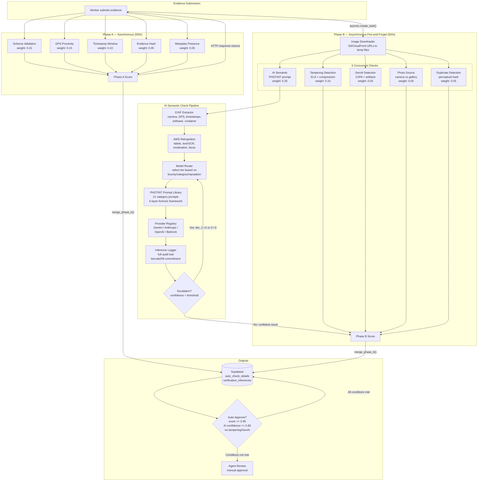
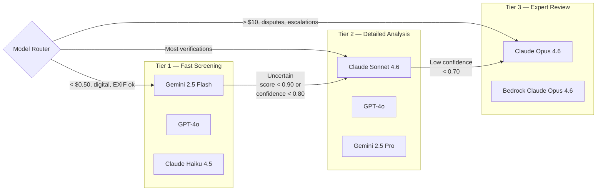
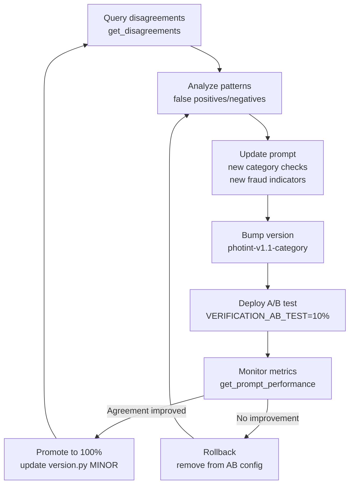

# PHOTINT Verification Architecture

> Photographic Intelligence (PHOTINT) is the forensic evidence verification system for Execution Market. It is the trust backbone of the platform -- real money moves based on its analysis. This document describes the full architecture: two-phase pipeline, multi-model tier routing, EXIF pre-extraction, structured forensic prompts, inference audit trail, and feedback loop.

## 1. System Overview

### What PHOTINT Is

PHOTINT (Photographic Intelligence Analyst) is a multi-tier, multi-model forensic verification system that determines whether submitted photo evidence proves a real-world task was completed correctly, honestly, and completely. It operates under the principle: *"Every pixel is a witness. Every absence is a clue."*

When a human executor submits evidence for a task published by an AI agent, PHOTINT performs a two-phase analysis:

- **Phase A (synchronous)**: Metadata-only checks that run inline with the submission HTTP request. Schema validation, GPS proximity, timestamp window, evidence hashing, metadata presence. Weight: 50% of total score.
- **Phase B (asynchronous, fire-and-forget)**: Image-level analysis launched as a background asyncio task. EXIF extraction, AWS Rekognition, AI vision models with tiered routing, tampering detection, GenAI detection, photo source classification, duplicate detection via perceptual hashing. Weight: 50% of total score.

### Before vs. After

| Aspect | Before PHOTINT | After PHOTINT |
|--------|---------------|---------------|
| Prompt complexity | ~40 lines, single generic prompt | ~200 lines per category, 5-layer forensic framework |
| Categories | 1 catch-all | 21 specialized prompts |
| Model selection | Single hardcoded model | 3-tier routing with escalation |
| EXIF usage | None | Pre-extracted and injected into prompt |
| Tampering detection | None | ELA, compression analysis, software detection |
| GenAI detection | None | C2PA, steganography, artifact analysis, statistical |
| Duplicate detection | None | Perceptual hashing (pHash + dHash + aHash) |
| Audit trail | None | Full inference log with keccak256 commitment hashes |
| A/B testing | None | Traffic splitting by prompt version |

### Operating Principle

The pipeline is non-blocking by design. Phase A failures flag the submission for manual review rather than rejecting outright. Phase B runs fire-and-forget -- failures are logged, never raised. If all conditions are met (aggregate score >= 0.95, AI approved with >= 0.80 confidence, no tampering, no GenAI), the system can auto-approve without agent intervention.


## 2. Architecture Diagram




## 3. Verification Pipeline

### Phase A -- Synchronous Metadata Checks

Phase A runs synchronously during the submission endpoint handler. It validates metadata that does not require downloading evidence files. The HTTP response includes the Phase A score.

**File**: `mcp_server/verification/pipeline.py`

| Check | Weight | What It Does |
|-------|--------|-------------|
| `schema` | 0.15 | Validates submitted evidence against the task's `evidence_schema.required` and `evidence_schema.optional` fields. Score is proportional to the number of required fields present. |
| `gps` | 0.15 | For `physical_presence` and `simple_action` categories, calculates Haversine distance between evidence GPS and task coordinates. Default threshold: 500m (physical) / 1000m (delivery). Supports task-specific `location_radius_km`. |
| `timestamp` | 0.10 | Checks that `submitted_at` falls within the `assigned_at` to `deadline + 5min grace` window. |
| `evidence_hash` | 0.05 | Checks for a client-side SHA-256 hash (from frontend `collectForensicMetadata`). Presence scores 0.8; absence scores 0.5 (neutral). |
| `metadata` | 0.05 | Counts metadata signals: device info, timestamps, uploaded files, worker notes. Base score 0.5, incremented per signal. |

**Scoring**: `aggregate = sum(check.score * weight) / sum(weights)`. Pipeline passes if `aggregate >= 0.5` AND schema check passed.

**GPS extraction** walks multiple locations in the evidence dict: `evidence.gps`, `evidence.photo_geo`, `evidence.{photo|screenshot|document}.gps`, `evidence.forensic_metadata.location`, and `evidence.device_metadata.gps`. This handles submissions from web, mobile app, and external agents.

### Phase B -- Asynchronous Image Analysis

Phase B is launched as a fire-and-forget `asyncio.create_task()` from the submission endpoint. It never blocks the HTTP response. All errors are logged and swallowed -- a failed Phase B check does not crash the pipeline.

**File**: `mcp_server/verification/background_runner.py`

**Steps**:

1. **Extract photo URLs** from evidence JSONB (walks nested dicts looking for `fileUrl`, `url`, and direct image URL strings). Caps at `VERIFICATION_AI_MAX_IMAGES` (default: 2).
2. **Download to temp files** via `httpx` from S3/CloudFront. Validates `Content-Type: image/*`.
3. **Run 5 checks concurrently** via `asyncio.gather(*tasks, return_exceptions=True)`:
   - AI Semantic (PHOTINT prompt) -- see Section 4-5
   - Tampering Detection -- see Section 3.1
   - GenAI Detection -- see Section 3.2
   - Photo Source -- see Section 3.3
   - Duplicate Detection -- see Section 3.4
4. **Merge into existing `auto_check_details`** using `merge_phase_b()`, which reconstructs Phase A `CheckResult` objects from the stored dict, concatenates Phase B results, and recomputes the aggregate score using `ALL_WEIGHTS`.
5. **Store AI verification result** separately for dashboard display.
6. **Store perceptual hashes** for future duplicate detection.
7. **Evaluate auto-approve** conditions (see Section 3.5).
8. **Cleanup temp files**.

| Check | Weight | What It Does |
|-------|--------|-------------|
| `ai_semantic` | 0.25 | Runs the full PHOTINT prompt through a tiered vision model. See Sections 4-5. |
| `tampering` | 0.10 | ELA, compression artifact analysis, EXIF software tag detection, resolution anomaly detection, metadata consistency. |
| `genai_detection` | 0.05 | C2PA metadata, steganographic watermarks (SynthID heuristic, LSB, QT), AI artifact analysis, statistical patterns. |
| `photo_source` | 0.05 | Classifies as `camera` (score 1.0), `gallery` (0.3), `screenshot` (0.1), or `unknown` (0.4). For non-physical categories, gallery gets 0.6. |
| `duplicate` | 0.05 | Computes pHash + dHash + aHash via `imagehash`. Compares against existing hashes in DB (threshold: 85% similarity). |

#### 3.1 Tampering Detection

**File**: `mcp_server/verification/checks/tampering.py`

Five sub-analyses:

1. **Software tag analysis**: Checks EXIF `Software`, `ProcessingSoftware`, `HostComputer`, `ImageHistory`, `XMPToolkit` against a registry of 40+ known editing apps (Photoshop, GIMP, Snapseed, VSCO, FaceApp, Midjourney, etc.) categorized as `professional_editor`, `mobile_editor`, `face_editor`, `ai_manipulation`, `ai_generated`, `screenshot_tool`, `social_media_resave`.
2. **Compression artifact analysis**: Estimates original JPEG quality by re-encoding at multiple quality levels and comparing file sizes. Detects double compression via histogram distribution comparison.
3. **Error Level Analysis (ELA)**: Re-compresses at quality 90, computes pixel-level difference. High variance with localized high values (> 5% suspicious pixels with max ELA > 100) indicates manipulation. Too-uniform ELA (stddev < 5) suggests AI generation.
4. **Resolution anomaly detection**: Checks EXIF dimensions vs actual dimensions, unusual aspect ratios, suspiciously round dimensions, known screenshot resolutions without camera data.
5. **Metadata consistency**: Missing expected fields, timestamp inconsistencies (original vs digitized vs modified), suspicious `UserComment` content, missing `MakerNote` from known brands, XMP indicating Photoshop.

Confidence scoring uses weighted signal accumulation (0.2-0.95 per signal type), capped at 1.0. Suspicious if confidence >= 0.5 or signal count >= 3.

#### 3.2 GenAI Detection

**File**: `mcp_server/verification/checks/genai.py`

Five detection methods:

1. **C2PA metadata check**: Scans raw bytes for JUMBF boxes, C2PA manifest/claim markers, and XMP `c2pa:` namespace. Extracts generator name from context bytes. Confidence: +0.40.
2. **Steganographic watermark detection**: SynthID-like frequency domain analysis (channel smoothness variance), LSB bit ratio analysis (bias from 0.50 threshold), JPEG quantization table uniformity. Confidence: +0.35.
3. **AI artifact analysis**: Color distribution smoothness, texture consistency variance, repeating pattern detection via row-level analysis. Confidence: +0.15.
4. **EXIF anomalies for AI**: Software field matching against 6 known AI generator families (Midjourney, DALL-E, Stable Diffusion, Flux, Firefly, Imagen), AI-related keywords in text fields, XMP namespace detection. Confidence: +0.25.
5. **Statistical analysis**: Histogram entropy, noise pattern uniformity, edge sharpness consistency. Confidence: +0.10.

Flagged as AI-generated if confidence >= 0.35 or signal count >= 2.

#### 3.3 Photo Source Verification

**File**: `mcp_server/verification/checks/photo_source.py`

Classification: `camera` | `gallery` | `screenshot` | `unknown`.

- **Screenshot detection**: Software tag keywords, exact phone screen dimensions without camera data (12+ known sizes), PNG format without camera Make.
- **Gallery detection**: Known editing apps in Software/ProcessingSoftware tags, gallery/imported/edited keywords in UserComment.
- **Camera detection**: Known manufacturer Make (17 brands), timestamp present, GPS data present.
- **Freshness check**: Compares EXIF `DateTimeOriginal` against current time. Default max age: 5 minutes (Phase A) / 60 minutes (Phase B, since download adds delay).

#### 3.4 Duplicate Detection

**File**: `mcp_server/verification/checks/duplicate.py`

Uses the `imagehash` library to compute three perceptual hashes:

| Hash | Method | Strength |
|------|--------|----------|
| pHash | DCT-based | Best for general similarity (weight: 0.5) |
| dHash | Gradient-based | Good for resized images (weight: 0.3) |
| aHash | Average-based | Fastest, least accurate (weight: 0.2) |

Similarity is computed as weighted Hamming distance across all three hashes. Threshold: 85%. Hashes are stored in the `submissions` table and compared against the last 100 submissions (excluding same task).

Also supports exact SHA-256 file hash for byte-identical duplicate detection as a fast pre-check.

#### 3.5 Auto-Approve Conditions

All six conditions must be met:

1. Aggregate score (Phase A + B) >= 0.95
2. Schema check passed
3. AI semantic decision = `approved` with confidence >= 0.80
4. Tampering confidence < 0.50
5. GenAI confidence < 0.35
6. Task status is still `submitted` (not already approved/rejected)

If all conditions pass, the submission is auto-approved via `db.auto_approve_submission()` with agent notes recording the score.


## 4. PHOTINT Prompt Library

### Base Framework

**File**: `mcp_server/verification/prompts/base.py`

Every verification prompt is built from the same base framework, extended with category-specific Layer 5 instructions. The base prompt sets the AI model's role as a forensic evidence verifier and provides five analysis layers:

| Layer | Name | What the Model Analyzes |
|-------|------|------------------------|
| 1 | Authenticity Assessment | Photo source, manipulation artifacts, screenshot detection, AI generation indicators, compression uniformity |
| 2 | Provenance and Platform Chain | EXIF presence/absence, resolution check (< 2MP = platform-processed), container format (JFIF = re-encoded), filename patterns (camera vs WhatsApp vs Telegram) |
| 3 | Geospatial Verification | Visible text (signs, addresses), architecture/building style, vegetation, infrastructure, cross-referencing multiple independent indicators |
| 4 | Temporal Verification | Shadow direction/length for solar angle, lighting quality (golden hour, midday, overcast), activity patterns (open/closed), seasonal indicators |
| 5 | Task Completion Assessment | Category-specific checks (injected by prompt module) |

The base prompt also includes:

- **Confidence rating system**: CONFIRMED / HIGH / MODERATE / LOW for every finding
- **Decision criteria**: APPROVE (>= 0.80), REJECT (>= 0.80 confidence in rejection), NEEDS_HUMAN (uncertain)
- **Fraud indicators checklist**: 8 specific fraud patterns to flag
- **Structured output schema**: `VerificationOutput` JSON with `ForensicAnalysis` sub-object

### Structured Output Schema

**File**: `mcp_server/verification/prompts/schemas.py`

The model must return a JSON object matching `VerificationOutput`:

```
{
  "decision": "approved" | "rejected" | "needs_human",
  "confidence": 0.0-1.0,
  "explanation": "Brief explanation",
  "issues": ["List of issues found"],
  "forensic": {
    "photo_authentic": true/false,
    "photo_source": "camera" | "gallery" | "screenshot" | "ai_generated" | "unknown",
    "exif_consistent": true/false/null,
    "location_match": true/false/null,
    "temporal_match": true/false/null,
    "platform_chain": "original" | "whatsapp" | "telegram" | null,
    "manipulation_indicators": ["list of signals"],
    "confidence_factors": {"finding": "CONFIRMED|HIGH|MODERATE|LOW"}
  },
  "task_checks": {
    "check_name": true/false
  }
}
```

The `forensic` object is parsed and stored under `task_specific_checks._forensic` in the database for audit purposes.

### Category Prompts

**File structure**: `mcp_server/verification/prompts/{category}.py`

Each module exports `get_category_checks(task: dict) -> str` which returns the Layer 5 instructions injected into the base prompt. There are 15 dedicated prompt modules covering 21 task categories:

| # | Category | Prompt Module | Key Forensic Checks |
|---|----------|--------------|---------------------|
| 1 | `physical_presence` | `physical_presence.py` | Location confirmation (signage, landmarks, reflections), business verification (name, hours, operating status), live photo vs reproduced image, temporal consistency (shadows, lighting, weather), staging/fraud detection (phone-in-photo trick, props) |
| 2 | `knowledge_access` | `knowledge_access.py` | Document/book authenticity, readability, completeness, page integrity |
| 3 | `human_authority` | `human_authority.py` | Authority verification, official stamps/seals, document format compliance |
| 4 | `simple_action` | `simple_action.py` | Item identification, purchase receipt, delivery proof, condition verification |
| 5 | `digital_physical` | `digital_physical.py` | Physical output verification, print quality, device configuration proof |
| 6 | `location_based` | `location_based.py` | Geographic markers, distance estimation, area coverage |
| 7 | `verification` | `verification.py` | Target object/condition verification, before/after comparison |
| 8 | `social_proof` | `social_proof.py` | Social interaction evidence, event attendance, community presence |
| 9 | `data_collection` | `data_collection.py` | Data completeness, format compliance, measurement accuracy |
| 10 | `sensory` | `sensory.py` | Environmental condition documentation, sensory proxy evidence |
| 11 | `social` | `social.py` | Social engagement verification, interaction proof |
| 12 | `proxy` | `proxy.py` | Proxy action verification, delegation chain evidence |
| 13 | `bureaucratic` | `bureaucratic.py` | Form completion, filing proof, official receipt, queue/process evidence |
| 14 | `emergency` | `emergency.py` | Urgent situation documentation, time-critical evidence, safety compliance |
| 15 | `creative` | `creative.py` | Creative output quality, originality, specification adherence |
| 16 | `data_processing` | `digital_fallback.py` | Generic digital task completion checks |
| 17 | `api_integration` | `digital_fallback.py` | Generic digital task completion checks |
| 18 | `content_generation` | `digital_fallback.py` | Generic digital task completion checks |
| 19 | `code_execution` | `digital_fallback.py` | Generic digital task completion checks |
| 20 | `research` | `digital_fallback.py` | Generic digital task completion checks |
| 21 | `multi_step_workflow` | `digital_fallback.py` | Generic digital task completion checks |

Categories 16-21 are digital-only and share a single fallback prompt module since photo evidence is less critical for these categories.

### Version Tracking

**File**: `mcp_server/verification/prompts/version.py`

Every rendered prompt is tagged with a version string: `photint-v{MAJOR}.{MINOR}-{category}`. Current version: `photint-v1.0-{category}`.

The version is stored alongside each inference record in the `verification_inferences` table, enabling:

- Performance comparison between prompt versions
- A/B test traffic attribution
- Rollback to previous versions if metrics degrade


## 5. Multi-Model Tier System

### Tier Definitions

**Files**: `mcp_server/verification/model_router.py`, `mcp_server/verification/providers.py`



| Tier | Primary Model | Fallback Models | When Selected | Approx. Cost/Image |
|------|--------------|----------------|---------------|-------------------|
| Tier 1 | Gemini 2.5 Flash | GPT-4o, Claude Haiku 4.5 | Bounty < $0.50, digital categories, EXIF present | ~$0.002 |
| Tier 2 | Claude Sonnet 4.6 | GPT-4o, Gemini 2.5 Pro | Most verifications (default) | ~$0.01 |
| Tier 3 | Claude Opus 4.6 | Bedrock Claude Opus 4.6 | Bounty > $10, disputes, escalations | ~$0.05 |

### Routing Rules

The `select_tier()` function evaluates these conditions in priority order:

1. **Disputes** always get Tier 3 (expert review)
2. **High-value** (bounty >= $10.00) always gets Tier 3
3. **High-stakes categories** (`physical_presence`, `human_authority`, `bureaucratic`, `emergency`):
   - Bounty >= $5.00 -> Tier 3
   - Otherwise -> Tier 2
4. **New workers** (< 5 completed tasks) -> Tier 2
5. **Low reputation** (< 3.0 out of 5) -> Tier 2
6. **No EXIF metadata** (for non-digital categories) -> Tier 2
7. **Medium-value** (bounty >= $1.00) -> Tier 2
8. **Digital-only categories** (`data_processing`, `api_integration`, etc.) -> Tier 1
9. **Low-value with EXIF** (bounty < $0.50, EXIF present) -> Tier 1
10. **Default** -> Tier 2

### Escalation Logic

After each inference, `should_escalate()` checks:

- **Tier 1 -> Tier 2**: If score < 0.90 OR confidence < 0.80
- **Tier 2 -> Tier 3**: If confidence < 0.70
- **Tier 3**: No further escalation (terminal)

Maximum 3 escalation attempts. Each escalation is logged as a separate inference record with `tiers_tried` metadata.

### Provider Fallback Chain

Each tier has an ordered preference list. The system tries each provider/model pair and uses the first one with valid API credentials:

1. Requested provider (from env `AI_VERIFICATION_PROVIDER`, default: `gemini`)
2. Fallback through `PROVIDERS` registry: `gemini` -> `anthropic` -> `openai` -> `bedrock`

If no provider is available for a tier, falls back to the default provider. If no provider is available at all, the AI semantic check returns `score=0.5, passed=True` (neutral, no AI opinion).

### Multi-Model Consensus

**File**: `mcp_server/verification/consensus.py`

For high-value tasks (bounty >= $10) or disputed submissions, `run_consensus_verification()` queries two different providers in parallel (Tier 2 + Tier 3) and requires agreement:

| Model A | Model B | Result | Confidence |
|---------|---------|--------|-----------|
| Approve | Approve | Approved | avg * 1.1 (boosted) |
| Reject | Reject | Rejected | avg * 1.1 (boosted) |
| Approve | Reject | needs_human | max * 0.5 (penalized) |
| Reject | Approve | needs_human | max * 0.5 (penalized) |

If only one model responds, its decision is used with 0.8x confidence reduction.


## 6. EXIF Pre-Extraction

**File**: `mcp_server/verification/exif_extractor.py`

EXIF metadata is extracted from the first downloaded image BEFORE sending to the vision model. The structured data is serialized into a text block and injected into the PHOTINT prompt as a `Pre-Extracted Technical Metadata (EXIF)` section, allowing the model to cross-reference visual content against technical metadata.

### Extracted Fields

| Category | Fields | Purpose |
|----------|--------|---------|
| Camera | `camera_make`, `camera_model` | Source device identification |
| GPS | `gps_latitude`, `gps_longitude`, `gps_altitude` | Location cross-reference |
| Timestamps | `datetime_original`, `datetime_digitized`, `datetime_modified` | Temporal cross-reference |
| Software | `software`, `has_editing_software` | Manipulation detection |
| Image Properties | `orientation`, `flash_fired`, `focal_length`, `aperture`, `iso`, `exposure_time` | Camera behavior verification |
| File-Level | `width`, `height`, `megapixels`, `file_size_bytes`, `format`, `container_type` | Platform chain detection |
| Forensic Flags | `timestamp_inconsistency`, `metadata_stripped`, `editing_indicators` | Red flag alerts |

### Editing Software Detection

The system maintains a registry of 20+ known editing applications:

`photoshop`, `gimp`, `snapseed`, `lightroom`, `vsco`, `afterlight`, `picsart`, `canva`, `pixlr`, `fotor`, `inshot`, `facetune`, `faceapp`, `remini`, `beautycam`, `meitu`, `b612`, `snow`, `airbrush`, `polish`

Detection checks the EXIF `Software` tag (case-insensitive) against this registry.

### Platform Chain Detection

| Signal | Indicates |
|--------|-----------|
| No EXIF in JPEG | Metadata stripped by platform (WhatsApp, Instagram) |
| JFIF container | Re-encoded through messaging (not original) |
| Resolution < 2 MP | Heavily compressed by platform |
| Low resolution (< 2 MP) in JPEG | Processed through messaging platform |
| Modification timestamp predates original | File was manipulated (timestamp reversed) |

### Prompt Injection Format

```
## Pre-Extracted Technical Metadata (EXIF)
- Camera: Apple iPhone 15 Pro
- GPS: 6.244203, -75.581212
- Captured: 2026:03:28 14:23:01
- Resolution: 4032x3024 (12.2 MP)
- Container: EXIF
- EXIF Status: Present

Cross-reference this metadata against the visual content. Flag any inconsistencies.
```


## 7. Inference Logging and Audit Trail

**File**: `mcp_server/verification/inference_logger.py`

Every AI inference during evidence verification is logged to the `verification_inferences` table. Logging is fire-and-forget -- failures never block verification.

### Database Schema (Key Columns)

| Column | Type | Description |
|--------|------|------------|
| `id` | UUID | Primary key |
| `submission_id` | UUID | FK to submissions |
| `task_id` | UUID | FK to tasks |
| `check_name` | TEXT | `ai_semantic`, `tampering`, etc. |
| `tier` | TEXT | `tier_1`, `tier_2`, `tier_3` |
| `provider` | TEXT | `gemini`, `anthropic`, `openai`, `bedrock` |
| `model` | TEXT | Full model ID (e.g., `claude-sonnet-4-6-20250627`) |
| `prompt_version` | TEXT | `photint-v1.0-physical_presence` |
| `prompt_hash` | TEXT | SHA-256 of rendered prompt text |
| `prompt_text` | TEXT | Full prompt sent to model |
| `response_text` | TEXT | Full response received |
| `parsed_decision` | TEXT | `approved`, `rejected`, `needs_human` |
| `parsed_confidence` | FLOAT | 0.0-1.0 |
| `parsed_issues` | JSONB | Array of issue strings |
| `input_tokens` | INT | Input token count |
| `output_tokens` | INT | Output token count |
| `latency_ms` | INT | Inference duration |
| `estimated_cost_usd` | FLOAT | Computed from token pricing |
| `task_category` | TEXT | Task category for analytics |
| `evidence_types` | JSONB | Array of evidence type keys |
| `photo_count` | INT | Number of photos analyzed |
| `commitment_hash` | TEXT | keccak256 for on-chain auditability |
| `agent_agreed` | BOOLEAN | Agent feedback: did they agree? |
| `agent_decision` | TEXT | Agent's actual decision |
| `metadata` | JSONB | EXIF data, routing reason, tiers tried |
| `created_at` | TIMESTAMPTZ | Auto-set |

### Commitment Hash

For on-chain auditability, each inference produces a keccak256 commitment hash:

```
keccak256("task:{task_id}|{response_text}")
```

This allows proving that a specific AI analysis was performed for a specific task without revealing the full prompt/response on-chain.

### Cost Estimation

Token pricing is maintained per provider/model (March 2026 rates):

| Provider/Model | Input ($/1M tokens) | Output ($/1M tokens) |
|---------------|--------------------|--------------------|
| Gemini 2.5 Flash | $0.15 | $0.60 |
| Gemini 2.5 Pro | $1.25 | $5.00 |
| Claude Haiku 4.5 | $0.80 | $4.00 |
| Claude Sonnet 4.6 | $3.00 | $15.00 |
| Claude Opus 4.6 | $15.00 | $75.00 |
| GPT-4o | $2.50 | $10.00 |
| GPT-4o-mini | $0.15 | $0.60 |

Cost per inference: `(input_tokens * input_rate + output_tokens * output_rate) / 1,000,000`

### Timing

`InferenceTimer` is a context manager that captures wall-clock latency in milliseconds:

```python
timer = InferenceTimer()
with timer:
    result = await provider.analyze(request)
# timer.latency_ms contains elapsed time
```


## 8. Enhanced Analysis Checks

### Lighting and Shadow Analysis

**File**: `mcp_server/verification/checks/lighting.py`

Analyzes image brightness distribution to estimate time of day, then cross-references against the claimed submission timestamp.

| Brightness Mean | StdDev | Estimated Time | Shadow Intensity |
|----------------|--------|----------------|-----------------|
| < 40 | any | Night | None |
| 40-80 | any | Evening | Weak |
| 80-120 | > 60 | Morning | Strong |
| 80-120 | <= 60 | Indoor | Weak |
| 120-160 | > 50 | Afternoon | Moderate |
| 120-160 | <= 50 | Midday | Strong |
| > 160 | any | Midday | Strong |

Time consistency check maps estimated time of day to valid hour ranges (e.g., "morning" = hours 5-9, "indoor" = always valid) and compares against the claimed hour.

### Weather Cross-Reference

**File**: `mcp_server/verification/checks/weather.py`

When GPS coordinates and a timestamp are available, queries the **Open-Meteo Archive API** (free, no API key) for historical weather at that location and hour. Returns temperature, WMO weather code, precipitation, cloud cover, and wind speed.

The weather data is formatted as context for the PHOTINT prompt (e.g., "Weather: Partly cloudy, Temp: 22C, Cloud cover: 45%"), allowing the vision model to cross-reference visible weather conditions against actual conditions.

Supports 21 WMO weather codes from Clear sky (0) through Thunderstorm with heavy hail (99).

### Platform Fingerprinting

**File**: `mcp_server/verification/checks/platform_fingerprint.py`

Detects which messaging or social platform processed an image using five signal categories:

1. **Filename patterns**: WhatsApp (`IMG-YYYYMMDD-WA####`), Telegram (`photo_YYYY-MM-DD`), Android camera (`IMG_YYYYMMDD_HHMMSS`), iPhone (`IMG_####.HEIC`), Pixel (`PXL_YYYYMMDD_*`)
2. **EXIF analysis**: Presence/absence (stripped = platform-processed)
3. **Container analysis**: JFIF = re-encoded by messaging platform; EXIF = closer to original
4. **Resolution analysis**: WhatsApp standard (~1600px), WhatsApp HD (~4000px), Telegram (~1300px), Instagram square (1080x1080)
5. **File size analysis**: Heavy compression (small file for large resolution)

Each signal contributes a weighted score to platform candidates. The highest-scoring platform is returned with confidence and estimated hop count.

Detected platforms: `original`, `whatsapp`, `telegram`, `instagram`, `twitter`, `screenshot`, `unknown`.

### OCR Enhancement

**File**: `mcp_server/verification/checks/ocr.py`

Pre-extracts text from receipt/document photos for inclusion in the PHOTINT prompt. Two methods:

1. **AWS Rekognition `detect_text`** (preferred): Returns text blocks with confidence scores and type classification. Min confidence: 60%.
2. **Pillow edge detection** (fallback): Does not perform actual OCR but detects likely text regions based on edge density. Reports whether text appears present and at what density (moderate/high).

Results are injected into the prompt as additional context for the vision model to cross-reference.


## 9. Feedback Loop and A/B Testing

### Agent Feedback Loop

**File**: `mcp_server/verification/analytics.py`

When an agent (the task publisher) approves or rejects a submission, their decision is compared against the AI's decision. The `verification_inferences` table has two feedback columns:

- `agent_agreed` (boolean): Did the agent agree with the AI's decision?
- `agent_decision` (text): The agent's actual decision (`accepted`/`approved`/`rejected`)

### Analytics Module

`get_prompt_performance()` queries the last 1000 inferences (filterable by prompt version and category) and computes:

| Metric | Description |
|--------|------------|
| `agreement_rate` | Percentage of cases where agent agreed with AI |
| `false_positive_rate` | AI approved, agent rejected |
| `false_negative_rate` | AI rejected, agent approved |
| `avg_confidence` | Mean confidence across inferences |
| `avg_cost_usd` | Mean cost per inference |
| `total_cost_usd` | Cumulative cost |
| `latency_ms.p50/p95/p99` | Latency percentiles |
| `providers` | Breakdown of provider/model usage |
| `prompt_versions` | Breakdown by prompt version |

`get_disagreements()` retrieves specific cases where agent disagreed -- these are the most valuable data points for prompt tuning.

### A/B Testing Framework

**File**: `mcp_server/verification/ab_testing.py`

Traffic splitting is configured via the `VERIFICATION_AB_TEST` environment variable (JSON format):

```json
{"photint-v1.1-physical_presence": 0.20}
```

This routes 20% of `physical_presence` submissions to the v1.1 prompt variant. The `select_prompt_variant()` function checks the config and uses `random.random()` to split traffic.

Each inference record stores its `prompt_version`, enabling performance comparison between variants using the analytics module.

### Prompt Iteration Workflow




## 10. Configuration

### Environment Variables

| Variable | Default | Description |
|----------|---------|-------------|
| `AI_VERIFICATION_PROVIDER` | `gemini` | Primary AI provider (`gemini`, `anthropic`, `openai`, `bedrock`) |
| `AI_VERIFICATION_MODEL` | *(per provider)* | Override model ID for the primary provider |
| `ANTHROPIC_API_KEY` | *(none)* | Anthropic API key for Claude models |
| `GOOGLE_API_KEY` | *(none)* | Google API key for Gemini models |
| `OPENAI_API_KEY` | *(none)* | OpenAI API key for GPT models |
| `AWS_BEDROCK_REGION` | `us-east-2` | AWS region for Bedrock |
| `AWS_REKOGNITION_REGION` | `us-east-2` | AWS region for Rekognition |
| `VERIFICATION_AI_ENABLED` | `true` | Kill switch for Phase B verification |
| `VERIFICATION_AUTO_APPROVE` | `true` | Enable auto-approval when all conditions met |
| `VERIFICATION_AI_MAX_IMAGES` | `2` | Maximum images to analyze per submission |
| `VERIFICATION_REKOGNITION_ENABLED` | `false` | Enable AWS Rekognition pre-analysis |
| `VERIFICATION_AB_TEST` | *(empty)* | JSON config for A/B testing prompt variants |


## 11. File Reference

| File | Purpose |
|------|---------|
| `verification/__init__.py` | Public API exports (providers, checks, GPS anti-spoofing, attestation) |
| `verification/pipeline.py` | Phase A synchronous pipeline: schema, GPS, timestamp, hash, metadata checks |
| `verification/background_runner.py` | Phase B async runner: downloads images, runs 5 concurrent checks, merges scores, evaluates auto-approve |
| `verification/ai_review.py` | `AIVerifier` class: builds PHOTINT prompt, sends to provider, parses structured response |
| `verification/model_router.py` | `select_tier()`: routes to Tier 1/2/3 based on bounty, category, reputation, EXIF. `should_escalate()`: escalation logic |
| `verification/providers.py` | Provider abstraction: `AnthropicProvider`, `OpenAIProvider`, `GeminiProvider`, `BedrockProvider`. Tier-to-model mapping. Fallback chain |
| `verification/providers_aws.py` | AWS Rekognition integration: labels, OCR, moderation, faces. Fire-and-forget |
| `verification/exif_extractor.py` | EXIF metadata extraction: camera, GPS, timestamps, software, container type, forensic flags |
| `verification/consensus.py` | Multi-model consensus for high-value/disputed: parallel Tier 2 + Tier 3, agreement check |
| `verification/inference_logger.py` | Audit trail: `InferenceRecord`, cost estimation, keccak256 commitment hash, `InferenceTimer` |
| `verification/analytics.py` | Performance metrics: agreement rate, false positive/negative rates, latency percentiles, provider breakdown |
| `verification/ab_testing.py` | A/B testing: traffic splitting by prompt version via `VERIFICATION_AB_TEST` env var |
| `verification/image_downloader.py` | Downloads evidence images from S3/CloudFront to temp files. URL extraction from evidence JSONB |
| `verification/gps_antispoofing.py` | GPS spoofing detection: network triangulation, movement patterns, sensor fusion |
| `verification/attestation.py` | Hardware attestation: iOS Secure Enclave, Android StrongBox, device fingerprinting |
| `verification/checks/schema.py` | Evidence schema validation (required/optional fields) |
| `verification/checks/gps.py` | GPS proximity check (Haversine distance) |
| `verification/checks/timestamp.py` | Submission window validation (assigned_at to deadline + grace) |
| `verification/checks/tampering.py` | Tampering detection: EXIF software, compression artifacts, ELA, resolution anomalies, metadata consistency |
| `verification/checks/genai.py` | GenAI detection: C2PA, steganographic watermarks, AI artifacts, EXIF anomalies, statistical patterns |
| `verification/checks/photo_source.py` | Photo source classification: camera, gallery, screenshot, unknown |
| `verification/checks/duplicate.py` | Duplicate detection: perceptual hashing (pHash + dHash + aHash), SHA-256 exact match |
| `verification/checks/lighting.py` | Shadow/lighting analysis: brightness distribution, time-of-day estimation, temporal cross-reference |
| `verification/checks/weather.py` | Weather cross-reference: Open-Meteo API, historical weather at GPS+timestamp |
| `verification/checks/platform_fingerprint.py` | Platform fingerprinting: filename patterns, resolution, EXIF, container, file size |
| `verification/checks/ocr.py` | OCR enhancement: Rekognition `detect_text` or Pillow edge detection fallback |
| `verification/prompts/__init__.py` | `PromptLibrary` class: category registry, prompt generation, version tracking, hash computation |
| `verification/prompts/base.py` | PHOTINT base prompt: 5-layer forensic framework, confidence system, decision criteria, fraud indicators |
| `verification/prompts/schemas.py` | `VerificationOutput` and `ForensicAnalysis` Pydantic models, JSON schema template |
| `verification/prompts/version.py` | Prompt versioning: `photint-v{MAJOR}.{MINOR}-{category}` |
| `verification/prompts/physical_presence.py` | Physical presence checks: location, business, live photo, temporal, staging detection |
| `verification/prompts/knowledge_access.py` | Knowledge access checks: document authenticity, readability |
| `verification/prompts/human_authority.py` | Human authority checks: official stamps, seals, format compliance |
| `verification/prompts/simple_action.py` | Simple action checks: item ID, receipt, delivery proof |
| `verification/prompts/digital_physical.py` | Digital-physical hybrid checks |
| `verification/prompts/location_based.py` | Location-based checks: geographic markers |
| `verification/prompts/verification.py` | Verification checks: object/condition confirmation |
| `verification/prompts/social_proof.py` | Social proof checks: event attendance, community |
| `verification/prompts/data_collection.py` | Data collection checks: completeness, format |
| `verification/prompts/sensory.py` | Sensory checks: environmental documentation |
| `verification/prompts/social.py` | Social engagement checks |
| `verification/prompts/proxy.py` | Proxy action checks: delegation chain |
| `verification/prompts/bureaucratic.py` | Bureaucratic checks: forms, filing, receipts |
| `verification/prompts/emergency.py` | Emergency checks: urgency, safety compliance |
| `verification/prompts/creative.py` | Creative output checks: quality, originality |
| `verification/prompts/digital_fallback.py` | Digital-only fallback (shared by 6 digital categories) |


## 12. Cost Analysis

### Per-Image Cost by Tier

| Tier | Typical Tokens (in + out) | Cost/Image | Use Case |
|------|--------------------------|-----------|----------|
| Tier 1 (Gemini Flash) | ~800 + 300 | $0.0003 | Low-value, digital, EXIF present |
| Tier 2 (Claude Sonnet) | ~1200 + 500 | $0.011 | Most verifications |
| Tier 3 (Claude Opus) | ~1200 + 500 | $0.056 | High-value, disputes |
| Consensus (Tier 2 + 3) | ~2400 + 1000 | $0.067 | Bounty > $10, disputed |

### Projected Monthly Costs

Assumptions: 80% Tier 1, 15% Tier 2, 4% Tier 3, 1% Consensus. Rekognition at $0.001/image (when enabled). Non-AI checks (tampering, GenAI, duplicate, EXIF) are CPU-only -- negligible cost.

| Scale | Images/Month | AI Verification | Rekognition | Total Est. |
|-------|-------------|-----------------|-------------|-----------|
| Early | 1,000 | $1.50 | $1.00 | $2.50 |
| Growth | 10,000 | $15 | $10 | $25 |
| Scale | 100,000 | $150 | $100 | $250 |

### Cost Optimization Levers

1. **Tier 1 bias**: Default to Gemini Flash for categories where fraud risk is low (digital tasks). Current: 80% Tier 1 target.
2. **EXIF pre-filtering**: Tasks with clean EXIF (original camera photo, GPS matches, recent timestamp) can be auto-approved without AI if Phase A score >= 0.95.
3. **Caching**: Same prompt hash + same image hash = cached response (not yet implemented).
4. **Batch processing**: Group multiple images per API call where supported (Gemini supports up to 16 images per request).
5. **Auto-approve threshold**: Aggressive auto-approve (score >= 0.95) reduces the need for agent review, which is the true cost bottleneck.
