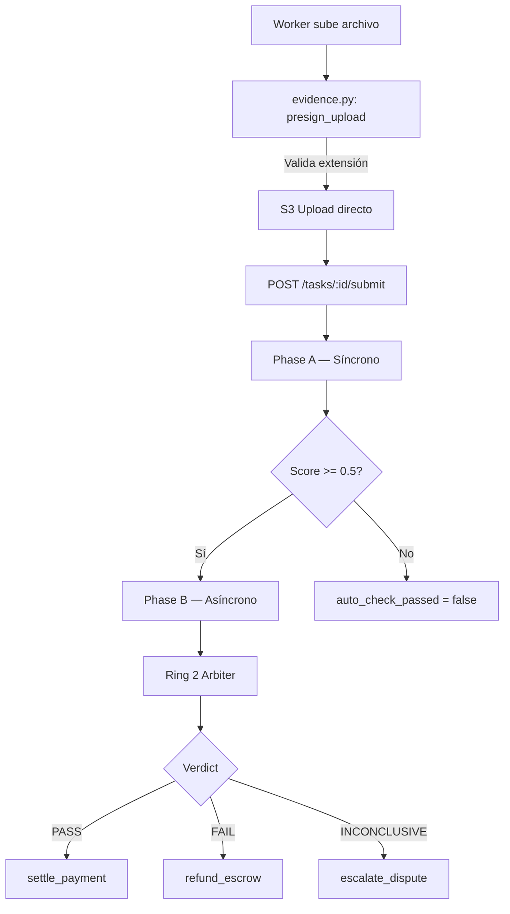

# Mapa del Pipeline de Verificación de Evidencia

> **Propósito**: Referencia técnica completa del pipeline de dos anillos (Ring 1 PHOTINT + Ring 2 Arbiter) para verificación de evidencia en Execution Market. Generado con exploración completa del codebase el 2026-04-14.

---

## Diagrama de Flujo General



---

## Capa 0: Upload de Evidencia

### Endpoint de Presigned URL

**Archivo**: `mcp_server/api/routers/evidence.py`

| Elemento | Detalle |
|----------|---------|
| Endpoint | `GET /api/v1/evidence/presign-upload` |
| Función | `presign_upload()` línea 104 |
| Validación actual | Solo extensión contra `ALLOWED_EXTENSIONS` (línea 148) |
| Extensiones permitidas | `jpg, jpeg, png, webp, pdf, mp4, mov, heic, txt, json` |
| Content-type | Declarado por el cliente — NO validado por contenido |

```python
# evidence.py línea 31-42
ALLOWED_EXTENSIONS = {
    "jpg", "jpeg", "png", "webp", "pdf",
    "mp4", "mov", "heic", "txt", "json"
}
```

**Response** `PresignUploadResponse` (línea 75):
- `upload_url` — S3 PUT URL firmada
- `key` — clave S3: `tasks/{task_id}/submissions/{executor_id}/{uuid}-{filename}`
- `public_url` — CloudFront URL
- `nonce` — SHA256 32 chars (replay protection)
- `expires_in` — default 900s (15 min)
- `content_type` — MIME type declarado por el cliente en el presign request
- `authorizer_jwt` — JWT firmado por el server que autoriza el upload (validado en post-upload hook)

**Nota crítica**: El cliente hace PUT directo a S3. El backend **nunca ve los bytes del archivo**.

---

## Capa 1: Submission del Worker

### Endpoint de Submit

**Archivo**: `mcp_server/api/routers/workers.py`

| Elemento | Detalle |
|----------|---------|
| Endpoint | `POST /api/v1/tasks/{task_id}/submit` |
| Función | Línea 609-881 |
| Auth | `verify_worker_auth(WorkerAuth)` |

**Flujo interno**:
1. Valida que el worker es el asignado a la tarea
2. Merge `device_metadata` en evidence (GPS debug logging líneas 654-668)
3. Lanza Phase A síncrono (`run_verification_pipeline()`)
4. Lanza Phase B asíncrono (`publish_ring1()` a SQS)
5. Intenta instant payout si cumple condiciones (`_is_submission_ready_for_instant_payout()`)

**Tipos de evidencia** (`mcp_server/models.py` línea 77):
```python
class EvidenceType(str, Enum):
    PHOTO = "photo"           # Foto estándar
    PHOTO_GEO = "photo_geo"   # Foto + GPS
    VIDEO = "video"
    DOCUMENT = "document"     # PDF/scan
    RECEIPT = "receipt"
    SIGNATURE = "signature"
    NOTARIZED = "notarized"
    TIMESTAMP_PROOF = "timestamp_proof"
    TEXT_RESPONSE = "text_response"
    MEASUREMENT = "measurement"
    SCREENSHOT = "screenshot"
    JSON_RESPONSE = "json_response"
    API_RESPONSE = "api_response"
    CODE_OUTPUT = "code_output"
    FILE_ARTIFACT = "file_artifact"
    URL_REFERENCE = "url_reference"
    STRUCTURED_DATA = "structured_data"
    TEXT_REPORT = "text_report"
```

---

## Capa 2: Ring 1 Phase A — Verificación Síncrona

### Orquestador

**Archivo**: `mcp_server/verification/pipeline.py`  
**Función**: `run_verification_pipeline()` línea 98

Phase A es **rápida y síncrona** — no descarga archivos, solo analiza metadatos.

### Checks de Phase A

| Check | Peso | Línea | Descripción |
|-------|------|-------|-------------|
| Schema | 0.12 | 195 | Evidence cumple esquema requerido según task |
| GPS | 0.12 | 241 | Proximidad geográfica al task location |
| GPS Anti-Spoofing | 0.06 | 132 | Análisis de sensor data para detectar spoofing |
| Timestamp | 0.08 | 143 | Submission dentro de ventana de deadline |
| Evidence Hash | 0.05 | 148 | Detección de duplicados exactos |
| Metadata | 0.04 | 153 | Presencia de metadatos requeridos |
| Attestation | 0.03 | 157 | Hardware attestation (iOS App Attest) |

**Score de Phase A**: Suma ponderada de checks.  
**Criterio de paso**: `score >= 0.5 AND schema_passed == True`

### Schema Validation

**Archivo**: `mcp_server/verification/checks/schema.py`  
**Función**: `validate_evidence_schema()` línea 58

Validadores por tipo:
- `validate_photo()` — URL o dict `{url, file, ipfs}`
- `validate_gps()` — dict `{lat, lng}` con números válidos
- `validate_video()` — URL HTTP/IPFS o dict con file
- `validate_document()` — URL HTTP/IPFS
- `validate_text()` — string no vacío
- `validate_audio()` — URL audio o dict con file

**Output** `SchemaValidationResult`:
```python
{
    is_valid: bool
    missing_required: List[str]
    invalid_fields: List[Dict[str, str]]
    warnings: List[str]
    normalized_score: float  # 0.0-1.0
}
```

---

## Capa 3: Ring 1 Phase B — Verificación Asíncrona (PHOTINT)

### Orquestador

**Archivo**: `mcp_server/verification/background_runner.py`  
**Función**: `run_phase_b_verification()` línea 111

Phase B se lanza como **fire-and-forget** desde SQS. Corre asíncronamente. Descarga imágenes y ejecuta análisis pesado.

### Flujo Phase B

```
1. extract_photo_urls(evidence)         ← image_downloader.py línea 21
2. download_images_to_temp(urls)        ← image_downloader.py línea 106
3. Ejecutar 5 checks en paralelo (asyncio.gather, timeout 120s)
   ├── AI Semantic (PHOTINT)            ← ai_review.py
   ├── Tampering Detection              ← checks/tampering.py
   ├── GenAI Detection                  ← checks/genai.py
   ├── Photo Source                     ← checks/photo_source.py
   └── Duplicate Detection              ← checks/duplicate.py
4. Merge resultados → auto_check_details
5. Update submission en Supabase
6. Log inferences → verification_inferences table
```

### Image Downloader

**Archivo**: `mcp_server/verification/image_downloader.py`

| Función | Línea | Descripción |
|---------|-------|-------------|
| `extract_photo_urls()` | 21 | Extrae URLs del evidence JSONB. Busca en: photo, photo_geo, screenshot, document, receipt, video, image, file. Máx 8 imágenes. |
| `download_images_to_temp()` | 106 | Descarga a temp files. Timeout 15s/imagen. Valida content-type HTTP header (línea 131). |
| `_looks_like_image_url()` | 91 | Verifica extensiones conocidas O proveedores confiables (cloudfront.net, s3.amazonaws.com, supabase) |

**Validación actual de MIME** (línea 131):
```python
content_type = response.headers.get("content-type", "")
if not content_type.startswith("image/"):
    logger.warning("Skipping non-image content-type %s", content_type)
    continue
# ⚠️ Usa el header HTTP — puede ser spoofed
```

### Checks de Phase B

| Check | Archivo | Peso | Timeout | Descripción |
|-------|---------|------|---------|-------------|
| AI Semantic | `ai_review.py` | 0.20 | 120s | LLM vision analysis con PHOTINT prompt |
| Tampering | `checks/tampering.py` | 0.10 | 60s | ELA, artefactos JPEG, detección de edición |
| GenAI Detection | `checks/genai.py` | 0.05 | 60s | Detecta imágenes generadas por IA |
| Photo Source | `checks/photo_source.py` | 0.05 | 60s | Origen: cámara vs galería vs screenshot |
| Duplicate | `checks/duplicate.py` | 0.03 | 60s | Perceptual hashing (phash, dhash, ahash) |

### AI Reviewer (PHOTINT)

**Archivo**: `mcp_server/verification/ai_review.py`  
**Función**: `AIVerifier.verify_evidence()` línea 99

```
Input: task, evidence, photo_urls, exif_context, rekognition_context
   │
   ▼
Download images (máx 4, 10 MB total)
   │
   ▼
PromptLibrary.get_prompt(category, task, evidence, exif_context)
   │
   ▼
Route to Provider (Gemini / Anthropic / OpenAI / Bedrock)
   │
   ▼
Parse structured response
   │
   ▼
Return VerificationResult
```

**Output** `VerificationResult` (línea 43):
```python
{
    decision: VerificationDecision  # APPROVED | REJECTED | NEEDS_HUMAN
    confidence: float               # 0.0-1.0
    explanation: str
    issues: List[str]
    task_specific_checks: dict
    provider: str
    model: str
    raw_prompt: str
    raw_response: str
    input_tokens: int
    output_tokens: int
}
```

### Prompt Library (PHOTINT)

**Directorio**: `mcp_server/verification/prompts/`  
**Clase**: `PromptLibrary` en `__init__.py` línea 86  
**Función**: `PromptLibrary.get_prompt(category, task, evidence, exif_context, rekognition_context)`  
**Total archivos**: 20 — 16 de categoría + 4 de utilidad

**Categorías con prompts específicos (16 archivos)**:

| Archivo | Categoría |
|---------|-----------|
| `physical_presence.py` | Proof of physical location |
| `knowledge_access.py` | Document scanning / reading |
| `human_authority.py` | Notarized documents |
| `simple_action.py` | Buy item, deliver package |
| `digital_physical.py` | Print+deliver, IoT |
| `location_based.py` | Location verification |
| `verification.py` | General verification |
| `social_proof.py` | Social media proof |
| `data_collection.py` | Data gathering tasks |
| `sensory.py` | Sensory observation tasks |
| `social.py` | Social interaction tasks |
| `proxy.py` | Proxy actions |
| `bureaucratic.py` | Bureaucratic/admin tasks |
| `emergency.py` | Emergency response |
| `creative.py` | Creative deliverables |
| `digital_fallback.py` | Categorías puramente digitales |

**Archivos de utilidad (4 archivos)** — importados por múltiples categorías:

| Archivo | Propósito |
|---------|-----------|
| `base.py` | Clase base `BasePrompt`, helpers comunes |
| `version.py` | Versioning semántico de prompts + hash tracking |
| `schemas.py` | Pydantic schemas de output estructurado (`PromptResult`, etc.) |
| `__init__.py` | `PromptLibrary` — dispatcher, caching, category routing |

**Output** `PromptResult`:
```python
{
    text: str           # Full rendered prompt
    version: str        # "photint-v1.0-physical_presence"
    hash: str           # SHA-256
    category: str
}
```

### EXIF Extractor

**Archivo**: `mcp_server/verification/exif_extractor.py`  
**Función**: `extract_exif()` línea 161 — **SÍNCRONA** (no es async). Debe invocarse con `asyncio.to_thread(extract_exif, path)` cuando se llame desde contextos async para no bloquear el event loop.

Extrae y analiza:
- Camera make/model
- GPS (lat/lng/altitude/timestamp)
- Timestamps (original, digitized, modified)
- Software de edición — flag si detecta Photoshop, GIMP, Snapseed, etc.
- Propiedades de imagen (resolución, focal length, ISO, aperture)
- **Forensic flags**: timestamp inconsistency, metadata stripped, editing indicators

**Output**: `ExifData.to_prompt_context()` (línea 67) — formateado para inyección en prompt.

### Multi-Provider Architecture

**Archivo**: `mcp_server/verification/providers.py`

| Provider | Modelo | Precio Input | Precio Output |
|----------|--------|-------------|---------------|
| Anthropic | claude-sonnet-4-6 | $3/1M | $15/1M |
| OpenAI | gpt-4o | $2.50/1M | $10/1M |
| Gemini | gemini-2.5-flash | $0.15/1M | $0.60/1M |
| Bedrock | Claude/Titan | Variable | Variable |

**Interfaz común**:
```python
@dataclass
class VisionRequest:
    prompt: str
    images: List[bytes]
    image_types: List[str]  # MIME types
    max_tokens: int = 1024

@dataclass
class VisionResponse:
    text: str
    model: str
    provider: str
    usage: dict  # {input_tokens, output_tokens}
```

---

## Capa 4: Ring 2 — Arbiter (Dual-Inference Verdict)

### Pregunta que responde Ring 2

> **Ring 1 (PHOTINT)**: ¿Es auténtica la evidencia?  
> **Ring 2 (Arbiter)**: ¿Prueba la evidencia que la tarea se completó?

### Directorio

`mcp_server/integrations/arbiter/`

| Archivo | Propósito |
|---------|-----------|
| `service.py` | Orquestador principal — `ArbiterService.evaluate()` línea 70 |
| `processor.py` | Dispatch a pagos — `process_arbiter_verdict()` línea 127 |
| `consensus.py` | `DualRingConsensus.decide()` — combina Ring1 + Ring2 |
| `tier_router.py` | Selecciona CHEAP/STANDARD/MAX según bounty |
| `registry.py` | Category configs + thresholds |
| `prompts.py` | Ring 2 task-completion prompts (línea 41) |
| `types.py` | `ArbiterVerdict`, `ArbiterDecision`, `RingScore` |

### Tier System

| Tier | Bounty | Ring 2 Calls | Cost Cap |
|------|--------|-------------|----------|
| CHEAP | < $10 | 0 | $0 |
| STANDARD | $10-$100 | 1 | $0.05 |
| MAX | > $100 | 2 | $0.20 |

### Flujo Ring 2

```
Input: task, submission
   │
   ├─ 1. Extraer Ring 1 score de submission.auto_check_details
   │
   ├─ 2. TierRouter.select_tier(bounty) → CHEAP|STANDARD|MAX
   │
   ├─ 3. Ring 2 inferences (0-2 llamadas LLM según tier)
   │      Sistema prompt: RING2_SYSTEM_PROMPT (línea 41)
   │      Evaluación: "¿La evidencia prueba que la tarea se completó?"
   │
   ├─ 4. DualRingConsensus.decide(ring1, ring2_scores)
   │      Blending de autenticidad (Ring 1) + completitud (Ring 2)
   │
   ├─ 5. Compute commitment_hash (keccak256)
   │
   └─ Output: ArbiterVerdict
```

### ArbiterVerdict

```python
@dataclass
class ArbiterVerdict:
    decision: ArbiterDecision     # PASS | FAIL | INCONCLUSIVE | SKIPPED
    tier: ArbiterTier
    aggregate_score: float        # 0.0-1.0
    confidence: float             # 0.0-1.0
    evidence_hash: str            # keccak256 del evidence payload
    commitment_hash: str          # keccak256(task_id, decision, scores)
    ring_scores: List[RingScore]
    reason: str
    disagreement: bool            # True si anillos no coincidieron
    cost_usd: float
    latency_ms: int
    evaluated_at: datetime
```

### Verdict → Acción

| Decision | Mode | Acción |
|----------|------|--------|
| PASS | auto | `settle_payment()` → Facilitator /settle |
| PASS | hybrid/manual | Store + notificar agent, esperar confirmación |
| FAIL | auto | `refund_trustless_escrow()` → Facilitator /refund |
| FAIL | hybrid/manual | Store + esperar confirmación |
| INCONCLUSIVE | cualquiera | `escalation_manager.escalate()` → dispute |
| SKIPPED | — | no-op, solo log |

**Kill-switch** (`processor.py` línea 68):
```python
def _auto_release_enabled() -> bool:
    return os.environ.get("EM_ARBITER_AUTO_RELEASE_ENABLED", "false").lower() == "true"
```
> Auto-release está **DISABLED por defecto**. Activar solo cuando Ring 2 esté en producción estable.

---

## Capa 5: Audit Trail (Inference Logger)

**Archivo**: `mcp_server/verification/inference_logger.py`  
**Clase**: `InferenceLogger` línea 118  
**Método**: `async log(record: InferenceRecord)` línea 136

**InferenceRecord** (línea 75) — persiste en tabla `verification_inferences`:
```python
{
    submission_id, task_id,
    check_name,           # 'ai_semantic', 'tampering', 'ring2_a', etc.
    tier,                 # 'tier_0', 'tier_1', 'tier_2'
    provider, model,
    prompt_version,       # 'photint-v1.0-physical_presence'
    prompt_text,          # Full prompt (auditoria)
    response_text,        # Full response
    parsed_decision,      # 'approved' | 'rejected' | 'needs_human'
    parsed_confidence,    # 0.0-1.0
    input_tokens, output_tokens,
    latency_ms,
    estimated_cost_usd,
    task_category,
    evidence_types: List[str],
    photo_count: int,
    commitment_hash       # keccak256 para auditoría on-chain
}
```

**Nota**: Fallas de logging **NUNCA bloquean** la verificación (fire-and-forget).

---

## Base de Datos: Tabla `submissions`

### Columnas Clave

```sql
submissions {
    id UUID PRIMARY KEY,

    -- Datos base
    task_id, executor_id,
    evidence JSONB,                    -- Evidence map completo
    evidence_files TEXT[],             -- Storage paths
    evidence_hash VARCHAR(66),         -- SHA256 para tamper detection

    -- Phase A Results
    auto_check_passed BOOLEAN,
    auto_check_score NUMERIC(5,2),
    auto_check_details JSONB,          -- Check-by-check breakdown

    -- Phase B Results
    ai_verification_result JSONB,      -- {decision, confidence, explanation}

    -- Ring 2 Results
    arbiter_verdict_data JSONB,        -- ArbiterVerdict serializado
    arbiter_tier, arbiter_score, arbiter_confidence,

    -- Forensic Metadata (migration 022)
    evidence_metadata JSONB,           -- GPS, device, EXIF, source, checksums
    storage_backend VARCHAR(20),       -- 's3' | 'supabase'
    evidence_content_hash VARCHAR(66), -- SHA-256 para tamper detection

    -- Payment
    payment_amount, payment_tx, paid_at
}
```

### Columnas Sin Implementar (Gaps)

| Columna | Por qué falta | Plan |
|---------|---------------|------|
| `magika_detections` JSONB | Magika no integrado aún | MASTER_PLAN_MAGIKA_INTEGRATION.md |
| `mime_type_detected` | Sin validación de contenido | Idem |

---

## Variables de Entorno del Pipeline

| Variable | Default | Descripción |
|----------|---------|-------------|
| `EM_ARBITER_AUTO_RELEASE_ENABLED` | `false` | Activar auto-release de pago en PASS |
| `EM_ARBITER_ENABLED` | Ver config | Master switch del arbiter |
| `EVIDENCE_BUCKET` | — | Bucket S3 para archivos |
| `EVIDENCE_PUBLIC_BASE_URL` | — | CloudFront base URL |
| `EVIDENCE_MAX_UPLOAD_MB` | `25` | Tamaño máximo de archivo |
| `PRESIGN_EXPIRES_SECONDS` | `900` | Expiración presigned URL (15 min) |

---

## Gaps de Seguridad Identificados (2026-04-14)

| ID | Severidad | Ubicación | Descripción | Plan de Fix |
|----|-----------|-----------|-------------|-------------|
| GAP-001 | ALTO | `evidence.py:148` | Validación extension-only, zero validación de contenido real | Fase 1-2 Magika |
| GAP-002 | ALTO | `image_downloader.py:131` | Valida HTTP Content-Type header (spoofeable), no bytes reales | Fase 2 Magika |
| GAP-003 | MEDIO | `submissions` tabla | No hay columna `magika_detections` — resultados no auditables | Fase 1 Tarea 1.3 |
| GAP-004 | ALTO | `ai_review.py:99` | LLM no recibe señal de file type mismatch como contexto | Fase 2 Tarea 2.3 |
| GAP-005 | MEDIO | `consensus.py` | Ring 2 no usa file type mismatch como señal de fraude | Fase 4 |

---

## Relacionados

- [[MASTER_PLAN_MAGIKA_INTEGRATION]] — Plan de integración de Magika
- [[MASTER_PLAN_VERIFICATION_OVERHAUL]] — Plan general de overhaul de verificación
- [[ring1-verification-hang]] — Incident: asyncio blocking en Ring 1

*Documento generado: 2026-04-14 · Basado en exploración completa del codebase*
