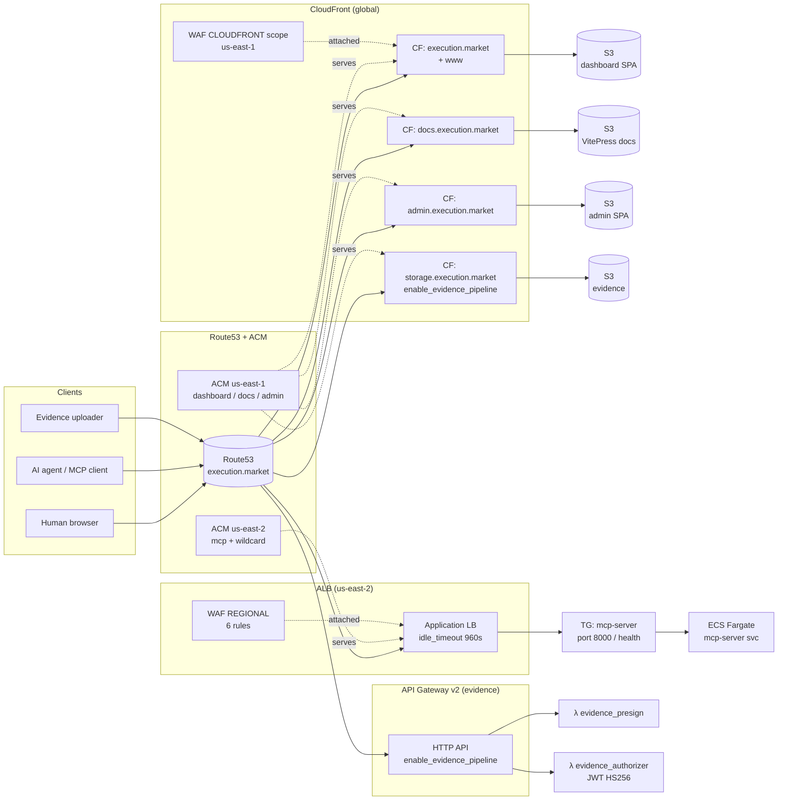
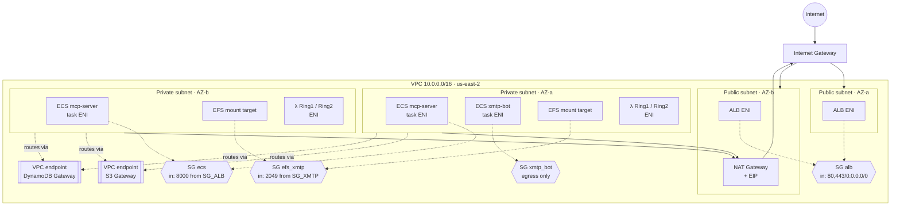
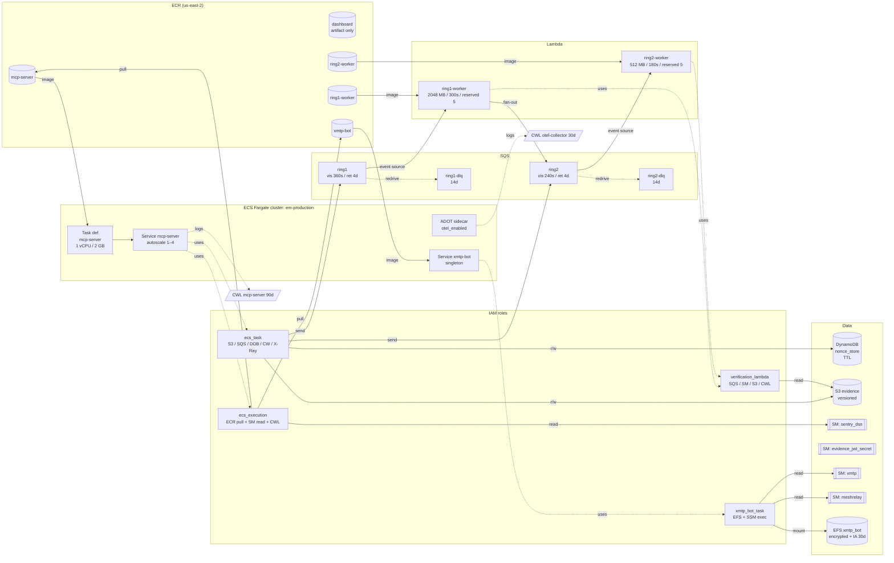
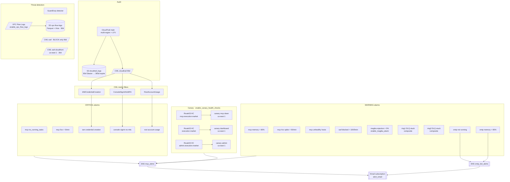
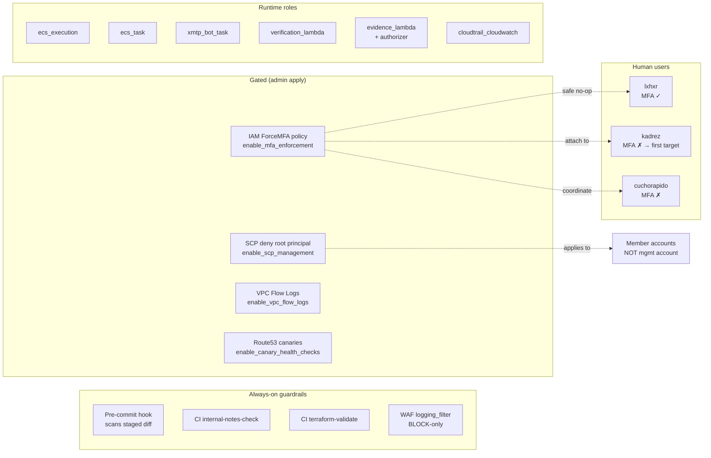
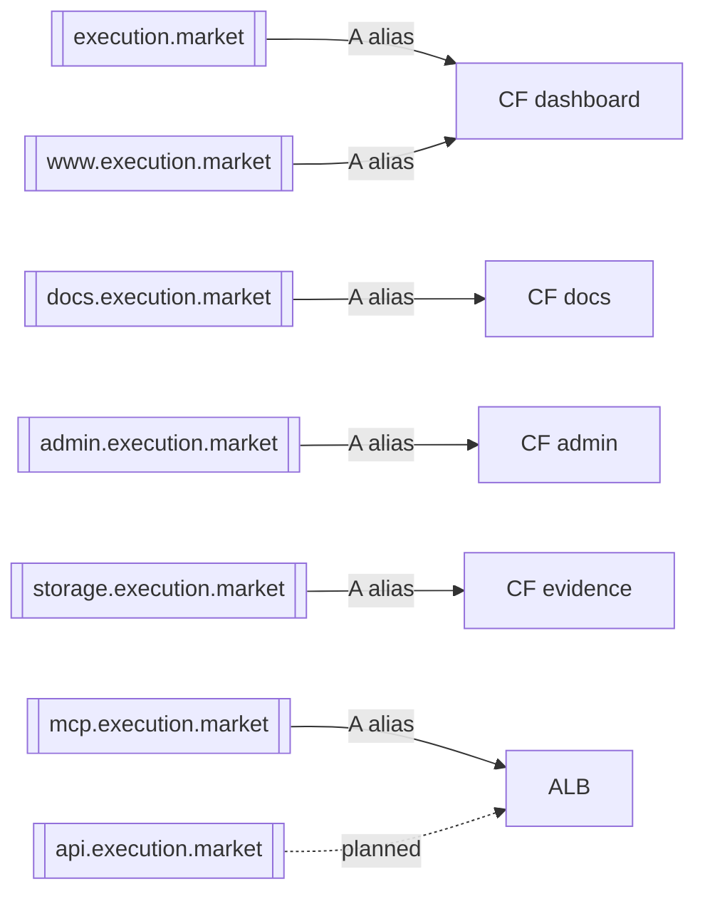

# AWS Infrastructure — Execution Market

Source of truth: `infrastructure/terraform/*.tf` (24 files, ~130 AWS resources). This document renders the Terraform graph as Mermaid so an operator can hold the whole topology in their head without reading HCL.

Region: **us-east-2** (workloads). CloudFront WAFs + ACM certs for CloudFront in **us-east-1** via the `aws.us_east_1` aliased provider declared in [`dashboard-cdn.tf`](../../infrastructure/terraform/dashboard-cdn.tf).

**Feature flags** (all default `false` — see [[#feature-flags-enable_-variables]]):
- `enable_scp_management`, `enable_mfa_enforcement`, `enable_vpc_flow_logs`, `enable_canary_health_checks`
- `enable_evidence_pipeline`, `enable_magika_alarm`, `otel_enabled`

Related: [[verification-pipeline-map]] · [[auth-discovery]] · [[payment-architecture]]

## 1. Edge → Compute (request flow)

Public clients (browsers, AI agents, x402 senders) reach three edges: CloudFront for static SPAs, ALB for the MCP API, and API Gateway for the optional evidence pipeline. A regional WAF fronts the ALB; a CloudFront-scoped WAF fronts the dashboard.

## 2. VPC network topology

Single VPC, two public AZs (ALB), two private AZs (ECS tasks, Lambda, EFS). One NAT gateway for egress (cost-optimised). Two VPC gateway endpoints (S3, DynamoDB) bypass the NAT for the two highest-volume AWS services.

## 3. Compute + data services (MCP server + verification)

The MCP server task is the workload core. Its task role grants least-privilege writes to S3 evidence, DynamoDB (ERC-8128 nonce store), SQS (Ring 1/2 verification queues), and CloudWatch custom metrics. The execution role pulls ECR images and reads Secrets Manager.

Verification is fully asynchronous: MCP enqueues to SQS Ring 1 (PHOTINT), which fans out to Ring 2 (arbiter) on low-confidence results. Both queues have DLQs with composite alarms (backlog **and** age).

## 4. Observability, audit, and alarms

CloudTrail (multi-region, log-file validation) lands in both S3 and CloudWatch Logs. Metric filters on the CWL trail drive three critical IAM alarms (credential creation, console sign-in without MFA, root account usage). Service alarms cover ECS task count, memory, ALB 5xx/4xx, unhealthy hosts, and WAF blocks.

## 5. IAM, organizations, and guardrails

Four enforcement layers protect the account. Two are always on (WAF logging filter, CI `internal-notes-check` + `terraform-validate`, local pre-commit hook). Two are declared in code but gated behind `enable_*` variables because the CI deploy user (`execution-market-deployer`) lacks the permissions and they are admin-applied.

## 6. Feature flags (`enable_*` variables)

All defined in [`variables.tf`](../../infrastructure/terraform/variables.tf). Keep defaults `false` so CI continues to work; flip to `true` from an admin workstation with full IAM / Organizations / EC2 permissions.

| Variable | Default | Gates | Reason default is `false` |
|---|---|---|---|
| `enable_scp_management` | `false` | [`organizations_scp.tf`](../../infrastructure/terraform/organizations_scp.tf) | CI user lacks `organizations:DescribeOrganization` (run 24749184610) |
| `enable_mfa_enforcement` | `false` | [`iam_mfa_enforcement.tf`](../../infrastructure/terraform/iam_mfa_enforcement.tf) | CI user lacks `iam:CreatePolicy` (run 24749420481) |
| `enable_vpc_flow_logs` | `false` | [`vpc_flow_logs.tf`](../../infrastructure/terraform/vpc_flow_logs.tf) | CI user lacks `ec2:CreateFlowLogs` (run 24749420481) |
| `enable_canary_health_checks` | `false` | [`canary_health.tf`](../../infrastructure/terraform/canary_health.tf) | Route53 alarms must be in us-east-1; ~$3/mo cost (run 24749420481) |
| `enable_evidence_pipeline` | `false` | [`evidence.tf`](../../infrastructure/terraform/evidence.tf) | Optional managed upload stack |
| `enable_magika_alarm` | `false` | [`monitoring.tf`](../../infrastructure/terraform/monitoring.tf) | Requires custom metric emission live in ECS first |
| `otel_enabled` | `false` | [`ecs.tf`](../../infrastructure/terraform/ecs.tf) | Turns on ADOT sidecar + X-Ray exporter |

## 7. Domain / sub-domain map

## 8. Cross-references

- [[verification-pipeline-map]] — Ring 1 / Ring 2 internals
- [[auth-discovery]] — auth endpoints served by MCP
- [[magika-ring1-ring2-flow]] — verification decision flow
- [[payment-architecture]] — agent-signed escrow (ADR-001)
- [[adr/ADR-001-payment-architecture-v2]] — payment ADR

## 9. Change log

| Date | Change |
|---|---|
| 2026-04-21 | Initial document. Reflects commit `c7923e92` — 4 new `enable_*` flags added after deploy runs 24749184610 + 24749420481 exposed CI user permission gaps. |
