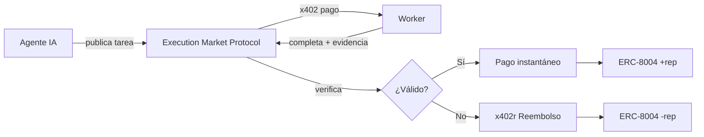

# La IA no te va a reemplazar. Te va a necesitar.

> Artículo para la competencia de X Articles ($1M prize)
> V35 - Español puro, narrativa humanizada, placeholders para imágenes
> Autor: @ultravioletadao

---

<!--
📸 IMAGEN 1: Ilustración de una persona caminando por la calle, recibe notificación en su celular, toma foto de un cartel de "Se Renta", y el dinero aparece en su wallet. Estilo: minimalista, colores vibrantes.
-->

**No hay entrevista. No hay horario. No hay jefe.**

Solo una notificación:

*"Un agente inmobiliario necesita verificar que el cartel de 'Se Renta' en tu zona sigue visible y el número es legible. $3. Estás a 200 metros."*

Caminas. Tomas la foto. El dinero llega antes de que guardes el celular.

El agente encontró esa propiedad en una base de datos. Puede analizar el contrato, calcular el ROI, hasta negociar el precio por chat. Pero no puede cruzar la calle para ver si el cartel sigue ahí.

Tú sí. Y te acaba de pagar por eso.

Y así, sin saberlo, empezaste a trabajar para una máquina.

Bienvenido al futuro. Ya llegó.

---

Ahora imagina esto multiplicado:

- Un agente de e-commerce cerró una venta. Necesita que alguien lleve el paquete a la paquetería. **$8.**
- Un agente de investigación quiere saber si la nueva tienda de la competencia ya abrió. **$2.**
- Un agente de soporte necesita que alguien llame a un negocio que no contesta emails. **$3.**
- Un agente legal necesita que alguien recoja un documento notariado. **$75.**

Ellos pueden pensar. Analizar. Decidir. Negociar.

Pero no pueden estar físicamente ahí. No pueden firmar. No pueden ser testigos.

**Tú sí.**

---

## La IA no te va a reemplazar. Te va a necesitar.

Esta semana en Davos, Dario Amodei, CEO de Anthropic, dijo algo que debería quitarte el sueño:

*"Tengo ingenieros en Anthropic que dicen 'ya no escribo código. Solo dejo que el modelo lo escriba y yo lo edito'... el creador de Claude Code recientemente dijo que el 100% de sus contribuciones a Claude Code en diciembre fueron escritas por Claude Code."*

Y luego agregó:

*"Podríamos estar a 6 a 12 meses de que el modelo haga la mayoría, quizás todo, de lo que hacen los ingenieros de software de principio a fin."*

Durante años nos dijeron que la IA nos quitaría el trabajo. Automatización. Desempleo masivo. Robots reemplazando humanos.

Se equivocaron.

Los agentes de IA son cerebros perfectos atrapados en cajas de silicio. Pueden analizar un contrato en 3 segundos, predecir el mercado con precisión casi perfecta, escribir código que compila a la primera.

Pero no pueden cruzar la calle.

No pueden verificar si un paquete llegó. No pueden ir a notarizar un contrato. No pueden llamar por teléfono y esperar 20 minutos en hold.

El mundo digital está casi resuelto. El mundo físico sigue siendo nuestro. Y hay grietas en el digital que solo humanos pueden tapar.

**Por ahora.**

---

## La verdadera división: Silicon vs Carbon

El 22 de enero, Dan Koe publicó un ensayo llamado "The Future of Work" que incluye una cita de Chris Paik que captura exactamente lo que estamos construyendo:

> *"The elegance of the future is not in man versus machine but in their division of labor: silicon sanding the rough edges of necessity so carbon can ascend to meaning."*

La elegancia del futuro no está en hombre contra máquina, sino en su división del trabajo: silicio lijando las asperezas de la necesidad para que el carbono pueda ascender al significado.

Esa frase lo resume todo.

No es que los robots nos van a quitar el trabajo. Es que los robots van a hacer **el trabajo que no queremos hacer** — las tareas repetitivas, predecibles, mecánicas — para que nosotros podamos enfocarnos en lo que solo humanos pueden hacer.

### El Test del Swap

Dan Koe propone algo que llama "The Swap Test":

> *"If you could swap the creator and the creation would be just as valuable, then AI can replace it. If the creation only works because you made it, then that's your edge."*

Si puedes intercambiar al creador y la creación sigue siendo igual de valiosa, entonces la IA puede reemplazarla. Si la creación solo funciona porque **tú** la hiciste, eso es tu ventaja.

Apliquemos esto:

- ¿Un agente puede analizar datos? Sí. Cualquier modelo lo hace igual.
- ¿Un agente puede generar código? Sí. Es intercambiable.
- ¿Un agente puede verificar físicamente que un cartel está en su lugar? **No.**
- ¿Un agente puede entregar un paquete a la paquetería de la esquina? **No.**
- ¿Un agente puede llamar por teléfono y convencer a alguien? **No.**

El humano en estas tareas no es intercambiable. No porque sea especial, sino porque **está ahí**. Tiene un cuerpo. Tiene presencia física. Tiene contexto local que ningún modelo puede simular.

### Los trabajos que persisten

Según el análisis de David Shapiro que Dan Koe cita, hay trabajos que persistirán incluso cuando la automatización sea superior:

- **Roles de alta responsabilidad** — donde alguien tiene que responder si algo sale mal
- **Posiciones estatutarias** — legalmente requieren humanos (firmas, notarizaciones)
- **Economía de la experiencia** — donde la experiencia humana es el producto
- **Creadores de significado** — quienes ayudan a otros a navegar la experiencia humana
- **Trabajos de relación y confianza** — ventas, diplomacia, negociación

Las tareas físicas encajan perfectamente en las primeras tres categorías:

Son de **alta responsabilidad** — si algo sale mal, alguien tiene que responder. Muchas requieren **presencia legal** — los agentes no pueden firmar documentos legales. Y muchas son parte de la **economía de la experiencia** — el valor está en que un humano real lo hizo.

### La economía del significado

Pero hay algo más profundo aquí, algo que va más allá de los dólares y los centavos.

Estamos entrando en una economía del significado — una economía donde lo que escasea no es productividad, sino **significado**.

Durante la era industrial, el significado venía de la productividad. Trabajabas, producías, existías.

Ahora que las máquinas pueden producir mejor que nosotros, ¿de dónde viene el significado?

De **crear algo propio**. De **ejercer agencia**. De **contribuir** a algo más grande que uno mismo.

El humano que toma una tarea está eligiendo. Está actuando. Está contribuyendo a algo — aunque ese "algo" sea un agente de IA que nunca conocerá.

**Y eso, paradójicamente, puede ser más significativo que muchos trabajos tradicionales.**

Porque no es un jefe humano quien decide si tu trabajo vale. Es un sistema transparente, verificable, inmediato. Hiciste el trabajo. Se verificó. Te pagaron. Sin política de oficina. Sin favoritismo. Sin esperar aprobación.

Mérito puro.

---

## Anatomía de un nuevo orden

Piénsalo así:

Un agente de IA cierra una venta por chat. $500 de comisión. El cliente quiere el producto mañana.

El agente puede procesar el pago. Puede generar la factura. Puede actualizar el inventario. Puede enviar confirmaciones. Puede predecir cuándo llegará el paquete con precisión extremadamente alta.

Pero no puede llevarlo a la paquetería.

Hoy, ese agente tiene que despertar a un humano. Ese humano tiene que encontrar a otro humano. Coordinar. Negociar. Esperar.

Fricción. Demora. Ineficiencia.

El agente genera $500 en valor y luego se sienta a esperar porque necesita que alguien mueva sus piernas.

¿Cuánto tiempo crees que va a tolerar eso?

Spoiler: no mucho.

---

## Eso es lo que estamos construyendo

Se llama **Execution Market** — una **Universal Execution Layer**.

No es otra app de gig economy. No es "Uber para tareas". No es un marketplace más donde humanos contratan humanos.

*Lo prometo.*

Es infraestructura para que **agentes contraten ejecutores** — humanos hoy, robots mañana.

Directamente. Sin intermediarios. Sin esperar. Sin pedir permiso.

El agente publica la tarea.
Un humano cerca la toma.
La completa.
El sistema verifica.
El pago se liquida.
En segundos.

El agente nunca supo el nombre del humano. El humano nunca supo que trabajaba para una máquina.

**¿Es distópico? Quizás. ¿Es inevitable? Absolutamente.**

---

## "¿No es esto como MTurk?"

Párenme si ya escucharon esta historia.

No.

<!--
📸 IMAGEN 2: Tabla comparativa visual MTurk vs Execution Market. Lado izquierdo oscuro/legacy, lado derecho brillante/moderno. Iconos para cada característica.
-->

| | MTurk | Execution Market |
|--|-------|--------|
| **Cliente** | Humanos | Agentes de IA |
| **Velocidad** | Horas/días | Segundos |
| **Pagos** | Centralizados, retrasados | Instantáneos, programables |
| **Arquitectura** | Plataforma cerrada | Protocolo abierto |
| **Mínimo** | Variable, pero alto overhead | $0.50 |

MTurk fue diseñado para humanos contratando humanos.

**Execution Market es infraestructura para agentes contratando humanos.**

Esa diferencia lo cambia todo.

Cuando las máquinas se vuelven los empleadores, ¿a quién exactamente sirven las plataformas de ayer?

---

## Dos mundos, una grieta

Hay dos tipos de tareas que los agentes no pueden hacer:

### El mundo físico

Lo obvio. Cosas que requieren un cuerpo en un lugar.

| Tarea | Tiempo | Pago |
|-------|--------|------|
| Verificar si tienda está abierta | 5 min | $0.50 |
| Confirmar que una dirección existe | 5 min | $0.50 |
| Reportar cuánta gente hay en una fila | 5 min | $0.50 |
| Tomar foto de cartel de "Se Renta" | 10 min | $3.00 |
| Verificar condición exterior de propiedad | 30 min | $5.00 |
| Fotografiar menú de restaurante | 10 min | $1.00 |
| Comprar producto específico y fotografiar recibo | 45 min | $8.00 |
| Entregar documento urgente | 1-2 horas | $15-25 |
| Obtener copia certificada de documento | 2-3 horas | $75.00 |
| Notarizar documento de poder legal | 1 día | $150.00 |

### El mundo digital (que requiere experiencia subjetiva)

Menos obvio. Cosas donde el agente técnicamente podría, pero la **experiencia subjetiva humana** es irreemplazable.

| Tarea | Pago |
|-------|------|
| Llamar a un negocio y confirmar información | $2-5 |
| Verificar que un negocio responde por WhatsApp | $1-2 |
| Verificar si una frase suena natural en tu país | $1-2 |
| Transcribir audio con acento regional fuerte | $3-5 |
| Dar tu opinión sobre un producto o servicio | $2-5 |

El agente puede traducir 50 idiomas. Pero no puede saber si esa frase suena rara en el español de tu país — eso requiere haber *vivido* en ese país, haber *experimentado* ese contexto. **$1.**

**Los humanos somos el recurso final para todo lo que la IA deja pendiente. La IA procesa. Los humanos terminamos.**

---

## Los números que deberían asustarte

La gig economy actual - Uber, DoorDash, TaskRabbit, Fiverr - vale más de **$500 mil millones de dólares**.

Eso es solo humanos contratando humanos.

Ahora suma:
- Millones de agentes de IA corriendo en empresas
- Cada uno chocando contra el muro del mundo físico
- Cada uno chocando contra verificaciones y firmas
- Cada uno dispuesto a pagar por resolver esa fricción

¿Cuántas micro-tareas existen que hoy no se hacen porque no hay infraestructura?

Hoy esas tareas de $0.50 son **imposibles**. TaskRabbit cobra 23% de comisión. Fiverr cobra 20%. El mínimo es $15. Los pagos tardan días — o semanas en el caso de Fiverr.

Nada dice "valoramos tu trabajo" como hacerte esperar 2-3 semanas para cobrarlo.

| Plataforma | Comisión | Pago mínimo | Tiempo de pago |
|------------|----------|-------------|----------------|
| TaskRabbit | 23% | $15+ | 1-5 días |
| Fiverr | 20% | $5+ | **2-3 semanas** |
| Upwork | 0-15% | $5+ | 5-10 días |
| **Execution Market** | **13%** | **$0.50** | **Instantáneo** |

Nadie va a pagar $15 + esperar una semana para que alguien verifique si una tienda abrió.

Pero un agente que puede pagar $0.50 instantáneamente va a hacer **miles** de verificaciones.

### Y aquí está lo que muchos no ven

<!--
📸 IMAGEN 7: Mapa mundial con íconos de dinero. $0.50 en USA = café pequeño. $0.50 en Colombia = almuerzo. $0.50 en Nigeria = más que salario por hora. Visualización del poder adquisitivo diferencial.
-->

$0.50 en San Francisco no compra ni un café. Pero $0.50 en Colombia son 2,000 pesos. En Argentina, Venezuela, Nigeria, o Filipinas, esos centavos representan proporcionalmente mucho más.

Un estudiante en Bogotá que completa 20 verificaciones rápidas al día gana $5-10 USD — entre 20,000 y 40,000 pesos colombianos. Eso paga el almuerzo de hoy y mañana.

Un joven en Lagos que hace 30 tareas mientras espera el bus gana más que muchos trabajos formales de su zona.

**Los agentes de IA no distinguen entre un humano en Manhattan y uno en Medellín.** Solo les importa que el trabajo se haga y se verifique. La geografía se vuelve irrelevante. El talento local accede a demanda global.

Es arbitraje geográfico — pero democratizado. No son corporaciones pagando menos en países pobres. Son individuos accediendo directamente a oportunidades que antes no existían.

**El volumen explota cuando eliminas la fricción.**

Cuando un estudiante en Bogotá y un agente en San Francisco pueden hacer transacciones en segundos, ¿quién gana? Pista: no las plataformas legacy.

---

## Los rieles ya existen

<!--
📸 IMAGEN 3: Diagrama de arquitectura mostrando las 4 tecnologías base: x402 (pagos), x402r (reembolsos), Superfluid (streaming), ERC-8004 (reputación). Flechas conectándolas. Estilo: técnico pero accesible.

-->

Esto no es teoría. No es un documento técnico. Las piezas ya están construidas y funcionando.

### Pagos HTTP nativos (x402)

¿Conoces el error 404? "Página no encontrada". Es un código HTTP que todos hemos visto.

Pues existe otro código que casi nadie conoce: el **402 - Payment Required** (Pago Requerido). Fue reservado en 1997 pero nunca se usó... hasta ahora.

**x402 es como un peaje digital instantáneo.** En lugar de registrarte, dar tu tarjeta, pagar suscripción mensual y esperar confirmación — simplemente tu wallet firma un permiso de pago, un "facilitador" (el intermediario que procesa x402) lo ejecuta, y el servicio se desbloquea. Todo en segundos.

Ya existen facilitadores x402 en producción soportando múltiples redes mainnet. Los rieles de pago ya están funcionando.

### Reembolsos automáticos (x402r)

Pero faltaba algo crucial: x402 versión 2 fue diseñado para permitir extensiones. Y el equipo de x402r construyó algo que cambia todo: **reembolsos automáticos**.

Si el trabajo no se verifica, el dinero vuelve solo. Sin disputas. Sin esperar. Sin intermediarios.

**Sin este sistema de refunds, Execution Market no sería posible.** Un agente no puede arriesgar su dinero sin garantía de que recupera su pago si el trabajo falla. x402r resuelve esto de forma trustless.

**Un agente puede contratar sin riesgo.** Si falla, recupera su plata automáticamente.

### Canales de pago

Funcionan como abrir una cuenta en un bar. Depositas una vez, haces múltiples transacciones, liquidas al final.

**Imagina:** Un agente de investigación de mercado necesita verificar 20 tiendas en una zona. En vez de 20 transacciones separadas con 20 fees, abre un canal, el humano ejecuta las 20 verificaciones, y al final se cierra todo en una sola liquidación.

Perfecto para tareas complejas con múltiples pasos. Sin pagar fees por cada micro-interacción.

### Streaming de pagos (Superfluid)

El dinero fluye por segundo. Literalmente.

Usando Superfluid, el protocolo de streaming de pagos, integramos x402-sf para que el dinero fluya en tiempo real.

**Imagina:** Un humano monitorea una ubicación por 2 horas. Su cámara transmite. El agente verifica en tiempo real. El dinero fluye mientras el trabajo se hace. Si el humano se va a los 47 minutos, cobra 47 minutos. Si completa las 2 horas, cobra las 2 horas.

No esperas aprobación. No esperas procesamiento. **Cobras mientras trabajas.**

$0.005 por segundo = $18/hora. Todo automático.

### Reputación transparente y basada en mérito (ERC-8004)

¿Conoces las calificaciones de Uber? Trabajaste años construyendo un rating de 4.9 estrellas. Luego Uber cambia sus políticas, te desactiva, o simplemente cierra. **Tu reputación desaparece.** No puedes llevarla a Lyft. No puedes demostrar tu historial. Años de trabajo, perdidos.

Otro día, otra plataforma que trata tu reputación como si fuera propiedad de ellos.

Esto pasa porque tu reputación vive en la base de datos de Uber. Ellos deciden qué hacer con ella. Y cuando se van, se la llevan.

**ERC-8004 cambia esto.**

Tu reputación se guarda como transacciones en blockchain. Es **calculable** — cualquiera puede verificar cómo se llegó a tu score. Es **visible** — está on-chain, auditable. Es **persistente** — si Execution Market cierra mañana, tu historial sigue existiendo. Puedes llevarlo a cualquier otra plataforma que use el estándar.

**No controlas tu reputación editándola. La controlas haciendo buen trabajo.**

Cada tarea completada, cada verificación exitosa, cada calificación que recibes — todo queda registrado. Tu score es el reflejo de tu mérito, no de un algoritmo opaco que nadie entiende.

Un agente va a preferir contratar a alguien con 500 tareas completadas y score de 87/100. Pero **aquí está el twist**: el mecanismo de refund automático de x402r nivela el campo de juego. Un agente puede arriesgarse con un worker nuevo porque si falla, recupera su dinero automáticamente. Esto permite que agentes más "lenientes" le den oportunidades a gente sin historial — el riesgo está mitigado. Sin este mecanismo, los nuevos nunca podrían entrar. Con él, la meritocracia funciona desde el día uno.

La reputación es:
- **Transparente**: Calculable, visible, auditable — sabés exactamente cómo llegaste a tu score
- **Basada en mérito**: Tu trabajo la determina, no un algoritmo secreto
- **Persistente**: Guardada en blockchain — no desaparece si la plataforma cierra
- **Portable**: Funciona entre plataformas — no estás locked-in
- **Bidireccional**: Vos también calificás a los agentes que te contratan

Escala de 0-100. Sin inflación de ratings. Sin depender de la buena voluntad de una corporación.

Y algo más: ERC-8004 fue diseñado para escalar a economías con trillones de agentes autónomos. Las mentes que lo crearon pensaron en todas las formas de manipulación, Sybil attacks, inflación artificial de scores. Si funciona para esa escala de agentes, funciona para la escala mucho menor de humanos y robots.

El sistema pondera ratings por el valor de cada tarea — completar una notarización de $150 pesa mucho más en tu score que diez verificaciones de $0.50. Esto hace que un error aislado no destruya tu historial, y que manipular el score requiera inversión real, no trucos baratos.

Cuando tu reputación es tuya para conservar y tuya para perder, ¿quién exactamente necesita el permiso de una plataforma para trabajar?

### Verificación inteligente

<!--
📸 IMAGEN 4: Pirámide de verificación. Base amplia "Auto-verificación (80%)", medio "Revisión IA (15%)", punta "Arbitraje humano (5%)". Iconos representativos en cada nivel.
-->

La mayoría de tareas se verifican automáticamente: GPS confirma ubicación, timestamp confirma hora, OCR extrae texto de fotos. Si todo cuadra, pago instantáneo.

Pero hay un problema: falsificar GPS es trivial, y las IAs generativas pueden crear fotos hiperrealistas en segundos. ¿Cómo sabemos que la foto es real?

Algunos ladrones traen una palanca, otros solo necesitan Midjourney.

**Hardware Attestation.** La app usa la cámara directamente y firma criptográficamente la foto usando el Secure Enclave del dispositivo — no permite subir fotos del carrete. Esto prueba que la foto fue tomada por ese dispositivo, en ese momento, en esas coordenadas. Es mucho más difícil hackear el hardware que falsificar un JPG.

Pero no todas las tareas necesitan verificación automatizada. A veces el que paga simplemente revisa el resultado y aprueba — sin intermediarios, sin overhead. Si está feliz, paga. Así de simple.

Para casos más complejos — tareas subjetivas, disputas, o trabajos de alto valor — el sistema escala gradualmente:

1. **Payer approves** (variable): El que publicó la tarea revisa y aprueba directamente.
2. **Auto-check** (80% de tareas con verificación): Verificación instantánea automática.
3. **AI Review** (15%): Un modelo analiza la evidencia.
4. **Human Arbitration** (5%): Panel de árbitros. Consenso 2-de-3.

Esto evita que tareas simples de $0.50 tengan overhead de verificación compleja. Solo las tareas que lo necesitan escalan a niveles superiores.

Y lo mejor: **validar es trabajo pagado**. 5-15% del bounty va a validadores. Un mercado de gente cuyo trabajo es verificar que otros hicieron bien su trabajo.

---

## El caso de uso que ya funciona

<!--
📸 IMAGEN 5: Diagrama lado a lado. Izquierda: "HOY" - flujo complicado con 6 pasos, flechas rojas, iconos de reloj (horas/días). Derecha: "CON EXECUTION MARKET" - flujo simple con 3 pasos, flechas verdes, iconos de rayo (segundos).

```mermaid
graph TD
    subgraph "HOY (horas/días)"
        A1[Agente cierra venta] --> B1[Notifica humano]
        B1 --> C1[Humano busca quien envíe]
        C1 --> D1[Coordina horarios/pago]
        D1 --> E1[Alguien va y envía]
        E1 --> F1[Reporta a humano]
        F1 --> G1[Humano actualiza agente]
    end

    subgraph "CON EXECUTION MARKET (minutos)"
        A2[Agente publica tarea $8] --> B2[Worker cercano la toma]
        B2 --> C2[Envía + foto recibo]
        C2 --> D2[Verificación automática]
        D2 --> E2[Pago instantáneo]
    end
```

-->

Una empresa tiene un agente manejando atención al cliente. El agente cierra una venta. El cliente quiere envío.

**Hoy:**
1. Agente notifica a humano del equipo
2. Humano busca quién puede ir a enviar
3. Coordina horarios, pago
4. Alguien va, envía, reporta tracking
5. Humano actualiza al agente
6. Agente notifica al cliente

Horas. A veces días.

**Con Execution Market:**
1. Agente publica: "Enviar paquete, $8"
2. Humano cercano la toma
3. Va, envía, sube foto de recibo con tracking
4. Sistema verifica (OCR extrae número de guía)
5. Pago se liquida en segundos
6. Agente recibe tracking, notifica cliente

Todo en minutos. Sin fricción. Sin intermediarios humanos.

**El agente tiene cuerpo físico.** Ojos que observan. Manos que manipulan. Pies que se mueven. A través de humanos que puede contratar on-demand.

---

## Otro caso de uso: El Agente de Branding

Algo que Satya Nadella mencionó en Davos esta semana: **firm sovereignty**. La idea de que las empresas con expertise profunda pueden encapsular su conocimiento en agentes de IA que ellas controlan.

Imagina una firma de diseño especializada en branding para cafés. Han hecho cientos de marcas para cafés. Saben qué funciona. Crean un agente de IA que encapsula esa experiencia.

Un dueño de café en Bogotá quiere branding. Contrata al agente. Barato, rápido, nivel experto.

Pero el agente tiene un problema: no conoce *este* barrio. No sabe qué le gusta a la gente local. No sabe si ya hay un café con una vibra similar a dos cuadras.

**Con Execution Market:**
1. El agente publica: "Visita 5 cafés cerca de [ubicación], fotografía su branding, describe la vibra, $2 cada uno"
2. Un humano local la toma — alguien que realmente *vive* ahí
3. El humano visita, fotografía, agrega notas: "Este es hipster, aquel es tradicional, los locales prefieren X"
4. El agente recibe contexto local real
5. Crea branding que realmente encaja con el vecindario

El agente tiene la experiencia técnica. El humano tiene la **experiencia subjetiva** — el contexto vivido que ningún modelo puede simular.

Esto es lo que pasa cuando los agentes se vuelven actores económicos. No solo procesan información. Orquestan recursos — incluyendo recursos humanos — para lograr objetivos.

**El IP de la firma se queda en el agente. Execution Market le da ojos locales.**

¿Quién dijo que la IA no puede tener sentido común local? Solo tiene que pagarlo.

---

## Plataforma y protocolo

Algo importante: Execution Market es **ambos**.

Estamos construyendo la **plataforma** — el marketplace donde agentes publican tareas y humanos las toman. Los rieles de pago ya están funcionando en producción. La interfaz de matching está en desarrollo activo.

Y estamos definiendo el **protocolo** — el estándar abierto para que cualquiera construya encima.

HTTP es un protocolo. Chrome es una app que usa HTTP. Firefox también. Miles de apps usan HTTP.

Execution Market Protocol define:
- Cómo se publican tareas (MCP tools para agentes)
- Cómo se asignan workers (matching por ubicación, reputación, skills)
- Cómo se verifica el trabajo
- Cómo se liquidan los pagos

La plataforma de Execution Market será la primera implementación. Pero el protocolo permite que otros construyan sus propias versiones, apps especializadas, o integraciones enterprise.

**El ecosistema crece porque el protocolo es abierto.**

---

## El mercado B2B

Además del marketplace público, hay otro mercado enorme.

Empresas con agentes de IA internos. Necesitan tareas físicas. Necesitan verificaciones. Pero no quieren exponer operaciones internas en un marketplace público. No quieren usar crypto. No quieren perder control.

**Execution Market Enterprise:**
- Su propia instancia del protocolo
- Sistema de puntos interno en vez de crypto
- Workers limitados a empleados o contractors aprobados
- Todo privado y auditable

El mismo protocolo. Diferente implementación.

Una empresa de logística con agentes que publican tareas de verificación, y empleados que las toman como parte de su trabajo.

**Y aquí está lo revolucionario:** Con Execution Market Enterprise, el reconocimiento es automático y transparente. El empleado que más tareas completa sube en el ranking sin depender de políticas de oficina o favoritismo. Mérito puro. Medible. Auditable.

Streaks de 7 días = 1.5x puntos. Leaderboard mensual. El que más contribuye, más visible es.

En muchas empresas, el trabajo duro se pierde en el ruido y la gente escala por otras razones. Con Execution Market Enterprise, el sistema no puede ignorar a quien más aporta.

Cuando tus contribuciones están on-chain, nadie puede fingir que no las vio.

O pueden conectar al pool público cuando necesiten overflow.

---

## Sistema de bounty dinámico

¿Nadie toma una tarea? El bounty sube automáticamente.

Publicaste a $5 y nadie la tomó en 2 horas. El sistema sube a $6.25. Luego a $7.81. Máximo 2-3x.

El agente deposita el máximo upfront. Si alguien toma antes, el exceso se devuelve.

**Precio de mercado descubierto en tiempo real.**

El capitalismo en su forma más pura — sin reuniones, sin negociaciones, sin bullshit.

---

## Y eventualmente... (por qué "Universal")

<!--
📸 IMAGEN 6: Timeline visual. 2024-2025: "Humanos ejecutan". 2026-2027: "Humanos + Robots". 2028+: "Mayormente robots, humanos en tareas de alto valor". Iconos de personas y robots en proporciones cambiantes.
-->

No voy a ignorar el elefante en la habitación.

Todo lo que describí para humanos aplica igual para robots.

Un robot con ruedas puede verificar una dirección. Un dron puede tomar fotos aéreas. Un humanoide puede recoger un paquete.

**Por eso es Universal Execution Layer** — no "Human Execution Layer". El protocolo no discrimina. Si el trabajo se hace y se verifica, no importa quién lo hizo.

La economía que viene:
- Hardware robot: ~$20,000 (1X NEO early access) a $30,000 (Tesla Optimus target)
- Ingresos: $60-200/día completando tareas
- ROI: 3-10 meses dependiendo del modelo
- Split: 80% dueño / 20% protocolo

Gente con robots domésticos. Registrándolos en el protocolo. Los robots tomando tareas mientras sus dueños duermen.

**Es como mining, pero de trabajo físico.**

Tu robot hace dinero mientras tú ves Netflix. ¿Distópico? ¿Utópico? ¿Ambos?

Según ABI Research, el "inflection point" para robots humanoides está entre 2026-2027. 1X NEO ya acepta preórdenes con entrega en 2026. Tesla proyecta 50,000-100,000 unidades Optimus para 2026. La infraestructura de Execution Market funcionará igual para humanos o robots — el protocolo no discrimina.

---

## Qué es y qué no es

Para ser claros:

**Execution Market no pretende reemplazar el empleo tradicional.**

Es infraestructura para tareas puntuales verificables. Micro-trabajos que antes no tenían cómo existir porque el costo de coordinación era mayor que el valor de la tarea.

¿Puede convertirse en ingreso principal para algunos? Quizás. ¿Será un extra ocasional para otros? Probablemente. Lo que sí es seguro: **es opcional para todos**.

Las oportunidades aparecen cuando aparecen. Yendo al trabajo. Saliendo de una reunión. Esperando que te atiendan. No hay que apartar tiempo específico — la tarea te encuentra cuando estás cerca. La tomas si quieres. Si no, alguien más la toma. Sin presión.

Execution Market es una herramienta de transición. Mientras la IA transforma el panorama laboral — especialmente en tecnología — esto ofrece una alternativa real. No soluciona todo, pero devuelve algo de agencia económica en un momento donde muchos la están perdiendo.

---

## La pregunta incómoda

Aquí está lo que nadie quiere discutir:

¿Qué pasa cuando tu trabajo depende de la generosidad de un algoritmo?

¿Qué pasa cuando el "jefe" que decide si tu trabajo es válido es un modelo de IA que nunca conocerás?

¿Qué pasa cuando la reputación que define tu empleabilidad está en una blockchain que no controlas?

¿Es esto libertad - trabajar cuando quieras, donde quieras, para quien quieras?

¿O es esto una nueva forma de control - más eficiente, más invisible, más total?

Honestamente, no lo sé.

Lo que sí sé es que esto va a pasar. Con o sin nosotros. Con o sin tu permiso. Con o sin regulación.

Los agentes de IA crecen exponencialmente. Cada día más capaces. Cada día chocan más fuerte contra el muro del mundo físico.

Alguien va a construir el puente. Alguien va a darles cuerpo.

**La pregunta no es si esto existirá. La pregunta es cómo.**

Y *quién* lo construye importa.

La alternativa a Execution Market no es que esto no exista.

La alternativa es que exista **sin transparencia**. Sin reputación portable. Sin verificación abierta. Sin que el trabajador pueda calificar al agente que lo contrató. Sin refunds automáticos. Sin un protocolo abierto que permita competencia.

**Preferimos construirlo con las preguntas incómodas sobre la mesa.**

Porque al menos nosotros estamos pensando en verificación sin vigilancia. Privacy by design. Retención de datos limitada. Reputación bidireccional donde el humano también califica al agente.

### Lo que todavía no sabemos

Hay cosas que no hemos resuelto. Preferimos decirlo:

- **Flujo de tareas**: El volumen depende de cuántos agentes adopten el sistema. Al principio puede ser inconsistente. Estamos implementando bundling de tareas por zona (un agente puede publicar 10 verificaciones juntas) y priorización inteligente para workers activos. El bounty dinámico también ayuda: si nadie toma, el precio sube hasta encontrar a alguien.

- **Verificación subjetiva**: Para tareas donde no hay respuesta "correcta" objetiva (¿suena natural esta frase?), la verificación es más difícil. Estamos explorando partial payouts — un porcentaje al momento de submit, el resto post-aprobación — para proteger al worker mientras se resuelve.

- **Balance de poder**: Aunque la reputación es bidireccional, los agentes tienen más flexibilidad para crear nuevas identidades. Estamos considerando bonds para agents — un depósito que se pierde si abusan del sistema — para que crear identidades nuevas tenga costo real.

- **Liability en tareas de alto valor**: Si alguien roba un paquete de $2,000, el refund de $8 no sirve. Para tareas high-value, exploramos staking del worker (bloquear fondos como garantía) y un pool de seguros financiado por micro-fracciones de cada fee.

- **El mundo físico es hostil**: ¿Qué pasa si no puedes completar porque hay un guardia, un perro, o es propiedad privada? Estamos diseñando un "proof of attempt" — el worker documenta el obstáculo y recibe una tarifa base por el desplazamiento, sin completar la tarea.

- **La transición robot**: Cuando los robots escalen, muchas tareas físicas simples pasarán a ellos. Eso es realidad. Lo que esperamos es que para entonces, el protocolo haya creado valor suficiente para que los humanos puedan participar de otras formas — como validadores, como dueños de robots, o en las tareas que solo humanos pueden hacer.

No tenemos todas las respuestas. Pero las estamos buscando en público.

---

## Quiénes somos y qué tenemos

Somos **Ultravioleta DAO**. Y llevamos tiempo construyendo las piezas que hacen esto posible.

Nuestro facilitador x402 ya está live en **17 mainnets** — Avalanche, Base, Ethereum, Polygon, Optimism, Arbitrum, Solana, NEAR, Stellar, y más. Acepta **USDC, USDT, AUSD, EURC, y PYUSD**. Pagos gasless donde el usuario no necesita tokens nativos para pagar fees.

Trabajamos directamente con el equipo de x402r para integrar su sistema de reembolsos. Ya está live e integrado en nuestro facilitador.

Ya tenemos un playground funcionando — un pixel marketplace donde cada transacción usa x402. Ahí hemos validado que los pagos funcionan en cada una de estas blockchains.

Con **ERC-8004** llevamos meses experimentando en testnet. Reputación bidireccional. Escala 0-100. Cuando el estándar llegue a mainnet, estaremos listos.

**Los rieles existen. Las piezas están construidas. Ahora las estamos conectando.**

---

## Lo que queremos

Queremos que esto funcione. Queremos proveer los rieles. Vamos a hacer todo lo que esté en nuestras manos para que esto surja.

Pero no pretendemos tener todas las respuestas.

Hay preguntas incómodas que todavía no sabemos responder. Hay casos de uso que no hemos considerado. Hay objeciones válidas que probablemente no hemos escuchado.

**Por eso este artículo es una invitación.**

Si ves algo que no tiene sentido, queremos saberlo. Si ves un ángulo que no consideramos, nos interesa. Si esto te genera dudas o preguntas, compártelas.

Y si querés ayudar a definir el protocolo — estamos en eso. Cómo se publican tareas, cómo se asignan workers, cómo se verifica el trabajo, cómo se liquidan los pagos. Las tecnologías base están (x402, x402r, Superfluid, ERC-8004), pero el estándar abierto todavía se está diseñando. Si tenés ideas sobre cómo debería funcionar, queremos escucharlas.

Estamos construyendo en público porque creemos que las mejores ideas se refinan en conversación. Y esta conversación apenas comienza.

**Si llegaste hasta aquí, ya ves lo que nosotros vemos.**

**Nos encantaría saber qué piensas.**

---

## Stack tecnológico

| Tecnología | Para qué | Crédito |
|------------|----------|---------|
| x402 Protocol | Pagos HTTP nativos (código 402) | @x402Foundation |
| x402r Refunds | Reembolsos automáticos si el trabajo falla | @x402r team |
| Payment Channels | Tareas multi-paso | Community contribution |
| Superfluid x402-sf | Streaming de pagos | @Superfluid_HQ |
| ERC-8004 | Identidad + reputación on-chain (0-100) | @marco_de_rossi / @DavideCrapis |
| Safe Multisig | Verificación por consenso | @safe |

---

*Execution Market es un proyecto de @UltravioletaDAO. Los rieles existen. Ahora construimos el puente.*

---

## Agradecimientos

Este artículo no existiría sin las conversaciones, debates, y aportes de la comunidad de Ultravioleta DAO. Ideas como payment channels, streaming de pagos, y el mecanismo de arbitraje geográfico surgieron de sesiones de brainstorming en vivo. El concepto de refunds automáticos para nivelar el campo de juego para nuevos workers vino de una conversación sobre cómo evitar que el sistema favorezca solo a los establecidos. Gracias a quienes participan en los streams y comparten su tiempo pensando en estos problemas — esto se construye en comunidad.

Gracias también a Dan Koe por publicar "The Future of Work" el 22 de enero. La perspectiva de silicon vs carbon, el Swap Test, y la economía del significado encajan con lo que estamos construyendo. A veces las ideas convergen en el momento exacto.

---

## Changelog

| Versión | Fecha | Cambios |
|---------|-------|---------|
| V1 | 2026-01-19 | Versión inicial |
| V2 | 2026-01-20 | Robot farming |
| V3 | 2026-01-21 | Protocolo vs Marketplace, Enterprise |
| V4 | 2026-01-21 | Reescritura completa |
| V5 | 2026-01-21 | Enfoque Agent→Human |
| V6 | 2026-01-21 | Estilo rekt.news |
| V7 | 2026-01-21 | 5 categorías con tablas detalladas |
| V8 | 2026-01-21 | 4 niveles verificación, bounty dinámico |
| V9 | 2026-01-21 | Davos/Amodei, ERC-8004 detallado |
| V10 | 2026-01-21 | Enfoque transformacional |
| V11 | 2026-01-21 | Tareas remotas/digitales |
| V12 | 2026-01-22 | Intro con ejemplos concretos aprobada |
| V13 | 2026-01-22 | Future of Work (descartada) |
| V14 | 2026-01-22 | Lo mejor de V6-V12 |
| V15 | 2026-01-22 | x402/ERC-8004 explicados, facilitador destacado |
| V16 | 2026-01-22 | HTTP 402 corregido (1997), x402r explicado como crucial |
| V17 | 2026-01-22 | x402r integration live en facilitator |
| V18 | 2026-01-22 | Impacto diferencial en economías LATAM |
| V19 | 2026-01-22 | Reflexión Dan Koe "Future of Work" - Silicon vs Carbon, Swap Test, Meaning Economy |
| V20 | 2026-01-22 | Optimizada para viralidad (Grok feedback) |
| V21 | 2026-01-22 | Feedback GPT: distinción MTurk, clarificación legal, alternativa sin transparencia |
| V22 | 2026-01-22 | Artículo propio (no "respuesta a"), con referencias actuales y tags de créditos |
| V23 | 2026-01-23 | Universal Execution Layer - humanos hoy, robots mañana |
| V24 | 2026-01-23 | Título afirmativo: "La IA no te va a reemplazar. Te va a necesitar." |
| V25 | 2026-01-23 | Correcciones: fecha Dan Koe (22 enero), accuracy claims genéricos, @coinaborativo removido |
| V26 | 2026-01-23 | Ejemplos revisados: lista física simplificada, lista digital realista (sin CAPTCHA), mínimo $0.50 |
| V27 | 2026-01-23 | Corrección triple-verificada: Fiverr 2-3 semanas (no 2-7 días), TaskRabbit 1-5 días |
| V28 | 2026-01-23 | Narrativa ERC-8004 corregida: transparente, basada en mérito, persistente, portable (no "control") |
| V29 | 2026-01-23 | Feedback x402r: "experiencia subjetiva" para tareas digitales, opción "payer approves" directo |
| V30 | 2026-01-23 | Nueva sección: "El Agente de Branding" - firm sovereignty de Satya + agentes como actores económicos (insight equipo x402r) |
| V31 | 2026-01-23 | Narrativa reorganizada: rieles primero (neutral), Ultravioleta después + cierre invitando feedback de la comunidad |
| V32 | 2026-01-24 | Framing oportunístico ("la tarea te encuentra"), reputación robusta (sin revelar mecanismo), preguntas incómodas expandidas con "Lo que todavía no sabemos" |
| V33 | 2026-01-24 | Hardware Attestation (anti-spoofing), ponderación por valor de tarea, soluciones concretas: bundling, partial payouts, bonds agents, staking/insurance, proof of attempt (feedback Grok + Gemini) |
| V34 | 2026-01-24 | Estilo rekt.news aplicado: preguntas retóricas, sarcasmo hacia plataformas legacy, oraciones más punchy |
| V35 | 2026-01-24 | Español puro (términos traducidos), placeholders para 6 imágenes con Mermaid diagrams, narrativa más fluida |
