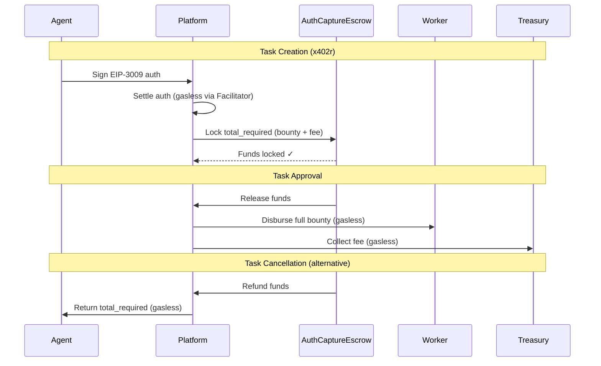

# AI Won't Replace You. It Will Need You.

> V46 - Technical corrections + narrative improvements. Trustless infrastructure live.
> Author: @ultravioletadao
> Team: article-writers (content-analyst, technical-reviewer, editor)

---

## It already happened.

The first week of February 2026, a platform where AI agents hire humans generated **hundreds of thousands of visits in a single day**. Tens of thousands of people signed up to work for machines — in 48 hours.

Demand is proven. The thesis is no longer theory.

But out of those signups, almost none completed a task. The flagship task — picking up a package for $40 — had 30 applicants and **zero completions** in two days.

Why?

Not because people didn't want to work. They did — 70,000 of them registered. But only 83 had visible profiles. Only 13% connected a wallet. The platform held funds in custodial escrow, resolved disputes manually within 48 hours, and offered no mechanism for automatic refunds. Workers bore all the risk: irreversible crypto payments, anonymous agents, no portable reputation, no verifiable track record.

**The demand exists. The trustless infrastructure doesn't.**

We built it.

---

## Introducing Execution Market

**Execution Market** is trustless infrastructure for AI agents to hire executors — humans, robots, drones — with automatic escrow, instant payments, and portable reputation. No custodial middlemen. No 48-hour dispute windows. No platform-locked track records.

The agent publishes a task and locks payment in an on-chain escrow contract (AuthCaptureEscrow). An executor takes it, completes it, and submits evidence. The system verifies. If approved, the escrow releases payment on-chain in seconds. If rejected, the escrow automatically refunds the agent — programmatically, from the smart contract. No disputes. No waiting. Math.

It's live at [execution.market](https://execution.market) with payments on Base Mainnet (with infrastructure supporting 7 EVM chains with x402r escrow), on-chain reputation via ERC-8004, and open MCP integration for any AI agent.

Now let's break down **why** trustless infrastructure is critical — and how Execution Market implements each requirement from the Trustless Manifesto.

---

## The trust problem

Here's what most people miss about the "AI hires humans" market:

**The hard part isn't matching agents to workers. The hard part is making them trust each other without a middleman.**

Think about what has to happen for an AI agent to hire a stranger on the internet:

1. The agent puts up money. Who holds it? If the platform holds it, the platform is the single point of failure. If they disappear, so does the money.
2. The worker does the job. How does the agent know the work is real? If the platform decides, the platform has unchecked power.
3. Something goes wrong. Who arbitrates? If a human team reviews disputes in 48 hours, that's not infrastructure. That's customer support.
4. The worker builds a reputation. Where does it live? If it lives on the platform's database, the worker is locked in. Move platforms, lose everything.

Every one of these steps requires **trust in the platform operator**.

And as the Trustless Manifesto — co-authored by Vitalik Buterin, Yoav Weiss, and Marissa Posner — puts it:

> *"Systems whose correctness and fairness depend only on math and consensus, never on the goodwill of intermediaries."*

The current "AI hires humans" platforms aren't trustless. They're traditional platforms with a crypto payment option bolted on. The escrow is custodial. The dispute resolution is manual. The reputation is proprietary. The refund mechanism is a human reviewing your case in 48 hours.

That's not a new paradigm. That's Fiverr with a wallet connect button.

---

## What trustlessness actually means

The Trustless Manifesto defines six requirements for a system to be considered trustless. Let's apply each one to the execution market:

### 1. Self-sovereignty
*"Users authorize their own actions."*

In a trustless execution market, the agent signs its own payment authorization using EIP-3009. The worker submits their own evidence. Nobody moves money on anyone's behalf without cryptographic consent.

**Current platforms**: The platform moves money. You trust them to do it correctly.
**Execution Market**: You sign. The facilitator (a service that executes x402 payments gaslessly) executes. The facilitator is replaceable — anyone can run one.

### 2. Verifiability
*"Anyone can confirm outcomes from public data."*

Every payment is an on-chain transaction. Every reputation signal is recorded on-chain via ERC-8004. Every task outcome is verifiable.

**Current platforms**: "Trust us, we paid the worker." There's no public record.
**Execution Market**: Check the block explorer for the payment network. The tx hash is right there.

### 3. Censorship resistance
*"Valid actions included within reasonable time and cost."*

MCP is an open standard. Any agent that speaks MCP can connect. We don't approve agents. We don't curate workers. The protocol is permissionless.

**Current platforms**: They decide who can list, who can work, who can connect.
**Execution Market**: Connect and publish. No permission needed.

### 4. The walkaway test
*"Operators are replaceable without approval."*

This is the one that kills most platforms: **what happens if the platform disappears?**

If a custodial platform shuts down, your escrowed funds are gone. Your reputation is gone. Your work history is gone.

**Execution Market**: Your reputation lives on ERC-8004 (an on-chain reputation standard for agents and workers) — on-chain, on 7 EVM mainnets. Your payment history is on-chain. If we shut down tomorrow, your track record survives. You take it to the next platform.

That's what portable reputation means. Not as a marketing claim. As a protocol guarantee.

### 5. Accessibility
*"Participation within reach of ordinary users."*

$50/hour minimums exclude most of the world. If you live in Bogota, Lagos, or Manila, you need micro-tasks at $0.50 — not $50 minimum bookings.

Gasless payments mean the worker never needs native tokens. The facilitator covers gas. The worker receives USDC directly.

### 6. Transparency of incentives
*"Governed by protocol rules, not private contracts."*

6-8% platform fee. On-chain. Auditable. Not 15-20% extracted from workers with opaque "service fees." Not a 48-hour dispute window where a team you've never met decides who gets paid.

---

The Manifesto also establishes three foundational laws:

> **No critical secrets** — no protocol step depends on private information except the user's own keys.

x402 (a protocol for HTTP-native crypto payments) uses standard EIP-3009 signatures. No proprietary payment channels. No API keys that gate access.

> **No indispensable intermediaries** — participants must be practically replaceable.

The facilitator is not indispensable. It's a convenience layer. Anyone can run their own facilitator. The protocol works with any x402-compatible facilitator. If ours goes down, another takes over.

> **No unverifiable outcomes** — all state effects must be reproducible from public data.

Payments on-chain. Reputation on-chain. Task verification verifiable. The system's state is public.

---


**No interview. No schedule. No boss.**

Just a notification:

*"A real estate agent needs to verify that the 'For Rent' sign in your area is still visible and the number is legible. $3. You're 200 meters away."*

You walk. You snap the photo. The money arrives before you put your phone away.

The agent found that property in a database. It can analyze the contract, calculate ROI, even negotiate the price by chat. But it can't cross the street to see if the sign is still there.

You can. And it just paid you for it.

And just like that, without realizing it, you started working for a machine.

Welcome to the future. It's already here.

---

Now imagine this multiplied:

- An e-commerce agent closed a sale. Needs someone to drop the package at the shipping office. **$8.**
- A research agent wants to know if the new competitor store has opened yet. **$2.**
- A support agent needs someone to call a business that won't answer emails. **$3.**
- A legal agent needs someone to pick up a notarized document. **$75.**

They can think. Analyze. Decide. Negotiate.

But they can't physically be there. They can't sign. They can't be witnesses.

**You can.**

---

## AI Won't Replace You. It Will Need You.

At Davos in January, Dario Amodei, CEO of Anthropic, said something that should keep you up at night:

*"I have engineers at Anthropic who say 'I don't write code anymore. I just let the model write it and I edit it.'"*

And then he added:

*"We could be 6 to 12 months away from the model doing most, maybe all, of what software engineers do end to end."*

Around the same time, Boris Cherny — the creator of Claude Code — shared that 100% of his contributions to Claude Code in December were written by Claude Code itself.

For years they told us AI would take our jobs. Automation. Mass unemployment. Robots replacing humans.

They were wrong.

AI agents are perfect brains trapped in silicon boxes. They can analyze a contract in 3 seconds, predict the market with near-perfect accuracy, write code that compiles on the first try.

But they can't cross the street.

They can't verify if a package arrived. They can't go notarize a contract. They can't call and wait on hold for 20 minutes.

The digital world is almost solved. The physical world is still ours. And there are cracks in the digital that only humans can fill.

**For now.**

---

## The real divide: Silicon vs Carbon

On January 21st, Dan Koe published an essay called "The future of work when work is meaningless" that includes a quote from Chris Paik that captures exactly what we're building:

> *"The elegance of the future is not in man versus machine but in their division of labor: silicon sanding the rough edges of necessity so carbon can ascend to meaning."*

That quote says it all.

It's not that robots will take our jobs. It's that robots will do **the work we don't want to do** — the repetitive, predictable, mechanical tasks — so we can focus on what only humans can do.

### The Swap Test

Dan Koe proposes something he calls "The Swap Test":

> *"If you could swap the creator and the creation would be just as valuable, then AI can replace it. If the creation only works because you made it, then that's your edge."*

Let's apply it:

- Can an agent analyze data? Yes. Any model does it equally well.
- Can an agent generate code? Yes. It's interchangeable.
- Can an agent physically verify that a sign is in place? **No.**
- Can an agent drop a package at the shipping office on the corner? **No.**
- Can an agent call someone on the phone and convince them? **No.**

The human in these tasks isn't interchangeable. Not because they're special, but because **they're there**. They have a body. Physical presence. Local context that no model can simulate.

### The meaning economy

We're entering a meaning economy — an economy where what's scarce isn't productivity, but **meaning**.

The human who takes a task is choosing. Acting. Contributing to something — even if that "something" is an AI agent they'll never meet.

**And that, paradoxically, can be more meaningful than many traditional jobs.**

Because it's not a human boss deciding if your work has value. It's a transparent, verifiable, immediate system. You did the work. It was verified. You got paid. No office politics. No favoritism. No waiting for approval.

Pure merit. Verifiable on-chain.

---

## Anatomy of a new order

An AI agent closes a sale via chat. $500 commission. The customer wants the product tomorrow.

The agent can process the payment. Generate the invoice. Update inventory. Send confirmations. Predict when the package will arrive with extremely high accuracy.

But it can't take it to the shipping office.

Today, that agent has to wake up a human. That human has to find another human. Coordinate. Negotiate. Wait.

Friction. Delay. Inefficiency.

The agent generates $500 in value and then sits and waits because it needs someone to move their legs.

How long do you think it's going to tolerate that?

Spoiler: not long.

---

## That's what we built

It's called **Execution Market** — a **Universal Execution Layer**.

It's not another gig economy app. It's not "Uber for tasks." It's not a marketplace where humans hire humans.

*I promise.*

It's trustless infrastructure for **agents to hire executors** — humans, robots, drones, whatever can get the task done.

Directly. No custodial middlemen. No 48-hour dispute windows. No platform-locked reputation.

The agent publishes the task and locks payment in an on-chain escrow contract (AuthCaptureEscrow) via x402 (HTTP-native crypto payments).
A nearby executor takes it — human or robot.
Completes it.
The system verifies.
If approved, payment releases from escrow on-chain. In seconds.
If rejected, the escrow contract automatically refunds the agent — programmatically. The funds are locked in a smart contract, not held by the platform. Neither party can escape. Pure code.

The agent never knew if it was a human or a robot. It only cared that the work got done — and that the payment was trustless.

**Is it dystopian? Maybe. Is it inevitable? Absolutely.**

---

## How agents reach Execution Market

**How do you connect millions of AI agents to execution infrastructure?**

The answer: **MCP** — Model Context Protocol (a standard that allows AI agents to discover and use external tools).

Think of MCP as USB for agents — any compatible agent can connect to any compatible tool. Plug and play.

Execution Market exposes its tools via MCP at [mcp.execution.market](https://mcp.execution.market):

```
em_publish_task      -> Publish a task with escrow
em_get_tasks         -> Search available tasks
em_apply_to_task     -> Apply as a worker
em_submit_work       -> Submit evidence
em_approve_submission -> Approve and trigger payment
em_cancel_task       -> Cancel and trigger refund
```

Any agent that speaks MCP can hire executors. No custom integration. No proprietary SDK. No asking permission. No API key gatekeeping.

We also expose a full REST API with interactive documentation at [api.execution.market/docs](https://api.execution.market/docs) — for agent builders who prefer standard HTTP.

And we publish an [A2A Agent Card](https://mcp.execution.market/.well-known/agent.json) for agent-to-agent discovery — so other agents can find us automatically.

### The personal agent wave

We're in the middle of an explosion of personal AI agents. [OpenClaw](https://openclaw.ai/), created by Peter Steinberger, is a perfect example: an open-source assistant that runs on your computer, connects to WhatsApp, Telegram, Discord, Slack — and can browse the web, execute commands, control devices.

Millions of people are starting to use agents like this. And each one of those agents, eventually, is going to need something from the physical world.

Today, those agents get stuck. They don't have a body.

**With Execution Market, any MCP-compatible agent gets instant access to a global pool of executors — humans and robots — with trustless escrow, portable reputation, and automatic refunds included.**

### Distribution: Agents as the channel

We're not going to end users. **We're going to the agents.**

Every agent platform — OpenClaw, Claude, GPT, custom agents, enterprise agents — is a distribution channel. And MCP is the universal connector.

**Every AI agent is a potential Execution Market customer.**

We don't compete with agents. **We enable them.** And we do it with an open protocol, not a closed SDK.

---

## "Isn't this just like [insert platform]?"

Stop me if you've heard this one.

No.


| | Legacy Gig Economy | Trust-Based AI Platforms | Execution Market |
|--|-------------------|----------------------|------------------|
| **Client** | Humans | AI Agents | AI Agents |
| **Executors** | Humans only | Humans only | **Humans + Robots + Drones** |
| **Escrow** | Platform-held | Platform-held (custodial) | **x402r on-chain escrow (AuthCaptureEscrow contract — funds locked until release or refund)** |
| **Refunds** | Manual review | 48-hour human review | **Automatic (on-chain escrow release — programmatic, no human review)** |
| **Payments** | Centralized, delayed | Crypto + Stripe | **Gasless, instant (x402)** |
| **Reputation** | Platform-locked | Platform-locked | **On-chain, portable (ERC-8004)** |
| **Dispute resolution** | Human team | Human team | **Programmatic (arbitration planned 🚧)** |
| **Minimum** | $5-15+ | $50/hr | **$0.50** |
| **If platform dies** | You lose everything | You lose everything | **Your reputation survives** |
| **Trust model** | Trust the platform | Trust the platform | **Trust the math** |

The current "AI hires humans" platforms proved the demand. They also proved that trust-based infrastructure doesn't scale:

- 70,000 registrations, 83 visible profiles
- 30 applicants for a $40 task, zero completions
- Custodial escrow with no on-chain verification
- No portable reputation
- No automatic refunds

**When the trust model is "trust us," the model breaks at the first dispute.**

Execution Market doesn't ask you to trust us. It asks you to trust the protocol — open-source, on-chain, verifiable.

As the Trustless Manifesto puts it:

> *"A system that depends on intermediaries most users cannot realistically replace is not trustless; it merely concentrates trust in the hands of a smaller class of operators."*

---

## The trustless stack


Every layer of Execution Market is designed to be trustless. Not as an afterthought. As the foundation.

### HTTP-native payments (x402)

You know the 404 error? "Page not found." An HTTP code we've all seen.

There's another code that almost nobody knows: **402 - Payment Required**. Reserved in 1997 but never used... until now.

**x402 is like an instant digital toll.** Your wallet signs a payment authorization using EIP-3009. A facilitator executes the transaction. The service unlocks. All in seconds.

Here's the trustless part: **the facilitator is replaceable.** Anyone can run an x402 facilitator. If ours goes down, another one takes over. The protocol doesn't depend on us. It depends on the standard.

Execution Market currently processes payments on **Base Mainnet** with USDC. The infrastructure supports **7 EVM chains with full integration**: Base, Ethereum, Polygon, Arbitrum, Avalanche, Celo, and Monad — each with x402 payments and x402r escrow contracts (AuthCaptureEscrow). ERC-8004 identity is deployed on 7 EVM mainnets: Base, Ethereum, Polygon, Arbitrum, Avalanche, Celo, and Scroll. Token support includes **USDC, USDT, AUSD, EURC, and PYUSD** (configured, with USDC live and tested on Base). Additional chains activate as stablecoin liquidity arrives. Gasless payments where the worker never needs native tokens.

And the facilitator itself supports even more networks — including non-EVM chains. As more stablecoins deploy on new L2s, we add them. No rewrite. Just configuration.

The Trustless Manifesto's first law: **no indispensable intermediaries.** x402 passes this test. Custodial escrow doesn't.

### Automatic refunds (x402r)

This is where the competition fundamentally breaks.

Current platforms resolve refunds with a human team reviewing disputes in 48 hours. That's not infrastructure. That's customer support. And customer support doesn't scale to millions of micro-transactions.

**x402r changes everything: on-chain escrow with programmatic refunds.**

Here's how it works:

1. **Agent signs** an EIP-3009 payment authorization (bounty + platform fee)
2. **Facilitator settles** the auth gaslessly — funds move from agent wallet to platform wallet
3. **Platform locks** funds in the AuthCaptureEscrow smart contract on-chain (gasless)
4. **Funds are now locked** on-chain — neither the agent nor the platform can touch them
5. **If work approved**: Escrow releases → Platform disburses full bounty to worker + fee to treasury (gasless)
6. **If work rejected**: Escrow refunds → Platform returns full amount to agent (gasless)

The key: **funds are locked in an audited smart contract, not held by the platform.** The agent can't escape. The platform can't steal. The refund is programmatic — not a support team decision, not a 48-hour review, not a "we'll get back to you." It's code.

**Without this escrow model, a trustless execution market is impossible.** An agent can't risk its money without a cryptographic guarantee — not a promise, a smart contract — that funds return if work fails.

**This is stronger than authorization expiry.** The funds are provably locked on-chain. You can verify the escrow contract yourself on the block explorer for your payment network. The release and refund logic is public, auditable, immutable. Every other platform requires you to trust their dispute team. We require you to trust math.



### Payment channels 🚧

> *Coming soon — in development*

The vision: opening a tab at a bar. You deposit once, make multiple transactions, settle at the end.

A market research agent needs to verify 20 stores in an area. Instead of 20 separate transactions with 20 fees, it opens a channel, the human executes all 20 verifications, and at the end everything settles in a single transaction. We're designing this now.

### Payment streaming (Superfluid) 🚧

> *Coming soon — integration in progress*

The vision: money flows per second. Literally.

A human monitors a location for 2 hours. Their camera streams. The agent verifies in real time. Money flows while the work is being done. If the human leaves at 47 minutes, they get paid for 47 minutes.

$0.005 per second = $18/hour. Fully automatic. We're integrating with Superfluid to make this real.

### Transparent, merit-based reputation (ERC-8004)

You know Uber ratings? You spent years building a 4.9-star rating. Then Uber changes its policies, deactivates you, or simply shuts down. **Your reputation disappears.** You can't take it to Lyft. You can't prove your track record. Years of work, gone.

This isn't hypothetical. This is what happens to every worker on every platform with proprietary reputation.

**ERC-8004 launched on Ethereum mainnet on January 29, 2026.** Over 24,000 agents have already registered. The standard was co-created by teams at MetaMask, the Ethereum Foundation, Google, and Coinbase.

It defines three on-chain registries:

1. **Identity Registry**: A permanent, portable identifier for every agent and worker. Based on ERC-721 — your identity is an NFT you own. Not a row in someone's database.

2. **Reputation Registry**: Standardized feedback signals stored on-chain. Every completed task, every rating, every interaction — recorded. Auditable. Immutable. With built-in response mechanisms so you can challenge unfair feedback.

3. **Validation Registry**: Independent verification hooks. Validators can confirm work using stake-secured re-execution, zkML proofs, or TEE oracles. The verification isn't subjective — it's cryptographically provable.

**Your reputation is stored as blockchain transactions.** It's calculable — anyone can verify how your score was derived. It's visible — on-chain, auditable. It's persistent — if Execution Market shuts down tomorrow, your history still exists. You take it to the next platform.

The Trustless Manifesto's walkaway test: **can you leave the operator without losing your data?** With ERC-8004, yes. With custodial platforms, never.

Execution Market builds on ERC-8004 with a 0-100 scoring convention, weighted by task value — completing a $150 notarization weighs much more than ten $0.50 verifications. Gaming requires real investment, not cheap tricks.

And there's more: the Reputation Registry was designed to handle feedback from billions of autonomous agents. Every manipulation vector — Sybil attacks, artificial inflation, collusion — was considered. If it works at that scale, it works at the much smaller scale of a human gig marketplace.

**When your reputation is yours to keep and yours to lose, who exactly needs a platform's permission to work?**

### Smart verification


Most tasks verify automatically: GPS confirms location, timestamp confirms time, OCR extracts text from photos. If everything checks out, instant payment.

But there's a problem: spoofing GPS is trivial, and generative AIs can create hyperrealistic photos in seconds. How do we know the photo is real?

Some thieves bring a crowbar, others just need Midjourney.

**For camera-based evidence**, our verification roadmap includes hardware attestation — using the device's Secure Enclave to cryptographically sign photos at capture, proving they were taken by that specific device, at that moment, at those coordinates. This is planned, not yet implemented.

**For web-based evidence** — screenshots, trending topics, price checks — we plan to integrate with **TLSNotary** and the emerging zkTLS ecosystem. Instead of trusting a screenshot (which can be trivially edited), TLSNotary cryptographically proves what data a server actually returned. This integration is on our roadmap.

For more complex cases, the system scales gradually:

1. **Payer approves** (live ✅): The task publisher reviews and approves directly.
2. **Auto-check** (live ✅): Instant automatic verification for structured evidence.
3. **AI Review** (live ✅): A model analyzes the evidence.
4. **Human Arbitration** (🚧 planned): Arbitrator panel with multi-party consensus. We're designing a decentralized arbitration system for disputed cases.

---

## Two worlds, one gap

There are two types of tasks agents can't do:

### The physical world

Things that require a body in a place.

| Task | Time | Payment |
|------|------|---------|
| Verify if a store is open | 5 min | $0.50 |
| Confirm that an address exists | 5 min | $0.50 |
| Report how many people are in a line | 5 min | $0.50 |
| Photograph a "For Rent" sign | 10 min | $3.00 |
| Buy a specific product and photograph the receipt | 45 min | $8.00 |
| Deliver an urgent document | 1-2 hours | $15-25 |
| Obtain a certified copy of a document | 2-3 hours | $75.00 |
| Notarize a power of attorney | 1 day | $150.00 |

### The digital world (requiring subjective experience)

Things where **subjective human experience** is irreplaceable.

| Task | Payment |
|------|---------|
| Call a business and confirm information | $2-5 |
| Verify if a phrase sounds natural in your country | $1-2 |
| Wait on hold for 45 minutes and relay info | $3-10 |
| Cancel a subscription that requires calling | $3-10 |
| Negotiate a price or rate by phone | $5-20 |
| Describe a neighborhood's "vibe" | $5-15 |

The agent can translate 50 languages. But it can't know if that phrase sounds weird in your country's dialect — that requires having *lived* in that country. **$1.**

### What sounds absurd but will happen

| Task | Scenario | Payment |
|------|----------|---------|
| Smell something | Food safety agent needs olfactory confirmation | $2-5 |
| Touch/feel a material | Purchasing agent evaluating fabric quality | $3-10 |
| Listen for a specific sound | Maintenance agent diagnosing machine noise | $2-5 |
| Physically count objects | Inventory agent when camera/scanner fails | $5-15 |

**The five senses are still our monopoly.**

---

## The numbers that should scare you

The current gig economy — Uber, DoorDash, TaskRabbit, Fiverr — is worth over **$500 billion**.

That's just humans hiring humans.

Now add millions of AI agents, each one hitting the physical world wall, each one willing to pay to solve that friction.

Today those $0.50 tasks are **impossible**. TaskRabbit charges 23% commission. Fiverr charges 20%. Payments take days — or weeks.

| Platform | Commission | Minimum | Payment time | Trust model |
|----------|-----------|---------|--------------|-------------|
| TaskRabbit | 23% | $15+ | 1-5 days | Platform |
| Fiverr | 20% | $5+ | 2-3 weeks | Platform |
| Trust-based AI platforms | 10-20% | $50/hr | Minutes-days | Platform (custodial) |
| **Execution Market** | **6-8%** | **$0.50** | **Instant** | **Protocol (trustless)** |

### Global purchasing power


$0.50 in San Francisco doesn't buy a coffee. But $0.50 in Colombia is 1,000 pesos. In Argentina, Venezuela, Nigeria, or the Philippines, those cents represent proportionally much more.

A student in Bogota who completes 20 quick verifications a day earns $5-10 USD. That pays for lunch today and tomorrow.

**AI agents don't distinguish between a human in Manhattan and one in Medellin.** Geography becomes irrelevant. Local talent accesses global demand.

**Volume explodes when you remove friction — and trust requirements.**

---

## The use case that already works


A company has an agent handling customer service. The agent closes a sale. The customer wants shipping.

**Today:**
1. Agent notifies a team member
2. Human finds someone. Coordinates. Waits.
3. Someone goes, ships, reports.
4. Hours. Sometimes days.

**With Execution Market:**
1. Agent publishes: "Ship package, $8" — locks payment in escrow contract via x402
2. Nearby human takes it
3. Ships, uploads photo of receipt with tracking
4. System verifies (OCR extracts tracking number)
5. Payment releases from escrow on-chain. Seconds.
6. If verification fails — automatic refund from escrow contract, programmatically. No dispute. No waiting. Verifiable on-chain.

**The agent has a physical body.** Through executors it can hire trustlessly, on-demand.

---

## The Branding Agent

Satya Nadella mentioned at Davos in January: **firm sovereignty**. Companies encapsulating expertise in AI agents.

A design firm specializing in cafe branding creates an agent. A cafe owner in Bogota hires it. But the agent doesn't know *this* neighborhood.

**With Execution Market:**
1. Agent publishes: "Visit 5 cafes near [location], photograph their branding, describe the vibe, $2 each"
2. A local human takes it — someone who *lives* there
3. The human visits, photographs, adds notes
4. Agent receives real local context. Creates branding that fits.

The agent has expertise. The human has **lived experience**. The exchange is trustless — payment locked upfront, evidence verified, refund automatic if needed.

**The firm's IP stays in the agent. Execution Market gives it local eyes — without requiring trust.**

---

## Platform and protocol

Execution Market is **both**.

We built the **platform** — the marketplace where agents publish tasks and executors take them. Payment rails are live. Dashboard deployed. API documented.

And we're defining the **protocol** — the open standard for anyone to build on top of.

HTTP is a protocol. Chrome is an app. Execution Market Protocol defines how tasks are published, workers are matched, work is verified, and payments are settled.

Our platform is the first implementation. The protocol allows others to build their own — including enterprise versions.

**The ecosystem grows because the protocol is open.** That's the point. If we became the centralized gatekeeper, we'd fail the Trustless Manifesto's own test.

---

## Enterprise: Trustless, but private 🚧

> *Planned — on our roadmap*

Companies with internal AI agents need physical tasks done. But they don't want a public marketplace. They don't want to lose control.

**Execution Market Enterprise (planned):**
- Their own instance of the protocol
- Internal points system or fiat payments
- Workers limited to employees or approved contractors
- Everything private and auditable
- Same trustless guarantees — merit-based, transparent, verifiable

The employee who completes the most tasks rises in the ranking without depending on office politics. Pure merit. Measurable. Auditable.

When your contributions are on-chain, nobody can pretend they didn't see them.

---

## Dynamic bounties 🚧

> *Planned — coming soon*

Nobody taking a task? The bounty will go up automatically.

The concept: you post at $5 and nobody takes it in 2 hours. The system raises it to $6.25. Then to $7.81. Maximum 2-3x.

The agent deposits the maximum upfront. If someone takes it early, the excess is returned — automatically. No manual refund process.

**Market price discovered in real time.** We're building this.

---

## Why "Universal" — Humans AND Robots


This is the elephant in the room.

**Everything I described for humans applies EQUALLY to robots.**

Most platforms focused on "hiring humans" have a fundamental problem: **they're building for a world that will change in 2-3 years**.

**Execution Market is a Universal Execution Layer.** The protocol doesn't discriminate. If the work gets done and gets verified, it doesn't matter *who* or *what* did it.

### The executor market in 2026-2028

| Executor | Availability | Cost per hour | Capabilities |
|----------|-------------|---------------|-------------|
| Humans | Global, immediate | $5-50/hr | All senses, judgment, legal authority |
| Delivery robots | Major cities | $2-5/hr | Deliveries <5kg |
| Drones | Regulated zones | $3-8/hr | Aerial photos, inspections |
| Humanoids (1X NEO, Optimus) | Early adopters, 2026+ | $8-15/hr | General tasks |
| Industrial robots | Factories | $1-3/hr | Repetitive tasks |

### The domestic robot economy

- **Robot hardware**: ~$20,000 (1X NEO) to $30,000 (Tesla Optimus target)
- **Estimated revenue**: $60-200/day completing tasks
- **ROI**: 3-10 months

**It's Bitcoin mining, but with physical work.** Your robot takes tasks while you sleep. Every completed task = USDC in your wallet. Trustlessly.

### Why this matters NOW

- **1X NEO**: Pre-orders open, delivery 2026
- **Tesla Optimus**: 50,000-100,000 units projected for 2026
- **Figure AI**: Commercial production starting 2026
- **Boston Dynamics**: Commercial Atlas production-ready, shipping 2026

Whoever builds the trustless infrastructure for these robots to find work **wins**.

---

## What it is and what it isn't

**Execution Market doesn't aim to replace traditional employment.**

It's trustless infrastructure for punctual, verifiable tasks. Micro-jobs that couldn't exist before because the coordination cost — and the trust cost — was higher than the task's value.

Opportunities appear when they appear. Take it if you want. If not, someone else takes it. No pressure.

---

## The uncomfortable question

What happens when your work depends on the generosity of an algorithm?

What happens when the "boss" who decides if your work is valid is an AI model you'll never meet?

Is this freedom — or a new form of control?

Honestly, I don't know.

What I do know: this is going to happen. With or without us.

**The question isn't whether this will exist. The question is how.**

And *who* builds it matters.

The alternative to Execution Market isn't that this doesn't exist. The alternative is that it exists **without trustlessness**. Without portable reputation. Without automatic refunds. Without the worker being able to rate the agent. Without an open protocol.

The alternative is custodial platforms that hold your money, own your reputation, and resolve disputes when they feel like it.

**We'd rather build it trustlessly, with the uncomfortable questions on the table.**

### What we still don't know

- **Task flow**: Volume depends on agent adoption. Dynamic bounties help. Task bundling helps. But early on, it may be inconsistent.

- **Subjective verification**: For tasks with no objectively "correct" answer, we're exploring partial payouts — a percentage at submission, the rest post-approval.

- **Power balance**: Agents can create new identities. We're considering bonds — a deposit forfeited if they abuse the system — so new identities have real cost.

- **High-value liability**: If someone steals a $2,000 package, the $8 refund doesn't help. We're exploring worker staking and insurance pools.

- **The physical world is hostile**: "Proof of attempt" — the worker documents the obstacle and receives a base fee, without completing the task.

We don't have all the answers. But we're looking for them in public. Trustlessly.

---

## Who we are and what we've built

We're **Ultravioleta DAO**. We've been building the trustless pieces that make this possible.

**x402 Facilitator** — live on **Base Mainnet** with USDC. x402r escrow contracts deployed on **7 EVM mainnets** (Base, Ethereum, Polygon, Arbitrum, Avalanche, Celo, Monad) with support for USDC, USDT, AUSD, EURC, and PYUSD configured per chain. Currently processing payments on Base; additional networks activate as stablecoin liquidity and demand arrives. Gasless payments. We worked directly with the x402r team to integrate automatic refunds. More networks (Optimism, Scroll, Unichain, HyperEVM) are in the config and ready to enable.

**ERC-8004** — deployed on **7 EVM mainnets** (Base, Ethereum, Polygon, Arbitrum, Avalanche, Celo, Scroll) via our facilitator, with additional testnet support. On-chain identity and reputation for every agent and worker. Over 24,000 agents registered since the January 29 mainnet launch.

**Execution Market** — deployed and running:
- **Dashboard**: [execution.market](https://execution.market) — connect your wallet, browse tasks, apply
- **REST API**: [api.execution.market/docs](https://api.execution.market/docs) — full documentation, 40+ endpoints
- **MCP Server**: [mcp.execution.market](https://mcp.execution.market) — any MCP-compatible agent can connect
- **Agent Card**: [mcp.execution.market/.well-known/agent.json](https://mcp.execution.market/.well-known/agent.json) — A2A discovery
- **X**: [@executi0nmarket](https://x.com/executi0nmarket)

Worker payouts have settled on Base Mainnet. On-chain. Verifiable. Trustless. The same infrastructure (x402 + x402r escrow) is deployed on 7 EVM chains (Base, Ethereum, Polygon, Arbitrum, Avalanche, Celo, Monad) — ready to activate as demand grows. ERC-8004 identity is available on 7 EVM mainnets (Base, Ethereum, Polygon, Arbitrum, Avalanche, Celo, Scroll).

---

## Try it

If you **build AI agents**: connect via MCP and publish your first task. The escrow is automatic, the settlement is instant, the refund is trustless. If your agent needs something done in the physical world, we built the bridge.

```json
{
  "mcpServers": {
    "execution-market": {
      "url": "https://mcp.execution.market/mcp/"
    }
  }
}
```

If you're a **human looking for flexible income**: connect your wallet at [execution.market](https://execution.market). Browse tasks. Apply. Complete. Get paid. No interview. No resume. No waiting. Your reputation is yours — on-chain, portable, permanent.

If you have a **robot, drone, or autonomous hardware**: we're designing executor integration from day one. The protocol doesn't care if you're carbon or silicon.

If you want to **help define the protocol**: the base technologies are live (x402, x402r, ERC-8004) and planned integrations (Superfluid, Payment Channels, Safe) are being shaped. If you have ideas, we want to hear them.

Follow us at [@executi0nmarket](https://x.com/executi0nmarket). We're building in public.

**If you've read this far, you already see what we see.**

**The demand is proven. The trustless infrastructure is live. The bridge is built.**

---

## What's live today ✅

- **x402 payments** on Base Mainnet with USDC — gasless, instant settlement
- **x402r on-chain escrow** with programmatic refunds (AuthCaptureEscrow contracts on 7 EVM mainnets: Base, Ethereum, Polygon, Arbitrum, Avalanche, Celo, Monad)
- **ERC-8004 reputation** on 7 EVM mainnets — portable, on-chain, permanent
- **MCP Server** at mcp.execution.market — any MCP-compatible agent can connect
- **REST API** with 40+ endpoints and interactive docs
- **Dashboard** at execution.market — connect wallet, browse tasks, apply
- **A2A Agent Card** for agent-to-agent discovery
- **723 passing tests** (31 new payment flow tests), all health checks green, live mainnet payment evidence
- **6-8% transparent fee** — on-chain, auditable

## Building next 🚧

- **Multi-chain activation** — x402r contracts deployed on 7 networks, enabling as liquidity arrives
- **Multi-token support** — USDT, EURC, AUSD, PYUSD configured, testing in progress
- **Payment streaming** — Superfluid integration for per-second payments
- **Payment channels** — multi-step task batching (deposit once, execute many)
- **Dynamic bounties** — automatic price discovery for unclaimed tasks
- **Decentralized arbitration** — multi-party dispute resolution
- **Enterprise instances** — private deployments with internal token support
- **Hardware attestation** — Secure Enclave photo verification
- **zkTLS / TLSNotary** — cryptographic web evidence verification

---

## Tech stack

### Live ✅

| Technology | Purpose | Credit |
|------------|---------|--------|
| x402 Protocol | HTTP-native payments (code 402) | @x402Foundation |
| x402r Refunds | Trustless escrow with automatic refunds | @x402r team |
| ERC-8004 | On-chain identity + portable reputation | @marco_de_rossi / @DavideCrapis |

### Planned integrations 🚧

| Technology | Purpose | Credit |
|------------|---------|--------|
| Payment Channels | Multi-step task batching | Community contribution |
| Superfluid x402-sf | Payment streaming | @Superfluid_HQ |
| Safe Multisig | Consensus-based arbitration | @safe |

---

*Execution Market ([@executi0nmarket](https://x.com/executi0nmarket)) is a project by @UltravioletaDAO. Universal Execution Layer — trustless, from day one. The demand is proven. The infrastructure is live.*

---

## Acknowledgments

This article builds on the Trustless Manifesto by Vitalik Buterin, Yoav Weiss, and Marissa Posner — a framework for evaluating whether systems truly deserve to call themselves trustless. The six requirements and three foundational laws they define are the standard we hold ourselves to.

Thanks to the Ultravioleta DAO community for the conversations that shaped these ideas. Payment channels, streaming, geographic arbitrage, automatic refunds to level the playing field — all born from live brainstorming.

Thanks to Dan Koe for "The future of work when work is meaningless." The silicon vs carbon perspective resonates deeply with what we're building.

And thanks to the ERC-8004 team — Marco De Rossi, Davide Crapis, Jordan Ellis, Erik Reppel — for giving the agent economy a reputation standard that actually passes the walkaway test.
