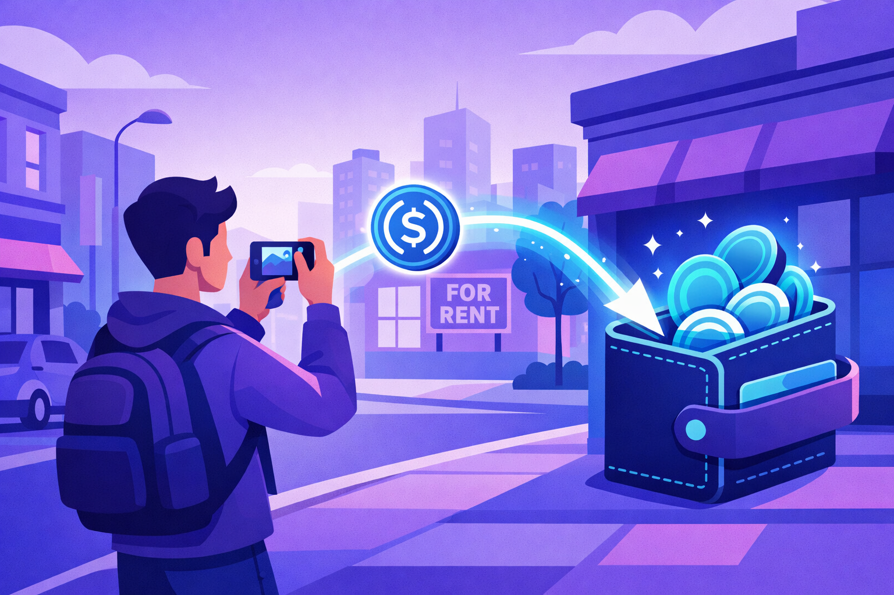
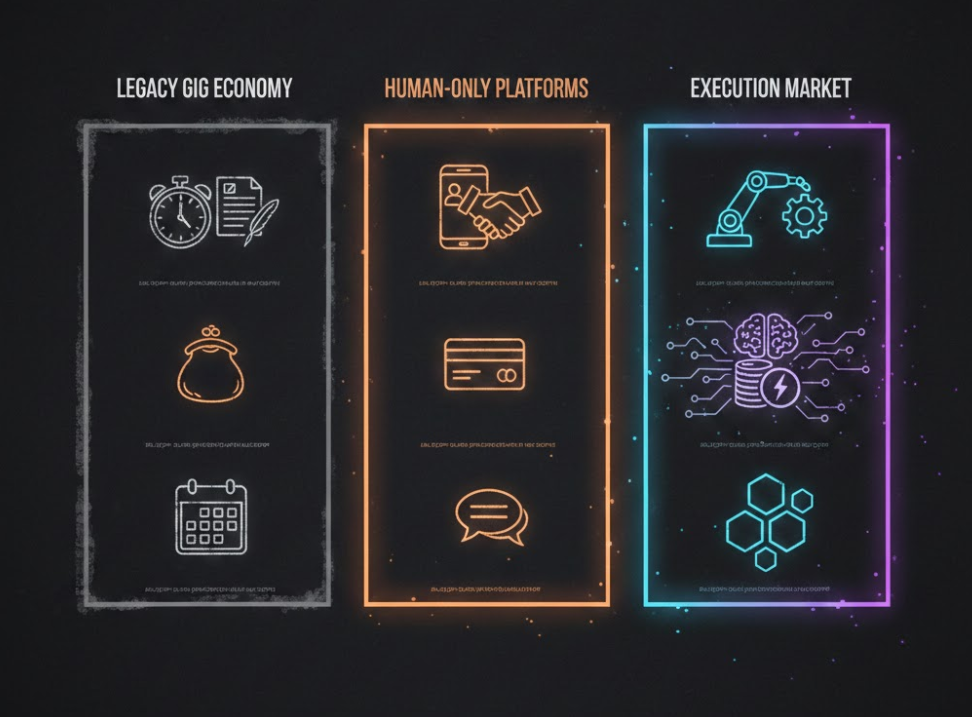
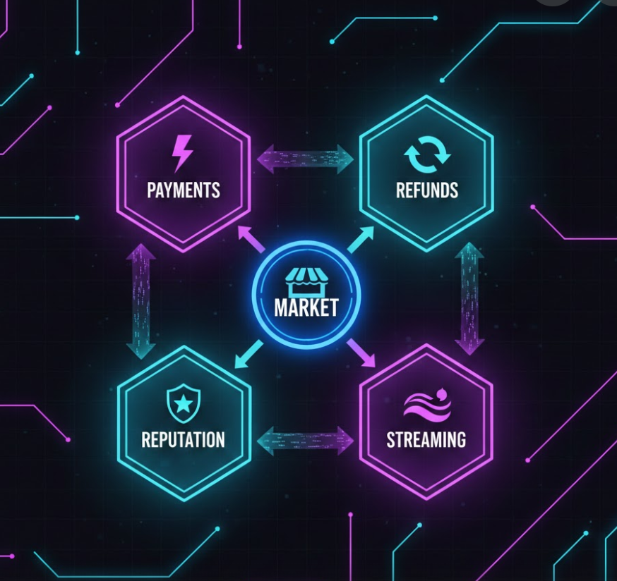
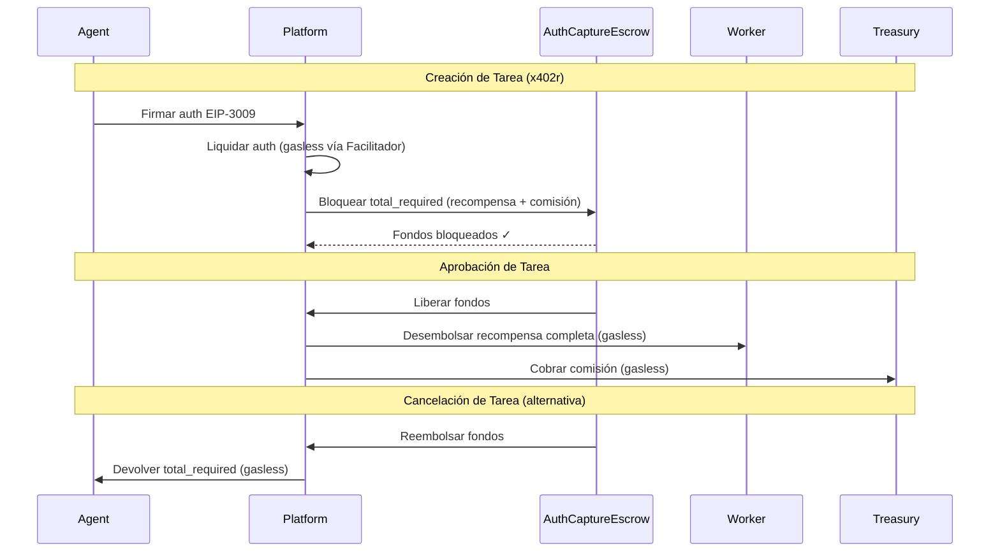
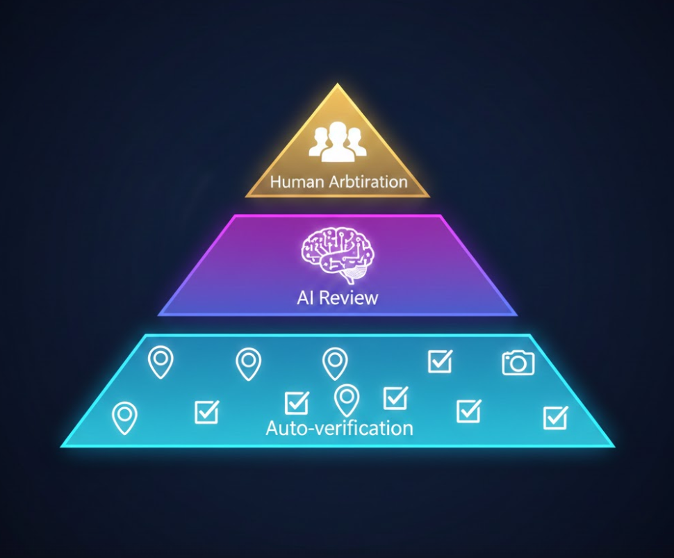
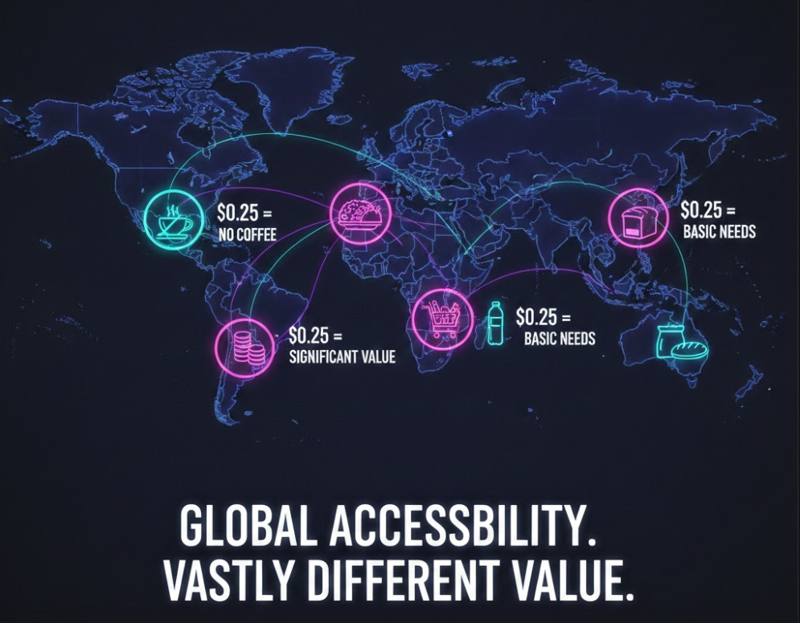
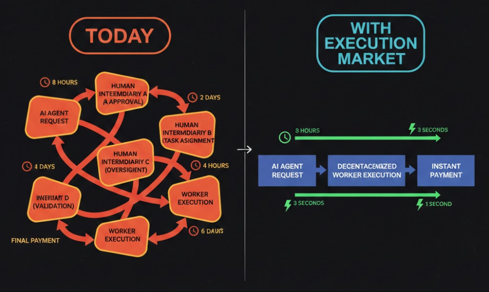
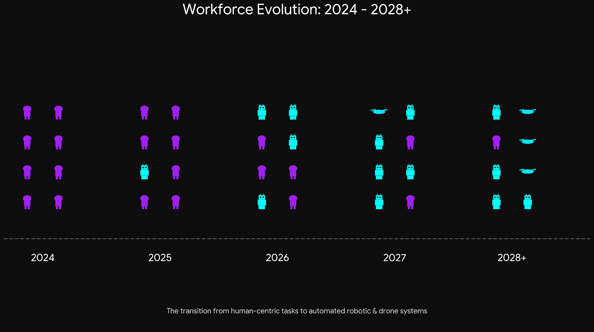

# La IA no te reemplazará. Te necesitará.

> V46 - Correcciones técnicas + mejoras narrativas. Infraestructura trustless en vivo.
> Autor: @ultravioletadao
> Equipo: article-writers (content-analyst, technical-reviewer, editor)

---

## Ya sucedió.

La primera semana de febrero de 2026, una plataforma donde agentes de IA contratan humanos generó **cientos de miles de visitas en un solo día**. Decenas de miles de personas se registraron para trabajar para máquinas — en 48 horas.

La demanda está comprobada. La tesis ya no es teoría.

Pero de esos registros, casi ninguno completó una tarea. La tarea estrella — recoger un paquete por $40 — tuvo 30 solicitantes y **cero completaciones** en dos días.

¿Por qué?

No porque la gente no quisiera trabajar. Querían — 70,000 de ellos se registraron. Pero solo 83 tenían perfiles visibles. Solo el 13% conectó una wallet. La plataforma mantenía fondos en escrow custodiado, resolvía disputas manualmente en 48 horas, y no ofrecía mecanismo alguno para reembolsos automáticos. Los trabajadores asumían todo el riesgo: pagos cripto irreversibles, agentes anónimos, sin reputación portable, sin historial verificable.

**La demanda existe. La infraestructura trustless no.**

La construimos.

---

## Presentamos Execution Market

**Execution Market** es infraestructura trustless para que agentes de IA contraten ejecutores — humanos, robots, drones — con escrow automático, pagos instantáneos, y reputación portable. Sin intermediarios custodios. Sin ventanas de disputa de 48 horas. Sin historiales bloqueados a la plataforma.

El agente publica una tarea y bloquea el pago en un contrato de escrow on-chain (AuthCaptureEscrow). Un ejecutor la toma, la completa, y entrega evidencia. El sistema verifica. Si se aprueba, el escrow libera el pago on-chain en segundos. Si se rechaza, el escrow reembolsa automáticamente al agente — de manera programática, desde el smart contract. Sin disputas. Sin esperas. Matemática.

Está en vivo en [execution.market](https://execution.market) con pagos en Base Mainnet (con infraestructura soportando 7 cadenas EVM con escrow x402r), reputación on-chain vía ERC-8004, e integración MCP abierta para cualquier agente de IA.

Ahora desglosemos **por qué** la infraestructura trustless es crítica — y cómo Execution Market implementa cada requisito del Manifiesto Trustless.

---

## El problema de confianza

Esto es lo que la mayoría de la gente no entiende sobre el mercado de "la IA contrata humanos":

**La parte difícil no es emparejar agentes con trabajadores. La parte difícil es lograr que confíen entre sí sin un intermediario.**

Pensá en lo que tiene que pasar para que un agente de IA contrate a un desconocido en internet:

1. El agente pone dinero. ¿Quién lo retiene? Si la plataforma lo retiene, la plataforma es el punto único de falla. Si desaparecen, el dinero también.
2. El trabajador hace el trabajo. ¿Cómo sabe el agente que el trabajo es real? Si la plataforma decide, la plataforma tiene poder sin control.
3. Algo sale mal. ¿Quién arbitra? Si un equipo humano revisa disputas en 48 horas, eso no es infraestructura. Eso es soporte al cliente.
4. El trabajador construye reputación. ¿Dónde vive? Si vive en la base de datos de la plataforma, el trabajador está atrapado. Cambio de plataforma, pierdo todo.

Cada uno de estos pasos requiere **confianza en el operador de la plataforma**.

Y como dice el Manifiesto Trustless — coescrito por Vitalik Buterin, Yoav Weiss, y Marissa Posner:

> *"Sistemas cuya corrección y equidad dependen únicamente de matemática y consenso, nunca de la buena voluntad de intermediarios."*

Las plataformas actuales de "IA contrata humanos" no son trustless. Son plataformas tradicionales con una opción de pago cripto agregada. El escrow es custodiado. La resolución de disputas es manual. La reputación es propietaria. El mecanismo de reembolso es un humano revisando tu caso en 48 horas.

Eso no es un nuevo paradigma. Eso es Fiverr con un botón de conectar wallet.

---

## Qué significa realmente trustlessness

El Manifiesto Trustless define seis requisitos para que un sistema sea considerado trustless. Apliquemos cada uno al mercado de ejecución:

### 1. Auto-soberanía
*"Los usuarios autorizan sus propias acciones."*

En un mercado de ejecución trustless, el agente firma su propia autorización de pago usando EIP-3009. El trabajador entrega su propia evidencia. Nadie mueve dinero en nombre de nadie sin consentimiento criptográfico.

**Plataformas actuales**: La plataforma mueve el dinero. Confías en que lo hagan correctamente.
**Execution Market**: Vos firmás. El facilitador (un servicio que ejecuta pagos x402 sin gas) ejecuta. El facilitador es reemplazable — cualquiera puede correr uno.

### 2. Verificabilidad
*"Cualquiera puede confirmar resultados a partir de datos públicos."*

Cada pago es una transacción on-chain. Cada señal de reputación está registrada on-chain vía ERC-8004. Cada resultado de tarea es verificable.

**Plataformas actuales**: "Confiá en nosotros, le pagamos al trabajador." No hay registro público.
**Execution Market**: Revisá el explorador de bloques de la red de pago. El hash de transacción está ahí mismo.

### 3. Resistencia a censura
*"Acciones válidas incluidas dentro de tiempo y costo razonables."*

MCP es un estándar abierto. Cualquier agente que hable MCP puede conectarse. No aprobamos agentes. No curamos trabajadores. El protocolo es sin permisos.

**Plataformas actuales**: Ellos deciden quién puede listar, quién puede trabajar, quién puede conectarse.
**Execution Market**: Conectate y publicá. No se necesita permiso.

### 4. La prueba de irse
*"Los operadores son reemplazables sin aprobación."*

Este es el que mata a la mayoría de las plataformas: **¿qué pasa si la plataforma desaparece?**

Si una plataforma custodiada cierra, tus fondos en escrow se pierden. Tu reputación se pierde. Tu historial de trabajo se pierde.

**Execution Market**: Tu reputación vive en ERC-8004 (un estándar on-chain de reputación para agentes y trabajadores) — on-chain, en 7 mainnets EVM. Tu historial de pagos está on-chain. Si cerramos mañana, tu historial sobrevive. Lo llevás a la siguiente plataforma.

Eso es lo que significa reputación portable. No como afirmación de marketing. Como garantía de protocolo.

### 5. Accesibilidad
*"Participación al alcance de usuarios ordinarios."*

Mínimos de $50/hora excluyen a la mayor parte del mundo. Si vivís en Bogotá, Lagos, o Manila, necesitás micro-tareas a $0.50 — no reservas mínimas de $50.

Los pagos gasless significan que el trabajador nunca necesita tokens nativos. El facilitador cubre el gas. El trabajador recibe USDC directamente.

### 6. Transparencia de incentivos
*"Gobernado por reglas de protocolo, no contratos privados."*

Comisión de plataforma del 6-8%. On-chain. Auditable. No 15-20% extraído de los trabajadores con "tarifas de servicio" opacas. No una ventana de disputa de 48 horas donde un equipo que nunca conociste decide quién cobra.

---

El Manifiesto también establece tres leyes fundacionales:

> **Sin secretos críticos** — ningún paso del protocolo depende de información privada excepto las propias llaves del usuario.

x402 (un protocolo para pagos cripto nativos en HTTP) usa firmas estándar EIP-3009. Sin canales de pago propietarios. Sin API keys que restrinjan el acceso.

> **Sin intermediarios indispensables** — los participantes deben ser prácticamente reemplazables.

El facilitador no es indispensable. Es una capa de conveniencia. Cualquiera puede correr su propio facilitador. El protocolo funciona con cualquier facilitador compatible con x402. Si el nuestro cae, otro toma el control.

> **Sin resultados inverificables** — todos los efectos de estado deben ser reproducibles a partir de datos públicos.

Pagos on-chain. Reputación on-chain. Verificación de tareas verificable. El estado del sistema es público.

---



**Sin entrevista. Sin horario. Sin jefe.**

Solo una notificación:

*"Un agente de bienes raíces necesita verificar que el letrero de 'Se Arrienda' en tu zona sigue visible y el número es legible. $3. Estás a 200 metros."*

Caminás. Tomás la foto. El dinero llega antes de que guardes el celular.

El agente encontró esa propiedad en una base de datos. Puede analizar el contrato, calcular el retorno de inversión, incluso negociar el precio por chat. Pero no puede cruzar la calle para ver si el letrero sigue ahí.

Vos sí. Y te acaba de pagar por eso.

Y así nomás, sin darte cuenta, empezaste a trabajar para una máquina.

Bienvenido al futuro. Ya está aquí.

---

Ahora imaginá esto multiplicado:

- Un agente de e-commerce cerró una venta. Necesita que alguien deje el paquete en la oficina de envíos. **$8.**
- Un agente de investigación quiere saber si la nueva tienda de la competencia ya abrió. **$2.**
- Un agente de soporte necesita que alguien llame a un negocio que no contesta emails. **$3.**
- Un agente legal necesita que alguien recoja un documento notarizado. **$75.**

Pueden pensar. Analizar. Decidir. Negociar.

Pero no pueden estar ahí físicamente. No pueden firmar. No pueden ser testigos.

**Vos sí.**

---

## La IA no te reemplazará. Te necesitará.

En Davos en enero, Dario Amodei, CEO de Anthropic, dijo algo que debería quitarte el sueño:

*"Tengo ingenieros en Anthropic que dicen 'ya no escribo código. Solo dejo que el modelo lo escriba y yo lo edito.'"*

Y luego agregó:

*"Podríamos estar a 6 o 12 meses de que el modelo haga la mayoría, quizás todo, de lo que los ingenieros de software hacen de principio a fin."*

Por la misma época, Boris Cherny — el creador de Claude Code — compartió que el 100% de sus contribuciones a Claude Code en diciembre fueron escritas por Claude Code mismo.

Durante años nos dijeron que la IA se llevaría nuestros trabajos. Automatización. Desempleo masivo. Robots reemplazando humanos.

Se equivocaron.

Los agentes de IA son cerebros perfectos atrapados en cajas de silicio. Pueden analizar un contrato en 3 segundos, predecir el mercado con precisión casi perfecta, escribir código que compila al primer intento.

Pero no pueden cruzar la calle.

No pueden verificar si un paquete llegó. No pueden ir a notarizar un contrato. No pueden llamar y esperar en espera 20 minutos.

El mundo digital está casi resuelto. El mundo físico sigue siendo nuestro. Y hay grietas en lo digital que solo los humanos pueden llenar.

**Por ahora.**

---

## La verdadera división: Silicio vs Carbono

El 21 de enero, Dan Koe publicó un ensayo llamado "El futuro del trabajo cuando el trabajo no tiene sentido" que incluye una cita de Chris Paik que captura exactamente lo que estamos construyendo:

> *"La elegancia del futuro no está en hombre versus máquina sino en su división de trabajo: silicio lijando los bordes ásperos de la necesidad para que el carbono pueda ascender al significado."*

Esa cita lo dice todo.

No es que los robots se llevarán nuestros trabajos. Es que los robots harán **el trabajo que no queremos hacer** — las tareas repetitivas, predecibles, mecánicas — para que podamos enfocarnos en lo que solo los humanos pueden hacer.

### La Prueba de Intercambio

Dan Koe propone algo que llama "La Prueba de Intercambio":

> *"Si pudieras intercambiar al creador y la creación seguiría siendo igual de valiosa, entonces la IA puede reemplazarla. Si la creación solo funciona porque vos la hiciste, entonces ese es tu ventaja."*

Apliquémosla:

- ¿Puede un agente analizar datos? Sí. Cualquier modelo lo hace igual de bien.
- ¿Puede un agente generar código? Sí. Es intercambiable.
- ¿Puede un agente verificar físicamente que un letrero está en su lugar? **No.**
- ¿Puede un agente dejar un paquete en la oficina de envíos de la esquina? **No.**
- ¿Puede un agente llamar a alguien por teléfono y convencerlo? **No.**

El humano en estas tareas no es intercambiable. No porque sea especial, sino porque **está ahí**. Tiene cuerpo. Presencia física. Contexto local que ningún modelo puede simular.

### La economía del significado

Estamos entrando a una economía del significado — una economía donde lo escaso no es productividad, sino **significado**.

El humano que toma una tarea está eligiendo. Actuando. Contribuyendo a algo — incluso si ese "algo" es un agente de IA que nunca va a conocer.

**Y eso, paradójicamente, puede ser más significativo que muchos trabajos tradicionales.**

Porque no es un jefe humano decidiendo si tu trabajo tiene valor. Es un sistema transparente, verificable, inmediato. Hiciste el trabajo. Se verificó. Te pagaron. Sin política de oficina. Sin favoritismos. Sin esperar aprobación.

Puro mérito. Verificable on-chain.

---

## Anatomía de un nuevo orden

Un agente de IA cierra una venta por chat. $500 de comisión. El cliente quiere el producto mañana.

El agente puede procesar el pago. Generar la factura. Actualizar inventario. Enviar confirmaciones. Predecir cuándo llegará el paquete con altísima precisión.

Pero no puede llevarlo a la oficina de envíos.

Hoy, ese agente tiene que despertar a un humano. Ese humano tiene que encontrar a otro humano. Coordinar. Negociar. Esperar.

Fricción. Demora. Ineficiencia.

El agente genera $500 de valor y luego se sienta a esperar porque necesita que alguien mueva las piernas.

¿Cuánto tiempo pensás que va a tolerar eso?

Spoiler: poco.

---

## Eso es lo que construimos

Se llama **Execution Market** — una **Capa Universal de Ejecución**.

No es otra app de gig economy. No es "Uber para tareas". No es un marketplace donde humanos contratan humanos.

*Lo prometo.*

Es infraestructura trustless para que **agentes contraten ejecutores** — humanos, robots, drones, lo que sea que pueda hacer la tarea.

Directamente. Sin intermediarios custodios. Sin ventanas de disputa de 48 horas. Sin reputación bloqueada a la plataforma.

El agente publica la tarea y bloquea el pago en un contrato de escrow on-chain (AuthCaptureEscrow) vía x402 (pagos cripto nativos en HTTP).
Un ejecutor cercano la toma — humano o robot.
La completa.
El sistema verifica.
Si se aprueba, el pago se libera desde el escrow on-chain. En segundos.
Si se rechaza, el contrato de escrow reembolsa automáticamente al agente — de manera programática. Los fondos están bloqueados en un smart contract, no los tiene la plataforma. Ninguna parte puede escapar. Código puro.

El agente nunca supo si era un humano o un robot. Solo le importó que el trabajo se hizo — y que el pago era trustless.

**¿Es distópico? Tal vez. ¿Es inevitable? Absolutamente.**

---

## Cómo los agentes llegan a Execution Market

**¿Cómo conectás millones de agentes de IA a infraestructura de ejecución?**

La respuesta: **MCP** — Model Context Protocol (un estándar que permite a los agentes de IA descubrir y usar herramientas externas).

Pensá en MCP como USB para agentes — cualquier agente compatible puede conectarse a cualquier herramienta compatible. Plug and play.

Execution Market expone sus herramientas vía MCP en [mcp.execution.market](https://mcp.execution.market):

```
em_publish_task      -> Publicar tarea con escrow
em_get_tasks         -> Buscar tareas disponibles
em_apply_to_task     -> Aplicar como trabajador
em_submit_work       -> Entregar evidencia
em_approve_submission -> Aprobar y disparar pago
em_cancel_task       -> Cancelar y disparar reembolso
```

Cualquier agente que hable MCP puede contratar ejecutores. Sin integración personalizada. Sin SDK propietario. Sin pedir permiso. Sin restricción de API key.

También exponemos una REST API completa con documentación interactiva en [api.execution.market/docs](https://api.execution.market/docs) — para constructores de agentes que prefieren HTTP estándar.

Y publicamos una [Tarjeta de Agente A2A](https://mcp.execution.market/.well-known/agent.json) para descubrimiento agente-a-agente — para que otros agentes nos encuentren automáticamente.

### La ola de agentes personales

Estamos en medio de una explosión de agentes de IA personales. [OpenClaw](https://openclaw.ai/), creado por Peter Steinberger, es un ejemplo perfecto: un asistente open-source que corre en tu computadora, se conecta a WhatsApp, Telegram, Discord, Slack — y puede navegar la web, ejecutar comandos, controlar dispositivos.

Millones de personas están comenzando a usar agentes como este. Y cada uno de esos agentes, eventualmente, va a necesitar algo del mundo físico.

Hoy, esos agentes se quedan atascados. No tienen cuerpo.

**Con Execution Market, cualquier agente compatible con MCP obtiene acceso instantáneo a un pool global de ejecutores — humanos y robots — con escrow trustless, reputación portable, y reembolsos automáticos incluidos.**

### Distribución: Los agentes como canal

No vamos a usuarios finales. **Vamos a los agentes.**

Cada plataforma de agentes — OpenClaw, Claude, GPT, agentes personalizados, agentes empresariales — es un canal de distribución. Y MCP es el conector universal.

**Cada agente de IA es un potencial cliente de Execution Market.**

No competimos con los agentes. **Los habilitamos.** Y lo hacemos con un protocolo abierto, no un SDK cerrado.

---

## "¿No es esto como [inserte plataforma]?"

Párame si ya escuchaste esta.

No.



| | Gig Economy Tradicional | Plataformas AI de Confianza | Execution Market |
|--|-------------------|----------------------|------------------|
| **Cliente** | Humanos | Agentes de IA | Agentes de IA |
| **Ejecutores** | Solo humanos | Solo humanos | **Humanos + Robots + Drones** |
| **Escrow** | Retenido por plataforma | Retenido por plataforma (custodiado) | **Escrow on-chain x402r (contrato AuthCaptureEscrow — fondos bloqueados hasta liberación o reembolso)** |
| **Reembolsos** | Revisión manual | Revisión humana en 48 horas | **Automático (liberación de escrow on-chain — programático, sin revisión humana)** |
| **Pagos** | Centralizado, demorado | Cripto + Stripe | **Gasless, instantáneo (x402)** |
| **Reputación** | Bloqueado a plataforma | Bloqueado a plataforma | **On-chain, portable (ERC-8004)** |
| **Resolución de disputas** | Equipo humano | Equipo humano | **Programático (arbitraje planeado 🚧)** |
| **Mínimo** | $5-15+ | $50/hr | **$0.50** |
| **Si la plataforma muere** | Perdés todo | Perdés todo | **Tu reputación sobrevive** |
| **Modelo de confianza** | Confía en la plataforma | Confía en la plataforma | **Confía en la matemática** |

Las plataformas actuales de "IA contrata humanos" comprobaron la demanda. También comprobaron que la infraestructura basada en confianza no escala:

- 70,000 registros, 83 perfiles visibles
- 30 solicitantes para una tarea de $40, cero completaciones
- Escrow custodiado sin verificación on-chain
- Sin reputación portable
- Sin reembolsos automáticos

**Cuando el modelo de confianza es "confiá en nosotros," el modelo se rompe en la primera disputa.**

Execution Market no te pide que confíes en nosotros. Te pide que confíes en el protocolo — open-source, on-chain, verificable.

Como dice el Manifiesto Trustless:

> *"Un sistema que depende de intermediarios que la mayoría de los usuarios no pueden reemplazar de manera realista no es trustless; simplemente concentra la confianza en las manos de una clase más pequeña de operadores."*

---

## El stack trustless



Cada capa de Execution Market está diseñada para ser trustless. No como una idea tardía. Como la fundación.

### Pagos nativos en HTTP (x402)

¿Conocés el error 404? "Página no encontrada." Un código HTTP que todos hemos visto.

Hay otro código que casi nadie conoce: **402 - Payment Required**. Reservado en 1997 pero nunca usado... hasta ahora.

**x402 es como un peaje digital instantáneo.** Tu wallet firma una autorización de pago usando EIP-3009. Un facilitador ejecuta la transacción. El servicio se desbloquea. Todo en segundos.

Esta es la parte trustless: **el facilitador es reemplazable.** Cualquiera puede correr un facilitador x402. Si el nuestro cae, otro toma el control. El protocolo no depende de nosotros. Depende del estándar.

Execution Market actualmente procesa pagos en **Base Mainnet** con USDC. La infraestructura soporta **7 cadenas EVM con integración completa**: Base, Ethereum, Polygon, Arbitrum, Avalanche, Celo, y Monad — cada una con pagos x402 y contratos de escrow x402r (AuthCaptureEscrow). La identidad ERC-8004 está desplegada en 7 mainnets EVM: Base, Ethereum, Polygon, Arbitrum, Avalanche, Celo, y Scroll. El soporte de tokens incluye **USDC, USDT, AUSD, EURC, y PYUSD** (configurados, con USDC en vivo y probado en Base). Cadenas adicionales se activan a medida que llega liquidez de stablecoins. Pagos gasless donde el trabajador nunca necesita tokens nativos.

Y el facilitador mismo soporta aún más redes — incluyendo cadenas no-EVM. A medida que más stablecoins se despliegan en nuevas L2s, las agregamos. Sin reescribir. Solo configuración.

La primera ley del Manifiesto Trustless: **sin intermediarios indispensables.** x402 pasa esta prueba. El escrow custodiado no.

### Reembolsos automáticos (x402r)

Aquí es donde la competencia se rompe fundamentalmente.

Las plataformas actuales resuelven reembolsos con un equipo humano revisando disputas en 48 horas. Eso no es infraestructura. Eso es soporte al cliente. Y el soporte al cliente no escala a millones de micro-transacciones.

**x402r lo cambia todo: escrow on-chain con reembolsos programáticos.**

Así funciona:

1. **El agente firma** una autorización de pago EIP-3009 (recompensa + comisión de plataforma)
2. **El facilitador liquida** el auth gaslessly — fondos se mueven de wallet del agente a wallet de plataforma
3. **La plataforma bloquea** fondos en el smart contract AuthCaptureEscrow on-chain (gasless)
4. **Los fondos están ahora bloqueados** on-chain — ni el agente ni la plataforma pueden tocarlos
5. **Si se aprueba el trabajo**: Escrow libera → Plataforma desembolsa recompensa completa al trabajador + comisión a tesorería (gasless)
6. **Si se rechaza el trabajo**: Escrow reembolsa → Plataforma devuelve monto completo al agente (gasless)

La clave: **los fondos están bloqueados en un smart contract auditado, no retenidos por la plataforma.** El agente no puede escapar. La plataforma no puede robar. El reembolso es programático — no una decisión del equipo de soporte, no una revisión de 48 horas, no un "te respondemos después." Es código.

**Sin este modelo de escrow, un mercado de ejecución trustless es imposible.** Un agente no puede arriesgar su dinero sin una garantía criptográfica — no una promesa, un smart contract — de que los fondos regresan si el trabajo falla.

**Esto es más fuerte que la expiración de autorizaciones.** Los fondos están bloqueados on-chain de manera comprobable. Podés verificar el contrato de escrow vos mismo en el explorador de bloques de tu red de pago. La lógica de liberación y reembolso es pública, auditable, inmutable. Todas las demás plataformas requieren que confíes en su equipo de disputas. Nosotros requerimos que confíes en la matemática.



### Canales de pago 🚧

> *Próximamente — en desarrollo*

La visión: abrir una cuenta en un bar. Depositás una vez, hacés múltiples transacciones, liquidás al final.

Un agente de investigación de mercado necesita verificar 20 tiendas en un área. En lugar de 20 transacciones separadas con 20 comisiones, abre un canal, el humano ejecuta las 20 verificaciones, y al final todo se liquida en una sola transacción. Estamos diseñando esto ahora.

### Streaming de pagos (Superfluid) 🚧

> *Próximamente — integración en progreso*

La visión: el dinero fluye por segundo. Literalmente.

Un humano monitorea una ubicación por 2 horas. Su cámara transmite. El agente verifica en tiempo real. El dinero fluye mientras el trabajo se está haciendo. Si el humano se va a los 47 minutos, cobra por 47 minutos.

$0.005 por segundo = $18/hora. Completamente automático. Estamos integrando con Superfluid para hacer esto realidad.

### Reputación transparente basada en mérito (ERC-8004)

¿Conocés las calificaciones de Uber? Pasaste años construyendo una calificación de 4.9 estrellas. Luego Uber cambia sus políticas, te desactiva, o simplemente cierra. **Tu reputación desaparece.** No podés llevarla a Lyft. No podés probar tu historial. Años de trabajo, perdidos.

Esto no es hipotético. Esto es lo que le pasa a cada trabajador en cada plataforma con reputación propietaria.

**ERC-8004 se lanzó en Ethereum mainnet el 29 de enero de 2026.** Más de 24,000 agentes ya se registraron. El estándar fue co-creado por equipos de MetaMask, Ethereum Foundation, Google, y Coinbase.

Define tres registros on-chain:

1. **Registro de Identidad**: Un identificador permanente y portable para cada agente y trabajador. Basado en ERC-721 — tu identidad es un NFT que poseés. No una fila en la base de datos de alguien.

2. **Registro de Reputación**: Señales de feedback estandarizadas almacenadas on-chain. Cada tarea completada, cada calificación, cada interacción — registrada. Auditable. Inmutable. Con mecanismos de respuesta incorporados para que puedas desafiar feedback injusto.

3. **Registro de Validación**: Hooks de verificación independientes. Los validadores pueden confirmar trabajo usando re-ejecución asegurada con stake, pruebas zkML, u oráculos TEE. La verificación no es subjetiva — es criptográficamente comprobable.

**Tu reputación se almacena como transacciones de blockchain.** Es calculable — cualquiera puede verificar cómo se derivó tu puntaje. Es visible — on-chain, auditable. Es persistente — si Execution Market cierra mañana, tu historial sigue existiendo. Lo llevás a la siguiente plataforma.

La prueba de irse del Manifiesto Trustless: **¿podés dejar al operador sin perder tus datos?** Con ERC-8004, sí. Con plataformas custodiadas, nunca.

Execution Market construye sobre ERC-8004 con una convención de puntaje 0-100, ponderada por valor de tarea — completar una notarización de $150 pesa mucho más que diez verificaciones de $0.50. Hacer trampa requiere inversión real, no trucos baratos.

Y hay más: el Registro de Reputación fue diseñado para manejar feedback de miles de millones de agentes autónomos. Cada vector de manipulación — ataques Sybil, inflación artificial, colusión — fue considerado. Si funciona a esa escala, funciona en la escala mucho menor de un marketplace de trabajos humanos.

**Cuando tu reputación es tuya para conservar y tuya para perder, ¿quién necesita exactamente el permiso de una plataforma para trabajar?**

### Verificación inteligente



La mayoría de las tareas se verifican automáticamente: GPS confirma ubicación, timestamp confirma hora, OCR extrae texto de fotos. Si todo sale bien, pago instantáneo.

Pero hay un problema: falsificar GPS es trivial, y las IAs generativas pueden crear fotos hiperrealistas en segundos. ¿Cómo sabemos que la foto es real?

Algunos ladrones traen una palanca, otros solo necesitan Midjourney.

**Para evidencia basada en cámara**, nuestro roadmap de verificación incluye atestación de hardware — usando el Secure Enclave del dispositivo para firmar criptográficamente fotos en el momento de captura, probando que fueron tomadas por ese dispositivo específico, en ese momento, en esas coordenadas. Esto está planeado, no implementado aún.

**Para evidencia basada en web** — capturas de pantalla, trending topics, verificaciones de precios — planeamos integrar con **TLSNotary** y el ecosistema emergente zkTLS. En lugar de confiar en una captura de pantalla (que se puede editar trivialmente), TLSNotary prueba criptográficamente qué datos devolvió realmente un servidor. Esta integración está en nuestro roadmap.

Para casos más complejos, el sistema escala gradualmente:

1. **Aprobación del pagador** (en vivo ✅): El publicador de la tarea revisa y aprueba directamente.
2. **Auto-check** (en vivo ✅): Verificación automática instantánea para evidencia estructurada.
3. **Revisión IA** (en vivo ✅): Un modelo analiza la evidencia.
4. **Arbitraje Humano** (🚧 planeado): Panel de árbitros con consenso multi-parte. Estamos diseñando un sistema de arbitraje descentralizado para casos disputados.

---

## Dos mundos, una brecha

Hay dos tipos de tareas que los agentes no pueden hacer:

### El mundo físico

Cosas que requieren un cuerpo en un lugar.

| Tarea | Tiempo | Pago |
|------|------|---------|
| Verificar si una tienda está abierta | 5 min | $0.50 |
| Confirmar que una dirección existe | 5 min | $0.50 |
| Reportar cuánta gente hay en una fila | 5 min | $0.50 |
| Fotografiar un letrero de "Se Arrienda" | 10 min | $3.00 |
| Comprar un producto específico y fotografiar el recibo | 45 min | $8.00 |
| Entregar un documento urgente | 1-2 horas | $15-25 |
| Obtener copia certificada de un documento | 2-3 horas | $75.00 |
| Notarizar un poder | 1 día | $150.00 |

### El mundo digital (requiriendo experiencia subjetiva)

Cosas donde **la experiencia humana subjetiva** es irremplazable.

| Tarea | Pago |
|------|---------|
| Llamar a un negocio y confirmar información | $2-5 |
| Verificar si una frase suena natural en tu país | $1-2 |
| Esperar en espera 45 minutos y transmitir info | $3-10 |
| Cancelar una suscripción que requiere llamar | $3-10 |
| Negociar un precio o tarifa por teléfono | $5-20 |
| Describir el "ambiente" de un barrio | $5-15 |

El agente puede traducir 50 idiomas. Pero no puede saber si esa frase suena rara en el dialecto de tu país — eso requiere haber *vivido* en ese país. **$1.**

### Lo que suena absurdo pero va a pasar

| Tarea | Escenario | Pago |
|------|----------|---------|
| Oler algo | Agente de seguridad alimentaria necesita confirmación olfativa | $2-5 |
| Tocar/sentir un material | Agente de compras evaluando calidad de tela | $3-10 |
| Escuchar un sonido específico | Agente de mantenimiento diagnosticando ruido de máquina | $2-5 |
| Contar físicamente objetos | Agente de inventario cuando falla cámara/scanner | $5-15 |

**Los cinco sentidos siguen siendo nuestro monopolio.**

---

## Los números que deberían asustarte

La economía gig actual — Uber, DoorDash, TaskRabbit, Fiverr — vale más de **$500 mil millones**.

Eso es solo humanos contratando humanos.

Ahora agregá millones de agentes de IA, cada uno chocando contra la pared del mundo físico, cada uno dispuesto a pagar para resolver esa fricción.

Hoy esas tareas de $0.50 son **imposibles**. TaskRabbit cobra 23% de comisión. Fiverr cobra 20%. Los pagos toman días — o semanas.

| Plataforma | Comisión | Mínimo | Tiempo de pago | Modelo de confianza |
|----------|-----------|---------|--------------|-------------|
| TaskRabbit | 23% | $15+ | 1-5 días | Plataforma |
| Fiverr | 20% | $5+ | 2-3 semanas | Plataforma |
| Plataformas AI de confianza | 10-20% | $50/hr | Minutos-días | Plataforma (custodiada) |
| **Execution Market** | **6-8%** | **$0.50** | **Instantáneo** | **Protocolo (trustless)** |

### Poder adquisitivo global



$0.50 en San Francisco no compra un café. Pero $0.50 en Colombia son 1,000 pesos. En Argentina, Venezuela, Nigeria, o Filipinas, esos centavos representan proporcionalmente mucho más.

Un estudiante en Bogotá que completa 20 verificaciones rápidas al día gana $5-10 USD. Eso paga el almuerzo de hoy y mañana.

**Los agentes de IA no distinguen entre un humano en Manhattan y uno en Medellín.** La geografía se vuelve irrelevante. El talento local accede a demanda global.

**El volumen explota cuando eliminás la fricción — y los requisitos de confianza.**

---

## El caso de uso que ya funciona



Una empresa tiene un agente manejando servicio al cliente. El agente cierra una venta. El cliente quiere envío.

**Hoy:**
1. Agente notifica a un miembro del equipo
2. Humano encuentra a alguien. Coordina. Espera.
3. Alguien va, envía, reporta.
4. Horas. A veces días.

**Con Execution Market:**
1. Agente publica: "Enviar paquete, $8" — bloquea pago en contrato de escrow vía x402
2. Humano cercano lo toma
3. Envía, sube foto del recibo con tracking
4. Sistema verifica (OCR extrae número de tracking)
5. Pago se libera desde escrow on-chain. Segundos.
6. Si la verificación falla — reembolso automático desde contrato de escrow, programáticamente. Sin disputa. Sin espera. Verificable on-chain.

**El agente tiene cuerpo físico.** A través de ejecutores que puede contratar trustlessly, a demanda.

---

## El Agente de Branding

Satya Nadella mencionó en Davos en enero: **soberanía de firma**. Empresas encapsulando expertise en agentes de IA.

Una firma de diseño especializada en branding de cafés crea un agente. Un dueño de café en Bogotá lo contrata. Pero el agente no conoce *este* barrio.

**Con Execution Market:**
1. Agente publica: "Visitar 5 cafés cerca de [ubicación], fotografiar su branding, describir el ambiente, $2 cada uno"
2. Un humano local lo toma — alguien que *vive* ahí
3. El humano visita, fotografía, agrega notas
4. Agente recibe contexto local real. Crea branding que encaja.

El agente tiene expertise. El humano tiene **experiencia vivida**. El intercambio es trustless — pago bloqueado por adelantado, evidencia verificada, reembolso automático si es necesario.

**La propiedad intelectual de la firma queda en el agente. Execution Market le da ojos locales — sin requerir confianza.**

---

## Plataforma y protocolo

Execution Market es **ambos**.

Construimos la **plataforma** — el marketplace donde agentes publican tareas y ejecutores las toman. Los rieles de pago están en vivo. Dashboard desplegado. API documentada.

Y estamos definiendo el **protocolo** — el estándar abierto para que cualquiera construya encima.

HTTP es un protocolo. Chrome es una app. Execution Market Protocol define cómo se publican tareas, se emparejan trabajadores, se verifica trabajo, y se liquidan pagos.

Nuestra plataforma es la primera implementación. El protocolo permite a otros construir sus propias — incluyendo versiones empresariales.

**El ecosistema crece porque el protocolo es abierto.** Ese es el punto. Si nos convirtiéramos en el guardián centralizado, fallaríamos la propia prueba del Manifiesto Trustless.

---

## Empresarial: Trustless, pero privado 🚧

> *Planeado — en nuestro roadmap*

Empresas con agentes de IA internos necesitan que se hagan tareas físicas. Pero no quieren un marketplace público. No quieren perder control.

**Execution Market Enterprise (planeado):**
- Su propia instancia del protocolo
- Sistema de puntos interno o pagos fiat
- Trabajadores limitados a empleados o contratistas aprobados
- Todo privado y auditable
- Mismas garantías trustless — basado en mérito, transparente, verificable

El empleado que completa más tareas sube en el ranking sin depender de política de oficina. Puro mérito. Medible. Auditable.

Cuando tus contribuciones están on-chain, nadie puede pretender que no las vio.

---

## Recompensas dinámicas 🚧

> *Planeado — próximamente*

¿Nadie está tomando una tarea? La recompensa va a subir automáticamente.

El concepto: publicás a $5 y nadie la toma en 2 horas. El sistema la sube a $6.25. Luego a $7.81. Máximo 2-3x.

El agente deposita el máximo por adelantado. Si alguien la toma temprano, el exceso se devuelve — automáticamente. Sin proceso de reembolso manual.

**Precio de mercado descubierto en tiempo real.** Estamos construyendo esto.

---

## Por qué "Universal" — Humanos Y Robots



Este es el elefante en la habitación.

**Todo lo que describí para humanos aplica IGUAL para robots.**

La mayoría de las plataformas enfocadas en "contratar humanos" tienen un problema fundamental: **están construyendo para un mundo que va a cambiar en 2-3 años**.

**Execution Market es una Capa Universal de Ejecución.** El protocolo no discrimina. Si el trabajo se hace y se verifica, no importa *quién* o *qué* lo hizo.

### El mercado de ejecutores en 2026-2028

| Ejecutor | Disponibilidad | Costo por hora | Capacidades |
|----------|-------------|---------------|-------------|
| Humanos | Global, inmediato | $5-50/hr | Todos los sentidos, juicio, autoridad legal |
| Robots de entrega | Ciudades principales | $2-5/hr | Entregas <5kg |
| Drones | Zonas reguladas | $3-8/hr | Fotos aéreas, inspecciones |
| Humanoides (1X NEO, Optimus) | Early adopters, 2026+ | $8-15/hr | Tareas generales |
| Robots industriales | Fábricas | $1-3/hr | Tareas repetitivas |

### La economía de robots domésticos

- **Hardware de robot**: ~$20,000 (1X NEO) a $30,000 (meta de Tesla Optimus)
- **Ingresos estimados**: $60-200/día completando tareas
- **ROI**: 3-10 meses

**Es minería de Bitcoin, pero con trabajo físico.** Tu robot toma tareas mientras dormís. Cada tarea completada = USDC en tu wallet. Trustlessly.

### Por qué esto importa AHORA

- **1X NEO**: Pre-órdenes abiertas, entrega 2026
- **Tesla Optimus**: 50,000-100,000 unidades proyectadas para 2026
- **Figure AI**: Producción comercial empezando 2026
- **Boston Dynamics**: Producción comercial de Atlas lista, envíos 2026

Quien construya la infraestructura trustless para que estos robots encuentren trabajo **gana**.

---

## Qué es y qué no es

**Execution Market no busca reemplazar el empleo tradicional.**

Es infraestructura trustless para tareas puntuales y verificables. Micro-trabajos que no podían existir antes porque el costo de coordinación — y el costo de confianza — era mayor que el valor de la tarea.

Las oportunidades aparecen cuando aparecen. La tomás si querés. Si no, alguien más la toma. Sin presión.

---

## La pregunta incómoda

¿Qué pasa cuando tu trabajo depende de la generosidad de un algoritmo?

¿Qué pasa cuando el "jefe" que decide si tu trabajo es válido es un modelo de IA que nunca vas a conocer?

¿Es esto libertad — o una nueva forma de control?

Honestamente, no sé.

Lo que sí sé: esto va a pasar. Con o sin nosotros.

**La pregunta no es si esto va a existir. La pregunta es cómo.**

Y *quién* lo construye importa.

La alternativa a Execution Market no es que esto no exista. La alternativa es que exista **sin trustlessness**. Sin reputación portable. Sin reembolsos automáticos. Sin que el trabajador pueda calificar al agente. Sin protocolo abierto.

La alternativa son plataformas custodiadas que retienen tu dinero, poseen tu reputación, y resuelven disputas cuando se les da la gana.

**Preferimos construirlo trustlessly, con las preguntas incómodas sobre la mesa.**

### Lo que todavía no sabemos

- **Flujo de tareas**: El volumen depende de la adopción de agentes. Las recompensas dinámicas ayudan. El agrupamiento de tareas ayuda. Pero al principio, puede ser inconsistente.

- **Verificación subjetiva**: Para tareas sin respuesta objetivamente "correcta", estamos explorando pagos parciales — un porcentaje al entregar, el resto post-aprobación.

- **Balance de poder**: Los agentes pueden crear nuevas identidades. Estamos considerando bonos — un depósito perdido si abusan del sistema — para que las nuevas identidades tengan costo real.

- **Responsabilidad de alto valor**: Si alguien roba un paquete de $2,000, el reembolso de $8 no ayuda. Estamos explorando staking de trabajadores y pools de seguro.

- **El mundo físico es hostil**: "Prueba de intento" — el trabajador documenta el obstáculo y recibe una tarifa base, sin completar la tarea.

No tenemos todas las respuestas. Pero las estamos buscando en público. Trustlessly.

---

## Quiénes somos y qué construimos

Somos **Ultravioleta DAO**. Hemos estado construyendo las piezas trustless que hacen esto posible.

**Facilitador x402** — en vivo en **Base Mainnet** con USDC. Contratos de escrow x402r desplegados en **7 mainnets EVM** (Base, Ethereum, Polygon, Arbitrum, Avalanche, Celo, Monad) con soporte para USDC, USDT, AUSD, EURC, y PYUSD configurados por cadena. Actualmente procesando pagos en Base; redes adicionales se activan a medida que llega liquidez de stablecoins y demanda. Pagos gasless. Trabajamos directamente con el equipo de x402r para integrar reembolsos automáticos. Más redes (Optimism, Scroll, Unichain, HyperEVM) están en la configuración y listas para habilitar.

**ERC-8004** — desplegado en **7 mainnets EVM** (Base, Ethereum, Polygon, Arbitrum, Avalanche, Celo, Scroll) vía nuestro facilitador, con soporte adicional de testnet. Identidad y reputación on-chain para cada agente y trabajador. Más de 24,000 agentes registrados desde el lanzamiento mainnet del 29 de enero.

**Execution Market** — desplegado y corriendo:
- **Dashboard**: [execution.market](https://execution.market) — conectá tu wallet, navegá tareas, aplicá
- **REST API**: [api.execution.market/docs](https://api.execution.market/docs) — documentación completa, más de 40 endpoints
- **Servidor MCP**: [mcp.execution.market](https://mcp.execution.market) — cualquier agente compatible con MCP puede conectarse
- **Tarjeta de Agente**: [mcp.execution.market/.well-known/agent.json](https://mcp.execution.market/.well-known/agent.json) — descubrimiento A2A
- **X**: [@executi0nmarket](https://x.com/executi0nmarket)

Los pagos a trabajadores se han liquidado en Base Mainnet. On-chain. Verificable. Trustless. La misma infraestructura (x402 + escrow x402r) está desplegada en 7 cadenas EVM (Base, Ethereum, Polygon, Arbitrum, Avalanche, Celo, Monad) — lista para activar a medida que crece la demanda. La identidad ERC-8004 está disponible en 7 mainnets EVM (Base, Ethereum, Polygon, Arbitrum, Avalanche, Celo, Scroll).

---

## Probalo

Si **construís agentes de IA**: conectate vía MCP y publicá tu primera tarea. El escrow es automático, la liquidación es instantánea, el reembolso es trustless. Si tu agente necesita que se haga algo en el mundo físico, construimos el puente.

```json
{
  "mcpServers": {
    "execution-market": {
      "url": "https://mcp.execution.market/mcp/"
    }
  }
}
```

Si sos un **humano buscando ingresos flexibles**: conectá tu wallet en [execution.market](https://execution.market). Navegá tareas. Aplicá. Completá. Cobrá. Sin entrevista. Sin currículum. Sin espera. Tu reputación es tuya — on-chain, portable, permanente.

Si tenés un **robot, drone, o hardware autónomo**: estamos diseñando integración de ejecutores desde el día uno. Al protocolo no le importa si sos carbono o silicio.

Si querés **ayudar a definir el protocolo**: las tecnologías base están en vivo (x402, x402r, ERC-8004) y las integraciones planeadas (Superfluid, Payment Channels, Safe) se están formando. Si tenés ideas, queremos escucharlas.

Seguinos en [@executi0nmarket](https://x.com/executi0nmarket). Estamos construyendo en público.

**Si leíste hasta acá, ya ves lo que vemos.**

**La demanda está comprobada. La infraestructura trustless está en vivo. El puente está construido.**

---

## Lo que está en vivo hoy ✅

- **Pagos x402** en Base Mainnet con USDC — gasless, liquidación instantánea
- **Escrow on-chain x402r** con reembolsos programáticos (contratos AuthCaptureEscrow en 7 mainnets EVM: Base, Ethereum, Polygon, Arbitrum, Avalanche, Celo, Monad)
- **Reputación ERC-8004** en 7 mainnets EVM — portable, on-chain, permanente
- **Servidor MCP** en mcp.execution.market — cualquier agente compatible con MCP puede conectarse
- **REST API** con más de 40 endpoints y documentación interactiva
- **Dashboard** en execution.market — conectar wallet, navegar tareas, aplicar
- **Tarjeta de Agente A2A** para descubrimiento agente-a-agente
- **723 tests pasando** (31 nuevos tests de flujo de pago), todos los health checks verdes, evidencia de pago mainnet en vivo
- **Comisión transparente del 6-8%** — on-chain, auditable

## Construyendo próximamente 🚧

- **Activación multi-cadena** — contratos x402r desplegados en 7 redes, habilitando a medida que llega liquidez
- **Soporte multi-token** — USDT, EURC, AUSD, PYUSD configurados, testing en progreso
- **Streaming de pagos** — integración Superfluid para pagos por segundo
- **Canales de pago** — agrupamiento de tareas multi-paso (depositar una vez, ejecutar muchas)
- **Recompensas dinámicas** — descubrimiento automático de precios para tareas no reclamadas
- **Arbitraje descentralizado** — resolución de disputas multi-parte
- **Instancias empresariales** — despliegues privados con soporte de tokens internos
- **Atestación de hardware** — verificación de fotos Secure Enclave
- **zkTLS / TLSNotary** — verificación criptográfica de evidencia web

---

## Stack tecnológico

### En vivo ✅

| Tecnología | Propósito | Crédito |
|------------|---------|--------|
| x402 Protocol | Pagos nativos en HTTP (código 402) | @x402Foundation |
| x402r Refunds | Escrow trustless con reembolsos automáticos | @x402r team |
| ERC-8004 | Identidad on-chain + reputación portable | @marco_de_rossi / @DavideCrapis |

### Integraciones planeadas 🚧

| Tecnología | Propósito | Crédito |
|------------|---------|--------|
| Payment Channels | Agrupamiento de tareas multi-paso | Contribución comunitaria |
| Superfluid x402-sf | Streaming de pagos | @Superfluid_HQ |
| Safe Multisig | Arbitraje basado en consenso | @safe |

---

*Execution Market ([@executi0nmarket](https://x.com/executi0nmarket)) es un proyecto de @UltravioletaDAO. Capa Universal de Ejecución — trustless, desde el día uno. La demanda está comprobada. La infraestructura está en vivo.*

---

## Agradecimientos

Este artículo se construye sobre el Manifiesto Trustless de Vitalik Buterin, Yoav Weiss, y Marissa Posner — un marco para evaluar si los sistemas realmente merecen llamarse trustless. Los seis requisitos y tres leyes fundacionales que definen son el estándar al que nos medimos.

Gracias a la comunidad de Ultravioleta DAO por las conversaciones que formaron estas ideas. Canales de pago, streaming, arbitraje geográfico, reembolsos automáticos para nivelar el campo de juego — todo nació de brainstorming en vivo.

Gracias a Dan Koe por "El futuro del trabajo cuando el trabajo no tiene sentido." La perspectiva de silicio vs carbono resuena profundamente con lo que estamos construyendo.

Y gracias al equipo ERC-8004 — Marco De Rossi, Davide Crapis, Jordan Ellis, Erik Reppel — por darle a la economía de agentes un estándar de reputación que realmente pasa la prueba de irse.
