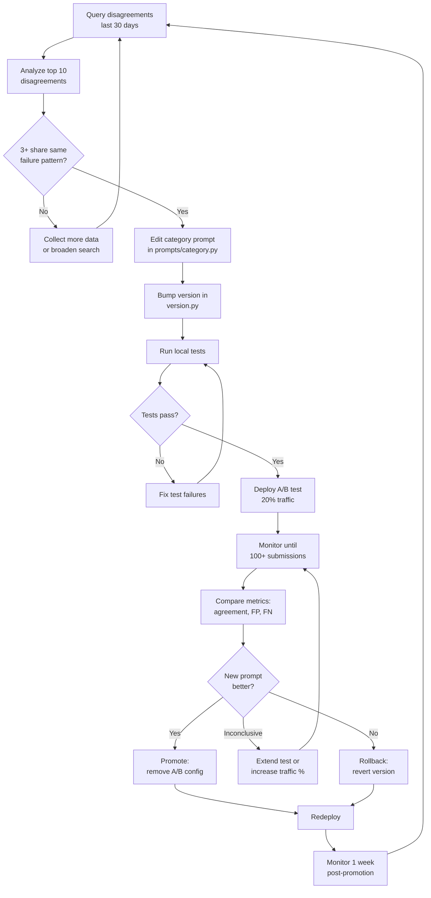

# Verification Prompt Iteration Guide

A step-by-step runbook for iterating on PHOTINT verification prompts using production data. Follow this guide to analyze prompt performance, identify weaknesses, create improved prompts, and deploy them safely.

## 1. Overview

The PHOTINT verification system uses AI vision models to decide whether submitted evidence proves a worker completed a task. The quality of those decisions depends entirely on the prompts sent to the models.

A 5% improvement in accuracy has direct financial impact:

- **Fewer false approvals** -- fraudulent evidence gets through, and agents lose money. Every false positive is a payment that should not have happened.
- **Fewer false rejections** -- legitimate workers get blocked, creating friction and driving them off the platform. Every false negative is a frustrated worker who may not come back.

Every verification inference is logged to the `verification_inferences` table with the full prompt text, model response, parsed decision, cost, latency, and -- critically -- whether the publishing agent agreed with the AI decision. This feedback loop is the raw material for prompt iteration.

The system supports A/B testing: you can route a fraction of traffic to a new prompt version, compare metrics, and promote or rollback with zero downtime.

## 2. Monitoring Prompt Performance

### 2.1 Key Metrics

| Metric | Definition | Target | Why It Matters |
|--------|-----------|--------|---------------|
| **Agreement Rate** | % of times AI decision matches agent decision | > 90% | Core accuracy signal |
| **False Positive Rate** | AI approved, agent rejected | < 5% | Money at risk -- agent paid for bad work |
| **False Negative Rate** | AI rejected, agent approved | < 10% | Worker friction -- good work rejected |
| **Confidence Distribution** | Histogram of `parsed_confidence` values | Bimodal (peaks near 0.1 and 0.9) | All values near 0.5 = model is guessing |
| **Cost per Category** | Total `estimated_cost_usd` grouped by `task_category` | Varies | Optimize the most expensive categories first |
| **Latency p95** | 95th percentile of `latency_ms` | < 15,000ms | Workers wait for verification; slow = bad UX |

### 2.2 SQL Queries

Run these against your Supabase database (SQL Editor or `psql`).

**Agreement rate by prompt version (last 30 days):**

```sql
SELECT
    prompt_version,
    COUNT(*) AS total,
    COUNT(*) FILTER (WHERE agent_agreed IS NOT NULL) AS with_feedback,
    ROUND(
        COUNT(*) FILTER (WHERE agent_agreed = true)::numeric
        / NULLIF(COUNT(*) FILTER (WHERE agent_agreed IS NOT NULL), 0),
        3
    ) AS agreement_rate
FROM verification_inferences
WHERE created_at > NOW() - INTERVAL '30 days'
GROUP BY prompt_version
ORDER BY total DESC;
```

**False positive and false negative rates by category:**

```sql
SELECT
    task_category,
    COUNT(*) FILTER (WHERE agent_agreed IS NOT NULL) AS with_feedback,
    -- FP: AI approved, agent rejected
    ROUND(
        COUNT(*) FILTER (
            WHERE parsed_decision = 'approved'
            AND agent_decision IN ('rejected')
        )::numeric
        / NULLIF(COUNT(*) FILTER (WHERE agent_agreed IS NOT NULL), 0),
        3
    ) AS false_positive_rate,
    -- FN: AI rejected, agent approved
    ROUND(
        COUNT(*) FILTER (
            WHERE parsed_decision = 'rejected'
            AND agent_decision IN ('accepted', 'approved')
        )::numeric
        / NULLIF(COUNT(*) FILTER (WHERE agent_agreed IS NOT NULL), 0),
        3
    ) AS false_negative_rate
FROM verification_inferences
WHERE created_at > NOW() - INTERVAL '30 days'
GROUP BY task_category
ORDER BY false_positive_rate DESC NULLS LAST;
```

**Average confidence by provider/model:**

```sql
SELECT
    provider,
    model,
    COUNT(*) AS inferences,
    ROUND(AVG(parsed_confidence), 3) AS avg_confidence,
    ROUND(STDDEV(parsed_confidence), 3) AS stddev_confidence
FROM verification_inferences
WHERE created_at > NOW() - INTERVAL '30 days'
  AND parsed_confidence IS NOT NULL
GROUP BY provider, model
ORDER BY inferences DESC;
```

**Cost breakdown by category and tier:**

```sql
SELECT
    task_category,
    tier,
    COUNT(*) AS inferences,
    ROUND(SUM(estimated_cost_usd)::numeric, 4) AS total_cost,
    ROUND(AVG(estimated_cost_usd)::numeric, 6) AS avg_cost
FROM verification_inferences
WHERE created_at > NOW() - INTERVAL '30 days'
GROUP BY task_category, tier
ORDER BY total_cost DESC;
```

**Recent disagreements (most recent 20):**

```sql
SELECT
    id,
    task_id,
    task_category,
    prompt_version,
    parsed_decision AS ai_decision,
    parsed_confidence AS ai_confidence,
    agent_decision,
    agent_notes,
    created_at
FROM verification_inferences
WHERE agent_agreed = false
ORDER BY created_at DESC
LIMIT 20;
```

**Latency percentiles by provider:**

```sql
SELECT
    provider,
    model,
    COUNT(*) AS inferences,
    PERCENTILE_CONT(0.50) WITHIN GROUP (ORDER BY latency_ms) AS p50_ms,
    PERCENTILE_CONT(0.95) WITHIN GROUP (ORDER BY latency_ms) AS p95_ms,
    PERCENTILE_CONT(0.99) WITHIN GROUP (ORDER BY latency_ms) AS p99_ms
FROM verification_inferences
WHERE created_at > NOW() - INTERVAL '30 days'
  AND latency_ms IS NOT NULL
GROUP BY provider, model
ORDER BY p95_ms DESC;
```

### 2.3 Using the Analytics Module

The `verification.analytics` module provides Python functions that wrap these queries. Use them from a REPL, script, or admin endpoint.

**Get overall prompt performance:**

```python
import asyncio
from verification.analytics import get_prompt_performance, get_disagreements

# All prompts, last 30 days
metrics = asyncio.run(get_prompt_performance())
print(f"Agreement rate: {metrics['agreement_rate']}")
print(f"False positive rate: {metrics['false_positive_rate']}")
print(f"False negative rate: {metrics['false_negative_rate']}")
print(f"Total cost: ${metrics['total_cost_usd']}")
print(f"Latency p95: {metrics['latency_ms'].get('p95', 'N/A')}ms")
print(f"Prompt versions in use: {metrics['prompt_versions']}")

# Filter by specific version
v1_metrics = asyncio.run(get_prompt_performance(prompt_version="photint-v1.0-physical_presence"))

# Filter by category
presence_metrics = asyncio.run(get_prompt_performance(category="physical_presence"))
```

**Interpreting the results:**

- `agreement_rate` of `None` means no agent feedback has been recorded yet. Agents must approve or reject submissions to populate `agent_agreed`.
- `false_positive_rate > 0.05` is a red flag -- the prompt is letting bad evidence through.
- `false_negative_rate > 0.10` means the prompt is too strict and rejecting good evidence.
- Check `prompt_versions` to see which versions are receiving traffic. Multiple versions means an A/B test is running.

**Get disagreements for analysis:**

```python
disagreements = asyncio.run(get_disagreements(limit=10))
for d in disagreements:
    print(f"\n--- Inference {d['id']} ---")
    print(f"Category: {d['task_category']}")
    print(f"AI said: {d['parsed_decision']} (confidence: {d['parsed_confidence']})")
    print(f"Agent said: {d['agent_decision']}")
    print(f"Agent notes: {d.get('agent_notes', 'None')}")
    # To see the full prompt and response:
    print(f"Prompt version: {d['prompt_version']}")
    # d['prompt_text'] and d['response_text'] contain full content
```

## 3. Identifying Weaknesses

### 3.1 Analyzing Disagreements

Disagreements -- cases where `agent_agreed = false` -- are the most valuable data for prompt improvement. Each one represents a case where the prompt led the model to a wrong answer.

**Step-by-step analysis process:**

1. Query the most recent disagreements (see Section 2.2 or 2.3).
2. For each disagreement, read:
   - `prompt_text` -- what did the model see?
   - `response_text` -- what did the model answer?
   - `agent_decision` and `agent_notes` -- what was the correct answer and why?
3. Categorize the failure into one of these patterns:

| Failure Pattern | Description | Prompt Fix |
|----------------|-------------|-----------|
| **Missed evidence** | Model did not notice visible text, signage, or objects | Add more specific checks ("Read ALL text on signs, receipts, screens") |
| **Over-flagged** | Model rejected legitimate evidence due to strict rules | Relax the specific check that triggered the false rejection |
| **Edge case** | Scenario not covered by prompt (indoor, night, rainy) | Add explicit handling for that scenario |
| **Hallucination** | Model claimed to see something not in the photo | Add guardrails ("Only report what is directly visible") |
| **Wrong reasoning** | Model applied correct checks but drew wrong conclusion | Restructure the check to be more explicit about criteria |

4. Tag the disagreement with the failure pattern in a spreadsheet or note. Once you see 3+ disagreements with the same pattern, you have enough signal to edit the prompt.

### 3.2 Common Failure Patterns

These are the most frequently observed failure patterns across PHOTINT categories. When you encounter a disagreement, check if it matches one of these before creating a new category.

**False approvals on screenshots:**

The model sometimes fails to detect screenshots when the status bar is cropped or the image is high-resolution. The prompt already includes screenshot detection (Layer 1), but category prompts may need reinforcement.

Fix approach: Add explicit check in the category prompt:
```
Look for ANY of these screenshot indicators, even if partially cropped:
battery icon, signal bars, clock text, app name in title bar,
rounded corners inconsistent with camera photos, uniform background
color at edges.
```

**False rejections on WhatsApp-forwarded photos:**

WhatsApp strips all EXIF metadata and re-encodes images. The prompt flags missing EXIF as suspicious, causing false rejections when workers legitimately send photos through WhatsApp.

Fix approach: Add a nuance clause:
```
Note: Missing EXIF alone is NOT sufficient to reject. WhatsApp, Telegram,
and Signal strip metadata. Evaluate the photo content independently.
Only flag missing EXIF as suspicious when combined with OTHER red flags.
```

**Low confidence on indoor photos:**

Indoor environments lack the geospatial cues (signs, landmarks, shadow angles) that the prompt relies on. Models correctly note the absence of these cues and assign low confidence.

Fix approach: Add indoor-specific guidance:
```
For indoor photos: rely on business signage, product displays, receipt
text, floor plans, and interior design elements to verify location.
Shadow and weather analysis do not apply indoors.
```

**Missed OCR text:**

Vision models sometimes fail to read text on signs, receipts, or screens -- especially at angles or in low resolution. This causes the model to miss key evidence.

Fix approach: Add emphasis:
```
CRITICAL: Read ALL visible text in the photo carefully. Zoom into signs,
receipts, screens, labels, and address plates. If text is partially
obscured, report what IS readable. Text content is often the strongest
single indicator of location and task completion.
```

## 4. Creating an Improved Prompt

### 4.1 Editing a Category Prompt

Each task category has its own prompt module at:

```
mcp_server/verification/prompts/{category}.py
```

Each module exports a single function:

```python
def get_category_checks(task: dict) -> str:
```

This function returns a multi-line string that gets injected into Layer 5 (Task Completion Assessment) of the PHOTINT base prompt (defined in `mcp_server/verification/prompts/base.py`).

**To modify a prompt:**

1. Open the category file, e.g., `mcp_server/verification/prompts/physical_presence.py`.
2. Find the section corresponding to the failure pattern you identified.
3. Add, remove, or reword the specific check.
4. Keep the same structure: sections (A, B, C...), numbered checks, and the `task_checks` JSON fields at the end.

**Example: adding a WhatsApp EXIF nuance to physical_presence:**

```python
# In physical_presence.py, within the "Live Photo vs. Reproduced Image" section,
# after check 13 (Gallery re-upload), add:

# Before:
"""13. **Gallery re-upload**: Check EXIF date vs. submission date. A large gap
    suggests an old photo from the gallery, not a fresh capture."""

# After:
"""13. **Gallery re-upload**: Check EXIF date vs. submission date. A large gap
    suggests an old photo from the gallery, not a fresh capture.
14. **Messaging platform pass-through**: Missing EXIF alone does NOT indicate
    fraud. WhatsApp, Telegram, and Signal strip all metadata. If EXIF is
    absent but the photo content shows genuine presence indicators (live
    perspective, natural depth, environmental detail), rate appropriately."""
```

### 4.2 Bumping the Version

After editing any prompt, update the version in `mcp_server/verification/prompts/version.py`:

```python
# Before
MAJOR = 1
MINOR = 0

# After (backward-compatible change = bump MINOR)
MAJOR = 1
MINOR = 1
```

Version semantics:
- **MINOR bump** (1.0 -> 1.1): Added or reworded checks, relaxed a rule, added nuance. Backward-compatible -- the output JSON schema is unchanged.
- **MAJOR bump** (1.x -> 2.0): Changed `task_checks` fields, restructured the output format, removed required checks. Breaking change -- downstream code may need updates.

The version string `photint-v{MAJOR}.{MINOR}-{category}` is automatically logged with every inference via `prompt_version()`:

```python
from verification.prompts.version import prompt_version

prompt_version("physical_presence")
# Returns: "photint-v1.1-physical_presence"
```

### 4.3 Testing Locally

Verify your prompt renders correctly before deploying:

```bash
cd mcp_server
python -c "
from verification.prompts import get_prompt_library

lib = get_prompt_library()
result = lib.get_prompt(
    'physical_presence',
    {
        'title': 'Verify if Cafe Sol is open',
        'instructions': 'Go to Cafe Sol on Calle 10 and take a photo showing open/closed status',
        'category': 'physical_presence',
        'location': 'Calle 10 #45-12, Bogota'
    },
    {
        'gps': '4.6097,-74.0817',
        'timestamp': '2026-03-28T14:30:00Z',
        'notes': 'Store was open, photo taken from sidewalk'
    }
)
print('=== Rendered Prompt ===')
print(result.text[:500])
print(f'...(total {len(result.text)} chars)')
print(f'Version: {result.version}')
print(f'Hash: {result.hash[:16]}...')
"
```

Check that:
- Your new/modified checks appear in the output
- The version string reflects the bumped version
- The prompt renders without errors

### 4.4 Running Tests

Run the verification test suite to make sure nothing is broken:

```bash
cd mcp_server

# Prompt library tests
pytest tests/test_prompt_library.py -v

# Full verification engine tests
pytest tests/test_verification_engine.py -v

# All verification-related tests
pytest -m verification -v
```

All tests must pass before proceeding to deployment.

## 5. Deploying with A/B Testing

### 5.1 Setting Up an Experiment

A/B testing is controlled by the `VERIFICATION_AB_TEST` environment variable. The value is a JSON object mapping variant version strings to their traffic percentage.

**Format:**

```bash
VERIFICATION_AB_TEST='{"photint-v1.1-physical_presence": 0.20}'
```

This routes 20% of `physical_presence` verification traffic to the v1.1 prompt. The remaining 80% continues using the current default (v1.0).

**To set this in ECS:**

Add the environment variable to the ECS task definition (use the `deploy-mcp` skill or update directly). The A/B test module (`mcp_server/verification/ab_testing.py`) reads this variable on each request -- no restart needed if using ECS with environment variable updates.

**How it works internally:**

```python
from verification.ab_testing import select_prompt_variant, get_active_experiments

# On each verification request:
version = select_prompt_variant(
    category="physical_presence",
    base_version="photint-v1.0-physical_presence"
)
# Returns "photint-v1.1-physical_presence" for 20% of requests
# Returns "photint-v1.0-physical_presence" for 80% of requests

# Check what experiments are running:
experiments = get_active_experiments()
# Returns: {"photint-v1.1-physical_presence": 0.20}
```

**Multiple experiments:**

```bash
VERIFICATION_AB_TEST='{"photint-v1.1-physical_presence": 0.20, "photint-v1.1-knowledge_access": 0.30}'
```

**Routing is random per request** -- the same worker submitting twice may get different prompt versions. This is intentional: it eliminates worker-level confounds and gives clean per-submission metrics.

### 5.2 Monitoring the Experiment

Wait for sufficient data before drawing conclusions. Minimum thresholds:

| Metric | Minimum Sample Size |
|--------|-------------------|
| Agreement rate | 100 submissions per variant |
| False positive rate | 50 submissions with agent feedback per variant |
| Confidence distribution | 100 submissions per variant |

**Compare variants using SQL:**

```sql
SELECT
    prompt_version,
    COUNT(*) AS total,
    COUNT(*) FILTER (WHERE agent_agreed IS NOT NULL) AS with_feedback,
    ROUND(
        COUNT(*) FILTER (WHERE agent_agreed = true)::numeric
        / NULLIF(COUNT(*) FILTER (WHERE agent_agreed IS NOT NULL), 0),
        3
    ) AS agreement_rate,
    ROUND(
        COUNT(*) FILTER (
            WHERE parsed_decision = 'approved'
            AND agent_decision IN ('rejected')
        )::numeric
        / NULLIF(COUNT(*) FILTER (WHERE agent_agreed IS NOT NULL), 0),
        3
    ) AS fp_rate,
    ROUND(AVG(parsed_confidence), 3) AS avg_confidence,
    ROUND(AVG(estimated_cost_usd)::numeric, 6) AS avg_cost
FROM verification_inferences
WHERE prompt_version IN ('photint-v1.0-physical_presence', 'photint-v1.1-physical_presence')
  AND created_at > NOW() - INTERVAL '14 days'
GROUP BY prompt_version
ORDER BY prompt_version;
```

**What to look for:**

- **Agreement rate increased** and **FP rate decreased** -- the new prompt is better. Promote it.
- **Agreement rate similar** but **FP rate decreased** -- the new prompt is safer. Probably worth promoting.
- **Agreement rate decreased** or **FP rate increased** -- the new prompt is worse. Roll back.
- **Cost increased significantly** -- check if the prompt is longer and triggering more output tokens. Trim if possible.

### 5.3 Promoting or Rolling Back

**Promote (v1.1 wins):**

1. The version bump in `version.py` is already done (you did it in Step 4.2).
2. Remove the A/B test config: set `VERIFICATION_AB_TEST=''` (empty string) or remove the env var.
3. All traffic now uses v1.1 as the default.
4. Redeploy using the `deploy-mcp` skill.

**Rollback (v1.1 loses):**

1. Remove the A/B test config: set `VERIFICATION_AB_TEST=''`.
2. Revert the version bump in `version.py` back to the previous values.
3. All traffic returns to v1.0.
4. Redeploy.

**Partial rollback** (v1.1 is mixed -- better on some metrics, worse on others):

1. Keep the A/B test running at the same percentage.
2. Analyze the specific disagreements for the v1.1 variant.
3. Create v1.2 with targeted fixes.
4. Update the A/B config to test v1.2 instead.

Always keep old prompt versions in git history. Never delete them -- use version control to track the evolution.

## 6. Complete Iteration Workflow

Follow these steps in order. Each step has a concrete action and a done-condition.

| Step | Action | Done When |
|------|--------|-----------|
| 1 | Query `verification_inferences` for disagreements (last 30 days). Use the SQL from Section 2.2 or `get_disagreements()` from Section 2.3. | You have a list of disagreement records with IDs. |
| 2 | Analyze the top 10 disagreements. For each, read `prompt_text` and `response_text` side-by-side. Note what the model missed or over-flagged. | You have a categorized list: "5 missed evidence, 3 over-flagged, 2 edge cases." |
| 3 | Identify the dominant failure pattern. If 3+ disagreements share the same pattern, that is your target. | You have a single failure pattern to fix (e.g., "over-flagged WhatsApp photos"). |
| 4 | Edit the category prompt in `mcp_server/verification/prompts/{category}.py`. Change only the checks related to the identified pattern. | The prompt file is modified with a focused, specific change. |
| 5 | Bump the version in `mcp_server/verification/prompts/version.py` (MINOR for compatible changes). | `prompt_version("your_category")` returns the new version string. |
| 6 | Run local tests: `pytest tests/test_prompt_library.py tests/test_verification_engine.py -v`. | All tests pass. |
| 7 | Deploy as A/B test: set `VERIFICATION_AB_TEST='{"photint-v{new}-{category}": 0.20}'` in ECS. | 20% of traffic goes to the new prompt. Verified via `get_active_experiments()`. |
| 8 | Wait for 100+ submissions on the new variant with agent feedback. Monitor daily using the SQL from Section 5.2. | `with_feedback >= 100` for the new variant. |
| 9 | Compare metrics: agreement rate, FP rate, FN rate, confidence distribution. | You have a clear signal: better, worse, or inconclusive. |
| 10 | Decision: **Promote** (remove A/B config, new version becomes default) or **Rollback** (remove A/B config, revert version bump). Redeploy. | A/B config is empty. Single version serving all traffic. |

### Workflow Diagram



## 7. Best Practices

**Change one thing at a time.** If you modify three checks simultaneously and the metrics improve, you do not know which change helped. Make one focused edit per iteration cycle. If multiple fixes are needed, run them as sequential A/B tests.

**Keep additions specific and concrete.** Vague instructions ("be more careful about screenshots") produce inconsistent results. Specific instructions ("look for battery icon, signal bars, or clock text in the top 30 pixels of the image") produce reliable results.

**Add examples for ambiguous cases.** When a check involves judgment (e.g., "is the lighting consistent?"), add a concrete example:

```
Good: "Shadows point northeast, consistent with 10am in Bogota (4.6N latitude)"
Bad: "Shadows look okay"
```

**Never weaken fraud detection checks without data.** Every relaxation of a fraud check must be justified by at least 5 false negative disagreements showing that the check caused incorrect rejections. Document the disagreement IDs in the commit message.

**Document WHY you changed the prompt.** The commit message for a prompt change should reference:
- The failure pattern observed
- The number of disagreements that motivated the change
- Which disagreement IDs you analyzed
- The expected impact (e.g., "should reduce FN rate for WhatsApp-forwarded photos")

Example commit message:

```
fix(prompts): reduce false rejections on WhatsApp photos in physical_presence

Analyzed 7 disagreements (IDs: abc123, def456, ...) where the model
rejected legitimate photos solely due to missing EXIF metadata. Added
nuance clause: missing EXIF alone is insufficient for rejection when
content shows genuine presence indicators.

Expected: FN rate for physical_presence drops from 12% to <8%.
```

**Monitor for 1 week after promoting a new version.** Some failure patterns only appear under specific conditions (weekends, certain regions, specific task types). Check metrics daily for the first week after a promotion to catch regressions early.

**Keep the base prompt stable.** The base prompt (`mcp_server/verification/prompts/base.py`) defines the forensic framework shared by all categories. Changes here affect every category. Only modify the base prompt when you see a pattern that spans multiple categories. For category-specific issues, always edit the category module instead.

**Track cost impact.** Longer prompts cost more (more input tokens). If a prompt change adds 500+ tokens, check the cost delta in the A/B test metrics. If the accuracy gain does not justify the cost increase, find a more concise way to express the same check.

**Use the tier system strategically.** The model router (`mcp_server/verification/model_router.py`) assigns tiers based on task value, category, and worker reputation. Prompt changes affect all tiers equally, but their impact varies: Tier 1 (fast screening) models may not benefit from subtle prompt nuances that Tier 3 (expert) models leverage well. Check per-tier metrics when evaluating changes.
