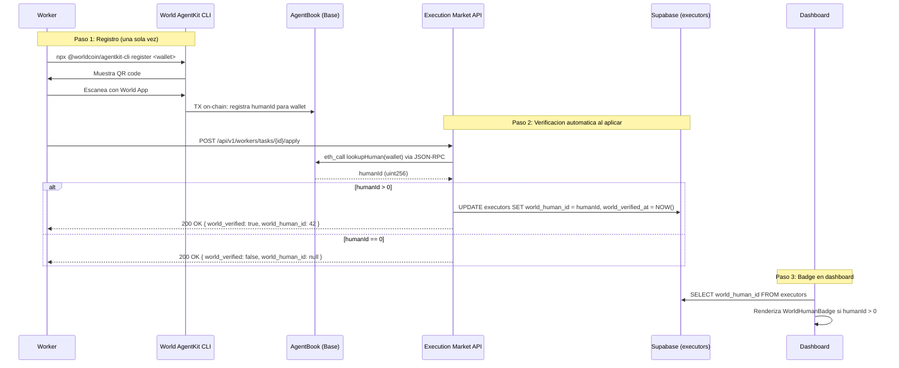

# World AgentKit -- Verificacion de Humanos en Execution Market

## Que es y para que sirve

Execution Market integra el contrato **AgentBook** de World (desplegado en Base Mainnet) para verificar que una wallet pertenece a un humano real verificado por World ID. El modulo llama a `lookupHuman(address)` on-chain y obtiene un `humanId`: si es mayor que 0, la wallet esta verificada. Los workers verificados reciben un badge verde **"Verified Human"** en el dashboard y pueden recibir prioridad al aplicar a tareas.

La verificacion es **read-only y no-bloqueante** -- nunca impide que un worker aplique a una tarea. Solo enriquece su perfil con la informacion de verificacion.

---

## Como funciona



---

## Requisitos previos

| Requisito | Detalle |
|-----------|---------|
| Migracion de BD | `supabase/migrations/084_world_agentkit.sql` aplicada (agrega `world_human_id` y `world_verified_at` a `executors`) |
| Variable de entorno | `BASE_RPC_URL` -- RPC de Base Mainnet. Si no se configura, usa `https://mainnet.base.org` (publico, mas lento). Recomendado: QuikNode privado |
| Feature flag | `feature.world_agentkit_enabled` = `true` (habilitado por defecto) |
| Contrato | `0xE1D1D3526A6FAa37eb36bD10B933C1b77f4561a4` (AgentBook en Base Mainnet, read-only) |

### Verificar que la migracion esta aplicada

```sql
-- En Supabase SQL Editor:
SELECT column_name, data_type
FROM information_schema.columns
WHERE table_name = 'executors'
  AND column_name IN ('world_human_id', 'world_verified_at');
```

Debe retornar 2 filas. Si no aparecen, aplicar la migracion 084.

### Verificar el RPC

```bash
# Verificar que BASE_RPC_URL esta configurado (sin mostrar el valor)
echo "BASE_RPC_URL is ${BASE_RPC_URL:+set}"
```

---

## Como registrar un worker

### Paso 1: Instalar y ejecutar el CLI de World AgentKit

```bash
npx @worldcoin/agentkit-cli register 0xTU_WALLET_AQUI
```

### Paso 2: Escanear el QR code

El CLI muestra un codigo QR en la terminal. Abre **World App** en tu celular y escanea el codigo. Esto vincula tu World ID (verificacion biometrica) con tu wallet Ethereum.

### Paso 3: Confirmar on-chain

Despues de escanear, el CLI ejecuta una transaccion en Base Mainnet que registra tu `humanId` en el contrato AgentBook. Esto puede tomar 2-5 segundos.

### Paso 4: Verificar el registro

```bash
# Usando cast (Foundry):
cast call 0xE1D1D3526A6FAa37eb36bD10B933C1b77f4561a4 \
  "lookupHuman(address)(uint256)" \
  0xTU_WALLET_AQUI \
  --rpc-url https://mainnet.base.org
```

Si retorna un numero mayor que 0 (ej: `42`), el registro fue exitoso.

---

## Como probar la integracion

### 1. Endpoint de API: consulta directa

```bash
curl "https://api.execution.market/api/v1/workers/world-status?wallet=0xTU_WALLET_AQUI"
```

Respuesta para una wallet verificada:

```json
{
  "message": "World verification status retrieved",
  "data": {
    "status": "verified",
    "human_id": 42,
    "wallet_address": "0xtu_wallet_aqui",
    "error": null,
    "is_human": true
  }
}
```

Respuesta para una wallet NO verificada:

```json
{
  "message": "World verification status retrieved",
  "data": {
    "status": "not_verified",
    "human_id": 0,
    "wallet_address": "0xtu_wallet_aqui",
    "error": null,
    "is_human": false
  }
}
```

### 2. Verificacion on-chain directa (cast)

```bash
cast call 0xE1D1D3526A6FAa37eb36bD10B933C1b77f4561a4 \
  "lookupHuman(address)(uint256)" \
  0xTU_WALLET_AQUI \
  --rpc-url https://mainnet.base.org
```

- Retorna `0` = no verificado
- Retorna `> 0` = humanId verificado

### 3. Tests automatizados

```bash
cd mcp_server
pytest -m agentkit -v
```

Esto ejecuta todos los tests en `mcp_server/tests/test_world_agentkit.py`:

| Test | Que valida |
|------|-----------|
| `test_lookup_human_verified` | `humanId > 0` retorna status `VERIFIED` e `is_human = True` |
| `test_lookup_human_not_verified` | `humanId == 0` retorna status `NOT_VERIFIED` |
| `test_lookup_human_rpc_error_returns_error_status` | Fallo de RPC retorna status `ERROR` sin lanzar excepcion |
| `test_is_human_shortcut` | Atajo `is_human()` retorna `True` para wallets verificadas |
| `test_is_human_shortcut_returns_false` | Atajo `is_human()` retorna `False` para wallets no verificadas |
| `test_encode_address_*` | Encoding ABI correcto (lowercase, padding, sin `0x`) |
| `test_to_dict_*` | Serializacion correcta de `WorldHumanResult` |
| `test_feature_flag_off_skips_lookup` | Feature flag apagado impide la consulta |
| `test_feature_flag_on_triggers_lookup` | Feature flag encendido ejecuta la consulta |

---

## Integracion automatica en `apply_to_task()`

Cuando un worker aplica a una tarea (`POST /api/v1/workers/tasks/{task_id}/apply`), el flujo de verificacion World se ejecuta **automaticamente** como parte del proceso. No requiere accion adicional del worker.

### Que pasa internamente

1. El endpoint verifica el feature flag `feature.world_agentkit_enabled`
2. Si esta habilitado, obtiene la wallet del worker (reutiliza la wallet del bloque ERC-8004 si ya se resolvio)
3. Llama a `lookup_human(wallet)` -- consulta JSON-RPC al contrato AgentBook en Base
4. Si `humanId > 0` (verificado):
   - Guarda `world_human_id` y `world_verified_at` en la tabla `executors`
   - Incluye `world_verified: true` y `world_human_id` en la respuesta de la aplicacion
5. Si `humanId == 0` o hay error:
   - No modifica nada en la BD
   - Incluye `world_verified: false` en la respuesta
   - **Nunca bloquea la aplicacion** -- el worker aplica normalmente

### Respuesta de aplicacion exitosa

```json
{
  "message": "Application submitted successfully",
  "data": {
    "application_id": "uuid-aqui",
    "task_id": "uuid-aqui",
    "status": "pending",
    "world_verified": true,
    "world_human_id": 42
  }
}
```

---

## Dashboard: badge de verificacion

El componente `WorldHumanBadge` se muestra automaticamente en dos lugares del dashboard:

1. **AgentMiniCard** -- La tarjeta resumen de cada worker/agente. El badge aparece junto al nombre y otros badges (ERC-8004, X/Twitter).
2. **TaskApplicationModal** -- El modal donde un publisher revisa las aplicaciones de workers. El badge aparece junto al nombre del applicant.

### Apariencia

El badge es una pastilla verde compacta con un icono de check y el texto **"Verified Human"**:
- Light mode: fondo `green-100`, texto `green-800`
- Dark mode: fondo `green-900/30`, texto `green-300`
- Tooltip al hacer hover: `"World ID Verified Human #42"` (con el humanId)

El badge **solo aparece** cuando `world_human_id > 0` en el registro del executor. Si es `null`, `0`, o `undefined`, el componente no renderiza nada.

### Datos necesarios en el frontend

El dashboard lee `world_human_id` del registro del executor en Supabase. No se necesita configuracion adicional en el frontend -- el badge se activa automaticamente cuando la BD tiene el dato.

---

## Feature flags

Ambos flags se controlan desde `platform_config` (modificables via Admin API sin redeploy):

| Flag | Default | Que controla |
|------|---------|-------------|
| `feature.world_agentkit_enabled` | `true` | Habilita/deshabilita la consulta on-chain al AgentBook durante `apply_to_task()` y el endpoint `/workers/world-status` |
| `feature.world_agentkit_priority_boost` | `true` | Reservado para dar prioridad a workers verificados en el matching de tareas (future use) |

### Como deshabilitar

```python
# Via Admin API (requiere X-Admin-Key):
# PATCH /api/v1/admin/config
{
  "key": "feature.world_agentkit_enabled",
  "value": false,
  "reason": "Deshabilitando temporalmente por mantenimiento de RPC"
}
```

O directamente en Supabase:

```sql
UPDATE platform_config
SET value = 'false'
WHERE key = 'feature.world_agentkit_enabled';
```

Cuando el flag esta apagado:
- `apply_to_task()` omite la consulta on-chain completamente
- El endpoint `/workers/world-status` sigue funcionando (consulta directa, no depende del flag)
- Los badges existentes siguen visibles (el dato ya esta en BD)

---

## Troubleshooting

### "Error checking World verification status" (HTTP 500)

**Causa**: El RPC de Base no responde o el timeout de 15 segundos se agoto.

**Solucion**:
1. Verificar que `BASE_RPC_URL` apunta a un RPC funcional
2. Si usas el RPC publico (`https://mainnet.base.org`), puede estar rate-limited. Configurar un RPC privado (QuikNode)
3. Verificar conectividad: `curl -X POST https://mainnet.base.org -H "Content-Type: application/json" -d '{"jsonrpc":"2.0","method":"eth_blockNumber","params":[],"id":1}'`

### La wallet esta registrada pero retorna `humanId = 0`

**Causa**: El registro en AgentBook puede no haberse completado on-chain.

**Solucion**:
1. Verificar directamente con cast: `cast call 0xE1D1D3526A6FAa37eb36bD10B933C1b77f4561a4 "lookupHuman(address)(uint256)" 0xTU_WALLET --rpc-url https://mainnet.base.org`
2. Si retorna 0, el registro no se completo. Repetir `npx @worldcoin/agentkit-cli register <wallet>`
3. Esperar 10-15 segundos despues del registro y volver a consultar (confirmacion de bloque)

### El badge no aparece en el dashboard

**Causa**: El campo `world_human_id` esta en `null` o `0` para ese executor.

**Solucion**:
1. Verificar en BD: `SELECT world_human_id, world_verified_at FROM executors WHERE wallet_address = '0x...'`
2. Si esta en `null`, el worker no ha aplicado a ninguna tarea desde que se activo la integracion (la verificacion se ejecuta al aplicar)
3. Alternativa: forzar una consulta via API: `curl "/api/v1/workers/world-status?wallet=0x..."` y actualizar manualmente la BD con el resultado

### "Wallet must be 0x-prefixed" (HTTP 400)

**Causa**: La wallet no tiene el prefijo `0x` o tiene un formato invalido (debe ser exactamente 42 caracteres).

**Solucion**: Asegurar que la wallet tiene formato `0x` + 40 caracteres hexadecimales.

### El feature flag esta encendido pero no se ejecuta la verificacion

**Causa**: El cache de `PlatformConfig` tiene un TTL de 5 minutos. Si acabas de cambiar el flag, puede tomar hasta 5 minutos en reflejarse.

**Solucion**: Invalidar el cache manualmente via Admin API o esperar 5 minutos.

---

## Referencia tecnica rapida

| Item | Valor |
|------|-------|
| Contrato AgentBook | `0xE1D1D3526A6FAa37eb36bD10B933C1b77f4561a4` (Base Mainnet) |
| Funcion ABI | `lookupHuman(address) -> uint256` |
| Selector (4 bytes) | `0x87e870c3` |
| Modulo Python | `mcp_server/integrations/world/agentbook.py` |
| Endpoint REST | `GET /api/v1/workers/world-status?wallet=0x...` |
| Columnas BD | `executors.world_human_id` (INTEGER), `executors.world_verified_at` (TIMESTAMPTZ) |
| Migracion | `supabase/migrations/084_world_agentkit.sql` |
| Tests | `mcp_server/tests/test_world_agentkit.py` (marker: `agentkit`) |
| Badge component | `dashboard/src/components/agents/WorldHumanBadge.tsx` |
| Timeout RPC | 15 segundos (hardcoded en `agentbook.py`) |
| Env var RPC | `BASE_RPC_URL` (default: `https://mainnet.base.org`) |
