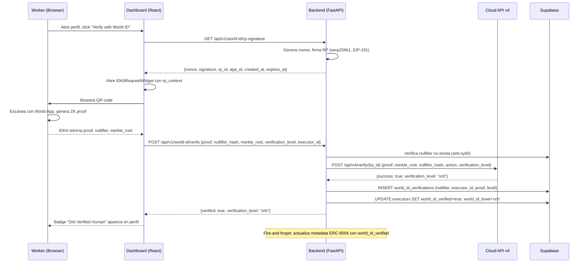

# Guia de Integracion: World ID 4.0 en Execution Market

## Que es y para que sirve

World ID 4.0 es el sistema de prueba-de-humanidad de Worldcoin que usa pruebas de conocimiento cero (ZK proofs) para verificar que un usuario es un humano unico, sin revelar su identidad real. En Execution Market, lo usamos para que los workers demuestren que son personas reales antes de aplicar a tareas de alto valor. El mecanismo anti-sybil se basa en un **nullifier hash** unico por persona por aplicacion: si alguien intenta verificar una segunda cuenta con el mismo World ID, el sistema lo rechaza automaticamente.

## Como funciona (flujo completo)



### Detalle de los pasos

1. **Firma RP (backend)**: El backend genera un nonce aleatorio de 32 bytes, lo hashea a un elemento de campo BN254 (`hashToField`), construye un mensaje de 81 bytes (version + nonce + timestamps + action hash), y lo firma con la signing key usando secp256k1 recoverable signature con hash EIP-191.

2. **IDKit Widget (frontend)**: El componente `WorldIdVerification.tsx` usa `IDKitRequestWidget` de `@worldcoin/idkit` v4 con el preset `orbLegacy` para solicitar prueba biometrica Orb.

3. **Verificacion Cloud API v4 (backend)**: El backend envia el proof a `https://developer.world.org/api/v4/verify/{rp_id}` y valida la respuesta.

4. **Almacenamiento**: El nullifier hash y proof se guardan en `world_id_verifications`. El perfil del executor se actualiza con `world_id_verified = true`.

5. **ERC-8004 link**: De forma asincrona (fire-and-forget), el backend actualiza la metadata del agente ERC-8004 del worker con `world_id_verified: true` y `world_id_level`.

## Pre-requisitos

Necesitas lo siguiente antes de empezar:

| Requisito | Donde obtenerlo |
|-----------|----------------|
| Cuenta en World Developer Portal | [developer.world.org](https://developer.world.org) |
| `app_id` de tu aplicacion | Developer Portal > Tu App > Overview |
| `rp_id` (Relying Party ID) | Developer Portal > Tu App > API Keys |
| `signing_key` (clave privada hex) | Developer Portal > Tu App > API Keys > RP Signing Key |
| World App instalada (para testing real) | App Store / Play Store |
| Node.js 18+ y Python 3.10+ | Instalados localmente |

## Pasos de configuracion

### 1. Crear aplicacion en World Developer Portal

1. Ve a [developer.world.org](https://developer.world.org)
2. Crea una cuenta o inicia sesion
3. Click "Create App"
4. Nombre: `Execution Market` (o el que prefieras)
5. Selecciona "Cloud Verification" como metodo
6. Registra la action `verify-worker` (este string debe coincidir exactamente con el que usa el backend)
7. Copia los tres valores: **App ID**, **RP ID**, y **Signing Key**

### 2. Configurar variables de entorno

Agrega las tres variables a tu `.env.local` (backend, en la raiz del proyecto):

```bash
# World ID 4.0 (developer.world.org)
WORLD_ID_APP_ID=app_staging_xxxxxxxxxxxx
WORLD_ID_RP_ID=your-rp-id-here
WORLD_ID_SIGNING_KEY=abcdef0123456789...  # 64 chars hex (32 bytes), sin prefijo 0x
```

**Formato de la signing key**: Es una clave privada secp256k1 en hexadecimal, 64 caracteres. El codigo acepta con o sin prefijo `0x` (lo remueve automaticamente). NO incluyas comillas alrededor del valor.

Para ECS (produccion), agrega las variables al task definition via Terraform (`infrastructure/terraform/ecs.tf`) o AWS Secrets Manager.

### 3. Instalar dependencias Python (backend)

```bash
cd mcp_server
pip install coincurve>=20.0.0 pycryptodome>=3.20.0
```

Estas ya estan en `mcp_server/requirements.txt` bajo la seccion "World ID 4.0". `coincurve` se usa para firmar con secp256k1, y `pycryptodome` provee `keccak256` via `Crypto.Hash.keccak`.

### 4. Instalar dependencia npm (dashboard)

```bash
cd dashboard
npm install @worldcoin/idkit@^4.0.11
```

Ya esta en `dashboard/package.json`. El paquete incluye `IDKitRequestWidget`, los presets (`orbLegacy`), y los tipos TypeScript.

### 5. Aplicar migraciones de base de datos

Ejecuta las migraciones en tu instancia de Supabase (SQL Editor o CLI):

```sql
-- Migracion 084: tabla world_id_verifications + columnas en executors
-- Migracion 085: politicas RLS
```

Archivos:
- `supabase/migrations/084_world_id_verification.sql`
- `supabase/migrations/085_world_id_rls.sql`

La migracion 084 crea:
- Columnas `world_id_verified` (boolean) y `world_id_level` (text) en `executors`
- Tabla `world_id_verifications` con constraints de unicidad en `nullifier_hash` y `executor_id`
- Indices para lookup rapido

La migracion 085 habilita RLS:
- Workers solo pueden leer su propia verificacion
- Solo el service role (backend) puede insertar/actualizar
- Nadie puede borrar verificaciones (intencional)

### 6. Verificar que todo esta correcto

```bash
# Backend: verificar que las env vars estan set
echo "WORLD_ID_APP_ID is ${WORLD_ID_APP_ID:+set}"
echo "WORLD_ID_RP_ID is ${WORLD_ID_RP_ID:+set}"
echo "WORLD_ID_SIGNING_KEY is ${WORLD_ID_SIGNING_KEY:+set}"

# Backend: arrancar servidor
cd mcp_server && python server.py

# Dashboard: arrancar dev server
cd dashboard && npm run dev
```

## Como verificar un worker (paso a paso)

1. **Abrir el dashboard**: Navega a `https://execution.market` (produccion) o `http://localhost:5173` (local)
2. **Conectar wallet**: El worker debe tener wallet conectada y perfil creado
3. **Ir al perfil**: Click en el avatar o menu de usuario
4. **Seccion "Human Verification"**: En la pagina de perfil, busca la tarjeta blanca con titulo "Human Verification"
5. **Click "Verify with World ID"**: Boton negro con icono de iris
6. **Esperar carga**: El sistema pide la firma RP al backend (1-2 segundos)
7. **Escanear QR**: Se abre el widget IDKit con un codigo QR. Abrir World App en el telefono y escanear
8. **Confirmar en World App**: La app pide confirmacion biometrica (Orb) o de dispositivo
9. **Esperar verificacion**: El backend verifica el proof contra Cloud API v4 (2-3 segundos)
10. **Badge aparece**: Si todo sale bien, aparece el badge "Orb Verified Human" (o "Device Verified") en el perfil

Despues de la verificacion, el badge es permanente. No se puede borrar ni transferir.

## Como hacer testing

### Opcion 1: World ID Simulator (desarrollo)

Para desarrollo sin Orb real, usa el simulador:

1. Ve a [simulator.worldcoin.org](https://simulator.worldcoin.org)
2. Configura tu `app_id` en el simulador
3. El simulador genera proofs validos que la Cloud API acepta en modo staging

**Nota**: Tu `app_id` debe ser un ID de staging (`app_staging_*`) para que el simulador funcione. IDs de produccion (`app_*`) requieren World App real.

### Opcion 2: Testing via API (curl)

**Obtener firma RP:**

```bash
curl -s https://api.execution.market/api/v1/world-id/rp-signature?action=verify-worker | python -m json.tool
```

Respuesta esperada:

```json
{
    "nonce": "00abcdef...",
    "created_at": 1711929600,
    "expires_at": 1711929900,
    "action": "verify-worker",
    "signature": "aabbccdd...",
    "rp_id": "your-rp-id",
    "app_id": "app_staging_xxx"
}
```

Si recibes HTTP 503 con mensaje "WORLD_ID_SIGNING_KEY not configured", la variable de entorno no esta seteada.

**Verificar un proof (requiere proof real del simulador o World App):**

```bash
curl -X POST https://api.execution.market/api/v1/world-id/verify \
  -H "Content-Type: application/json" \
  -d '{
    "proof": "0x...",
    "merkle_root": "0x...",
    "nullifier_hash": "0x...",
    "verification_level": "orb",
    "executor_id": "uuid-del-executor",
    "action": "verify-worker"
  }'
```

Respuestas posibles:

| HTTP | Significado |
|------|-------------|
| 200 | Verificacion exitosa (o ya verificado) |
| 400 | Proof invalido o fallo la verificacion Cloud API |
| 409 | Nullifier ya usado por otra cuenta (intento sybil) |
| 503 | World ID no configurado en el backend |

### Opcion 3: Tests unitarios

```bash
cd mcp_server
pytest -m worldid -v
```

Los tests cubren:
- `test_hash_to_field_length` -- hashToField retorna 32 bytes con byte superior en cero
- `test_hash_to_field_deterministic` -- hashToField es determinista
- `test_hash_ethereum_message` -- EIP-191 produce hash de 32 bytes
- `test_compute_rp_signature_message_length` -- Mensaje RP es exactamente 81 bytes (1+32+8+8+32)
- `test_sign_request_returns_valid_structure` -- sign_request() retorna todos los campos correctos
- `test_sign_request_no_key_raises` -- Error claro si no hay signing key
- `test_verify_returns_error_if_no_rp_id` -- Error si no hay RP ID
- `test_verify_calls_cloud_api` -- Mock del Cloud API verifica URL y payload correctos

## Anti-Sybil: como funciona el nullifier

El nullifier hash es un valor determinista calculado como:

```
nullifier = f(identidad_persona, app_id, action)
```

Esto significa:
- **La misma persona** verificando en **la misma app** con **la misma action** siempre produce **el mismo nullifier**
- Si Juan verifica su cuenta A, obtiene nullifier `0xabc...`
- Si Juan intenta verificar cuenta B, obtiene el mismo nullifier `0xabc...`
- La tabla `world_id_verifications` tiene `UNIQUE (nullifier_hash)`, asi que el INSERT falla
- El endpoint retorna HTTP 409: "This World ID has already been used to verify another account"

**Protecciones en el codigo:**

1. **Pre-check en memoria**: Antes de llamar a Cloud API, el backend consulta si el nullifier ya existe en la tabla (linea rapida, evita gastar calls a Cloud API)
2. **Constraint en DB**: `uq_world_id_nullifier` es UNIQUE a nivel de base de datos -- incluso si dos requests llegan simultaneamente, solo una pasa
3. **Un executor, una verificacion**: `uq_world_id_executor` garantiza que un executor no puede tener dos verificaciones
4. **Log de intento sybil**: Cada intento de reuso se loguea con `SYBIL_ATTEMPT` para auditoria

## Enforcement: restriccion por monto de bounty

Cuando un worker intenta aplicar a una tarea (`POST /api/v1/tasks/{id}/apply`), el backend ejecuta una verificacion condicional:

```
SI world_id_enabled == true
  Y world_id_required_for_high_value == true
  Y bounty_usd >= worldid.min_bounty_for_orb_usd (default: $500.00)
ENTONCES
  El worker DEBE tener world_id_verified == true Y world_id_level == "orb"
  Si no, HTTP 403 con error "world_id_orb_required"
```

**Ejemplo**: Una tarea con bounty de $600.00 requiere verificacion Orb. Una tarea de $100.00 no la requiere.

### Cambiar el threshold

**Fuente unica de verdad**: `worldid.min_bounty_for_orb_usd` en PlatformConfig. El backend lo lee de la DB y lo expone al frontend via `GET /api/v1/config` (campo `worldid_min_bounty_for_orb_usd`). NO hay constantes hardcodeadas en el frontend — todo se sincroniza automaticamente desde este unico valor.

**Via admin API** (sin redeploy, recomendado):

```bash
# Cambiar threshold a $1000.00
curl -X PUT https://api.execution.market/api/v1/admin/config/worldid.min_bounty_for_orb_usd \
  -H "X-Admin-Key: TU_ADMIN_KEY" \
  -H "Content-Type: application/json" \
  -d '{"value": "1000.00", "reason": "Subir threshold de verificacion Orb"}'
```

El frontend recoge el nuevo valor automaticamente desde `/api/v1/config` (cache de 5 minutos en backend).

**Via base de datos** (Supabase SQL Editor):

```sql
UPDATE platform_config
SET value = '"1000.00"'
WHERE key = 'worldid.min_bounty_for_orb_usd';
```

Despues de actualizar via DB, invalida el cache del backend reiniciando el servicio o esperando 5 minutos (TTL del cache).

**Desactivar enforcement por completo**: Setea la variable `EM_WORLD_ID_ENABLED=false` en el task definition de ECS, o cambia `feature.world_id_required_for_high_value` a `false` via admin API.

## Link con ERC-8004

Cuando un worker se verifica exitosamente, el backend dispara una tarea asincrona (fire-and-forget) que:

1. Busca si el executor tiene un `erc8004_agent_id` asociado
2. Si lo tiene, llama al [[erc-8004|Facilitator]] (`POST /register` o metadata update) con:
   ```json
   {
     "world_id_verified": true,
     "world_id_level": "orb"
   }
   ```
3. Esto queda registrado como atributo on-chain del agente ERC-8004 del worker

Si el worker no tiene identidad ERC-8004 aun, el paso se salta sin error. Cuando registre su identidad despues, puede sincronizar manualmente.

## Feature flags

Todas las flags se leen de `platform_config` (Supabase) con fallback a defaults en `mcp_server/config/platform_config.py`:

| Flag | Default | Descripcion |
|------|---------|-------------|
| `feature.world_id_enabled` | `true` | Habilita toda la integracion World ID (endpoints + enforcement) |
| `feature.world_id_required_for_high_value` | `true` | Activa el enforcement de Orb para tareas de alto valor |
| `worldid.min_bounty_for_orb_usd` | `500.00` | Bounty minimo en USD que requiere verificacion Orb |

Adicionalmente, la variable de entorno `EM_WORLD_ID_ENABLED` controla el enforcement en `apply_to_task()`. Si es `false`, el bloque de enforcement se salta completamente (independiente de las flags de DB).

### Como desactivar todo

Para desactivar World ID sin tocar codigo:

```bash
# Opcion 1: Variable de entorno (requiere redeploy)
EM_WORLD_ID_ENABLED=false

# Opcion 2: Feature flag via admin API (sin redeploy)
curl -X PUT .../api/v1/admin/config/feature.world_id_enabled \
  -H "X-Admin-Key: ..." \
  -d '{"value": false}'
```

Los endpoints `/api/v1/world-id/rp-signature` y `/api/v1/world-id/verify` siguen funcionando aunque el enforcement este desactivado. Solo se desactiva la *restriccion* en `apply_to_task()`.

## Referencia de variables de entorno

| Variable | Requerida | Formato | Descripcion |
|----------|-----------|---------|-------------|
| `WORLD_ID_APP_ID` | Si | `app_staging_*` o `app_*` | Identificador de la app en World Developer Portal. Staging para testing, produccion para real. Se envia al frontend para configurar IDKit. |
| `WORLD_ID_RP_ID` | Si | String (UUID-like) | Relying Party ID. Identifica tu app ante la Cloud API v4. Se usa en la URL de verificacion: `/api/v4/verify/{rp_id}`. |
| `WORLD_ID_SIGNING_KEY` | Si | Hex, 64 chars | Clave privada secp256k1 para firmar requests RP. El backend la usa para generar la firma que IDKit necesita. **NUNCA commitear ni loguear.** Acepta con o sin prefijo `0x`. |
| `EM_WORLD_ID_ENABLED` | No | `true`/`false` | Override para desactivar enforcement en `apply_to_task()`. Default: `true`. |

## Troubleshooting

### "WORLD_ID_SIGNING_KEY not configured" (HTTP 503 en `/rp-signature`)

**Causa**: La variable de entorno `WORLD_ID_SIGNING_KEY` esta vacia o no existe.

**Solucion**: Verifica que esta seteada en `.env.local` y que el servidor la carga. Las variables se leen al importar el modulo (`client.py` linea 30), asi que si cambias `.env.local` debes reiniciar el servidor.

### "WORLD_ID_RP_ID not configured" (error en verificacion)

**Causa**: `WORLD_ID_RP_ID` no esta seteado.

**Solucion**: Igual que arriba. Verificar `.env.local` y reiniciar.

### La signing key tiene formato incorrecto

**Sintomas**: Error de `coincurve` al firmar: `ValueError: private key is invalid`.

**Causa**: La key no es exactamente 32 bytes (64 caracteres hex). Posibles problemas:
- Tiene espacios o saltos de linea
- Tiene prefijo `0x` duplicado (el codigo ya remueve uno)
- Longitud incorrecta

**Solucion**: Verifica con `echo -n "$WORLD_ID_SIGNING_KEY" | wc -c`. Debe ser 64 (sin `0x`) o 66 (con `0x`).

### El widget IDKit no se abre

**Sintomas**: Click en "Verify with World ID", aparece spinner, luego error.

**Causas posibles**:
1. El backend no responde en `/rp-signature` -- revisar logs del servidor
2. `app_id` incorrecto -- debe coincidir con el de Developer Portal
3. CORS bloqueando la request -- verificar que el backend permite el origin del dashboard
4. La firma RP expiro (TTL de 5 minutos) -- reintentar

### Cloud API retorna error 400

**Sintomas**: Despues de escanear QR, el backend dice "Proof verification failed".

**Causas posibles**:
1. La action string no coincide -- el backend usa `verify-worker` por default. Debe ser la misma action registrada en Developer Portal
2. El proof ya fue usado (replay) -- cada proof es single-use
3. `app_id` staging con proof de produccion o viceversa

### HTTP 409: "This World ID has already been used to verify another account"

**Causa**: El nullifier hash ya esta asociado a otro executor. Esto es el anti-sybil funcionando correctamente.

**Si es un error legitimo** (e.g., el worker borro y recreo su cuenta): Un admin debe borrar el registro anterior de `world_id_verifications` manualmente:

```sql
-- CUIDADO: Solo para casos legitimos confirmados
DELETE FROM world_id_verifications
WHERE nullifier_hash = '0x...el_nullifier_aqui';
```

### El worker esta verificado pero no puede aplicar a tarea de alto valor

**Causa probable**: Tiene verificacion `device` pero la tarea requiere `orb`. El enforcement exige `world_id_level == "orb"` para tareas sobre el threshold.

**Solucion**: El worker debe re-verificarse usando un Orb fisico (la verificacion `device` no es suficiente para tareas de alto valor). La verificacion anterior se mantiene; el endpoint `/verify` retorna "Already verified at device level" sin error.

**Nota**: Si necesitas que device sea suficiente, cambia la logica en `workers.py` linea 498 (actualmente: `not _wid_verified or _wid_level != "orb"`).

### Los tests fallan con "ModuleNotFoundError: No module named 'coincurve'"

```bash
pip install coincurve>=20.0.0 pycryptodome>=3.20.0
```

En Windows, `coincurve` a veces requiere Visual C++ Build Tools. Si falla la instalacion:

```bash
# Opcion 1: conda
conda install -c conda-forge coincurve

# Opcion 2: pre-compiled wheel
pip install coincurve --only-binary :all:
```

## Archivos de referencia

| Archivo | Que hace |
|---------|----------|
| `mcp_server/integrations/worldid/client.py` | Firma RP (secp256k1 + EIP-191), verificacion Cloud API v4 |
| `mcp_server/api/routers/worldid.py` | Endpoints REST: `GET /rp-signature`, `POST /verify` |
| `mcp_server/api/routers/workers.py` | Enforcement en `apply_to_task()` (linea ~462) |
| `mcp_server/config/platform_config.py` | Feature flags y thresholds (lineas 110-112) |
| `mcp_server/tests/test_worldid.py` | Tests unitarios (marker: `worldid`) |
| `dashboard/src/components/WorldIdVerification.tsx` | Componente React: IDKit widget + badge |
| `dashboard/src/components/profile/ProfilePage.tsx` | Integracion del widget en la pagina de perfil |
| `supabase/migrations/084_world_id_verification.sql` | Schema: tabla `world_id_verifications`, columnas en `executors` |
| `supabase/migrations/085_world_id_rls.sql` | Politicas RLS para la tabla de verificaciones |
| `mcp_server/requirements.txt` | Dependencias: `coincurve>=20.0.0`, `pycryptodome>=3.20.0` |
| `dashboard/package.json` | Dependencia: `@worldcoin/idkit@^4.0.11` |
