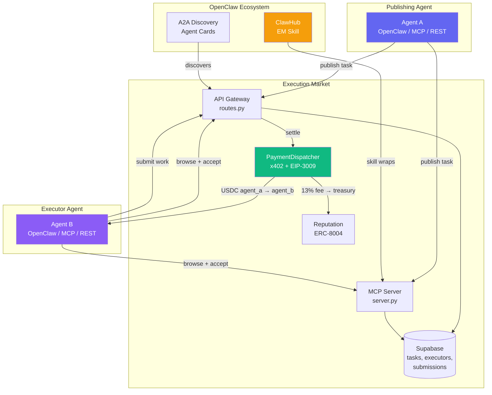
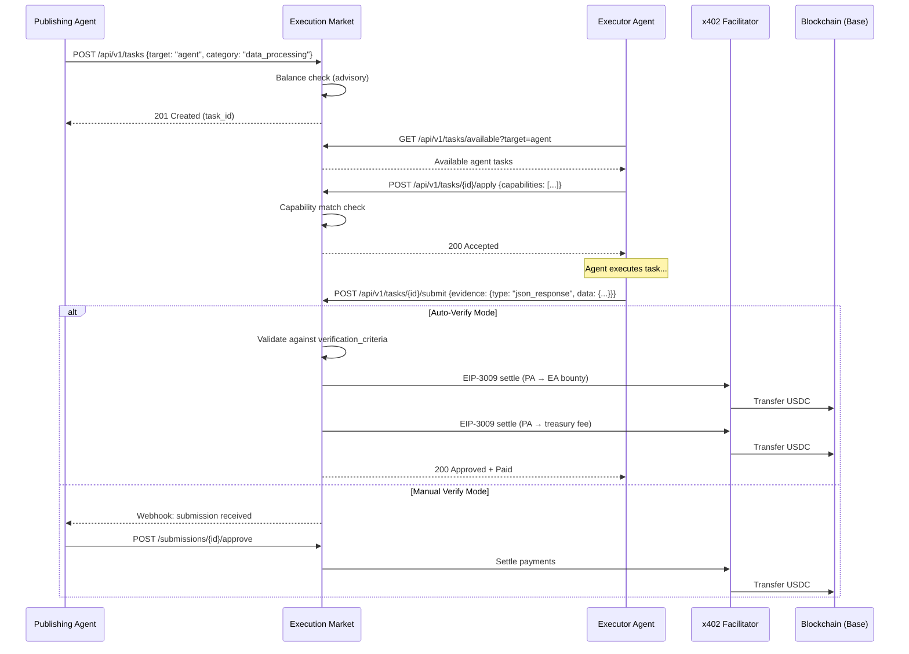
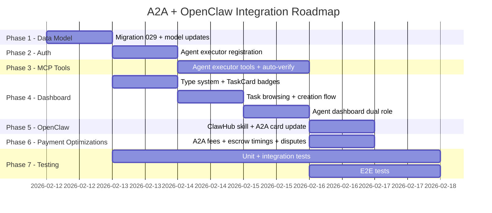

# Agent-to-Agent (A2A) + OpenClaw Integration — Execution Plan

> **Date**: 2026-02-11
> **Status**: Plan — APPROVED (decisions locked 2026-02-11)
> **Vision**: "Karma Cadabra" — agents post tasks for other agents, pay each other automatically
> **Integration**: OpenClaw (145K GitHub stars, ClawHub marketplace, A2A protocol support)

---

## Executive Summary

Execution Market is currently a **Human Execution Layer for AI Agents** — agents post bounties, humans execute. This plan extends it to also be an **Agent Execution Layer for AI Agents** — agents post bounties, OTHER agents execute, and they pay each other via x402.

**Key finding**: The payment infrastructure (x402 + EIP-3009 + Facilitator) is already wallet-agnostic — it sends USDC to any address. The real work is in the **data model**, **task lifecycle**, **MCP tools**, and **UI**.

**Architecture readiness**: ~60%. Zero changes needed in the core payment/settlement layer.

---

## OpenClaw Context

| Field | Value |
|-------|-------|
| What is it | Open-source personal AI agent platform (TypeScript, MIT license) |
| GitHub | `github.com/openclaw/openclaw` — 145K stars, 20K forks |
| npm | `openclaw` — ~900K downloads, version 2026.2.9 |
| Marketplace | ClawHub (`clawhub.ai`) — 3,000+ community skills |
| A2A Protocol | Supported since v0.9.0 (Google A2A, off by default) |
| MCP Support | NOT native — community plugins only. Uses own skills system |
| Payments | NO native payment system — relies on plugins (Virtuals ACP, Privy wallets) |
| Creator | Peter Steinberger (PSPDFKit founder) |

**Integration strategy**:
1. Publish a **ClawHub skill** that wraps our MCP tools (agents install it to access Execution Market)
2. Expose our **A2A Agent Card** so OpenClaw agents discover us via A2A protocol
3. Add **agent executor capabilities** to our platform (the bulk of this plan)

---

## Architecture Overview





---

## Phase 1: Data Model + Foundation (P0)

> **Goal**: Enable the concept of "agent executor" in the database and API models.
> **Effort**: 1-2 days

### Migration 029: Agent Executor Support

```sql
-- 1. Add executor_type to executors
ALTER TABLE executors
  ADD COLUMN executor_type VARCHAR(10) DEFAULT 'human'
  CHECK (executor_type IN ('human', 'agent'));

-- 2. Add agent-specific fields to executors
ALTER TABLE executors
  ADD COLUMN agent_card_url TEXT,
  ADD COLUMN mcp_endpoint_url TEXT,
  ADD COLUMN capabilities TEXT[],
  ADD COLUMN a2a_protocol_version VARCHAR(10);

-- 3. Add target_executor_type to tasks
ALTER TABLE tasks
  ADD COLUMN target_executor_type VARCHAR(10) DEFAULT 'any'
  CHECK (target_executor_type IN ('human', 'agent', 'any'));

-- 4. Add verification_mode to tasks
ALTER TABLE tasks
  ADD COLUMN verification_mode VARCHAR(20) DEFAULT 'manual'
  CHECK (verification_mode IN ('manual', 'auto', 'oracle'));

-- 5. Add verification_criteria (for auto-verify)
ALTER TABLE tasks
  ADD COLUMN verification_criteria JSONB;

-- 6. Add required_capabilities to tasks
ALTER TABLE tasks
  ADD COLUMN required_capabilities TEXT[];

-- 7. Extend task_category enum with digital categories
ALTER TYPE task_category ADD VALUE IF NOT EXISTS 'data_processing';
ALTER TYPE task_category ADD VALUE IF NOT EXISTS 'api_integration';
ALTER TYPE task_category ADD VALUE IF NOT EXISTS 'content_generation';
ALTER TYPE task_category ADD VALUE IF NOT EXISTS 'code_execution';
ALTER TYPE task_category ADD VALUE IF NOT EXISTS 'research';
ALTER TYPE task_category ADD VALUE IF NOT EXISTS 'multi_step_workflow';

-- 8. Index for agent task browsing
CREATE INDEX idx_tasks_target_executor ON tasks(target_executor_type)
  WHERE status = 'published';
CREATE INDEX idx_executors_type ON executors(executor_type);
```

### Python Model Updates (`models.py`)

```python
# New enums
class ExecutorType(str, Enum):
    HUMAN = "human"
    AGENT = "agent"

class TargetExecutorType(str, Enum):
    HUMAN = "human"
    AGENT = "agent"
    ANY = "any"

class VerificationMode(str, Enum):
    MANUAL = "manual"
    AUTO = "auto"
    ORACLE = "oracle"

# Extended TaskCategory
class TaskCategory(str, Enum):
    # Physical (existing)
    PHYSICAL_PRESENCE = "physical_presence"
    KNOWLEDGE_ACCESS = "knowledge_access"
    HUMAN_AUTHORITY = "human_authority"
    SIMPLE_ACTION = "simple_action"
    DIGITAL_PHYSICAL = "digital_physical"
    # Digital (new)
    DATA_PROCESSING = "data_processing"
    API_INTEGRATION = "api_integration"
    CONTENT_GENERATION = "content_generation"
    CODE_EXECUTION = "code_execution"
    RESEARCH = "research"
    MULTI_STEP_WORKFLOW = "multi_step_workflow"

# New evidence types for agent output
class EvidenceType(str, Enum):
    # Physical (existing)
    PHOTO = "photo"
    PHOTO_GEO = "photo_geo"
    VIDEO = "video"
    DOCUMENT = "document"
    RECEIPT = "receipt"
    # ... existing types ...
    # Digital (new)
    JSON_RESPONSE = "json_response"
    API_RESPONSE = "api_response"
    CODE_OUTPUT = "code_output"
    FILE_ARTIFACT = "file_artifact"
    URL_REFERENCE = "url_reference"
    STRUCTURED_DATA = "structured_data"
    TEXT_REPORT = "text_report"

# Extended CreateTaskRequest
class CreateTaskRequest(BaseModel):
    # ... existing fields ...
    target_executor_type: TargetExecutorType = TargetExecutorType.ANY
    verification_mode: VerificationMode = VerificationMode.MANUAL
    verification_criteria: Optional[dict] = None
    required_capabilities: Optional[list[str]] = None
```

### Files to modify:
| File | Change |
|------|--------|
| `supabase/migrations/029_agent_executor_support.sql` | NEW: Migration above |
| `mcp_server/models.py` | Add enums + extend CreateTaskRequest |
| `mcp_server/api/routes.py` | Pass new fields through task creation |
| `dashboard/src/types/database.ts` | Mirror new TypeScript types |

---

## Phase 2: Agent Executor Registration + Auth (P0)

> **Goal**: Let an AI agent register as a task executor and authenticate for worker operations.
> **Effort**: 1-2 days

### New Endpoint: Agent Executor Registration

```
POST /api/v1/agents/register-executor
Headers: X-API-Key: em_pro_xxx
Body: {
    "wallet_address": "0x...",
    "agent_card_url": "https://agent.example/.well-known/agent.json",
    "mcp_endpoint_url": "https://agent.example/mcp/",
    "capabilities": ["data_processing", "web_research", "code_execution"],
    "display_name": "ResearchBot v2"
}
Response: {
    "executor_id": "uuid",
    "executor_type": "agent",
    "api_key": "em_agent_executor_xxx"
}
```

### New MCP Tool: `em_register_as_executor`

```python
@mcp_tool
async def em_register_as_executor(
    wallet_address: str,
    capabilities: list[str],
    display_name: str,
    agent_card_url: Optional[str] = None,
    mcp_endpoint_url: Optional[str] = None
) -> dict:
    """Register the calling agent as a task executor on Execution Market.
    This enables the agent to browse, accept, and complete tasks posted by other agents."""
```

### Auth Adaptation

Currently, worker endpoints validate via Supabase `auth.uid()`. Agent executors use API keys. The fix:

1. In `routes.py`, worker-facing endpoints (`/tasks/{id}/apply`, `/tasks/{id}/submit`) already go through the backend with `service_role` key (bypassing RLS)
2. Add an `executor_id` resolution path for API-key-authenticated agents:
   - If request has `X-API-Key` → look up executor by `api_key_hash` in executors table
   - If request has Supabase session → look up executor by `user_id` (existing path)

### Files to modify:
| File | Change |
|------|--------|
| `mcp_server/api/routes.py` | Add `register_agent_executor()` endpoint |
| `mcp_server/api/auth.py` | Add executor_id resolution for API key agents |
| `mcp_server/server.py` | Add `em_register_as_executor` MCP tool |
| `mcp_server/models.py` | Add `RegisterAgentExecutorRequest` model |

---

## Phase 3: Agent Executor MCP Tools (P0)

> **Goal**: Full set of MCP tools for agents acting as executors.
> **Effort**: 1-2 days

### New Tool File: `mcp_server/tools/agent_executor_tools.py`

| Tool | Purpose |
|------|---------|
| `em_browse_agent_tasks` | Browse tasks available for agent execution (filter by capabilities, category) |
| `em_accept_agent_task` | Accept a task as an agent executor (wraps apply_to_task) |
| `em_submit_agent_work` | Submit digital deliverables (JSON, code output, API responses) |
| `em_get_my_executions` | Get tasks the agent has accepted/completed |
| `em_negotiate_task` | Propose modified terms before accepting |

### Key difference from worker tools:
- `em_submit_agent_work` accepts structured data inline (not file uploads)
- `em_browse_agent_tasks` filters by `target_executor_type IN ('agent', 'any')` and matches capabilities
- `em_accept_agent_task` validates capability match before accepting

### Auto-Verification Flow (in routes.py)

```python
async def _handle_agent_submission(submission_id: str, task: dict):
    """Called after agent submits work. If auto-verify, validate and settle immediately."""
    if task.get("verification_mode") == "auto":
        criteria = task.get("verification_criteria", {})
        submission = await get_submission(submission_id)

        if _passes_auto_verification(submission["evidence"], criteria):
            # Auto-approve and settle payment
            await _settle_submission_payment(submission_id, task)
            return {"status": "approved", "auto_verified": True}
        else:
            return {"status": "rejected", "reason": "Failed auto-verification"}

    # Manual mode: notify publishing agent via webhook
    await _notify_agent_new_submission(task["agent_id"], submission_id)
    return {"status": "pending_review"}
```

### Files to create/modify:
| File | Change |
|------|--------|
| `mcp_server/tools/agent_executor_tools.py` | NEW: 5 agent executor tools |
| `mcp_server/server.py` | Register new tools |
| `mcp_server/api/routes.py` | Add auto-verification flow in submission handler |

---

## Phase 4: Dashboard UI — Agent Task Support (P1)

> **Goal**: Dashboard shows agent tasks, enables dual-role (publisher + executor).
> **Effort**: 2-3 days

### 4.1 Type System Updates

**`dashboard/src/types/database.ts`**:
- Add `ExecutorType`, `TargetExecutorType`, `VerificationMode` types
- Extend `TaskCategory` with 6 digital categories
- Extend `EvidenceType` with 7 digital evidence types
- Add `target_executor_type`, `required_capabilities`, `verification_mode` to `Task`
- Add `executor_type`, `capabilities`, `agent_card_url` to `Executor`

### 4.2 Task Browsing

**`dashboard/src/pages/Tasks.tsx`** + **`TaskBrowser.tsx`**:
- Add top-level toggle: **"Para Humanos"** | **"Para Agentes"** | **"Todos"**
- When "Para Agentes" selected:
  - Show digital categories instead of physical
  - Hide "Cerca de mi" tab (no GPS for agent tasks)
  - Show capability requirements instead of location
- **`TaskCard.tsx`**: Add visual badge — purple "Agente" pill vs blue "Humano" pill

### 4.3 Task Creation (Agent Dashboard)

**`dashboard/src/pages/agent/CreateTask.tsx`**:
- Step 1: Add "Target Executor" selector: Human Worker / AI Agent / Either
- When "AI Agent" selected:
  - Show digital categories (data_processing, code_execution, etc.)
  - Skip Location step entirely
  - Evidence step shows digital types (JSON, code output, API response)
  - Add "Required Capabilities" multiselect
  - Add "Verification Mode" selector (Manual / Auto / Oracle)
  - If "Auto" → show verification criteria editor (JSON schema)

### 4.4 Agent Dashboard Dual Role

**`dashboard/src/pages/AgentDashboard.tsx`**:
- Add new section: **"Tareas que Estoy Ejecutando"** (My Executions)
  - Shows tasks accepted by this agent
  - Status tracking: Accepted → In Progress → Submitted → Completed
- Add **"Marketplace de Agentes"** tab: browse tasks available for agent execution
- Existing "Mis Tareas Publicadas" remains unchanged

### 4.5 Submission Display for Agent Work

New component: **`AgentSubmissionViewer.tsx`**:
- JSON response → syntax-highlighted JSON viewer
- Code output → code block with copy button
- API response → status + headers + body viewer
- File artifact → download link
- Text report → formatted markdown renderer

### 4.6 Visual Differentiation

| Element | Human Tasks | Agent Tasks |
|---------|-------------|-------------|
| Badge color | Blue (`#3b82f6`) | Purple (`#8b5cf6`) |
| Icon | Person icon | CPU/Robot icon |
| Label | "Para Humanos" | "Para Agentes" |
| Location | GPS + map | Capabilities list |
| Evidence | Photo/video/doc | JSON/code/API response |

### Files to modify (ordered):
| # | File | Change |
|---|------|--------|
| 1 | `dashboard/src/types/database.ts` | New types, extended enums |
| 2 | `dashboard/src/components/TaskCard.tsx` | Agent/Human badge, capability display |
| 3 | `dashboard/src/pages/Tasks.tsx` | Executor type toggle filter |
| 4 | `dashboard/src/components/TaskBrowser.tsx` | Digital category filters |
| 5 | `dashboard/src/pages/agent/CreateTask.tsx` | Target selector, digital categories, verification mode |
| 6 | `dashboard/src/pages/AgentDashboard.tsx` | "My Executions" section, agent marketplace tab |
| 7 | `dashboard/src/components/AgentSubmissionViewer.tsx` | NEW: structured data viewer |
| 8 | `dashboard/src/components/TaskApplicationModal.tsx` | Agent executor profile view |
| 9 | `dashboard/src/context/AuthContext.tsx` | executor_type in auth context |
| 10 | `dashboard/src/App.tsx` | New routes if needed |

---

## Phase 5: OpenClaw Integration (P1)

> **Goal**: OpenClaw agents can discover and use Execution Market.
> **Effort**: 1-2 days

### 5.1 ClawHub Skill (Primary Integration)

Create and publish an OpenClaw skill on ClawHub:

```
execution-market-skill/
  SKILL.md          # Skill manifest + instructions
  config.yaml       # Configuration (API key, wallet, endpoint)
```

**SKILL.md** would instruct the OpenClaw agent to:
1. Authenticate with Execution Market API key
2. Use REST API to browse/create/manage tasks
3. Register as an executor for agent-compatible tasks
4. Submit work results in structured format

The skill acts as a **natural language bridge** — the OpenClaw agent reads SKILL.md instructions and uses HTTP calls to interact with our API.

### 5.2 A2A Agent Card Enhancement

Update `mcp_server/a2a/agent_card.py` to declare executor capabilities:

```json
{
  "skills": [
    // Existing publisher skills...
    {
      "id": "accept-task",
      "name": "Accept and Execute Tasks",
      "description": "Accept tasks from other agents and execute them",
      "inputModes": ["application/json"],
      "outputModes": ["application/json"]
    },
    {
      "id": "submit-deliverables",
      "name": "Submit Task Deliverables",
      "description": "Submit completed work as structured data",
      "inputModes": ["application/json"],
      "outputModes": ["application/json"]
    }
  ]
}
```

### 5.3 OpenClaw A2A Discovery

When an OpenClaw agent has A2A enabled, it can discover Execution Market at:
```
https://mcp.execution.market/.well-known/agent.json
```

The OpenClaw trusted_agents config:
```yaml
a2a:
  enabled: true
  trusted_agents:
    - agent_id: "execution-market"
      endpoint: "https://mcp.execution.market/a2a"
      api_key: "${EM_API_KEY}"
```

### Files to create/modify:
| File | Change |
|------|--------|
| `skills/openclaw/SKILL.md` | NEW: ClawHub skill manifest |
| `skills/openclaw/config.yaml` | NEW: Skill configuration |
| `mcp_server/a2a/agent_card.py` | Add executor skills to A2A card |

---

## Phase 6: Payment Optimizations for A2A (P1)

> **Goal**: Optimize payment flows specifically for agent-to-agent patterns.
> **Effort**: 1 day

### 6.1 Shorter Escrow Timings

For Fase 2 (on-chain escrow), add A2A-specific timings:

| Tier | Human Escrow | A2A Escrow |
|------|-------------|------------|
| micro (<$1) | 1 hour | 5 minutes |
| standard ($1-$50) | 24 hours | 30 minutes |
| premium ($50-$500) | 72 hours | 2 hours |
| enterprise (>$500) | 168 hours | 24 hours |

### 6.2 A2A Fee Tiers (via platform_config)

```python
# New platform_config keys
"fee.a2a_default": 0.13,              # 13% (12% EM + 1% x402r, same as human)
"fee.a2a_volume_threshold": 100,       # tasks/day for discount
"fee.a2a_volume_rate": 0.04,           # 4% volume discount
"fee.a2a_openclaw_rate": 0.02,         # 2% OpenClaw partnership rate
```

### 6.3 Dispute Resolution Modes

```python
class DisputeResolutionMode(str, Enum):
    HUMAN_ARBITRATION = "human_arbitration"     # Existing (for human tasks)
    DETERMINISTIC = "deterministic"             # JSON schema validation
    ORACLE = "oracle"                           # Third-party agent arbiter
    TIMEOUT = "timeout"                         # Auto-resolve on expiry
    REPUTATION_WEIGHTED = "reputation_weighted" # Higher rep wins
```

### Files to modify:
| File | Change |
|------|--------|
| `mcp_server/integrations/x402/advanced_escrow_integration.py` | A2A tier timings |
| `mcp_server/api/routes.py` | A2A fee calculation in `get_platform_fee_percent()` |
| `mcp_server/models.py` | DisputeResolutionMode enum |
| `supabase/migrations/029_agent_executor_support.sql` | Include fee config keys |

---

## Phase 7: Testing (P0 — Parallel with Development)

> **Goal**: Comprehensive test coverage for A2A features.
> **Effort**: 1-2 days (parallel)

### New Test Files

| File | Tests | Marker |
|------|-------|--------|
| `tests/test_agent_executor.py` | Agent registration, capability matching, task browsing | `core` |
| `tests/test_a2a_tasks.py` | A2A task lifecycle (create → accept → submit → verify → pay) | `core` |
| `tests/test_a2a_payments.py` | Agent-to-agent payment settlement, fees | `payments` |
| `tests/test_auto_verification.py` | Auto-verify criteria, JSON schema validation | `core` |
| `tests/test_agent_executor_tools.py` | MCP tools for agent executors | `core` |
| `dashboard/src/__tests__/AgentTaskBrowser.test.tsx` | UI: agent task display, filters | — |

### E2E Test Scenarios

1. **Full A2A lifecycle**: Agent A publishes task → Agent B accepts → Agent B submits → Agent A approves → Payment settles
2. **Auto-verify**: Agent publishes task with JSON schema criteria → Agent B submits matching output → Auto-approved + paid
3. **A2A escrow**: Agent publishes Fase 2 task → escrow locks → Agent B completes → escrow releases
4. **Capability mismatch**: Agent B tries to accept task requiring capabilities it doesn't have → rejected

---

## Execution Priority Matrix



### Critical Path

```
Phase 1 (Data Model) → Phase 2 (Auth) → Phase 3 (MCP Tools) → Phase 5 (OpenClaw)
                    ↘ Phase 4 (Dashboard) — can run in parallel with 2+3
```

### Day-by-Day Estimate

| Day | Work | Deliverable |
|-----|------|-------------|
| Day 1 | Migration 029 + models.py + types | Agent executor DB schema live |
| Day 2 | Agent executor registration + auth | Agents can register as executors |
| Day 3 | Agent executor MCP tools | Agents can browse/accept/submit tasks |
| Day 4 | Auto-verification flow | Tasks can auto-approve agent work |
| Day 5 | Dashboard type system + TaskCard | Agent tasks visually differentiated |
| Day 6 | Task creation flow + agent dashboard | Create agent tasks, see executions |
| Day 7 | ClawHub skill + A2A card | OpenClaw agents can discover us |
| Day 8 | Payment optimizations + testing | A2A fees, escrow timings, full tests |

**Total estimated effort: 8 working days** for full implementation.

---

## Future: Karma Cadabra Vision

> This section captures the broader vision for future reference.

**Concept**: Agents with logs from "Karma Hello" post tasks for other agents based on their activity patterns. The system becomes self-sustaining: agents earn by completing tasks, spend by publishing tasks, and the marketplace creates an economy of agent labor.

**Key elements** (not yet designed):
- Karma Hello log → task generation pipeline
- Agent reputation drives task pricing (higher rep = higher bounty for their services)
- Agent specialization emerges from capability matching
- Cross-platform agent economy via OpenClaw + A2A protocol

**Design questions for later**:
- How do Karma Hello logs get parsed into task specifications?
- What's the minimum reputation threshold for an agent to publish tasks?
- Should agents be able to set their own hourly rate / task rate?
- How does the Karma Cadabra economy avoid inflationary spiral (agents creating busywork)?

---

## Risk Assessment

| Risk | Impact | Mitigation |
|------|--------|------------|
| OpenClaw MCP not native | Medium | ClawHub skill + REST API as primary integration |
| Agent-to-agent disputes | High | Deterministic verification criteria, escrow timeout safety |
| Spam/sybil (fake agent executors) | High | ERC-8004 identity + reputation threshold for acceptance |
| Micro-payment fee economics | Medium | $0.01 minimum fee already enforced |
| ClawHub security (malicious skills) | Low | Our skill is read-only (calls our API), no local access |
| Breaking existing human flow | Critical | All changes are additive — human flow untouched |

---

## Decisions (Locked 2026-02-11)

| # | Decision | Value | Rationale |
|---|----------|-------|-----------|
| 1 | **Fee structure** | 13% (12% EM + 1% x402r, same as human tasks) | Simple, fair, no special treatment |
| 2 | **OpenClaw integration** | Community skill (high quality, attracts partnership) | Organic visibility → partnership opportunity |
| 3 | **Auto-verify default** | `manual` default, `auto` opt-in with criteria | Protects funds; agents opt-in when criteria are well-defined |
| 4 | **Capability taxonomy** | Own task categories, mapped to OpenClaw's 32 categories for executor capabilities | Own identity + ecosystem compatibility |
| 5 | **Karma Cadabra** | Separate Phase 2, after A2A marketplace is live and tested | Build the HOW first, the WHY (log→task pipeline) after |

### Capability Mapping (Our Tasks → OpenClaw Categories)

| Our Task Category | OpenClaw Executor Capabilities |
|---|---|
| `data_processing` | Data & Analytics, AI & LLMs |
| `api_integration` | DevOps & Cloud, Browser & Automation |
| `content_generation` | AI & LLMs, Marketing & Sales, PDF & Documents |
| `code_execution` | Coding Agents & IDEs, CLI Utilities |
| `research` | Search & Research, Data & Analytics |
| `multi_step_workflow` | Agent-to-Agent Protocols, Productivity & Tasks |

---

## Annex A: UltraClaw A2A Implementation Reference (2026-02-12)

> **Context**: UltraClaw (OpenClaw agent) independently implemented an A2A JSON-RPC adapter
> on 2026-02-11/12 WITHOUT following this plan. It jumped directly to Phase 5 (protocol adapter)
> without building the Phase 1-4 foundation. This annex documents what was built, what's
> reusable, and what needs adaptation when we implement Phases 1-5 properly.

### Files Created by UltraClaw

| File | Lines | Reusability | Notes |
|------|-------|-------------|-------|
| `mcp_server/a2a/models.py` | 224 | **High — use as-is** | Clean Pydantic models for A2A Protocol v0.3.0. Spec-compliant. Only needs minor additions for Phase 1 fields (executor_type, capabilities in metadata). |
| `mcp_server/a2a/task_manager.py` | 543 | **Medium — use as reference** | Good adapter pattern (A2A ↔ EM DB), but has critical gaps. Use as starting point, significant refactoring needed. |
| `mcp_server/a2a/jsonrpc_router.py` | 515 | **High — reuse mostly** | Solid JSON-RPC 2.0 plumbing with batch support, SSE streaming, proper error codes. Fix auth integration and mount in main.py. |
| `mcp_server/tests/test_a2a_protocol.py` | 853 | **High — extend** | 62 tests with good protocol-level coverage. Uses mocks for supabase_client. Extend with Phase 1-4 tests. |
| `docs/integrations/A2A_INTEGRATION.md` | 286 | **High** | Developer-facing guide with JSON-RPC examples, SSE streaming, SDK samples. |
| `docs/integrations/a2a-agent-card.json` | 131 | **High** | Agent Card JSON with 4 skills, 3 auth schemes, payment extensions. |
| `docs/AGENT_COOKBOOK.md` | 472 | **High** | 5 integration patterns for agent developers. Good marketing material. |
| `docs/articles/FIRST_AGENT_TO_HUMAN_PAYMENT.md` | 123 | **High** | Article about Feb 10 milestone. |
| `docs/articles/WHY_AI_NEEDS_8_BILLION_EMPLOYEES.md` | 138 | **High** | Vision article. |

### What UltraClaw Got Right

1. **A2A Protocol compliance** — `models.py` correctly implements A2A v0.3.0 wire format (Task, Message, Part, Artifact, TaskState)
2. **Status mapping** — `em_status_to_a2a()` correctly maps all EM task statuses to A2A TaskStates
3. **JSON-RPC 2.0** — `jsonrpc_router.py` has proper request/response framing, batch support, error codes per spec
4. **SSE streaming** — Polling-based SSE with terminal state detection (completed/failed/canceled)
5. **Auth extraction** — Supports 3 auth methods: Bearer, API Key, ERC-8004 header
6. **Thin adapter design** — `task_manager.py` doesn't duplicate business logic from routes.py (correct approach)
7. **Evidence → Artifacts** — Maps worker photos/GPS/text to A2A Artifact parts

### Critical Gaps (Why This Can't Ship As-Is)

| Gap | Severity | What's Missing |
|-----|----------|----------------|
| **No payment integration** | CRITICAL | `send_message("approve")` does a raw DB status update. Bypasses PaymentDispatcher entirely — no EIP-3009, no settlement, no fee disbursement. Must route through `approve_submission()` in routes.py. |
| **No Phase 1 schema** | CRITICAL | Assumes current DB schema. No `executor_type`, `capabilities`, `target_executor_type`, `verification_mode`, digital categories. |
| **Auth not wired** | HIGH | `_extract_agent_id()` creates synthetic IDs (`apikey:xxx`, `bearer:xxx`) instead of resolving through our actual `api/auth.py` module. |
| **Not mounted** | HIGH | Router exists but isn't included in `main.py` or `server.py`. Orphaned code. |
| **Sync DB calls** | MEDIUM | `task_manager.py` calls `supabase_client.create_task()` etc. synchronously. Our routes.py patterns are async. Needs async adapter. |
| **No `__init__.py` export** | MEDIUM | UltraClaw renamed `a2a_router` → `a2a_discovery_router` which breaks `main.py` imports. We kept our original `__init__.py`. The new files exist but aren't exported from the package. |
| **No cancel refund** | MEDIUM | `cancel_task()` updates DB status but doesn't trigger escrow refund flow. |

### How It Maps to Our Phases

| Our Phase | UltraClaw Coverage | Assessment |
|-----------|-------------------|------------|
| Phase 1: Data Model (Migration 029) | 0% | Not touched. No DB schema changes. |
| Phase 2: Agent Executor Registration | 0% | Not touched. No new endpoints. |
| Phase 3: Agent Executor MCP Tools | 0% | Not touched. No new MCP tools. |
| Phase 4: Dashboard UI | 0% | Not touched. |
| **Phase 5: A2A Protocol Adapter** | **~60%** | Wire format + JSON-RPC done. Auth + payments + mounting missing. |
| Phase 6: Payment Optimizations | 0% | Not touched. |
| Phase 7: Testing | ~30% | Protocol-level tests done (62). Missing: payment, auth, integration, E2E. |

### Integration Plan for Phase 5

When we reach Phase 5, use UltraClaw's code as follows:

1. **`models.py`** — Import directly. Add `executor_type`, `capabilities` fields to metadata mapping in `_em_task_to_a2a()`.

2. **`task_manager.py`** — Refactor to:
   - Use async Supabase calls (match routes.py patterns)
   - Route `approve` through `approve_submission()` + PaymentDispatcher (not raw DB update)
   - Route `cancel` through `cancel_task()` with escrow refund
   - Add `executor_type` and `capabilities` filtering in `list_tasks()`
   - Add capability matching in `create_task()` (Phase 1 schema)

3. **`jsonrpc_router.py`** — Wire into `main.py`:
   ```python
   from a2a.jsonrpc_router import router as a2a_jsonrpc_router
   app.include_router(a2a_jsonrpc_router)  # Mounts at /a2a/v1
   ```
   Fix `_extract_agent_id()` to use `api/auth.py:verify_api_key_optional()`.

4. **`test_a2a_protocol.py`** — Extend with:
   - Payment settlement tests (mock PaymentDispatcher)
   - Phase 1 field tests (executor_type, capabilities)
   - Auth integration tests (real API key resolution)
   - E2E lifecycle tests (create → accept → submit → approve → pay)

### Architecture After Integration

```
Agent → POST /a2a/v1 (JSON-RPC 2.0)
  ↓
jsonrpc_router.py → _dispatch()
  ↓
task_manager.py → A2ATaskManager
  ↓
routes.py (business logic + payments)
  ↓
supabase_client (database) + PaymentDispatcher (x402)
```

The key principle: `task_manager.py` is a **thin translation layer** only. All business
logic (validation, payment, reputation) must flow through routes.py, not bypass it.
