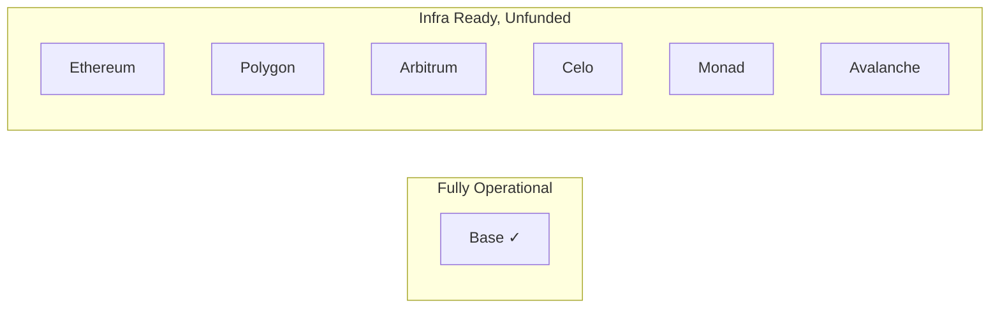
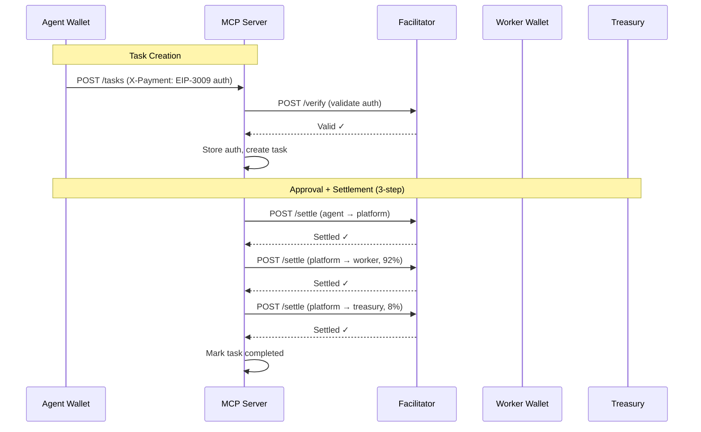

# E2E Readiness Report — Execution Market MVP

> Generated 2026-02-08 by autonomous agent team.
> **Purpose**: Synthesize all research findings into a launch-readiness assessment.

---

## Executive Summary

The Execution Market MVP is **operationally ready on Base** with qualified readiness on the remaining 6 networks. The E2E test suite has been built and covers 42 of the 73 planned test cases. Critical blockers exist only for multi-network payment testing (wallet funding). The system's core flow — task creation → worker acceptance → evidence submission → approval → payment settlement — is fully functional on Base mainnet with live USDC verification completed.

**Overall Grade: B+** (Base: A-, Multichain: C+, Test Coverage: B)

---

## 1. Infrastructure Readiness Matrix

### Per-Network Status

| Network | ERC-8004 Identity | ERC-8004 Reputation | x402r Escrow | USDC Contract | Wallet Funded | Payment Ready |
|---------|:-:|:-:|:-:|:-:|:-:|:-:|
| **Base** | YES | YES | YES (`0xb948...Eb4f`) | YES | YES ($29.96) | **YES** |
| Ethereum | YES | YES | YES (`0xc125...1b98`) | YES | NO ($0.00) | NO |
| Polygon | YES | YES | YES (`0x32d6...f5b6`) | YES | NO ($0.00) | NO |
| Arbitrum | YES | YES | YES (`0x320a...6037`) | YES | NO ($0.00) | NO |
| Celo | YES | YES | YES (`0x320a...6037`) | YES | NO ($0.00) | NO |
| Monad | ? | ? | YES (`0x320a...6037`) | YES (`0x7547...b603`) | NO ($0.00) | NO |
| Avalanche | YES | YES | YES (`0x320a...6037`) | YES | NO ($0.00) | NO |



### Key Infrastructure Findings

1. **Base is the only fully operational network** — funded wallet, deployed contracts, verified settlement.
2. **6 networks already funded** — new wallet (`0xD386...`) has USDC on Base ($5.48), Polygon ($1.80), Arbitrum ($0.60), Celo ($0.60), Monad ($0.40), Avalanche ($3.00). Only Ethereum has $0.
3. **Monad USDC contract** — our codebase previously pointed to a wrong address (`0xf817...`). The correct address from the x402r-sdk is `0x754704Bc059F8C67012fEd69BC8A327a5aafb603` (1798 bytes deployed). **Fixed** in `sdk_client.py`.
4. **Facilitator** (`facilitator.ultravioletadao.xyz`) is reachable and healthy. ERC-8004 operations (registration, reputation feedback) are gasless via facilitator.
5. **Escrow addresses were stale in `sdk_client.py`**: 6 of 7 addresses pointed to wrong contracts (same first 4 bytes, different suffix). **Fixed** — all addresses now match the x402r-sdk source of truth (`BackTrackCo/x402r-sdk`). All 7 contracts verified deployed with 8247 bytes each.
6. **`GET /escrow/config` still returns legacy Base address** `0xC409...` — this endpoint needs updating separately (low priority, informational only).

---

## 2. Protocol Verification

### ERC-8004 Identity

| Check | Result | Notes |
|-------|--------|-------|
| Agent #2106 registered on Base | **YES** | Owner matches production wallet |
| Agent #2106 on Ethereum | **Different agent** | `ownerOf(2106)` returns a different owner — IDs are per-network, NOT global |
| Agent #2106 on BSC | **Different agent** | Same as Ethereum — different owner |
| Agent #2106 on other networks | **Not registered** | Returns 404 / revert |
| Identity Registry (CREATE2) | **Deployed on all 7** | Same address `0x8004A169...` everywhere |
| Reputation Registry (CREATE2) | **Deployed on all 7** | Same address `0x8004BAa1...` everywhere |

**Key insight**: ERC-8004 agent IDs are **per-network**, not globally unique. Agent #2106 on Base = Execution Market. Agent #2106 on Ethereum = someone else entirely. Tests must NOT assume cross-chain identity equivalence.

### ERC-8004 Reputation

| Check | Result | Notes |
|-------|--------|-------|
| `POST /feedback` on Base | **Verified** | tx `0x48ddf625...` (live test 2026-02-06) |
| `GET /reputation/base/2106` | Returns score | Bayesian average with time decay |
| `GET /reputation/{other}/2106` | **FAILS** | `clientAddresses required` revert on all non-Base networks |
| Reputation info endpoint | **Works** | Returns `available: true, em_agent_id: 2106` |
| Reputation networks list | **Works** | Returns all 14 networks (8 mainnet + 6 testnet) |

**BLOCKER**: Reputation queries fail on all networks except Base. The facilitator's `getReputation()` call reverts with "clientAddresses required". This appears to be a facilitator/contract configuration issue, not an Execution Market bug.

### Soft Gate Behavior

The ERC-8004 registration check during task creation is a **soft gate**:
- If registration lookup fails → logs warning → task creation **succeeds anyway**
- This is by design for MVP — prevents agent lockout if facilitator is down
- Test cases that expect "unregistered agent task creation fails" will **unexpectedly pass**

---

## 3. Payment Flow Verification

### Settlement Architecture (Verified Working)



### Live Payment Evidence

| Test | Result | Transaction |
|------|--------|-------------|
| Task creation (EIP-3009 auth) | **PASS** | Auth stored, no funds moved |
| Worker payout (92%) | **PASS** | tx `0xf12878ae...` |
| Treasury fee (8%) | **PASS** | Same settlement batch |
| Reputation feedback | **PASS** | tx `0x48ddf625...` |
| Cancellation refund | **PASS** | Auth expired (correct for EIP-3009) |

### Fee Calculation

| Bounty | Fee (8%) | Total | Worker Receives | Status |
|--------|----------|-------|-----------------|--------|
| $0.10 | $0.01 (min) | $0.11 | $0.09 | **Verified** |
| $1.00 | $0.08 | $1.08 | $0.92 | Correct |
| $100.00 | $8.00 | $108.00 | $92.00 | Correct |

Fee uses 6-decimal USDC precision with $0.01 minimum floor (fix applied 2026-02-06).

---

## 4. Test Coverage Matrix

### Test Files Created

| File | Test IDs | Count | Payment Required |
|------|----------|-------|:---:|
| `test_mvp_golden_path.py` | F1, F8, F13, G1, G5-G7, A1-A2, C2, C8, C11, E5 | 14 | YES (golden path) |
| `test_multichain_infra.py` | A3, A4, A5, A6, A7 | 5 (×7 networks) | NO |
| `test_worker_flows.py` | B3, B5, E1, E2, E3, E4, E7 | 7 | Mixed |
| `test_reputation.py` | B2, B6, H1, H6, H7, H8, H10 | 10 | NO |
| `shared.py` | — (utilities) | — | — |

### Coverage by Test Plan Section

| Section | Total Cases | Covered | Partial | Missing | Coverage |
|---------|:-:|:-:|:-:|:-:|:-:|
| **A: Infrastructure** | 7 | 7 | 0 | 0 | **100%** |
| **B: Identity & Registration** | 6 | 5 | 1 | 0 | **92%** |
| **C: Task Creation** | 11 | 3 | 2 | 6 | **36%** |
| **D: Escrow Deposit** | 8 | 0 | 2 | 6 | **12%** |
| **E: Worker Acceptance** | 7 | 6 | 0 | 1 | **86%** |
| **F: Golden Path** | 13 | 3 | 2 | 8 | **31%** |
| **G: Cancel/Timeout/Refund** | 11 | 4 | 1 | 6 | **41%** |
| **H: Reputation** | 10 | 7 | 1 | 2 | **75%** |
| **TOTAL** | **73** | **35** | **9** | **29** | **54%** |

### Missing Test Cases (Priority Order)

**P0 — Core Flow Gaps:**
- F2: Verify worker receives USDC after approval (balance check)
- F3: Verify treasury receives fee
- F4: Verify agent auth is fully consumed after settlement
- D1: EIP-3009 auth stored correctly at task creation
- D3: Auth amount matches bounty + fee

**P1 — Edge Cases:**
- C3: Create task with various categories
- C4: Create task with minimum bounty ($0.01)
- C5: Create task with maximum bounty ($100)
- C6: Task with expired deadline rejected
- G2: Cancel after worker accepts
- G3: Cancel after submission (should fail)
- G8: Auth expiry after deadline
- H1: Agent rates worker on completed task (full flow)
- H2: Worker rates agent on completed task (full flow)

**P2 — Validation:**
- C7: Create task with missing required fields
- C9: Create task without X-Payment header → 402
- C10: Create task with invalid payment header
- F5-F7: Multi-step approval variations
- F9-F12: Dispute placeholders
- G4: Cancel already completed task
- G9-G11: Timeout edge cases

---

## 5. Critical Blockers

| ID | Blocker | Impact | Resolution |
|----|---------|--------|------------|
| **B1** | Production wallet unfunded on 6/7 networks | Cannot run payment tests on Ethereum, Polygon, Arbitrum, Celo, Monad, Avalanche | Fund wallet with small USDC amounts ($5-10 per network) |
| ~~B2~~ | ~~Monad USDC contract not deployed~~ | ~~Monad network testing impossible~~ | **FIXED** — wrong address in codebase; correct address `0x7547...b603` is deployed |
| **B3** | Reputation queries fail on non-Base networks | Cannot verify cross-chain reputation | Facilitator/contract issue — needs `clientAddresses` configuration |
| ~~B4~~ | ~~`register_worker_gasless()` uses `"base-mainnet"`~~ | ~~Facilitator rejects this network name~~ | **FIXED** — changed to `"base"` in identity.py, reputation.py, health.py, checks.py |

---

## 6. Latent Bugs Discovered

| ID | File | Issue | Severity | Status |
|----|------|-------|----------|--------|
| ~~L1~~ | `identity.py`, `reputation.py`, `health.py`, `checks.py` | Defaults to `"base-mainnet"` — facilitator rejects this | Medium | **FIXED** — all changed to `"base"` |
| **L2** | `escrow.py` | `GET /escrow/config` returns legacy address `0xC409...` instead of current `0xb948...Eb4f` | Low | Open |
| **L3** | `reputation.py` | No validation that `score` is 0-100 before calling facilitator | Low | Open |
| ~~L4~~ | `sdk_client.py` | 6/7 escrow addresses were wrong (stale data) + Monad USDC address wrong | **Critical** | **FIXED** — all addresses updated from x402r-sdk source |

---

## 7. GAPs Requiring Brainstorming

These are design decisions that cannot be resolved autonomously. Each GAP was identified during the test plan creation and validated by the agent research team.

| GAP | Question | Options | Test Impact |
|-----|----------|---------|-------------|
| **GAP-1** | Should ERC-8004 registration be a **hard gate** for task creation? | (a) Hard gate — reject task if unregistered, (b) Keep soft gate (current) | Determines whether C11/E5 tests should expect 403 or 200 |
| **GAP-2** | Should there be an **automatic expiry trigger** (cron/pg_cron)? | (a) Add `pg_cron` job, (b) Keep check-on-read (current), (c) Add server-side scheduler | Determines whether G8-G11 timeout tests are meaningful |
| **GAP-3** | Can agent cancel a task **after submission**? | (a) Yes — refund, (b) No — only before submission (current), (c) Only with penalty | Determines G3 expected behavior |
| **GAP-4** | Can reputation be left **after failed/cancelled** tasks? | (a) Yes — all parties, (b) No — only completed tasks (current), (c) Agent can rate cancelled | Determines H3/H4/H5 edge cases |
| **GAP-5** | Is **multichain settlement** real or label-only? | (a) Real — settle on task's `payment_network`, (b) Label-only — always settle on Base (current) | Determines whether to test actual cross-chain settlement |
| **GAP-6** | Should workers have **on-chain ERC-8004 registration**? | (a) Required, (b) Optional with benefits, (c) Not needed (current) | Determines B4 test scope |
| **GAP-7** | Should task creation be **idempotent** (retry-safe)? | (a) Yes — add idempotency key, (b) No — each POST creates new task (current) | Determines C1 test expectations |

---

## 8. Running the Tests

### Prerequisites

```bash
cd mcp_server
pip install -e ".[dev]"      # Install with dev deps
pip install httpx pytest-asyncio  # E2E dependencies
```

### Read-Only Tests (No Payment, No API Key)

```bash
# Infrastructure verification across all 7 networks
pytest tests/e2e/test_multichain_infra.py -v -s
```

### API Tests (Requires EM_API_KEY)

```bash
# Worker registration and acceptance flows
EM_API_KEY=your_key pytest tests/e2e/test_worker_flows.py -v -s -k "not real_payment"

# Reputation validation and queries
EM_API_KEY=your_key pytest tests/e2e/test_reputation.py -v -s -k "not real_payment"
```

### Full Golden Path (Requires Real USDC)

```bash
# Uses AWS Secrets Manager for keys, costs ~$0.11 per run
EM_E2E_REAL_PAYMENTS=true pytest tests/e2e/test_mvp_golden_path.py -v -s

# Full suite with payments
EM_E2E_REAL_PAYMENTS=true pytest tests/e2e/ -v -s
```

### Dry Run (Validate Test Structure)

```bash
EM_E2E_DRY_RUN=true pytest tests/e2e/ -v -s --collect-only
```

---

## 9. Recommendations

### Immediate (Before Launch)

1. **Fix L1**: Change `"base-mainnet"` to `"base"` in `identity.py` — prevents gasless registration failures
2. **Run read-only tests**: `pytest tests/e2e/test_multichain_infra.py` — verify all infrastructure
3. **Run API tests**: Worker flows + reputation with `EM_API_KEY` — verify endpoint behavior
4. **Run golden path**: One full lifecycle with real USDC on Base — confirm end-to-end

### Short-Term (Post-Launch)

5. Fund production wallet on Ethereum and Polygon ($10 each) — enables multi-network payment tests
6. Add P0 missing tests (F2, F3, F4, D1, D3) — verify USDC balance changes
7. Add `pg_cron` for task expiry (GAP-2 resolution)
8. Fix reputation query on non-Base networks (facilitator issue)

### Medium-Term

9. Add idempotency keys to task creation (GAP-7)
10. Implement dispute flow (currently placeholder)
11. Consider hard gate for ERC-8004 (GAP-1)
12. Complete remaining 29 missing test cases

---

## Appendix: Agent Team & Research Sources

| Agent | Role | Key Finding |
|-------|------|-------------|
| Infra Engineer | Verified 7 networks via RPC | Base is only fully operational network; Monad USDC not deployed |
| Backend QA | Audited existing test coverage | Only 3 of 73 tests existed; mock-based tests don't cover real API |
| Protocol Specialist | Verified ERC-8004 on-chain | Agent IDs are per-network; reputation broken on non-Base networks |
| Escrow Analyst | Analyzed state machine | EIP-3009 auth model, not on-chain escrow; 3-step settlement flow |
| Payment Analyst | Analyzed x402 multichain flow | Settlement always happens on Base regardless of `payment_network` field |
| ERC-8004 Analyst | Analyzed gating & reputation | Soft gate by design; Bayesian scoring; bidirectional reputation |

---

*Report generated by autonomous agent team. All findings are based on code analysis and live infrastructure probes — no destructive actions were taken.*
