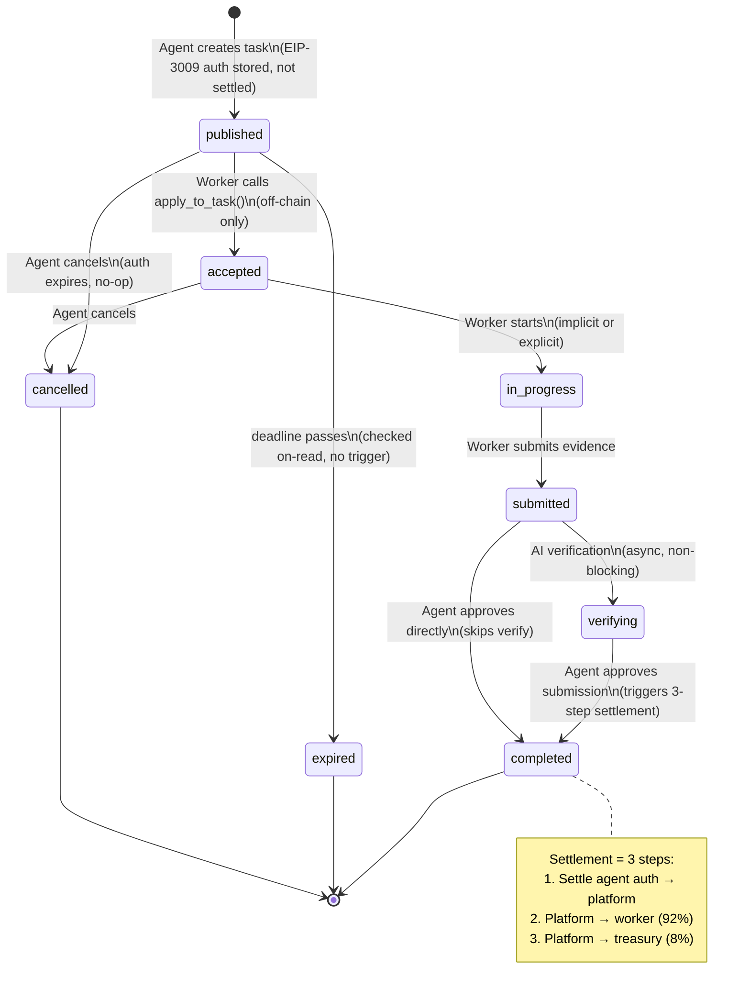

# E2E Test Plan — Execution Market MVP

> Generated 2026-02-08 from the ChatGPT testing prompt, validated against actual codebase.
> **Status**: DRAFT — Requires brainstorming session before executing any tests that reveal missing implementations.

---

## Part 0: Reality Check — What the Prompt Assumes vs What Exists

This section is **critical**. The testing prompt was brainstormed with ChatGPT and assumes an idealized architecture. The actual system differs in fundamental ways. Every test case below is tagged with its reality status.

### Architectural Mismatches

| # | ChatGPT Assumption | Actual Implementation | Impact on Testing |
|---|---|---|---|
| M1 | **On-chain escrow** holds funds in a smart contract | **EIP-3009 authorization** — funds stay in agent wallet; a cryptographic signature is stored off-chain; no funds move until settlement at approval | There is NO "deposit visible in escrow". No contract balance to check. No escrow events. |
| M2 | **Block timestamp** measures timeout | **Off-chain TIMESTAMPTZ** column in Supabase `tasks.deadline`, checked on-demand | No block-based timeout. No automatic expiry trigger. `expire_tasks()` RPC exists but has no cron. |
| M3 | **Acceptance generates on-chain tx** | **Purely off-chain** state change: `apply_to_task()` RPC updates Supabase row | No tx hash for acceptance. No on-chain event. |
| M4 | **ERC-8004 registration is a hard gate** for publishing | **Soft check** — task creation logs a warning but **succeeds** without registration | Test "publish unregistered agent, must fail" will unexpectedly PASS. |
| M5 | **Separate "mark complete" and "release" steps** | **Single action**: `POST /submissions/{id}/approve` triggers settlement + state change atomically | No separate mark-complete-then-release sequence. |
| M6 | **Active refund** moves funds back from escrow | **Authorization expires** — no funds were ever moved, nothing to return. For already-settled escrows, facilitator refund endpoint is called. | "Refund" for most cancelled tasks = no-op (auth expiry). |
| M7 | **Idempotent task creation** (retry returns same job) | **NOT idempotent** — each POST creates a new task with a new UUID | Retry test must expect a NEW task, not deduplication. |
| M8 | **Per-network payment execution** on all 7 chains | Payment `network` field is stored, but settlement uses the **platform wallet's configured network** (Base). Multichain is a routing label, not actual multi-settlement. | Testing "on Polygon" vs "on Base" = same server code, different `payment_network` field value. |
| M9 | **Multiple deposits per job** | **One EIP-3009 auth per task**, stored at creation. No stacking. | Question resolved: exactly 1 deposit per job. |
| M10 | **Facilitator pays gas for ALL on-chain actions** | Facilitator pays for: registration, reputation, settlement. But the platform wallet signs EIP-3009 auths for disbursement — the facilitator executes them. | Wallets need USDC balance but NOT native gas tokens. |

### State Machine — Actual vs Assumed



**Key transitions NOT in the system:**
- No `disputed` state transitions (placeholder only)
- No `refunded` as a distinct terminal state (cancelled covers it)
- No "release before mark complete" — they're atomic
- No "refund after timeout" — auth just expires

---

## Part 1: Open Questions — MUST RESOLVE Before Testing

These came from the original prompt and are now answered by code analysis:

| # | Question | Answer | Source |
|---|----------|--------|--------|
| Q1 | Timeout: block timestamp or off-chain? | **Off-chain** `TIMESTAMPTZ` in `tasks.deadline` | `001_initial_schema.sql` |
| Q2 | Timeout default value? | **Set by agent** via `deadline_hours` (1-720h). No system default. | `models.py:PublishTaskInput.deadline_hours` |
| Q3 | Multiple deposits per job? | **No.** One EIP-3009 auth per task. | `routes.py:_insert_escrow_record()` |
| Q4 | Acceptance on-chain? | **No.** Off-chain Supabase state change only. | `supabase_client.py:apply_to_task()` |
| Q5 | Exact escrow states? | `authorized` → `released` or auth expires (cancelled) | `002_escrow_and_payments.sql` |
| Q6 | Who triggers each transition? | See table below | `routes.py` |
| Q7 | Bidirectional reputation? | **Yes.** `rate_worker()` + `rate_agent()` both implemented | `facilitator_client.py:746-831` |
| Q8 | Reputation fields per job? | `rating` (0-100), `stars` (0-5), `quality_score`, `speed_score`, `communication_score`, `category`, `task_value_usdc` | `003_reputation_system.sql` |
| Q9 | Global reputation accumulation? | **Bayesian average** with time decay: `Score = (15*50 + sum(r*w*d)) / (15 + sum(w*d))` | `003_reputation_system.sql:230-246` |
| Q10 | Wallet balance requirements? | USDC balance needed for signing EIP-3009 auths. NO native gas needed (facilitator pays). | `sdk_client.py` |
| Q11 | Idempotency keys? | **Task creation**: none (always new). **Approval**: checks `agent_verdict` field (idempotent). **Refund**: checks `escrow.status` (idempotent). | `routes.py` |

### Transition Authorization Table

| Transition | Who | Endpoint | On-chain? |
|---|---|---|---|
| Create task | Agent (API key) | `POST /api/v1/tasks` | No (auth stored) |
| Accept task | Worker (executor_id) | `POST /api/v1/tasks/{id}/apply` | No |
| Submit work | Worker (executor_id) | `POST /api/v1/tasks/{id}/submit` | No |
| Approve + pay | Agent (API key) | `POST /api/v1/submissions/{id}/approve` | **Yes** (3 txs via facilitator) |
| Cancel + refund | Agent (API key) | `POST /api/v1/tasks/{id}/cancel` | Depends on escrow state |
| Rate worker | Agent (API key) | `POST /api/v1/reputation/workers/rate` | **Yes** (via facilitator) |
| Rate agent | Worker (public) | `POST /api/v1/reputation/agents/rate` | **Yes** (via facilitator) |

---

## Part 2: Test Cases — Corrected for Reality

### Legend

- **[VALID]** = Test matches implementation, ready to execute
- **[MODIFIED]** = Test concept valid but adapted to actual architecture
- **[INVALID]** = Test assumes non-existent behavior, replaced or removed
- **[GAP]** = Reveals missing implementation, needs brainstorming before action
- **[DECISION]** = Requires product decision, not a bug

---

### A) Infrastructure Verification (per network)

**Networks to test**: base, ethereum, polygon, arbitrum, celo, monad, avalanche

| ID | Test | Status | Expected | Notes |
|---|---|---|---|---|
| A1 | Confirm `GET /health` returns healthy | [VALID] | 200 + `{"status": "healthy"}` | Single API, all networks served by same server |
| A2 | Confirm `GET /api/v1/config` lists all 7 networks | [VALID] | `supported_networks` includes all 7 | Field: `EM_ENABLED_NETWORKS` |
| A3 | Confirm ERC-8004 Identity Registry address per network | [VALID] | `0x8004A169FB4a3325136EB29fA0ceB6D2e539a432` (CREATE2, same on all mainnets) | Check via facilitator `GET /identity/{network}/{agentId}` |
| A4 | Confirm x402r escrow contract per network | [MODIFIED] | See contract table in CLAUDE.md. Base/Ethereum/Polygon have unique addresses; Arbitrum/Celo/Monad/Avalanche share one. | These contracts exist but EM uses EIP-3009 auth, not direct escrow deposits |
| A5 | Confirm facilitator reachability | [VALID] | `POST /verify` returns 200 with valid signature | `https://facilitator.ultravioletadao.xyz` |
| A6 | Confirm USDC token address per network | [VALID] | Check `NETWORK_CONFIG` in `sdk_client.py` | Each network has a different USDC address |
| A7 | Confirm platform wallet has USDC on each enabled network | [MODIFIED] | Only need USDC on networks where tasks will be created. Production wallet `0x3403` has ~$30 on Base. | **Other networks may not be funded yet** — this test will surface funding gaps |

**Evidence**: Table of `network → RPC status → ERC-8004 verified → USDC address → facilitator response`

---

### B) Registration & Gating (ERC-8004)

| ID | Test | Status | Expected | Notes |
|---|---|---|---|---|
| B1 | Create task WITHOUT agent ERC-8004 registration | [GAP] | **Currently SUCCEEDS** (soft check). Prompt expects FAILURE. | **DECISION NEEDED**: Should registration be a hard gate? |
| B2 | Register agent on Base via facilitator | [VALID] | `POST /register` returns tx hash. Agent #2106 already registered. | Agent #2106 already exists — test is verify, not create |
| B3 | Register worker off-chain | [VALID] | `POST /api/v1/executors/register` returns executor record | Off-chain only, creates Supabase row |
| B4 | Register worker on-chain (optional) | [VALID] | `POST /api/v1/reputation/register` returns tx hash. Facilitator pays gas. | Uses `register_worker_gasless()` |
| B5 | Verify worker cannot apply without off-chain registration | [VALID] | `POST /tasks/{id}/apply` fails if executor_id not in DB | Hard requirement in `apply_to_task()` RPC |
| B6 | Verify agent identity lookup via facilitator | [VALID] | `GET /identity/{network}/2106` returns agent metadata | On all 14 networks via CREATE2 |

**GAP B1 — Hard vs Soft Gating**:
The prompt says "agent must be registered before publishing". The code does a soft check (lines 1536-1564 in `routes.py`). Options:
1. **Keep soft** (current) — registration is encouraged but not enforced
2. **Make hard** — add `if not registered: raise HTTPException(403)` — needs code change
3. **Defer** — document as known gap, test the current behavior

---

### C) Task Creation via API (MCP uses same backend)

| ID | Test | Status | Expected | Notes |
|---|---|---|---|---|
| C1 | Create task with valid X-Payment header (Base) | [VALID] | 201 + task_id + escrow status `authorized` | Existing E2E test: `test_create_task_with_real_payment` |
| C2 | Create task WITHOUT X-Payment header | [VALID] | **402 Payment Required** with `required_amount_usd` | Existing E2E test: `test_402_payment_required` |
| C3 | Create task with invalid X-Payment signature | [VALID] | 402 or 400 with verification error | Facilitator rejects invalid sig |
| C4 | Verify task_id is a stable UUID | [VALID] | UUID v4 format in response | DB generates via `gen_random_uuid()` |
| C5 | Verify escrow record created with auth metadata | [VALID] | `escrows` table has row with `status=authorized`, `metadata.x_payment_header` populated | Check via admin API or direct DB query |
| C6 | Retry create task (idempotency) | [MODIFIED] | **Creates a NEW task** (not idempotent). Each call = new UUID + new escrow. | Original prompt expected deduplication — does not exist |
| C7 | Create task with `payment_network=polygon` | [VALID] | Task created with `payment_network=polygon` field stored | Tests multichain label, not multichain settlement |
| C8 | Create task with unsupported network | [VALID] | 400 error — network not in `EM_ENABLED_NETWORKS` | Validation in `routes.py` |
| C9 | Create task via MCP tool `em_publish_task` | [VALID] | Same outcome as REST API | MCP tools call same backend functions |
| C10 | Verify deadline is stored correctly | [VALID] | `deadline = now + deadline_hours` as TIMESTAMPTZ | |
| C11 | Create task with `bounty_usd` below minimum | [VALID] | 400 error | `get_min_bounty()` → default $0.01 |

**Cost per test**: ~$0.01-$0.27 per creation (depends on bounty). Auth stored but NOT settled.

---

### D) Payment Verification (NOT "deposit to escrow")

| ID | Test | Status | Expected | Notes |
|---|---|---|---|---|
| D1 | Verify EIP-3009 auth is cryptographically valid | [VALID] | Facilitator `/verify` returns success | Called during task creation |
| D2 | Verify NO funds moved at task creation | [MODIFIED] | Agent wallet balance unchanged after task creation | **This is the key difference from the prompt's assumption** |
| D3 | Verify escrow record metadata contains full X-Payment header | [VALID] | `escrows.metadata.x_payment_header` is populated | Needed for later settlement |
| D4 | Verify auth amount matches bounty + fee | [VALID] | Facilitator verification confirms amount | |
| D5 | ~~Verify escrow contract balance increased~~ | [INVALID] | **N/A — no contract deposit** | Removed: no on-chain escrow balance to check |
| D6 | ~~Verify deposit events~~ | [INVALID] | **N/A — no deposit tx** | Removed: no on-chain events at creation |
| D7 | ~~Retry payment, verify no double deposit~~ | [MODIFIED] | Each task creation stores a separate auth. No "double deposit" risk because no deposit occurs. | |

---

### E) Worker Acceptance

| ID | Test | Status | Expected | Notes |
|---|---|---|---|---|
| E1 | Worker applies to published task | [VALID] | Task status → `accepted`, `executor_id` set | Via `POST /api/v1/tasks/{id}/apply` |
| E2 | Second worker tries to apply | [VALID] | Should fail — task already accepted | `apply_to_task()` RPC checks status |
| E3 | Worker applies to expired task | [VALID] | Should fail | Deadline check |
| E4 | Worker applies to cancelled task | [VALID] | Should fail | Status check |
| E5 | Unregistered worker tries to apply | [VALID] | Should fail — executor not in DB | |
| E6 | ~~Verify on-chain acceptance event~~ | [INVALID] | **N/A — acceptance is off-chain only** | Removed |
| E7 | Verify acceptance window (task stays `published` until worker applies) | [VALID] | Task in `published` state is open for any registered worker | |

---

### F) Success Scenario — Completion & Payment

| ID | Test | Status | Expected | Notes |
|---|---|---|---|---|
| F1 | Full lifecycle: create → accept → submit → approve | [VALID] | Task reaches `completed` status | **This is the golden path test** |
| F2 | Verify 3-step settlement on approval | [VALID] | (1) Agent auth settled to platform, (2) Platform → worker (92%), (3) Platform → treasury (8%) | All gasless via facilitator |
| F3 | Verify worker receives correct USDC amount | [VALID] | `bounty * (1 - 0.08)` with 6-decimal precision, min $0.01 fee | Check on-chain balance |
| F4 | Verify treasury receives fee | [VALID] | `bounty * 0.08` to `0xae07...9012ad` | Non-blocking — fee failure doesn't block worker payment |
| F5 | Verify escrow status → `released` | [VALID] | `escrows.status = 'released'`, `released_at` set | |
| F6 | Verify payment record created | [VALID] | `payments` table has row with `type=release`, `tx_hash` populated | |
| F7 | Verify tx hashes are real on-chain | [VALID] | Check Base explorer for tx confirmation | |
| F8 | Double-approve same submission (idempotency) | [VALID] | Returns same tx hash, no double payment | Existing protection in `_settle_submission_payment` |
| F9 | Approve before worker submits evidence | [MODIFIED] | Should fail — no submission exists to approve | Agent needs a `submission_id` |
| F10 | ~~Release before acceptance~~ | [INVALID] | Not possible — "release" is part of approval, requires submission | No separate release step |
| F11 | ~~Release before mark complete~~ | [INVALID] | Same as above — merged into single action | |
| F12 | ~~Mark complete outside window~~ | [MODIFIED] | If task is `expired` or `cancelled`, approval returns 409 | |
| F13 | Self-payment attempt (agent wallet = worker wallet) | [VALID] | **BLOCKED** with "self-payment blocked" error | Protection in `routes.py:643-655` |

**Cost per test**: ~$0.01-$0.25 (actual USDC moves on approval)

---

### G) Timeout & Cancellation (Refund)

| ID | Test | Status | Expected | Notes |
|---|---|---|---|---|
| G1 | Cancel published task (no worker assigned) | [VALID] | Task → `cancelled`, escrow auth expires (no-op) | |
| G2 | Cancel accepted task (worker assigned but hasn't submitted) | [VALID] | Task → `cancelled`, worker loses assignment | |
| G3 | Cancel task with `submitted` status | [MODIFIED] | **Should it be allowed?** Needs product decision | Currently no explicit block in code |
| G4 | Verify "refund" for authorized escrow = auth expiry | [MODIFIED] | Escrow status stays `authorized` → marked `refunded` in DB. No on-chain action. | EIP-3009 auth has TTL, just expires |
| G5 | Verify agent wallet balance unchanged (no funds were taken) | [VALID] | Balance same as before task creation | Auth was never settled |
| G6 | Double-cancel same task | [VALID] | Returns `already_refunded` status (idempotent) | Protection in `cancel_task()` |
| G7 | Cancel after approval/release | [VALID] | Returns 409 — "escrow already released" | |
| G8 | ~~Wait for block timeout~~ | [INVALID] | **No block-based timeout**. Deadline is off-chain. | |
| G9 | Task with passed deadline — verify `expired` status on read | [MODIFIED] | When reading a task past its deadline, API should return `expired` status | **GAP**: `expire_tasks()` RPC exists but isn't auto-triggered |
| G10 | ~~Refund before timeout must fail~~ | [INVALID] | Agent can cancel **at any time** (no timeout required for cancellation) | Cancellation ≠ timeout-triggered refund |
| G11 | ~~Refund after release must fail~~ | Same as G7 | | |

**GAP G9 — Automatic Expiration**:
The system has no cron job or trigger to expire tasks. The `expire_tasks()` RPC function exists but isn't called automatically. Options:
1. **Manual expiration** — Admin or agent must call explicitly
2. **On-read expiration** — API marks tasks expired when reading if past deadline
3. **Add cron** — Scheduled task to run `expire_tasks()` periodically

---

### H) Reputation (ERC-8004)

| ID | Test | Status | Expected | Notes |
|---|---|---|---|---|
| H1 | Agent rates worker after successful task | [VALID] | `POST /api/v1/reputation/workers/rate` returns tx hash | On-chain via facilitator, gasless |
| H2 | Worker rates agent after successful task | [VALID] | `POST /api/v1/reputation/agents/rate` returns tx hash | Public endpoint, no auth required |
| H3 | Verify reputation tags on-chain | [VALID] | `tag1=worker_rating`, `tag2=address[:10]` (or `agent_rating`, `execution-market`) | Via facilitator feedback mechanism |
| H4 | Verify reputation associated with task_id | [VALID] | `endpoint=task:{task_id}` in on-chain feedback | |
| H5 | Verify Bayesian score updates in Supabase | [VALID] | `reputation_log` entry + updated `executors.reputation_score` | Off-chain calculation |
| H6 | Verify gasless — no native token spent | [VALID] | Worker and agent wallet gas balances unchanged | Facilitator pays all gas |
| H7 | Rate worker on task that worker didn't complete | [VALID] | Should fail — task not completed or agent doesn't own task | |
| H8 | Rate agent on task that's still published | [VALID] | Should fail — validation checks task status | |
| H9 | ~~Reputation after timeout~~ | [MODIFIED] | After cancellation/expiry, rating should still be possible? | **DECISION NEEDED**: Can you rate after a failed task? |
| H10 | Verify reputation accumulates globally | [VALID] | Query `GET /reputation/{network}/2106` shows cumulative score | Via facilitator |

---

## Part 3: Execution Matrix

### Two-Wallet Test Configuration

| Wallet | Address | Source | Roles |
|---|---|---|---|
| **Wallet A** (Production) | `0x34033041a5944B8F10f8E4D8496Bfb84f1A293A8` | AWS Secrets Manager `em/x402:PRIVATE_KEY` | Agent (creates tasks, approves submissions) |
| **Wallet B** (Dev) | `0x857fe6150401bFB4641Fe0D2B2621cc3B05543Cd` | `.env.local:WALLET_PRIVATE_KEY` | Worker (accepts tasks, submits evidence) |

### Per-Network Test Execution

**Important**: Since the system uses EIP-3009 authorization (not per-network escrow), the "per-network" distinction is:
- Different `payment_network` field in the task
- Different USDC contract address in the auth signature
- Same MCP server, same Supabase, same facilitator

| Network | USDC Address | x402r Escrow | Wallet A Funded? | Test Priority |
|---|---|---|---|---|
| **base** | `0x833589fCD6eDb6E08f4c7C32D4f71b54bdA02913` | `0xb9488351...` | Yes (~$30) | **P0** (production) |
| ethereum | `0xA0b86991c6218b36c1d19D4a2e9Eb0cE3606eB48` | `0xc1256Bb3...` | **Check** | P1 |
| polygon | `0x3c499c542cEF5E3811e1192ce70d8cC03d5c3359` | `0x32d6AC59...` | **Check** | P1 |
| arbitrum | `0xaf88d065e77c8cC2239327C5EDb3A432268e5831` | `0x320a3c35...` | **Check** | P1 |
| celo | `0xcebA9300f2b948710d2653dD7B07f33A8B32118C` | `0x320a3c35...` | **Check** | P2 |
| monad | Monad USDC (check registry) | `0x320a3c35...` | **Check** | P2 |
| avalanche | `0xB97EF9Ef8734C71904D8002F8b6Bc66Dd9c48a6E` | `0x320a3c35...` | **Check** | P2 |

**P0**: Full lifecycle test (create → accept → submit → approve → rate)
**P1**: Create + cancel test (verify auth on that network works)
**P2**: Config verification only (unless funded)

---

## Part 4: Golden Path Script (Base Network)

This is the minimum viable E2E test that validates the complete happy path:

```
Step 1: [Wallet A] POST /api/v1/tasks
        Headers: Authorization: Bearer {API_KEY}, X-Payment: {EIP-3009 auth}
        Body: {title, instructions, category, bounty_usd: 0.10, deadline_hours: 1, evidence_required: ["text_response"], payment_network: "base"}
        Expected: 201, task_id, escrow.status = "authorized"
        Verify: Wallet A USDC balance unchanged

Step 2: [Wallet B] POST /api/v1/executors/register
        Body: {wallet_address: "0x857f...", display_name: "Test Worker"}
        Expected: 200, executor_id

Step 3: [Wallet B] POST /api/v1/tasks/{task_id}/apply
        Body: {executor_id, message: "Taking this task"}
        Expected: 200, task.status = "accepted"

Step 4: [Wallet B] POST /api/v1/tasks/{task_id}/submit
        Body: {executor_id, evidence: [{type: "text_response", content: "Done"}]}
        Expected: 200, submission_id

Step 5: [Wallet A] POST /api/v1/submissions/{submission_id}/approve
        Headers: Authorization: Bearer {API_KEY}
        Body: {verdict: "accepted", notes: "Good work"}
        Expected: 200, payment_tx (real Base tx hash)
        Verify: Wallet B USDC += bounty * 0.92
        Verify: Treasury USDC += bounty * 0.08
        Verify: escrow.status = "released"
        Verify: payments table has row with tx_hash

Step 6: [Wallet A] POST /api/v1/reputation/workers/rate
        Body: {task_id, worker_wallet: "0x857f...", score: 85}
        Expected: 200, reputation_tx (real Base tx hash)

Step 7: [Wallet B] POST /api/v1/reputation/agents/rate
        Body: {agent_id: 2106, task_id, score: 90}
        Expected: 200, reputation_tx (real Base tx hash)

Total cost: ~$0.11 ($0.10 bounty + $0.008 fee)
```

---

## Part 5: Negative Path Script (Base Network)

```
Step N1: [Wallet A] Create task (same as Step 1)
Step N2: [Wallet A] POST /tasks/{task_id}/cancel
         Expected: 200, escrow.status = "refunded" (auth expires)
         Verify: Wallet A USDC unchanged

Step N3: [Wallet A] POST /tasks/{task_id}/cancel (double cancel)
         Expected: 200, status = "already_refunded" (idempotent)

Step N4: Create new task → accept → submit → approve → then try cancel
         Expected: 409 "escrow already released"

Step N5: [Wallet A] Create task with bounty_usd: 0.001 (below minimum)
         Expected: 400 error

Step N6: [Wallet B as agent] Try approve own submission (self-payment)
         Expected: blocked with "self-payment blocked"
```

---

## Part 6: GAPs Requiring Brainstorming

These are issues discovered during analysis that need product decisions before testing or implementation:

| GAP | Issue | Options | Recommendation |
|---|---|---|---|
| **GAP-1** | Agent registration is not a hard gate | (a) Keep soft, (b) Make hard, (c) Defer | (b) Make hard — aligns with spec |
| **GAP-2** | No automatic task expiration | (a) On-read expiry, (b) Cron job, (c) Manual only | (b) Cron via Supabase pg_cron or ECS scheduled task |
| **GAP-3** | Can agent cancel a `submitted` task? | (a) Allow, (b) Block after submission | (b) Block — worker already did the work |
| **GAP-4** | Can you rate after task failure? | (a) Yes, (b) Only after completion | **Discuss** — rating a worker who timed out could be useful |
| **GAP-5** | Multichain payment execution | Currently all settlement goes through Base. Is per-network settlement needed for MVP? | **Discuss** — may only need Base for MVP launch |
| **GAP-6** | Worker on-chain ERC-8004 registration | Optional today. Should it be required for accepting tasks? | (a) Keep optional for MVP |
| **GAP-7** | Task creation idempotency | No dedup key exists. Should we add one? | Defer — agents can check task list before creating |

---

## Part 7: Evidence Template

For each test execution, record:

```markdown
### Test [ID] — [Description]
- **Network**: base / ethereum / polygon / ...
- **Wallet A action**: [endpoint + result]
- **Wallet B action**: [endpoint + result]
- **Task ID**: uuid
- **Submission ID**: uuid (if applicable)
- **TX Hashes**:
  - Settlement: 0x...
  - Worker payment: 0x...
  - Fee payment: 0x...
  - Reputation (worker): 0x...
  - Reputation (agent): 0x...
- **Escrow state**: authorized → released / refunded
- **USDC balances** (before/after):
  - Wallet A: $X → $Y
  - Wallet B: $X → $Y
  - Treasury: $X → $Y
- **Result**: PASS / FAIL
- **Notes**: ...
```

---

## Part 8: Existing E2E Tests

The codebase already has E2E tests that partially cover this plan:

| File | Coverage | How to Run |
|---|---|---|
| `mcp_server/tests/e2e/test_real_payment.py` | Health, A2A card, config, 402, task creation with real payment | `EM_E2E_REAL_PAYMENTS=true pytest tests/e2e/test_real_payment.py -v` |
| `mcp_server/tests/e2e/test_escrow_flows.py` | Escrow lifecycle scenarios | `pytest tests/e2e/test_escrow_flows.py -v` |

**Gap in existing tests**: No tests for worker acceptance, submission, approval+settlement, cancellation, or reputation. The golden path (F1) is NOT covered end-to-end in automated tests.

---

## Summary — Test Count

| Section | Valid | Modified | Invalid/Removed | Gap/Decision | Total |
|---|---|---|---|---|---|
| A: Infrastructure | 5 | 2 | 0 | 0 | 7 |
| B: Registration | 4 | 0 | 0 | 2 | 6 |
| C: Task Creation | 9 | 1 | 0 | 1 | 11 |
| D: Payment Verification | 4 | 1 | 3 | 0 | 8 |
| E: Worker Acceptance | 5 | 0 | 2 | 0 | 7 |
| F: Success Path | 8 | 2 | 3 | 0 | 13 |
| G: Timeout/Refund | 4 | 2 | 3 | 2 | 11 |
| H: Reputation | 8 | 1 | 0 | 1 | 10 |
| **Total** | **47** | **9** | **11** | **6** | **73** |

- **47 tests** ready to execute now
- **9 tests** adapted from original prompt (behavior differs)
- **11 tests** removed (assumed non-existent features)
- **6 items** need product decisions before testing
