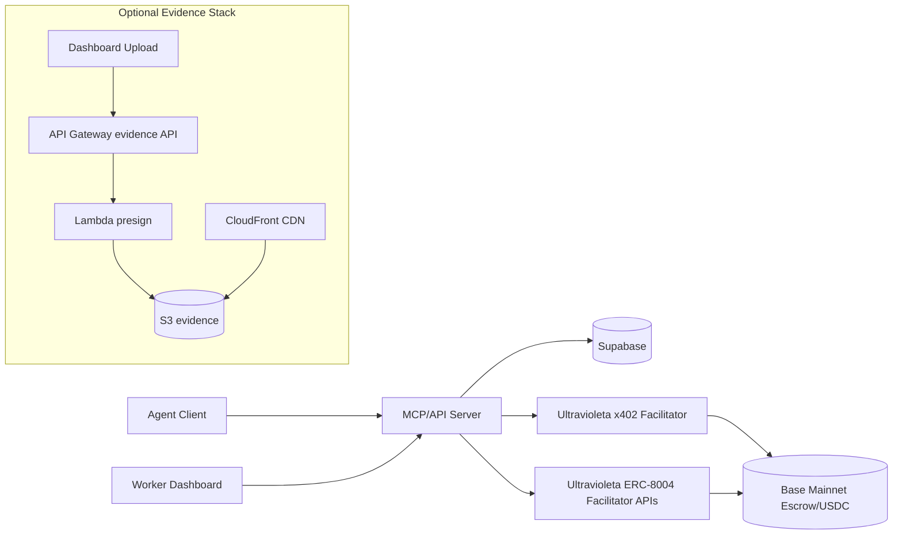
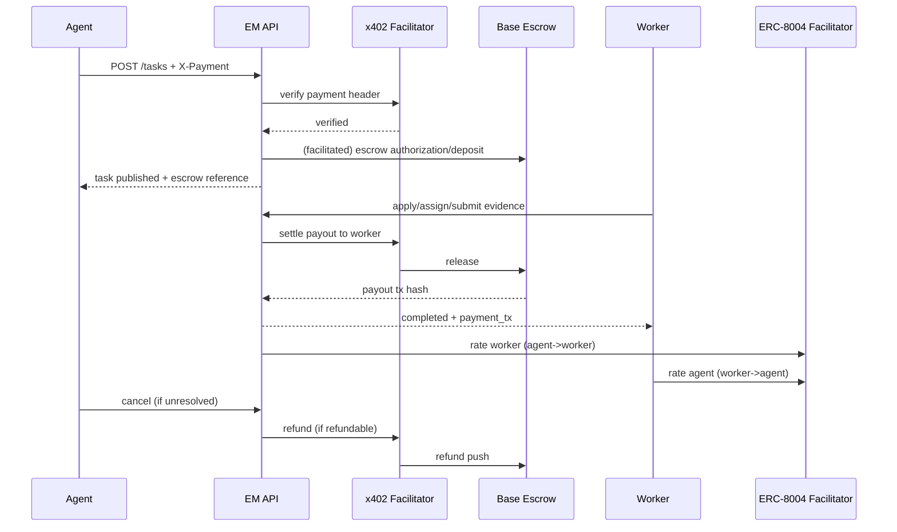

# Execution Market System Map and Launch Plan (2026-02-06)

## Goal
Ship a production flow where **all critical lifecycle transactions** are auditable and facilitator-driven on Base:
- task funding authorization/deposit via x402 facilitator,
- worker payout via facilitator,
- refund via facilitator when applicable,
- identity/reputation operations via facilitator-backed ERC-8004 endpoints.

## Current Architecture Map



## Canonical Task Flow (Target)



## Reality Check (Codebase Snapshot)

## Working now
- `create_task` verifies x402 payment via SDK/facilitator and stores escrow references.
- `submit_work` attempts instant payout and auto-approve on successful settlement.
- `approve_submission` is idempotent and retries settlement safely.
- `cancel_task` already distinguishes authorization-expiry vs refundable states.
- Bidirectional reputation endpoints exist:
  - `POST /api/v1/reputation/workers/rate`
  - `POST /api/v1/reputation/agents/rate`

## Gaps to close before launch confidence
- ERC-8004 defaults are still Ethereum-first in integration docs/code paths; Base-first policy is not fully enforced.
- Worker/agent identity registration is not integrated into the runtime onboarding flow (registration endpoint is DB-only).
- Some script paths still allow non-canonical DB fallback for degraded environments.
- Live schema drift remains a risk for escrow/payment metadata persistence.
- Evidence storage is not standardized on managed AWS pipeline yet.

## Priority Backlog

## P0 (ship blockers)
- `P0-PAY-001` Enforce facilitator-only settlement/refund evidence in release scripts.
  - DoD: release validation report always contains tx hash or explicit blocker reason.
- `P0-PAY-002` Persist canonical payment linkage for every completed submission (`submission.payment_tx` + task payment timeline).
  - DoD: worker and agent task detail show funding + payout tx/reference.
- `P0-ERC-001` Base-first ERC-8004 runtime config.
  - DoD: default network for facilitator reputation/identity API is Base unless explicitly overridden.
- `P0-ERC-002` Integrate identity check/registration hook in executor onboarding.
  - DoD: on register/login, system can verify identity state and queue/create facilitator-backed registration if missing.
- `P0-EVID-001` Deploy managed evidence stack (`API Gateway -> Lambda -> S3 -> CloudFront`).
  - DoD: dashboard can request presigned upload URL and serve evidence via CDN URL.
- `P0-VAL-001` Run rapid live scenario with minute-scale tasks and strict evidence output.
  - DoD: at least 1 completed run with task id + escrow ref + payout tx/refund state.

## P1 (high value)
- `P1-PAY-003` Add race-condition integration tests: approve vs cancel, duplicate retries, stale submit.
- `P1-ERC-003` Auto-trigger worker->agent feedback prompt after payout confirmation.
- `P1-OBS-001` Add payment and evidence telemetry dashboard (success/failure, settle latency).
- `P1-EVID-002` Add signed download policy and optional malware/content scanning pipeline.

## P2 (hardening)
- `P2-PERF-001` Remove remaining legacy fallbacks once production schema is fully aligned.
- `P2-OPS-001` CI gate for live-like strict API flow in staging.
- `P2-SEC-001` WAF/rate-limits for evidence API and object-key abuse protections.

## What Was Added in This Iteration

- Terraform optional evidence stack:
  - `infrastructure/terraform/evidence.tf`
  - `infrastructure/terraform/lambda/evidence_presign.py`
- New Terraform inputs:
  - `enable_evidence_pipeline`
  - `evidence_bucket_name`
  - `evidence_allowed_origins`
  - `evidence_acm_certificate_arn`
  - `evidence_subdomain`
  - `evidence_retention_days`
  - `evidence_presign_expiry_seconds`
  - `evidence_max_upload_mb`
- Outputs for evidence bucket/CDN/API in `infrastructure/terraform/outputs.tf`.

## Validation Runbook (Final)

## 1) Terraform evidence stack
```bash
cd infrastructure/terraform
terraform fmt
terraform init
terraform plan -var="enable_evidence_pipeline=true"
```

## 2) Rapid x402 lifecycle (minute-scale)
```bash
cd scripts
npm exec -- tsx test-x402-rapid-flow.ts -- --count 1 --deadline 2 --auto-approve --run-refund-check
```

## 3) Strict full flow
```bash
cd scripts
npm exec -- tsx test-x402-full-flow.ts -- --count 1 --strict-api --monitor --auto-approve
```

## 4) Evidence API smoke (after terraform apply)
```bash
curl "<EVIDENCE_API_URL>/upload-url?taskId=test&submissionId=test&filename=proof.jpg&contentType=image/jpeg"
```

## 5) Acceptance checks
- Task creation response contains escrow reference fields.
- Submission/approval response contains `payment_tx` (or explicit blocker reason).
- Task payment endpoint shows timeline events (funding + payout/refund where applicable).
- Reputation endpoints can post both directions with matching task ownership constraints.
- Evidence upload URL generated and uploaded object is retrievable through CDN URL.

## Live Validation Evidence (2026-02-06)

## Run A
- Command:
`cd scripts && npm exec -- tsx test-x402-rapid-flow.ts -- --count 1 --deadline 2 --auto-approve --run-refund-check`
- Mode: `live`
- Wallet: `0x857fe6150401bFB4641Fe0D2B2621cc3B05543Cd`
- Task created: `3fadef2c-657f-4963-aaba-22a898f1f24c`
- Submission: `8a872260-c172-4469-83d2-c1a3e215b75b`
- Result:
  - final task status: `completed`
  - assignment path: `supabase-fallback`
  - submit path: `supabase-fallback`
  - `payment_tx`: missing
  - payout event tx: missing
- Refund check task: `d682a607-6b8a-494e-84b7-f8de6ac2352f`
  - cancel result: `authorization_expired`
  - refund tx: none

## Run B
- Command:
`cd scripts && npm exec -- tsx test-x402-full-flow.ts -- --count 1 --strict-api`
- Mode: `live`
- Task created: `6789cbf4-7ed0-4f7a-80c5-e368ca3fca30`
- Result:
  - task published successfully via API + facilitator verify
  - no settlement yet (expected; no worker completion in this run)

## Run C
- Command:
`cd scripts && npm exec -- tsx test-x402-full-flow.ts -- --count 1 --strict-api --auto-approve --monitor-timeout 1`
- Mode: `live`
- Task created: `e6061f3f-d36d-434f-baec-cadf6f863b02`
- Result:
  - monitor exits deterministically after 1 minute (new timeout guard)
  - no settlement (task remained `published`)

## Blockers confirmed by evidence
- No canonical payout tx is emitted yet in the rapid completed path.
- Fallback paths (`supabase-fallback`) are still active in production validation loops.
- Cancellation currently resolves mostly as authorization-expiry unless funds are already deposited.
