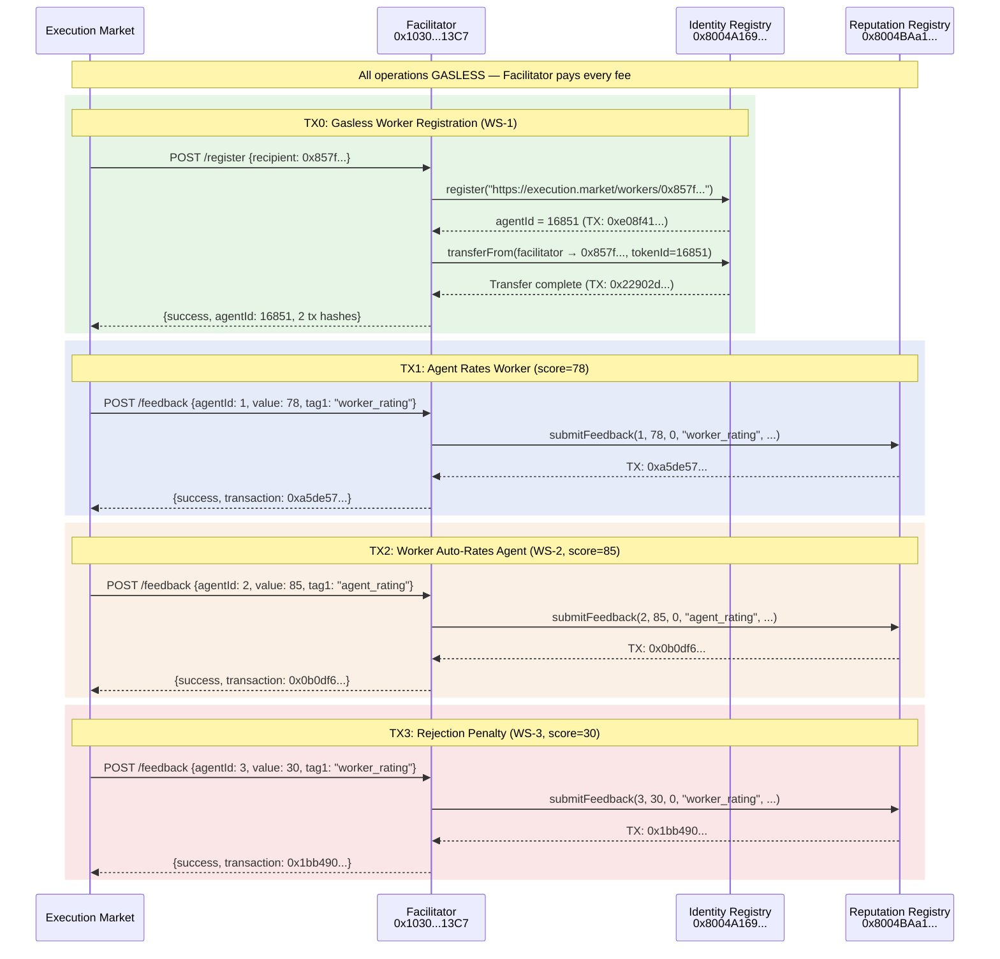

# ERC-8004 E2E Test Evidence — 2026-02-11

## On-Chain Transaction Summary (Base Mainnet)

**5 real transactions executed on Base Mainnet. ALL gasless — Facilitator paid every fee.**

| # | Operation | TX Hash | BaseScan | Status |
|---|-----------|---------|----------|--------|
| TX0a | Gasless Worker Registration | `0xe08f4142...` | [View on BaseScan](https://basescan.org/tx/0xe08f414232424d5669eca77245b938007323de645ba72a123d29df0c40750e9c) | Success |
| TX0b | NFT Transfer to Worker | `0x22902db9...` | [View on BaseScan](https://basescan.org/tx/0x22902db9c2be701e052576e7fe4d3ea955c7da4dd91de7c28f6c02b1714d86b1) | Success |
| TX1 | Worker Rating (score=78) | `0xa5de57d0...` | [View on BaseScan](https://basescan.org/tx/0xa5de57d0cfa9ace1ff5edcd97a3a14a265b851b5b5725b6c6313024c34bb9243) | Success |
| TX2 | Agent Rating (score=85) | `0x0b0df659...` | [View on BaseScan](https://basescan.org/tx/0x0b0df659822d018864b70837210204171b52b5609f078e1ccacc5d04fe4e59ad) | Success |
| TX3 | Rejection Penalty (score=30) | `0x1bb49089...` | [View on BaseScan](https://basescan.org/tx/0x1bb490891a6ff64e760c48c719e067f8fe173373b5fd61724daceda045c17d14) | Success |

**Total gas paid by Facilitator: 0.0000056815 ETH (~$0.014 at $2,500/ETH)**

---

## TX0: Gasless Worker Registration (WS-1)

Simulates: First task completion triggers automatic worker identity registration on ERC-8004.

### TX0a — Register Agent

| Field | Value |
|-------|-------|
| **TX Hash** | `0xe08f414232424d5669eca77245b938007323de645ba72a123d29df0c40750e9c` |
| **BaseScan** | https://basescan.org/tx/0xe08f414232424d5669eca77245b938007323de645ba72a123d29df0c40750e9c |
| **From (Gas Payer)** | `0x103040545AC5031A11E8C03dd11324C7333a13C7` (Facilitator EOA) |
| **To (Contract)** | `0x8004A169FB4a3325136EB29fA0ceB6D2e539a432` (ERC-8004 Identity Registry) |
| **Block** | 42,024,569 |
| **Gas Used** | 183,660 |
| **Fee** | 0.0000013668 ETH |
| **Result** | New Agent ID: **#16851** |
| **Owner** | `0x857fe6150401bFB4641Fe0D2B2621cc3B05543Cd` (dev wallet) |
| **Agent URI** | `https://execution.market/workers/0x857fe6150401bfb4641fe0d2b2621cc3b05543cd` |

### TX0b — Transfer NFT to Worker Wallet

| Field | Value |
|-------|-------|
| **TX Hash** | `0x22902db9c2be701e052576e7fe4d3ea955c7da4dd91de7c28f6c02b1714d86b1` |
| **BaseScan** | https://basescan.org/tx/0x22902db9c2be701e052576e7fe4d3ea955c7da4dd91de7c28f6c02b1714d86b1 |
| **From (Gas Payer)** | `0x103040545AC5031A11E8C03dd11324C7333a13C7` (Facilitator EOA) |
| **To (Contract)** | `0x8004A169FB4a3325136EB29fA0ceB6D2e539a432` (ERC-8004 Identity Registry) |
| **Block** | 42,024,570 |
| **Gas Used** | 71,151 |
| **Fee** | 0.0000005297 ETH |
| **Method** | `transferFrom(facilitator, worker_wallet, tokenId=16851)` |

**Facilitator Endpoint Used:** `POST /register`

**Request:**
```json
{
  "x402Version": 1,
  "network": "base",
  "agentUri": "https://execution.market/workers/0x857fe6150401bfb4641fe0d2b2621cc3b05543cd",
  "recipient": "0x857fe6150401bFB4641Fe0D2B2621cc3B05543Cd"
}
```

**Response:**
```json
{
  "success": true,
  "agentId": 16851,
  "transaction": "0xe08f414232424d5669eca77245b938007323de645ba72a123d29df0c40750e9c",
  "transferTransaction": "0x22902db9c2be701e052576e7fe4d3ea955c7da4dd91de7c28f6c02b1714d86b1",
  "owner": "0x857fe6150401bFB4641Fe0D2B2621cc3B05543Cd",
  "network": "base"
}
```

**Verification:** Identity confirmed on-chain:
```json
GET /identity/base/16851
{
  "agentId": 16851,
  "owner": "0x857fe6150401bFB4641Fe0D2B2621cc3B05543Cd",
  "agentUri": "https://execution.market/workers/0x857fe6150401bfb4641fe0d2b2621cc3b05543cd",
  "network": "base"
}
```

---

## TX1: Agent Rates Worker (Worker Rating, score=78)

Simulates: Agent #2106 rates a worker after task completion via dynamic scoring engine.

| Field | Value |
|-------|-------|
| **TX Hash** | `0xa5de57d0cfa9ace1ff5edcd97a3a14a265b851b5b5725b6c6313024c34bb9243` |
| **BaseScan** | https://basescan.org/tx/0xa5de57d0cfa9ace1ff5edcd97a3a14a265b851b5b5725b6c6313024c34bb9243 |
| **From (Gas Payer)** | `0x103040545AC5031A11E8C03dd11324C7333a13C7` (Facilitator EOA) |
| **To (Contract)** | `0x8004BAa17C55a88189AE136b182e5fdA19dE9b63` (ERC-8004 Reputation Registry) |
| **Block** | 42,024,579 |
| **Gas Used** | 195,936 |
| **Fee** | 0.0000012474 ETH |
| **Target Agent** | #1 |
| **Score** | 78/100 |
| **Tag** | `worker_rating` / `e2e_2026-02-11` |
| **Side Effect Type** | `rate_worker_from_agent` |

**Request:**
```json
{
  "x402Version": 1,
  "network": "base",
  "feedback": {
    "agentId": 1,
    "value": 78,
    "valueDecimals": 0,
    "tag1": "worker_rating",
    "tag2": "e2e_2026-02-11",
    "endpoint": "task:e2e-happy-path-001",
    "feedbackUri": "https://execution.market/feedback/e2e-happy-path-001"
  }
}
```

**Response:**
```json
{
  "success": true,
  "transaction": "0xa5de57d0cfa9ace1ff5edcd97a3a14a265b851b5b5725b6c6313024c34bb9243",
  "network": "base"
}
```

**Reputation After:** Agent #1 now has count=6, summaryValue=85

---

## TX2: Worker Auto-Rates Agent (WS-2, score=85)

Simulates: After worker receives payment, the system auto-rates the agent on behalf of the worker.

| Field | Value |
|-------|-------|
| **TX Hash** | `0x0b0df659822d018864b70837210204171b52b5609f078e1ccacc5d04fe4e59ad` |
| **BaseScan** | https://basescan.org/tx/0x0b0df659822d018864b70837210204171b52b5609f078e1ccacc5d04fe4e59ad |
| **From (Gas Payer)** | `0x103040545AC5031A11E8C03dd11324C7333a13C7` (Facilitator EOA) |
| **To (Contract)** | `0x8004BAa17C55a88189AE136b182e5fdA19dE9b63` (ERC-8004 Reputation Registry) |
| **Block** | 42,024,628 |
| **Gas Used** | 194,519 |
| **Fee** | 0.0000012451 ETH |
| **Target Agent** | #2 |
| **Score** | 85/100 (default auto-rating) |
| **Tag** | `agent_rating` / `execution-market` |
| **Side Effect Type** | `rate_agent_from_worker` |

**Request:**
```json
{
  "x402Version": 1,
  "network": "base",
  "feedback": {
    "agentId": 2,
    "value": 85,
    "valueDecimals": 0,
    "tag1": "agent_rating",
    "tag2": "execution-market",
    "endpoint": "task:e2e-happy-path-001",
    "feedbackUri": ""
  }
}
```

**Reputation After:** Agent #2 now has count=3, summaryValue=95

---

## TX3: Rejection Penalty (WS-3, score=30)

Simulates: Agent submits a major rejection — worker receives low reputation score as penalty.

| Field | Value |
|-------|-------|
| **TX Hash** | `0x1bb490891a6ff64e760c48c719e067f8fe173373b5fd61724daceda045c17d14` |
| **BaseScan** | https://basescan.org/tx/0x1bb490891a6ff64e760c48c719e067f8fe173373b5fd61724daceda045c17d14 |
| **From (Gas Payer)** | `0x103040545AC5031A11E8C03dd11324C7333a13C7` (Facilitator EOA) |
| **To (Contract)** | `0x8004BAa17C55a88189AE136b182e5fdA19dE9b63` (ERC-8004 Reputation Registry) |
| **Block** | 42,024,634 |
| **Gas Used** | 195,924 |
| **Fee** | 0.0000012925 ETH |
| **Target Agent** | #3 |
| **Score** | 30/100 (major rejection default) |
| **Tag** | `worker_rating` / `rejection_major` |
| **Side Effect Type** | `rate_worker_on_rejection` |

**Request:**
```json
{
  "x402Version": 1,
  "network": "base",
  "feedback": {
    "agentId": 3,
    "value": 30,
    "valueDecimals": 0,
    "tag1": "worker_rating",
    "tag2": "rejection_major",
    "endpoint": "task:e2e-rejection-001",
    "feedbackUri": "https://execution.market/feedback/e2e-rejection-001"
  }
}
```

**Reputation After:** Agent #3 now has count=3, summaryValue=76 (penalized by the score=30)

---

## Post-Transaction Reputation Verification

Queried via `GET /reputation/base/{agentId}` after all transactions:

| Agent ID | Feedback Count | Summary Value | Notes |
|----------|---------------|---------------|-------|
| #1 | 6 | 85 | Received worker_rating score=78 (TX1) |
| #2 | 3 | 95 | Received agent_rating score=85 (TX2) |
| #3 | 3 | 76 | Penalized by rejection score=30 (TX3) |
| #2106 | 1 | 100 | EM production agent (unchanged) |
| #16851 | 0 | 0 | Newly registered (TX0), no feedback yet |

---

## Gas Analysis — Facilitator Paid Everything

Every single transaction was sent by the Facilitator EOA `0x103040545AC5031A11E8C03dd11324C7333a13C7`. **Zero gas was paid by our wallet or any worker wallet.**

| TX | Gas Used | Fee (ETH) | Contract |
|----|----------|-----------|----------|
| TX0a Register | 183,660 | 0.0000013668 | Identity Registry |
| TX0b Transfer | 71,151 | 0.0000005297 | Identity Registry |
| TX1 Worker Rating | 195,936 | 0.0000012474 | Reputation Registry |
| TX2 Agent Rating | 194,519 | 0.0000012451 | Reputation Registry |
| TX3 Rejection | 195,924 | 0.0000012925 | Reputation Registry |
| **TOTAL** | **841,190** | **0.0000056815 ETH** | |

At $2,500/ETH, total cost: **~$0.014** (1.4 cents for 5 on-chain transactions).

**How to verify**: Click any BaseScan link above. The "From" field on every transaction shows `0x103040545AC5031A11E8C03dd11324C7333a13C7` — the Facilitator's EOA wallet.

---

## Contracts Involved

| Contract | Address | Role |
|----------|---------|------|
| ERC-8004 Identity Registry | [`0x8004A169FB4a3325136EB29fA0ceB6D2e539a432`](https://basescan.org/address/0x8004A169FB4a3325136EB29fA0ceB6D2e539a432) | Agent registration + NFT ownership |
| ERC-8004 Reputation Registry | [`0x8004BAa17C55a88189AE136b182e5fdA19dE9b63`](https://basescan.org/address/0x8004BAa17C55a88189AE136b182e5fdA19dE9b63) | On-chain feedback/reputation scores |
| Facilitator EOA | [`0x103040545AC5031A11E8C03dd11324C7333a13C7`](https://basescan.org/address/0x103040545AC5031A11E8C03dd11324C7333a13C7) | Gas payer for all operations |

---

## ERC-8004 Transaction Flow (Verified)



---

## Unit Test Suite (Mock Tests)

In addition to the live on-chain transactions above, 19 mock E2E tests validate all code paths:

| Metric | Value |
|--------|-------|
| Test File | `mcp_server/tests/e2e/test_erc8004_e2e_flows.py` |
| Total Tests | 19 |
| Passed | 19 |
| Failed | 0 |
| Runtime | 1.60s |
| Full Suite | 762 passed, 161 skipped, 5 xfailed (no regressions) |

### Scenarios Covered

| Scenario | Tests | What It Validates |
|----------|-------|-------------------|
| Happy Path (approval + reputation) | 5 | All 3 side effects enqueued, dedup works |
| Cancel/Refund | 3 | Zero side effects on cancel, escrow state = refunded |
| Rejection Feedback (WS-3) | 4 | Minor = no effect, major = enqueue, default score=30, cap at 50 |
| Bidirectional Reputation | 2 | Agent rates worker + worker rates agent, manual dashboard rating |
| Side Effect Lifecycle | 2 | Success with tx_hash, failed with retry increment |
| Dynamic Scoring Engine | 3 | Fast > slow, override precedence, score always 0-100 |

---

## Live E2E Script

The script used to generate these transactions: [`mcp_server/scripts/e2e_live_erc8004.py`](../../mcp_server/scripts/e2e_live_erc8004.py)

Run with:
```bash
cd mcp_server && python scripts/e2e_live_erc8004.py
```

Requires `.env.local` with `SUPABASE_URL`, `SUPABASE_SERVICE_KEY`, and facilitator access.

---

## Files Involved

| File | Role |
|------|------|
| `mcp_server/scripts/e2e_live_erc8004.py` | Live E2E script (real on-chain txs) |
| `mcp_server/tests/e2e/test_erc8004_e2e_flows.py` | Mock E2E tests (19 tests, 6 scenarios) |
| `mcp_server/reputation/side_effects.py` | Outbox processor (enqueue, mark, get_pending) |
| `mcp_server/reputation/scoring.py` | Dynamic scoring engine (4 dimensions) |
| `mcp_server/api/routes.py` | Orchestration (WS-1, WS-2, WS-3) |
| `mcp_server/integrations/erc8004/facilitator_client.py` | HTTP client to facilitator |
| `mcp_server/integrations/erc8004/identity.py` | Worker identity check + gasless registration |
| `supabase/migrations/028_erc8004_side_effects.sql` | Outbox table + feature flags |
