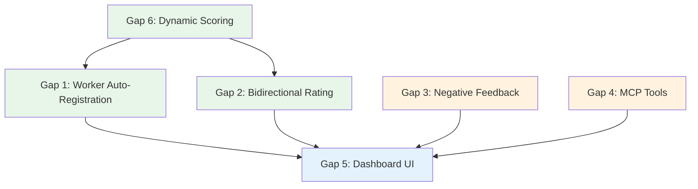

# ERC-8004 Full Integration — Development Specifications

> **Date:** February 11, 2026
> **Status:** Pre-implementation (all 6 gaps investigated)
> **Blocker for:** Multi-chain expansion (Option A), all subsequent roadmap items
> **Goal:** 100% ERC-8004 integration in the task lifecycle

---

## Table of Contents

1. [Gap 1: Worker Auto-Registration](#gap-1-worker-auto-registration)
2. [Gap 2: Worker → Agent Bidirectional Rating](#gap-2-worker--agent-bidirectional-rating)
3. [Gap 3: Negative Feedback on Rejection](#gap-3-negative-feedback-on-rejection)
4. [Gap 4: MCP Reputation Tools](#gap-4-mcp-reputation-tools)
5. [Gap 5: Dashboard Reputation UI](#gap-5-dashboard-reputation-ui)
6. [Gap 6: Dynamic Scoring System](#gap-6-dynamic-scoring-system)
7. [Implementation Order](#implementation-order)
8. [Dependency Graph](#dependency-graph)

---

## Gap 1: Worker Auto-Registration

### What Exists
- `register_worker_gasless()` in `identity.py:470` — fully implemented, never called
- `check_worker_identity()` in `identity.py:377` — on-chain check via `balanceOf()`
- `update_executor_identity()` in `identity.py:668` — persists `erc8004_agent_id` to Supabase
- Facilitator `POST /register` — gasless, mints NFT, transfers to recipient wallet
- `executors.erc8004_agent_id` column — exists in DB, always NULL

### What's Missing
Auto-trigger of `register_worker_gasless()` during task lifecycle.

### Implementation Spec

#### Hook Point: After `approve_submission()` payment success
**File:** `mcp_server/api/routes.py`, after line 814

**Logic:**
```
1. Check if executor.erc8004_agent_id is NULL
2. If NULL → call register_worker_gasless(wallet_address, network="base")
3. On success → call update_executor_identity(executor_id, agent_id)
4. Fire-and-forget (never block the approval flow)
5. Log result for audit trail
```

**New function:** `_auto_register_worker_identity(task, executor)`
```python
async def _auto_register_worker_identity(task: dict, executor: dict) -> None:
    """Auto-register worker on ERC-8004 after first task completion. Fire-and-forget."""
    try:
        # Skip if already registered
        if executor.get("erc8004_agent_id"):
            return

        wallet = executor.get("wallet_address")
        if not wallet:
            return

        # Gasless registration via Facilitator
        result = await register_worker_gasless(
            wallet_address=wallet,
            agent_uri=f"https://execution.market/workers/{wallet}",
            network=task.get("payment_network", "base"),
            metadata=[
                {"key": "name", "value": executor.get("display_name", "Worker")},
                {"key": "platform", "value": "execution-market"},
            ],
        )

        if result.status == WorkerIdentityStatus.REGISTERED and result.agent_id:
            await update_executor_identity(executor["id"], result.agent_id)
            logger.info(f"[ERC8004] Auto-registered worker {wallet[:10]} as agent #{result.agent_id}")
        else:
            logger.warning(f"[ERC8004] Auto-registration failed for {wallet[:10]}: {result.error}")
    except Exception as e:
        logger.error(f"[ERC8004] Auto-registration error: {e}")
```

**Idempotency:**
- Check `executor.erc8004_agent_id` before calling (DB check)
- Facilitator returns error if already registered on that network (safe)
- `update_executor_identity()` is an upsert (safe)

**Files to modify:**
| File | Change |
|------|--------|
| `mcp_server/api/routes.py` | Add `_auto_register_worker_identity()`, call after line 814 |
| `mcp_server/api/routes.py` | Import `register_worker_gasless`, `WorkerIdentityStatus`, `update_executor_identity` from `integrations.erc8004.identity` |

**Tests:**
- Worker without identity completes task → gets ERC-8004 NFT
- Worker WITH identity completes task → skipped (idempotent)
- Worker without wallet → skipped gracefully
- Facilitator error → logged, approval not blocked

**Estimated effort:** 1 hour

---

## Gap 2: Worker → Agent Bidirectional Rating

### What Exists
- `rate_agent()` in `facilitator_client.py:750` — fully implemented
- `POST /api/v1/reputation/agents/rate` — public endpoint, validates task ownership
- Agent → Worker rating: automatic via `_send_reputation_feedback()` (80/100 hardcoded)

### What's Missing
Automatic worker → agent rating after task completion. Currently requires manual HTTP call.

### Implementation Spec

#### Approach: Platform submits on behalf of worker
Since the worker doesn't need a signing key (Facilitator accepts any caller), the platform can auto-submit worker→agent feedback after successful payment.

**Hook Point:** Same as agent→worker — after payment settlement in `_settle_submission_payment()`
**File:** `mcp_server/api/routes.py`, after line 814

**New function:** `_send_agent_reputation_feedback(task, release_tx)`
```python
async def _send_agent_reputation_feedback(task: dict, release_tx: str) -> None:
    """Auto-rate agent on behalf of worker after task completion. Fire-and-forget."""
    try:
        if not (ERC8004_AVAILABLE and rate_agent):
            return

        agent_address = task.get("agent_id")  # wallet address in tasks table
        if not agent_address:
            return

        # Look up agent's ERC-8004 ID from on-chain
        agent_info = await get_agent_info_by_address(agent_address)
        if not agent_info or not agent_info.get("agentId"):
            return  # Agent not registered on ERC-8004

        agent_erc8004_id = agent_info["agentId"]

        # Default positive score — agent paid on time
        score = 85  # Will be replaced by dynamic scoring (Gap 6)

        await rate_agent(
            agent_id=agent_erc8004_id,
            task_id=task["id"],
            score=score,
            comment=f"Payment received for: {task.get('title', 'Unknown')[:50]}",
            proof_tx=release_tx,
        )
        logger.info(f"[ERC8004] Auto-rated agent #{agent_erc8004_id} score={score}")
    except Exception as e:
        logger.error(f"[ERC8004] Agent rating error: {e}")
```

**Challenge:** Need to resolve agent wallet address → ERC-8004 agent_id.
- Option A: `get_agent_info()` takes agent_id (int), not address. Need reverse lookup.
- Option B: Store agent's `erc8004_agent_id` on `tasks` table (already exists: `tasks.erc8004_agent_id` from migration 020).
- **Preferred: Option B** — use `task.erc8004_agent_id` if available (set during task creation at line 1903).

**Simplified with Option B:**
```python
agent_erc8004_id = task.get("erc8004_agent_id")
if not agent_erc8004_id:
    return  # Agent not registered
```

**Anti-abuse:**
- `POST /api/v1/reputation/agents/rate` endpoint has NO dedup check — can be called multiple times
- Auto-rating should check `submission.reputation_agent_tx` (new column) before submitting
- Add `submissions.reputation_agent_tx` column for tracking

**Files to modify:**
| File | Change |
|------|--------|
| `mcp_server/api/routes.py` | Add `_send_agent_reputation_feedback()`, call after line 814 |
| `supabase/migrations/` | Add `reputation_agent_tx` column to `submissions` (optional, for dedup) |

**Tests:**
- Task with ERC-8004 agent → agent gets rated automatically
- Task without ERC-8004 agent → skipped
- Duplicate approval → no duplicate rating (if dedup column added)

**Estimated effort:** 1.5 hours

---

## Gap 3: Negative Feedback on Rejection

### What Exists
- Local Supabase penalty: -3 reputation via DB trigger (works today)
- `submit_feedback()` supports scores 0-100 (can send low scores)
- `revoke_feedback()` exists for corrections
- Dispute module exists (`mcp_server/disputes/`) but not wired

### What's Missing
On-chain ERC-8004 feedback when submissions are rejected.

### Implementation Spec

#### Approach: Optional, agent-controlled
**Recommendation: NOT automatic.** Reasons:
1. Rejections may be for minor fixable issues (blurry photo)
2. Automatic negative on-chain feedback is disproportionate for first offenses
3. Abuse risk is HIGH if automatic (agents reject good work to avoid paying)
4. Local -3 penalty via DB trigger already handles basic accountability

**Instead:** Add optional `reputation_impact` field to rejection request.

**File:** `mcp_server/api/routes.py`, rejection endpoint (~line 3545)

**Modified rejection model:**
```python
class RejectionRequest(BaseModel):
    notes: str = Field(..., description="Reason for rejection")
    severity: Optional[str] = Field(
        default="minor",
        description="minor (no on-chain impact) or major (on-chain negative feedback)"
    )
    reputation_score: Optional[int] = Field(
        default=None, ge=0, le=50,
        description="Optional reputation score for major rejections (0-50, low is worse)"
    )
```

**Logic on rejection:**
```
1. Process normal rejection (status update, DB trigger fires -3 local penalty)
2. If severity == "major" AND reputation_score is provided:
   a. Call rate_worker(task_id, score=reputation_score, tag1="rejection", ...)
   b. Store rejection_reputation_tx on submission
   c. Log with SECURITY_AUDIT tag
3. If severity == "minor" (default):
   a. No on-chain feedback (local -3 only)
```

**Score cap at 50:** Prevents agents from submitting "positive" scores via rejection flow. Maximum score on rejection is 50 (mediocre), not 100.

**Anti-abuse:**
- Only agents who own the task can reject (existing check)
- Score capped at 0-50 (no positive scores through rejection)
- `revoke_feedback()` available if dispute overturns rejection
- Rate-limit: max 3 major rejections per agent per 24h (new check)

**Future enhancement (not MVP):**
- Wire dispute system: rejected workers can dispute, triggering arbitration
- Auto-escalate after 3+ rejections of same worker
- Admin review queue for "major" rejections

**Files to modify:**
| File | Change |
|------|--------|
| `mcp_server/api/routes.py` | Update rejection endpoint, add `severity` and `reputation_score` fields |
| `mcp_server/api/routes.py` | Add `_send_rejection_feedback()` helper (similar pattern to `_send_reputation_feedback()`) |

**Tests:**
- Minor rejection → no on-chain feedback, local -3 only
- Major rejection with score=20 → on-chain feedback submitted
- Major rejection without score → default score 30
- Rejection by non-owner → 403
- Rate limit exceeded → 429

**Estimated effort:** 2 hours

---

## Gap 4: MCP Reputation Tools

### What Exists
- 22 MCP tools across 4 files (server.py, worker_tools.py, agent_tools.py, escrow_tools.py)
- 0 reputation tools
- All facilitator methods implemented (`rate_worker`, `rate_agent`, `get_reputation`, `register_agent`)

### What's Missing
MCP tools exposing reputation operations to AI agents.

### Implementation Spec

#### New file: `mcp_server/tools/reputation_tools.py`

**5 new tools:**

| Tool | Purpose | Wraps | Read/Write |
|------|---------|-------|------------|
| `em_rate_worker` | Agent rates worker (on-chain) | `rate_worker()` | Write |
| `em_get_reputation` | Check any agent's reputation | `get_agent_reputation()` | Read |
| `em_get_worker_feedback` | Get feedback for a worker | `get_reputation()` with tag filter | Read |
| `em_register_identity` | Gasless ERC-8004 registration | `register_agent()` | Write |
| `em_check_identity` | Check if address has ERC-8004 | `check_worker_identity()` | Read |

**Registration pattern (from existing codebase):**
```python
def register_reputation_tools(mcp, db):
    @mcp.tool(
        name="em_rate_worker",
        annotations={
            "title": "Rate Worker",
            "readOnlyHint": False,
            "destructiveHint": False,
            "idempotentHint": False,
            "openWorldHint": True,
        },
    )
    async def em_rate_worker(
        task_id: str,
        score: int,
        comment: str = "",
    ) -> str:
        """Rate a worker's performance on a completed task (0-100 score, on-chain via ERC-8004)."""
        ...
```

**Enhancement to `em_approve_submission`:**
Add optional `rating_score: Optional[int] = None` parameter. If provided, pass to `_send_reputation_feedback()` instead of hardcoded 80.

**Files to modify:**
| File | Change |
|------|--------|
| `mcp_server/tools/reputation_tools.py` | **NEW** — 5 reputation tools |
| `mcp_server/tools/__init__.py` | Export `register_reputation_tools` |
| `mcp_server/server.py` | Import and call `register_reputation_tools(mcp, db)` |
| `mcp_server/server.py` | Add `rating_score` param to `em_approve_submission` |

**Tests:**
- `em_rate_worker` with valid task → on-chain feedback submitted
- `em_rate_worker` with invalid task → error message
- `em_get_reputation` → returns formatted reputation data
- `em_register_identity` → gasless registration succeeds
- `em_check_identity` → returns registration status

**Estimated effort:** 2.5 hours

---

## Gap 5: Dashboard Reputation UI

### What Exists (Surprisingly Complete!)
- `ReputationBar`, `ReputationScore`, `ReputationGauge`, `ReputationTrend` — UI primitives in `components/ui/`
- `ReputationCard` — profile card with gauge, stats, tier badge
- `WorkerReputationBadge` — inline pill with score
- `WorkerRatingModal` — 1-5 star rating modal (agent→worker)
- `useIdentity` hook — identity check/registration flow (prepared but untested)
- `useReputation` hook — reads local Supabase scores
- `IdentitySection` in Profile page — shows registration status
- `reputation.ts` service — `rateWorker()`, `getEMReputation()`, `getAgentReputation()`
- i18n keys for reputation in es/en/pt
- `Executor` type has `reputation_score`, `erc8004_agent_id`, `avg_rating`

### What's Missing
1. **Registration button** — IdentitySection shows status but no action button
2. **On-chain score display** — `useReputation` reads local DB, not on-chain
3. **Worker→Agent rating UI** — No reverse-direction component
4. **Agent self-reputation view** — Agent Dashboard has no reputation section

### Implementation Spec

#### 5A: Add "Register on ERC-8004" Button
**File:** `dashboard/src/pages/Profile.tsx`, IdentitySection (~line 1114)

**Change:** When `isRegistered === false`, show button that calls gasless registration endpoint.
```
Button "Registrar Identidad" → POST /api/v1/reputation/register
  { network: "base", recipient: wallet_address }
→ On success: refetch identity, show agent ID
→ On error: show error toast
```

**New service function:** `registerIdentity(walletAddress, network)` in `reputation.ts`

#### 5B: Add On-Chain Score to Profile
**File:** `dashboard/src/hooks/useProfile.ts`, `useReputation` hook

**Change:** After fetching local score, also fetch on-chain score via `getAgentReputation(erc8004_agent_id)` if registered. Display both:
- "Reputation Local: 85" (from Supabase)
- "Reputation On-Chain: 80" (from ERC-8004 via API)

#### 5C: Worker→Agent Rating Modal
**New component:** `AgentRatingModal.tsx` (mirror of `WorkerRatingModal`)
- Triggered after worker sees "Task Completed" status
- 1-5 stars → maps to 0-100
- Optional comment
- Calls `POST /api/v1/reputation/agents/rate`

**Hook point in dashboard:** Task detail page when `task.status === "completed"` and current user is the executor.

#### 5D: Agent Self-Reputation in Dashboard
**File:** `dashboard/src/pages/AgentDashboard.tsx`

**Add section:** "Tu Reputacion" card using existing `ReputationCard` component.
- Fetch via `getAgentReputation(agent_erc8004_id)`
- Show gauge, feedback count, trend

**Files to modify:**
| File | Change |
|------|--------|
| `dashboard/src/pages/Profile.tsx` | Add registration button to IdentitySection |
| `dashboard/src/services/reputation.ts` | Add `registerIdentity()`, `rateAgent()`, `getWorkerOnChainReputation()` |
| `dashboard/src/hooks/useProfile.ts` | Fetch on-chain score alongside local score |
| `dashboard/src/components/AgentRatingModal.tsx` | **NEW** — Worker→Agent rating modal |
| `dashboard/src/pages/AgentDashboard.tsx` | Add self-reputation card |
| `dashboard/src/i18n/locales/es.json` | Add new translation keys |
| `dashboard/src/i18n/locales/en.json` | Add new translation keys |

**Tests:**
- Profile shows identity section with register button when unregistered
- Registration button triggers API call and updates UI
- On-chain score displays alongside local score
- Worker can rate agent after task completion
- Agent sees own reputation in dashboard

**Estimated effort:** 4 hours

---

## Gap 6: Dynamic Scoring System

### What Exists
- Hardcoded `reputation_score = 80` in `_send_reputation_feedback()` (line 519)
- Rich data available: task timestamps, evidence schema, auto-check results, forensic metadata
- Bayesian reputation calculation in Supabase (`calculate_bayesian_reputation()`)
- `ratings` table with multi-dimensional scores (quality, speed, communication)
- AI verification system with weighted scoring (`ai_review.py:454`)

### What's Missing
Dynamic score computation using available data.

### Implementation Spec

#### New file: `mcp_server/reputation/scoring.py`

**Main function:**
```python
def calculate_dynamic_score(
    task: dict,
    submission: dict,
    executor: dict,
    agent_override: Optional[int] = None,
) -> int:
    """Calculate reputation score 0-100 based on task performance."""
    if agent_override is not None:
        return max(0, min(100, agent_override))

    speed = _speed_score(task, submission)           # 0-30
    evidence = _evidence_score(task, submission)      # 0-30
    ai_quality = _ai_quality_score(submission)        # 0-25
    forensics = _forensic_score(submission)           # 0-15

    total = speed + evidence + ai_quality + forensics
    return max(10, min(100, total))  # Floor at 10 for completed tasks
```

**Scoring dimensions:**

| Dimension | Max Points | Data Source | Formula |
|-----------|-----------|-------------|---------|
| Speed | 30 | `submitted_at - accepted_at` vs `deadline - accepted_at` | `30 * (1 - time_used_ratio)` |
| Evidence completeness | 30 | `evidence_schema.required[]` vs `submission.evidence` | `20 * (provided/required)` + `10 * (optional_provided/optional_total)` |
| AI verification | 25 | `auto_check_passed`, `auto_check_score`, `auto_check_details` | Weighted auto-check score or defaults |
| Forensics | 15 | `evidence_metadata` (GPS, device, EXIF, checksums) | +5 GPS, +3 device, +3 EXIF, +2 timestamp, +2 checksum |

**Agent override:** Optional `score` field on `ApproveSubmissionInput` / `ApprovalRequest`. If provided, bypasses calculation.

**Dual write:** Score feeds BOTH systems:
1. On-chain ERC-8004 via `rate_worker()` (existing)
2. Off-chain Supabase via `submit_rating()` RPC (new call)

**Files to modify:**
| File | Change |
|------|--------|
| `mcp_server/reputation/scoring.py` | **NEW** — Dynamic score calculation |
| `mcp_server/reputation/__init__.py` | **NEW** — Package init |
| `mcp_server/api/routes.py` L510-547 | Modify `_send_reputation_feedback()` to accept submission, executor, use dynamic score |
| `mcp_server/api/routes.py` L814 | Pass submission + executor to `_send_reputation_feedback()` |
| `mcp_server/api/routes.py` ApprovalRequest | Add optional `score: int` field |

**Tests:**
- Fast submission + full evidence + AI pass → score ~90
- Slow submission + minimal evidence → score ~40
- Agent override score=95 → uses 95, ignores calculation
- Missing data (no auto-check) → reasonable defaults
- Edge: submit at deadline → speed=0, total still >= 10

**Estimated effort:** 2 hours

---

## Implementation Order



### Recommended order:

| Step | Gap | Why | Time |
|------|-----|-----|------|
| 1 | **Gap 6: Dynamic Scoring** | Foundation — everything else uses this | 2h |
| 2 | **Gap 1: Worker Auto-Registration** | Core identity — enables all reputation | 1h |
| 3 | **Gap 2: Bidirectional Rating** | Completes the feedback loop | 1.5h |
| 4 | **Gap 4: MCP Tools** | Enables AI agent control | 2.5h |
| 5 | **Gap 3: Negative Feedback** | Safety net for quality | 2h |
| 6 | **Gap 5: Dashboard UI** | User-facing (needs backend complete) | 4h |

**Total estimated: ~13 hours**

---

## Dependency Graph

```
Gap 6 (Scoring) ─────┬──→ Gap 1 (Auto-Registration) ──→ Gap 5 (Dashboard)
                      │
                      ├──→ Gap 2 (Bidirectional) ──────→ Gap 5 (Dashboard)
                      │
                      └──→ Gap 4 (MCP Tools)

Gap 3 (Negative Feedback) ──→ Gap 5 (Dashboard) [independent of Gaps 1-2]
```

- **Gaps 1, 2, 4** depend on Gap 6 (scoring system)
- **Gap 3** is independent (can be done in parallel)
- **Gap 5** depends on all backend gaps being complete
- **Gaps 1+2+3+4** can be done in a single backend session
- **Gap 5** (dashboard) is a separate frontend session
