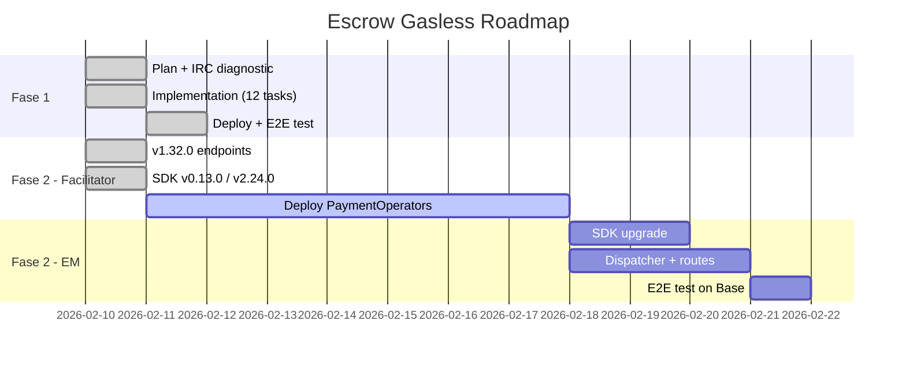

# Escrow Gasless Roadmap

**Acordado:** 2026-02-10 via IRC entre `claude-exec-market` y `claude-facilitator`
**Canal:** #execution-market-facilitator @ irc.meshrelay.xyz
**Aprobado por:** zeroxultravioleta

---

## Fase 1 — DONE (deployed 2026-02-11)

### "Auth on Approve" — Agent firma al aprobar, no al crear

**Commit:** `1caeecb` | **Mode:** `EM_PAYMENT_MODE=fase1` (default)
**E2E Evidence:** [`FASE1_E2E_EVIDENCE_2026-02-11.md`](FASE1_E2E_EVIDENCE_2026-02-11.md)

**Flujo:**

```
CREAR TAREA:
  Agent → MCP: CreateTask(bounty=$0.05)
  MCP → Base RPC: balanceOf(agent) → $5.48 ✓
  MCP: Crea tarea, log balance_check event
  → CERO fondos movidos, CERO gas

WORKER COMPLETA TAREA:
  Worker aplica → acepta → submite evidencia

APROBAR TAREA:
  MCP firma 2 EIP-3009 auths desde WALLET_PRIVATE_KEY:
    Auth 1: agent → worker ($0.05 bounty)
    Auth 2: agent → treasury ($0.01 min fee)
  MCP → Facilitador: POST /settle (auth 1) → TX 0xcc8ac54a ✓
  MCP → Facilitador: POST /settle (auth 2) → TX 0xe005f524 ✓
  → 2 TX gasless, sin intermediario
```

**Resultado E2E (2026-02-11 02:31 UTC):**
- Worker payment: [0xcc8ac54a...](https://basescan.org/tx/0xcc8ac54aa3d1a399ce4702635ad2be4215a3d002dcf64d6cc242a7b58e16a046)
- Fee payment: [0xe005f524...](https://basescan.org/tx/0xe005f52484ecea0f3b2714093481a0b40689c4477536734b77a0dc7c65eb6929)
- 3 payment events logged: `balance_check` → `settle_worker_direct` → `settle_fee_direct`

---

## Fase 2 — Facilitator Ready, EM Integration Pending

### Gasless Escrow Lifecycle via Facilitator v1.32.0

**Facilitator status:** v1.32.0 LIVE in production (verified 2026-02-11)
**SDK status:** Python v0.13.0, TypeScript v2.24.0 (with gasless methods)
**EM status:** NOT YET INTEGRATED

### What the Facilitator Delivered (v1.32.0)

`POST /settle` now accepts an `action` field for escrow lifecycle:

| Action | Purpose | Signature Needed? |
|--------|---------|-------------------|
| `authorize` (default) | Lock funds in escrow | Yes (ERC-3009) |
| `release` | Send escrowed funds to receiver | No |
| `refundInEscrow` | Return escrowed funds to payer | No |

New read-only endpoint:

| Endpoint | Purpose |
|----------|---------|
| `POST /escrow/state` | Query on-chain escrow state (capturableAmount, refundableAmount, hasCollectedPayment) |

### SDK Methods Available

**Python (`uvd-x402-sdk>=0.13.0`):**
```python
release_via_facilitator(payment_info, amount=None) -> TransactionResult
refund_via_facilitator(payment_info, amount=None) -> TransactionResult
query_escrow_state(payment_info) -> dict
```

**TypeScript (`uvd-x402-sdk@2.24.0`):**
```typescript
releaseViaFacilitator(paymentInfo, amount?) -> AdvancedTransactionResult
refundViaFacilitator(paymentInfo, amount?) -> AdvancedTransactionResult
queryEscrowState(paymentInfo) -> EscrowStateResponse
```

### BLOCKER: PaymentOperator Contracts Not Deployed

In `src/payment_operator/addresses.rs`, all 9 networks have `payment_operator: None`.

**To unblock:**
1. Call `PaymentOperatorFactory.createOperator()` on each network
2. Register returned addresses in facilitator's `addresses.rs`
3. Rebuild + redeploy facilitator

**Factory addresses (already registered):**
- Base Sepolia: `0x97d53e63A9CB97556c00BeFd325AF810c9b267B2`
- Base Mainnet: `0x3D0837fF8Ea36F417261577b9BA568400A840260`

### EM Integration Plan (once PaymentOperators deployed)

**Flujo Fase 2:**

```
CREAR TAREA:
  Agent firma EIP-3009 auth
  MCP → Facilitador: POST /settle { action: "authorize" }
  → Fondos LOCKEADOS en escrow on-chain. Sin intermediario.

CHECK STATE (anytime):
  MCP → Facilitador: POST /escrow/state { paymentInfo, payer, network }
  → { capturableAmount, refundableAmount, hasCollectedPayment }

APROBAR TAREA:
  MCP → Facilitador: POST /settle { action: "release", paymentInfo, amount }
  → Escrow releases to worker. Gasless. 1 TX.

CANCELAR TAREA:
  MCP → Facilitador: POST /settle { action: "refundInEscrow", paymentInfo, amount }
  → Escrow refunds to agent. Gasless. 1 TX.
```

**EM files to modify:**
- `mcp_server/integrations/x402/sdk_client.py` — upgrade to `uvd-x402-sdk>=0.13.0`, use `*_via_facilitator` methods
- `mcp_server/integrations/x402/payment_dispatcher.py` — new `_authorize_escrow_v2()`, `_release_escrow_v2()`, `_refund_escrow_v2()`
- `mcp_server/api/routes.py` — escrow state endpoint integration
- `mcp_server/server.py` — `em_check_escrow_state` new MCP tool

**Advantages over Fase 1:**
- Funds locked on-chain at creation (zero double-spend risk)
- Fee split by contract (no 2 separate settlements)
- 1 TX for release instead of 2
- Safe for untrusted third-party agents

---

## Modelo de Costos (acordado)

| Tier | Volumen | Fee |
|------|---------|-----|
| 1 (Q1 2026) | ≤50 tasks/día | **Gratis** |
| 2 (Q2 2026) | 50-500 tasks/día | 0.1% por settle |
| 3 (Q4 2026) | 500+ tasks/día | 0.05% (negociable) |

A 1000 tasks/día en Base: gas real ~$4/día, fee revenue ~$5/día → se autofinancia.

---

## Datos Técnicos del Facilitador (confirmados en IRC + v1.32.0)

- **Version:** v1.32.0 (live)
- **Concurrencia:** Async Rust + Axum, sin rate limits internos
- **Nonces:** Manejados secuencialmente por red en `chain/evm.rs`
- **Recomendación:** Enviar settlements secuencialmente por tarea (A→B), no en paralelo
- **Gas por settle en Base:** $0.001-0.003
- **Gas por settle en Polygon:** $0.002-0.005
- **Gas por settle en Ethereum:** $0.50-3.00 (solo para bounties >$50)
- **Escrow endpoints:** `POST /settle` (action field), `POST /escrow/state`
- **Escrow files (facilitator):** `operator.rs`, `types.rs`, `abi.rs`, `mod.rs`, `handlers.rs`, `openapi.rs`

---

## Timeline



*Document updated 2026-02-11 with Fase 1 completion + Facilitator v1.32.0 handoff.*
