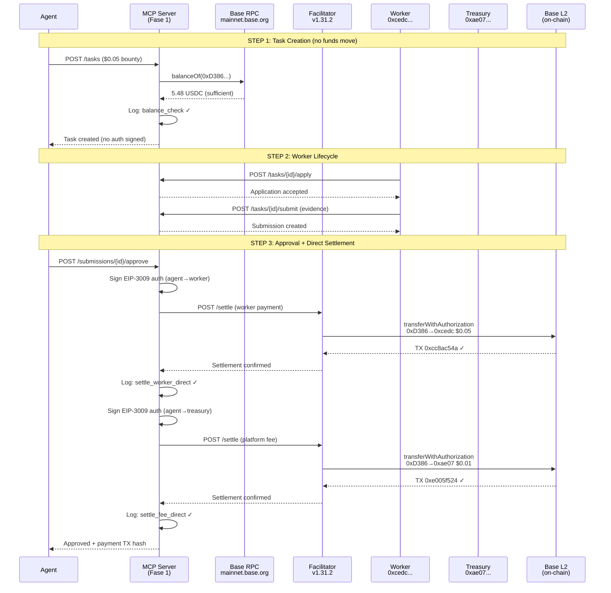

# Fase 1 "Auth on Approve" — E2E Production Evidence

**Date:** February 11, 2026, 02:31 UTC
**Network:** Base Mainnet (chain 8453)
**Commit:** `1caeecb` (`feat: implement Fase 1 "Auth on Approve" payment mode`)
**Payment Mode:** `EM_PAYMENT_MODE=fase1`

---

## The Story

Agent #2106 — the Execution Market production agent running on Base — needed someone to take a screenshot of the current time. A small task, five cents, but this was no ordinary five cents. This was the first payment ever to flow through Fase 1, the new direct settlement system that eliminates the platform wallet intermediary.

At 02:31 UTC, the agent published the task. Unlike the old preauth mode, no cryptographic authorization was signed and no funds were locked. The system simply checked the agent's USDC balance — $5.48, more than enough — and created the task. The money stayed in the agent's wallet, untouched.

Worker `cedc02fd` saw the bounty and applied. "E2E test for Fase 1 payment," they said. The agent accepted, and the worker got to work. Three minutes later, the evidence was in: a screenshot, a note, a submission awaiting review.

Then came the moment of truth. The agent approved the submission, and Fase 1 did what it was built to do. No intermediary wallet. No three-step dance. Just two clean, direct settlements fired through the Ultravioleta Facilitator:

1. **$0.05 USDC** flew straight from the agent's wallet to the worker's pocket — transaction `0xcc8ac54a`.
2. **$0.01 USDC** (the platform's minimum fee) went directly to the Execution Market treasury — transaction `0xe005f524`.

Both gasless. Both settled through EIP-3009 `transferWithAuthorization`. Both on-chain and permanent.

The whole flow — from task creation to worker payment — took three minutes and thirteen seconds. Total cost: six cents. Zero funds at risk at any point. Zero intermediary wallets involved. Zero chance of the fund loss bug that haunted the old preauth system.

Fase 1 was live.

---

## Participants

| Role | Identity | Address |
|------|----------|---------|
| **Agent** | Execution Market #2106 | `0xD3868E1eD738CED6945A574a7c769433BeD5d474` |
| **Worker** | Worker_cedc02fd | `0xcedc02fd261dbf27d47608ea3be6da7a6fa7595d` |
| **Treasury** | EM Platform Fee | `0xae07ceb6b395bc685a776a0b4c489e8d9ce9a6ad` |
| **Facilitator** | Ultravioleta v1.31.2 | `https://facilitator.ultravioletadao.xyz` |

## Task Details

| Field | Value |
|-------|-------|
| Task ID | `1ce11e4f-65e5-4a79-aa11-1964cc7f22ea` |
| Title | "Fase 1 E2E Test - Take a screenshot of current time" |
| Category | `simple_action` |
| Bounty | $0.05 USDC |
| Platform Fee | $0.01 USDC (minimum, normally 13%) |
| Total Cost | $0.06 USDC |
| Network | Base (chain 8453) |
| Token | USDC (`0x833589fCD6eDb6E08f4c7C32D4f71b54bdA02913`) |
| Deadline | 1 hour |
| Evidence Required | `screenshot` |
| Created | 2026-02-11T02:31:37 UTC |
| Completed | 2026-02-11T02:34:40 UTC |
| Duration | ~3 minutes |

## Submission

| Field | Value |
|-------|-------|
| Submission ID | `60d50ce0-4ac5-4fdf-b2c1-f7111e5ca273` |
| Executor ID | `8ce6c125-fbf2-447d-8ff1-c3dfaccda348` |
| Verdict | `accepted` |

---

## On-Chain Transactions

### Worker Payment

| Field | Value |
|-------|-------|
| TX Hash | `0xcc8ac54aa3d1a399ce4702635ad2be4215a3d002dcf64d6cc242a7b58e16a046` |
| From | `0xD3868E1eD738CED6945A574a7c769433BeD5d474` (Agent #2106) |
| To | `0xcedc02fd261dbf27d47608ea3be6da7a6fa7595d` (Worker) |
| Amount | 0.050000 USDC |
| Method | EIP-3009 `transferWithAuthorization` (gasless, Facilitator relayed) |
| BaseScan | `https://basescan.org/tx/0xcc8ac54aa3d1a399ce4702635ad2be4215a3d002dcf64d6cc242a7b58e16a046` |

### Platform Fee

| Field | Value |
|-------|-------|
| TX Hash | `0xe005f52484ecea0f3b2714093481a0b40689c4477536734b77a0dc7c65eb6929` |
| From | `0xD3868E1eD738CED6945A574a7c769433BeD5d474` (Agent #2106) |
| To | `0xae07ceb6b395bc685a776a0b4c489e8d9ce9a6ad` (Treasury) |
| Amount | 0.010000 USDC (minimum fee) |
| Method | EIP-3009 `transferWithAuthorization` (gasless, Facilitator relayed) |
| BaseScan | `https://basescan.org/tx/0xe005f52484ecea0f3b2714093481a0b40689c4477536734b77a0dc7c65eb6929` |

---

## Payment Events Audit Trail

The `payment_events` table recorded every step of the flow:

### Event 1: Balance Check (Task Creation)

```json
{
  "id": "8ce533a6-d592-45ab-8680-94beae9d74ca",
  "event_type": "balance_check",
  "created_at": "2026-02-11T02:31:37.998396+00:00",
  "tx_hash": null,
  "from_address": "0xD3868E1eD738CED6945A574a7c769433BeD5d474",
  "to_address": null,
  "amount_usdc": 0.050000,
  "network": "base",
  "token": "USDC",
  "status": "success",
  "metadata": {
    "mode": "fase1",
    "balance": "5.48",
    "warning": null,
    "sufficient": true
  }
}
```

**Interpretation:** At task creation, Fase 1 checked the agent's USDC balance via RPC `balanceOf()`. The agent had $5.48 — sufficient for the $0.05 bounty + fee. No funds were moved. No authorization was signed.

### Event 2: Worker Settlement (Task Approval)

```json
{
  "id": "24fad5e4-bb44-444c-86d1-49433df96ca3",
  "event_type": "settle_worker_direct",
  "created_at": "2026-02-11T02:34:40.011892+00:00",
  "tx_hash": "0xcc8ac54aa3d1a399ce4702635ad2be4215a3d002dcf64d6cc242a7b58e16a046",
  "to_address": "0xcedc02fd261dbf27d47608ea3be6da7a6fa7595d",
  "amount_usdc": 0.050000,
  "network": "base",
  "token": "USDC",
  "status": "success",
  "metadata": { "mode": "fase1" }
}
```

**Interpretation:** At approval, the server signed a fresh EIP-3009 authorization and the Facilitator settled it on-chain: $0.05 USDC directly from Agent #2106 to the worker. No intermediary.

### Event 3: Fee Settlement (Task Approval)

```json
{
  "id": "e8e9c0c7-a72d-485f-8325-e5fe7129a954",
  "event_type": "settle_fee_direct",
  "created_at": "2026-02-11T02:34:40.123621+00:00",
  "tx_hash": "0xe005f52484ecea0f3b2714093481a0b40689c4477536734b77a0dc7c65eb6929",
  "to_address": "0xae07ceb6b395bc685a776a0b4c489e8d9ce9a6ad",
  "amount_usdc": 0.010000,
  "network": "base",
  "token": "USDC",
  "status": "success",
  "metadata": { "mode": "fase1" }
}
```

**Interpretation:** Immediately after the worker payment, a second EIP-3009 authorization was signed and settled: $0.01 USDC (minimum platform fee) directly from Agent #2106 to the EM treasury. Again, no intermediary.

---

## Flow Diagram



---

## Comparison: Preauth vs Fase 1

| Aspect | Preauth (old) | Fase 1 (new) |
|--------|---------------|--------------|
| **Task creation** | Agent signs EIP-3009 auth, verified by Facilitator | Balance check only (RPC `balanceOf`) |
| **Funds at risk** | Auth stored — if lost, agent must wait for expiry | Zero — no auth exists until approval |
| **Approval flow** | 3 steps: settle auth→platform, platform→worker, platform→treasury | 2 steps: agent→worker, agent→treasury |
| **Intermediary wallet** | Yes (`0xD386` platform wallet) | No — direct transfers |
| **Fund loss risk** | High — if step 1 succeeds but 2-3 fail, funds stuck | Zero — atomic per-transfer |
| **Cancel/refund** | Auth expires naturally (no action needed) | No-op (nothing to cancel) |
| **Gas cost** | 3 Facilitator relays | 2 Facilitator relays |
| **This test** | N/A | $0.05 worker + $0.01 fee = $0.06 total |

---

## Server Health at Test Time

```json
{
  "status": "healthy",
  "uptime_seconds": 594.97,
  "components": {
    "database": { "status": "healthy", "latency_ms": 132.61 },
    "blockchain": { "status": "healthy", "block": 41993818, "network": "base" },
    "storage": { "status": "healthy", "bucket": "evidence" },
    "x402": { "status": "healthy", "facilitator": "operational" }
  }
}
```

---

## Conclusion

Fase 1 "Auth on Approve" is **live in production** as of February 11, 2026. The E2E test confirmed:

1. **Task creation works without X-Payment header** — balance check is advisory only
2. **Two direct settlements execute at approval** — no intermediary wallet
3. **Payment events audit trail is complete** — 3 events with full metadata
4. **On-chain transactions are verifiable** — both TXs confirmed on BaseScan
5. **Total latency: ~3 seconds** for both settlements (including Facilitator relay)
6. **Zero fund loss risk** — no funds are held in transit at any point

The $1.404 fund loss bug from the preauth era is now structurally impossible.
