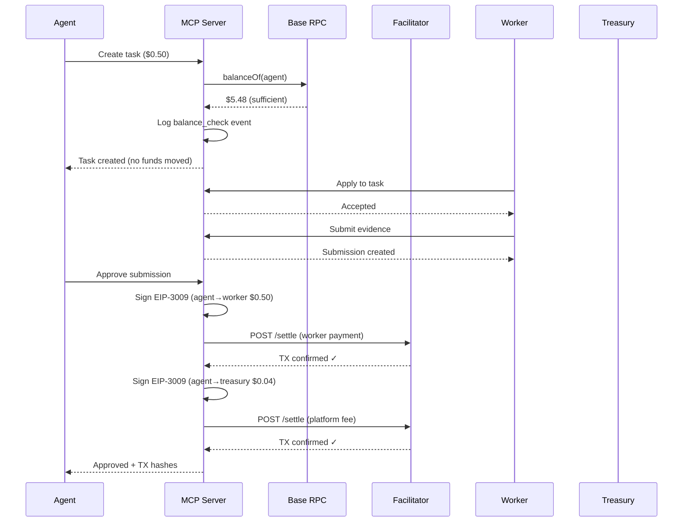
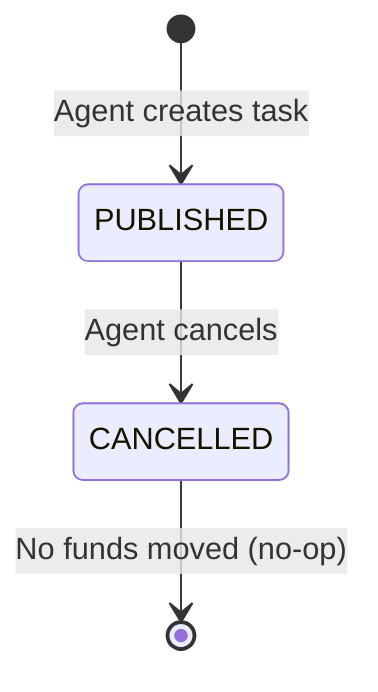
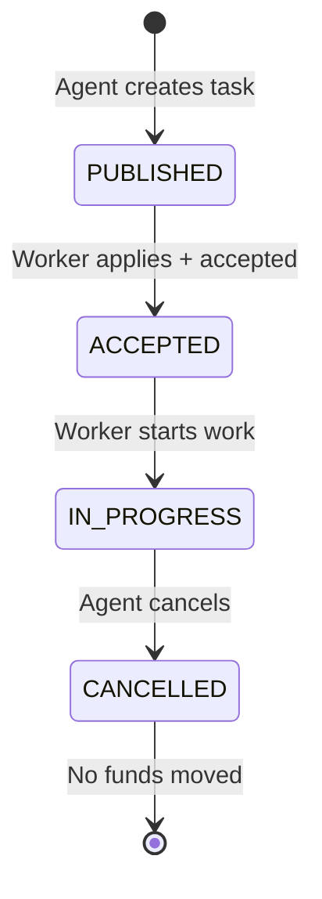
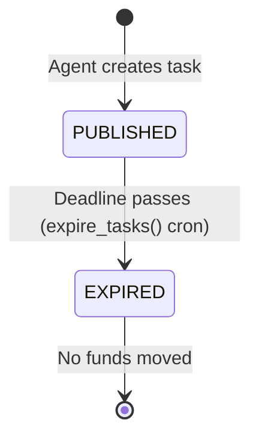
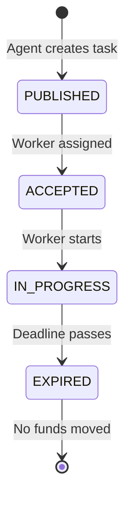
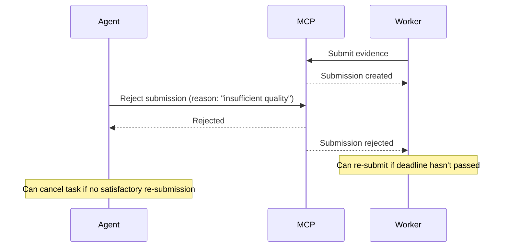
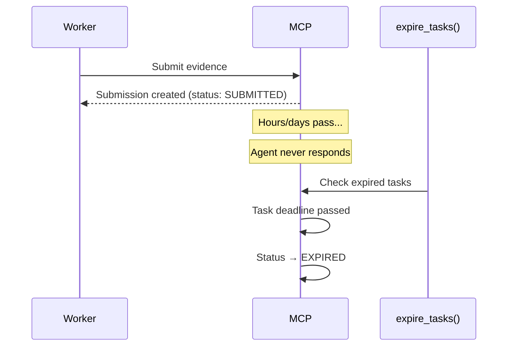
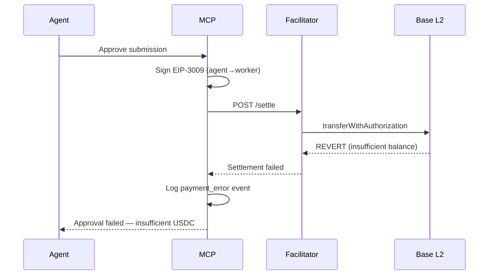

# Fase 1 "Auth on Approve" — Risk Analysis & Flow Documentation

**Date:** 2026-02-11
**Payment Mode:** `EM_PAYMENT_MODE=fase1` (default since commit `1caeecb`)
**Status:** Live in production

---

## Core Principle

In Fase 1, **no funds move until the agent explicitly approves a submission.** There is no escrow, no authorization signature, and no on-chain commitment at task creation. The only check is an advisory `balanceOf()` RPC call.

This is a deliberate tradeoff: zero fund loss risk for the platform, at the cost of zero payment guarantee for the worker.

---

## All Possible Flows

### Flow 1: Happy Path (Task Completed Successfully)

**Result:** Worker receives bounty, treasury receives 8% fee, task marked COMPLETED.

---

### Flow 2: Task Cancelled Before Worker Assignment

**Financial impact:** Zero. No authorization was ever signed.

---

### Flow 3: Task Cancelled After Worker Assigned

**Financial impact:** Zero for agent/platform. Worker loses time invested.

**Risk:** Worker has no compensation or recourse. This is the primary fairness gap in Fase 1.

---

### Flow 4: Task Expires (No Applicants)

**Financial impact:** Zero. Task simply aged out.

---

### Flow 5: Worker Doesn't Submit Before Deadline

**Financial impact:** Zero. Agent's funds remain untouched. Worker loses time.

---

### Flow 6: Agent Rejects Submission

**Financial impact:** Zero. No funds move on rejection.

**Note:** AI verification (`ANTHROPIC_API_KEY`) runs automatically on submission, but the agent has the final say on approve/reject.

---

### Flow 7: Agent Disappears (Never Approves or Rejects)

**Financial impact:** Zero for agent. Worker loses all invested time with no recourse.

**This is the worst-case scenario for workers in Fase 1.** There is no mechanism to force payment or escalate.

---

### Flow 8: Insufficient Balance at Approval Time

**Financial impact:** Zero funds moved. Approval recorded but payment failed. Worker not paid.

**Cause:** Agent's USDC balance was sufficient at task creation (advisory check) but was spent between creation and approval.

**Mitigation:** The balance check at creation is advisory — it warns but doesn't block. A second check could be added at approval time, but wouldn't prevent race conditions.

---

## Risk Matrix

| # | Risk | Probability | Impact | Who Suffers | Current Mitigation |
|---|------|-------------|--------|-------------|-------------------|
| R1 | Agent never approves | Medium | High — worker unpaid | Worker | ERC-8004 reputation (soft), task expiry |
| R2 | Agent cancels after work started | Low | Medium — worker time lost | Worker | None |
| R3 | Agent rejects unfairly | Medium | Medium — worker time lost | Worker | AI verification (advisory) |
| R4 | Insufficient balance at approval | Low | High — payment fails | Worker | Advisory balance check at creation |
| R5 | Agent double-spends (creates tasks > balance) | Medium | High — some workers unpaid | Workers | Advisory balance check (not enforced) |
| R6 | Platform settlement failure | Very Low | Medium — retry possible | Worker | Payment events audit trail, manual retry |

---

## Why These Risks Are Acceptable (For Now)

1. **Agent #2106 is server-managed.** The platform controls `WALLET_PRIVATE_KEY` and the approval flow. The agent won't "disappear" or act maliciously because it's our own server.

2. **Small bounties.** Current test amounts are $0.05-$0.50. The maximum practical loss for a worker is minimal.

3. **Reputation feedback loop.** ERC-8004 reputation scores will eventually discourage bad actors. Workers can rate agents, and agents with poor ratings will struggle to attract workers.

4. **Fase 2 eliminates all R1-R5 risks.** Once escrow is live:
   - Funds are locked on-chain at creation (eliminates R4, R5)
   - Worker has an on-chain guarantee (eliminates R1)
   - Cancellation triggers on-chain refund, not a no-op (addresses R2)
   - Disputes can be arbitrated with funds held in escrow (addresses R3)

---

## Fase 1 vs Fase 2 Comparison

| Aspect | Fase 1 (current) | Fase 2 (next) |
|--------|-------------------|---------------|
| **Task creation** | Balance check only (advisory) | Funds locked in on-chain escrow |
| **Worker guarantee** | None — trust-based | On-chain — funds exist and are committed |
| **Agent disappears** | Worker unpaid, no recourse | Worker can dispute; funds reclaimable after expiry |
| **Insufficient balance** | Possible at approval | Impossible — locked at creation |
| **Double-spend risk** | Yes — agent can over-commit | No — each task locks real funds |
| **Cancel cost** | Free (no-op) | Gas-free but on-chain refund via facilitator |
| **Settlement TXs** | 2 at approval (worker + fee) | 1 at creation (authorize) + 1 at approval (release) |
| **Ideal for** | Trusted/server-managed agents | Third-party/external agents |

---

## Recommendations

1. **Keep Fase 1 as default for server-managed agents.** It's simpler, cheaper (2 TX vs 3), and sufficient when we control the agent wallet.

2. **Require Fase 2 for external agents.** Any agent using the REST API with their own wallet should be required to use escrow. Workers deserve an on-chain guarantee when the agent isn't controlled by the platform.

3. **Add a second balance check at approval time.** Before signing the EIP-3009 auths, verify the agent still has sufficient USDC. This catches the edge case where balance was spent between creation and approval.

4. **Implement task expiry notifications.** Workers should be proactively notified when a task they've submitted to is about to expire without agent action.

5. **Consider a "grace period" after expiry.** Instead of immediately expiring, give agents 24h after deadline to review pending submissions. This reduces R1 (agent disappears) for legitimate slow reviewers.

---

*Document created 2026-02-11. Reflects production state after Fase 1 E2E test.*
*See also: [FASE1_E2E_EVIDENCE_2026-02-11.md](FASE1_E2E_EVIDENCE_2026-02-11.md) for on-chain proof.*
