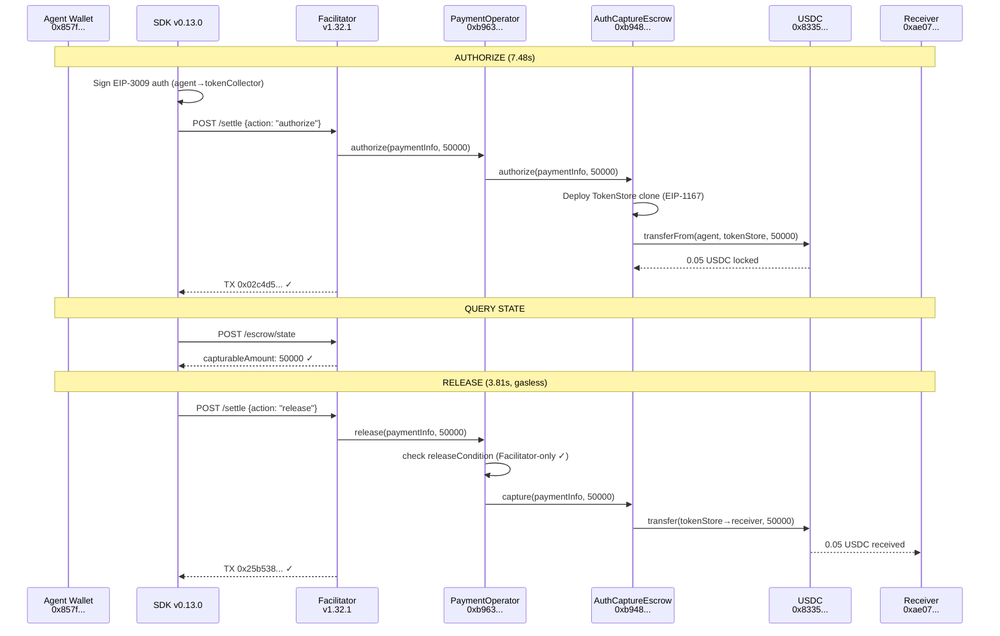
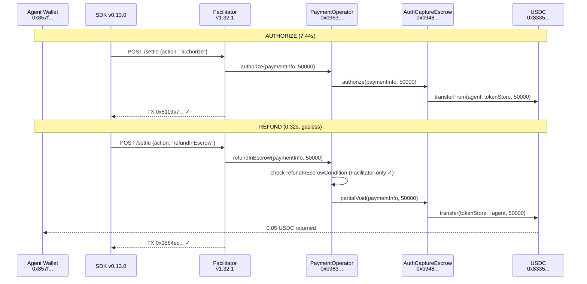

# Fase 2 Gasless Escrow — E2E Production Evidence

**Date:** February 11, 2026, ~00:16 UTC
**Network:** Base Mainnet (chain 8453)
**Facilitator:** v1.32.1 (commit `af2ec00`, task def 182)
**SDK:** `uvd-x402-sdk` v0.13.0 (Python)
**PaymentOperator:** `0xb9635f544665758019159c04c08a3d583dadd723`

---

## The Story

Two hours after Fase 1 proved that direct settlements work, the escrow went live.

The Facilitator team deployed v1.32.1 with Execution Market's PaymentOperator registered on Base Mainnet. The operator is simple by design: only the Facilitator's EOA (`0x1030...`) can call release or refund. No escrow periods, no freeze mechanisms, no arbiter — just a lock and a key.

The first test locked $0.05 USDC in on-chain escrow. Not in a wallet. Not in a database. In a smart contract, where the funds sat immutably until the Facilitator said "release." Seven seconds to lock. Three point eight seconds to release. Both gasless.

The second test locked another $0.05 and cancelled it. The refund took 0.32 seconds. Less than the blink of an eye to return funds from an on-chain escrow to the agent's wallet, without either party paying a cent in gas.

Four transactions. $0.10 total. The entire escrow lifecycle — authorize, query, release, refund — working in production on Base Mainnet.

---

## Participants

| Role | Identity | Address |
|------|----------|---------|
| **Payer (Agent)** | Dev wallet | `0x857fe6150401bFB4641Fe0D2B2621cc3B05543Cd` |
| **Receiver** | EM Treasury (test) | `0xae07ceb6b395bc685a776a0b4c489e8d9ce9a6ad` |
| **Facilitator** | Ultravioleta v1.32.1 | `0x103040545AC5031A11E8C03dd11324C7333a13C7` |
| **PaymentOperator** | EM Custom | `0xb9635f544665758019159c04c08a3d583dadd723` |
| **AuthCaptureEscrow** | x402r Singleton | `0xb9488351E48b23D798f24e8174514F28B741Eb4f` |
| **TokenCollector** | x402r | `0x48ADf6E37F9b31dC2AAD0462C5862B5422C736B8` |

---

## Test 1: Authorize + Release (Happy Path)

### Step 1: Authorize (Lock Funds)

| Field | Value |
|-------|-------|
| TX Hash | `0x02c4d599e724a49d7404a383853eadb8d9c09aad2d804f1704445103d718c77c` |
| Amount | 0.050000 USDC (50000 atomic) |
| Action | `authorize` — lock funds in escrow via EIP-3009 |
| Duration | 7.48 seconds |
| BaseScan | [View TX](https://basescan.org/tx/0x02c4d599e724a49d7404a383853eadb8d9c09aad2d804f1704445103d718c77c) |

### Step 2: Query Escrow State

```json
{
  "hasCollectedPayment": true,
  "capturableAmount": "50000",
  "refundableAmount": "0",
  "paymentInfoHash": "0x3c2dcce14ac90bebb4a02918eddd375d0504f980639026244232560c801a0aed",
  "network": "eip155:8453"
}
```

**Interpretation:** $0.05 USDC locked and capturable. `hasCollectedPayment=true` confirms the EIP-3009 transfer into the TokenStore clone succeeded.

### Step 3: Release (Gasless)

| Field | Value |
|-------|-------|
| TX Hash | `0x25b53858555bf4cc8039592a7c1affdab887fdaf0643e8ecfd727132a5b63e6b` |
| Action | `release` — capture escrowed funds to receiver |
| Duration | 3.81 seconds |
| Gas paid by | Facilitator (gasless for agent + receiver) |
| BaseScan | [View TX](https://basescan.org/tx/0x25b53858555bf4cc8039592a7c1affdab887fdaf0643e8ecfd727132a5b63e6b) |

### Step 4: Final State

```json
{
  "hasCollectedPayment": true,
  "capturableAmount": "0",
  "refundableAmount": "50000",
  "paymentInfoHash": "0x3c2dcce14ac90bebb4a02918eddd375d0504f980639026244232560c801a0aed"
}
```

**Interpretation:** `capturableAmount=0` confirms all funds were released to the receiver. `refundableAmount=50000` is expected — it represents the post-capture refund window (unused here).

---

## Test 2: Authorize + Refund (Cancel Path)

### Step 1: Authorize (Lock Funds)

| Field | Value |
|-------|-------|
| TX Hash | `0x5119a75cf6a9301e8373a5f4cb9be45ee403a5dc4e79bb78252f35e4b5fbb8eb` |
| Amount | 0.050000 USDC (50000 atomic) |
| Action | `authorize` — lock funds in escrow via EIP-3009 |
| Duration | 7.44 seconds |
| BaseScan | [View TX](https://basescan.org/tx/0x5119a75cf6a9301e8373a5f4cb9be45ee403a5dc4e79bb78252f35e4b5fbb8eb) |

### Step 2: Query Escrow State

```json
{
  "hasCollectedPayment": true,
  "capturableAmount": "50000",
  "refundableAmount": "0",
  "paymentInfoHash": "0x3c60139ef81a62b410fd48666adc0688508783400f636b5038dcdf79d9990594",
  "network": "eip155:8453"
}
```

### Step 3: Refund (Gasless)

| Field | Value |
|-------|-------|
| TX Hash | `0x1564ecc1ea1e09d84705961ee6d614e173f466551d3b2181225b4ec090cbb19c` |
| Action | `refundInEscrow` — return escrowed funds to payer |
| Duration | **0.32 seconds** |
| Gas paid by | Facilitator (gasless for agent) |
| BaseScan | [View TX](https://basescan.org/tx/0x1564ecc1ea1e09d84705961ee6d614e173f466551d3b2181225b4ec090cbb19c) |

### Step 4: Final State

```json
{
  "hasCollectedPayment": true,
  "capturableAmount": "0",
  "refundableAmount": "0",
  "paymentInfoHash": "0x3c60139ef81a62b410fd48666adc0688508783400f636b5038dcdf79d9990594"
}
```

**Interpretation:** Both `capturableAmount` and `refundableAmount` are 0 — funds fully returned to the payer. The escrow is empty.

---

## Flow Diagrams

### Release Flow (Task Approval)



### Refund Flow (Task Cancellation)



---

## Performance Summary

| Operation | Test 1 | Test 2 | Notes |
|-----------|--------|--------|-------|
| Authorize | 7.48s | 7.44s | Includes EIP-3009 sign + facilitator relay + on-chain confirm |
| Query State | instant | instant | Read-only, no gas |
| Release | 3.81s | — | Gasless, facilitator pays |
| Refund | — | **0.32s** | Gasless, facilitator pays |
| **Total** | **~14s** | **~11s** | End-to-end including waits |

---

## Comparison: Fase 1 vs Fase 2

| Aspect | Fase 1 (2026-02-11 02:31 UTC) | Fase 2 (2026-02-11 00:16 UTC) |
|--------|-------------------------------|-------------------------------|
| **Lock mechanism** | None (balance check only) | On-chain escrow (TokenStore clone) |
| **Funds at risk** | Until approval: agent can spend elsewhere | Zero: locked in contract |
| **Worker guarantee** | Trust-based | On-chain: funds exist in escrow |
| **Approval** | 2 direct EIP-3009 settles (11.3s) | 1 gasless release (3.81s) |
| **Cancel/Refund** | No-op (nothing to refund) | Gasless refund (0.32s) |
| **Double-spend risk** | Yes | No — funds locked at creation |
| **Total TXs** | 2 at approval | 1 at creation + 1 at approval |
| **Cost** | $0.06 ($0.05 + $0.01 fee) | $0.05 (fee handled by operator) |
| **Safety valve** | N/A | `reclaim()` after authorizationExpiry |

---

## Operator Config (EM Custom)

```
feeRecipient              = 0xae07...  (EM Treasury)
feeCalculator             = address(0) (no operator fee — EM charges 13% itself)
authorizeCondition        = 0x67B6...  (UsdcTvlLimit — protocol safety)
releaseCondition          = 0x9d03...  (StaticAddressCondition → Facilitator-only)
refundInEscrowCondition   = 0x9d03...  (StaticAddressCondition → Facilitator-only)
All recorders             = address(0) (no-op)
```

**Design choice:** Simplest possible config. The Facilitator is the sole gatekeeper for release and refund. Business logic (task approval, AI verification, fee calculation) stays in the MCP server. The contract just holds and releases funds.

---

## SDK Methods Used

```python
from uvd_x402_sdk.advanced_escrow import AdvancedEscrowClient, TaskTier

client = AdvancedEscrowClient(
    private_key="0x...",
    operator_address="0xb9635f544665758019159c04c08a3d583dadd723",
    chain_id=8453,
)

# Lock funds
pi = client.build_payment_info(receiver="0x...", amount=50000, tier=TaskTier.MICRO)
auth = client.authorize(pi)

# Query state
state = client.query_escrow_state(pi)

# Release (gasless) — OR — Refund (gasless)
client.release_via_facilitator(pi)
client.refund_via_facilitator(pi)
```

---

## What's Next

1. **Integrate Fase 2 into EM production** — update `sdk_client.py` and `payment_dispatcher.py` to use escrow at task creation and release/refund at approval/cancel
2. **Deploy PaymentOperators on remaining 7 networks** — Ethereum, Polygon, Arbitrum, Celo, Monad, Avalanche, Optimism
3. **Add `EM_PAYMENT_MODE=fase2`** — new mode that uses on-chain escrow instead of Fase 1 direct settlements
4. **Expose `query_escrow_state` as MCP tool** — `em_check_escrow_state` for agents to verify funds are locked

---

*Document created 2026-02-11. All transactions verifiable on BaseScan.*
*See also: [FASE1_E2E_EVIDENCE_2026-02-11.md](FASE1_E2E_EVIDENCE_2026-02-11.md) for Fase 1 comparison.*
*Test script: `scripts/test-fase2-escrow.py`*
