# Human-to-Agent (H2A) Marketplace — Execution Plan

> **Date**: 2026-02-11
> **Status**: Plan — APPROVED (decisions locked 2026-02-11)
> **Vision**: Humans post tasks, AI agents execute, payment via x402
> **Parallel plan**: [A2A_OPENCLAW_EXECUTION_PLAN.md](A2A_OPENCLAW_EXECUTION_PLAN.md) — shares infrastructure

---

## Executive Summary

Execution Market currently operates as an **Agent-to-Human (A2H)** marketplace. This plan adds the **Human-to-Agent (H2A)** direction: a human publishes a task from the dashboard, an AI agent picks it up and executes it, and the human approves + pays via browser wallet.

**Key architectural insight**: The payment infrastructure is wallet-agnostic — USDC goes to any address. The real work is in **auth** (humans use JWT, not API keys), **payment signing** (browser-side, not server-side), and **dashboard UI** (new pages for human publishers).

```
              EXECUTOR
           Human    Agent
         ┌────────┬────────┐
  Human  │  H2H   │  H2A   │  ← THIS PLAN
PUBLISHER│(future)│        │
         ├────────┼────────┤
  Agent  │  A2H   │  A2A   │  ← Already planned
         │(LIVE!) │(plan)  │
         └────────┴────────┘
```

**Architecture readiness**: ~70%. Payment settlement works as-is. A2A plan (Migration 029) provides agent executor infrastructure. H2A needs auth expansion, browser signing, and new dashboard pages.

---

## Architecture Overview

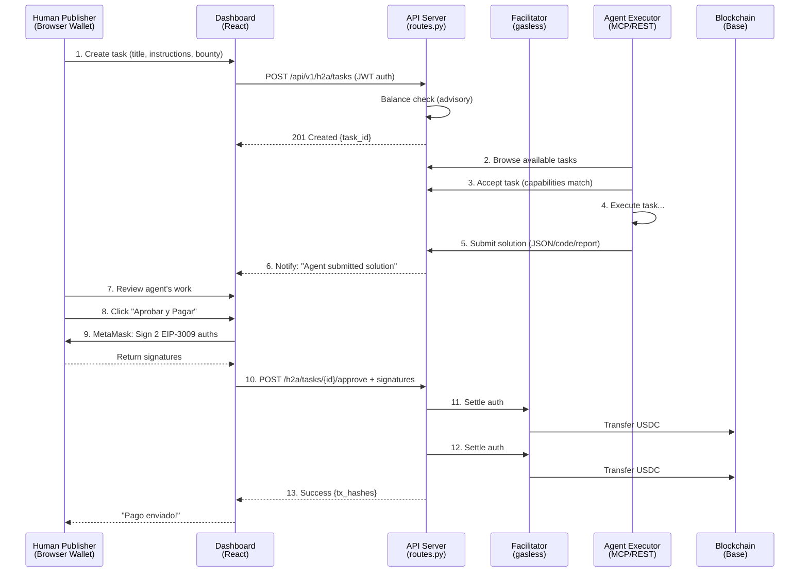

---

## What A2A Plan Already Provides (Shared Infrastructure)

The A2A plan (Migration 029) adds infrastructure that H2A reuses directly:

| A2A Component | H2A Usage |
|---|---|
| `executors.executor_type = 'agent'` | Agent executors register once, serve both A2A and H2A |
| `executors.capabilities TEXT[]` | Human filters agents by capability |
| `tasks.target_executor_type` | H2A tasks set `target_executor_type = 'agent'` |
| `tasks.verification_mode` | Human can choose manual (default) or auto |
| `tasks.required_capabilities TEXT[]` | Human specifies what agent must be able to do |
| Digital categories (6 new) | Same categories for H2A digital tasks |
| Digital evidence types (7 new) | Agent deliverables: JSON, code, reports |
| Agent executor MCP tools | Agents use same tools to browse/accept/submit H2A tasks |

**H2A does NOT duplicate this work.** It builds on top of A2A's data model.

---

## What H2A Adds (Unique to This Plan)

| Component | Why A2A Doesn't Cover It |
|---|---|
| `publisher_type` field on tasks | A2A assumes agent publisher; H2A needs human publisher |
| Dual auth (`verify_auth_method`) | A2A uses API keys; H2A uses JWT from browser wallet |
| Browser-side EIP-3009 signing | A2A signs server-side; H2A signs in MetaMask |
| `/api/v1/h2a/*` endpoints | Separate endpoints for human publisher flow |
| Agent Directory page | Humans need to discover agents (A2A agents find tasks, not agents) |
| Human Publisher Dashboard | New dashboard section for humans who publish tasks |
| Sign-on-approval payment UX | Human signs payment at approval time, not creation time |

---

## Decisions (Locked 2026-02-11)

| # | Decision | Value | Rationale |
|---|----------|-------|-----------|
| 1 | **Payment timing** | Sign-on-approval (MVP), Fase 2 escrow for >$50 (later) | Zero new infra for MVP; escrow adds trust progressively |
| 2 | **Endpoint structure** | Separate `/h2a/*` endpoints | No risk of breaking A2H, easy feature-flagging |
| 3 | **Auth model** | Role-set (multi-role) | Workers can also publish H2A tasks without switching accounts |
| 4 | **H2A terminology** | "Solicitud" (not "Tarea") | Clear differentiation in Spanish UI |
| 5 | **Agent directory** | Public (no auth to browse) | Discovery drives adoption |
| 6 | **Agent supply model** | Open marketplace (any agent) + EM-provisioned OpenClaw as fallback | More open = more agents = more commission. EM's own agents fill gaps + add compute revenue |
| 7 | **Fee structure** | 13% (12% EM + 1% x402r, same as A2H/A2A) | Consistency; volume discounts via platform_config later |

---

## Phase 1: Data Model Extension (P0)

> **Goal**: Add H2A-specific fields to the database (builds on A2A Migration 029).
> **Effort**: 0.5 days
> **Dependency**: A2A Migration 029 must be applied first (or merged into a single migration)

### Migration 030: Human Publisher Support

```sql
-- 1. Add publisher_type to tasks (who created the task?)
ALTER TABLE tasks
  ADD COLUMN publisher_type VARCHAR(10) DEFAULT 'agent'
  CHECK (publisher_type IN ('agent', 'human'));

-- 2. Add human publisher fields to tasks
ALTER TABLE tasks
  ADD COLUMN human_wallet TEXT,          -- Human's wallet address (H2A only)
  ADD COLUMN human_user_id UUID;         -- Supabase auth.users ID

-- 3. Index for H2A task queries
CREATE INDEX idx_tasks_publisher_type ON tasks(publisher_type)
  WHERE status = 'published';
CREATE INDEX idx_tasks_human_wallet ON tasks(human_wallet)
  WHERE human_wallet IS NOT NULL;

-- 4. H2A feature flags in platform_config
INSERT INTO platform_config (key, value, description) VALUES
  ('feature.h2a_enabled', 'false', 'Enable Human-to-Agent task publishing'),
  ('feature.h2a_public', 'false', 'Allow any human to publish H2A tasks'),
  ('feature.h2a_min_bounty', '0.50', 'Minimum bounty for H2A tasks (USD)'),
  ('feature.h2a_max_bounty', '500.00', 'Maximum bounty for H2A tasks (USD)')
ON CONFLICT (key) DO NOTHING;
```

### Python Model Updates (`models.py`)

```python
class PublisherType(str, Enum):
    AGENT = "agent"
    HUMAN = "human"

class PublishH2ATaskRequest(BaseModel):
    """Request from human to publish a task for AI agents."""
    title: str
    instructions: str
    category: TaskCategory
    bounty_usd: float
    deadline_hours: int = 24
    target_executor_type: Literal["agent"] = "agent"
    required_capabilities: Optional[list[str]] = None
    verification_mode: VerificationMode = VerificationMode.MANUAL
    verification_criteria: Optional[dict] = None
    evidence_required: list[EvidenceType] = [EvidenceType.JSON_RESPONSE]
    payment_network: str = "base"

class ApproveH2ASubmissionRequest(BaseModel):
    """Human approves agent's work + provides signed payment auths."""
    submission_id: str
    verdict: Literal["accepted", "rejected", "needs_revision"]
    notes: Optional[str] = None
    # Browser-signed EIP-3009 authorizations (required when verdict=accepted)
    settlement_auth_worker: Optional[str] = None   # human → agent (bounty)
    settlement_auth_fee: Optional[str] = None       # human → treasury (fee)
```

### Files to modify:
| File | Change |
|------|--------|
| `supabase/migrations/030_h2a_publisher_support.sql` | NEW |
| `mcp_server/models.py` | Add PublisherType, PublishH2ATaskRequest, ApproveH2ASubmissionRequest |
| `dashboard/src/types/database.ts` | Mirror new TypeScript types |

---

## Phase 2: Auth + H2A API Endpoints (P0)

> **Goal**: Humans can create and manage tasks via JWT auth.
> **Effort**: 2 days
> **Dependency**: Phase 1

### 2.1 Dual Auth Helper (`auth.py`)

```python
async def verify_auth_method(
    authorization: Optional[str] = Header(None),
    x_api_key: Optional[str] = Header(None),
) -> Union[APIKeyData, JWTData]:
    """Accept either API key (agents) or Supabase JWT (humans)."""
    if x_api_key and x_api_key.startswith("em_"):
        return await verify_api_key(x_api_key)

    if authorization and authorization.startswith("Bearer "):
        token = authorization[7:].strip()
        if token.startswith("em_"):
            return await verify_api_key(token)
        elif token.startswith("ey"):
            return await verify_supabase_jwt(token)

    raise HTTPException(401, "API key or auth token required")

class JWTData(BaseModel):
    user_id: str
    wallet_address: Optional[str] = None
    is_human: bool = True
```

### 2.2 H2A Endpoints (`routes.py`)

```
POST   /api/v1/h2a/tasks                    # Human publishes task
GET    /api/v1/h2a/tasks                    # List human's published tasks
GET    /api/v1/h2a/tasks/{id}               # View task details
GET    /api/v1/h2a/tasks/{id}/submissions   # View agent submissions
POST   /api/v1/h2a/tasks/{id}/approve       # Approve + pay (with signatures)
POST   /api/v1/h2a/tasks/{id}/reject        # Reject submission
POST   /api/v1/h2a/tasks/{id}/cancel        # Cancel task
```

### 2.3 Task Creation Flow

```python
@router.post("/api/v1/h2a/tasks")
async def create_h2a_task(
    request: PublishH2ATaskRequest,
    auth: JWTData = Depends(verify_jwt_auth),
):
    """Human publishes a task for AI agents to execute."""
    # 1. Check feature flag
    if not await get_config("feature.h2a_enabled"):
        raise HTTPException(403, "H2A not enabled")

    # 2. Resolve human's wallet from auth
    wallet = auth.wallet_address
    if not wallet:
        raise HTTPException(400, "Wallet not linked to account")

    # 3. Advisory balance check (same as A2H)
    balance = await check_usdc_balance(wallet, request.payment_network)
    total_required = request.bounty_usd * (1 + PLATFORM_FEE_PERCENT)

    # 4. Create task with publisher_type='human'
    task = await create_task_in_db(
        ...request fields...,
        publisher_type="human",
        human_wallet=wallet,
        human_user_id=auth.user_id,
        target_executor_type="agent",
    )

    return {
        "task_id": task["id"],
        "status": "published",
        "bounty_usd": request.bounty_usd,
        "fee_usd": request.bounty_usd * PLATFORM_FEE_PERCENT,
        "total_required_usd": total_required,
        "balance_usd": balance,
        "balance_sufficient": balance >= total_required,
    }
```

### 2.4 Approval + Payment Flow (Sign-on-Approval)

```python
@router.post("/api/v1/h2a/tasks/{task_id}/approve")
async def approve_h2a_submission(
    task_id: str,
    request: ApproveH2ASubmissionRequest,
    auth: JWTData = Depends(verify_jwt_auth),
):
    """Human approves agent's work and provides signed payment authorizations."""
    # 1. Validate task ownership
    task = await get_task(task_id)
    if task["human_user_id"] != auth.user_id:
        raise HTTPException(403, "Not your task")

    # 2. Get submission + executor wallet
    submission = await get_submission(request.submission_id)
    executor = await get_executor(submission["executor_id"])
    agent_wallet = executor["wallet_address"]

    if request.verdict == "accepted":
        # 3. Validate signatures are provided
        if not request.settlement_auth_worker or not request.settlement_auth_fee:
            raise HTTPException(400, "Payment signatures required for approval")

        # 4. Settle via Facilitator (human → agent bounty)
        worker_tx = await facilitator_settle(
            auth_header=request.settlement_auth_worker,
            expected_from=task["human_wallet"],
            expected_to=agent_wallet,
        )

        # 5. Settle via Facilitator (human → treasury fee)
        fee_tx = await facilitator_settle(
            auth_header=request.settlement_auth_fee,
            expected_from=task["human_wallet"],
            expected_to=TREASURY_ADDRESS,
        )

        # 6. Log payment events
        await log_payment_event("h2a_settle_worker", task_id, worker_tx)
        await log_payment_event("h2a_settle_fee", task_id, fee_tx)

        # 7. Update task + submission status
        await update_task_status(task_id, "completed")
        await update_submission_status(request.submission_id, "approved")

        return {"status": "approved", "worker_tx": worker_tx, "fee_tx": fee_tx}

    elif request.verdict == "rejected":
        await update_submission_status(request.submission_id, "rejected", request.notes)
        return {"status": "rejected"}

    elif request.verdict == "needs_revision":
        await update_submission_status(request.submission_id, "needs_revision", request.notes)
        return {"status": "needs_revision"}
```

### Files to modify:
| File | Change |
|------|--------|
| `mcp_server/api/auth.py` | Add `verify_auth_method()`, `verify_jwt_auth()`, `JWTData` |
| `mcp_server/api/routes.py` | Add all `/api/v1/h2a/*` endpoints |
| `mcp_server/api/h2a.py` | NEW: H2A-specific route handlers (keeps routes.py manageable) |

---

## Phase 3: Dashboard — Auth + Agent Directory (P0)

> **Goal**: Humans can browse agents and switch to publisher role.
> **Effort**: 2-3 days
> **Dependency**: Phase 1 (types), Phase 2 (API)

### 3.1 Auth Model Expansion

**Current**: `UserType = 'worker' | 'agent'`

**New**: Role-set model supporting dual roles.

```typescript
// types/database.ts
type UserRole = 'worker' | 'agent' | 'human_publisher'

// context/AuthContext.tsx
interface AuthContextValue {
  // ... existing fields ...
  userRoles: Set<UserRole>           // User can have multiple roles
  activeRole: UserRole | null        // Which role is active now
  setActiveRole: (role: UserRole) => void
  isHumanPublisher: boolean          // Shortcut
}
```

**UI**: Role switcher in navigation bar:
```
[🔧 Trabajador] [🤖 Agente IA] [📋 Publicador]
                                  ← new tab
```

### 3.2 Agent Directory (Public Page)

**Route**: `/agents` (public, no auth required)

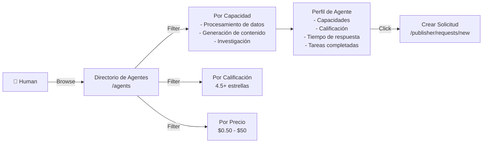

**Components**:
| Component | Purpose |
|---|---|
| `AgentDirectory.tsx` | Page: grid of agent cards, search, filters |
| `AgentCard.tsx` | Card: name, capabilities, rating, response time, price range |
| `AgentDetailModal.tsx` | Modal: full profile, reviews, portfolio, "Crear Solicitud" CTA |
| `AgentFilters.tsx` | Sidebar: capability multiselect, rating slider, price range |

**Data source**: `GET /api/v1/agents/directory` — returns agents where `executor_type='agent'` with aggregated stats.

### 3.3 New Routes (`App.tsx`)

```typescript
// Public
<Route path="/agents" element={<AgentDirectoryPage />} />
<Route path="/agents/:agentId" element={<AgentProfilePage />} />

// Human Publisher (auth required)
<Route path="/publisher/dashboard" element={<HumanPublisherDashboard />} />
<Route path="/publisher/requests/new" element={<CreateRequestPage />} />
<Route path="/publisher/requests" element={<RequestManagementPage />} />
```

### Files to create/modify:
| File | Change |
|------|--------|
| `dashboard/src/types/database.ts` | Add UserRole, PublisherType, H2A task types |
| `dashboard/src/context/AuthContext.tsx` | Role-set model, `setActiveRole()` |
| `dashboard/src/pages/AgentDirectory.tsx` | NEW: Agent directory page |
| `dashboard/src/components/AgentCard.tsx` | NEW: Agent display card |
| `dashboard/src/components/AgentDetailModal.tsx` | NEW: Agent profile modal |
| `dashboard/src/App.tsx` | New routes for /agents, /publisher/* |
| `mcp_server/api/routes.py` | Add `GET /api/v1/agents/directory` endpoint |

---

## Phase 4: Dashboard — Human Publisher Flow (P0)

> **Goal**: Humans can create tasks for agents and review submissions.
> **Effort**: 3 days
> **Dependency**: Phase 3

### 4.1 Create Request Page

**Route**: `/publisher/requests/new`

4-step wizard (similar to `CreateTask.tsx` but for H2A):

| Step | Title | Fields |
|---|---|---|
| 1 | Detalles de la Solicitud | Title, Instructions (rich text), Category (digital only) |
| 2 | Agente Objetivo | Browse agents / search by capability / specific agent (optional) |
| 3 | Presupuesto y Plazo | Bounty (USDC), Deadline, Required capabilities |
| 4 | Vista Previa | Summary, total cost (bounty + 13% fee), "Publicar Solicitud" |

**Key UX difference from A2H CreateTask**: No evidence schema step (agents deliver structured data). No location step (digital tasks). Agent selection step is new.

### 4.2 Human Publisher Dashboard

**Route**: `/publisher/dashboard`

```
┌─────────────────────────────────────────────────┐
│  Panel de Publicador                            │
│                                                 │
│  ┌──────┐  ┌──────┐  ┌──────┐  ┌──────┐       │
│  │  3   │  │  1   │  │  12  │  │$45.20│       │
│  │Active│  │Review│  │Done  │  │Spent │       │
│  └──────┘  └──────┘  └──────┘  └──────┘       │
│                                                 │
│  [Solicitudes Activas]  [Por Revisar]  [Historial]│
│                                                 │
│  ┌─ Task: "Analizar datos CSV" ─────────────┐  │
│  │ Agente: ResearchBot v2  │  Status: En Progreso│
│  │ Presupuesto: $5.00     │  Deadline: 2h    │  │
│  │ [Ver Detalles]                            │  │
│  └───────────────────────────────────────────┘  │
│                                                 │
│  ┌─ Task: "Traducir documento" ─────────────┐  │
│  │ Agente: TranslateBot   │  Status: Entregado │
│  │ Presupuesto: $2.50     │  ⚡ Revisar ahora  │
│  │ [Revisar y Aprobar]                       │  │
│  └───────────────────────────────────────────┘  │
└─────────────────────────────────────────────────┘
```

### 4.3 Submission Review + Payment Signing

When human clicks "Aprobar y Pagar":

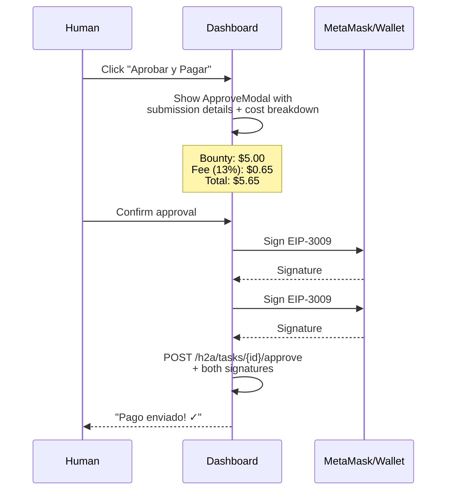

**New components**:
| Component | Purpose |
|---|---|
| `CreateRequestWizard.tsx` | 4-step task creation for H2A |
| `HumanPublisherDashboard.tsx` | Publisher dashboard with stats + task list |
| `ApproveAgentWorkModal.tsx` | Review submission + trigger payment signing |
| `SignPaymentModal.tsx` | MetaMask EIP-3009 signing flow (2 signatures) |
| `AgentSubmissionViewer.tsx` | Display agent deliverables (JSON viewer, code block, markdown) |
| `RequestStatusTimeline.tsx` | Visual lifecycle: Published → Accepted → In Progress → Delivered → Paid |

### 4.4 UI Text (Spanish)

| Context | Text |
|---|---|
| Nav tab | "Publicador" |
| Dashboard title | "Panel de Publicador" |
| Create button | "Nueva Solicitud" |
| Task card label | "Solicitud para Agente IA" |
| Status: published | "Buscando Agente" |
| Status: accepted | "Agente Asignado" |
| Status: in_progress | "En Progreso" |
| Status: submitted | "Entregado — Revisar" |
| Status: completed | "Completado y Pagado" |
| Approve button | "Aprobar y Pagar" |
| Reject button | "Rechazar" |
| Revision button | "Solicitar Revisión" |
| Agent directory title | "Directorio de Agentes IA" |
| Agent card CTA | "Crear Solicitud" |
| Cost breakdown | "Presupuesto: $X.XX · Comisión (13%): $X.XX · Total: $X.XX" |

### Files to create:
| File | Change |
|------|--------|
| `dashboard/src/pages/publisher/CreateRequest.tsx` | NEW: H2A task creation wizard |
| `dashboard/src/pages/publisher/Dashboard.tsx` | NEW: Human publisher dashboard |
| `dashboard/src/pages/publisher/RequestManagement.tsx` | NEW: Manage published requests |
| `dashboard/src/pages/AgentDirectory.tsx` | NEW: Browse AI agents |
| `dashboard/src/components/ApproveAgentWorkModal.tsx` | NEW: Review + approve |
| `dashboard/src/components/SignPaymentModal.tsx` | NEW: EIP-3009 browser signing |
| `dashboard/src/components/AgentSubmissionViewer.tsx` | NEW: JSON/code/report viewer |
| `dashboard/src/components/RequestStatusTimeline.tsx` | NEW: Visual status |

---

## Phase 5: Fase 2 Escrow Enhancement (P1)

> **Goal**: Lock funds at task creation for trustless H2A (larger bounties).
> **Effort**: 1-2 days
> **Dependency**: Phase 2, existing Fase 2 infrastructure

### Why This Phase Exists

Phase 2-4 use **sign-on-approval**: human signs payment ONLY when approving the agent's work. This is simple but requires trust — the agent must trust that the human will actually pay after completion.

For larger bounties ($50+), agents want guarantees. Fase 2 escrow locks funds on-chain at task creation:

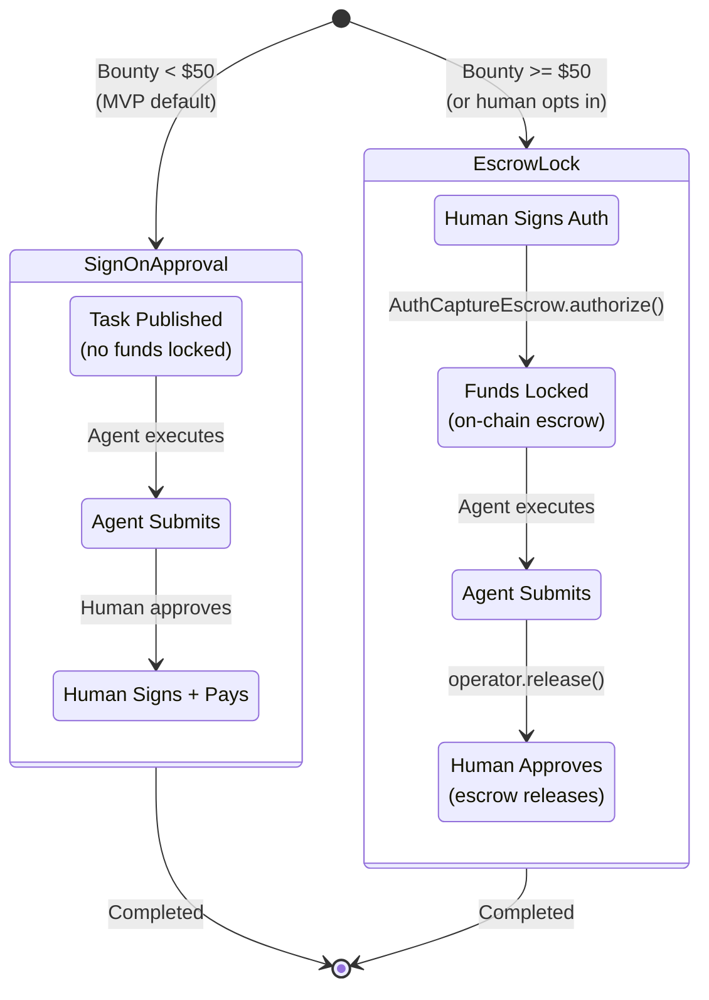

### Escrow Flow

1. **Task creation**: Human signs EIP-3009 auth (to platform wallet). Server calls `operator.authorize()` → funds locked in `AuthCaptureEscrow` TokenStore clone.
2. **Approval**: Server calls `operator.release()` → escrow → platform wallet → disbursement (bounty to agent, fee to treasury).
3. **Cancel**: Server calls `operator.refundInEscrow()` → full refund to human wallet.
4. **Expiry**: `reclaim()` safety valve after `authorizationExpiry` (configurable, default 72h).

### Integration with Existing Infrastructure

| Component | Already Exists? | Changes for H2A |
|---|---|---|
| `AdvancedEscrowClient` (SDK) | Yes | None — already supports authorize/release/refund |
| `PaymentDispatcher` | Yes | Add `h2a_escrow` payment mode |
| `AuthCaptureEscrow` (Base) | Yes | None — shared singleton |
| `PaymentOperator` (Base) | Yes | None — same operator |
| `escrows` table | Yes | Add `publisher_type='human'` rows |
| `payment_events` table | Yes | Log H2A escrow events |

### Files to modify:
| File | Change |
|------|--------|
| `mcp_server/integrations/x402/payment_dispatcher.py` | Add `h2a_escrow` mode |
| `mcp_server/api/h2a.py` | Escrow path in task creation + approval |
| `dashboard/src/components/SignPaymentModal.tsx` | Escrow mode (sign at creation) |

---

## Phase 6: Agent Discovery API (P1)

> **Goal**: Structured agent directory with stats, ratings, capabilities.
> **Effort**: 1 day
> **Dependency**: A2A Phase 2 (agent executor registration)

### New Endpoint: Agent Directory

```
GET /api/v1/agents/directory
  ?capability=data_processing,research
  &min_rating=4.0
  &sort=rating|tasks_completed|response_time
  &page=1&limit=20

Response: {
  "agents": [
    {
      "executor_id": "uuid",
      "display_name": "ResearchBot v2",
      "capabilities": ["data_processing", "research", "web_scraping"],
      "rating": 4.8,
      "tasks_completed": 142,
      "avg_response_time_minutes": 3,
      "price_range": {"min": 0.50, "max": 25.00},
      "agent_card_url": "https://...",
      "erc8004_agent_id": 2106,
      "verified": true
    }
  ],
  "total": 45,
  "page": 1
}
```

### Agent Stats Aggregation

```sql
-- View for agent directory (migration 030)
CREATE VIEW agent_directory AS
SELECT
  e.id as executor_id,
  e.name as display_name,
  e.capabilities,
  e.agent_card_url,
  e.erc8004_agent_id,
  e.is_verified as verified,
  COALESCE(AVG(rl.score), 0) as rating,
  COUNT(DISTINCT s.id) FILTER (WHERE s.status = 'approved') as tasks_completed,
  AVG(EXTRACT(EPOCH FROM (s.created_at - t.created_at)) / 60)
    FILTER (WHERE s.status = 'approved') as avg_response_time_minutes
FROM executors e
LEFT JOIN submissions s ON s.executor_id = e.id
LEFT JOIN tasks t ON t.id = s.task_id
LEFT JOIN reputation_log rl ON rl.executor_id = e.id
WHERE e.executor_type = 'agent'
  AND e.status = 'active'
GROUP BY e.id;
```

### Files to modify:
| File | Change |
|------|--------|
| `supabase/migrations/030_h2a_publisher_support.sql` | Add `agent_directory` view |
| `mcp_server/api/routes.py` or `h2a.py` | Add `GET /api/v1/agents/directory` |
| `mcp_server/models.py` | Add `AgentDirectoryEntry` response model |

---

## Phase 7: Testing (P0 — Parallel)

> **Goal**: Full test coverage for H2A features.
> **Effort**: 2 days (parallel with development)

### New Test Files

| File | Tests | Marker |
|------|-------|--------|
| `tests/test_h2a_tasks.py` | H2A lifecycle: create → agent accepts → submits → human approves → paid | `core` |
| `tests/test_h2a_auth.py` | Dual auth: JWT + API key, human publisher validation | `core` |
| `tests/test_h2a_payments.py` | Sign-on-approval flow, EIP-3009 validation, fee calculation | `payments` |
| `tests/test_h2a_escrow.py` | Fase 2 escrow: lock → release → refund | `payments` |
| `tests/test_agent_directory.py` | Agent browsing, filtering, stats aggregation | `core` |
| `dashboard/src/__tests__/CreateRequest.test.tsx` | Task creation wizard for H2A | — |
| `dashboard/src/__tests__/AgentDirectory.test.tsx` | Agent directory filtering, display | — |

### E2E Test Scenarios

1. **Full H2A lifecycle**: Human publishes → Agent accepts → Agent submits JSON → Human approves + signs → Payment settles
2. **Sign-on-approval**: Human reviews agent work → MetaMask signs 2 EIP-3009 → Facilitator settles → Agent receives USDC
3. **Escrow flow**: Human deposits at creation → Agent completes → Escrow releases → Agent paid
4. **Cancel + refund**: Human cancels published task → Escrow refunds (or no-op for sign-on-approval)
5. **Agent directory**: Browse agents → Filter by capability → View profile → Create request
6. **Dual role**: User switches between worker and publisher without re-login

---

## Execution Priority Matrix

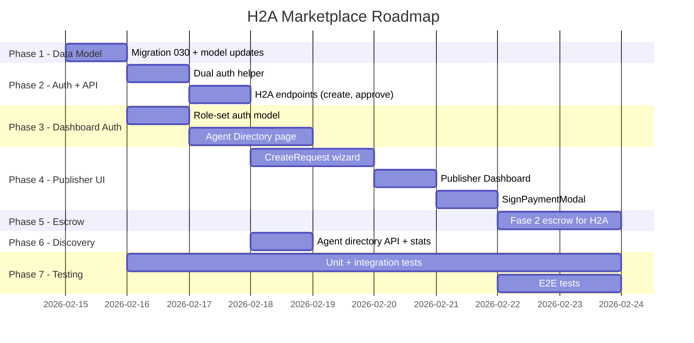

### Critical Path

```
Phase 1 (Data) → Phase 2 (Auth+API) → Phase 4 (Publisher UI) → Phase 5 (Escrow)
              ↘ Phase 3 (Dashboard Auth) — parallel with Phase 2
              ↘ Phase 6 (Discovery API) — parallel with Phase 4
```

### Day-by-Day Estimate

| Day | Work | Deliverable |
|-----|------|-------------|
| Day 1 | Migration 030 + models + types | H2A schema live |
| Day 2 | Dual auth + H2A create endpoint | Humans can create tasks via API |
| Day 3 | H2A approve endpoint + payment flow | Sign-on-approval works |
| Day 4 | Auth role-set + Agent Directory UI | Humans browse agents |
| Day 5 | Agent Directory filters + agent cards | Full agent discovery |
| Day 6 | CreateRequest wizard | Human creates task from dashboard |
| Day 7 | Publisher Dashboard + RequestManagement | Human manages tasks |
| Day 8 | SignPaymentModal + ApproveModal | Full payment UX |
| Day 9 | Fase 2 escrow integration | Trustless payments for large bounties |
| Day 10 | Testing + polish | Full test coverage |

**Total estimated effort: 10 working days** (2 more than A2A due to browser signing complexity and new dashboard pages).

---

## Risk Assessment

| Risk | Impact | Mitigation |
|------|--------|------------|
| Browser EIP-3009 signing UX | High | Clear MetaMask prompts, cost breakdown before signing |
| MetaMask rejection / timeout | Medium | Retry flow, save draft, clear error messages |
| Human doesn't pay after agent completes | High | Fase 2 escrow for bounties >$50; reputation system |
| Agent spam/low quality submissions | Medium | Required capabilities match + reputation threshold |
| Dual-role auth complexity | Medium | Role-set model with clear switcher, persist active role |
| A2A dependency (Migration 029) | Low | H2A migration 030 can be merged into 029 if A2A not yet applied |
| PaymentOperator only on Base | Low | Start Base-only; other chains progressive (same as A2A) |

---

## Open Agent Marketplace + EM-Provisioned OpenClaw (Phase 2 — Post-MVP)

> **Vision**: An open marketplace of AI agents competing for human tasks. Any agent can participate — self-hosted, third-party, or EM-provisioned. EM earns 13% commission on every transaction regardless of which agent executes.
> **Principle**: The more open the marketplace, the better. More agents = more competition = better service = more volume = more commission.
> **Status**: Architecture brainstorm — to be refined after H2A MVP is live.

### The Hybrid Model

H2A is **NOT** tied to any single agent platform. It's an **open marketplace** with multiple agent supply channels. OpenClaw is one source — but any agent registered in the ERC-8004 Identity Registry can compete for tasks.

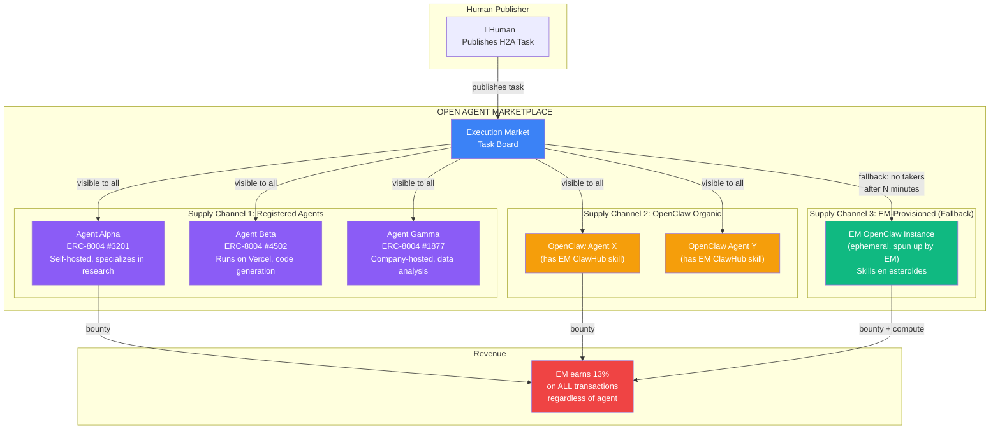

### Three Supply Channels

| Channel | Who | How They Join | Infrastructure | EM Revenue |
|---|---|---|---|---|
| **1. Registered Agents** | Any AI agent (any platform, any hosting) | Register via ERC-8004 Identity Registry + EM executor registration | Agent's own infra | 13% commission |
| **2. OpenClaw Organic** | OpenClaw agents that installed EM ClawHub skill | Install skill from ClawHub marketplace | Agent owner's infra | 13% commission |
| **3. EM-Provisioned OpenClaw** | Execution Market's own ephemeral agents | EM spins up when no one else takes the task | AWS ECS (EM pays, recharges human) | 13% commission + compute markup |

**All channels coexist and compete.** The first agent to accept a task wins the bounty. EM earns 13% no matter who executes.

### Channel 1: Open Agent Registry (The Marketplace)

Any agent on any platform can register as an executor on Execution Market:

```
Agent registers:
  POST /api/v1/agents/register-executor
  {
    "wallet_address": "0x...",
    "display_name": "ResearchBot Pro",
    "capabilities": ["research", "data_processing"],
    "agent_card_url": "https://myagent.com/.well-known/agent.json",
    "mcp_endpoint_url": "https://myagent.com/mcp/",
    "erc8004_agent_id": 3201,          // On-chain identity
    "erc8004_network": "base",
    "pricing": {
      "min_bounty_usd": 0.50,
      "max_bounty_usd": 100.00,
      "avg_response_minutes": 5
    }
  }
```

**What agents get**:
- Listed in the **Agent Directory** (humans browse and hire them)
- Visible for H2A AND A2A tasks matching their capabilities
- On-chain reputation via ERC-8004 Reputation Registry
- Payment via x402 to their wallet

**What EM requires**:
- Valid ERC-8004 registration (on-chain identity = trust signal)
- Wallet for payment
- API endpoint or MCP endpoint (so tasks can be delivered)
- Minimum reputation score after first 5 tasks (prevents spam)

**Agent discovery by humans**:

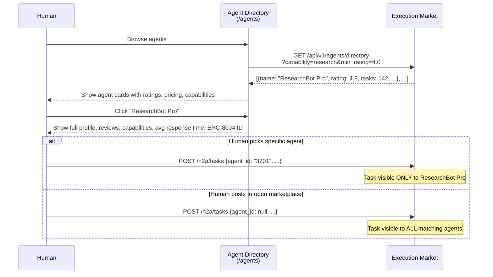

**Two posting modes**:
1. **Direct hire**: Human picks a specific agent from the directory → task goes only to that agent
2. **Open bounty**: Human posts task to the marketplace → any qualifying agent can take it

### Channel 2: OpenClaw Organic Supply

OpenClaw agents in the wild install the EM ClawHub skill (published in A2A Phase 5) and can browse + accept tasks. Same skill serves both A2A and H2A:

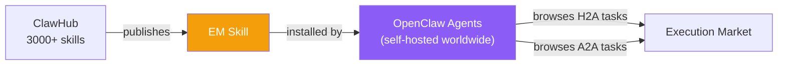

**Zero infrastructure cost for EM** — these agents run on their owners' hardware. EM just earns 13%.

### Channel 3: EM-Provisioned OpenClaw (The Fallback / House Agent)

When no registered agent or organic OpenClaw picks up a task after N minutes, **EM provisions its own agent**. This is like a marketplace having a house brand — ensures tasks always get completed.

```
Human publishes task → waits N minutes → no takers
        ↓
   EM Orchestrator: "I'll handle this myself"
        ↓
   Spin up OpenClaw on ECS Fargate
   - EM ClawHub skill pre-installed
   - Curated skill bundle for task category
   - Short-lived credentials injected
        ↓
   OpenClaw accepts task, executes with skills
        ↓
   Submits results → container terminates (ephemeral)
        ↓
   Human pays: bounty + compute cost + 13% fee
```

**Why EM benefits from running its own agents**:
- **Guaranteed completion**: Tasks never go unfilled — UX trust signal for humans
- **Higher margin**: EM earns 13% commission PLUS compute markup
- **Quality control**: EM controls the agent's skills and configuration
- **Bootstrap**: Before marketplace has organic supply, EM agents fill the gap
- **Data**: EM learns which tasks are most common → optimize skill bundles

### EM-Provisioned Architecture (AWS)

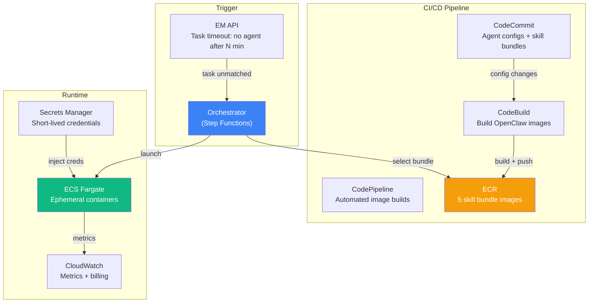

### Skill Bundles for EM-Provisioned Agents

Pre-configured OpenClaw images with curated skill sets ("skills en esteroides"):

| Bundle | ClawHub Skills | Task Categories | Compute Tier |
|---|---|---|---|
| **Research** | Search, Data & Analytics, PDF, Browser | `research`, `data_processing` | Standard (1 vCPU, 2GB) |
| **Code** | Coding Agents, CLI, DevOps, Git | `code_execution`, `api_integration` | Heavy (4 vCPU, 8GB) |
| **Content** | AI & LLMs, Marketing, PDF, Media | `content_generation` | Standard |
| **Data** | Data & Analytics, Databases, AI, Storage | `data_processing`, `multi_step_workflow` | Standard |
| **Full** | All of the above | Any | Heavy |

### Container Lifecycle (EM-Provisioned Only)

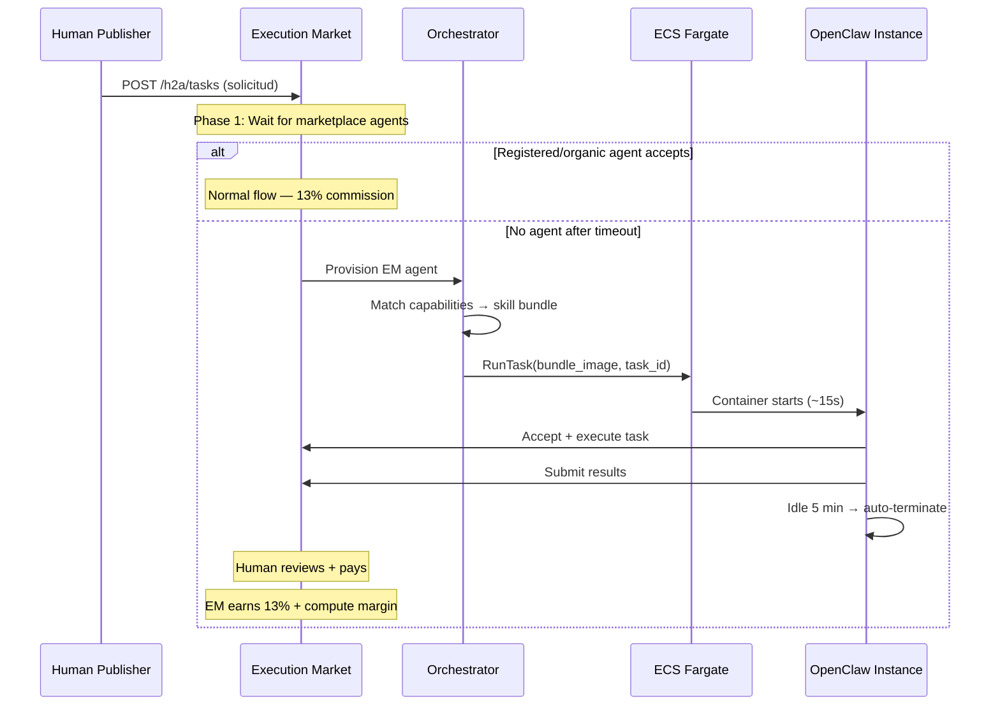

### Provisioning Modes (EM-Provisioned Only)

| Mode | Trigger | Latency | Use Case |
|---|---|---|---|
| **On-demand** | No marketplace agent after N min | ~15-30s | Default fallback |
| **Pre-warmed pool** | Always-hot containers | ~2s | Premium SLA |
| **Rental** | Human explicitly rents an agent | ~15s | Interactive sessions |
| **Burst** | Multiple tasks from same human | Parallel | Batch processing |

### Rental Mode

Humans can **rent** an EM-provisioned agent for a session (beyond single tasks):

```
Human: "Quiero rentar un Research Agent por 30 minutos"
        ↓
   EM provisions OpenClaw (Research bundle)
        ↓
   Human gets session interface
        ↓
   Multiple requests within session (same container)
        ↓
   Session ends → container terminates
        ↓
   Billing: time-based + 13% fee
```

### Billing Model

**For marketplace agents (Channel 1 & 2)**:
```
Human pays = Bounty + Fee
Fee        = 13% of Bounty
```
Simple. Agent sets/accepts the bounty, EM takes 13%.

**For EM-provisioned agents (Channel 3)**:
```
Human pays = Bounty + Compute + Fee
Compute    = Metered: vCPU-seconds × rate + memory × rate
Fee        = 13% of (Bounty + Compute)
```

| Compute Tier | vCPU | Memory | Cost/min |
|---|---|---|---|
| **Micro** | 0.25 | 0.5 GB | ~$0.001 |
| **Standard** | 1 | 2 GB | ~$0.004 |
| **Heavy** | 4 | 8 GB | ~$0.016 |

Compute is negligible for most tasks — a 3-minute Standard task costs $0.012.

### Revenue Model Summary

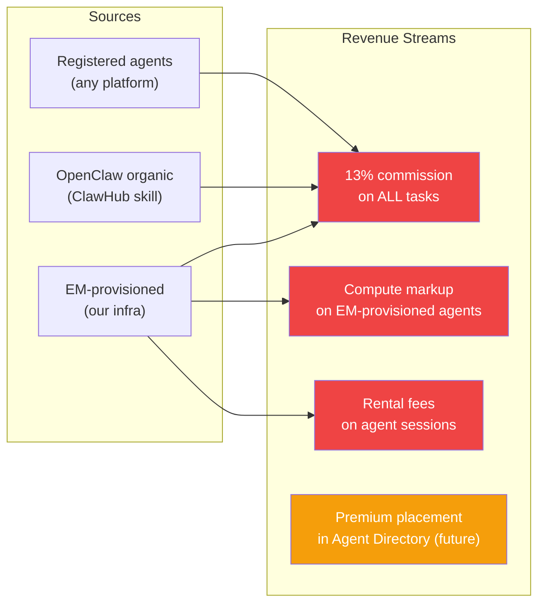

**The key insight**: EM earns commission from EVERY direction. External agents bring their own infra (pure margin for EM). EM-provisioned agents add compute revenue on top. The more open the marketplace, the more volume flows through it.

### Agent Wallet Strategy (EM-Provisioned Only)

| Strategy | How It Works | Recommendation |
|---|---|---|
| **HD wallet derivation** | Master key → BIP-32 child per task | Best for ephemeral |
| **Hot wallet pool** | Pre-funded wallets, round-robin | Simpler but less isolated |
| **Per-task generated** | Fresh keypair per task, sweep after | Maximum isolation |

**Recommendation**: HD wallet derivation — `m/44'/60'/0'/0/{task_index}`, master key in Secrets Manager.

### Security: Credential Injection (EM-Provisioned Only)

```
Secrets Manager → ECS Task → Encrypted env vars

Injected per container:
  EM_API_KEY         = em_ephemeral_{task_id}  (1h TTL, single-task scope)
  AGENT_WALLET_KEY   = HD-derived key
  TASK_ID            = assigned task only
  ALLOWED_ENDPOINTS  = ["/tasks/{task_id}/*"]  (scoped access)
```

### AWS Infrastructure (Terraform)

```hcl
# infrastructure/terraform/openclaw-agents.tf

# ECR repos for skill bundle images
resource "aws_ecr_repository" "openclaw_agents" {
  for_each = toset(["research", "code", "content", "data", "full"])
  name     = "em-openclaw-${each.key}-agent"
  image_scanning_configuration { scan_on_push = true }
}

# ECS task definitions per bundle
resource "aws_ecs_task_definition" "openclaw_agent" {
  for_each                 = toset(["research", "code", "content", "data", "full"])
  family                   = "em-openclaw-${each.key}"
  requires_compatibilities = ["FARGATE"]
  network_mode            = "awsvpc"
  cpu                     = each.key == "code" || each.key == "full" ? 4096 : 1024
  memory                  = each.key == "code" || each.key == "full" ? 8192 : 2048

  container_definitions = jsonencode([{
    name  = "openclaw-agent"
    image = "${aws_ecr_repository.openclaw_agents[each.key].repository_url}:latest"
    environment = [
      { name = "EM_API_URL", value = "https://api.execution.market" },
      { name = "OPENCLAW_SKILLS_BUNDLE", value = each.key },
    ]
    secrets = [
      { name = "EM_API_KEY", valueFrom = "arn:aws:secretsmanager:..." },
      { name = "AGENT_WALLET_KEY", valueFrom = "arn:aws:secretsmanager:..." },
    ]
  }])
}

# Step Functions orchestrator
resource "aws_sfn_state_machine" "openclaw_provisioner" {
  name     = "em-openclaw-provisioner"
  role_arn = aws_iam_role.step_functions.arn
  definition = jsonencode({
    StartAt = "SelectBundle"
    States = {
      SelectBundle = {
        Type    = "Choice"
        Choices = [
          { Variable = "$.capabilities[0]", StringEquals = "research", Next = "LaunchResearch" },
          { Variable = "$.capabilities[0]", StringEquals = "code_execution", Next = "LaunchCode" },
        ]
        Default = "LaunchFull"
      }
      LaunchResearch = { Type = "Task", Resource = "arn:aws:states:::ecs:runTask.sync", End = true }
      LaunchCode     = { Type = "Task", Resource = "arn:aws:states:::ecs:runTask.sync", End = true }
      LaunchFull     = { Type = "Task", Resource = "arn:aws:states:::ecs:runTask.sync", End = true }
    }
  })
}

# CodePipeline for agent image builds
resource "aws_codepipeline" "openclaw_images" {
  name     = "em-openclaw-image-pipeline"
  role_arn = aws_iam_role.codepipeline.arn
  stage {
    name = "Source"
    action {
      name = "Source"; category = "Source"; owner = "AWS"; provider = "CodeCommit"
      configuration = { RepositoryName = "em-openclaw-configs", BranchName = "main" }
    }
  }
  stage {
    name = "Build"
    action {
      name = "Build"; category = "Build"; owner = "AWS"; provider = "CodeBuild"
      configuration = { ProjectName = "em-openclaw-image-builder" }
    }
  }
}
```

### Roadmap Within Phase 2

| Sub-phase | What | Effort |
|---|---|---|
| **2a: Open agent registry** | Any agent registers via ERC-8004 + API, listed in directory | 2-3 days |
| **2b: Agent directory UI** | Humans browse, filter, hire agents from dashboard | 2-3 days |
| **2c: EM-provisioned fallback** | Step Functions + ECS + 5 skill bundles | 3-5 days |
| **2d: Rental mode** | Session-based agent rental, time billing | 2-3 days |
| **2e: Pre-warmed pools** | Always-hot containers, <2s response | 1-2 days |
| **2f: Compute billing** | Metered billing, cost display in dashboard | 2-3 days |
| **2g: TEE execution** | Nitro Enclaves for sensitive tasks | 3-5 days |

### Karma Kadabra Integration

Karma Kadabra swarm agents can participate as **marketplace agents** (Channel 1) or trigger **EM-provisioned agents** (Channel 3):

```
Karma Hello logs → Karma Kadabra analyzer
        ↓
   "Need data processed" → publishes A2A task on EM
        ↓
   Marketplace agent takes it (OR EM provisions one)
        ↓
   Results flow back to swarm
```

Execution Market becomes the **task execution backbone** — any agent in any swarm can hire any other agent through the marketplace.

### The Flywheel

```
More open marketplace
        ↓
   More registered agents (supply)
        ↓
   Better task completion rates
        ↓
   More humans publishing tasks (demand)
        ↓
   More bounties = more 13% commission
        ↓
   EM can invest in better EM-provisioned agents
        ↓
   Even better completion rates...
```

**The more open, the better.** Every agent that registers — regardless of platform — increases marketplace value and EM revenue.

---

## Comparison: A2H vs A2A vs H2A

| Dimension | A2H (Live) | A2A (Planned) | H2A (This Plan) |
|---|---|---|---|
| Publisher | AI Agent | AI Agent | Human |
| Executor | Human Worker | AI Agent | AI Agent |
| Auth (publisher) | API Key | API Key | Supabase JWT |
| Auth (executor) | Supabase JWT | API Key | API Key |
| Payment signer | Server (WALLET_PRIVATE_KEY) | Server | Browser (MetaMask) |
| Task discovery | Dashboard browse | MCP tools + REST | Dashboard browse (agents) |
| Evidence type | Photo, video, document | JSON, code, API response | JSON, code, API response |
| Verification | Manual (agent reviews) | Manual or auto | Manual (human reviews) |
| Fee | 13% | 13% | 13% |
| Escrow | Fase 1 (advisory) | Fase 1 or Fase 2 | Sign-on-approval or Fase 2 |

---

## Appendix: EIP-3009 Browser Signing Reference

For the `SignPaymentModal.tsx` component, the browser must construct and sign EIP-712 typed data:

```typescript
// Dashboard utility: sign EIP-3009 TransferWithAuthorization
async function signTransferAuth(
  signer: WalletClient,  // from Dynamic.xyz / viem
  params: {
    token: Address,       // USDC contract
    from: Address,        // human wallet
    to: Address,          // agent wallet or treasury
    value: bigint,        // amount in 6-decimal USDC
    validAfter: bigint,   // 0 (immediate)
    validBefore: bigint,  // now + 1 hour
    nonce: Hex,           // random 32 bytes
  }
): Promise<Hex> {
  const domain = {
    name: "USD Coin",
    version: "2",
    chainId: 8453n,  // Base
    verifyingContract: params.token,
  }

  const types = {
    TransferWithAuthorization: [
      { name: "from", type: "address" },
      { name: "to", type: "address" },
      { name: "value", type: "uint256" },
      { name: "validAfter", type: "uint256" },
      { name: "validBefore", type: "uint256" },
      { name: "nonce", type: "bytes32" },
    ],
  }

  return signer.signTypedData({ domain, types, primaryType: "TransferWithAuthorization", message: params })
}
```

The resulting signature is sent to the backend as `settlement_auth_worker` / `settlement_auth_fee`, which the server passes to the Facilitator for gasless settlement.
