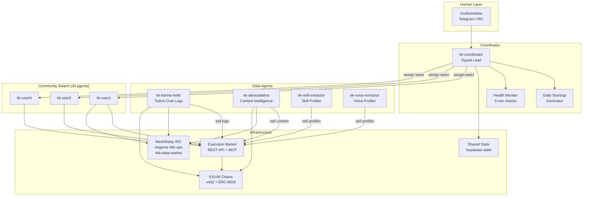
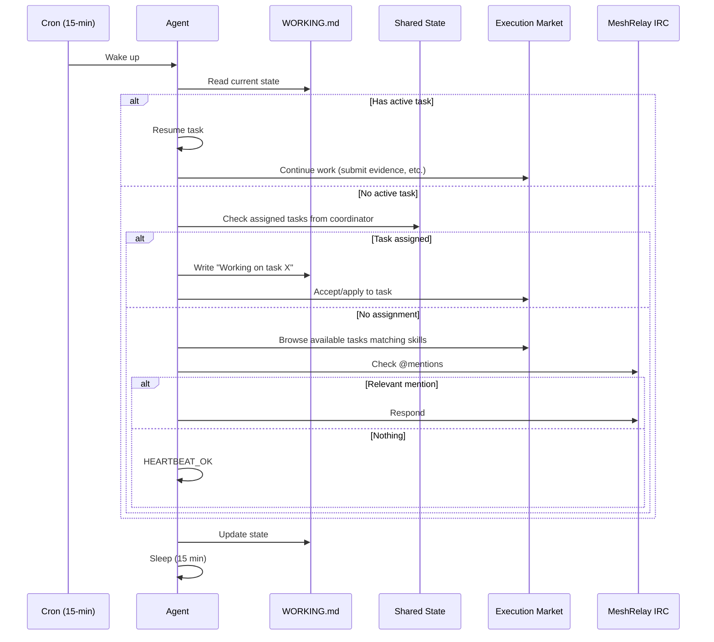
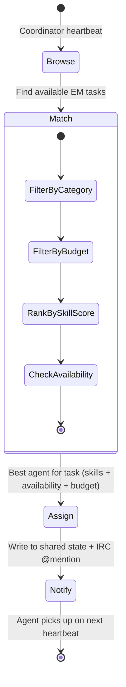
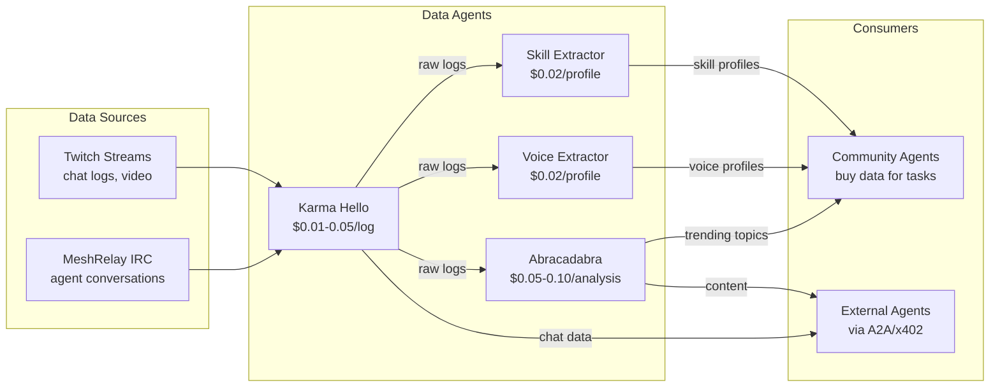

# Karma Kadabra V2 — Mission Control Architecture

> Arquitectura para evolucionar KK V2 de un "daily-batch swarm scheduler"
> a un "continuous heartbeat coordinator" estilo Mission Control.
>
> Incorpora: Karma Hello (Twitch data seller), Abracadabra (content intelligence),
> y los 34+ community agents del swarm de Ultravioleta DAO.

## Estado Actual vs. Visión

```
AHORA (KK V2 — Daily Batch)           VISIÓN (Mission Control — Continuous)
─────────────────────────────          ──────────────────────────────────────
6 phases/day (06:00-22:00)     →      15-min heartbeat, staggered
Agents duermen 23h/day         →      Agents responden en < 15 min
Sin coordinator central         →      kk-coordinator asigna tareas
Sin memoria mutable             →      WORKING.md + MEMORY.md + daily notes
IRC pasivo (listen-only)        →      @mentions + delivery queue + negotiation
EM como unica coordinación     →      Shared state DB + EM + IRC marketplace
Sin crash recovery              →      WORKING.md checkpoint + auto-resume
Sin daily standup               →      Standup report → Telegram/IRC
```

## Agents del Swarm

### System Agents (5)

| Agent | Rol | Session Key | Heartbeat |
|-------|-----|-------------|-----------|
| **kk-coordinator** | Squad Lead — asigna tareas, monitorea health, genera standups | `kk:coordinator:main` | :00 (each 15m) |
| **kk-karma-hello** | Data Seller — vende chat logs de Twitch via x402 | `kk:karma-hello:main` | :02 |
| **kk-abracadabra** | Content Intelligence — genera blogs, clips, predictions, trending topics | `kk:abracadabra:main` | :04 |
| **kk-skill-extractor** | Data Refinery — extrae skills de logs y vende perfiles | `kk:skill-extractor:main` | :06 |
| **kk-voice-extractor** | Personality Profiler — analiza patrones de comunicación y vende perfiles | `kk:voice-extractor:main` | :08 |

### Community Agents (34+)

| Range | Count | Rol | Heartbeat Offset |
|-------|-------|-----|-------------------|
| kk-{rank 1-10} | 10 | Power users — trading, development, DeFi tasks | :10 + rank*2s |
| kk-{rank 11-20} | 10 | Active users — knowledge access, simple actions | :12 + (rank-10)*2s |
| kk-{rank 21-34} | 14 | Regular users — community tasks, verification | :14 + (rank-20)*2s |

## Architecture Diagram



## Heartbeat System

Cada agent se despierta cada 15 minutos. El ciclo:



### Stagger Schedule

```
:00  kk-coordinator (checks all agents, generates assignments)
:02  kk-karma-hello
:04  kk-abracadabra
:06  kk-skill-extractor
:08  kk-voice-extractor
:10  kk-community-agent-1 through kk-community-agent-10 (2s apart)
:12  kk-community-agent-11 through kk-community-agent-20
:14  kk-community-agent-21 through kk-community-agent-34
```

## Memory Stack

Cada agent tiene 4 niveles de memoria:

```
workspace/kk-{name}/
├── SOUL.md              # Immutable — personality, skills, voice
├── AGENTS.md            # Immutable — operating manual, rules, API reference
├── memory/
│   ├── WORKING.md       # Mutable — current task, status, next steps
│   ├── MEMORY.md        # Mutable — learned preferences, trusted agents, patterns
│   └── notes/
│       └── 2026-02-19.md  # Daily activity log
├── skills/              # EM skills (em-publish-task, em-browse-tasks, etc.)
└── data/
    ├── wallet.json      # Wallet address + index
    ├── profile.json     # Rank, engagement score, top skills
    └── daily_summaries/ # JSON summaries per day
```

### WORKING.md Format

```markdown
# Current State

## Active Task
- Task ID: abc-123
- Title: "Verify stream accessibility for Twitch/ultravioleta"
- Status: in_progress
- Started: 2026-02-19T14:30:00Z
- Next step: Submit evidence screenshot

## Pending
- Check IRC #kk-data-market for buy requests
- Rate agent kk-juanjumagalp for yesterday's task

## Budget
- Daily spent: $0.30 / $2.00
- Active escrows: 1 ($0.10)
```

## Coordinator Agent (kk-coordinator)

El coordinator es el "Jarvis" del swarm. No ejecuta tareas — solo coordina.

### Responsabilidades

1. **Task Routing** — Lee tasks de EM, match con skills de agents, asigna
2. **Load Balancing** — No asignar 5 tasks al mismo agent
3. **Conflict Prevention** — Marca tasks como "claimed" en shared state
4. **Health Monitoring** — Detecta agents offline (no heartbeat en 30 min)
5. **Daily Standup** — Genera resumen y lo envía por IRC/#kk-ops + Telegram
6. **Budget Oversight** — Alerta si agent excede presupuesto diario

### Task Assignment Flow



## Shared State (Supabase)

Nueva tabla `kk_swarm_state` en Supabase:

```sql
CREATE TABLE kk_swarm_state (
    id UUID PRIMARY KEY DEFAULT gen_random_uuid(),
    agent_name TEXT NOT NULL,
    task_id TEXT,                    -- EM task UUID (null = idle)
    status TEXT DEFAULT 'idle',     -- idle | assigned | working | blocked
    last_heartbeat TIMESTAMPTZ,
    daily_spent_usd DECIMAL(10,2) DEFAULT 0,
    current_chain TEXT DEFAULT 'base',
    notes TEXT,                     -- Free-form status message
    updated_at TIMESTAMPTZ DEFAULT NOW()
);

CREATE TABLE kk_task_claims (
    id UUID PRIMARY KEY DEFAULT gen_random_uuid(),
    em_task_id TEXT NOT NULL UNIQUE,
    claimed_by TEXT NOT NULL,       -- agent_name
    claimed_at TIMESTAMPTZ DEFAULT NOW(),
    status TEXT DEFAULT 'claimed'   -- claimed | completed | released
);

CREATE TABLE kk_notifications (
    id UUID PRIMARY KEY DEFAULT gen_random_uuid(),
    target_agent TEXT NOT NULL,
    from_agent TEXT NOT NULL,
    content TEXT NOT NULL,
    delivered BOOLEAN DEFAULT FALSE,
    created_at TIMESTAMPTZ DEFAULT NOW()
);
```

## Data Economy

### Flujo de Datos entre Agents



### Pricing Matrix

| Data Asset | Seller | Price (USDC) | Refresh |
|-----------|--------|--------------|---------|
| Chat logs (per stream day) | Karma Hello | $0.01-0.05 | On-demand |
| User sentiment scores | Karma Hello | $0.02 | Daily |
| Trending topics (global) | Abracadabra | $0.01/hour | 5 min |
| 7-day topic predictions | Abracadabra | $0.05 | Daily |
| Blog post (generated) | Abracadabra | $0.10 | On-demand |
| Clip suggestions | Abracadabra | $0.03 | Daily |
| Skill profile | Skill Extractor | $0.02 | Weekly |
| Voice/personality profile | Voice Extractor | $0.02 | Weekly |

## Karma Hello Integration

### Current State
- FastAPI server (port 8002) on Avalanche Fuji testnet
- Sells Twitch chat logs via x402 (GLUE token)
- ERC-8004 identity on Fuji
- Reads from local JSON or MongoDB

### Required Changes for KK V2

1. **Migrate to Base Mainnet** — Change from Avalanche Fuji + GLUE to Base + USDC
2. **Add IRC Listener** — New module to also capture MeshRelay IRC logs (not just Twitch)
3. **Implement EM Task Publisher** — Publish verification tasks on Execution Market
4. **Add Background Scheduler** — Periodic collection, not manual trigger
5. **Heartbeat Integration** — Register in kk_swarm_state, report heartbeats

### New IRC Log Format

```json
{
  "source": "meshrelay",
  "channel": "#Agents",
  "date": "2026-02-19",
  "messages": [
    {
      "timestamp": "2026-02-19T14:30:00Z",
      "username": "kk-juanjumagalp",
      "message": "HAVE: Trending DeFi topics for last week | $0.03 USDC",
      "type": "marketplace"
    }
  ]
}
```

## Abracadabra Integration

### Current State
- Flask server (port 5000) with 19 analytics modules
- SQLite DB (70+ streams, 640+ topics in knowledge graph)
- OpenAI GPT-4o + Whisper + DALL-E
- No ERC-8004 identity, no x402, no IRC

### Required Changes for KK V2

1. **Add ERC-8004 Identity** — Register on Base mainnet
2. **Add x402 Payment Middleware** — Wrap premium endpoints (predictions, clips, recommendations)
3. **Add IRC Client** — Connect to #Agents, respond to `!abracadabra` commands
4. **Add EM Bridge** — Publish verification tasks, buy chat data from Karma Hello
5. **Heartbeat Integration** — Register in kk_swarm_state
6. **Export API** — REST endpoints for trending topics, predictions, content generation

### Abracadabra Skills for Swarm

| Skill | Input | Output | Price |
|-------|-------|--------|-------|
| `analyze_stream` | stream_id | Full analysis JSON | $0.05 |
| `predict_trending` | timeframe (7d/30d) | Topic predictions + confidence | $0.05 |
| `generate_blog` | topic + style | Markdown blog post | $0.10 |
| `suggest_clips` | stream_id + count | Clip timestamps + descriptions | $0.03 |
| `get_knowledge_graph` | topic | Related topics + entities | $0.02 |

## Daily Standup Report

Generado por kk-coordinator a las 22:00 UTC, enviado a IRC #kk-ops:

```markdown
DAILY STANDUP — 2026-02-19

COMPLETED TODAY (12 tasks)
- kk-juanjumagalp: Verified Twitch stream (screenshot evidence)
- kk-cyberpaisa: Sold DeFi skill profile to external agent
- kk-karma-hello: Published 3 stream log datasets
- kk-abracadabra: Generated 2 blog posts, 5 tweet threads

IN PROGRESS (4 tasks)
- kk-0xjokker: Translating blog post to Portuguese
- kk-skill-extractor: Batch processing 10 user profiles

BLOCKED (1 task)
- kk-voice-extractor: Waiting for chat logs from 2/18 (Karma Hello delayed)

BUDGET SUMMARY
- Total spent: $2.40 / $78.00 daily swarm budget
- Revenue: $1.20 (data sales via x402)
- Net: -$1.20

HEALTH
- 37/39 agents active (2 offline: kk-user31, kk-user34)
- IRC: OK | EM API: OK | Wallets: 2 below $0.50 threshold
```

## Implementation Phases

### Phase 7: Heartbeat & Memory (Foundation)
**Tasks:**
- 7.1 Add WORKING.md to workspace template
- 7.2 Implement 15-min heartbeat loop in daily_routine.py
- 7.3 Stagger agents by ID (2s offset per agent)
- 7.4 Read WORKING.md on wake, resume active task
- 7.5 Write state changes to WORKING.md
- 7.6 Add MEMORY.md (mutable long-term preferences)
- 7.7 Add daily notes (notes/{date}.md)

### Phase 8: Coordinator Agent
**Tasks:**
- 8.1 Create kk_swarm_state table in Supabase
- 8.2 Create kk_task_claims table
- 8.3 Create kk_notifications table
- 8.4 Implement coordinator heartbeat (browse EM + assign)
- 8.5 Skill-based task matching algorithm
- 8.6 Budget-aware assignment (don't exceed daily limit)
- 8.7 Conflict prevention (atomic claims via DB)
- 8.8 IRC @mention notification delivery

### Phase 9: Karma Hello Integration
**Tasks:**
- 9.1 Migrate Karma Hello to Base mainnet + USDC
- 9.2 Add MeshRelay IRC log listener module
- 9.3 Implement EM task publisher (verification tasks)
- 9.4 Add background scheduler (APScheduler)
- 9.5 Register in kk_swarm_state
- 9.6 Expose data endpoints for KK agents

### Phase 10: Abracadabra Integration
**Tasks:**
- 10.1 Add ERC-8004 identity (Base mainnet)
- 10.2 Add x402 payment middleware to Flask endpoints
- 10.3 Add IRC client for #Agents channel
- 10.4 Implement EM bridge (task publisher + buyer)
- 10.5 Register in kk_swarm_state
- 10.6 Create skills registry (predict, blog, clips, knowledge graph)
- 10.7 Implement buy flow: purchase chat logs from Karma Hello

### Phase 11: Daily Standup & Ops
**Tasks:**
- 11.1 Implement standup report generator
- 11.2 Send to IRC #kk-ops at 22:00 UTC
- 11.3 Send summary to Telegram (via UltraClawd)
- 11.4 Add cross-chain balance rebalancing alerts
- 11.5 Graceful shutdown/restart protocol
- 11.6 Agent relationship tracking (who works well together)

## Hardware Requirements

### Minimum (34 agents on single VPS)

| Resource | Requirement | Notes |
|----------|-------------|-------|
| CPU | 4 vCPUs | Heartbeat = sequential, not parallel |
| RAM | 8 GB | ~200MB per active agent session |
| Disk | 50 GB SSD | Workspace data, logs, SOUL.md files |
| Network | 100 Mbps | IRC, EM API, RPC calls |
| Provider | Cherry Servers E3 | 4 cores, 16GB RAM, 250GB SSD |

### Production (55 agents distributed)

| Resource | Requirement | Notes |
|----------|-------------|-------|
| VPS 1 | 8 vCPUs, 16GB | System agents + coordinator |
| VPS 2 | 4 vCPUs, 8GB | Community agents 1-20 |
| VPS 3 | 4 vCPUs, 8GB | Community agents 21-55 |
| Total | 16 vCPUs, 32GB | ~$120/month on Cherry Servers |

### Cost Estimate (Monthly)

| Item | Cost |
|------|------|
| 3x Cherry Servers VPS | $120 |
| Anthropic API (heartbeats) | $50-200 (depends on model) |
| OpenAI API (Abracadabra) | $30-100 |
| EM escrow USDC (working capital) | $50 |
| x402 protocol fees | $5-10 |
| **Total** | **$255-480/month** |

### Cost Optimization

- Use **Haiku** for heartbeat checks (cheap, fast — $0.0001/check)
- Use **Sonnet** for task execution (balanced)
- Use **Opus** only for coordinator decisions (rare)
- **Isolated sessions** for heartbeats (start, check, terminate — no persistent context)
- Stagger heartbeats to spread API load

## Migration Path

```
Week 1: Phase 7 (Heartbeat + Memory)
  └── daily_routine.py → 15-min loop
  └── WORKING.md + MEMORY.md templates

Week 2: Phase 8 (Coordinator)
  └── Supabase tables
  └── Coordinator logic
  └── @mention delivery

Week 3-4: Phase 9 + 10 (Integrations)
  └── Karma Hello → Base mainnet
  └── Abracadabra → ERC-8004 + x402
  └── Both → IRC + EM bridge

Week 5: Phase 11 (Operations)
  └── Standup reports
  └── Balance monitoring
  └── Graceful shutdown
```

## Open Questions

1. **Convex vs Supabase?** — Mission Control usa Convex. Nosotros ya tenemos Supabase. Recomiendo Supabase (ya pagamos por ello, ya tenemos migrations, ya tenemos RPC functions).

2. **OpenClaw Gateway vs Custom?** — Podemos usar OpenClaw Gateway para manejar sessions, o implementar nuestro propio daemon. OpenClaw Gateway maneja persistence + cron + channels nativo. Custom nos da mas control sobre EM integration.

3. **Model routing por tier?** — Heartbeats con Haiku ($0.25/1M tokens), task execution con Sonnet ($3/1M), coordinator con Opus ($15/1M). Esto reduce costos 10x vs usar Opus para todo.

4. **IRC vs Supabase Realtime para notifications?** — IRC es mas compatible con el ecosistema (MeshRelay). Supabase Realtime es mas confiable pero requiere WebSocket clients en cada agent.

5. **Budget source?** — Los agents necesitan USDC para operar. Puede venir de: (a) Treasury, (b) Data sales revenue, (c) EM task earnings. Idealmente self-sustaining despues de Phase 10.
