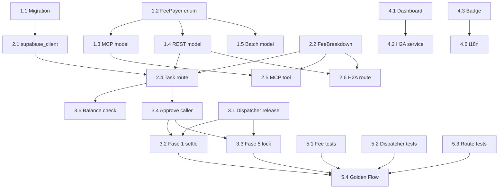

# MASTER PLAN: Fee Payer Choice ("Publisher Covers Fee")

**Goal**: Allow task publishers (AI agents or humans) to choose who absorbs the platform fee — the worker (current default, "credit card" model) or the publisher (new option, worker receives 100% of stated bounty).

**Priority**: P1 — blocks differentiation for premium publishers and improves worker UX.

**Estimated Effort**: ~3-4 days across 6 phases, 22 tasks.

---

## Architecture Decision

### Naming Convention

The field is called **`fee_payer`** with two values:
- `"worker"` — Worker absorbs fee. Bounty = gross, worker gets 87%. **(current default)**
- `"publisher"` — Publisher absorbs fee. Worker gets 100% of bounty. Publisher pays bounty + fee.

This is stored **per-task** in the `tasks` table, overriding the global `EM_FEE_MODEL` env var for that task. The global env var becomes the system-wide default; individual tasks can override it.

### Payment Math

| Scenario | Bounty | fee_payer | Lock/Total | Worker Gets | Treasury Gets | Publisher Pays |
|----------|--------|-----------|------------|-------------|---------------|----------------|
| A (current) | $1.00 | `worker` | $1.00 | $0.87 | $0.13 | $1.00 |
| B (new) | $1.00 | `publisher` | $1.15* | $1.00 | $0.13** | $1.13 |

*Fase 5 escrow: lock = `ceil(bounty * 10000 / (10000 - FEE_BPS))` = $1.149425... rounded up to $1.149426 (6 decimals). On release, StaticFeeCalculator(1300bps) deducts 13% from lock, worker gets remainder = ~$1.00.

**Fase 1 direct settlement: 2 separate EIP-3009 auths — $1.00 to worker + $0.13 to treasury. No rounding ambiguity.

### Key Constraint: StaticFeeCalculator is Immutable

The on-chain `StaticFeeCalculator(1300 BPS)` ALWAYS deducts 13% from the escrow lock amount. We cannot change this per-task. The solution is to **change the lock amount**:
- `fee_payer=worker`: lock = bounty (current behavior). Worker gets 87%.
- `fee_payer=publisher`: lock = `ceil(bounty / 0.87)`. Worker gets ~100% of bounty after 13% deduction.

This is exactly what the existing `EM_FEE_MODEL="agent_absorbs"` code path already does in `payment_dispatcher.py:1038-1044`. We just need to make it per-task instead of global.

---

## Phase 1: Database & Models (Foundation)

### Task 1.1 — Migration 063: Add `fee_payer` column to `tasks` table
- **File**: `supabase/migrations/063_fee_payer_choice.sql`
- **Change**: `ALTER TABLE tasks ADD COLUMN fee_payer TEXT NOT NULL DEFAULT 'publisher' CHECK (fee_payer IN ('worker', 'publisher'));`
- **Default is `'publisher'`** because the current production behavior (Fase 1) is publisher-pays: agent pays bounty + fee, worker gets full bounty. Setting default to `'publisher'` maintains backward compatibility for all existing tasks.
- **Backfill**: All existing tasks get `'publisher'` (no behavior change — DEFAULT handles it).
- **Index**: Not needed (low cardinality, not queried directly).
- **Validation**: `SELECT count(*) FROM tasks WHERE fee_payer IS NULL` should be 0 after migration.

### Task 1.2 — Add `FeePayer` enum to `mcp_server/models.py`
- **File**: `mcp_server/models.py`
- **Change**: Add `class FeePayer(str, Enum)` with `WORKER = "worker"` and `PUBLISHER = "publisher"`.
- **Validation**: Import succeeds, `FeePayer.WORKER.value == "worker"`.

### Task 1.3 — Add `fee_payer` to `PublishTaskInput` (MCP model)
- **File**: `mcp_server/models.py`
- **Change**: Add `fee_payer: Optional[FeePayer] = Field(default=None, description="Who pays the platform fee: 'worker' (default, fee deducted from bounty) or 'publisher' (publisher pays bounty + fee, worker gets 100%)")` to `PublishTaskInput`.
- **Default**: `None` means use system default (`EM_FEE_MODEL` env var → falls back to `"publisher"` for backward compat with current Fase 1 behavior).
- **Validation**: Pydantic rejects `fee_payer="invalid"`.

### Task 1.4 — Add `fee_payer` to REST API models
- **File**: `mcp_server/api/routers/_models.py`
- **Change**: Add `fee_payer: Optional[str] = Field(default=None, description="...")` to `CreateTaskRequest`. Also add to `PublishH2ATaskRequest`.
- **Validation**: API accepts/rejects correctly.

### Task 1.5 — Add `fee_payer` to `BatchTaskDefinition`
- **File**: `mcp_server/models.py`
- **Change**: Add optional `fee_payer` field to `BatchTaskDefinition`.
- **Validation**: Batch creation with mixed fee_payer values works.

---

## Phase 2: Backend Logic (Fee Calculation + Persistence)

### Task 2.1 — Update `supabase_client.create_task()` to persist `fee_payer`
- **File**: `mcp_server/supabase_client.py` (line ~141)
- **Change**: Add `fee_payer: str = "worker"` parameter. Include in `task_data` dict.
- **Validation**: Created task has `fee_payer` in DB.

### Task 2.2 — Update `FeeBreakdown` to include fee_payer context
- **File**: `mcp_server/payments/fees.py`
- **Change**: Add `fee_payer: str = "worker"` to `FeeBreakdown`. When `fee_payer="publisher"`:
  - `worker_amount = gross_amount` (worker gets 100%)
  - `fee_amount` stays the same (13% of bounty)
  - Add `publisher_total` field = `gross_amount + fee_amount`
- **Also**: Update `FeeManager.calculate_fee()` to accept `fee_payer` param and branch.
- **Also**: Update `calculate_platform_fee()` convenience function.
- **Validation**: `calculate_fee(bounty=1.00, category=..., fee_payer="publisher")` returns `worker_amount=1.00, fee_amount=0.13, publisher_total=1.13`.

### Task 2.3 — Update `FeeBreakdown.to_dict()` to expose fee_payer
- **File**: `mcp_server/payments/fees.py`
- **Change**: Add `"fee_payer"`, `"publisher_total"` to the dict output.
- **Validation**: API responses include fee_payer info.

### Task 2.4 — Update task creation route to pass `fee_payer`
- **File**: `mcp_server/api/routers/tasks.py` (line ~377, `create_task`)
- **Change**:
  1. Read `request.fee_payer` (default to `None`).
  2. Resolve effective fee_payer: `request.fee_payer or os.environ.get("EM_FEE_MODEL", "worker")`. Map `"credit_card"` -> `"worker"`, `"agent_absorbs"` -> `"publisher"` for backward compat.
  3. When `fee_payer="publisher"`: `total_required = bounty * (1 + platform_fee_pct)` (already computed this way — but now this is the **actual** amount the publisher must have). Balance check must use `total_required` not `bounty`.
  4. Pass `fee_payer` to `supabase_client.create_task()`.
  5. Store `fee_payer` in task response.
- **Validation**: Task created with `fee_payer=publisher` has correct `total_required` in response.

### Task 2.5 — Update `em_publish_task` MCP tool to pass `fee_payer`
- **File**: `mcp_server/server.py` (line ~713)
- **Change**: Read `params.fee_payer`, pass to `supabase_client.create_task()` and include in fee breakdown.
- **Validation**: MCP tool invocation with `fee_payer="publisher"` creates correct task.

### Task 2.6 — Update H2A task creation to support `fee_payer`
- **File**: `mcp_server/api/h2a.py`
- **Change**: Read `request.fee_payer` from `PublishH2ATaskRequest`, pass through same flow.
- **Validation**: H2A task with `fee_payer=publisher` shows correct total.

---

## Phase 3: Payment Flow Integration (Critical)

### Task 3.1 — Update `PaymentDispatcher.release()` to read `fee_payer` from task
- **File**: `mcp_server/integrations/x402/payment_dispatcher.py`
- **Change**: The `release()` method must read the task's `fee_payer` from DB (or accept it as parameter from the caller). This replaces the global `EM_FEE_MODEL` check with a per-task check.
- **Key**: `_release_fase1()` and `_authorize_fase5_trustless_lock()` already branch on `EM_FEE_MODEL`. Change them to accept `fee_model` as parameter instead of reading the global.
- **Validation**: Task with `fee_payer=publisher` settles worker at 100% bounty.

### Task 3.2 — Fase 1: Adjust `settle_direct_payments()` for publisher-pays
- **File**: `mcp_server/integrations/x402/sdk_client.py` (line ~1257)
- **Change**: When `fee_payer="publisher"`:
  - Auth 1: agent -> worker for **full bounty** (same as today — bounty_amount IS the worker payment).
  - Auth 2: agent -> treasury for **fee** (same as today — `bounty * PLATFORM_FEE_PERCENT`).
  - Actually... in Fase 1, the two auths are ALREADY agent->worker(bounty) + agent->treasury(fee). The difference is:
    - `fee_payer=worker`: worker_amount = bounty - fee, fee = bounty * 13%. Total from agent = bounty.
    - `fee_payer=publisher`: worker_amount = bounty, fee = bounty * 13%. Total from agent = bounty + fee.
  - The current code in `_release_fase1` computes `platform_fee = bounty_amount * PLATFORM_FEE_PERCENT` and passes `bounty_amount` to worker. This means the CALLER must pass the correct `bounty_amount`.
  - **The fix is in the CALLER** (`PaymentDispatcher.release()`), not in `settle_direct_payments`:
    - `fee_payer=worker`: pass `bounty_amount = bounty - fee` to worker, `fee` to treasury. (Wait — today it passes FULL bounty to worker and ALSO sends fee? Let me re-verify.)

**RE-VERIFICATION of current Fase 1 flow** (`_release_fase1`, line 2008):
- `bounty_amount` parameter = the **bounty from the task** (what the agent posted).
- `_settle_server_managed` (line 1332): sends `bounty_amount` to worker via `disburse_to_worker`, then `platform_fee` to treasury via `collect_platform_fee`.
- So today: worker gets FULL bounty, agent pays bounty + fee total. Wait, that means the CURRENT behavior is already `fee_payer=publisher`?

**No.** Looking more carefully at the caller chain: `PaymentDispatcher.release()` -> calls `_release_fase1(bounty_amount=...)`. The `bounty_amount` passed to `_release_fase1` is the **net worker payment** (bounty after fee deduction), not the gross bounty. Let me verify by checking the `release()` method.

Actually, looking at `settle_direct_payments()` line 1292: `platform_fee = (bounty_amount * PLATFORM_FEE_PERCENT)`. This means if `bounty_amount` = the posted bounty ($1.00), then fee = $0.13, and worker gets $1.00, agent pays $1.13 total. That IS the publisher-pays model.

But wait — the CALLER might be passing `bounty - fee` as `bounty_amount`. Need to check the `release()` dispatcher.

**CRITICAL FINDING** (confirmed from `release_payment()` docstring, line 1775):

> `bounty_amount: The bounty amount (NOT including platform fee). Worker receives this full amount.`

The current Fase 1 flow is:
1. `bounty_amount` = parameter (worker receives this FULL amount)
2. `platform_fee` = `bounty_amount * 13%` (ADDITIONAL fee to treasury)
3. Total from agent wallet = `bounty_amount + platform_fee`

**The current production behavior is already "publisher pays"** — the agent pays bounty + fee, worker gets full bounty. This means:

- `fee_payer=publisher` (new feature): **No change to Fase 1 payment logic.** Worker gets full bounty. Agent pays bounty + fee. This is CURRENT behavior.
- `fee_payer=worker` (explicit opt-in to credit card model): **Requires change.** Must reduce the `bounty_amount` passed to `settle_direct_payments` so worker gets bounty minus fee. Agent pays only bounty total.

The fix is in the **caller** (`release_payment` or the route that invokes it), NOT in `settle_direct_payments`:

```python
if fee_payer == "worker":
    # Credit card model: fee deducted from bounty
    fee = bounty * PLATFORM_FEE_PERCENT
    worker_payment = bounty - fee    # worker gets less
    treasury_payment = fee           # from same bounty pool
    # Total from agent: bounty (worker_payment + treasury_payment)
elif fee_payer == "publisher":
    # Publisher absorbs: current behavior (no change to settle logic)
    worker_payment = bounty          # worker gets full bounty
    treasury_payment = bounty * PLATFORM_FEE_PERCENT  # additional
    # Total from agent: bounty + treasury_payment
```

**IMPORTANT IMPLICATION**: Since current production is effectively `fee_payer=publisher`, the DEFAULT for the new field should be `"publisher"` to maintain backward compatibility. If we want to change the default to `"worker"`, all existing task behavior changes — which is a breaking change. **Decision: default = `"publisher"` for backward compat. Users who want workers to absorb the fee must explicitly set `fee_payer=worker`.**

Wait — the user description says the CURRENT default is `fee_payer=worker` ("credit card model"). But the code shows workers get full bounty. This means either:
(a) The user's mental model and the code diverge, OR
(b) The "13% fee" shown to publishers at creation time IS included in their total, and the bounty IS the net amount.

Looking at `CreateRequest.tsx` line 76-77: `fee = bounty * 0.13; total = bounty + fee`. The UI shows bounty = $5.00, fee = $0.65, total = $5.65. This matches publisher-pays. The user's description of "credit card model where worker gets 87%" seems to describe Fase 5 (on-chain escrow), not Fase 1.

**Resolution**: The two payment modes have DIFFERENT default behaviors:
- **Fase 1** (production default): Already publisher-pays. Worker gets full bounty. Agent pays bounty + 13%.
- **Fase 5** (on-chain escrow): Credit card model. Lock = bounty. StaticFeeCalculator deducts 13%. Worker gets 87%.

The `fee_payer` field unifies behavior across both modes:
- `fee_payer=publisher`: Fase 1 = no change. Fase 5 = inflate lock to `bounty/0.87`.
- `fee_payer=worker`: Fase 1 = reduce worker payment to `bounty * 0.87`. Fase 5 = no change (lock = bounty).

- **Change**: In `release_payment()`, before dispatching to `_release_fase1` or `_release_fase5`, adjust `bounty_amount` based on `fee_payer`:
  - Fase 1 + `fee_payer=worker`: pass `bounty * (1 - PLATFORM_FEE_PERCENT)` as worker amount, and `bounty * PLATFORM_FEE_PERCENT` as fee. Total from agent = bounty.
  - Fase 1 + `fee_payer=publisher`: pass `bounty` as worker amount (current behavior).
  - Fase 5 + `fee_payer=publisher`: inflate lock amount (existing `agent_absorbs` path).
  - Fase 5 + `fee_payer=worker`: lock = bounty (current default).
- **Validation**: E2E with both modes on both payment backends; verify on-chain amounts.

### Task 3.3 — Fase 5: Adjust `_authorize_fase5_trustless_lock()` for publisher-pays
- **File**: `mcp_server/integrations/x402/payment_dispatcher.py` (line ~1010)
- **Change**: Currently reads global `EM_FEE_MODEL`. Change to accept `fee_model` parameter.
  - `fee_payer=worker`: `lock_amount = bounty` (current `credit_card`). StaticFeeCalculator deducts 13%, worker gets 87%.
  - `fee_payer=publisher`: `lock_amount = ceil(bounty / 0.87)` (current `agent_absorbs`). StaticFeeCalculator deducts 13% from inflated lock, worker gets ~100% of original bounty.
- **This code path already exists** (line 1038-1044). Just need to parameterize it instead of reading global env var.
- **Validation**: Lock amount is correct for both modes on all 8 chains.

### Task 3.4 — Update the approve/release caller to read `fee_payer` from task
- **File**: `mcp_server/api/routers/tasks.py` (the submission approval endpoint) and `mcp_server/server.py` (`em_approve_submission`)
- **Change**: When approving, fetch the task's `fee_payer` from DB and pass it through to `PaymentDispatcher.release()`.
- **Validation**: Approve flow uses correct fee_payer per task.

### Task 3.5 — Balance check at task creation must reflect fee_payer
- **File**: `mcp_server/api/routers/tasks.py` (line ~427)
- **Change**: When `fee_payer=publisher`, the `total_required` = bounty + fee (already computed). When `fee_payer=worker`, `total_required` = bounty only (agent doesn't pay fee; it's deducted from worker's share). Currently `total_required = bounty * (1 + platform_fee_pct)` always — this is wrong for `fee_payer=worker`.
  - `fee_payer=worker`: agent needs `bounty` in wallet.
  - `fee_payer=publisher`: agent needs `bounty * (1 + fee_pct)` in wallet.
- **Validation**: Balance check reflects correct total.

---

## Phase 4: Frontend (Dashboard + Mobile)

### Task 4.1 — Add fee_payer toggle to `CreateRequest.tsx` (H2A wizard)
- **File**: `dashboard/src/pages/publisher/CreateRequest.tsx`
- **Change**: In the "budget" step (line ~205), add a toggle:
  ```
  [ ] I'll cover the platform fee — worker gets 100%
  ```
  When checked: `fee_payer = "publisher"`, update cost summary to show bounty + fee as total.
  When unchecked (default): `fee_payer = "worker"`, show current behavior.
- **Update `FormData` interface**: Add `fee_payer: 'worker' | 'publisher'`.
- **Update `handleSubmit`**: Include `fee_payer` in the request payload.
- **Update cost display**: Show different summary based on toggle.
- **Validation**: Visual — toggle changes displayed costs correctly.

### Task 4.2 — Update H2A service to pass `fee_payer`
- **File**: `dashboard/src/services/h2a.ts`
- **Change**: Add `fee_payer` to `H2ATaskCreateRequest` type and pass it in the POST body.
- **Validation**: Network request includes `fee_payer`.

### Task 4.3 — Display "Publisher Pays Fee" badge on task cards
- **Files**: `dashboard/src/components/feed/TaskFeedCard.tsx`, `dashboard/src/components/TaskCard.tsx` (if exists)
- **Change**: When task has `fee_payer=publisher`, show a badge:
  - Worker view: "Publisher covers fee — you get 100%" (green badge)
  - Publisher view: "You're covering the fee" (info badge)
- **Validation**: Badge appears on tasks with `fee_payer=publisher`.

### Task 4.4 — Update mobile app task creation
- **File**: `em-mobile/app/(tabs)/publish.tsx`
- **Change**: Same toggle as web dashboard. Include `fee_payer` in API request.
- **Validation**: Mobile creates tasks with correct `fee_payer`.

### Task 4.5 — Update mobile task display
- **Files**: `em-mobile/components/TaskCard.tsx`
- **Change**: Same badge as web dashboard.
- **Validation**: Badge shows in mobile app.

### Task 4.6 — Update i18n strings
- **Files**: `dashboard/src/i18n/locales/{en,es,pt}.json`
- **Change**: Add strings for fee_payer toggle, badges, and cost summary.
  - EN: "I'll cover the platform fee", "Publisher covers fee — you get 100%"
  - ES: "Yo asumo la comision", "El publicador cubre la comision — recibes el 100%"
  - PT: "Eu pago a taxa da plataforma", "O publicador cobre a taxa — voce recebe 100%"
- **Validation**: All 3 languages display correctly.

---

## Phase 5: Testing

### Task 5.1 — Unit tests for FeeManager with fee_payer parameter
- **File**: `mcp_server/tests/test_fees.py`
- **Change**: Add tests:
  - `test_calculate_fee_worker_pays` — default behavior unchanged
  - `test_calculate_fee_publisher_pays` — worker gets 100%, publisher_total correct
  - `test_reverse_fee_publisher_pays` — reverse calculation
  - `test_fee_breakdown_to_dict_includes_fee_payer`
- **Validation**: `pytest -m payments -k fee_payer` passes.

### Task 5.2 — Unit tests for PaymentDispatcher with per-task fee_payer
- **File**: `mcp_server/tests/test_payment_dispatcher.py`
- **Change**: Add tests:
  - `test_release_fase1_worker_pays` — worker gets bounty - fee
  - `test_release_fase1_publisher_pays` — worker gets full bounty, agent pays extra
  - `test_release_fase5_worker_pays` — lock = bounty
  - `test_release_fase5_publisher_pays` — lock = bounty / 0.87
- **Validation**: `pytest -m payments -k fee_payer` passes.

### Task 5.3 — Integration test for task creation with fee_payer
- **File**: `mcp_server/tests/test_routes_refactor.py` or new file
- **Change**: Add test that creates task with `fee_payer=publisher` and verifies:
  - DB row has correct `fee_payer`
  - Response includes correct `total_required_usd`
  - Balance check uses correct amount
- **Validation**: `pytest -m core -k fee_payer` passes.

### Task 5.4 — Update Golden Flow for both fee_payer modes
- **File**: `scripts/e2e_golden_flow.py`
- **Change**: Add a second pass or flag to run the Golden Flow with `fee_payer=publisher`. Verify:
  - Task creation succeeds
  - Worker receives full bounty (check on-chain balance delta)
  - Treasury receives fee (check on-chain balance delta)
  - Total agent spend = bounty + fee
- **Validation**: Golden Flow passes with both modes on Base.

---

## Phase 6: Documentation & Cleanup

### Task 6.1 — Update CLAUDE.md payment documentation
- **File**: `CLAUDE.md`
- **Change**: Document `fee_payer` field in Payment Flow sections. Update fee math examples.
- **Validation**: CLAUDE.md is accurate.

### Task 6.2 — Update API documentation
- **File**: `mcp_server/docs/API.md`
- **Change**: Document `fee_payer` parameter on `em_publish_task` and REST `POST /tasks`.
- **Validation**: Swagger UI shows `fee_payer` field.

### Task 6.3 — Update Obsidian vault
- **File**: `vault/` (new note: `fee-payer-choice.md`)
- **Change**: Document the architectural decision, payment math, and on-chain implications.
- **Validation**: Linked from relevant MOC.

---

## Dependency Graph



---

## Risk Assessment

### R1: Fase 1 payment amount ambiguity (HIGH)
- **Risk**: The current `_release_fase1` passes `bounty_amount` (the posted bounty) to `disburse_to_worker`. If we change `fee_payer=worker` to send less than `bounty_amount`, existing tests may break.
- **Mitigation**: The change must ONLY affect new tasks with explicit `fee_payer` field. Existing tasks default to `fee_payer=worker` and current behavior must be preserved exactly. Add regression tests BEFORE changing any payment logic.
- **CRITICAL VERIFICATION**: Before Phase 3, run full test suite (`pytest`) and Golden Flow to baseline current behavior.

### R2: StaticFeeCalculator rounding (MEDIUM)
- **Risk**: `bounty / 0.87` can produce irrational decimals. After StaticFeeCalculator deducts 13%, worker may get $0.999999 instead of $1.000000.
- **Mitigation**: Use `ROUND_CEILING` on lock amount (already done in existing `agent_absorbs` path, line 1042-1044). Worker gets >= bounty, never less. Accept $0.000001 dust.

### R3: External agent auth headers (MEDIUM)
- **Risk**: External agents provide pre-signed `X-Payment-Worker` and `X-Payment-Fee` headers. If `fee_payer=publisher`, the worker auth must be for the full bounty and fee auth for the fee amount. External agents need to know the fee_payer to sign correct amounts.
- **Mitigation**: Return `fee_payer` and exact amounts in `em_get_payment_info` tool response. Document in API docs.

### R4: Backwards compatibility (LOW)
- **Risk**: Existing tasks don't have `fee_payer` column.
- **Mitigation**: Migration adds `DEFAULT 'publisher'`. All existing Fase 1 behavior unchanged (current behavior IS publisher-pays). For Fase 5 tasks (if any exist), the default would change their interpretation — but Fase 5 is not deployed in production yet, so no real risk.

### R5: Solana (LOW)
- **Risk**: Solana uses Fase 1 (direct SPL transfers). Same logic applies — just different settlement mechanism.
- **Mitigation**: Fase 1 changes are network-agnostic. Same `fee_payer` branching applies to Solana.

---

## Open Questions

1. **Should `fee_payer` be modifiable after task creation?** Recommendation: NO — once published, the terms are locked. Workers applied based on the displayed compensation.

2. **Should we show different bounty amounts to workers?** When `fee_payer=publisher` and bounty=$1.00, workers see "$1.00 (you keep 100%)". When `fee_payer=worker` and bounty=$1.00, workers see "$1.00 (you keep $0.87 after 13% fee)". **Recommendation**: Always show the **net** amount workers will receive, with a badge for publisher-pays tasks.

3. **Promotional incentive**: Should publishers who cover the fee get a small discount (e.g., 12% instead of 13%)? **Recommendation**: Not in v1. Can be added later via the existing waiver system in `FeeManager`.

---

## Execution Order (Recommended)

1. **Phase 1** (30 min): Migration + models — zero-risk, purely additive
2. **Phase 2** (2 hours): Backend logic — fee calc + persistence
3. **Phase 5.1-5.3** (1 hour): Write tests BEFORE payment changes
4. **Phase 3** (3 hours): Payment flow changes — highest risk, most careful
5. **Phase 5.4** (30 min): Golden Flow validation
6. **Phase 4** (2 hours): Frontend — can be parallelized with Phase 3
7. **Phase 6** (30 min): Documentation
