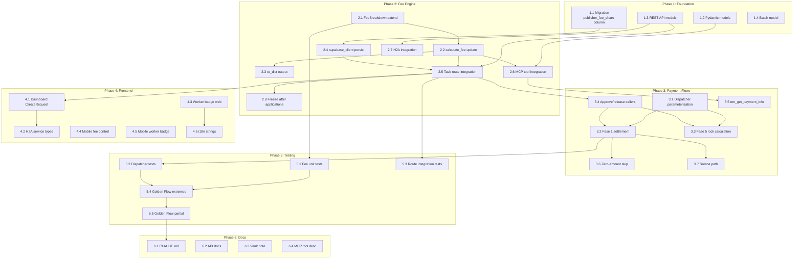

# MASTER PLAN: Variable Fee Split (`publisher_fee_share`)

## Goal

Allow task publishers to choose what **percentage** (0-100%) of the 13% platform fee they absorb. The remainder is deducted from the worker's payment. This is NOT binary — it's a continuous slider from "worker pays all" to "publisher pays all".

## Current Default (MUST NOT CHANGE)

The current production behavior (Fase 1) is **publisher pays 100%**: agent pays bounty + 13% fee, worker receives full bounty. The default `publisher_fee_share = 100` preserves this exactly. No existing behavior changes.

---

## Key Concept: `publisher_fee_share`

An integer 0-100 stored per-task. Represents what percentage of the 13% platform fee the publisher absorbs.

### Math (bounty = $1.00, fee_rate = 13%)

| `publisher_fee_share` | Publisher Pays | Worker Fee Deduction | Worker Receives | Publisher Total |
|----------------------:|---------------:|---------------------:|----------------:|----------------:|
| **100** (default/current) | $0.13 | $0.00 | **$1.00** | $1.13 |
| 70 | $0.091 | $0.039 | $0.961 | $1.091 |
| 50 | $0.065 | $0.065 | $0.935 | $1.065 |
| 30 | $0.039 | $0.091 | $0.909 | $1.039 |
| 0 | $0.00 | $0.13 | $0.87 | $1.00 |

### Formulas

```
total_fee         = bounty * fee_rate                          # e.g., $0.13
publisher_portion = total_fee * (publisher_fee_share / 100)    # publisher absorbs this
worker_portion    = total_fee - publisher_portion              # subtraction method (zero rounding error)
worker_net        = bounty - worker_portion                    # what worker actually receives
publisher_total   = bounty + publisher_portion                 # what publisher wallet pays
```

**Treasury always gets `total_fee`** — the question is just where it comes from (the bounty pool vs. on top of it).

---

## Architecture Decision Record

### ADR-1: Integer 0-100 (not decimal, not binary)

**Decision**: `publisher_fee_share` is `SMALLINT` 0-100.

**Why**: 101 values cover all practical cases. Decimal precision (33.33%) yields $0.0000429 difference on a $0.13 fee — irrelevant. Integer is simpler to validate, store, display, and convert to BPS.

### ADR-2: Subtraction method for split calculation

**Decision**: Always compute `publisher_portion` first (rounded to 6 decimals), then `worker_portion = total_fee - publisher_portion`.

**Why**: Guarantees portions sum exactly to `total_fee`. Zero dust accumulation over any number of tasks. The publisher (who chose the split) absorbs any rounding.

### ADR-3: Minimum fee applies to TOTAL only

**Decision**: The $0.01 minimum applies to `total_fee`, not per-portion. Skip EIP-3009 auth when a portion is $0.000000.

**Why**: On-chain USDC has no minimum transfer. Per-portion minimums create dead zones where most splits are impossible for small fees.

### ADR-4: Fase 5 escrow — variable lock amount (all splits supported)

**Decision**: Support ALL splits (0-100) in Fase 5 by adjusting the lock amount:

```
worker_net = bounty - total_fee * (1 - publisher_fee_share/100)
lock_amount = ceil(worker_net / 0.87)    # 6-decimal ROUND_CEILING
```

After StaticFeeCalculator takes 13%, worker gets `lock * 0.87 = worker_net`.

**Why**: This is the generalized version of the existing `agent_absorbs` code path. At `publisher_fee_share=0`, lock=bounty (current credit_card). At `publisher_fee_share=100`, lock=bounty/0.87 (current agent_absorbs). Intermediate values produce intermediate lock amounts.

**Known tradeoff**: Treasury receives 13% of `lock_amount`, which is slightly more than `total_fee * publisher_share` for partial splits. Max excess ~2% of bounty at extreme splits. Accepted as inherent to StaticFeeCalculator design. Worker always gets the exact correct net.

**Alternative (conservative)**: Only allow 0 and 100 in Fase 5, force Fase 1 for 1-99. Simpler but limits feature. Can be used as Phase 1 approach, relaxed in Phase 2.

### ADR-5: Freeze after applications

**Decision**: `publisher_fee_share` is immutable once a task has applications. Reject updates via API check.

**Why**: Anti bait-and-switch. Workers apply based on displayed compensation. Changing terms after application violates trust.

### ADR-6: `EM_FEE_MODEL` env var becomes system default

**Decision**: The global `EM_FEE_MODEL` env var (currently `credit_card`) maps to a default `publisher_fee_share`:
- `credit_card` → default 0 (worker pays all)
- `agent_absorbs` → default 100 (publisher pays all)

Per-task `publisher_fee_share` overrides the system default. Current production has `EM_FEE_MODEL` effectively as `agent_absorbs` (publisher pays), so default should be 100.

---

## Trustlessness Impact

| Mode | Current Trust Level | With Variable Split | Notes |
|------|-------------------|-------------------|-------|
| Fase 1 | TRUSTED | TRUSTED (unchanged) | Server signs both auths — already fully trusted |
| Fase 5 (0 or 100) | TRUSTLESS | TRUSTLESS | Same as current credit_card / agent_absorbs |
| Fase 5 (1-99) | N/A | TRUST-MINIMIZED | Lock amount formula is off-chain; verifiable but not enforced on-chain |

**Mitigations for trust-minimized splits**:
1. Lock amount verifiable on-chain via `capturableAmount`
2. Worker can compute expected lock from published `(bounty, fee_rate, publisher_fee_share)`
3. `payment_events` logs all amounts with tx hashes
4. Future: `VariableFeeCalculator` contract makes it fully trustless (requires BackTrack collaboration)

---

## Phase 1: Database & Models (Foundation) — LOW RISK

### Task 1.1 — Migration: Add `publisher_fee_share` column

**File**: `supabase/migrations/063_variable_fee_split.sql`

```sql
ALTER TABLE tasks
  ADD COLUMN publisher_fee_share SMALLINT NOT NULL DEFAULT 100
  CHECK (publisher_fee_share BETWEEN 0 AND 100);

COMMENT ON COLUMN tasks.publisher_fee_share IS
  'Percentage of platform fee absorbed by publisher (0-100). '
  '100 = publisher pays all fee (current default). '
  '0 = worker absorbs all fee from bounty.';
```

- Default 100 preserves current behavior (publisher pays)
- All existing tasks get 100 implicitly
- No backfill needed

### Task 1.2 — Add `publisher_fee_share` to Pydantic models

**File**: `mcp_server/models.py`

- Add to `PublishTaskInput`: `publisher_fee_share: Optional[int] = Field(default=None, ge=0, le=100, description="...")`
- `None` = use system default from `EM_FEE_MODEL`

### Task 1.3 — Add to REST API models

**File**: `mcp_server/api/routers/_models.py`

- Add to `CreateTaskRequest` and `PublishH2ATaskRequest`: `publisher_fee_share: Optional[int] = Field(default=None, ge=0, le=100)`

### Task 1.4 — Add to `BatchTaskDefinition`

**File**: `mcp_server/models.py`

- Optional field for batch creation with mixed splits

---

## Phase 2: Fee Calculation Engine — LOW RISK

### Task 2.1 — Extend `FeeBreakdown` dataclass

**File**: `mcp_server/payments/fees.py`

Add new fields:
```python
@dataclass
class FeeBreakdown:
    gross_amount: Decimal           # posted bounty
    fee_rate: Decimal               # category rate (0.11-0.13)
    fee_amount: Decimal             # total fee = gross * rate
    worker_amount: Decimal          # RENAMED meaning: worker_net after split
    publisher_fee_share: int        # 0-100
    publisher_fee_portion: Decimal  # fee * (share / 100)
    worker_fee_portion: Decimal     # fee - publisher_portion (subtraction method)
    publisher_total: Decimal        # gross + publisher_fee_portion
    treasury_wallet: str
    category: TaskCategory
```

### Task 2.2 — Update `calculate_fee()` to accept `publisher_fee_share`

**File**: `mcp_server/payments/fees.py`

```python
def calculate_fee(bounty, category, publisher_fee_share=100):
    fee = bounty * fee_rate
    publisher_portion = (fee * Decimal(publisher_fee_share) / Decimal(100)).quantize(Decimal("0.000001"), ROUND_HALF_UP)
    worker_portion = fee - publisher_portion  # subtraction method
    worker_net = bounty - worker_portion
    publisher_total = bounty + publisher_portion
    ...
```

### Task 2.3 — Update `to_dict()` output

**File**: `mcp_server/payments/fees.py`

Add `publisher_fee_share`, `publisher_fee_portion`, `worker_fee_portion`, `publisher_total` to dict output.

### Task 2.4 — Update `supabase_client.create_task()` to persist

**File**: `mcp_server/supabase_client.py`

Add `publisher_fee_share` parameter, include in `task_data` dict.

### Task 2.5 — Update task creation route

**File**: `mcp_server/api/routers/tasks.py`

1. Read `request.publisher_fee_share` (default None → resolve from env)
2. Map legacy env: `credit_card` → 0, `agent_absorbs` → 100
3. Adjust balance check: `total_required = bounty + publisher_fee_portion` (not always bounty + full fee)
4. Pass to `supabase_client.create_task()`
5. Include in API response with full breakdown

### Task 2.6 — Update `em_publish_task` MCP tool

**File**: `mcp_server/server.py`

Accept `publisher_fee_share` parameter, pass through, include in response.

### Task 2.7 — Update H2A task creation

**File**: `mcp_server/api/h2a.py`

Same flow as Task 2.5 for H2A endpoint.

### Task 2.8 — Freeze after applications

**File**: `mcp_server/api/routers/tasks.py`

In task update logic: if `publisher_fee_share` is being modified and task has applications → reject with 409 Conflict.

---

## Phase 3: Payment Flow Integration — HIGH RISK (Critical Path)

### Task 3.1 — Parameterize `PaymentDispatcher` per-task

**File**: `mcp_server/integrations/x402/payment_dispatcher.py`

Replace global `EM_FEE_MODEL` reads with per-task `publisher_fee_share` parameter in:
- `release_payment()` — accept `publisher_fee_share` from caller
- `authorize_escrow_for_worker()` — same

The caller (route/tool) reads from DB and passes it through.

### Task 3.2 — Fase 1: Adjust `settle_direct_payments()`

**File**: `mcp_server/integrations/x402/sdk_client.py`

Accept `publisher_fee_share` parameter (default 100).

```python
async def settle_direct_payments(self, ..., publisher_fee_share: int = 100):
    total_fee = bounty * PLATFORM_FEE_PERCENT
    publisher_portion = (total_fee * Decimal(publisher_fee_share) / Decimal(100)).quantize(...)
    worker_portion = total_fee - publisher_portion
    worker_net = bounty - worker_portion

    # Auth 1: agent -> worker for worker_net (was full bounty)
    await self.disburse_to_worker(amount_usdc=worker_net, ...)

    # Auth 2: agent -> treasury for total_fee (always full fee)
    await self.collect_platform_fee(fee_amount=total_fee, ...)
```

**Key insight**: Treasury always gets the full 13%. The split determines how much comes from the bounty pool (worker's share) vs. additional from the publisher.

**When publisher_fee_share=100** (current): worker_net = bounty, publisher pays bounty + fee. Identical to today.
**When publisher_fee_share=0**: worker_net = bounty - fee, publisher pays only bounty. Credit card model.

### Task 3.3 — Fase 5: Adjust lock amount calculation

**File**: `mcp_server/integrations/x402/payment_dispatcher.py`

```python
async def authorize_escrow_for_worker(self, ..., publisher_fee_share: int = 100):
    total_fee = bounty * fee_rate
    worker_portion = total_fee * Decimal(100 - publisher_fee_share) / Decimal(100)
    worker_net = bounty - worker_portion

    # Lock amount so that after 13% on-chain deduction, worker gets worker_net
    lock_amount = (worker_net / Decimal("0.87")).quantize(Decimal("0.000001"), ROUND_CEILING)

    # Existing code path (was global EM_FEE_MODEL check)
    await self.lock_escrow(amount=lock_amount, receiver=worker_address, ...)
```

This replaces the binary `if fee_model == "agent_absorbs"` with the generalized formula.

### Task 3.4 — Update approve/release callers

**Files**: `mcp_server/api/routers/tasks.py`, `mcp_server/server.py`

When approving, fetch `task.publisher_fee_share` from DB, pass to `PaymentDispatcher.release()`.

### Task 3.5 — Update `em_get_payment_info` tool

**File**: `mcp_server/server.py`

Return split-aware amounts so external agents can pre-sign correct EIP-3009 auths:
```
worker_auth_amount: $0.961 (not full bounty)
fee_auth_amount: $0.13 (always full fee)
publisher_fee_share: 70
```

### Task 3.6 — Skip zero-amount transactions

**File**: `mcp_server/integrations/x402/sdk_client.py`

When `publisher_fee_share=100`, `worker_portion = $0.00` → skip fee deduction from bounty.
When `publisher_fee_share=0`, `publisher_portion = $0.00` → publisher pays only bounty (no extra auth needed).

### Task 3.7 — Solana path

**File**: `mcp_server/integrations/x402/sdk_client.py`

Same math as Fase 1 for SPL transfers. No contract constraints.

---

## Phase 4: Frontend — Dashboard + Mobile — LOW RISK

### Task 4.1 — Add fee split control to `CreateRequest.tsx`

**File**: `dashboard/src/pages/publisher/CreateRequest.tsx`

In the Budget step, add:
- **Quick presets**: Buttons for `0%` / `50%` / `100%`
- **Custom input**: Number input (0-100) revealed on "Custom" click
- **Real-time cost summary** updates:

```
Bounty: $1.00
Platform Fee (13%): $0.13
  You cover: $0.091 (70%)
  Worker covers: $0.039 (30%)
─────────────────────
Your total: $1.091
Worker receives: $0.961
```

### Task 4.2 — Update H2A service types

**File**: `dashboard/src/services/h2a.ts`

Add `publisher_fee_share` to request payload type.

### Task 4.3 — Worker-facing badge on task cards

**Files**: `dashboard/src/components/feed/TaskFeedCard.tsx`

When `publisher_fee_share > 0`, show badge:
- `publisher_fee_share=100`: "Publisher covers fee — you get 100%" (green)
- `publisher_fee_share=70`: "Publisher covers 70% of fee — you get $0.961" (green/yellow)
- `publisher_fee_share=0`: No badge (default behavior)

### Task 4.4 — Mobile: fee split control

**File**: `em-mobile/app/(tabs)/publish.tsx`

Segmented buttons: `0% | 50% | 100% | Custom` (touch-friendly).

### Task 4.5 — Mobile: worker badge

**File**: `em-mobile/components/TaskCard.tsx`

Same badge logic as web dashboard.

### Task 4.6 — i18n strings (EN, ES, PT)

**Files**: `dashboard/src/i18n/locales/{en,es,pt}.json`

```json
{
  "publish.feeShare": "Platform Fee Coverage",
  "publish.feeShareDesc": "Choose how much of the 13% fee you cover. Workers see their net amount.",
  "publish.feePresets.all": "I cover all (100%)",
  "publish.feePresets.half": "Split 50/50",
  "publish.feePresets.none": "Worker covers all (0%)",
  "publish.feePresets.custom": "Custom",
  "publish.youCover": "You cover",
  "publish.workerCovers": "Worker covers",
  "publish.workerReceives": "Worker receives",
  "task.publisherCoversFee": "Publisher covers {percent}% of fee",
  "task.youGet100": "Publisher covers fee — you get 100%"
}
```

---

## Phase 5: Testing — MEDIUM RISK

### Task 5.1 — Unit tests: FeeBreakdown with variable split

**File**: `mcp_server/tests/test_fees.py`

Tests:
- `test_fee_split_publisher_100` — default, worker gets 100% bounty
- `test_fee_split_publisher_0` — worker gets 87% (credit card)
- `test_fee_split_publisher_50` — worker gets 93.5%
- `test_fee_split_publisher_70` — worker gets 96.1%
- `test_fee_split_portions_sum_exactly` — subtraction method validation
- `test_fee_split_min_bounty` — $1.00 bounty with all splits
- `test_fee_split_small_bounty` — $0.10 bounty edge cases
- `test_fee_split_zero_portion_skipped` — zero-amount handling

### Task 5.2 — Unit tests: PaymentDispatcher per-task split

**File**: `mcp_server/tests/test_payment_dispatcher.py` (or new)

Tests:
- `test_fase1_split_100` — current behavior unchanged
- `test_fase1_split_0` — credit card model
- `test_fase1_split_50` — half split
- `test_fase5_lock_amount_split_100` — lock = bounty/0.87
- `test_fase5_lock_amount_split_0` — lock = bounty
- `test_fase5_lock_amount_split_50` — intermediate lock
- `test_worker_net_matches_on_chain` — verify lock*0.87 = expected worker_net

### Task 5.3 — Integration tests: task creation with split

**File**: `mcp_server/tests/test_routes_refactor.py`

Tests:
- Create task with `publisher_fee_share=70` → DB stores correctly
- Response includes full breakdown
- Balance check uses correct `publisher_total`
- Freeze after application works (409 on update)

### Task 5.4 — Golden Flow: both extremes

**File**: `scripts/e2e_golden_flow.py`

Add flag or second pass: run with `publisher_fee_share=0` (worker pays all). Verify:
- On-chain balance deltas match expected
- Worker receives `bounty * 0.87` (not full bounty)
- Treasury receives full fee

### Task 5.5 — Golden Flow: partial split

Test with `publisher_fee_share=50`:
- Verify worker net matches expected
- Verify publisher total matches expected

---

## Phase 6: Documentation & Cleanup — LOW RISK

### Task 6.1 — Update CLAUDE.md

Document `publisher_fee_share` in Payment Flow sections. Update fee math examples.

### Task 6.2 — Update API docs

Add `publisher_fee_share` to OpenAPI/Swagger for `POST /tasks` and `em_publish_task`.

### Task 6.3 — Obsidian vault note

New note: `vault/fee-split-variable.md` with ADRs, math, trustlessness analysis.

### Task 6.4 — Update `em_publish_task` MCP tool description

Include `publisher_fee_share` parameter documentation for AI agents.

---

## Dependency Graph



---

## Risk Assessment

| ID | Risk | Severity | Mitigation |
|----|------|----------|------------|
| R1 | Fase 1 settlement amount change | HIGH | Write tests BEFORE changing `settle_direct_payments()`. Run full suite + Golden Flow as baseline. |
| R2 | StaticFeeCalculator rounding (Fase 5) | MEDIUM | Use `ROUND_CEILING` on lock amount. Worker gets >= expected net. Accept $0.000001 dust. |
| R3 | External agent pre-signed auths | MEDIUM | `em_get_payment_info` returns exact amounts for each split. Document clearly. |
| R4 | Bait-and-switch (publisher changes split) | HIGH | Freeze `publisher_fee_share` after first application (Task 2.8). |
| R5 | Treasury over-collection in Fase 5 partial splits | LOW | Max ~2% of bounty. Inherent to StaticFeeCalculator design. Document and accept. |
| R6 | Zero-amount EIP-3009 revert | MEDIUM | Skip auth/transfer when portion is $0.000000 (Task 3.6). |
| R7 | Backward compatibility | LOW | Default 100 = current behavior. No existing task changes. |

---

## Execution Order (Recommended)

| Order | Phase | Effort | Parallelizable? |
|-------|-------|--------|----------------|
| 1 | Phase 1 (Foundation) | 30 min | No — everything depends on this |
| 2 | Phase 2 (Fee Engine) | 2 hours | No — Phase 3 depends on this |
| 3 | Phase 5.1-5.3 (Tests first) | 1 hour | Yes, with Phase 4 |
| 4 | Phase 3 (Payment Flows) | 3 hours | No — highest risk, most careful |
| 5 | Phase 4 (Frontend) | 2 hours | Yes, parallel with Phase 3 |
| 6 | Phase 5.4-5.5 (E2E validation) | 30 min | After Phase 3 |
| 7 | Phase 6 (Docs) | 30 min | After everything |

**Total estimated effort**: ~9-10 hours across 6 phases, 29 tasks.

---

## Future Enhancements (Out of Scope)

1. **`VariableFeeCalculator` contract**: On-chain contract that accepts `publisher_fee_share` as parameter. Makes Fase 5 partial splits fully trustless. Requires BackTrack collaboration.
2. **Promotional discounts**: Publishers who cover >50% of fee get reduced rate (12% instead of 13%). Implementable via existing waiver system in `FeeManager`.
3. **DAO governance**: `publisher_fee_share` default controlled by on-chain governance vote.
4. **Dynamic fee rate per split level**: Higher publisher coverage = lower effective rate (incentive alignment).

---

## Open Questions

1. **Should workers be able to FILTER tasks by fee split?** (e.g., "show me only tasks where publisher covers >50%"). Recommendation: YES, in Phase 4 as a filter option.
2. **Should the default be configurable per-publisher?** (e.g., "I always cover 100% for all my tasks"). Recommendation: Not in v1 — per-task is sufficient.
3. **MCP tool default**: Should `em_publish_task` default to 100 (publisher pays) or let agents choose? Recommendation: Default 100 (current behavior), agents can override.
