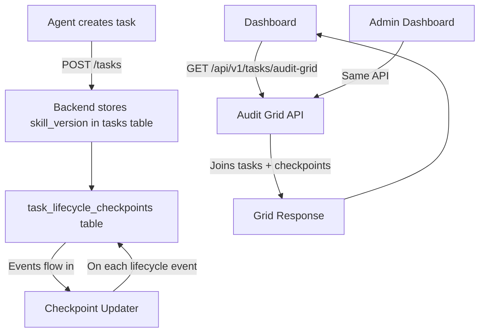
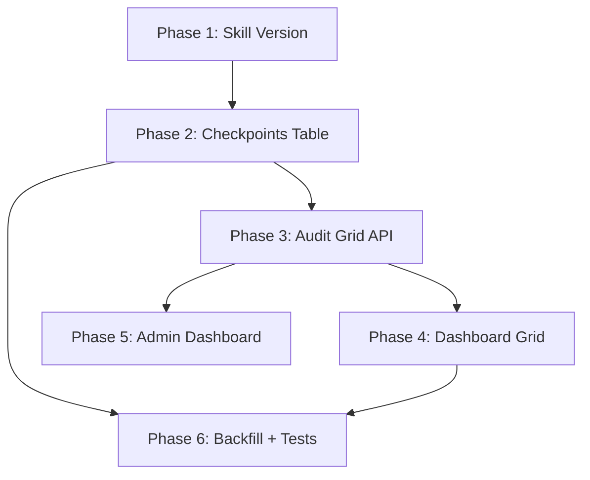

# Master Plan: Task Lifecycle Audit Grid

**Goal**: Full observability of every task's lifecycle — from skill version used at creation through auth, escrow, assignment, evidence, approval, payment, and reputation. Visible as a checklist grid on the main dashboard, with each task showing which steps it has completed.

**Why**: Today, `payment_events` logs individual events but there's no unified per-task "checklist" view. The audit module (`mcp_server/audit/`) validates transitions and reconciles escrows, but doesn't synthesize a holistic task health report. Agents create tasks using different skill versions with different requirements — we need to track which version produced each task.

---

## Architecture Overview



---

## Phase 1: Skill Version Tracking (DB + Backend)

**Objective**: Record which skill.md version the agent used when creating a task.

### Task 1.1: DB Migration — add `skill_version` to `tasks`

- New migration: `ALTER TABLE tasks ADD COLUMN skill_version VARCHAR(20);`
- Nullable (old tasks won't have it)
- Index: `CREATE INDEX idx_tasks_skill_version ON tasks(skill_version);`

### Task 1.2: Accept `skill_version` in task creation

- **REST API** (`mcp_server/api/routers/tasks.py`): Add `skill_version: Optional[str]` to `CreateTaskRequest` model (`_models.py`)
- **MCP Tool** (`mcp_server/server.py`): Add `skill_version` param to `em_publish_task`
- Store in DB on insert
- Agents send this from the `version` field in their installed skill.md frontmatter

### Task 1.3: Expose `skill_version` in task responses

- Add to `TaskResponse` model
- Show in `GET /api/v1/tasks/{id}` and list endpoints
- No breaking change (new optional field)

---

## Phase 2: Lifecycle Checkpoints Table

**Objective**: A dedicated table that tracks the boolean/timestamped state of every lifecycle checkpoint per task.

### Task 2.1: DB Migration — `task_lifecycle_checkpoints`

```sql
CREATE TABLE task_lifecycle_checkpoints (
    task_id       UUID PRIMARY KEY REFERENCES tasks(id),
    -- Authentication & Identity
    auth_erc8128          BOOLEAN DEFAULT FALSE,
    auth_erc8128_at       TIMESTAMPTZ,
    identity_erc8004      BOOLEAN DEFAULT FALSE,
    identity_erc8004_at   TIMESTAMPTZ,
    agent_id_resolved     VARCHAR(20),        -- e.g. "2106"
    -- Balance & Payment Auth
    balance_sufficient    BOOLEAN DEFAULT FALSE,
    balance_checked_at    TIMESTAMPTZ,
    balance_amount_usdc   DECIMAL(20, 6),
    payment_auth_signed   BOOLEAN DEFAULT FALSE,
    payment_auth_at       TIMESTAMPTZ,
    -- Task Creation
    task_created          BOOLEAN DEFAULT FALSE,
    task_created_at       TIMESTAMPTZ,
    network               VARCHAR(30),        -- e.g. "base"
    token                 VARCHAR(10),        -- e.g. "USDC"
    bounty_usdc           DECIMAL(10, 2),
    skill_version         VARCHAR(20),
    -- Escrow
    escrow_locked         BOOLEAN DEFAULT FALSE,
    escrow_locked_at      TIMESTAMPTZ,
    escrow_tx             VARCHAR(66),
    -- Assignment
    worker_assigned       BOOLEAN DEFAULT FALSE,
    worker_assigned_at    TIMESTAMPTZ,
    worker_id             UUID,
    worker_erc8004        BOOLEAN DEFAULT FALSE,
    -- Evidence
    evidence_submitted    BOOLEAN DEFAULT FALSE,
    evidence_submitted_at TIMESTAMPTZ,
    evidence_count        INTEGER DEFAULT 0,
    -- Verification
    ai_verified           BOOLEAN DEFAULT FALSE,
    ai_verified_at        TIMESTAMPTZ,
    ai_verdict            VARCHAR(20),       -- approved/rejected
    -- Approval & Payment
    approved              BOOLEAN DEFAULT FALSE,
    approved_at           TIMESTAMPTZ,
    payment_released      BOOLEAN DEFAULT FALSE,
    payment_released_at   TIMESTAMPTZ,
    payment_tx            VARCHAR(66),
    worker_amount_usdc    DECIMAL(20, 6),
    fee_amount_usdc       DECIMAL(20, 6),
    -- Reputation
    agent_rated_worker    BOOLEAN DEFAULT FALSE,
    agent_rated_worker_at TIMESTAMPTZ,
    worker_rated_agent    BOOLEAN DEFAULT FALSE,
    worker_rated_agent_at TIMESTAMPTZ,
    -- Fee Distribution
    fees_distributed      BOOLEAN DEFAULT FALSE,
    fees_distributed_at   TIMESTAMPTZ,
    fees_tx               VARCHAR(66),
    -- Terminal States
    cancelled             BOOLEAN DEFAULT FALSE,
    cancelled_at          TIMESTAMPTZ,
    refunded              BOOLEAN DEFAULT FALSE,
    refunded_at           TIMESTAMPTZ,
    refund_tx             VARCHAR(66),
    expired               BOOLEAN DEFAULT FALSE,
    expired_at            TIMESTAMPTZ,
    -- Meta
    created_at            TIMESTAMPTZ DEFAULT NOW(),
    updated_at            TIMESTAMPTZ DEFAULT NOW()
);

CREATE INDEX idx_tlc_updated ON task_lifecycle_checkpoints(updated_at DESC);
```

### Task 2.2: Checkpoint Updater Service

New file: `mcp_server/audit/checkpoint_updater.py`

Functions:
- `async def init_checkpoint(task_id, skill_version, network, token, bounty)` — called at task creation
- `async def update_checkpoint(task_id, **fields)` — generic upsert for any checkpoint fields
- Helper wrappers:
  - `mark_auth_erc8128(task_id)`
  - `mark_identity_erc8004(task_id, agent_id)`
  - `mark_balance_checked(task_id, amount)`
  - `mark_payment_auth(task_id)`
  - `mark_escrow_locked(task_id, tx_hash)`
  - `mark_worker_assigned(task_id, worker_id, has_erc8004)`
  - `mark_evidence_submitted(task_id, count)`
  - `mark_ai_verified(task_id, verdict)`
  - `mark_approved(task_id)`
  - `mark_payment_released(task_id, tx, worker_amount, fee_amount)`
  - `mark_reputation(task_id, direction)` — "agent_to_worker" or "worker_to_agent"
  - `mark_fees_distributed(task_id, tx)`
  - `mark_cancelled(task_id)`
  - `mark_refunded(task_id, tx)`
  - `mark_expired(task_id)`

All non-blocking (try/except + log warning, never raise).

### Task 2.3: Wire Checkpoint Calls into Existing Code

Integrate `checkpoint_updater` calls at each lifecycle event:

| Checkpoint | Where to call |
|------------|---------------|
| `init_checkpoint` | `tasks.py:create_task()` |
| `mark_auth_erc8128` | `tasks.py:create_task()` after ERC-8128 auth validation |
| `mark_identity_erc8004` | `tasks.py:create_task()` after ERC-8004 identity check |
| `mark_balance_checked` | `payment_dispatcher.py:_check_balance()` |
| `mark_payment_auth` | `payment_dispatcher.py:_authorize_fase2()` |
| `mark_escrow_locked` | `payment_dispatcher.py:_lock_escrow()` |
| `mark_worker_assigned` | `tasks.py:assign_task()` |
| `mark_evidence_submitted` | `submissions.py:create_submission()` |
| `mark_ai_verified` | `submissions.py:approve_submission()` (after AI review) |
| `mark_approved` | `submissions.py:approve_submission()` |
| `mark_payment_released` | `payment_dispatcher.py:_release_fase2()` |
| `mark_reputation` | `reputation.py:submit_feedback()` |
| `mark_fees_distributed` | `payment_dispatcher.py:_distribute_fees()` |
| `mark_cancelled` | `tasks.py:cancel_task()` |
| `mark_refunded` | `payment_dispatcher.py:_refund_fase2()` |
| `mark_expired` | `task_expiration.py:expire_tasks()` |

---

## Phase 3: Audit Grid API

**Objective**: A single endpoint that returns all tasks with their checkpoint status in a grid-friendly format.

### Task 3.1: New API Endpoint

`GET /api/v1/tasks/audit-grid`

Query params:
- `page`, `limit` (pagination)
- `status` (filter by task status)
- `network` (filter by chain)
- `skill_version` (filter by skill version)
- `agent_id` (filter by creator agent)
- `has_issue` (bool — show only tasks missing expected checkpoints)

Response:
```json
{
  "tasks": [
    {
      "task_id": "abc123",
      "title": "Take photo of...",
      "status": "completed",
      "skill_version": "4.1.0",
      "network": "base",
      "token": "USDC",
      "bounty_usdc": 0.10,
      "agent_id": "2106",
      "created_at": "2026-03-30T10:00:00Z",
      "checkpoints": {
        "auth_erc8128": { "done": true, "at": "2026-03-30T10:00:00Z" },
        "identity_erc8004": { "done": true, "at": "2026-03-30T10:00:00Z", "agent_id": "2106" },
        "balance_sufficient": { "done": true, "at": "2026-03-30T10:00:01Z", "amount": 5.23 },
        "payment_auth_signed": { "done": true, "at": "2026-03-30T10:00:01Z" },
        "task_created": { "done": true, "at": "2026-03-30T10:00:02Z" },
        "escrow_locked": { "done": true, "at": "2026-03-30T10:05:00Z", "tx": "0x..." },
        "worker_assigned": { "done": true, "at": "2026-03-30T10:05:00Z" },
        "evidence_submitted": { "done": true, "at": "2026-03-30T10:15:00Z", "count": 2 },
        "ai_verified": { "done": true, "at": "2026-03-30T10:15:30Z", "verdict": "approved" },
        "approved": { "done": true, "at": "2026-03-30T10:15:31Z" },
        "payment_released": { "done": true, "at": "2026-03-30T10:15:35Z", "tx": "0x..." },
        "agent_rated_worker": { "done": true, "at": "2026-03-30T10:16:00Z" },
        "worker_rated_agent": { "done": false },
        "fees_distributed": { "done": true, "at": "2026-03-30T10:16:05Z" },
        "cancelled": { "done": false },
        "refunded": { "done": false },
        "expired": { "done": false }
      },
      "completion_pct": 87
    }
  ],
  "total": 150,
  "page": 1,
  "limit": 50
}
```

### Task 3.2: Completion Score Logic

Each task gets a `completion_pct` based on which checkpoints are expected vs achieved:

- **Normal flow** (completed task): auth + identity + balance + auth_signed + created + escrow + assigned + evidence + verified + approved + payment + both ratings + fees = 14 steps
- **Cancelled flow**: auth + created + cancelled + refund (if escrow existed) = 3-4 steps
- **Expired flow**: auth + created + expired = 3 steps

Score = `(achieved / expected) * 100`

Tasks with `completion_pct < 100` on terminal states flag potential issues.

---

## Phase 4: Dashboard — Audit Grid View

**Objective**: A new page/tab on the main `execution.market` dashboard showing the task lifecycle grid.

### Task 4.1: New Route — `/audit`

- New page: `dashboard/src/pages/AuditGrid.tsx`
- Add to router in `App.tsx`
- Accessible from nav sidebar/header

### Task 4.2: Grid Component — `TaskAuditGrid.tsx`

A table with:
- **Rows** = tasks (sorted by created_at DESC)
- **Columns** = grouped lifecycle checkpoints

**Collapsed view** (default — 4 group columns):

```
| Task | Skill | Network | Bounty | Auth (2/2) | Payment (3/4) | Execution (4/4) | Reputation (1/2) | % | Status |
|------|-------|---------|--------|------------|---------------|-----------------|-------------------|---|--------|
| Take photo... | 4.1.0 | base | $0.10 | ●● | ●●●○ | ●●●● | ●○ | 87% | completed |
| Buy coffee... | 4.0.0 | polygon | $0.15 | ●● | ●●○○ | ●●○○ | ○○ | 43% | in_progress |
```

**Expanded view** (click a group header to expand):

```
| Task | Skill | ... | ▼ Auth | 8128 | 8004 | ▼ Payment | Bal | Signed | Escrow | Released | ... |
|------|-------|-----|--------|------|------|-----------|-----|--------|--------|----------|-----|
| Take photo... | 4.1.0 | ... | | ✓ | ✓ | | ✓ | ✓ | ✓ | ✓ | ... |
```

**Checkpoint Groups:**
- **Auth** (2): ERC-8128 wallet auth, ERC-8004 identity
- **Payment** (4): Balance check, Auth signed, Escrow locked, Payment released
- **Execution** (4): Task created, Worker assigned, Evidence submitted, AI verified + approved
- **Reputation** (2): Agent→Worker rating, Worker→Agent rating
- **Terminal** (shown as status badge, not a group): Cancelled, Refunded, Expired

Visual encoding:
- Green filled dot / checkmark = completed
- Gray hollow dot / dash = not yet (expected)
- Red filled dot / X = failed/skipped (unexpected)
- Blue pulsing dot / spinner = in progress (current step)
- Hover tooltip = timestamp + tx hash (if applicable)

### Task 4.5: WebSocket Real-Time Updates

- Subscribe to `checkpoint_update` WS channel per task
- When backend calls any `mark_*` function, emit WS event: `{ task_id, checkpoint, done, at, metadata }`
- Grid cells update live without page refresh
- Uses existing WS infra in `mcp_server/api/websocket.py`

### Task 4.3: Filters and Sorting

- Filter by: status, network, skill_version, agent_id, completion_pct range
- Sort by: created_at, completion_pct, bounty
- Search by task title or ID
- "Issues only" toggle: shows tasks where completion_pct < 100 on terminal states

### Task 4.4: Task Detail — Enhanced Timeline

Enhance existing `TaskLifecycleTimeline.tsx` to:
- Show skill version badge at the top
- Add checkpoint details (tx hashes, amounts, timestamps) for every step
- Show the full checkpoint list (not just the 4 high-level steps it shows today)

---

## Phase 5: Admin Dashboard Integration

**Objective**: Add the audit grid to the admin dashboard with admin-only features.

### Task 5.1: Admin Audit Grid Tab

- Add "Lifecycle Audit" tab to `admin-dashboard/src/pages/AuditLog.tsx`
- Same grid component but with admin extras:
  - Bulk actions (retry failed payments, force-expire stale tasks)
  - Export to CSV
  - Direct links to Supabase rows

### Task 5.2: Anomaly Detection Panel

- Show tasks with missing expected checkpoints
- Flag: tasks stuck in non-terminal state > 24h
- Flag: payment released but no reputation events
- Flag: escrow locked but no assignment
- Flag: old skill versions (e.g. tasks from v3.x with known issues)

---

## Phase 6: Backfill and Tests

### Task 6.1: Backfill Script

- Script: `scripts/backfill_lifecycle_checkpoints.py`
- For existing tasks, reconstruct checkpoints from:
  - `tasks` table (status, timestamps, escrow fields)
  - `payment_events` table (all payment steps)
  - `submissions` table (evidence)
  - `erc8004_side_effects` table (reputation)
- Idempotent (safe to re-run)

### Task 6.2: Backend Tests

- Test checkpoint creation on task create
- Test each `mark_*` function
- Test audit grid API response shape
- Test completion_pct calculation
- Test filters (status, network, skill_version)
- Test non-blocking behavior (checkpoint failure doesn't break task flow)

### Task 6.3: Frontend Tests

- Vitest: AuditGrid component renders checkpoints correctly
- Vitest: Filters work
- E2E (Playwright): Navigate to /audit, verify grid loads with data

---

## Dependency Graph



Phases 4 and 5 can run in parallel after Phase 3.

---

## Estimated Scope

| Phase | Files Modified | New Files | New DB Objects |
|-------|---------------|-----------|----------------|
| 1 | 3 (`_models.py`, `tasks.py`, `server.py`) | 1 migration | 1 column |
| 2 | ~10 (all lifecycle touchpoints) | 2 (`checkpoint_updater.py`, migration) | 1 table |
| 3 | 1 (`tasks.py` or new router) | 0-1 | 0 |
| 4 | 2 (`App.tsx`, nav) | 2 (`AuditGrid.tsx`, `TaskAuditGrid.tsx`) | 0 |
| 5 | 1 (`AuditLog.tsx`) | 1 (`AuditLifecycleTab.tsx`) | 0 |
| 6 | 0 | 3 (backfill script, 2 test files) | 0 |

---

## Design Decisions (Resolved)

1. **Grid location**: Both dashboards. Main dashboard (`execution.market/audit`) for agents, admin dashboard for ops with extra actions (bulk retry, export, anomaly detection).
2. **Column density**: Grouped + expandable. 4 category columns (Auth, Payment, Execution, Reputation) — collapsed shows category status icon, click to expand individual checkpoints within each group.
3. **Real-time updates**: WebSocket push. Checkpoint updates pushed via existing WS infra. Grid cells update live as events happen.
