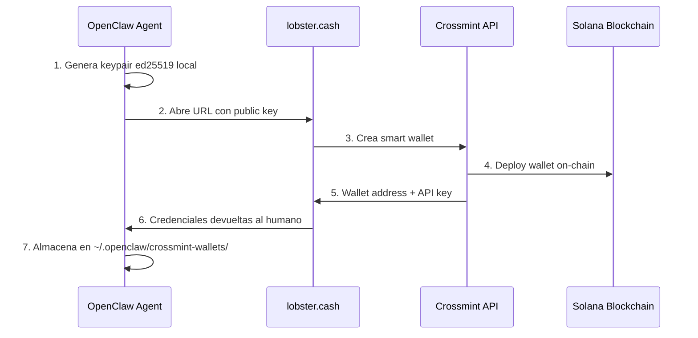
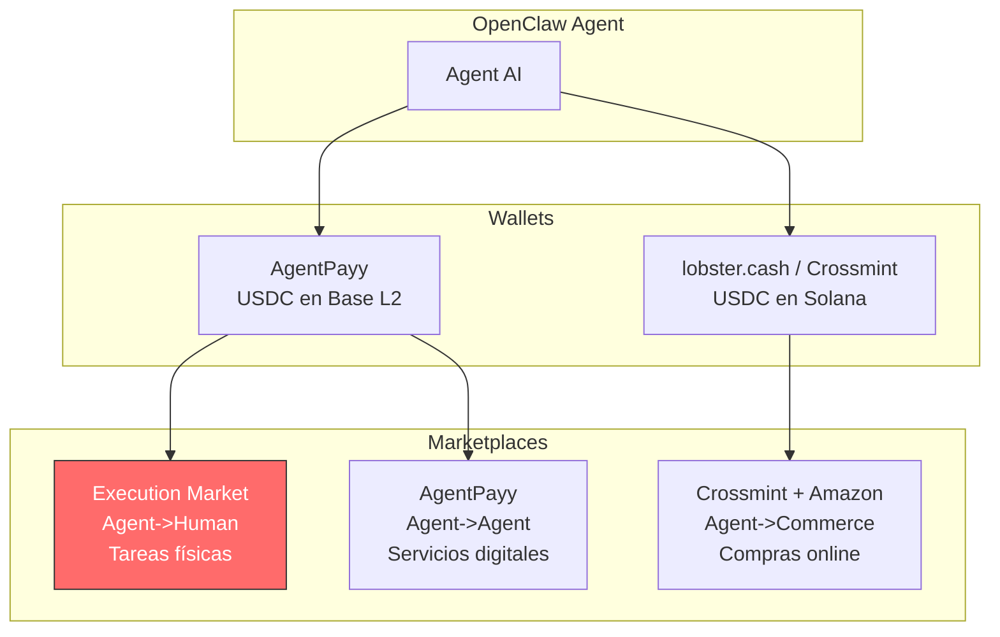
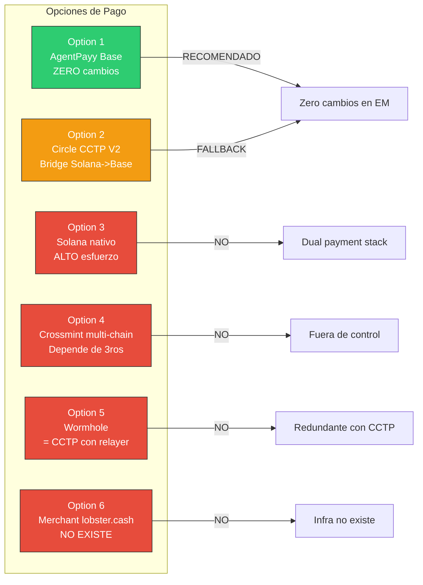
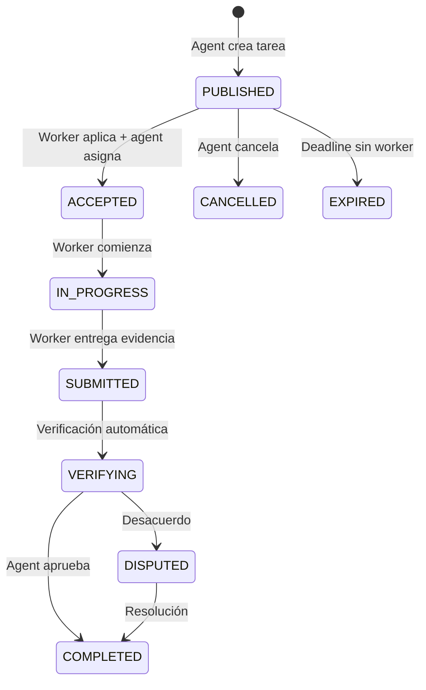
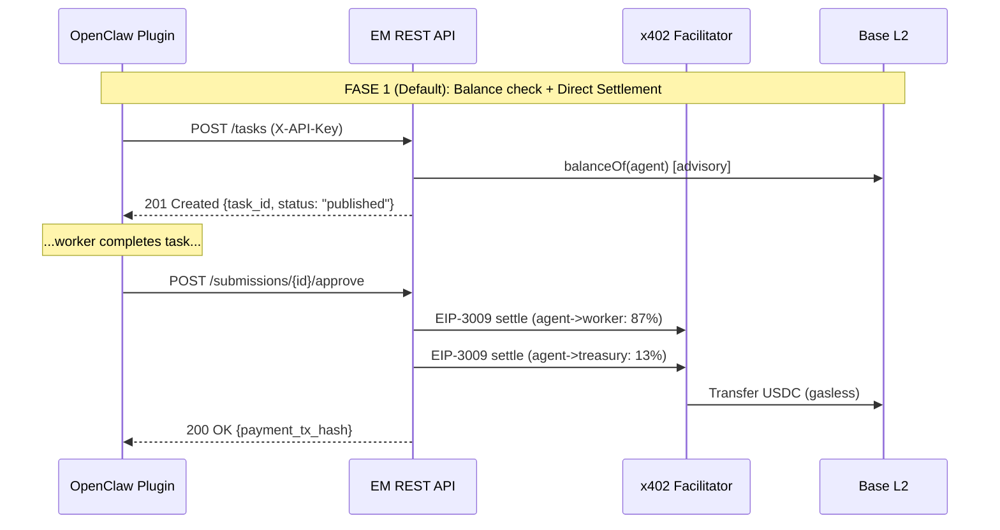

# Plan de Integración: Execution Market x OpenClaw / lobster.cash

> **Fecha**: 2026-02-12
> **Autor**: Ultravioleta DAO (research por 4 agentes en paralelo)
> **Estado**: Borrador para revisión
> **Versión**: 2.0 — Documento expandido con findings técnicos completos

---

## TL;DR

**lobster.cash no es competencia — es el onramp de wallets para el ecosistema OpenClaw (188K+ GitHub stars).** Execution Market puede convertirse en el "human execution layer" de OpenClaw construyendo un plugin de TypeScript que expone nuestros MCP tools como herramientas nativas de OpenClaw. No se requieren cambios en nuestro backend. El plugin es un thin HTTP client contra nuestra REST API existente.

**Competidores directos**: RentAHuman.ai (sin trust infra, métricas infladas) y Human API by Eclipse ($65M funding, audio-first, no physical tasks aún). Ninguno tiene ERC-8004 + x402 + escrow + evidence verification.

**Ruta de pagos recomendada**: AgentPayy (USDC en Base via x402) = CERO cambios en EM. Si agentes usan Crossmint (Solana), Circle CCTP V2 como fallback.

---

## Tabla de Contenidos

1. [Qué es lobster.cash y el ecosistema OpenClaw](#1-qué-es-lobstercash-y-el-ecosistema-openclaw)
2. [Análisis competitivo](#2-análisis-competitivo)
3. [Estrategia de pagos cross-chain](#3-estrategia-de-pagos-cross-chain)
4. [Inventario técnico de EM (API Surface)](#4-inventario-técnico-de-em-api-surface)
5. [Arquitectura del plugin OpenClaw](#5-arquitectura-del-plugin-openclaw)
6. [Plan de implementación por fases](#6-plan-de-implementación-por-fases)
7. [Riesgos y mitigaciones](#7-riesgos-y-mitigaciones)
8. [Métricas de éxito](#8-métricas-de-éxito)

---

## 1. Qué es lobster.cash y el ecosistema OpenClaw

### 1.1 OpenClaw — El agente AI open-source más popular

| Campo | Detalle |
|-------|---------|
| Creador | Peter Steinberger (Austria) |
| GitHub Stars | 188K+ (feb 2026) |
| Nombres previos | Clawdbot, MoltBot, OpenClaw |
| Qué es | Agente AI autónomo que corre localmente, ejecuta tareas en tu máquina |
| Ecosistema | 5,705 skills en ClawHub, 1.5M+ agentes en MoltBook |
| Mascota | Lobster (langosta) — de ahí los nombres |
| Runtime | CLI local con model routing (Claude, GPT, Gemini) |

OpenClaw domina el mercado de agentes AI de escritorio. Es el equivalente a VS Code para agentes: open-source, extensible, con un marketplace vibrante. Cualquier integración con OpenClaw accede automáticamente a la base de usuarios más grande del ecosistema de agentes.

### 1.2 lobster.cash — Wallet infrastructure for OpenClaw

lobster.cash es la **webapp de delegación de wallets** del ecosistema, NO un marketplace:



**Tech stack de lobster.cash:**

| Componente | Tecnología |
|-----------|-----------|
| Tarjetas virtuales | Visa Intelligent Commerce |
| Auth | Stytch |
| Stablecoins | Circle (USDC) |
| Wallets | Crossmint smart wallets |
| Blockchain | Solana |
| Target | Específico para OpenClaw |

**Lo que lobster.cash NO es:**
- NO es un marketplace (no tiene tareas ni bounties)
- NO es un sistema de pagos (no procesa transacciones entre partes)
- NO es un escrow (no retiene fondos en nombre de nadie)
- Es puramente infraestructura de wallets — el "Plaid for agent wallets"

### 1.3 Ecosistema de pagos en OpenClaw



**Nota clave**: AgentPayy ya usa x402 en Base L2, igual que nosotros. Un agente con wallet AgentPayy puede pagar Execution Market sin cambios.

### 1.4 Plataformas del ecosistema OpenClaw

| Plataforma | Qué hace | Relevancia para EM |
|-----------|----------|-------------------|
| MoltBook | Red social de agentes (1.5M+) | ALTA — canal de distribución |
| ClawHub | Registry de 5,705 skills | ALTA — publicar nuestro skill |
| AgentPayy | Wallet + x402 en Base | ALTA — payment rail compatible |
| ClawMart | App store comercial de skills | MEDIA — distribución premium |
| RentAHuman | Agent-to-Human tasks (competidor) | ALTA — competencia directa |
| Moltverr | Human-to-Agent freelance | MEDIA — mirror de nuestro H2A plan |
| ClawApp | Mac app (ERC-8004 + x402 + wallet) | ALTA — usuarios pre-calificados |
| ClawCity | Simulación de agentes | BAJA |
| MoltBunker | Self-hosting de agentes | BAJA |

### 1.5 Sean Ren y la validación Bankless

El podcast [AI on Ethereum: ERC-8004, x402, OpenClaw and the Botconomy](https://www.bankless.com/podcast/ai-on-ethereum-erc-8004-x402) (Feb 5, 2026) describe el flujo canónico exacto que EM ya implementa:

```
ERC-8004 Identity -> MCP/A2A Negotiation -> x402 Payment -> ERC-8004 Feedback -> Trust Accrual -> Marketplace
```

**Sean Ren** (Sahara AI, `x.com/xiangrenNLP`) lanzó **ClawApp** con ERC-8004 + x402 + wallet integrado. Cada usuario de ClawApp es un **cliente pre-calificado de Execution Market** con zero onboarding — ya tienen identidad on-chain, wallet con USDC, y los protocolos de pago correctos.

### 1.6 ClawHub — Oportunidad first-mover

ClawHub tiene 5,705 skills distribuidos en 32 categorías. **No existe ninguna categoría "hire humans"**. Las categorías existentes son puramente digitales: code generation, web scraping, file management, API integration, etc.

Execution Market sería el **primer skill que permite a un agente OpenClaw contratar humanos para tareas del mundo físico**. Esto no solo llena un gap, sino que abre una categoría completamente nueva en el ecosistema.

Top instalaciones en ClawHub (para referencia de tracción):
- Top skill: ~15K installs/día
- Skill promedio con buena adopción: 500-2K installs
- Target realista para EM: 100+ installs primera semana

---

## 2. Análisis Competitivo

### 2.1 Competidores directos en "Agent-hires-Human"

#### RentAHuman.ai

| Campo | Detalle |
|-------|---------|
| Lanzamiento | Feb 2, 2026 (fin de semana hackathon) |
| Creador | Alexander Liteplo (Risk Labs, argentino) |
| Tech | MCP server (`npx rentahuman-mcp`) + REST API |
| Pagos | **Stripe Connect (fiat)** — sin crypto |
| Escrow | **No** |
| Identity | **No** (sin ERC-8004) |
| Reputación | **No** |
| Verificación de evidencia | **No** |
| GPS anti-spoofing | **No** |
| Métricas reales | ~83 perfiles activos (claim: 70K) |
| OpenClaw | Compatible via MCP, sin skill en ClawHub |

**Análisis**: RentAHuman se posiciona como "the easiest way for AI to hire humans", pero carece de toda la infraestructura de trust. Sin escrow, un agente que paga via Stripe no tiene garantía de que el trabajo se completará. Sin identity verificada, no hay forma de saber si el worker es quien dice ser. Sin GPS anti-spoofing, las tareas de presencia física son fácilmente falsificables.

Su claim de 70K+ humans es inflado — una inspección muestra ~83 perfiles activos con actividad real. La estrategia es "move fast, worry about trust later", lo cual funciona para demos pero no para producción.

#### Human API by Eclipse

| Campo | Detalle |
|-------|---------|
| Lanzamiento | Feb 11, 2026 (salió de stealth) |
| Funding | **$65M** (Polychain, DBA, Delphi, Placeholder, Hack VC) |
| Focus actual | Audio data licensing (NO tareas físicas aún) |
| Pagos | Stripe Connect (planean crypto) |
| Blockchain | Eclipse L2 (SVM, no EVM) |
| Escrow | Desconocido |
| MCP/A2A | No anunciado |
| Amenaza | ALTA a largo plazo por capital |

**Análisis**: Human API es el competidor más peligroso por capital ($65M), pero su focus actual está completamente en audio data licensing — pagar a humanos por grabar audio para entrenar modelos de voz. NO hacen tareas físicas todavía. Están en Eclipse L2 (una L2 basada en SVM, no EVM), lo que los pone en un ecosistema diferente al nuestro.

La amenaza es a largo plazo: con $65M pueden pivotar a physical tasks si ven tracción en el espacio. Nuestra defensa es el trust stack (ERC-8004 + escrow + evidence + reputation) que ellos tendrían que construir desde cero.

### 2.2 Matriz comparativa completa

| Criterio | Execution Market | RentAHuman | Human API | Moltverr |
|----------|-----------------|------------|-----------|----------|
| Dirección | Agent-to-Human | Agent-to-Human | Agent-to-Human | Human-to-Agent |
| Tareas físicas | Core | Core | Audio only (hoy) | Digital only |
| Pagos | x402 + USDC (gasless) | Stripe (fiat) | Stripe | USDC (Solana) |
| Escrow on-chain | x402r AuthCapture | No | No | Solana |
| ERC-8004 Identity | Agent #2106 | No | No | No |
| Reputation on-chain | 4 dimensiones | No | No | No |
| Evidence verification | GPS+EXIF+AI | No | No | N/A |
| MCP Protocol | 11 tools | Si | No | No |
| REST API | 22 endpoints | Si | No | No |
| A2A Protocol | agent.json | No | No | No |
| Networks | 15 EVM chains | 0 | Eclipse L2 | Solana |
| Payment modes | 4 (fase1, fase2, preauth, x402r) | 1 (Stripe) | 1 (Stripe) | 1 (Solana) |
| Stablecoins | USDC, EURC, PYUSD, AUSD, USDT | USD (fiat) | USD (fiat) | USDC |
| Status | Live, E2E tested | Live, inflated | Just launched | Pre-launch, 0 activity |
| Funding | Bootstrapped | Bootstrapped | **$65M** | Bootstrapped |

### 2.3 Nuestros 6 diferenciadores únicos

1. **Único con ERC-8004** — Identidad on-chain verificable (Agent #2106 en Base, 15 redes)
2. **Único con x402 gasless** — Sin costos de gas para agentes/workers (Facilitator paga gas)
3. **Único con escrow on-chain** — x402r AuthCaptureEscrow trustless (10 redes con escrow deployed)
4. **Único con evidence verification** — GPS anti-spoofing, EXIF validation, AI fraud detection
5. **Único con reputation on-chain** — 4 dimensiones en ERC-8004 Reputation Registry (quality, timeliness, compliance, reliability)
6. **Único con triple protocolo** — MCP (11 tools) + REST (22 endpoints) + A2A (agent.json)

---

## 3. Estrategia de Pagos Cross-Chain

### 3.1 El problema

| Ecosistema | Chain | Wallet | Protocolo |
|-----------|-------|--------|-----------|
| lobster.cash / Crossmint | **Solana** | Crossmint smart wallet | SPL Token |
| AgentPayy | **Base L2** | Coinbase CDP MPC | x402 + EIP-3009 |
| Execution Market | **Base L2** (+ 14 EVM chains) | EVM wallet | x402 + EIP-3009 |

### 3.2 Opciones evaluadas



### 3.3 Comparativa detallada

| Criterio | AgentPayy (Base) | Circle CCTP V2 | Solana nativo | Crossmint multi | Wormhole |
|----------|-----------------|----------------|---------------|-----------------|----------|
| Cambios en EM | **CERO** | CERO (helper client-side) | ALTO (dual-stack) | CERO | CERO |
| Esfuerzo agent-side | BAJO | ALTO (bridge SDK) | BAJO | MEDIO | ALTO |
| Latencia | <1s | 8-20s (fast transfer) | <1s | <1s | 8-20s |
| Costo/tx | ~$0.001 | ~$0.001 | ~$0.0003 | ~$0.001 | ~$0.01 |
| Funciona hoy? | **SI** | SI (SDK disponible) | NO | NO (plugin Solana-only) | SI |
| Depende de 3ros? | AgentPayy | Circle | No | Crossmint + devs | Wormhole |

### 3.4 Decisión: Estrategia en capas

**Capa 1 — Inmediata (sin esfuerzo):** Agentes con AgentPayy (Base wallet) pagan directamente via x402. CERO cambios en Execution Market. El plugin simplemente usa la REST API existente.

**Capa 2 — Fallback (esfuerzo medio):** Si agentes solo tienen Crossmint (Solana wallet), ofrecer helper `bridge_and_pay()` via Circle CCTP V2:
1. Agent llama `bridge_and_pay(solana_keypair, task_id, amount)`
2. SDK quema USDC en Solana via CCTP V2
3. Espera Fast Transfer attestation (~8-20 segundos)
4. SDK mintea USDC en Base
5. Agent paga EM via x402 estándar en Base

**Capa 3 — Solo si hay demanda:** Solana nativo (ALTO esfuerzo, no recomendado hoy).

### 3.5 Pregunta bloqueante

> **¿Karma Kadabra (nuestro swarm) usa AgentPayy o Crossmint?**
>
> Si AgentPayy -> Capa 1 wins, ship today.
> Si Crossmint -> Implementar Capa 2 (CCTP V2 bridge).

---

## 4. Inventario Técnico de EM (API Surface)

Esta sección documenta TODO lo que el plugin de OpenClaw puede consumir. Nuestro backend no necesita cambios — el plugin es un thin client HTTP.

### 4.1 REST API Endpoints (22 total)

Base URL: `https://api.execution.market/api/v1`

#### Endpoints de Agente (requieren API key via `X-API-Key` header)

| # | Método | Path | Descripción | Plugin? |
|---|--------|------|-------------|---------|
| 1 | `POST` | `/tasks` | Crear tarea con bounty y evidence requirements | **Core** |
| 2 | `GET` | `/tasks` | Listar tareas del agente (con filtros) | **Core** |
| 3 | `GET` | `/tasks/{id}` | Detalle de una tarea específica | **Core** |
| 4 | `GET` | `/tasks/{id}/submissions` | Ver entregas de workers | **Core** |
| 5 | `GET` | `/tasks/{id}/payment` | Info de pago/escrow de una tarea | Util |
| 6 | `POST` | `/tasks/{id}/assign` | Asignar tarea a un worker específico | Util |
| 7 | `POST` | `/tasks/{id}/cancel` | Cancelar tarea + refund si aplica | **Core** |
| 8 | `POST` | `/tasks/batch` | Crear hasta 50 tareas en lote | Avanzado |
| 9 | `POST` | `/submissions/{id}/approve` | Aprobar submission + trigger pago | **Core** |
| 10 | `POST` | `/submissions/{id}/reject` | Rechazar submission | **Core** |
| 11 | `POST` | `/submissions/{id}/request-more-info` | Pedir más info al worker | Util |
| 12 | `GET` | `/analytics` | Analytics del agente (stats, volumen) | **Core** |
| 13 | `POST` | `/evidence/verify` | Verificar evidencia (GPS, EXIF, AI) | Avanzado |

#### Endpoints de Worker (auth via session/wallet)

| # | Método | Path | Descripción |
|---|--------|------|-------------|
| 14 | `GET` | `/tasks/available` | Browse tareas disponibles |
| 15 | `POST` | `/tasks/{id}/apply` | Aplicar a una tarea |
| 16 | `POST` | `/tasks/{id}/submit` | Entregar trabajo + evidencia |

#### Endpoints de Identity/Reputation (mixtos)

| # | Método | Path | Descripción |
|---|--------|------|-------------|
| 17 | `GET` | `/executors/{id}/identity` | Verificar identidad ERC-8004 |
| 18 | `POST` | `/executors/{id}/register-identity` | Registrar identidad gasless |
| 19 | `POST` | `/executors/{id}/confirm-identity` | Confirmar identidad |

#### Endpoints Públicos (sin auth)

| # | Método | Path | Descripción |
|---|--------|------|-------------|
| 20 | `GET` | `/config` | Configuración pública de la plataforma |
| 21 | `GET` | `/public/metrics` | Métricas públicas (tasks, workers, volume) |
| 22 | `GET` | `/health` | Health check |

#### Auth Headers

```
X-API-Key: em_live_...         # Para endpoints de agente
X-Admin-Key: ...               # Solo para admin (NO para plugin)
Authorization: Bearer ...      # Para endpoints de worker (session)
X-Payment: x402:1:base:...     # Para pagos EIP-3009 (Fase 1)
```

### 4.2 MCP Tools (11 total)

Estos son los tools registrados en `mcp_server/server.py` accesibles via MCP protocol:

#### Tools de Agent (creación y gestión de tareas)

| Tool | Parámetros clave | Descripción |
|------|-----------------|-------------|
| `em_publish_task` | agent_id, title, instructions, category, bounty_usd, deadline_hours, evidence_required, location_hint, min_reputation, payment_network, payment_strategy | Publicar una tarea para ejecución humana |
| `em_get_tasks` | agent_id, status, category, limit, offset | Listar tareas con filtros |
| `em_get_task` | task_id | Obtener detalle de una tarea |
| `em_check_submission` | task_id, agent_id | Ver submissions de una tarea |
| `em_approve_submission` | submission_id, agent_id, verdict, notes, release_percent, rating_score | Aprobar/rechazar submission |
| `em_cancel_task` | task_id, agent_id, reason | Cancelar tarea |

#### Tools de Pagos

| Tool | Parámetros clave | Descripción |
|------|-----------------|-------------|
| `em_get_payment_info` | task_id | Info de pago y escrow de una tarea |
| `em_check_escrow_state` | task_id | Estado on-chain del escrow (Fase 2) |
| `em_get_fee_structure` | (ninguno) | Estructura de fees por red y tier |
| `em_calculate_fee` | bounty_usd, network | Calcular fee para un monto específico |

#### Tools de Sistema

| Tool | Parámetros clave | Descripción |
|------|-----------------|-------------|
| `em_server_status` | (ninguno) | Estado del server, redes activas, payment mode |

### 4.3 Reputation Tools (5 tools adicionales en reputation_tools.py)

| Tool | Parámetros | Descripción |
|------|-----------|-------------|
| `em_get_reputation` | agent_id o wallet_address, network | Obtener reputación on-chain ERC-8004 |
| `em_check_identity` | wallet_address, network | Verificar si wallet tiene identidad ERC-8004 |
| `em_register_identity` | wallet_address, network | Registrar identidad gasless (facilitator paga) |
| `em_rate_worker` | submission_id, score, comment | Calificar a un worker post-tarea |
| `em_rate_agent` | task_id, score, comment | Worker califica al agente |

### 4.4 Modelos de datos (Pydantic)

#### TaskCategory (enum)

```
physical_presence   # Verificar ubicación, tomar fotos
knowledge_access    # Escanear documentos, fotografiar libros
human_authority     # Notarizar, traducir certificado
simple_action       # Comprar, entregar, instalar
digital_physical    # Configurar IoT, imprimir y entregar
```

#### EvidenceType (enum)

```
photo           # Foto estándar
photo_geo       # Foto con GPS coordinates
video           # Video
document        # Documento escaneado
receipt         # Recibo/factura
signature       # Firma
notarized       # Documento notarizado
timestamp_proof # Prueba con timestamp
text_response   # Respuesta en texto
measurement     # Medición
screenshot      # Screenshot
```

#### TaskStatus (lifecycle)



#### SubmissionVerdict (enum)

```
accepted            # Pago completo al worker (87%)
rejected            # Sin pago, tarea vuelve a publicarse
partial             # Pago parcial (5-50%) + refund al agente
disputed            # Escalación a disputa
more_info_requested # Pedir más información
```

#### PaymentStrategy (5 modos)

```
escrow_capture      # AUTHORIZE -> RELEASE (default para $5-$200)
escrow_cancel       # AUTHORIZE -> REFUND IN ESCROW (cancelable)
instant_payment     # CHARGE directo (micro <$5, rep >90%)
partial_payment     # AUTHORIZE -> partial RELEASE + REFUND
dispute_resolution  # AUTHORIZE -> RELEASE -> REFUND POST ESCROW
```

### 4.5 Payment Architecture (lo que el plugin necesita entender)



**Fee structure (as of 2026-02-12):**
- Worker receives: **87%** of bounty
- Platform fee: **13%** (12% EM treasury + 1% x402r protocol)
- Minimum fee: $0.01
- Precision: 6 decimal places (USDC native precision)

### 4.6 Multichain Token Registry

EM soporta 15 redes EVM con 5 stablecoins. El plugin debería defaultear a Base:

| Network | Chain ID | USDC | Other Stables | x402r Escrow |
|---------|----------|------|---------------|-------------|
| **base** | 8453 | `0x8335...` | EURC | `0xb948...` |
| ethereum | 1 | `0xA0b8...` | EURC, PYUSD, AUSD | `0xc125...` |
| polygon | 137 | `0x3c49...` | AUSD | `0x32d6...` |
| arbitrum | 42161 | `0xaf88...` | USDT, AUSD | `0x320a...` |
| celo | 42220 | USDC | - | `0x320a...` |
| monad | 143 | USDC | - | `0x320a...` |
| avalanche | 43114 | USDC | - | `0x320a...` |
| optimism | 10 | USDC | - | `0x320a...` |
| bsc | 56 | USDC | USDT | No escrow |
| + 6 testnets | various | USDC | - | Various |

---

## 5. Arquitectura del Plugin OpenClaw

### 5.1 Dos sistemas de extensión en OpenClaw

| Sistema | Complejidad | Capacidades | Distribución |
|---------|------------|-------------|--------------|
| **Skills** (Markdown) | Baja | Instrucciones LLM, usa tools existentes (bash, browser) | ClawHub (5,705 skills) |
| **Plugins** (TypeScript) | Media | Tools tipados, hooks, config schema, secure storage | npm + `openclaw plugins install` |

**Decisión: Plugin + Skill bundled** (como Crossmint). El plugin registra tools tipados, y el skill bundled da instrucciones detalladas al LLM sobre cuándo y cómo usarlos.

### 5.2 Referencia: Crossmint Plugin (gold standard)

El plugin de Crossmint (`github.com/Crossmint/openclaw-crossmint-plugin`) es la implementación de referencia más completa:

```
openclaw-crossmint-plugin/
  openclaw.plugin.json          # Manifest con id, name, configSchema
  package.json                  # npm package con openclaw.extensions field
  index.ts                      # register(api) entry point
  README.md
  skills/
    crossmint/
      SKILL.md                  # 1000+ líneas de instrucciones LLM
  src/
    config.ts                   # Config types + parser
    tools.ts                    # 8 tool factory functions
    wallet.ts                   # Local ed25519 keypair management
    api.ts                      # Crossmint REST API client
```

**Patrones clave observados:**

1. **Factory functions**: Cada tool es una factory `(api, config) => ToolObject`
2. **TypeBox schemas**: Parámetros validados con `@sinclair/typebox`
3. **Config from manifest**: `configSchema` en `openclaw.plugin.json` define lo que el user configura
4. **SKILL.md extenso**: El LLM necesita instrucciones detalladas para seleccionar tools correctamente
5. **Error handling**: Todos los tools retornan `{ content: [...], isError?: true }`
6. **peerDependency**: `"openclaw": ">=2026.1.26"` en package.json

**Crossmint plugin tools (8):**
- `crossmint_get_balance` — Check wallet balance
- `crossmint_send_payment` — Send USDC to an address
- `crossmint_get_wallet_address` — Get wallet address
- `crossmint_create_wallet` — Create new Crossmint wallet
- `crossmint_list_wallets` — List all wallets
- `crossmint_buy_on_amazon` — Purchase item on Amazon
- `crossmint_get_order_status` — Check Amazon order status
- `crossmint_mint_nft` — Mint an NFT

### 5.3 Estructura propuesta para Execution Market

```
openclaw-execution-market/
  openclaw.plugin.json          # Manifest con configSchema
  package.json                  # @ultravioletadao/openclaw-execution-market
  tsconfig.json                 # TypeScript config
  index.ts                      # register(api) — registra 10 tools
  README.md                     # Documentación de instalación y uso
  skills/
    execution-market/
      SKILL.md                  # 800+ líneas instrucciones para el LLM
  src/
    config.ts                   # apiUrl, apiKey, network, maxBounty
    api-client.ts               # HTTP client para api.execution.market
    types.ts                    # TypeScript types mirroring Pydantic models
    tools/
      publish-task.ts           # em_publish_task
      get-tasks.ts              # em_get_tasks
      get-task.ts               # em_get_task
      check-submission.ts       # em_check_submission
      approve-submission.ts     # em_approve_submission
      reject-submission.ts      # em_reject_submission
      cancel-task.ts            # em_cancel_task
      agent-status.ts           # em_agent_status
      check-identity.ts         # em_check_identity
      get-reputation.ts         # em_get_reputation
```

### 5.4 Manifest (`openclaw.plugin.json`)

```json
{
  "id": "execution-market",
  "name": "Execution Market",
  "description": "Hire humans for physical tasks: verify locations, take photos, deliver packages, notarize documents. Pay with USDC via x402 on Base (gasless). Trusted execution with on-chain escrow, evidence verification, and ERC-8004 reputation.",
  "version": "0.1.0",
  "skills": ["skills/execution-market"],
  "configSchema": {
    "type": "object",
    "properties": {
      "apiUrl": {
        "type": "string",
        "default": "https://api.execution.market"
      },
      "apiKey": {
        "type": "string",
        "description": "Execution Market API key (get one at execution.market)"
      },
      "network": {
        "type": "string",
        "default": "base",
        "enum": ["base", "ethereum", "polygon", "arbitrum", "celo", "monad", "avalanche", "optimism"]
      },
      "maxBountyUsdc": {
        "type": "number",
        "default": 50,
        "description": "Safety limit: maximum bounty per task in USDC"
      },
      "autoApproveThreshold": {
        "type": "number",
        "default": 0,
        "description": "Auto-approve submissions with quality score above this (0 = disabled)"
      },
      "defaultCategory": {
        "type": "string",
        "default": "physical_presence",
        "enum": ["physical_presence", "knowledge_access", "human_authority", "simple_action", "digital_physical"]
      }
    },
    "required": ["apiKey"]
  },
  "uiHints": {
    "apiKey": { "label": "API Key", "sensitive": true }
  }
}
```

### 5.5 package.json

```json
{
  "name": "@ultravioletadao/openclaw-execution-market",
  "version": "0.1.0",
  "description": "Hire humans for physical tasks from OpenClaw. Powered by x402 payments and ERC-8004 identity.",
  "main": "dist/index.js",
  "types": "dist/index.d.ts",
  "scripts": {
    "build": "tsc",
    "dev": "tsc --watch",
    "test": "vitest"
  },
  "openclaw": {
    "extensions": ["plugins"]
  },
  "peerDependencies": {
    "openclaw": ">=2026.1.26"
  },
  "dependencies": {
    "@sinclair/typebox": "^0.33.0"
  },
  "devDependencies": {
    "typescript": "^5.7.0",
    "vitest": "^3.0.0"
  },
  "keywords": [
    "openclaw",
    "openclaw-plugin",
    "execution-market",
    "hire-humans",
    "x402",
    "erc-8004",
    "usdc",
    "bounties"
  ],
  "license": "MIT",
  "repository": {
    "type": "git",
    "url": "https://github.com/ultravioletadao/openclaw-execution-market"
  }
}
```

### 5.6 Mapeo completo de tools

| Plugin Tool | REST Endpoint | Auth | Fase | Descripción |
|------------|---------------|------|------|-------------|
| `em_publish_task` | `POST /api/v1/tasks` | API key | MVP | Crear bounty para tarea física |
| `em_get_tasks` | `GET /api/v1/tasks` | API key | MVP | Listar mis tareas con filtros |
| `em_get_task` | `GET /api/v1/tasks/{id}` | API key | MVP | Detalle de una tarea |
| `em_check_submission` | `GET /api/v1/tasks/{id}/submissions` | API key | MVP | Ver entregas de workers |
| `em_approve_submission` | `POST /api/v1/submissions/{id}/approve` | API key | MVP | Aprobar + pagar worker |
| `em_reject_submission` | `POST /api/v1/submissions/{id}/reject` | API key | MVP | Rechazar entrega |
| `em_cancel_task` | `POST /api/v1/tasks/{id}/cancel` | API key | MVP | Cancelar + refund |
| `em_agent_status` | `GET /api/v1/analytics` | API key | MVP | Balance, reputación, stats |
| `em_check_identity` | `GET /api/v1/executors/{id}/identity` | API key | v0.2 | Verificar identity ERC-8004 |
| `em_get_reputation` | `GET /api/v1/reputation/agents/{id}` | Public | v0.2 | Reputación on-chain |

### 5.7 Entry point (`index.ts`)

```typescript
import { Type } from "@sinclair/typebox";
import { createPublishTaskTool } from "./src/tools/publish-task.js";
import { createGetTasksTool } from "./src/tools/get-tasks.js";
import { createGetTaskTool } from "./src/tools/get-task.js";
import { createCheckSubmissionTool } from "./src/tools/check-submission.js";
import { createApproveSubmissionTool } from "./src/tools/approve-submission.js";
import { createRejectSubmissionTool } from "./src/tools/reject-submission.js";
import { createCancelTaskTool } from "./src/tools/cancel-task.js";
import { createAgentStatusTool } from "./src/tools/agent-status.js";
import { createCheckIdentityTool } from "./src/tools/check-identity.js";
import { createGetReputationTool } from "./src/tools/get-reputation.js";
import { parseConfig } from "./src/config.js";

export default function register(api) {
  const config = parseConfig(api.pluginConfig);

  const tools = [
    // Core tools (MVP)
    createPublishTaskTool(api, config),
    createGetTasksTool(api, config),
    createGetTaskTool(api, config),
    createCheckSubmissionTool(api, config),
    createApproveSubmissionTool(api, config),
    createRejectSubmissionTool(api, config),
    createCancelTaskTool(api, config),
    createAgentStatusTool(api, config),
    // Identity tools (v0.2)
    createCheckIdentityTool(api, config),
    createGetReputationTool(api, config),
  ];

  for (const tool of tools) {
    api.registerTool(tool);
  }

  api.logger.info(
    `Execution Market plugin loaded (${config.apiUrl}, network: ${config.network})`
  );
}
```

### 5.8 API Client (`src/api-client.ts`)

```typescript
interface EMClientConfig {
  apiUrl: string;
  apiKey: string;
  network: string;
}

export class EMApiClient {
  private baseUrl: string;
  private apiKey: string;
  private network: string;

  constructor(config: EMClientConfig) {
    this.baseUrl = config.apiUrl.replace(/\/$/, "");
    this.apiKey = config.apiKey;
    this.network = config.network;
  }

  private async request<T>(
    method: string,
    path: string,
    body?: Record<string, unknown>
  ): Promise<T> {
    const url = `${this.baseUrl}/api/v1${path}`;
    const headers: Record<string, string> = {
      "Content-Type": "application/json",
      "X-API-Key": this.apiKey,
      "User-Agent": "openclaw-execution-market/0.1.0",
    };

    const response = await fetch(url, {
      method,
      headers,
      body: body ? JSON.stringify(body) : undefined,
    });

    if (!response.ok) {
      const error = await response.json().catch(() => ({}));
      throw new Error(
        `EM API error ${response.status}: ${error.detail || response.statusText}`
      );
    }

    return response.json() as Promise<T>;
  }

  // --- Task Operations ---

  async createTask(params: CreateTaskParams) {
    return this.request("POST", "/tasks", {
      ...params,
      payment_network: this.network,
      payment_token: "USDC",
    });
  }

  async getTasks(params?: GetTasksParams) {
    const query = new URLSearchParams();
    if (params?.status) query.set("status", params.status);
    if (params?.category) query.set("category", params.category);
    if (params?.limit) query.set("limit", String(params.limit));
    if (params?.offset) query.set("offset", String(params.offset));
    const qs = query.toString();
    return this.request("GET", `/tasks${qs ? `?${qs}` : ""}`);
  }

  async getTask(taskId: string) {
    return this.request("GET", `/tasks/${taskId}`);
  }

  async getSubmissions(taskId: string) {
    return this.request("GET", `/tasks/${taskId}/submissions`);
  }

  async approveSubmission(submissionId: string, params: ApproveParams) {
    return this.request("POST", `/submissions/${submissionId}/approve`, params);
  }

  async rejectSubmission(submissionId: string, params: RejectParams) {
    return this.request("POST", `/submissions/${submissionId}/reject`, params);
  }

  async cancelTask(taskId: string, reason?: string) {
    return this.request("POST", `/tasks/${taskId}/cancel`, { reason });
  }

  async getAnalytics() {
    return this.request("GET", "/analytics");
  }

  // --- Health ---

  async healthCheck(): Promise<boolean> {
    try {
      await this.request("GET", "/health");
      return true;
    } catch {
      return false;
    }
  }
}
```

### 5.9 Tool example: `em_publish_task`

```typescript
import { Type } from "@sinclair/typebox";
import type { EMApiClient } from "../api-client.js";
import type { PluginConfig } from "../config.js";

export function createPublishTaskTool(api: any, config: PluginConfig) {
  const client = new EMApiClient(config);

  return {
    name: "em_publish_task",
    description:
      "Publish a bounty for a physical task that a human worker will execute. " +
      "Use this when you need someone to go to a location, take photos, verify something, " +
      "deliver a package, notarize documents, or any other physical-world action. " +
      "Payment is in USDC via x402 on Base (gasless). " +
      "Workers receive 87% of bounty, 13% is platform fee.",
    parameters: Type.Object({
      title: Type.String({
        description: "Clear task title (5-255 chars)",
        minLength: 5,
        maxLength: 255,
      }),
      instructions: Type.String({
        description: "Detailed instructions for the human worker (20-5000 chars)",
        minLength: 20,
        maxLength: 5000,
      }),
      category: Type.Union(
        [
          Type.Literal("physical_presence"),
          Type.Literal("knowledge_access"),
          Type.Literal("human_authority"),
          Type.Literal("simple_action"),
          Type.Literal("digital_physical"),
        ],
        {
          description:
            "physical_presence=location verification, knowledge_access=document scanning, " +
            "human_authority=notarization, simple_action=delivery/purchase, " +
            "digital_physical=IoT setup",
        }
      ),
      bounty_usd: Type.Number({
        description:
          "Payment in USD (0.01-10000). Worker receives 87%, 13% platform fee.",
        minimum: 0.01,
        maximum: 10000,
      }),
      deadline_hours: Type.Number({
        description:
          "Hours until deadline (1-720). Use 1-4 for urgent, 24+ for flexible.",
        minimum: 1,
        maximum: 720,
      }),
      evidence_required: Type.Array(
        Type.Union([
          Type.Literal("photo_geo"),
          Type.Literal("photo"),
          Type.Literal("text_response"),
          Type.Literal("video"),
          Type.Literal("document"),
          Type.Literal("receipt"),
          Type.Literal("screenshot"),
          Type.Literal("signature"),
          Type.Literal("notarized"),
          Type.Literal("timestamp_proof"),
          Type.Literal("measurement"),
        ]),
        {
          description:
            "Evidence types the worker must submit. photo_geo includes GPS coordinates.",
          minItems: 1,
          maxItems: 5,
        }
      ),
      location_hint: Type.Optional(
        Type.String({
          description: "Location hint for workers (city, address, landmark)",
        })
      ),
      min_reputation: Type.Optional(
        Type.Number({
          description: "Minimum worker reputation score (0-100). Default: 0.",
          minimum: 0,
          maximum: 100,
        })
      ),
    }),
    async execute(_id: string, params: any, ctx: any) {
      // Safety check: enforce maxBounty
      if (params.bounty_usd > config.maxBountyUsdc) {
        return {
          content: [
            {
              type: "text",
              text:
                `Bounty $${params.bounty_usd} exceeds safety limit of ` +
                `$${config.maxBountyUsdc}. Update maxBountyUsdc in plugin config to increase.`,
            },
          ],
          isError: true,
        };
      }

      try {
        const result = await client.createTask({
          agent_id: ctx.agentAccountId || "openclaw-agent",
          title: params.title,
          instructions: params.instructions,
          category: params.category,
          bounty_usd: params.bounty_usd,
          deadline_hours: params.deadline_hours,
          evidence_required: params.evidence_required,
          location_hint: params.location_hint,
          min_reputation: params.min_reputation || 0,
        });

        return {
          content: [
            {
              type: "text",
              text:
                `Task published successfully!\n\n` +
                `**Task ID**: ${result.id}\n` +
                `**Title**: ${result.title}\n` +
                `**Bounty**: $${result.bounty_usd} USDC\n` +
                `**Deadline**: ${result.deadline}\n` +
                `**Status**: ${result.status}\n` +
                `**Network**: ${config.network}\n` +
                `**Worker receives**: $${(result.bounty_usd * 0.87).toFixed(2)}\n` +
                `**Platform fee**: $${(result.bounty_usd * 0.13).toFixed(2)}\n\n` +
                `Workers can now apply at https://execution.market/tasks`,
            },
          ],
        };
      } catch (error) {
        return {
          content: [
            {
              type: "text",
              text: `Failed to publish task: ${error.message}`,
            },
          ],
          isError: true,
        };
      }
    },
  };
}
```

### 5.10 Cambios en el backend de EM: NINGUNO

El plugin es un **pure REST API client**. Todos los endpoints que necesita ya existen y están live:

| Acción del plugin | Endpoint existente | Status |
|-------------------|-------------------|--------|
| Crear task | `POST /api/v1/tasks` | Live |
| Listar tasks | `GET /api/v1/tasks` | Live |
| Detalle task | `GET /api/v1/tasks/{id}` | Live |
| Ver submissions | `GET /api/v1/tasks/{id}/submissions` | Live |
| Aprobar submission | `POST /api/v1/submissions/{id}/approve` | Live |
| Rechazar submission | `POST /api/v1/submissions/{id}/reject` | Live |
| Cancelar task | `POST /api/v1/tasks/{id}/cancel` | Live |
| Analytics | `GET /api/v1/analytics` | Live |
| Health check | `GET /health` | Live |
| Verificar identity | `GET /api/v1/executors/{id}/identity` | Live |
| Config pública | `GET /api/v1/config` | Live |

### 5.11 SKILL.md — Instrucciones para el LLM

El skill bundled (~800+ líneas) debe incluir:

1. **Trigger phrases**: "When the user asks you to hire someone, verify a location, take photos, deliver something, notarize, find someone nearby..."
2. **Decision tree**: Cuándo usar cada tool y en qué orden
3. **Tabla de tools** con parámetros, valores por defecto, y ejemplos
4. **Flujo completo** de task creation -> monitoring -> approval con ejemplo de conversación
5. **Categorías de tareas** con 3+ ejemplos concretos por categoría
6. **Evidence guide**: Qué evidence_required pedir para cada tipo de tarea
7. **Manejo de pagos**: Explicar que el pago es automático al aprobar, fees, safety limits
8. **Manejo de errores**: Balance insuficiente, deadline expirado, worker no disponible
9. **Safety notes**: maxBounty limit, test amounts, human-in-the-loop para approval
10. **FAQ**: Preguntas comunes que el LLM podría recibir

**Referencia**: El SKILL.md de Crossmint tiene 1000+ líneas. Más detalle = mejor selección de tools por el LLM.

### 5.12 Distribución

```bash
# Instalación (usuario final)
openclaw plugins install @ultravioletadao/openclaw-execution-market

# Configuración (~/.openclaw/.openclaw.json5)
{
  plugins: {
    entries: {
      "execution-market": {
        enabled: true,
        config: {
          apiKey: "em_live_...",
          network: "base",
          maxBountyUsdc: 50
        }
      }
    }
  }
}
```

Además, publicar un **skill standalone** en ClawHub para máximo alcance:
- Skills no requieren npm install — se instalan con un click
- ClawHub tiene 5,705 skills con ~15K+ installs/día en los top skills
- El skill standalone usaría `bash`/`curl` para llamar nuestra API (menos elegante pero más accesible)

---

## 6. Plan de Implementación por Fases

### Fase 0: Validación (1-2 días)

**Objetivo**: Confirmar assumptions antes de escribir código.

- [ ] Unirse al Telegram de lobster.cash: `t.me/+5evmN_ZIQgowMWJl`
- [ ] Contactar equipo OpenClaw/lobster.cash para partnership
- [ ] **BLOCKER**: Verificar si Karma Kadabra usa AgentPayy (Base) o Crossmint (Solana)
- [ ] Revisar si ClawApp de Sean Ren genera API keys de EM automáticamente
- [ ] Analizar el flow de RentAHuman.ai como referencia de UX
- [ ] Verificar que nuestra REST API acepta requests desde cualquier origin (CORS)

### Fase 1: Plugin MVP (3-5 días)

**Entregable**: Plugin funcional con 8 tools core, publicado en npm.

```
Día 1-2: Scaffolding + API Client
- [ ] Crear repo openclaw-execution-market (o directorio en monorepo)
- [ ] openclaw.plugin.json + package.json + tsconfig.json
- [ ] src/api-client.ts — HTTP client con retry, timeout, error handling
- [ ] src/config.ts — tipos + validación de config
- [ ] src/types.ts — TypeScript types mirroring Pydantic models
- [ ] index.ts — register(api) entry point

Día 2-3: Core Tools
- [ ] em_publish_task (con safety check de maxBounty)
- [ ] em_get_tasks + em_get_task
- [ ] em_check_submission
- [ ] em_approve_submission (trigger payment)
- [ ] em_reject_submission
- [ ] em_cancel_task
- [ ] em_agent_status

Día 4: SKILL.md + Tests
- [ ] Escribir 800+ líneas de instrucciones LLM
- [ ] Incluir ejemplos de conversación para cada categoría
- [ ] Unit tests con vitest (mock API responses)

Día 5: Publicación + QA
- [ ] Tests con OpenClaw local contra api.execution.market
- [ ] npm publish @ultravioletadao/openclaw-execution-market
- [ ] README.md con installation guide y screenshots
```

### Fase 2: ClawHub Skill + Marketing (2-3 días)

- [ ] Publicar skill standalone en ClawHub (category: "productivity" o "services")
- [ ] Post en MoltBook (red social de agentes, 1.5M+ usuarios)
- [ ] Demo video: "OpenClaw agent hires human to verify store hours"
- [ ] Contactar podcasts del ecosistema (Bankless ya cubrió el stack)
- [ ] Tweet thread desde @ExecutionMarket
- [ ] Escribir artículo: "The first plugin that lets AI agents hire humans"

### Fase 3: Payment Bridge (si necesario) (5-7 días)

Solo si los agentes target usan Crossmint (Solana):

- [ ] Implementar `bridge_and_pay()` helper usando Circle CCTP V2
- [ ] Empaquetar como módulo separado: `@ultravioletadao/em-bridge-solana`
- [ ] Tests E2E: Solana USDC -> CCTP -> Base USDC -> x402 -> EM payment
- [ ] Documentar el flow completo con diagrama Mermaid

### Fase 4: Advanced Features (5-7 días)

- [ ] `em_check_identity` tool — verificar ERC-8004 de workers
- [ ] `em_get_reputation` tool — consultar reputación on-chain
- [ ] Batch task creation (`POST /tasks/batch`) — para agentes que crean múltiples tareas
- [ ] Auto-approve feature — usar `autoApproveThreshold` config para approve automático
- [ ] WebSocket integration — notificaciones real-time cuando worker entrega

### Fase 5: Ecosystem Growth (ongoing)

- [ ] Integrar con ClawApp (Sean Ren) para onboarding automático
- [ ] Registrar como merchant en AgentPayy (si ofrecen merchant API)
- [ ] Submit skill a ClawMart como versión premium
- [ ] Monitorear Human API (Eclipse) — si pivotan a physical tasks, diferenciarnos por trust infra
- [ ] Considerar Solana nativo solo si >30% de agentes son Solana-only
- [ ] Explorar MoltCourt (dispute resolution) para disputas agent-to-agent

---

## 7. Riesgos y Mitigaciones

| Riesgo | Probabilidad | Impacto | Mitigación |
|--------|-------------|---------|------------|
| Human API pivota a physical tasks con $65M | Media | Alto | Diferenciarnos por trust stack (ERC-8004 + escrow + evidence). Ellos están en Eclipse (SVM), nosotros en EVM. Speed to market. |
| RentAHuman gana tracción por simplicidad | Media | Medio | Su falta de escrow/verification será un problema a escala. Posicionarnos como "trusted" option. |
| OpenClaw cambia plugin API | Baja | Medio | Usar `peerDependencies` + seguir versioning. La API es estable desde 2026.1.26. |
| Agentes no tienen USDC en Base | Media | Alto | Ofrecer CCTP bridge. AgentPayy crece rápido. ClawApp incluye wallet. |
| ClawHub security scanning rechaza nuestro plugin | Baja | Medio | No usamos `eval()`, network calls documentadas, zero credential access. |
| Competidor fork nuestro plugin open-source | Baja | Bajo | Nuestra ventaja no es el plugin (es thin client) sino el backend + trust infra. |
| API rate limits insuficientes para volumen | Baja | Medio | Implementar rate limiting por API key. Monitorear con `/health/metrics`. |
| Workers insuficientes para nueva demanda | Media | Alto | Escalar worker onboarding en paralelo con lanzamiento del plugin. |

---

## 8. Métricas de Éxito

### Fase 1 (Plugin Launch — Semana 1-2)

| Métrica | Target |
|---------|--------|
| Plugin installs (npm) | 50+ |
| ClawHub skill installs | 100+ |
| Tasks creados via plugin | 10+ |
| Agentes únicos usando plugin | 5+ |

### Fase 2 (Growth — Mes 1-3)

| Métrica | Target |
|---------|--------|
| Plugin installs (npm) | 500+ |
| ClawHub skill installs | 1,000+ |
| Tasks completados via OpenClaw | 100+ |
| Volume USDC via OpenClaw | $1,000+ |
| Agentes únicos recurrentes | 20+ |

### Fase 3 (Ecosystem — Mes 3-6)

| Métrica | Target |
|---------|--------|
| % de tasks de EM que vienen de OpenClaw | >30% |
| Partnership oficiales (AgentPayy, ClawApp) | 2+ |
| Menciones en ecosistema (Bankless, MoltBook) | 5+ |
| Workers activos atrayendo demanda OpenClaw | 50+ |
| Revenue generado via plugin | $5,000+ |

---

## Apéndice A: Contactos y Links

| Recurso | URL |
|---------|-----|
| lobster.cash Telegram | `t.me/+5evmN_ZIQgowMWJl` |
| OpenClaw GitHub | `github.com/openclaw/openclaw` |
| ClawHub (skill registry) | `clawhub.ai` |
| Crossmint Plugin (referencia) | `github.com/Crossmint/openclaw-crossmint-plugin` |
| AgentPayy (x402 Base) | `github.com/AgentPayy/agentpayy-platform` |
| Sean Ren ClawApp tweet | `x.com/xiangrenNLP/status/2019811238935765261` |
| Bankless podcast | `bankless.com/podcast/ai-on-ethereum-erc-8004-x402` |
| RentAHuman (competidor) | `rentahuman.ai` |
| Human API (competidor) | thestreet.com (stealth, no public URL yet) |
| Circle CCTP V2 docs | `developers.circle.com/cctp` |
| MoltCourt (disputas) | `moltcourt.fun` |

## Apéndice B: Lo que NO necesitamos cambiar en EM

| Componente | Cambios requeridos |
|-----------|-------------------|
| MCP Server (Python) | NINGUNO |
| REST API (routes.py) | NINGUNO — 22 endpoints ya expuestos |
| MCP Tools (server.py) | NINGUNO — 16 tools ya registrados |
| Auth (api_keys) | NINGUNO (el plugin usa API key existente) |
| Payment flow (Fase 1/2) | NINGUNO |
| Dashboard (React) | NINGUNO |
| Database (Supabase) | NINGUNO |
| Infrastructure (ECS) | NINGUNO |
| Facilitator | NINGUNO |
| x402 SDK | NINGUNO |

**El plugin es 100% código nuevo, 100% client-side, 0% cambios en backend.**

## Apéndice C: Inventario completo de EM API Surface

### REST Endpoints por Auth Type

**API Key Required (Agent):**
1. `POST /api/v1/tasks` — Crear tarea
2. `GET /api/v1/tasks` — Listar tareas del agente
3. `GET /api/v1/tasks/{id}` — Detalle de tarea
4. `GET /api/v1/tasks/{id}/submissions` — Ver submissions
5. `GET /api/v1/tasks/{id}/payment` — Info de pago
6. `POST /api/v1/tasks/{id}/assign` — Asignar worker
7. `POST /api/v1/tasks/{id}/cancel` — Cancelar tarea
8. `POST /api/v1/tasks/batch` — Batch create (max 50)
9. `POST /api/v1/submissions/{id}/approve` — Aprobar submission
10. `POST /api/v1/submissions/{id}/reject` — Rechazar submission
11. `POST /api/v1/submissions/{id}/request-more-info` — Pedir más info
12. `GET /api/v1/analytics` — Analytics del agente
13. `POST /api/v1/evidence/verify` — Verificar evidencia

**Session Auth (Worker):**
14. `GET /api/v1/tasks/available` — Browse tareas
15. `POST /api/v1/tasks/{id}/apply` — Aplicar a tarea
16. `POST /api/v1/tasks/{id}/submit` — Entregar trabajo

**Identity/Reputation (mixto):**
17. `GET /api/v1/executors/{id}/identity` — Check identity
18. `POST /api/v1/executors/{id}/register-identity` — Register gasless
19. `POST /api/v1/executors/{id}/confirm-identity` — Confirm identity

**Public (sin auth):**
20. `GET /api/v1/config` — Configuración pública
21. `GET /api/v1/public/metrics` — Métricas de la plataforma
22. `GET /api/v1/health` — Health check

### MCP Tools (16 total)

**Agent Tools (6):** em_publish_task, em_get_tasks, em_get_task, em_check_submission, em_approve_submission, em_cancel_task

**Payment Tools (4):** em_get_payment_info, em_check_escrow_state, em_get_fee_structure, em_calculate_fee

**Reputation Tools (5):** em_get_reputation, em_check_identity, em_register_identity, em_rate_worker, em_rate_agent

**System Tools (1):** em_server_status

### A2A Discovery

- `GET /.well-known/agent.json` — Agent card para A2A protocol

---

*Documento generado el 2026-02-12 por Ultravioleta DAO research team (4 agentes paralelos + consolidación manual). Basado en análisis de lobster.cash, OpenClaw ecosystem, AgentPayy, Crossmint plugin, RentAHuman.ai, Human API, y el full API surface de Execution Market.*
