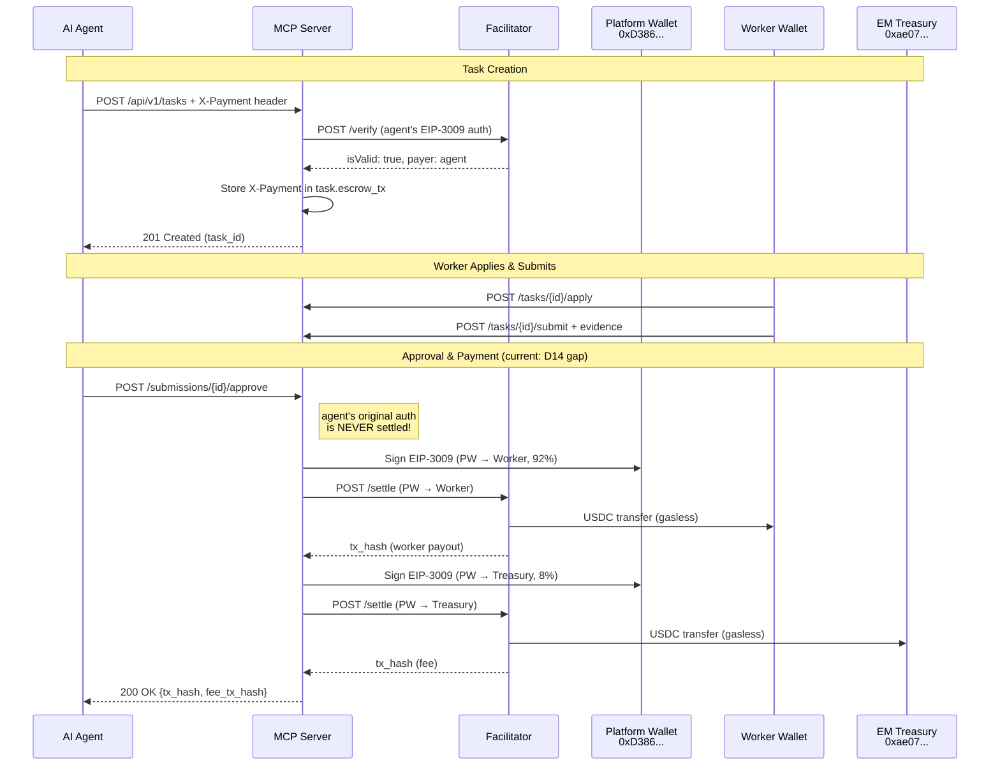
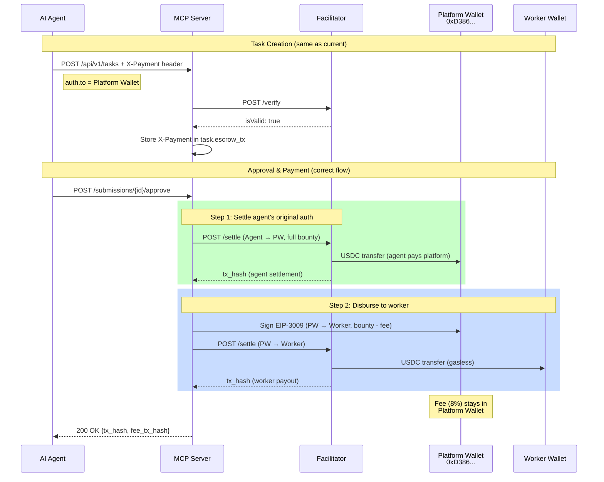
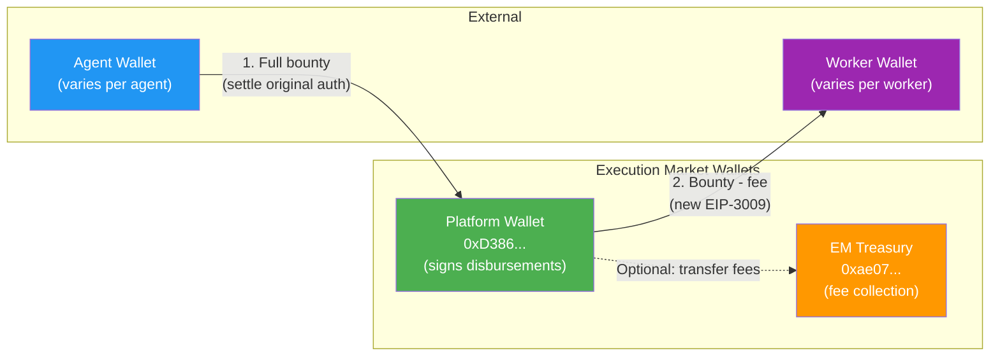
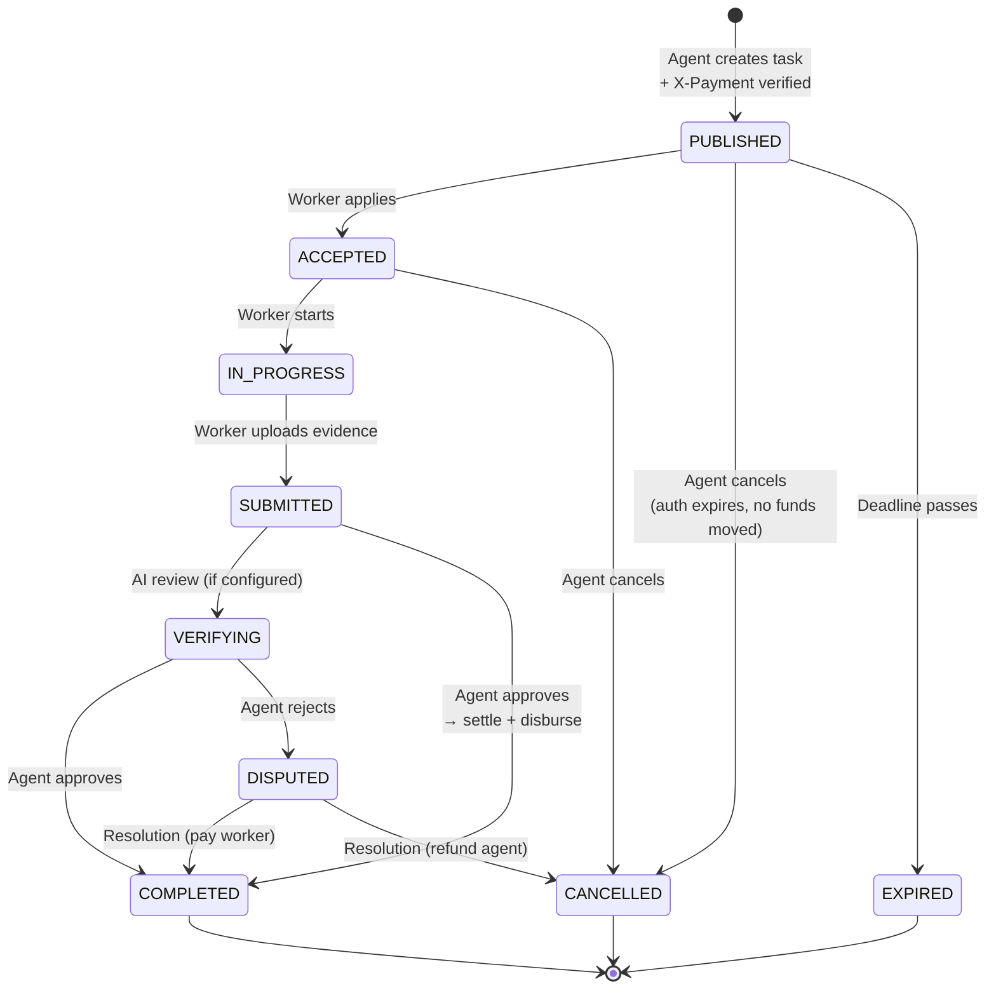

# Payment Architecture — Execution Market

> Last updated: 2026-02-06 | SDK: uvd-x402-sdk v0.8.1

## Payment Flow Overview

All payments are **gasless** via the Ultravioleta Facilitator. The facilitator pays gas on Base; agents and the platform only sign EIP-3009 authorizations.

### Current Flow (MVP — has D14 gap)



### Correct Flow (after D14 fix)



## Key Constraints

### EIP-3009 TransferWithAuthorization
- The `to` address is **cryptographically sealed** in the EIP-712 signature
- Cannot be changed after signing
- The facilitator **validates** `payTo == auth.to` — rejects mismatches

### Facilitator Rules
- `POST /verify`: Validates signature, does NOT move funds
- `POST /settle`: Executes on-chain transfer, facilitator pays gas
- Request format: V1 envelope with amounts/timestamps as **strings**
- OFAC + custom blacklist screening on all operations

## Wallet Map



| Wallet | Address | Purpose | Env Var |
|--------|---------|---------|---------|
| Platform (prod) | `0xD3868E1eD738CED6945A574a7c769433BeD5d474` | Signs worker payouts & fee collection | `em/x402:PRIVATE_KEY` |
| Platform (dev) | `0x857fe6150401bFB4641Fe0D2B2621cc3B05543Cd` | Local testing | `.env.local:WALLET_PRIVATE_KEY` |
| EM Treasury | `0xae07ceb6b395bc685a776a0b4c489e8d9ce9a6ad` | Fee accumulation | `em/commission:wallet_address` |

## Task Lifecycle & Payment States



## Escrow States

```mermaid
stateDiagram-v2
    [*] --> AUTHORIZED: Agent's EIP-3009 auth verified<br/>(no funds moved yet)

    AUTHORIZED --> RELEASED: Task approved<br/>→ settle agent auth<br/>→ disburse to worker
    AUTHORIZED --> CANCELLED: Task cancelled<br/>(auth expires naturally)
    AUTHORIZED --> EXPIRED: Auth validBefore passes

    RELEASED --> [*]: Worker paid on-chain
    CANCELLED --> [*]: No funds moved
    EXPIRED --> [*]: No funds moved

    note right of AUTHORIZED: Current gap (D14):<br/>auth never settled,<br/>platform pays from own wallet
```

## Fee Calculation

```
Bounty:       $X.XX (set by agent at task creation)
Platform Fee: $X.XX * 8% = $Y.YY  (EM_PLATFORM_FEE env var, default 0.08)
Worker Payout: $X.XX - $Y.YY

Example: $1.00 bounty
  → Worker receives: $0.92
  → Platform keeps:  $0.08
```

For MVP launch, commission can be set to 0% via `EM_PLATFORM_FEE=0.00`.

## SDK Usage (v0.8.1)

```python
from uvd_x402_sdk import X402Client

client = X402Client(recipient_address="0xD386...")

# Verify (task creation) — no funds move
payload = client.extract_payload(x_payment_header)
verify = client.verify_payment(payload, Decimal("1.00"))

# Settle to default recipient (task approval step 1)
settle = client.settle_payment(payload, Decimal("1.00"))

# Settle to custom address (worker disbursement)
settle = client.settle_payment(payload, Decimal("0.92"), pay_to="0xWorker...")
```

## Open Issues

| ID | Description | Severity | Status |
|----|-------------|----------|--------|
| D14 | Agent's auth never settled — platform pays from own wallet | HIGH | OPEN |
| D01 | Self-payment bug (compares wallet vs API key ID) | HIGH | OPEN |
| D02 | `payments` table missing in live DB | MEDIUM | OPEN |
| D13 | On-chain splitter contract for automated fee split | FUTURE | OPEN |
| D09 | Funded escrow refund (AdvancedEscrowClient) | FUTURE | OPEN |
