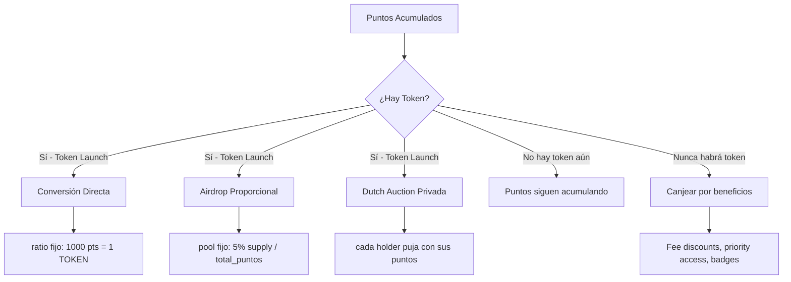
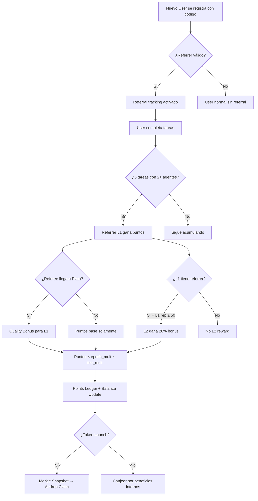

# Referral Points System — Brainstorm & Game Theory

> **Status**: Brainstorm / Draft
> **Date**: 2026-02-13
> **Author**: 0xultravioleta + Claude

---

## 1. Visión General

Un sistema de **puntos por referidos** donde participantes acumulan puntos al traer nuevos usuarios activos a Execution Market. Los puntos son un **compromiso implícito** (no legalmente vinculante) de que, si EM lanza un token en el futuro, los holders de puntos tendrán acceso prioritario via airdrop o conversión.

### ¿Por qué puntos y no cash directo?

| Cash (sistema actual) | Puntos (propuesta) |
|---|---|
| Costo inmediato para EM | Sin costo hasta token launch |
| Incentivo de corto plazo | Alinea incentivos a largo plazo |
| Sin network effects | Crea comunidad de "believers" |
| Fácil de calcular ROI | Genera especulación + FOMO positivo |
| No genera lealtad | Lock-in por sunk cost + anticipación |

### Principio Central

> **"Puntos que se ganan difícilmente se valoran más que puntos regalados."**

El sistema debe hacer que cada punto se sienta *earned*, no *farmed*.

---

## 2. Anatomía del Punto

### 2.1 Fuentes de Puntos

| Acción | Puntos Base | Multiplicador | Notas |
|--------|-------------|---------------|-------|
| **Referir worker que completa 1ra tarea** | 100 | × tier_mult | Proof of Useful Work |
| **Referir worker que completa 5 tareas** | 250 | × tier_mult | Milestone bonus |
| **Referir worker que llega a tier Plata** | 500 | × tier_mult | Quality signal |
| **Referir agente que publica 1ra tarea** | 200 | × 1.5 | Supply side más valioso |
| **Referir agente que gasta >$10** | 500 | × 1.5 | Revenue-generating referral |
| **Completar tarea (worker)** | 10 | × streak | Actividad propia |
| **Publicar tarea (agente)** | 5 | × 1 | Actividad propia |
| **Rating ≥ 4 estrellas recibido** | 15 | × 1 | Quality signal |
| **Early adopter bonus** | 1000 | × epoch_decay | Solo primeros N usuarios |

### 2.2 Multiplicadores

```
tier_mult:
  Bronce  (0-30 rep):   1.0×
  Plata   (31-60 rep):  1.2×
  Oro     (61-80 rep):  1.5×
  Diamante (81-100 rep): 2.0×

streak:
  1-4 tareas consecutivas:   1.0×
  5-9 tareas consecutivas:   1.1×
  10-19 tareas consecutivas: 1.25×
  20+ tareas consecutivas:   1.5×

epoch_decay:
  Epoch 1 (primeros 100 users):  3.0×
  Epoch 2 (100-500 users):       2.0×
  Epoch 3 (500-2000 users):      1.5×
  Epoch 4 (2000-10000 users):    1.0×
  Epoch 5+ (>10000 users):       0.8×
```

### 2.3 Tiers de Referidor

No todos los referidores son iguales. Un worker Diamante que refiere a alguien es señal más fuerte que un Bronce.

```
Referidor Bronce  → puntos base × 1.0
Referidor Plata   → puntos base × 1.2
Referidor Oro     → puntos base × 1.5
Referidor Diamante → puntos base × 2.0
```

**Game theory**: Esto crea un **juego de señalización** (signaling game). Workers de alta reputación tienen más que perder si refieren basura, así que su referido es una señal creíble de calidad. Recompensarlos más es *incentive-compatible*.

---

## 3. Game Theory — Ataques y Defensas

### 3.1 Ataque: Sybil (Cuentas Falsas)

**Vector**: Alice crea 50 wallets, se auto-refiere, completa micro-tareas entre sus cuentas.

**Defensas (layered)**:

| Capa | Mecanismo | Costo para atacante |
|------|-----------|---------------------|
| 1. Proof of Useful Work | Puntos solo al completar tareas REALES (aprobadas por agentes distintos) | Necesita colusión con agente |
| 2. On-chain identity cost | Cada worker necesita ERC-8004 identity (gas o Facilitator) | Scaling cost per identity |
| 3. Minimum task value | Solo tareas ≥ $0.10 generan puntos | $0.10 × 5 tareas = $0.50 mínimo per Sybil |
| 4. Unique agent requirement | Las 5 tareas del referee deben ser de ≥ 2 agentes distintos | No puede auto-farmear con 1 agente |
| 5. Referral graph analysis | Detectar clusters: si A→B→C→D→A, flag como ring | Difícil de evadir a escala |
| 6. Diminishing returns | Cada referido adicional da menos puntos (√n scaling) | ROI decrece exponencialmente |
| 7. Time gates | Mínimo 48h entre registro y primera tarea completada | No puede farmear en batch |

**Costo estimado de Sybil attack**:
```
50 cuentas × $0.50 (5 tareas mínimas) = $25
50 cuentas × 48h time gate = semanas de operación
50 cuentas × 2+ agentes distintos = necesita agentes cómplices

Puntos obtenidos: 50 × 100 = 5,000 puntos base
Pero con √n scaling: Σ(100/√i) para i=1..50 ≈ 1,421 puntos

Conclusión: $25+ de costo para ~1,421 puntos con valor incierto.
El attack no escala económicamente.
```

### 3.2 Ataque: Quality Dilution

**Vector**: Bob refiere a 200 personas que hacen tareas mediocres. Acumula puntos pero degrada la plataforma.

**Defensas**:

| Mecanismo | Efecto |
|-----------|--------|
| **Reputation-linked rewards** | Si el referee tiene <50 rep después de 10 tareas, el referidor pierde 50% de puntos de ese referido |
| **Referrer reputation penalty** | Si >30% de tus referidos tienen rep <40, tu multiplicador de tier baja 1 nivel |
| **Quality bonus** | Si referee llega a Oro o Diamante, referidor gana bonus retroactivo (+500 pts) |
| **Skin in the game** | Referidor "apuesta" 50 puntos propios por referido — los recupera ×2 si referee es bueno, los pierde si es malo |

**Game theory**: Esto es un **mecanismo de screening**. El costo de apostar puntos revela información privada: solo referidores que genuinamente creen en la calidad de su referido apostarán. Es *truth-revealing*.

### 3.3 Ataque: Timing / Speculation

**Vector**: Carol acumula puntos y espera a que el ratio de conversión puntos→tokens sea máximo.

**Defensas**:

| Mecanismo | Efecto |
|-----------|--------|
| **Conversión snapshot** | El ratio se fija en el momento del airdrop, no es manipulable post-hoc |
| **Activity requirement** | Para convertir puntos, debes haber sido activo en los últimos 30 días |
| **Decay suave** | Puntos inactivos pierden 2% mensual después de 6 meses sin actividad |
| **Cliff vesting** | Referral points vestan 25% inmediato, 75% over 6 meses de actividad del referee |

### 3.4 Ataque: Collusion Ring

**Vector**: Grupo de 10 personas se refieren circularmente y completan tareas entre sí.

**Defensas**:

| Mecanismo | Efecto |
|-----------|--------|
| **Graph analysis** | Detectar ciclos en el referral graph. Si A→B→C→A, penalizar todo el ciclo |
| **External agent requirement** | Tareas que "cuentan" deben venir de agentes fuera del referral cluster |
| **Value threshold** | Solo tareas con bounty ≥ $0.10 cuentan (costo real per colluder) |
| **IP/device fingerprinting** | Ya implementado en `referrals.py` — flags shared devices |

**Nash Equilibrium Analysis**:
```
Payoff de coludir: ~100 pts per colluder, -50% si detectados
Payoff de jugar limpio: ~100 pts per referido genuino, +bonus si referee es bueno
Costo de colusión: $0.50+ per persona, riesgo de ban, tiempo de coordinación

→ El equilibrio dominante es jugar limpio:
  E[puntos|coludir] = 100 × 0.5 = 50 pts (50% chance de detección)
  E[puntos|legítimo] = 100 × 1.2 = 120 pts (promedio con multiplicadores)
```

### 3.5 Ataque: Whale Accumulation

**Vector**: Un venture fund refiere a 10,000 personas y acumula puntos masivamente pre-token.

**Defensas**:

| Mecanismo | Efecto |
|-----------|--------|
| **√n scaling** | Referido #1 = 100pts, #10 = 31pts, #100 = 10pts, #1000 = 3pts |
| **Cap por epoch** | Máximo 5,000 puntos por referidos per epoch (30 días) |
| **Proof of personhood** | Para referidos >50, requerir verificación adicional del referidor |
| **Community allocation cap** | Máximo 5% del token supply total vía referral points |

**Bonding curve de referidos**:
```
puntos(n) = 100 / √n

Referido #1:   100 pts
Referido #5:   44.7 pts
Referido #10:  31.6 pts
Referido #25:  20 pts
Referido #50:  14.1 pts
Referido #100: 10 pts

Total para 100 referidos: ~1,421 pts (no 10,000)
Total para 1000 referidos: ~4,494 pts (no 100,000)
```

La curva √n es la defensa más elegante: **recompensa breadth pero castiga depth**. No puedes farmear infinitamente.

---

## 4. Mecanismo de Conversión Puntos → Token

### 4.1 Opciones de Distribución



### 4.2 Modelo Recomendado: Airdrop Pool + Tiers

```
Token Supply Total: 1,000,000,000 (1B)
Referral Airdrop Pool: 5% = 50,000,000 tokens

Distribución por tier de puntos:
  Tier S (top 1% holders):    2.5% del pool (12.5M tokens)
  Tier A (top 5% holders):    2.0% del pool (10M tokens)
  Tier B (top 15% holders):   1.5% del pool (7.5M tokens)
  Tier C (top 30% holders):   1.0% del pool (5M tokens)
  Tier D (todos los demás):   repartir el restante (15M tokens)

Dentro de cada tier: proporcional a puntos
```

**¿Por qué tiers y no proporcional puro?**

Game theory: **Proporcional puro incentiva al whale**. Con tiers:
- El marginal value de acumular más puntos decrece después de llegar a tu tier
- Whale que tiene 1M puntos y está en Tier S no gana proporcionalmente más por farmear 100K más
- Pero el user con 500 puntos tiene incentivo fuerte para llegar a 1000 (saltar de D a C)
- **Esto maximiza el engagement del middle tier**, que es donde está el growth real

### 4.3 Vesting del Airdrop

```
Vesting Schedule para tokens del airdrop:
  - 10% inmediato (liquid al claim)
  - 30% cliff a 3 meses
  - 60% linear vesting over 12 meses

Acceleradores:
  - Si sigues activo en EM: vesting 2× más rápido
  - Si tu referral network crece post-airdrop: unlock bonus
  - Si stakeas tokens en governance: vesting 1.5× más rápido
```

**Game theory**: El vesting con acceleradores por actividad crea un **compromiso creíble** (credible commitment). Los holders no pueden simplemente dumpear — para maximizar su airdrop, deben seguir contribuyendo. Esto alinea incentivos post-launch.

### 4.4 Fallback: No Token Scenario

Si EM nunca lanza token, los puntos deben tener valor intrínseco:

| Beneficio | Costo en Puntos |
|-----------|-----------------|
| 0% platform fee por 1 mes | 5,000 pts |
| Priority matching (tasks primero) | 2,000 pts |
| Badge exclusivo "Early Believer" | 1,000 pts |
| Acceso a tareas premium (>$5) | 3,000 pts |
| Voto en governance decisions | 500 pts per voto |
| Verified badge permanente | 10,000 pts |

Esto convierte los puntos en una **moneda interna** con utilidad real, incluso sin token.

---

## 5. Diseño de Epochs (Temporadas)

### 5.1 Estructura

```
Epoch 1: "Genesis"      — Primeros 100 users   — 3× multiplier
Epoch 2: "Early Access"  — 100-500 users        — 2× multiplier
Epoch 3: "Growth"        — 500-2000 users       — 1.5× multiplier
Epoch 4: "Scale"         — 2000-10000 users     — 1× multiplier
Epoch 5: "Maturity"      — 10000+ users         — 0.8× multiplier
```

### 5.2 Epoch Mechanics

- **Epochs no tienen duración fija** — avanzan por milestone de usuarios
- **Los puntos de epochs anteriores NO decaen** — son permanentes
- **Leaderboard por epoch** — top 10 de cada epoch reciben badge permanente
- **Epoch transition es pública** — anunciada 7 días antes

### 5.3 Game Theory del Epoch

Esto crea un **juego de urgencia controlada**:

```
Valor de referir en Epoch 1: 100 × 3.0 = 300 pts
Valor de referir en Epoch 3: 100 × 1.5 = 150 pts
Valor de referir en Epoch 5: 100 × 0.8 = 80 pts
```

Los early adopters tienen ventaja **pero no insalvable**:
- Un late joiner que refiere 10 personas de alta calidad (→ Oro) puede superar a un early adopter que refirió 5 mediocres
- El epoch multiplier se aplica al BASE, no al total con bonuses de calidad

**Resultado**: Incentiva referir TEMPRANO, pero no a costa de la calidad.

---

## 6. Referral Depth: ¿Multi-nivel?

### 6.1 Opciones

```
Opción A: Solo nivel 1 (directo)
  Alice → Bob: Alice gana 100 pts
  Bob → Carol: Bob gana 100 pts, Alice gana 0

Opción B: 2 niveles (capped)
  Alice → Bob: Alice gana 100 pts
  Bob → Carol: Bob gana 100 pts, Alice gana 20 pts (20%)
  Carol → Dave: Carol gana 100 pts, Bob gana 20 pts, Alice gana 0

Opción C: Decaying multi-level (3 max)
  Alice → Bob: Alice gana 100 pts
  Bob → Carol: Bob 100, Alice 15 (15%)
  Carol → Dave: Carol 100, Bob 15, Alice 5 (5%)
  Dave → Eve: Dave 100, Carol 15, Bob 5, Alice 0 (cap en 3)
```

### 6.2 Recomendación: Opción B (2 niveles)

**¿Por qué?**

| Factor | 1 nivel | 2 niveles | 3+ niveles |
|--------|---------|-----------|------------|
| Simplicidad | Alta | Media | Baja |
| MLM perception | Ninguna | Mínima | **Alta** ⚠️ |
| Incentivo de "enseñar" | Bajo | **Alto** | Medio |
| Sybil resistance | Alta | Media | **Baja** ⚠️ |
| Network growth | Lineal | **Exponencial controlado** | Exponencial |

2 niveles crea un **juego de mentorship**: Alice no solo quiere que Bob se registre — quiere que Bob sea BUENO para que Bob también refiera gente. Esto alinea incentivos de calidad en cascada.

**Condición nivel 2**: Los puntos de nivel 2 solo se activan si el referee directo (Bob) tiene reputación ≥ 50. Si Bob es malo, Alice no gana nada del network de Bob.

---

## 7. Leaderboard & Social Dynamics

### 7.1 Leaderboard Público

```
🏆 Top Referidores — Epoch 1 "Genesis"

 #  | Handle          | Pts   | Referidos | Quality Avg
----|-----------------|-------|-----------|------------
 1  | @maria_eth      | 4,200 | 12        | ⭐ 4.2
 2  | @carlos_base    | 3,800 | 8         | ⭐ 4.7
 3  | @agent_007      | 2,100 | 15        | ⭐ 3.1
```

### 7.2 Social Proof Mechanisms

| Mecanismo | Efecto Psicológico | Game Theory |
|-----------|-------------------|-------------|
| **Leaderboard público** | Competencia + status | Tournament game — effort increases with proximity to leader |
| **"Referred by" badge** | Social proof para referee | Señal de endorsement — referrer's reputation at stake |
| **Streak counter** | Loss aversion | Sunk cost → continúa refiriendo |
| **Milestone notifications** | Dopamine loops | Variable reward schedule (Skinner) |
| **"Network size" stat** | Empire building | Vanity metric que incentiva growth |

### 7.3 Anti-Toxicity

- Leaderboard muestra top 10, no ranking exacto fuera del top 10 (evita "grinding shame")
- No mostrar puntos exactos de otros — solo tu posición relativa ("top 5%", "top 15%")
- Quality Average visible — previene que farmers de cantidad se posicionen alto

---

## 8. Integración con Sistema Existente

### 8.1 Hook Points en el Código Actual

```python
# En routes.py — al aprobar submission
async def approve_submission(task_id, submission_id):
    # ... existing approval logic ...

    # NUEVO: Check si worker fue referido
    referral = await check_referral(worker_id)
    if referral and referral.status == "qualifying":
        referral.tasks_completed += 1
        if referral.tasks_completed >= referral.tasks_required:
            await award_referral_points(referral.referrer_id, worker_id)

    # NUEVO: Award activity points al worker
    await award_activity_points(worker_id, "task_completed", task_value)

# En reputation.py — al recibir rating
async def submit_rating(executor_id, rating):
    # ... existing rating logic ...

    # NUEVO: Bonus points por alta calidad
    if rating >= 4:
        await award_activity_points(executor_id, "high_rating", rating)
```

### 8.2 Tablas Nuevas Necesarias

```sql
-- Migration 032: Referral Points System

-- Points ledger (immutable append-only)
CREATE TABLE points_ledger (
    id UUID PRIMARY KEY DEFAULT gen_random_uuid(),
    user_id UUID NOT NULL,  -- executor or agent
    amount INTEGER NOT NULL,  -- can be negative for stakes/penalties
    source VARCHAR(50) NOT NULL,  -- 'referral_l1', 'referral_l2', 'activity', 'stake', 'penalty', 'decay'
    reference_id UUID,  -- links to referral, task, etc.
    epoch INTEGER NOT NULL DEFAULT 1,
    multiplier DECIMAL(4,2) DEFAULT 1.0,
    final_amount INTEGER NOT NULL,  -- amount × multiplier
    metadata JSONB DEFAULT '{}',
    created_at TIMESTAMPTZ DEFAULT NOW()
);

-- Points balance (materialized, recalculated from ledger)
CREATE TABLE points_balance (
    user_id UUID PRIMARY KEY,
    total_earned INTEGER DEFAULT 0,
    total_spent INTEGER DEFAULT 0,  -- redeemed for benefits
    total_staked INTEGER DEFAULT 0,  -- locked in referral stakes
    total_decayed INTEGER DEFAULT 0,
    current_balance INTEGER GENERATED ALWAYS AS
        (total_earned - total_spent - total_staked - total_decayed) STORED,
    last_activity_at TIMESTAMPTZ,
    epoch_at_registration INTEGER DEFAULT 1,
    updated_at TIMESTAMPTZ DEFAULT NOW()
);

-- Referral tree (for multi-level tracking)
CREATE TABLE referral_tree (
    referee_id UUID PRIMARY KEY,
    referrer_l1_id UUID NOT NULL,  -- direct referrer
    referrer_l2_id UUID,  -- referrer's referrer
    code_used VARCHAR(20) NOT NULL,
    registered_at TIMESTAMPTZ DEFAULT NOW(),
    status VARCHAR(20) DEFAULT 'active',  -- active, suspended, banned

    CONSTRAINT no_self_referral CHECK (referee_id != referrer_l1_id)
);

-- Epoch tracking
CREATE TABLE points_epochs (
    epoch INTEGER PRIMARY KEY,
    name VARCHAR(50) NOT NULL,
    multiplier DECIMAL(4,2) NOT NULL,
    user_threshold INTEGER NOT NULL,  -- users needed to advance
    started_at TIMESTAMPTZ,
    ended_at TIMESTAMPTZ,
    is_active BOOLEAN DEFAULT FALSE
);

-- Points redemptions (for non-token benefits)
CREATE TABLE points_redemptions (
    id UUID PRIMARY KEY DEFAULT gen_random_uuid(),
    user_id UUID NOT NULL,
    benefit_type VARCHAR(50) NOT NULL,
    points_spent INTEGER NOT NULL,
    metadata JSONB DEFAULT '{}',
    created_at TIMESTAMPTZ DEFAULT NOW(),
    expires_at TIMESTAMPTZ
);

-- Indexes
CREATE INDEX idx_points_ledger_user ON points_ledger(user_id, created_at DESC);
CREATE INDEX idx_points_ledger_source ON points_ledger(source);
CREATE INDEX idx_referral_tree_l1 ON referral_tree(referrer_l1_id);
CREATE INDEX idx_referral_tree_l2 ON referral_tree(referrer_l2_id);
```

### 8.3 Dashboard UX

```
┌─────────────────────────────────────────────┐
│  🎯 Mis Puntos                              │
│                                             │
│  Balance: 2,450 pts    Epoch: Genesis (3×)  │
│  ████████████░░░░░░░░ Tier B (top 15%)     │
│                                             │
│  Tu código: EM-MARIA42                      │
│  [Copiar] [Compartir]                       │
│                                             │
│  ─── Referidos (8 total) ──────────────     │
│  ✅ @carlos — Plata — +320 pts              │
│  ✅ @ana — Oro — +780 pts (quality bonus!)  │
│  ⏳ @pedro — 3/5 tareas — +0 pts (pending) │
│  ❌ @fake01 — Suspendido — -50 pts          │
│                                             │
│  ─── Red de Nivel 2 ──────────────────     │
│  @carlos refirió a @diego → +64 pts        │
│  @ana refirió a @lucia → +96 pts            │
│                                             │
│  ─── Actividad Reciente ─────────────      │
│  Hoy: +10 pts (tarea completada)            │
│  Ayer: +15 pts (rating ⭐ 4.5)             │
│  Hace 3 días: +250 pts (referido milestone) │
│                                             │
│  [Canjear Puntos] [Ver Leaderboard]         │
└─────────────────────────────────────────────┘
```

---

## 9. Modelado Económico

### 9.1 Simulación: 1000 Users Over 6 Months

```
Assumptions:
  - 20% refiere a al menos 1 persona (200 referrers)
  - Avg referrals per referrer: 3
  - 60% de referidos completan 5 tareas (qualifying)
  - 30% llegan a tier Plata+
  - Epoch 1-3 durante este período

Total referral points emitidos:
  L1: 200 referrers × 3 refs × 0.6 completion × 100 base × 2.0 avg epoch mult
    = 72,000 pts

  L2: 200 × 3 × 0.6 × 0.3 (% que refieren) × 2 refs × 0.6 × 20 pts
    = 2,592 pts

  Quality bonuses: 200 × 3 × 0.6 × 0.3 (% Plata+) × 500
    = 54,000 pts

  Activity points: 1000 users × 20 tasks avg × 10 pts
    = 200,000 pts

  Total: ~328,592 pts en circulación

Per-user average: ~328 pts
Top 1% (10 users): ~5,000+ pts cada uno
Median: ~120 pts
```

### 9.2 Token Conversion Scenario

```
Si token supply = 1B y referral pool = 5% = 50M tokens:

Total puntos at snapshot: 328,592
Rate: 50,000,000 / 328,592 ≈ 152 tokens per punto

Top user (5,000 pts): 760,000 tokens (0.076% of supply)
Average user (328 pts): 49,856 tokens (0.005% of supply)
Median user (120 pts): 18,240 tokens (0.002% of supply)

Si token price = $0.01:
  Top user: $7,600
  Average: $498
  Median: $182

Si token price = $0.10:
  Top user: $76,000
  Average: $4,985
  Median: $1,824
```

### 9.3 Gini Coefficient Target

Un sistema sano tiene Gini entre 0.3-0.5 para puntos:
- < 0.3: Demasiado igualitario → no incentiva esfuerzo
- 0.3-0.5: Healthy inequality → recompensa contribución
- > 0.5: Demasiado desigual → whales dominan, desmotiva nuevos

La combinación de √n scaling + epoch decay + tier-based pool distribution debería mantener Gini ~0.4.

---

## 10. On-Chain vs Off-Chain

### 10.1 Decisión

| Aspecto | Off-chain (Supabase) | On-chain (ERC-20/soulbound) |
|---------|---------------------|---------------------------|
| Costo | $0 | Gas per mint |
| Velocidad | Instant | Depende de chain |
| Flexibilidad | Total (can adjust rules) | Immutable (feature, not bug) |
| Transparencia | Baja (trust us) | Alta (verifiable) |
| Sybil resistance | Moderate | High (gas cost) |
| Token conversion | Requires snapshot + distribution | Native (already on-chain) |

### 10.2 Recomendación: Hybrid

```
Fase 1 (ahora): Off-chain en Supabase
  - Points ledger en DB
  - Dashboard muestra balance
  - Epoch tracking automático
  - Sin costo, iteración rápida

Fase 2 (pre-token): Merkle root on-chain
  - Snapshot semanal de balances
  - Publish merkle root en Base
  - Users pueden verificar su balance on-chain
  - Transparencia sin gas per-user

Fase 3 (token launch): Claim via merkle proof
  - Airdrop contract con merkle tree
  - Users claim tokens presentando proof
  - Vesting contract para schedules
  - Gas pagado por user (o gasless via Facilitator)
```

---

## 11. Riesgos y Mitigaciones

| Riesgo | Probabilidad | Impacto | Mitigación |
|--------|-------------|---------|------------|
| Percepción de MLM | Media | Alto | Solo 2 niveles, no lo llamar "niveles" sino "network bonus" |
| Regulatory (securities law) | Media | Muy Alto | Puntos NO son securities — no prometer retorno, no vender puntos |
| Sybil farming a escala | Baja | Medio | √n scaling + Proof of Useful Work + graph analysis |
| Whales dominando airdrop | Media | Medio | Tier-based pool distribution + caps |
| Expectativas infladas | Alta | Medio | Comunicar claramente: "puntos, no promesas" |
| Gaming del leaderboard | Media | Bajo | Quality Average visible + anti-gaming detection |
| Token nunca se lanza | Media | Alto | Points tienen utilidad intrínseca (fee discounts, priority) |

### 11.1 Legal: Lenguaje Cuidadoso

```
✅ "Puntos de referido que podrían ser considerados en futuros programas de la comunidad"
✅ "Sistema de reconocimiento por contribuciones al crecimiento del ecosistema"
✅ "Los puntos no tienen valor monetario y no son transferibles"

❌ "Invierte en puntos ahora y gana tokens después"
❌ "Tus puntos valdrán X cuando lancemos el token"
❌ "Gana dinero refiriendo amigos"
```

---

## 12. Resumen de Mecanismos Clave



---

## 13. Preguntas Abiertas

1. **¿Puntos transferibles entre users?** — Probablemente NO (previene mercado negro) pero podría haber gifting limitado
2. **¿Agentes (AI) también acumulan puntos?** — Sí, pero con cap diferente (agentes generan revenue, workers generan supply)
3. **¿Integrar con ERC-8004 on-chain?** — Los puntos podrían ser un "dimension" del reputation score on-chain
4. **¿Burn mechanism?** — ¿Puntos canjeados se queman o recirculan? (Quemarlos crea deflación → más valioso)
5. **¿Seasonal resets?** — ¿Cada epoch resetea o acumula? (Recomendación: acumula, epoch solo afecta multiplier)
6. **¿Referir agentes vs workers?** — ¿Mismo sistema o tracks separados? (Recomendación: mismo sistema, diferentes puntos base)
7. **¿Governance weight?** — ¿Los puntos dan poder de voto en decisiones de la plataforma pre-token?
8. **¿Partner programs?** — ¿Otros proyectos/DAOs pueden referir en bulk con deal especial?

---

## 14. Next Steps (si se aprueba)

1. **Definir MVP scope** — ¿Cuáles features son Fase 1 vs Fase 2?
2. **Migration 032** — Schema de tablas en Supabase
3. **Points engine** — `mcp_server/growth/points.py`
4. **API endpoints** — CRUD para códigos, balance, leaderboard
5. **Dashboard widget** — React component para puntos
6. **Comunicación** — Draft de "términos del programa" (no-promise language)
7. **Testing** — Simulación de game theory scenarios con data sintética
