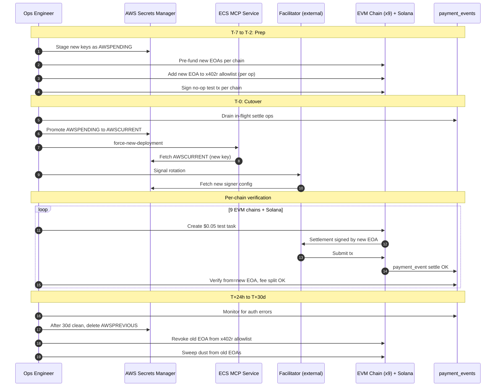

# Wallet Rotation Ceremony — INC-2026-04-21 Follow-up

## 1. Executive Summary

On 2026-04-21 a security forensics pass catalogued 61 secrets in AWS Secrets Manager (`us-east-2`). **Zero have ever been rotated.** Three of them sign every payment the platform settles and together gate the funds held by every agent mid-flight through the x402 facilitator. Their compromise is not "a security event" — it is an immediate, irreversible, multi-chain drain of agent escrow, platform transit balance, and commission accruals across 9 EVM chains + Solana.

The three in scope:

- `<FACILITATOR_EVM_SECRET>` — signs settlements and refunds on 9 EVM chains via [[facilitator]]. This is the hot key that pays gas and executes every release, refund, and `distributeFees()` call.
- `<EM_X402_SECRET>` — holds the x402 SDK wallet used for server-signed testing paths and for any legacy `fase1` flows that still touch USDC directly (see [[fase-1-direct-settlement]]).
- `<EM_COMMISSION_SECRET>` — commission / fee control wallet. Sits adjacent to the 13% platform fee split documented in [[fee-structure]] and [[platform-fee]].

**In scope**: generate new EOAs for each of the three secrets, pre-fund them, cut over ECS, verify per chain, revoke old keys, burn the old secret version after a 30-day quarantine.

**Out of scope (non-goals)**: the other 58 secrets (API keys, Supabase, Pinata, RPC tokens, World ID signing key, ERC-8004 relay keys, etc). Those will be triaged under a separate ceremony once this one proves the playbook. Specifically **not** rotating:
- ERC-8004 reputation relay (gas-only, no fund custody).
- Treasury Ledger at `<TREASURY>` — that is a hardware wallet and is not in AWS Secrets Manager.
- Platform wallet signing key if it is a multisig (confirm before T-7).

**Compliance motivation**: industry hygiene calls for key rotation on 6-12 month cadence. Three years at zero rotations = catastrophic audit finding if we pursue SOC 2 or any institutional partnerships, and a real and compounding insider + backup-leak surface.

---

## 2. Risk Model

### Cost of NOT rotating

- **Compounding leak surface over time.** Every backup, every historical IAM role drift, every former operator who had `secretsmanager:GetSecretValue`, every CI log line that may have accidentally leaked a fragment — they all pile up. At 3 years with 0 rotations, the probability that at least one of these three keys has been exposed to an adversary is monotonically increasing and non-trivial.
- **Insider risk.** Any human who touched production in the last 3 years could have cached these keys. We have no mechanism to detect or revoke access post-hoc.
- **Backup leak risk.** AWS Backup, Terraform state files, Secrets Manager automated versioning — all of these create copies we have less control over than we think.
- **Audit posture.** "Never rotated" is the single worst answer to the single most common auditor question about secret hygiene.

### Risk DURING rotation

- **Funds in flight.** Any task mid-lifecycle (escrow locked, not yet released) is signed by the OLD facilitator. If we cut over mid-flight, releases fail until we drain the queue or teach the facilitator to hold two keys.
- **Stale secret caching in ECS tasks.** ECS tasks cache secrets at container start. A force-new-deployment is required; rolling restart is insufficient if any task pins to a specific version.
- **Chain-by-chain divergence.** Gas token funding, nonce state, and RPC availability differ per chain. A partial rotation — new key works on 7 of 9 chains — is worse than no rotation because it leaves the system in an ambiguous state.
- **Facilitator downtime.** [[facilitator]] runs outside this repo (UltravioletaDAO/x402-rs). Coordinating the key change there is a dependency on a separate operator.
- **x402r allowlists.** PaymentOperators (see [[payment-operator]], [[x402r-escrow]]) may have the current facilitator address baked in as an authorized operator. If so, the new EOA must be added to the allowlist BEFORE cutover, which is an on-chain transaction per chain.

### Cost of rotating BADLY

- **Locked funds.** If escrow on chain X references the old facilitator and the old key is destroyed before all escrows are drained, those funds are recoverable only via the escape hatch in `AuthCaptureEscrow` (if any) or via direct contract calls using the old key from backup — which defeats the rotation.
- **Failed settlements during cutover.** Every failed settlement is an agent that is unhappy and a task that may need manual refund.
- **Reputation damage.** We are positioning as the Universal Execution Layer. A botched rotation on 9 chains at once is a public story we cannot afford.
- **Nonce desync.** If both old and new keys sign transactions in the same window on the same chain, we can create a nonce conflict and temporarily stall the facilitator.

---

## 3. Preparation Checklist (T-7 days → T-0)

### T-7: Decision

**Freeze vs zero-downtime.** The platform does not have a clean "pause new tasks" switch today. Building one for this ceremony is overkill; instead we use a drain window.

**Recommendation**: do NOT hard-freeze. Announce a 4-hour window on a low-traffic day (weekend UTC morning is ideal — see Open Questions) and time the ceremony so that no task with a deadline inside the window exists at T-0. The facilitator continues serving old signed operations from the drain queue; we only cut over for NEW operations.

### T-5: Pre-announce

- Notify the [[facilitator]] operator (UltravioletaDAO/x402-rs maintainers) of the target window and new EOA addresses.
- Confirm the facilitator will be able to (a) accept the new EOA on its signing config, (b) finish processing any in-flight operations signed by the old EOA, and (c) rotate its internal reference at our signal.
- Confirm treasury multisig signers are available during the window to approve any on-chain allowlist updates on `PaymentOperator` contracts.

### T-3: Generate new EOAs

- Generate three new EOAs in a clean environment (air-gapped machine or hardware wallet; NOT a laptop with browser extensions). One per secret.
- Each private key goes directly into AWS Secrets Manager as a NEW version of the corresponding secret, with `VersionStage = AWSPENDING` (not `AWSCURRENT`). This lets us stage without promoting.
- Public addresses go into a shared doc for funding math. Refer to them here as `<NEW_FACILITATOR_EOA>`, `<NEW_X402_EOA>`, `<NEW_COMMISSION_EOA>`.
- **Never** screen-share, stream, or log the private keys. Assume the user is live-streaming always.

### T-2: Pre-fund new wallets

Facilitator needs native gas on all 9 EVM chains for ~1,000 settlement operations headroom. Indicative numbers (tune against current gas oracle on the day of):

| Chain | Native | Target balance | Notes |
|---|---|---|---|
| Base | ETH | 0.02 | L2, cheap, plenty of runway |
| Ethereum | ETH | 0.20 | L1 — settlement can cost $5-50 per TX in spikes |
| Polygon | POL | 100 | Cheap; PoS finality quirks (wait 256 blocks for finality) |
| Arbitrum | ETH | 0.02 | L2, sequencer risk |
| Avalanche | AVAX | 2 | C-chain, dynamic fees |
| Celo | Celo has feeCurrency=USDC option; keep 5 CELO native as fallback | 5 CELO | see [[fee-structure]] for Celo specifics |
| Monad | MON (testnet today, mainnet soon) | 50 | less mature infra — overprovision |
| Optimism | ETH | 0.02 | L2, sequencer risk |
| SKALE | zero-gas | 0 | signing key still matters even with zero-gas — no pre-fund needed |
| Solana | SOL | 0.5 | Fase 1 only, direct SPL transfer — needs SOL for fees |

Commission and x402 wallets typically do NOT pay gas themselves (they are signed over by the facilitator for EIP-3009). Verify each one's role before funding — pre-fund only if they will send transactions directly.

### T-2: Pre-test signing from each new wallet

For each new EOA, sign a **no-op** transaction on each chain — e.g., a self-transfer of dust amount, or a `read-only` `verify` call through the facilitator using the new key's signature. Goal: prove the key+address+RPC path works end-to-end before we trust it with real flow. Log tx hashes for the PM's runbook.

### T-1: Update x402r allowlists if needed

- Inspect each `PaymentOperator` contract on each chain to determine if the old facilitator EOA is baked in as an authorized operator.
- If yes: submit on-chain transactions adding `<NEW_FACILITATOR_EOA>` as an operator. This is done from the PaymentOperator admin (typically treasury multisig). See [[payment-operator]].
- Do NOT remove the old EOA yet — we need both live through cutover.

### T-0.5 (30 min before): Stage secret promotion

- For each secret, verify `AWSPENDING` version contains the new key. Do NOT promote to `AWSCURRENT` yet.
- Confirm facilitator operator is online.
- Confirm ECS services `mcp-server` and related are healthy right now. Capture a baseline.

---

## 4. Ceremony Steps (T-0, sequenced)

**Order matters.** Do NOT parallelize. Each step has a verification gate.

### Step 1 — Notify, enter quiet period

- Post to internal ops channel: "Rotation ceremony start. No manual payment operations for the next 4 hours."
- Pause any automated task-posting bots (Karma Kadabra swarm, etc.) to reduce noise during verification.

### Step 2 — Drain in-flight operations

- Query `payment_events` for any `settle` without a matching `disburse_worker` / `disburse_fee` / `refund` in the last 24h. This is the drain set.
- Wait until it is empty or manually finalize each one using the OLD key path. Do not proceed with stale in-flight ops; those will fail once we cut over.

### Step 3 — Promote new secret versions

For each of the three secrets, move the new key from `AWSPENDING` to `AWSCURRENT`:

- Promote `<FACILITATOR_EVM_SECRET>` → new version → `AWSCURRENT`. Old version is automatically marked `AWSPREVIOUS`.
- Promote `<EM_X402_SECRET>` → same.
- Promote `<EM_COMMISSION_SECRET>` → same.

Do NOT delete `AWSPREVIOUS`. We keep it for 30-day quarantine.

### Step 4 — Force ECS redeploy

- Force a new deployment on the MCP service (`aws ecs update-service ... --force-new-deployment`).
- Wait for at least one healthy new task to pick up the new secret version. ECS tasks cache secrets at container start — a restart is mandatory.
- Hit `/health` and confirm it returns green from a new container (check task ARN).

### Step 5 — Facilitator side flip

- Signal the facilitator operator to rotate its signing config to point at the new facilitator EOA's AWS reference (or its own equivalent vault). This is the most delicate step because the facilitator is an external service.
- Verify facilitator `/health` shows new signer address (assuming facilitator exposes this — if not, we infer from a test settlement).

### Step 6 — Per-chain smoke test

For each of the 9 EVM chains plus Solana, in sequence:

1. Create a small test task via the API with a bounty of **$0.05**.
2. Have a test worker apply and get assigned — this triggers escrow lock using the new facilitator.
3. Submit evidence and approve — this triggers release with the new fee-split path.
4. Verify on-chain that:
   - The settlement transaction's `from` address is `<NEW_FACILITATOR_EOA>`.
   - The fee split occurred (worker received 87%, treasury got 13%).
   - Gas was paid from the new EOA's native balance.
5. Record the tx hash into the ceremony log.

If ANY chain fails: STOP. Do not proceed to the next chain. Go to rollback.

### Step 7 — 24-hour observation

- Monitor `payment_events` for any errors related to signing/auth.
- Monitor facilitator error logs.
- Monitor agent complaint channels (Discord, Telegram, X) for reports of failed payments.
- Do NOT delete old secret versions for 30 days.

### Rollback plan

If verification fails on ANY chain:

1. Re-promote `AWSPREVIOUS` → `AWSCURRENT` for the affected secret(s).
2. Force ECS redeploy to pick up the old key.
3. Signal facilitator to revert to old signer config.
4. Diagnose offline. Re-run the ceremony in a future window.

The rollback budget: old key remains valid and hot for 30 days after promotion. This is the window inside which rollback is cheap.

---

## 5. Chain-by-Chain Considerations

- **Ethereum L1.** Gas is unpredictable. Pre-fund generously (0.2 ETH minimum). Large settlements can cost $20+. ALB timeout for MCP server is 960s specifically to accommodate Ethereum L1 confirmation times (see [[facilitator]]); do not shorten during ceremony. Nonce management: if there's ANY chance of old+new keys both transacting, pause the old key completely before the new one starts.
- **Base / Arbitrum / Optimism.** L2s with sequencer risk. If a sequencer is down during the ceremony window, defer that chain. L2 fees are cheap, but sequencer outages can cause indefinite pending.
- **Polygon.** PoS finality is weird — 256 blocks for "safe" finality, but the facilitator considers receipts at 12 confirmations. Our test verification should wait the full safe-finality window before checking, to avoid reporting false positives.
- **Avalanche.** C-chain for EVM. Don't get confused with P-chain or X-chain — the facilitator only uses C-chain. Dynamic fees; overprovision.
- **Celo.** Supports `feeCurrency` for paying gas in USDC. We typically still pay in CELO native. Confirm the x402 SDK's default — if it uses feeCurrency=USDC, the new facilitator needs USDC balance on Celo, not just CELO native. See [[fee-structure]].
- **Monad.** Mainnet is new; RPC reliability is lower than established chains. Overprovision gas. Have a fallback RPC ready.
- **SKALE.** Zero-gas chain. Signing key still matters — the key authenticates transactions, even if no gas is paid. Don't skip SKALE during verification just because "no gas needed." A SKALE-specific failure mode: if the new EOA has never been "activated" on SKALE, there can be a delay. Ensure activation is part of T-2 pre-test.
- **Solana.** [[fase-1-direct-settlement]] only. Different key format (ed25519, base58). The new `<EM_X402_SECRET>` for Solana path needs a corresponding Solana keypair — this is NOT the same EOA as the EVM path. If the current `<EM_X402_SECRET>` secret bundles both an EVM key and a Solana key, we need to rotate both halves simultaneously. Verify the secret schema at T-3. No escrow on Solana, so rollback for Solana is a pure SPL transfer retry — simpler than EVM but still needs careful nonce-equivalent (blockhash) handling.

---

## 6. Ceremony Flow Diagram

---

## 7. Post-Ceremony Cleanup

**T+48h: Allowlist cleanup**
- Remove `<OLD_FACILITATOR_EOA>` from every `PaymentOperator` allowlist on each chain. Treasury multisig transaction per chain.
- Keep `<NEW_FACILITATOR_EOA>` as the only authorized operator.

**T+7d: Dust sweep**
- Sweep any residual native and token balances from old EOAs to a designated recovery address (NOT treasury — treasury never receives sweep dust; use a dedicated ops-recovery EOA).
- Log the sweep transactions.

**T+30d: Quarantine expiry**
- Delete `AWSPREVIOUS` version from each of the three secrets. This is the point of no return — the old key is gone.
- Do NOT do this earlier than 30 days. 30 days is the buffer for "undiscovered in-flight operation" or "auditor asks to see the old key pattern."

**Documentation updates**
- Update `CLAUDE.md` "Wallet Roles" section with new addresses for dev/audit context.
- Update [[wallet-roles]] in the vault.
- Update `.env.example` if any new key placeholders are needed.
- Add an incident/runbook note in `vault/12-operations/` referencing this ceremony.
- Update [[facilitator]] note with new signing EOA.

---

## 8. Scheduled Rotation Policy Going Forward

**Proposed cadence**: **every 6 months** for the three critical wallets (`<FACILITATOR_EVM_SECRET>`, `<EM_X402_SECRET>`, `<EM_COMMISSION_SECRET>`). Annual for the other 58 secrets.

**Automation recommendation**: **manual with heavy tooling**, NOT fully automated. Rationale:

- AWS Secrets Manager native rotation works for RDS/API keys. It does NOT know how to:
  - Coordinate with an external facilitator operator.
  - Update x402r allowlists on 9 chains.
  - Drain in-flight operations before cutover.
  - Verify per-chain smoke tests.
- A Lambda-based rotation would create a single point of compromise with excessive permissions (fund, allowlist, signal).
- The cost of a botched rotation is far greater than the cost of a manual one every 6 months.

**Tooling to build for the next ceremony** (backlog candidates):
- A `rotation-status` CLI that enumerates AWSCURRENT/AWSPENDING/AWSPREVIOUS for the three secrets and checks ECS task secret references.
- A per-chain pre-fund calculator that reads current gas prices and recommends funding amounts.
- A per-chain verify script (extends the existing Golden Flow to run against a specified signer).
- An allowlist diff tool that reads on-chain operator lists per PaymentOperator and diffs against expected.

Enter these in `docs/planning/BACKLOG.md` during PM review.

---

## 9. Open Questions for PM

1. **Budget for funding new wallets.** Rough envelope based on the table in section 3 is ~$500 USD in native gas tokens across chains. Confirm the ops wallet funding the new EOAs, and confirm whether treasury signs off on this as a one-time expense.
2. **Window and timezone.** Recommendation: Sunday 10:00-14:00 UTC (Saturday night in the Americas, Sunday morning in Europe, low weekend traffic). Confirm with facilitator operator and treasury multisig signers.
3. **Multisig coordination.** Who are the treasury multisig signers, are they all available in the window, and do we have a redundant signer path if one is offline?
4. **External dependency.** Can the [[facilitator]] operator commit to the window, and what is their rollback posture if we need to revert?
5. **Facilitator architecture question.** Does the facilitator support graceful dual-signer operation (drain old while serving new)? If yes, that reduces risk. If no, we strictly sequence.
6. **Solana key schema.** Is the Solana key bundled in the same secret as the EVM x402 key, or separate? Drives T-3 generation work.
7. **x402r allowlist admin.** Who holds admin rights on the `PaymentOperator` contracts today? Treasury multisig or an ops key? If ops key, that is ITS OWN rotation problem we should fix in this ceremony.

---

## Relative Urgency vs Other P2s

**Recommendation**: schedule for the second half of May 2026. Here is the reasoning.

- **Not P0.** We have no evidence of compromise. Pulling all-hands for an emergency ceremony makes this harder than it needs to be and increases failure risk.
- **Not P1.** The current `MASTER_PLAN_SAAS_PRODUCTION_HARDENING` (35 tasks) has P0 items (escrow refund ownership check, validBefore guard) that, if unfixed, leave a larger hole than a rotated-but-old key. Do those first.
- **P2, but the ceiling of P2.** Once the SaaS hardening P0s land, this is the highest-leverage P2 we have. It's also a forcing function for closing the tooling gap: we will not get cleaner automation until we do a ceremony manually and feel the pain.
- **Pair with another infra window.** If Terraform changes or a major RPC/QuikNode renewal is coming up, schedule the rotation the same weekend — we only want to ask treasury multisig signers for one window, not two.

Do this after SaaS P0s, before the next major investor/auditor window, and before the ERC-8004 audit under `MASTER_PLAN_VERIFICATION_OVERHAUL`. That places it mid-to-late May 2026.

---

## Related

- [[facilitator]] — external service we coordinate with
- [[wallet-roles]] — canonical reference for wallet purposes
- [[x402r-escrow]] — on-chain escrow architecture
- [[payment-operator]] — per-config allowlist controls
- [[fee-structure]] — 13% split we must not break
- [[treasury]] — Ledger wallet, out of scope for rotation
- [[fase-1-direct-settlement]] — Solana path, rotation implications
- [[eip-3009]] — signing standard, unchanged by rotation
- `docs/planning/ADR-001-payment-architecture-v2.md` — payment architecture context
- `docs/planning/MASTER_PLAN_SAAS_PRODUCTION_HARDENING.md` — run P0s first
