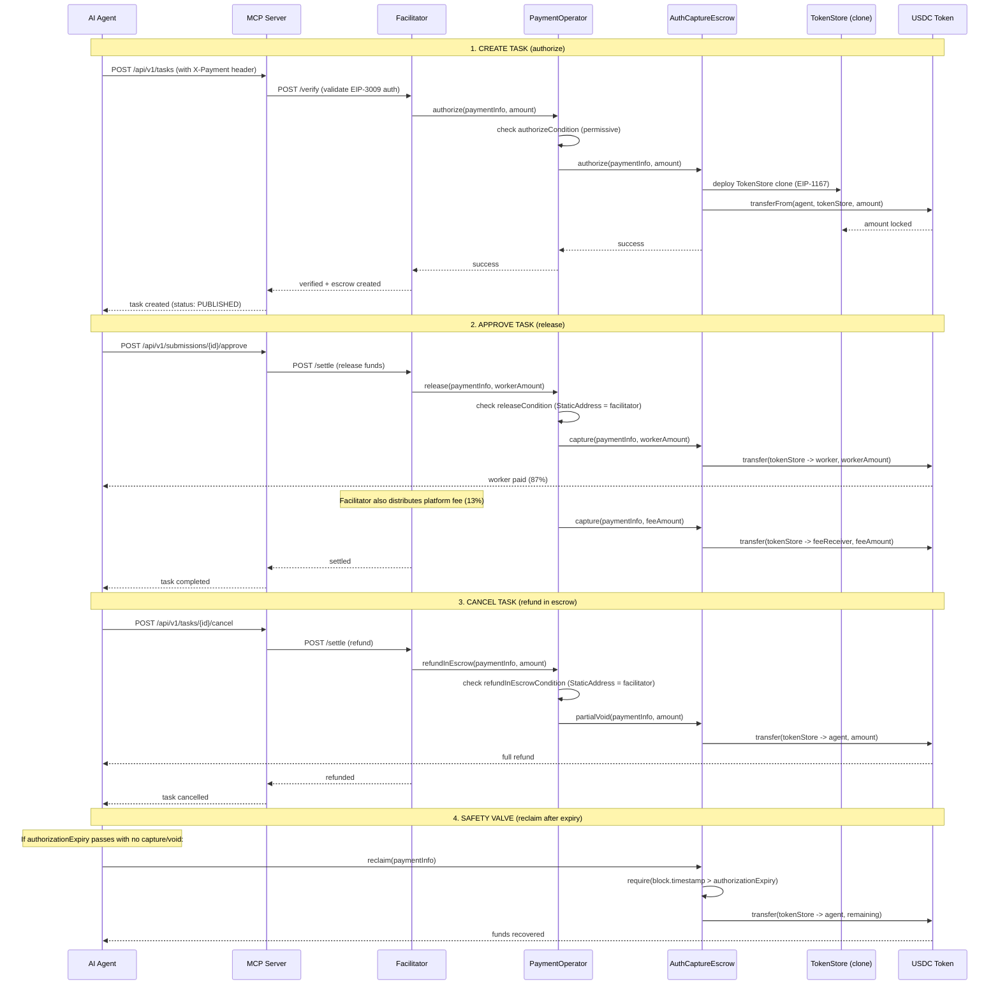

# x402r Escrow System Reference

Comprehensive reference for the x402r escrow protocol, based on research of three upstream repositories: [x402r-contracts](https://github.com/BackTrackCo/x402r-contracts), [x402r-sdk](https://github.com/BackTrackCo/x402r-sdk), and [BackTrackCo/docs](https://github.com/BackTrackCo/docs) (docs.x402r.org).

---

## What is x402r

x402r extends the [x402 payment protocol](https://www.x402.org/) with **escrow capabilities**. Where base x402 performs immediate one-shot payments (authorize + settle atomically), x402r introduces a time-separated authorize/capture model where funds can be locked, released, or refunded based on configurable conditions.

The core contracts originate from Coinbase's [commerce-payments](https://github.com/coinbase/commerce-payments) protocol. x402r builds on top of this foundation with a pluggable condition system, factory-deployed operators, and a facilitator layer that makes all on-chain operations gasless for end users.

Key properties:

- **Authorize/Capture split**: Funds are locked at task creation, released or refunded later. No funds move until explicit capture.
- **Pluggable access control**: Each escrow action (authorize, release, refund) has its own condition contract. No hardcoded roles.
- **Gasless for users**: The Facilitator (Layer 3) pays all gas. Agents and workers never need native tokens.
- **Safety valve**: If no one captures, the payer can always reclaim after `authorizationExpiry`. Funds cannot be permanently locked.
- **Multichain**: Deployed on 10 networks with identical interfaces via CREATE2 deterministic addressing.

---

## Architecture (3 Layers)

```
Layer 3: Facilitator (off-chain server, pays gas, enforces business logic)
         ────────────────────────────────────────────────────────────
Layer 2: PaymentOperator (per-config contract, manages conditions/fees)
         ────────────────────────────────────────────────────────────
Layer 1: AuthCaptureEscrow (shared singleton, holds funds in TokenStore clones)
         ────────────────────────────────────────────────────────────
Layer 0: ERC-20 Tokens (USDC, EURC, USDT, PYUSD, AUSD)
```

### Layer 0 -- ERC-20 Tokens

Standard stablecoins with EIP-3009 `transferWithAuthorization` support. The escrow uses `transferFrom` (ERC-20 approve pattern), but the Facilitator layer uses EIP-3009 signatures for gasless fund collection.

### Layer 1 -- AuthCaptureEscrow

The shared singleton that actually holds funds. One instance per chain, NOT per operator or per merchant. Uses EIP-1167 minimal proxy clones (`TokenStore`) to isolate funds per payment. All state (authorized amounts, expiries) lives here.

### Layer 2 -- PaymentOperator

Per-configuration contracts deployed via a factory. Each operator encodes a specific set of conditions for who can authorize, release, refund, etc. Multiple merchants can share the same operator if they want the same conditions.

### Layer 3 -- Facilitator

Off-chain server operated by Ultravioleta DAO (`https://facilitator.ultravioletadao.xyz`). Holds an EOA that is whitelisted as the condition address in our operators. Pays gas for all transactions, making the entire flow gasless for agents and workers.

---

## Core Contracts

### AuthCaptureEscrow

The heart of the protocol. A shared singleton deployed once per chain.

**Key characteristics:**
- Holds funds in `TokenStore` clones (EIP-1167 minimal proxy pattern)
- Each payment gets its own isolated TokenStore, identified by a `paymentId` (hash of `PaymentInfo`)
- Access control via `onlySender(paymentInfo.operator)` -- only the operator contract specified in the PaymentInfo can call mutating functions
- The escrow itself has NO business logic. All conditions and fees are delegated to the operator.

**Functions:**

| Function | Who calls | What it does |
|----------|-----------|--------------|
| `authorize(paymentInfo, amount)` | Operator | Locks `amount` of tokens from payer into a TokenStore clone |
| `capture(paymentInfo, amount)` | Operator | Transfers `amount` from TokenStore to receiver |
| `void(paymentInfo)` | Operator | Returns ALL authorized (uncaptured) funds to payer |
| `partialVoid(paymentInfo, amount)` | Operator | Returns `amount` of authorized funds to payer |
| `reclaim(paymentInfo)` | **Payer directly** | Safety valve: after `authorizationExpiry`, payer reclaims all uncaptured funds. No operator needed. |
| `refund(paymentInfo, amount)` | Operator | Returns already-captured funds back to payer (post-escrow dispute resolution) |

**Access control detail:**
```solidity
modifier onlySender(address expected) {
    require(msg.sender == expected, "unauthorized");
    _;
}

// authorize, capture, void, partialVoid, refund:
function authorize(PaymentInfo calldata info, uint256 amount) external onlySender(info.operator) { ... }

// reclaim is special -- payer calls directly:
function reclaim(PaymentInfo calldata info) external onlySender(info.payer) {
    require(block.timestamp > info.authorizationExpiry, "not expired");
    ...
}
```

### PaymentInfo Struct

The canonical data structure that defines a payment. Its keccak256 hash is the `paymentId` used as the key for all escrow operations.

```solidity
struct PaymentInfo {
    address operator;           // PaymentOperator contract address
    address payer;              // Who pays (the AI agent)
    address receiver;           // Who receives (the human worker)
    address token;              // ERC-20 token address (e.g., USDC)
    uint120 maxAmount;          // Maximum authorizable amount (6 decimals for USDC)
    uint48  preApprovalExpiry;  // Deadline for operator to call authorize()
    uint48  authorizationExpiry;// Deadline for operator to call capture(); after this, payer can reclaim()
    uint48  refundExpiry;       // Deadline for post-capture refunds
    uint16  minFeeBps;          // Minimum fee in basis points (e.g., 100 = 1%)
    uint16  maxFeeBps;          // Maximum fee in basis points
    address feeReceiver;        // MUST be the PaymentOperator address itself
    uint256 salt;               // Unique identifier (nonce) to differentiate payments
}
```

**Important notes:**
- `feeReceiver` MUST equal `operator` address. The operator collects fees and distributes them via `distributeFees()`.
- `salt` must be unique per payment. In EM, we use `keccak256(taskId + type + timestamp)`.
- `maxAmount` uses the token's native decimals (6 for USDC). A $1.00 payment = `1000000`.
- The hash of this struct is the `paymentId`: `keccak256(abi.encode(paymentInfo))`.

### PaymentOperator

Deployed via `PaymentOperatorFactory` (CREATE2, deterministic addresses). Each operator is immutable after deployment -- its conditions are baked in at creation time.

**10 configurable slots:**

| Slot | When checked | Purpose |
|------|-------------|---------|
| `authorizeCondition` | Before `authorize()` | Who can lock funds |
| `authorizeRecorder` | After `authorize()` | Record timestamp, emit events |
| `chargeCondition` | Before `charge()` | Who can do instant payment (no escrow) |
| `chargeRecorder` | After `charge()` | Record charge event |
| `releaseCondition` | Before `release()` | Who can release funds to receiver |
| `releaseRecorder` | After `release()` | Record release event |
| `refundInEscrowCondition` | Before `refundInEscrow()` | Who can refund locked (uncaptured) funds |
| `refundInEscrowRecorder` | After `refundInEscrow()` | Record refund event |
| `refundPostEscrowCondition` | Before `refundPostEscrow()` | Who can refund already-captured funds (disputes) |
| `refundPostEscrowRecorder` | After `refundPostEscrow()` | Record dispute refund event |

**Convention:** `address(0)` in any slot means **permissive** -- the condition always passes (anyone can call), or the recorder is a no-op.

**Functions:**

| Function | Maps to Escrow | Description |
|----------|---------------|-------------|
| `authorize(paymentInfo, amount)` | `escrow.authorize()` | Lock funds (checks authorizeCondition) |
| `charge(paymentInfo, amount)` | `escrow.charge()` | Instant payment, no escrow (checks chargeCondition) |
| `release(paymentInfo, amount)` | `escrow.capture()` | Release locked funds to receiver (checks releaseCondition) |
| `refundInEscrow(paymentInfo, amount)` | `escrow.partialVoid()` | Refund locked funds to payer (checks refundInEscrowCondition) |
| `refundPostEscrow(paymentInfo, amount)` | `escrow.refund()` | Refund captured funds to payer (checks refundPostEscrowCondition) |
| `distributeFees(token, recipients, amounts)` | N/A | Distribute collected fees to recipients |

### PaymentOperatorFactory

Deploys PaymentOperator instances via CREATE2 for deterministic addressing.

```solidity
function deployOperator(OperatorConfig memory config) external returns (address operator);
```

- **Idempotent**: Same config always produces the same address. If already deployed, returns the existing address.
- **Permissionless**: Anyone can call the factory. No access control.
- **Constructor args**: Takes `escrow` address + `protocolFeeConfig` address (set at factory deployment).

### OperatorConfig (12 address fields)

```solidity
struct OperatorConfig {
    address feeRecipient;
    address feeCalculator;
    address authorizeCondition;
    address authorizeRecorder;
    address chargeCondition;
    address chargeRecorder;
    address releaseCondition;
    address releaseRecorder;
    address refundInEscrowCondition;
    address refundInEscrowRecorder;
    address refundPostEscrowCondition;
    address refundPostEscrowRecorder;
}
```

---

## Condition System (Pluggable Access Control)

x402r does NOT use role-based access control (no `onlyOwner`, no `AccessControl`). Instead, each action has a **condition contract** that is checked before execution. This makes the system composable and immutable per-operator.

### Available Conditions

| Contract | Logic | Use case |
|----------|-------|----------|
| `PayerCondition` | `caller == paymentInfo.payer` | Only the agent can authorize |
| `ReceiverCondition` | `caller == paymentInfo.receiver` | Only the worker can release |
| `AlwaysTrueCondition` | Always returns `true` | Anyone can call (permissive) |
| `StaticAddressCondition` | `caller == designatedAddress` | Only a specific address (e.g., facilitator EOA) can call. Address set at deploy time, immutable. |

### Combinators (via factories)

| Factory | Creates | Logic |
|---------|---------|-------|
| `AndConditionFactory` | `AndCondition(a, b)` | Both conditions must pass |
| `OrConditionFactory` | `OrCondition(a, b)` | Either condition must pass |
| `NotConditionFactory` | `NotCondition(a)` | Inverts a condition |

These compose arbitrarily. For example: `OR(ReceiverCondition, StaticAddressCondition(arbiter))` means "either the worker or the designated arbiter can call."

### Recorders

Recorders execute AFTER an action succeeds. They record state or enforce time-based logic.

| Contract | Purpose | Dual role |
|----------|---------|-----------|
| `EscrowPeriod` | Records authorization timestamp. When used as a condition, checks if a minimum period has elapsed. | Recorder on `authorize`, Condition on `release` (enforces escrow duration) |
| `Freeze` | Payer can freeze the payment, blocking release for a configurable duration. | Used as a condition on `release` to check if frozen |

---

## Deployed Addresses

### Base Mainnet (`eip155:8453`)

#### Protocol Contracts

| Contract | Address |
|----------|---------|
| AuthCaptureEscrow | `0xb9488351E48b23D798f24e8174514F28B741Eb4f` |
| TokenCollector (ERC-3009) | `0x48ADf6E37F9b31dC2AAD0462C5862B5422C736B8` |
| ProtocolFeeConfig | `0x59314674BAbb1a24Eb2704468a9cCdD50668a1C6` |
| UsdcTvlLimit | `0x67B63Af4bcdCD3E4263d9995aB04563fbC229944` |
| RefundRequest | `0x35fb2EFEfAc3Ee9f6E52A9AAE5C9655bC08dEc00` |
| ArbiterRegistry | `0xB68C023365EB08021E12f7f7f11a03282443863A` |

#### Factories

| Factory | Address |
|---------|---------|
| PaymentOperatorFactory | `0x3D0837fF8Ea36F417261577b9BA568400A840260` |
| EscrowPeriodFactory | `0x12EDefd4549c53497689067f165c0f101796Eb6D` |
| FreezeFactory | `0x785cC83DEa3d46D5509f3bf7496EAb26D42EE610` |
| StaticFeeCalculatorFactory | `0x9D4146EF898c8E60B3e865AE254ef438E7cEd2A0` |
| StaticAddressConditionFactory | `0x206D4DbB6E7b876e4B5EFAAD2a04e7d7813FB6ba` |
| OrConditionFactory | `0x1e52a74cE6b69F04a506eF815743E1052A1BD28F` |
| AndConditionFactory | `0x5b3e33791C1764cF7e2573Bf8116F1D361FD97Cd` |
| NotConditionFactory | `0xFa8C4Cb156053b867Ae7489220A29b5939E3Df70` |

#### Condition Singletons

| Condition | Address |
|-----------|---------|
| PayerCondition | `0x7254b68D1AaAbd118C8A8b15756b4654c10a16d2` |
| ReceiverCondition | `0x6926c05193c714ED4bA3867Ee93d6816Fdc14128` |
| AlwaysTrueCondition | `0xBAF68176FF94CAdD403EF7FbB776bbca548AC09D` |

### All Networks -- AuthCaptureEscrow Addresses

| Network | Chain ID | Escrow Address | Factory Address |
|---------|----------|----------------|-----------------|
| Base | 8453 | `0xb9488351E48b23D798f24e8174514F28B741Eb4f` | `0x3D0837fF8Ea36F417261577b9BA568400A840260` |
| Ethereum | 1 | `0xc1256Bb30bd0cdDa07D8C8Cf67a59105f2EA1b98` | `0xed02d3E5167BCc9582D851885A89b050AB816a56` |
| Polygon | 137 | `0x32d6AC59BCe8DFB3026F10BcaDB8D00AB218f5b6` | `0xb33D6502EdBbC47201cd1E53C49d703EC0a660b8` |
| Arbitrum | 42161 | `0x320a3c35F131E5D2Fb36af56345726B298936037` | `0x32d6AC59BCe8DFB3026F10BcaDB8D00AB218f5b6` |
| Celo | 42220 | `0x320a3c35F131E5D2Fb36af56345726B298936037` | `0x32d6AC59BCe8DFB3026F10BcaDB8D00AB218f5b6` |
| Monad | 143 | `0x320a3c35F131E5D2Fb36af56345726B298936037` | `0x32d6AC59BCe8DFB3026F10BcaDB8D00AB218f5b6` |
| Avalanche | 43114 | `0x320a3c35F131E5D2Fb36af56345726B298936037` | `0x32d6AC59BCe8DFB3026F10BcaDB8D00AB218f5b6` |
| Optimism | 10 | `0x320a3c35F131E5D2Fb36af56345726B298936037` | `0x32d6AC59BCe8DFB3026F10BcaDB8D00AB218f5b6` |
| Base Sepolia | 84532 | `0x29025c0E22D4ef52e931E8B3Fb74073C32E4e5f2` | `0x97d53e63A9CB97556c00BeFd325AF810c9b267B2` |
| Ethereum Sepolia | 11155111 | `0x320a3c35dC6Ae4FF3ac05bB56D67C6f7f7e2b3c1` | `0x32d6AC59BCe8DFB3026F10BcaDB8D00AB218f5b6` |

**Note:** Arbitrum, Celo, Monad, Avalanche, and Optimism share the same CREATE2-deployed escrow address (`0x320a3c35...`) and factory address (`0x32d6AC59...`).

---

## Supported Networks (10 total)

| Network | Type | Escrow |
|---------|------|--------|
| Base | Mainnet | Yes |
| Ethereum | Mainnet | Yes |
| Polygon | Mainnet | Yes |
| Arbitrum | Mainnet | Yes |
| Celo | Mainnet | Yes |
| Monad | Mainnet | Yes |
| Avalanche | Mainnet | Yes |
| Optimism | Mainnet | Yes |
| Base Sepolia | Testnet | Yes |
| Ethereum Sepolia | Testnet | Yes |

---

## SDK Packages

The x402r SDK is a TypeScript monorepo (pnpm workspaces) with five packages:

| Package | Purpose |
|---------|---------|
| `@x402r/core` | Types, ABIs, deploy utilities, condition builders, address registry |
| `@x402r/merchant` | Release, charge, refund handling (server-side, for payment receivers) |
| `@x402r/client` | Payer SDK (queries, refund requests, freeze/unfreeze) |
| `@x402r/arbiter` | Dispute resolution tools (arbiter registration, ruling) |
| `@x402r/helpers` | Server helpers for constructing payment requirement objects |

**Installation:** Not published to npm yet. Install from GitHub:

```bash
npm install github:BackTrackCo/x402r-sdk
# or
pnpm add github:BackTrackCo/x402r-sdk
```

---

## Deployment: `deployMarketplaceOperator()` Preset

The SDK provides a high-level function that deploys up to 6 contracts in a single call, suitable for marketplace use cases:

```typescript
import { deployMarketplaceOperator } from '@x402r/core';

const result = await deployMarketplaceOperator(walletClient, publicClient, 'eip155:8453', {
  feeRecipient: account.address,       // Who receives platform fees
  arbiter: '0x...',                     // Dispute resolver address
  escrowPeriodSeconds: 604800n,         // 7 days minimum escrow hold
  freezeDurationSeconds: 259200n,       // 3 days freeze window
  operatorFeeBps: 100n,                 // 1% platform fee
});
```

**What it deploys:**

1. `EscrowPeriod` (via `EscrowPeriodFactory`) -- records auth time, enforces minimum hold
2. `Freeze` (via `FreezeFactory`) -- allows payer to freeze release
3. `StaticAddressCondition` for arbiter (via `StaticAddressConditionFactory`)
4. `OrCondition` for refund (via `OrConditionFactory`) -- `OR(PayerCondition, ArbiterCondition)`
5. `StaticFeeCalculator` (via `StaticFeeCalculatorFactory`) -- fixed fee percentage
6. `PaymentOperator` (via `PaymentOperatorFactory`) -- wires everything together

The resulting operator config:

```
authorizeCondition    = address(0)           // anyone (facilitator calls on behalf of payer)
authorizeRecorder     = EscrowPeriod         // records authorization timestamp
chargeCondition       = address(0)           // anyone
chargeRecorder        = address(0)           // no-op
releaseCondition      = AND(EscrowPeriod, NOT(Freeze))  // period elapsed + not frozen
releaseRecorder       = address(0)           // no-op
refundInEscrowCondition   = OR(Payer, Arbiter)  // payer or arbiter can refund
refundInEscrowRecorder    = address(0)       // no-op
refundPostEscrowCondition = Arbiter          // only arbiter can refund captured funds
refundPostEscrowRecorder  = address(0)       // no-op
```

---

## Execution Market Custom Config

For Execution Market, we use a **simpler configuration** than the marketplace preset. The Facilitator is the sole authorized caller for release and refund operations, with no escrow period or freeze mechanism.

```
authorizeCondition        = address(0)                              // permissive
authorizeRecorder         = address(0)                              // no-op
chargeCondition           = address(0)                              // permissive
chargeRecorder            = address(0)                              // no-op
releaseCondition          = StaticAddressCondition(facilitator_eoa) // ONLY facilitator
releaseRecorder           = address(0)                              // no-op
refundInEscrowCondition   = StaticAddressCondition(facilitator_eoa) // ONLY facilitator
refundInEscrowRecorder    = address(0)                              // no-op
refundPostEscrowCondition = StaticAddressCondition(facilitator_eoa) // ONLY facilitator
refundPostEscrowRecorder  = address(0)                              // no-op
```

**Facilitator EOA:** `0x103040545AC5031A11E8C03dd11324C7333a13C7`

**Rationale:** Execution Market's business logic (task approval, cancellation, disputes) lives in the MCP server and Facilitator, not on-chain. By restricting all escrow actions to the Facilitator's EOA, we get:
- Gasless operations for agents and workers
- Centralized policy enforcement (platform fee calculation, reputation checks, evidence verification)
- Simpler contract deployment (no period/freeze contracts needed)

The tradeoff is trust in the Facilitator, mitigated by the `reclaim()` safety valve (see below).

---

## Escrow Lifecycle for EM (Fase 2)



### Lifecycle Summary

| Step | Trigger | Contract Call | Funds Move |
|------|---------|--------------|------------|
| **Authorize** | Task creation | `operator.authorize()` -> `escrow.authorize()` | Agent -> TokenStore (locked) |
| **Release** | Task approval | `operator.release()` -> `escrow.capture()` | TokenStore -> Worker (87%) + Fee receiver (13%) |
| **Refund (in escrow)** | Task cancellation | `operator.refundInEscrow()` -> `escrow.partialVoid()` | TokenStore -> Agent (full refund) |
| **Charge** | Instant payment | `operator.charge()` -> direct transfer | Agent -> Worker (no escrow) |
| **Refund (post escrow)** | Dispute resolution | `operator.refundPostEscrow()` -> `escrow.refund()` | Receiver -> Agent (reverse captured funds) |
| **Reclaim** | Expiry safety valve | `escrow.reclaim()` (payer direct) | TokenStore -> Agent (uncaptured remainder) |

---

## Safety Valve: `reclaim()`

If `authorizationExpiry` passes without the operator calling `capture()` (release) or `partialVoid()` (refund), the **payer can call `escrow.reclaim()` directly**, bypassing the operator entirely.

This is an on-chain guarantee that funds can NEVER be permanently locked in the escrow, regardless of:
- Facilitator downtime
- Operator bugs
- Business logic failures
- Dispute deadlocks

```solidity
// Anyone holding the payer's private key can call this after expiry
function reclaim(PaymentInfo calldata info) external onlySender(info.payer) {
    require(block.timestamp > info.authorizationExpiry, "authorization not expired");
    // Returns all uncaptured funds to payer
}
```

**For EM:** We set `authorizationExpiry` to match the task deadline + a buffer period (e.g., deadline + 7 days). This gives enough time for the approval flow while ensuring agents can always recover funds from abandoned tasks.

---

## Key Repos

| Repository | URL | Stack | License |
|------------|-----|-------|---------|
| x402r-contracts | https://github.com/BackTrackCo/x402r-contracts | Foundry (Solidity) | BUSL-1.1 |
| x402r-sdk | https://github.com/BackTrackCo/x402r-sdk | TypeScript monorepo (pnpm) | MIT |
| BackTrackCo/docs | https://github.com/BackTrackCo/docs | Mintlify (docs.x402r.org) | -- |

---

## References from EM Codebase

The following files in the Execution Market codebase reference x402r escrow addresses, configuration, or integration logic.

### Token Registry and Escrow Address Map (Single Source of Truth)

| File | Role |
|------|------|
| `mcp_server/integrations/x402/sdk_client.py` | **`NETWORK_CONFIG` dict** -- contains all escrow addresses, factory addresses, token addresses, and chain IDs for 15 networks. This is the single source of truth. Other files auto-derive from it. |

### Payment Dispatch and Integration

| File | Role |
|------|------|
| `mcp_server/integrations/x402/payment_dispatcher.py` | Routes payments to x402r escrow or EIP-3009 pre-auth based on `EM_PAYMENT_MODE`. Imports `advanced_escrow_integration`. |
| `mcp_server/integrations/x402/advanced_escrow_integration.py` | Full x402r escrow integration: authorize, release, refundInEscrow, charge, refundPostEscrow, distributeFees. Uses `uvd-x402-sdk` `advanced_escrow` module. |
| `mcp_server/integrations/x402/__init__.py` | Re-exports escrow functions: `create_em_escrow`, `refund_task_escrow`, `create_escrow_for_task`, `get_advanced_escrow`. |

### REST API Endpoints

| File | Role |
|------|------|
| `mcp_server/api/escrow.py` | REST endpoints under `/api/v1/escrow/` -- config, balance, release, refund. References legacy escrow address `0xC409e6...` in the config endpoint response. |
| `mcp_server/api/routes.py` | Task CRUD and submission approval. Calls `verify_x402_payment()` on create, `sdk.settle_task_payment()` on approve. |

### Blockchain Scripts

| File | Role |
|------|------|
| `scripts/probe-escrow.ts` | Diagnostic script to probe x402r escrow contract state. |
| `scripts/register_x402r_merchant.ts` | Registers EM as a merchant on the escrow system. |
| `scripts/register-and-deploy.ts` | Combined registration and operator deployment. |
| `scripts/test-refund.ts` | Tests escrow refund flow. References `0xC409e6...`. |
| `scripts/test-real-deposit.ts` | Tests real deposit into escrow. References `0xC409e6...`. |
| `scripts/check-deposit-state.ts` | Checks deposit state in escrow contract. |
| `scripts/debug-permissions.ts` | Debug escrow permission issues. |
| `scripts/check-arbiter.ts` | Checks arbiter registration in `ArbiterRegistry`. |
| `scripts/deploy-relay.ts` | Deploys deposit relay proxy. |
| `scripts/probe-relay.ts` | Probes relay contract state. |
| `scripts/register-relay-and-refund.ts` | Relay registration and refund operations. |

### Documentation

| File | Role |
|------|------|
| `docs-site/docs/contracts/x402r-escrow.md` | Public-facing x402r escrow documentation (docs site). |
| `docs-site/docs/contracts/addresses.md` | Contract address reference page. |
| `docs-site/docs/payments/networks.md` | Supported payment networks documentation. |
| `docs/ARCHITECTURE.md` | Architecture overview referencing escrow flow. |
| `docs/planning/ESCROW_GASLESS_ROADMAP.md` | Roadmap for gasless escrow (Fase 1/2 plan). |
| `docs/planning/IRC_DIAGNOSTIC_2026-02-10.md` | IRC session with facilitator team -- x402r integration details. |
| `docs/internal/facilitator-gasless-handoff.md` | Facilitator handoff document with escrow address cross-references. |

### Configuration and Schema

| File | Role |
|------|------|
| `.env.example` | Documents `ESCROW_ADDRESS` env var. |
| `CLAUDE.md` | Lists all escrow contract addresses per network. |
| `dashboard/src/pages/Developers.tsx` | Displays escrow address in the developer info page. |
| `supabase/migrations/002_escrow_and_payments.sql` | Database schema for `escrows` and `payments` tables. |
| `.claude/skills/add-network/SKILL.md` | Skill checklist for adding new chains -- includes escrow address step. |

### Legacy (Deprecated)

| File | Role |
|------|------|
| `_archive/contracts/ChambaEscrow.sol` | **DEPRECATED**. Original custom escrow contract, replaced by x402r. Archived, do not use. |

---

## Glossary

| Term | Definition |
|------|-----------|
| **AuthCaptureEscrow** | The shared singleton contract that holds funds. One per chain. |
| **TokenStore** | EIP-1167 minimal proxy clone used to isolate funds for a single payment. |
| **PaymentOperator** | Per-configuration contract deployed via factory. Enforces conditions and fees. |
| **PaymentInfo** | Struct defining a payment (payer, receiver, amount, expiries, etc.). Its hash is the paymentId. |
| **Condition** | Contract implementing `ICondition` -- checked before an action. Returns bool. |
| **Recorder** | Contract implementing `IRecorder` -- called after an action succeeds. Records state. |
| **Facilitator** | Off-chain server that pays gas and enforces business logic. Our EOA: `0x10304...`. |
| **reclaim()** | Safety valve function. Payer calls directly after authorizationExpiry. No operator needed. |
| **Fase 1** | Current EM payment mode: pre-auth (EIP-3009 only, no on-chain escrow). |
| **Fase 2** | Planned EM payment mode: full x402r on-chain escrow (authorize at creation, release at approval). |
| **CREATE2** | EVM opcode for deterministic contract deployment. Same bytecode + salt = same address on any chain. |
