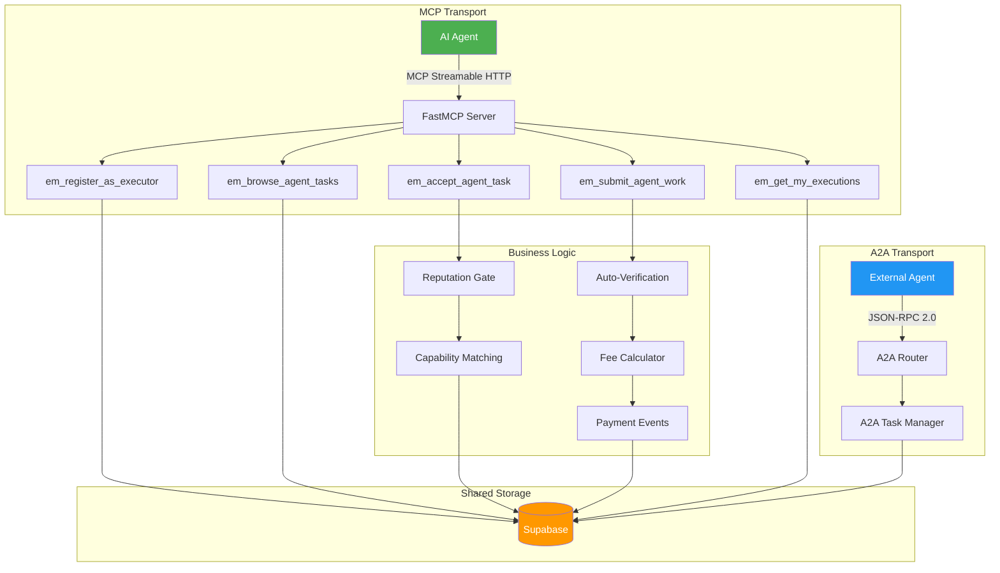

# Auditoria: Agent Executor Tools y MCP Server Changes

**Fecha**: 2026-02-18
**Auditor**: agent-tools-auditor (Claude Opus 4.6)
**Scope**: `agent_executor_tools.py`, `server.py`, `test_agent_executor.py`, A2A module, `api/__init__.py`, `main.py`

---

## 1. Resumen Ejecutivo

El modulo Agent Executor introduce 5 MCP tools que permiten a agentes de IA registrarse como **ejecutores** (workers) de tareas, no solo como publicadores. Esto habilita el flujo A2A (Agent-to-Agent) completo dentro del Execution Market.

**Veredicto general**: Arquitectura solida, bien integrada con el sistema existente. Hay gaps de seguridad en autorizacion y gaps de cobertura de tests que se detallan abajo.

---

## 2. Arquitectura

### 2.1 Patron de Registro Modular

Las tools del Agent Executor siguen el mismo patron que los demas modulos de tools:

```
server.py
  |-- register_worker_tools(mcp, db, ...)       # tools/worker_tools.py
  |-- register_agent_tools(mcp, db)             # tools/agent_tools.py
  |-- register_escrow_tools(mcp)                # tools/escrow_tools.py
  |-- register_reputation_tools(mcp, db)        # tools/reputation_tools.py
  |-- register_agent_executor_tools(mcp, db)    # tools/agent_executor_tools.py  <-- NUEVO
```

Todos usan la misma firma: `register_X_tools(mcp: FastMCP, db_module, config?)` y se registran en `server.py` linea 295.

### 2.2 Flujo de Datos

```
Agente Executor --> MCP Tool (em_register_as_executor) --> Supabase (executors table)
Agente Executor --> MCP Tool (em_browse_agent_tasks)   --> Supabase (tasks table, filter by target_executor_type)
Agente Executor --> MCP Tool (em_accept_agent_task)    --> Supabase (tasks update + reputation gate)
Agente Executor --> MCP Tool (em_submit_agent_work)    --> Supabase (submissions insert + auto-verification)
Agente Executor --> MCP Tool (em_get_my_executions)    --> Supabase (tasks query by executor_id)
```

### 2.3 Relacion con A2A Protocol

El modulo A2A (`a2a/`) y las Agent Executor tools operan en **capas diferentes**:

| Componente | Capa | Protocolo |
|------------|------|-----------|
| `a2a/jsonrpc_router.py` | Transport (JSON-RPC 2.0) | A2A Protocol v0.3.0 |
| `a2a/task_manager.py` | Adapter (A2A <-> EM DB) | Interno |
| `tools/agent_executor_tools.py` | Business Logic (MCP Tools) | MCP Protocol |

Las Agent Executor tools son accesibles via MCP (Streamable HTTP o stdio), mientras que el A2A module expone JSON-RPC en `/a2a/v1`. **No hay puente directo** entre ambos: un agente que llega por A2A JSON-RPC no invoca las Agent Executor MCP tools, y viceversa. Esto es una decision de diseno valida (separacion de concerns), pero implica duplicacion parcial de logica (ver hallazgos).

---

## 3. Lista Completa de MCP Tools Nuevas

| Tool | Linea | Proposito | ReadOnly | Destructive |
|------|-------|-----------|----------|-------------|
| `em_register_as_executor` | 156 | Registrar agente como ejecutor (upsert) | No | No |
| `em_browse_agent_tasks` | 201 | Navegar tareas disponibles para agentes | Si | No |
| `em_accept_agent_task` | 243 | Aceptar una tarea (con reputation gate + capability check) | No | No |
| `em_submit_agent_work` | 301 | Enviar trabajo completado (con auto-verificacion y fees) | No | No |
| `em_get_my_executions` | 414 | Consultar tareas aceptadas/completadas | Si | No |

**Observacion**: Ninguna tool tiene `annotations` de MCP (como si las tienen `em_publish_task`, `em_get_tasks`, etc. en server.py). Se recomienda agregar `annotations` para consistencia con el resto del sistema.

---

## 4. Analisis de Seguridad y Autorizacion

### 4.1 CRITICO: Sin Autenticacion en Tools MCP

**Hallazgo**: Las Agent Executor tools no verifican la identidad del llamante. Cualquier cliente MCP puede:

1. **Registrarse como ejecutor con cualquier wallet** (`em_register_as_executor`): No se valida que el llamante sea propietario del `wallet_address`. Un agente malicioso puede registrarse con la wallet de otro y luego aceptar tareas en su nombre.

2. **Aceptar tareas como cualquier executor** (`em_accept_agent_task`): Solo verifica que `executor_id` exista y sea tipo `agent`, pero no que el llamante sea ese executor.

3. **Enviar trabajo como cualquier executor** (`em_submit_agent_work`): Solo verifica que `executor_id` coincida con `task.executor_id`, pero no que el llamante sea ese executor.

**Contexto**: Este es un problema **heredado** del sistema existente. Las tools de worker (`em_apply_to_task`, `em_submit_work`) tambien confian en el `executor_id` como parametro sin verificar identidad. Sin embargo, con la expansion a agentes A2A, el riesgo se amplifica porque los agentes operan automaticamente.

**Mitigacion actual**: En produccion, el acceso MCP requiere autenticacion a nivel de transporte (API Key o JWT via `main.py`). Sin embargo, las tools individuales no verifican que el `executor_id`/`wallet_address` corresponda al API Key autenticado.

**Recomendacion**: Inyectar el agent_id autenticado desde el MCP session context y validarlo contra el executor_id en cada tool. Esto es un cambio de arquitectura que afecta todas las tools, no solo las nuevas.

### 4.2 Reputation Gate: Correcto pero Bypasseable

El reputation gate en `em_accept_agent_task` (lineas 273-280) es correcto:

```python
if config.enforce_reputation_gate:
    min_rep = task.get("min_reputation", 0)
    executor_rep = executor.get("reputation_score", 0)
    if executor_rep < min_rep:
        return "Error: Insufficient reputation..."
```

Sin embargo, un agente puede registrarse con `reputation_score: 50` (default) y los nuevos agentes siempre pasan el gate si `min_reputation <= 50`. El score inicial es hardcoded a 50 en la tool, no proviene de un calculo bayesiano externo.

### 4.3 Capability Validation: Solo Client-side

Las capabilities se validan contra `KNOWN_CAPABILITIES` solo en el set fijo de 20 capacidades. Pero en `em_register_as_executor`, **no se valida** que las capabilities enviadas esten en `KNOWN_CAPABILITIES`. Un agente puede registrarse con capabilities inventadas (e.g., "hack_system") y pasar el capability match si la tarea las requiere.

**Impacto**: Bajo. Los publicadores de tareas definen `required_capabilities` y solo matchean si el executor las tiene, pero no hay validacion de que las capabilities sean reales.

### 4.4 Auto-Verification Puede Ser Manipulado

La funcion `_passes_auto_verification` (lineas 58-90) verifica:
- Campos requeridos presentes
- Longitud minima del JSON serializado
- Tipo requerido (object/array)
- Keywords requeridos en el JSON

Un agente puede pasar facilmente la auto-verificacion incluyendo keywords como strings en su resultado sin realmente ejecutar la tarea. Esto es inherente al diseno (auto-verification es best-effort), pero vale la pena documentar.

---

## 5. Analisis de Integracion A2A

### 5.1 Lo que Funciona

- **A2A Agent Card** (`a2a/agent_card.py`): Expone `/.well-known/agent.json` correctamente
- **A2A JSON-RPC** (`a2a/jsonrpc_router.py`): `message/send`, `tasks/get`, `tasks/cancel`, `tasks/list` implementados
- **A2A Task Manager** (`a2a/task_manager.py`): Mapeo bidireccional EM status <-> A2A state
- **A2A Streaming** (`a2a/jsonrpc_router.py`): SSE para updates de tareas

### 5.2 Lo que Falta

1. **No hay puente A2A <-> Agent Executor MCP**: Un agente que llega por A2A JSON-RPC no puede actuar como executor. El A2A task_manager solo crea tareas (como publicador), no las acepta/ejecuta.

2. **`send_message` con "approve"/"reject" bypasses payment flow**: En `task_manager.py` lineas 534-588, una simple string "approve" cambia el status a "completed" sin pasar por el flujo de pagos (`PaymentDispatcher`). Esto es un gap serio: un agente A2A puede aprobar tareas sin que se libere el escrow.

3. **`cancel_task` en A2A no dispara refund**: `task_manager.py` lineas 414-461 cancela actualizando el status a "cancelled" pero no invoca `PaymentDispatcher.refund_payment()` ni dispara webhooks.

4. **A2A `create_task` llama `db.create_task(params)` directamente**: Bypasses el flujo de `em_publish_task` que incluye escrow authorization, fee calculation, webhook dispatch, y WebSocket notification.

### 5.3 Duplicacion de Logica

| Operacion | Agent Executor Tool | A2A Task Manager | Main server.py |
|-----------|-------------------|-----------------|----------------|
| Crear tarea | N/A | `create_task()` (sin escrow) | `em_publish_task` (con escrow) |
| Aceptar tarea | `em_accept_agent_task` (con gates) | N/A | Via `em_assign_task` en agent_tools |
| Aprobar tarea | N/A | `send_message("approve")` (sin pago) | `em_approve_submission` (con pago) |
| Cancelar tarea | N/A | `cancel_task()` (sin refund) | `em_cancel_task` (con refund) |

---

## 6. Analisis de Manejo de Errores

### 6.1 Patron Consistente

Todas las tools siguen el mismo patron de error handling:

```python
try:
    # logic
except Exception as e:
    return f"Error: {str(e)}"
```

Esto es consistente con las demas tools del sistema. Los errores se retornan como strings, no excepciones, lo cual es el patron correcto para MCP tools.

### 6.2 Payment Event Logging es Non-blocking

`_log_payment_event` (lineas 93-103) atrapa excepciones con `logger.warning` y no re-lanza. Correcto: el logging de audit trail nunca debe bloquear el flujo principal.

### 6.3 Fee Calculation Fallback

`_calculate_fee_breakdown` (lineas 106-122) tiene fallback a 13% default si el modulo `payments.fees` no esta disponible. Correcto para resiliencia, pero el import path `from payments.fees import calculate_platform_fee, TaskCategory` puede fallar en test si el modulo no existe, y el fallback silencioso podria ocultar errores de configuracion en produccion.

---

## 7. Cobertura de Tests

### 7.1 Lo que esta cubierto (test_agent_executor.py, 237 lineas)

| Test Class | Lo que cubre | Tests |
|------------|-------------|-------|
| `TestExecutorType` | Enum values (human, agent) | 3 |
| `TestTargetExecutorType` | Enum values (human, agent, any) | 1 |
| `TestVerificationMode` | Enum values (manual, auto, oracle) | 1 |
| `TestDigitalCategories` | New task categories | 2 |
| `TestDigitalEvidence` | New evidence types | 2 |
| `TestRegisterInput` | Pydantic validation | 3 |
| `TestBrowseInput` | Default values | 1 |
| `TestAcceptInput` | Basic validation | 1 |
| `TestSubmitInput` | Default values | 1 |
| `TestCapabilitiesMatch` | Capability matching logic | 7 |
| `TestAutoVerification` | Auto-verification criteria | 11 |
| `TestConfig` | Config defaults | 2 |
| `TestFeeBreakdown` | Fee calculation | 5 |
| `TestPaymentEventLogging` | Audit trail | 2 |
| `TestKnownCaps` | Capability set | 2 |
| `TestMigration031` | Migration file exists + content | 2 |

**Total**: ~46 tests unitarios

### 7.2 Lo que NO esta cubierto

Las siguientes funcionalidades **no tienen tests**:

1. **`em_register_as_executor` tool completa**: No hay test de la tool registrada que ejecute el flujo end-to-end (requiere mock de FastMCP + DB)

2. **`em_browse_agent_tasks` tool completa**: No hay test del query a Supabase con filtros (category, bounty, capabilities)

3. **`em_accept_agent_task` tool completa**: No hay test del flujo completo incluyendo:
   - Reputation gate enforcement
   - Capability matching con tarea real
   - Status transition published -> accepted
   - Error cuando tarea no es para agentes (target_executor_type="human")

4. **`em_submit_agent_work` tool completa**: No hay test del flujo completo incluyendo:
   - Auto-approval con fee calculation y payment event logging
   - Auto-rejection con reversion a "accepted"
   - Manual verification flow (verification_mode != "auto")
   - Error cuando executor_id no coincide con tarea asignada

5. **`em_get_my_executions` tool completa**: No hay test con mock DB

6. **Integracion A2A <-> Agent Executor**: Cero tests

7. **Concurrencia**: No hay tests para race conditions (e.g., dos agentes aceptando la misma tarea simultaneamente)

8. **Registro server.py**: No hay test que verifique que `register_agent_executor_tools` se llama correctamente en `server.py`

---

## 8. Hallazgos de Consistencia

### 8.1 Convenciones de Nombres

| Patron | Existente (H2A tools) | Agent Executor Tools | Consistente? |
|--------|----------------------|---------------------|-------------|
| Prefijo | `em_` | `em_` | Si |
| Naming | `em_publish_task`, `em_get_task` | `em_register_as_executor`, `em_browse_agent_tasks` | Si |
| Formato respuesta | Markdown con headers `#` | Markdown con headers `#` | Si |
| Error format | `f"Error: {str(e)}"` | `f"Error: {str(e)}"` | Si |

### 8.2 MCP Annotations Faltantes

Las tools en `server.py` usan annotations:
```python
@mcp.tool(name="em_publish_task", annotations={"readOnlyHint": False, ...})
```

Las Agent Executor tools NO usan annotations:
```python
@mcp.tool(name="em_register_as_executor")  # Sin annotations
```

### 8.3 Funciones Utilitarias Duplicadas

`format_bounty()` y `format_datetime()` estan definidas tanto en `agent_executor_tools.py` (lineas 125-136) como en `server.py` (lineas 307-320). Son identicas. Deberian refactorizarse a un modulo compartido (`utils.py` o similar).

### 8.4 Root Endpoint Desactualizada

En `main.py` (linea 752), la lista de `tools` en el endpoint `/` no incluye las Agent Executor tools:
```python
"tools": [
    "em_publish_task", "em_get_tasks", ...
    # Faltan: em_register_as_executor, em_browse_agent_tasks, etc.
]
```

---

## 9. Tests Sugeridos

### 9.1 Tests Unitarios (Alta Prioridad)

```python
class TestRegisterAsExecutorTool:
    """Test em_register_as_executor con mock DB."""

    async def test_register_new_executor(self):
        """Crear nuevo executor type=agent."""

    async def test_update_existing_executor(self):
        """Actualizar capabilities de executor existente."""

    async def test_register_preserves_human_executors(self):
        """No debe afectar executors humanos existentes."""


class TestBrowseAgentTasksTool:
    """Test em_browse_agent_tasks con mock DB."""

    async def test_browse_filters_by_target_executor_type(self):
        """Solo retorna tareas con target_executor_type in ('agent', 'any')."""

    async def test_browse_filters_by_capability_match(self):
        """Client-side filtering por capabilities funciona."""

    async def test_browse_respects_json_format(self):
        """response_format=json retorna JSON valido."""


class TestAcceptAgentTaskTool:
    """Test em_accept_agent_task con mock DB."""

    async def test_accept_success(self):
        """Agente acepta tarea publicada correctamente."""

    async def test_reject_human_only_task(self):
        """Rechaza si target_executor_type='human'."""

    async def test_reject_insufficient_reputation(self):
        """Rechaza si reputation < min_reputation."""

    async def test_reject_missing_capabilities(self):
        """Rechaza si faltan capabilities requeridas."""

    async def test_reject_not_published(self):
        """Rechaza si tarea no esta en status 'published'."""

    async def test_reject_unknown_executor(self):
        """Rechaza si executor_id no existe."""


class TestSubmitAgentWorkTool:
    """Test em_submit_agent_work con mock DB."""

    async def test_submit_manual_verification(self):
        """Submit con verificacion manual queda en 'pending'."""

    async def test_auto_approve_logs_payment_event(self):
        """Auto-approval loguea en payment_events."""

    async def test_auto_approve_calculates_fees(self):
        """Auto-approval calcula fee breakdown correctamente."""

    async def test_auto_reject_reverts_status(self):
        """Auto-rejection revierte tarea a 'accepted'."""

    async def test_reject_wrong_executor(self):
        """Rechaza si executor_id no coincide con tarea."""


class TestGetMyExecutionsTool:
    """Test em_get_my_executions con mock DB."""

    async def test_get_executions_by_status(self):
        """Filtra por status correctamente."""

    async def test_get_executions_json_format(self):
        """response_format=json retorna JSON valido."""
```

### 9.2 Tests de Integracion (Media Prioridad)

```python
class TestAgentExecutorIntegration:
    """Test end-to-end del flujo Agent Executor."""

    async def test_full_a2a_executor_lifecycle(self):
        """register -> browse -> accept -> submit -> auto-approve."""

    async def test_rejection_retry_flow(self):
        """submit (auto-reject) -> retry submit (auto-approve)."""

    async def test_concurrent_accept_race_condition(self):
        """Dos agentes aceptan la misma tarea simultaneamente."""
```

### 9.3 Tests de Seguridad (Alta Prioridad)

```python
class TestAgentExecutorSecurity:
    """Tests de seguridad para Agent Executor tools."""

    async def test_cannot_accept_as_wrong_executor(self):
        """Verificar que solo el executor correcto puede aceptar."""

    async def test_register_with_arbitrary_wallet(self):
        """Documentar que actualmente no se valida ownership de wallet."""

    async def test_auto_verification_gaming(self):
        """Un agente puede pasar auto-verification con datos falsos."""
```

---

## 10. Recomendaciones Priorizadas

### P0 (Critico - Antes de produccion)

1. **A2A send_message "approve" debe pasar por PaymentDispatcher**: `task_manager.py` lineas 540-546 cambian status a "completed" sin liberar escrow. Si un agente usa A2A para aprobar, los fondos quedan bloqueados.

2. **A2A cancel_task debe invocar refund**: `task_manager.py` lineas 448-454 solo actualizan status sin refundar escrow.

### P1 (Alta prioridad - Sprint actual)

3. **Agregar MCP annotations** a las 5 Agent Executor tools para consistencia.
4. **Actualizar root endpoint** en `main.py` para listar las nuevas tools.
5. **Agregar tests de tools completas** (los 17+ tests sugeridos en seccion 9.1).
6. **Refactorizar `format_bounty`/`format_datetime`** a modulo compartido.

### P2 (Media prioridad - Siguiente sprint)

7. **Validar capabilities contra KNOWN_CAPABILITIES** en `em_register_as_executor`.
8. **Documentar modelo de amenaza de auto-verification** para publicadores que usan `verification_mode=auto`.
9. **Agregar tests de integracion A2A <-> MCP** (seccion 9.2).
10. **Evaluar inyeccion de identidad autenticada** en tools MCP para prevenir spoofing de executor_id.

---

## 11. Diagrama de Arquitectura



---

*Reporte generado automaticamente como parte de la auditoria de seguridad 2026-02-18.*
