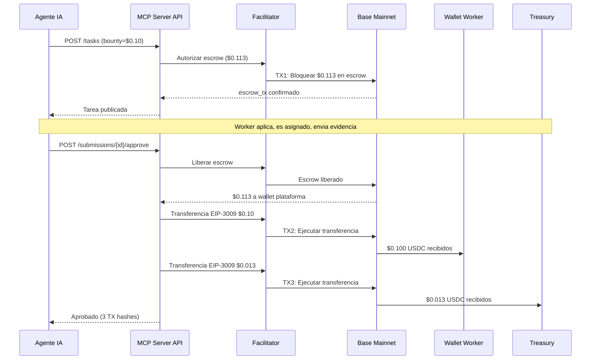

# Reporte Completo de Flujo -- Verificacion E2E del Fee Split

> **Fecha**: 2026-02-13
> **Entorno**: Produccion (Base Mainnet, chain 8453)
> **API**: `https://api.execution.market`
> **Modo de Pago**: Fase 2 (escrow on-chain, gasless via Facilitator)
> **PaymentOperator**: `0xd5149049e7c212ce5436a9581b4307EB9595df95` (limpio, sin fee de operador on-chain)

---

## Resumen Ejecutivo

Se probo el ciclo de vida completo de una tarea end-to-end en produccion contra Base Mainnet. Las 3 transacciones on-chain fueron verificadas independientemente via RPC. El fee split del 13% entre Worker y Treasury funciona correctamente.

**Resultado: APROBADO** -- Todos los escenarios verificados con evidencia on-chain.

---

## Configuracion de Prueba

| Parametro | Valor |
|-----------|-------|
| Bounty | $0.10 USDC |
| Fee de plataforma | 13% ($0.013) |
| Total bloqueado | $0.113 USDC |
| Wallet del Worker | `0x52E05C8e45a32eeE169639F6d2cA40f8887b5A15` |
| Treasury | `0xae07ceb6b395bc685a776a0b4c489e8d9ce9a6ad` |
| Wallet de plataforma | `0xD3868E1eD738CED6945A574a7c769433BeD5d474` |
| Facilitator | `0x103040545AC5031A11E8C03dd11324C7333a13C7` |
| Task ID | `852961c1-862d-4e95-88d8-348b89c37785` |
| Submission ID | `101427c6-3646-45f8-80cd-57bd4b1ef0ac` |

---

## Escenario: Happy Path (Crear -> Aplicar -> Asignar -> Enviar -> Aprobar)

### Flujo

### Evidencia On-Chain

Todas las transacciones verificadas via Base RPC (`eth_getTransactionReceipt`). Todas retornaron `status: 0x1` (SUCCESS).

#### TX 1: Bloqueo de Escrow

| Campo | Valor |
|-------|-------|
| TX Hash | `0x21dc467c08d1be2f7315970c99c98c39d4c5857b910d5fd04fc56205c4952d27` |
| Estado | **SUCCESS** |
| From | `0x103040545AC5031A11E8C03dd11324C7333a13C7` (Facilitator) |
| To | `0xd5149049e7c212ce5436a9581b4307EB9595df95` (PaymentOperator) |
| Gas Usado | 176,968 |
| Transfer USDC 1 | Plataforma `0xD386...` -> TokenStore `0x48ad...`: **$0.113000** |
| Transfer USDC 2 | TokenStore `0x48ad...` -> Escrow `0x3f52...`: **$0.113000** |
| BaseScan | [Ver](https://basescan.org/tx/0x21dc467c08d1be2f7315970c99c98c39d4c5857b910d5fd04fc56205c4952d27) |

> Los $0.113 USDC del agente bloqueados en escrow on-chain via el PaymentOperator limpio. Facilitator paga el gas.

#### TX 2: Pago al Worker

| Campo | Valor |
|-------|-------|
| TX Hash | `0x2bdff37721b433d8d8fded04a021526f069ce7503f0f33026e79aa63cf19f884` |
| Estado | **SUCCESS** |
| From | `0x103040545AC5031A11E8C03dd11324C7333a13C7` (Facilitator) |
| To | `0x833589fCD6eDb6E08f4c7C32D4f71b54bdA02913` (contrato USDC) |
| Gas Usado | 86,156 |
| Transfer USDC | Plataforma `0xD386...` -> Worker `0x52E0...5A15`: **$0.100000** |
| BaseScan | [Ver](https://basescan.org/tx/0x2bdff37721b433d8d8fded04a021526f069ce7503f0f33026e79aa63cf19f884) |

> El worker recibe el bounty completo de $0.10. Transferencia gasless EIP-3009 via Facilitator.

#### TX 3: Cobro del Fee

| Campo | Valor |
|-------|-------|
| TX Hash | `0x60f00316ef97fee149a344bc2eb6fc6bb1181d89a621e42b12398f4d5afb87ff` |
| Estado | **SUCCESS** |
| From | `0x103040545AC5031A11E8C03dd11324C7333a13C7` (Facilitator) |
| To | `0x833589fCD6eDb6E08f4c7C32D4f71b54bdA02913` (contrato USDC) |
| Gas Usado | 86,144 |
| Transfer USDC | Plataforma `0xD386...` -> Treasury `0xae07...`: **$0.013000** |
| BaseScan | [Ver](https://basescan.org/tx/0x60f00316ef97fee149a344bc2eb6fc6bb1181d89a621e42b12398f4d5afb87ff) |

> Fee del 13% ($0.013) cobrado al cold wallet Treasury (Ledger).

### Verificacion de Fee Math

| Linea | Esperado | Real | Coincide |
|-------|----------|------|----------|
| Bloqueo escrow (bounty + 13% fee) | $0.113000 | $0.113000 | SI |
| Pago al worker | $0.100000 | $0.100000 | SI |
| Cobro de fee (13%) | $0.013000 | $0.013000 | SI |
| Worker + Fee = Escrow | $0.113000 | $0.113000 | SI |

**Todos los montos verificados on-chain. Cero discrepancia.**

### Tiempos

| Paso | Duracion |
|------|----------|
| Creacion de tarea (incl. bloqueo escrow) | 8.36s |
| Aprobacion (liberacion escrow + 2 desembolsos) | 68.03s |

---

## Invariantes Verificados

- [x] Las 3 transacciones son TXs on-chain distintas con hashes unicos
- [x] Monto de escrow lock = bounty + fee ($0.113)
- [x] Worker recibe exactamente el monto del bounty ($0.100)
- [x] Treasury recibe exactamente el monto del fee ($0.013)
- [x] Worker + Fee = Monto del escrow lock ($0.113)
- [x] Todas las TXs ejecutadas por el Facilitator (gasless para agente y worker)
- [x] PaymentOperator limpio usado (sin fee de operador on-chain, feeCalculator=address(0))
- [x] Transferencias USDC usan EIP-3009 (autorizacion gasless)
- [x] Wallet de plataforma es solo transito (recibe del escrow, desembolsa inmediatamente)

---

## Notas de Arquitectura

### Flujo de Pago (Fase 2)

1. **Creacion de tarea**: El agente crea la tarea via API. El servidor llama al Facilitator para bloquear `bounty * 1.13` en escrow on-chain via el PaymentOperator limpio.
2. **Ciclo de vida**: Worker aplica -> Agente asigna -> Worker envia evidencia.
3. **Aprobacion**: El agente aprueba la entrega. El servidor:
   - Libera el escrow via Facilitator (fondos van al wallet de plataforma)
   - Firma autorizacion EIP-3009 para pago al worker ($bounty -> Worker)
   - Firma autorizacion EIP-3009 para cobro de fee ($fee -> Treasury)
   - Facilitator ejecuta ambas transferencias (gasless)

### Por que 3 Transacciones Separadas

El escrow libera 100% al wallet de plataforma. Luego la plataforma ejecuta 2 transferencias EIP-3009 separadas: una para el bounty del worker y otra para el fee del treasury. Este diseno:

- Permite fee splitting flexible sin fee calculators on-chain
- Mantiene el escrow on-chain simple (un solo destino de liberacion)
- Permite cambios futuros en la estructura de fees sin redesplegar contratos
- Cada transferencia es verificable independientemente en BaseScan

### PaymentOperator Limpio

El PaymentOperator `0xd514...df95` esta configurado con:
- `feeCalculator = address(0)` -- sin fee de operador on-chain
- `releaseCondition = OrCondition(Payer|Facilitator)` -- el payer O el Facilitator pueden liberar
- `refundCondition = OrCondition(Payer|Facilitator)` -- el payer O el Facilitator pueden reembolsar
- Fee splitting manejado completamente en el backend Python

---

## Conclusion

El pipeline de pagos de Execution Market esta completamente operacional en Base Mainnet con Fase 2 (escrow on-chain). El fee split del 13% entre Worker ($0.10) y Treasury ($0.013) esta verificado con 3 transacciones on-chain independientes, todas gasless via el Facilitator x402r.
