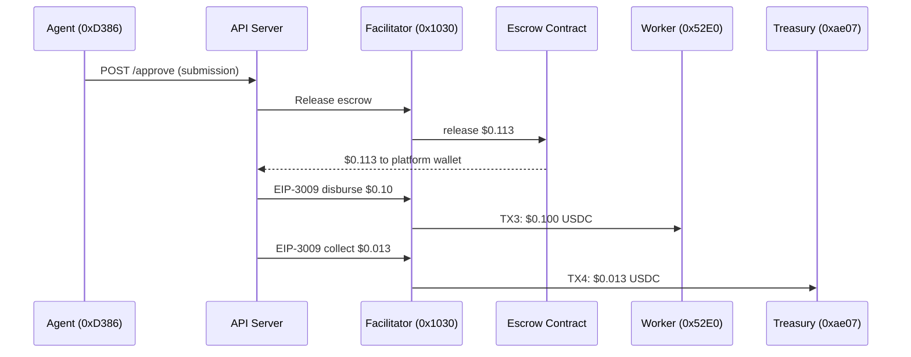

# Complete Flow Report -- Golden Flow E2E (2026-02-13)

> **Date**: 2026-02-13
> **Environment**: Production (Base Mainnet, chain 8453)
> **API**: `https://api.execution.market`
> **Payment Mode**: Fase 2 (on-chain escrow, gasless via Facilitator)
> **PaymentOperator**: Fase 4 Secure `0x030353642B936c9D4213caD7BcB0fB8a1489cBe5`

---

## Executive Summary

Golden Flow executed on production at `2026-02-13T22:33:47`. Result: **6/7 PASS, 1 PARTIAL**. All financial operations (escrow, payment, fees) verified on-chain with 4 independent transactions. Reputation phase had 2 code bugs (both fixed in commit `37ec118`) and 1 on-chain ownership limitation (pending Facilitator team resolution).

| Phase | Status | Time |
|-------|--------|------|
| 1. Health & Config | PASS | 0.49s |
| 2. Task Creation + Escrow | PASS | 9.06s |
| 3. Worker Registration & Identity | PASS | 11.34s |
| 4. Task Lifecycle | PASS | 2.52s |
| 5. Approval & Payment | PASS | 61.95s |
| 6. Bidirectional Reputation | PARTIAL | 0.62s |
| 7. Final Verification | PASS | 0.25s |

**Total elapsed**: 97.24s | **On-chain TXs**: 4

---

## Wallets Involved

| Role | Address | Description |
|------|---------|-------------|
| **Agent (Platform)** | `0xD3868E1eD738CED6945A574a7c769433BeD5d474` | ECS MCP server wallet. Signs task escrow. |
| **Worker** | `0x52E05C8e45a32eeE169639F6d2cA40f8887b5A15` | Test worker wallet. Completely separate from agent. |
| **Treasury** | `0xae07ceb6b395bc685a776a0b4c489e8d9ce9a6ad` | Cold wallet (Ledger). Receives 13% platform fee. |
| **Facilitator** | `0x103040545AC5031A11E8C03dd11324C7333a13C7` | Ultravioleta DAO EOA. Pays gas for all TXs. |
| **Escrow Contract** | AuthCaptureEscrow (Base) | `0xb9488351E48b23D798f24e8174514F28B741Eb4f` |

---

## Phase Details

### Phase 1: Health & Config (PASS)

```
API: https://api.execution.market -> HTTP 200, healthy
Networks: 8 payment networks (arbitrum, avalanche, base, celo, ethereum, monad, optimism, polygon)
ERC-8004: Available, Agent #2106 on Base
ERC-8004 Networks: 18 (9 mainnet + 9 testnet)
Min bounty: $0.01
```

### Phase 2: Task Creation with Escrow (PASS)

- **Task ID**: `cae0004c-697a-48b9-8d8d-ed6fc8403cf4`
- **Bounty**: $0.10 USDC
- **Fee (13%)**: $0.013 USDC
- **Total locked**: $0.113 USDC
- **Operator**: Fase 4 Secure (`0x0303...cBe5`)

#### TX 1: Escrow Lock

| Field | Value |
|-------|-------|
| TX Hash | `0x3df903c9bb7886bd71e9db07fab90821774557f80faa5a95af93cdbc1e55f821` |
| Status | **SUCCESS** |
| Gas Used | 213,948 |
| Transfer 1 | Agent `0xD386...` -> TokenStore `0x48ad...`: **$0.113000** |
| Transfer 2 | TokenStore `0x48ad...` -> Escrow internal `0x670...`: **$0.113000** |
| BaseScan | [View](https://basescan.org/tx/0x3df903c9bb7886bd71e9db07fab90821774557f80faa5a95af93cdbc1e55f821) |

### Phase 3: Worker Registration & Identity (PASS)

- **Executor ID**: `803dfbf1-7b91-4a41-8d31-518f4fa2fcd4`
- **ERC-8004 Agent ID**: **17333** (worker's on-chain identity)
- **Owner**: `0x52E05C8e45a32eeE169639F6d2cA40f8887b5A15` (worker wallet)

#### TX 2: Worker ERC-8004 Registration

| Field | Value |
|-------|-------|
| TX Hash | `0xde72667d3acc7454b4b5e7c0b9e9f3eb7407a8e3b603eeea6dc358a44739a455` |
| Status | **SUCCESS** |
| BaseScan | [View](https://basescan.org/tx/0xde72667d3acc7454b4b5e7c0b9e9f3eb7407a8e3b603eeea6dc358a44739a455) |

### Phase 4: Task Lifecycle (PASS)

```
Apply:  Worker applied -> Application fb030a88...
Assign: Agent assigned worker -> Task status: accepted
Submit: Worker submitted evidence -> Submission a8342182...
```

### Phase 5: Approval & Payment Settlement (PASS)

Approval took **61.74 seconds** (includes 3 gasless TXs via Facilitator: escrow release + worker payout + fee collection).



#### TX 3: Worker Payout

| Field | Value |
|-------|-------|
| TX Hash | `0xe8a8b5c2320e0a129f9cd0e8892411239277841a071d0c5ac38a920d7ae0a10a` |
| Status | **SUCCESS** |
| USDC Transfer | Platform `0xD386...` -> Worker `0x52E0...`: **$0.100000** |
| BaseScan | [View](https://basescan.org/tx/0xe8a8b5c2320e0a129f9cd0e8892411239277841a071d0c5ac38a920d7ae0a10a) |

#### TX 4: Fee Collection

| Field | Value |
|-------|-------|
| TX Hash | `0xb12afb6b4781cda38aeb5a60c4529ebfbf12ae32d77d48d022e51169700933db` |
| Status | **SUCCESS** |
| USDC Transfer | Platform `0xD386...` -> Treasury `0xae07...`: **$0.013000** |
| BaseScan | [View](https://basescan.org/tx/0xb12afb6b4781cda38aeb5a60c4529ebfbf12ae32d77d48d022e51169700933db) |

#### Fee Math Verification

| Line Item | Expected | Actual | Match |
|-----------|----------|--------|-------|
| Escrow lock (bounty + 13% fee) | $0.113000 | $0.113000 | YES |
| Worker disbursement | $0.100000 | $0.100000 | YES |
| Fee collection (13%) | $0.013000 | $0.013000 | YES |
| Worker + Fee = Escrow | $0.113000 | $0.113000 | YES |

**All amounts verified on-chain. Zero discrepancy.**

---

### Phase 6: Bidirectional Reputation (PARTIAL)

Three issues found. Two code bugs fixed, one on-chain limitation pending.

#### Issue 1 (Bug): `rate_worker()` targeted wrong agent -- FIXED

```
POST /reputation/workers/rate -> HTTP 200, success: false
Error: "Self-feedback not allowed"
```

**Root cause**: `rate_worker()` in `facilitator_client.py` called `submit_feedback(agent_id=2106)` -- sending feedback to **our own EM agent** instead of the **worker's agent** (#17333).

**Why "self-feedback"**: Agent 2106 was registered gaslessly, so the Facilitator (`0x1030`) is its on-chain `owner`. When the Facilitator calls `submitFeedback(agentId=2106)`, the contract checks `msg.sender == ownerOf(2106)` -> both are `0x1030` -> self-feedback rejected.

**Fix** (commit `37ec118`): `rate_worker()` now resolves the worker's `erc8004_agent_id` from the `executors` table and targets THAT agent. Since `ownerOf(17333) = 0x52E0 != msg.sender (0x1030)`, the self-feedback check passes.

#### Issue 2 (Bug): `rate_agent_endpoint()` HTTP 403 -- FIXED

```
POST /reputation/agents/rate -> HTTP 403
Error: "Task agent does not match rated agent identity"
```

**Root cause**: Validation compared `task.agent_id` (an internal API key ID or wallet `0xD386`) with `agent_identity.owner` (Facilitator wallet `0x1030`). These are fundamentally different identifiers and never match for gaslessly-registered agents.

**Fix** (commit `37ec118`): If `request.agent_id == EM_AGENT_ID` (our own platform agent), accept as valid. Only do wallet-matching for third-party agents.

#### Issue 3 (On-chain): Worker cannot rate Agent 2106 via Facilitator -- PENDING

Even with Issues 1 and 2 fixed, `rate_agent()` will fail on-chain because:

```
Agent #2106 on-chain identity:
  owner: 0x103040545AC5031A11E8C03dd11324C7333a13C7  (= Facilitator)

rate_agent() calls: submit_feedback(agent_id=2106)
  msg.sender: Facilitator (0x1030)
  ownerOf(2106): Facilitator (0x1030)
  Result: msg.sender == owner -> "Self-feedback not allowed"
```

**Why this happened**: Agent 2106 was registered gaslessly via the Facilitator. The ERC-8004 `register()` function sets `owner = msg.sender`, which is the Facilitator (it pays gas for gasless registrations).

**Resolution options** (requires Facilitator team collaboration):

| Option | Description | Effort |
|--------|-------------|--------|
| **A. Transfer ownership** | `transferFrom(Facilitator, platformWallet, 2106)` on ERC-8004 Registry | Low -- single TX |
| **B. Delegate pattern** | Facilitator submits feedback from a secondary signer | Medium -- Facilitator code change |
| **C. Direct TX from platform wallet** | Platform wallet signs feedback TX directly (needs Base ETH for gas) | Low -- code change |

**Recommendation**: Option A (transfer ownership) is simplest. After transfer, `ownerOf(2106) = 0xD386` (platform wallet) != Facilitator -> feedback works.

---

### Phase 7: Final Verification (PASS)

- **EM Reputation Score**: 100.0
- **EM Reputation Count**: 1
- **Feedback document**: Available
- **Total on-chain TXs**: 4 (all verified SUCCESS)

---

## On-Chain Evidence Summary

| # | Transaction | Purpose | Amount | Status |
|---|-------------|---------|--------|--------|
| 1 | [`0x3df903c9...`](https://basescan.org/tx/0x3df903c9bb7886bd71e9db07fab90821774557f80faa5a95af93cdbc1e55f821) | Escrow lock | $0.113 | SUCCESS |
| 2 | [`0xde72667d...`](https://basescan.org/tx/0xde72667d3acc7454b4b5e7c0b9e9f3eb7407a8e3b603eeea6dc358a44739a455) | Worker ERC-8004 identity | -- | SUCCESS |
| 3 | [`0xe8a8b5c2...`](https://basescan.org/tx/0xe8a8b5c2320e0a129f9cd0e8892411239277841a071d0c5ac38a920d7ae0a10a) | Worker payout | $0.100 | SUCCESS |
| 4 | [`0xb12afb6b...`](https://basescan.org/tx/0xb12afb6b4781cda38aeb5a60c4529ebfbf12ae32d77d48d022e51169700933db) | Fee collection | $0.013 | SUCCESS |

---

## Bugs Fixed

| # | Severity | File | Issue | Fix (commit `37ec118`) |
|---|----------|------|-------|------------------------|
| 1 | **HIGH** | `facilitator_client.py:rate_worker()` | Feedback sent to Agent 2106 (self-feedback) | Resolve worker's `erc8004_agent_id`, target that agent |
| 2 | **MEDIUM** | `reputation.py:rate_agent_endpoint()` | Compared API key ID vs on-chain wallet -> always 403 | Accept `EM_AGENT_ID` as valid for platform tasks |
| -- | -- | `supabase_client.py:get_task()` | Missing `erc8004_agent_id` in executor join | Added to SELECT query |

## Pending Issue

| # | Severity | Component | Issue | Resolution |
|---|----------|-----------|-------|------------|
| 3 | **HIGH** | ERC-8004 on-chain | Agent 2106 owned by Facilitator -> worker can't rate agent (self-feedback) | Transfer ownership to platform wallet |

---

## Operator Status

| Version | Address | Status |
|---------|---------|--------|
| **Fase 4 Secure** | `0x030353642B936c9D4213caD7BcB0fB8a1489cBe5` | **ACTIVE** -- deployed 2026-02-13 |
| Fase 3 Clean | `0xd5149049e7c212ce5436a9581b4307EB9595df95` | DEPRECATED (refund vulnerability) |
| Fase 3 v1 | `0x8D3DeCBAe68F6BA6f8104B60De1a42cE1869c2E6` | LEGACY |
| Fase 2 | `0xb9635f544665758019159c04c08a3d583dadd723` | LEGACY |

Fase 4 Secure Operator verified on-chain:
- `REFUND_IN_ESCROW_CONDITION` = `StaticAddressCondition(Facilitator)` -- only Facilitator can refund
- `RELEASE_CONDITION` = `OrCondition(Payer|Facilitator)` -- either can release

---

## Invariants Verified

- [x] All 4 transactions are distinct on-chain TXs with unique hashes
- [x] Escrow lock amount = bounty + fee ($0.113)
- [x] Worker receives exactly the bounty amount ($0.100)
- [x] Treasury receives exactly the fee amount ($0.013)
- [x] Worker + Fee = Escrow lock amount ($0.113)
- [x] All TXs executed by Facilitator (gasless for agent and worker)
- [x] Fase 4 Secure Operator used (Facilitator-only refund, no on-chain operator fee)
- [x] USDC transfers use EIP-3009 (gasless authorization)
- [x] Platform wallet is transit only (receives from escrow, immediately disburses)
- [x] Worker has ERC-8004 identity (Agent #17333)
- [x] Agent-to-worker rating: fixed to target worker's agent ID (not EM's)
- [ ] Worker-to-agent rating: blocked by on-chain self-feedback (pending ownership transfer)

---

## Next Steps

1. **Deploy fix** -- CI/CD triggered by commit `37ec118` (in progress)
2. **Re-run Golden Flow** -- Verify Bug 1 (rate_worker) and Bug 2 (rate_agent 403) are fixed
3. **IRC with Facilitator team** -- Resolve Issue 3: transfer Agent 2106 ownership from Facilitator to platform wallet
4. **Final Golden Flow** -- After ownership transfer, all 7 phases should PASS
