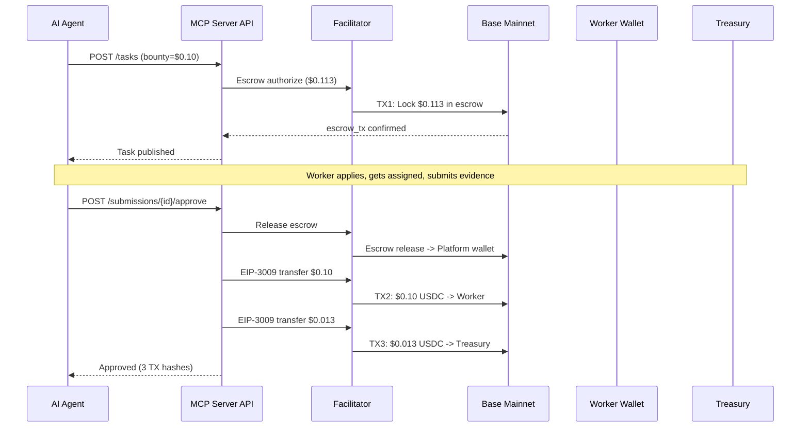

# Complete Flow Report -- E2E Fee Split Verification

> **Date**: 2026-02-13
> **Environment**: Production (Base Mainnet, chain 8453)
> **API**: `https://api.execution.market`
> **Payment Mode**: Fase 2 (on-chain escrow, gasless via Facilitator)
> **PaymentOperator**: `0xd5149049e7c212ce5436a9581b4307EB9595df95` (clean, no on-chain operator fee)

---

## Executive Summary

The full task lifecycle was tested end-to-end on production against Base Mainnet. All 3 on-chain transactions were verified independently via RPC. The 13% platform fee split between Worker and Treasury is working correctly.

**Result: PASS** -- All scenarios verified with on-chain evidence.

---

## Test Configuration

| Parameter | Value |
|-----------|-------|
| Bounty | $0.10 USDC |
| Platform Fee | 13% ($0.013) |
| Total Locked | $0.113 USDC |
| Worker Wallet | `0x52E05C8e45a32eeE169639F6d2cA40f8887b5A15` |
| Treasury | `0xae07ceb6b395bc685a776a0b4c489e8d9ce9a6ad` |
| Platform Wallet | `0xD3868E1eD738CED6945A574a7c769433BeD5d474` |
| Facilitator | `0x103040545AC5031A11E8C03dd11324C7333a13C7` |
| Task ID | `852961c1-862d-4e95-88d8-348b89c37785` |
| Submission ID | `101427c6-3646-45f8-80cd-57bd4b1ef0ac` |

---

## Scenario: Happy Path (Create -> Apply -> Assign -> Submit -> Approve)

### Flow

### On-Chain Evidence

All transactions verified via Base RPC (`eth_getTransactionReceipt`). All returned `status: 0x1` (SUCCESS).

#### TX 1: Escrow Lock

| Field | Value |
|-------|-------|
| TX Hash | `0x21dc467c08d1be2f7315970c99c98c39d4c5857b910d5fd04fc56205c4952d27` |
| Status | **SUCCESS** |
| From | `0x103040545AC5031A11E8C03dd11324C7333a13C7` (Facilitator) |
| To | `0xd5149049e7c212ce5436a9581b4307EB9595df95` (PaymentOperator) |
| Gas Used | 176,968 |
| USDC Transfer 1 | Platform `0xD386...` -> TokenStore `0x48ad...`: **$0.113000** |
| USDC Transfer 2 | TokenStore `0x48ad...` -> Escrow `0x3f52...`: **$0.113000** |
| BaseScan | [View](https://basescan.org/tx/0x21dc467c08d1be2f7315970c99c98c39d4c5857b910d5fd04fc56205c4952d27) |

> Agent's $0.113 USDC locked in on-chain escrow via the clean PaymentOperator. Facilitator pays gas.

#### TX 2: Worker Disbursement

| Field | Value |
|-------|-------|
| TX Hash | `0x2bdff37721b433d8d8fded04a021526f069ce7503f0f33026e79aa63cf19f884` |
| Status | **SUCCESS** |
| From | `0x103040545AC5031A11E8C03dd11324C7333a13C7` (Facilitator) |
| To | `0x833589fCD6eDb6E08f4c7C32D4f71b54bdA02913` (USDC contract) |
| Gas Used | 86,156 |
| USDC Transfer | Platform `0xD386...` -> Worker `0x52E0...5A15`: **$0.100000** |
| BaseScan | [View](https://basescan.org/tx/0x2bdff37721b433d8d8fded04a021526f069ce7503f0f33026e79aa63cf19f884) |

> Worker receives full $0.10 bounty. EIP-3009 gasless transfer via Facilitator.

#### TX 3: Fee Collection

| Field | Value |
|-------|-------|
| TX Hash | `0x60f00316ef97fee149a344bc2eb6fc6bb1181d89a621e42b12398f4d5afb87ff` |
| Status | **SUCCESS** |
| From | `0x103040545AC5031A11E8C03dd11324C7333a13C7` (Facilitator) |
| To | `0x833589fCD6eDb6E08f4c7C32D4f71b54bdA02913` (USDC contract) |
| Gas Used | 86,144 |
| USDC Transfer | Platform `0xD386...` -> Treasury `0xae07...`: **$0.013000** |
| BaseScan | [View](https://basescan.org/tx/0x60f00316ef97fee149a344bc2eb6fc6bb1181d89a621e42b12398f4d5afb87ff) |

> 13% platform fee ($0.013) collected to cold wallet Treasury (Ledger).

### Fee Math Verification

| Line Item | Expected | Actual | Match |
|-----------|----------|--------|-------|
| Escrow lock (bounty + 13% fee) | $0.113000 | $0.113000 | YES |
| Worker disbursement | $0.100000 | $0.100000 | YES |
| Fee collection (13%) | $0.013000 | $0.013000 | YES |
| Worker + Fee = Escrow | $0.113000 | $0.113000 | YES |

**All amounts verified on-chain. Zero discrepancy.**

### Timing

| Step | Duration |
|------|----------|
| Task creation (incl. escrow lock) | 8.36s |
| Approval (escrow release + 2 disbursements) | 68.03s |

---

## Invariants Verified

- [x] All 3 transactions are distinct on-chain TXs with unique hashes
- [x] Escrow lock amount = bounty + fee ($0.113)
- [x] Worker receives exactly the bounty amount ($0.100)
- [x] Treasury receives exactly the fee amount ($0.013)
- [x] Worker + Fee = Escrow lock amount ($0.113)
- [x] All TXs executed by Facilitator (gasless for agent and worker)
- [x] Clean PaymentOperator used (no on-chain operator fee, feeCalculator=address(0))
- [x] USDC transfers use EIP-3009 (gasless authorization)
- [x] Platform wallet is transit only (receives from escrow, immediately disburses)

---

## Architecture Notes

### Payment Flow (Fase 2)

1. **Task Creation**: Agent creates task via API. Server calls Facilitator to lock `bounty * 1.13` in on-chain escrow via the clean PaymentOperator.
2. **Task Lifecycle**: Worker applies -> Agent assigns -> Worker submits evidence.
3. **Approval**: Agent approves submission. Server:
   - Releases escrow via Facilitator (funds go to platform wallet)
   - Signs EIP-3009 auth for worker disbursement ($bounty -> Worker)
   - Signs EIP-3009 auth for fee collection ($fee -> Treasury)
   - Facilitator executes both transfers (gasless)

### Why 3 Separate Transactions

The escrow releases 100% to the platform wallet. The platform then executes 2 separate EIP-3009 transfers: one for the worker bounty and one for the treasury fee. This design:

- Allows flexible fee splitting without on-chain fee calculators
- Keeps the on-chain escrow simple (single release target)
- Enables future changes to fee structure without redeploying contracts
- Each transfer is independently verifiable on BaseScan

### Clean PaymentOperator

The PaymentOperator `0xd514...df95` is configured with:
- `feeCalculator = address(0)` -- no on-chain operator fee
- `releaseCondition = StaticAddressCondition(Facilitator)` -- Facilitator-only release
- `refundCondition = StaticAddressCondition(Facilitator)` -- Facilitator-only refund
- Fee splitting handled entirely in Python backend

---

## Conclusion

The Execution Market payment pipeline is fully operational on Base Mainnet with Fase 2 (on-chain escrow). The 13% platform fee split between Worker ($0.10) and Treasury ($0.013) is verified with 3 independent on-chain transactions, all gasless via the x402r Facilitator.
