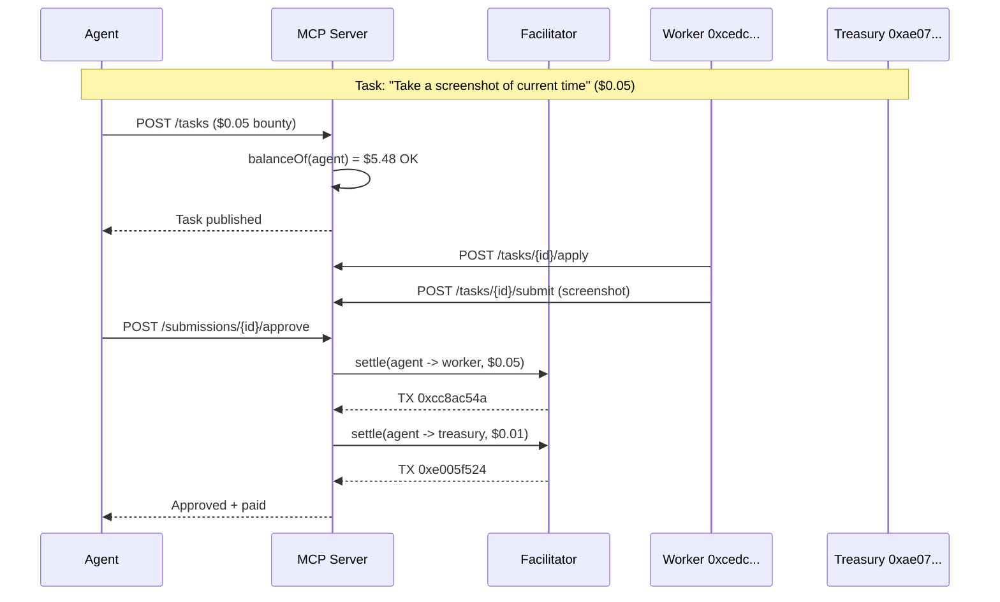
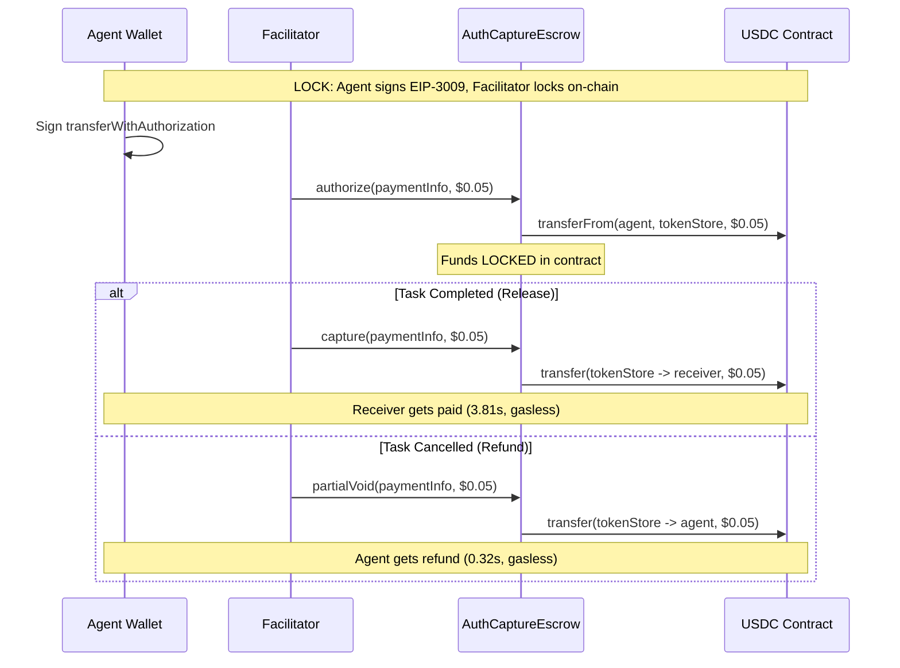
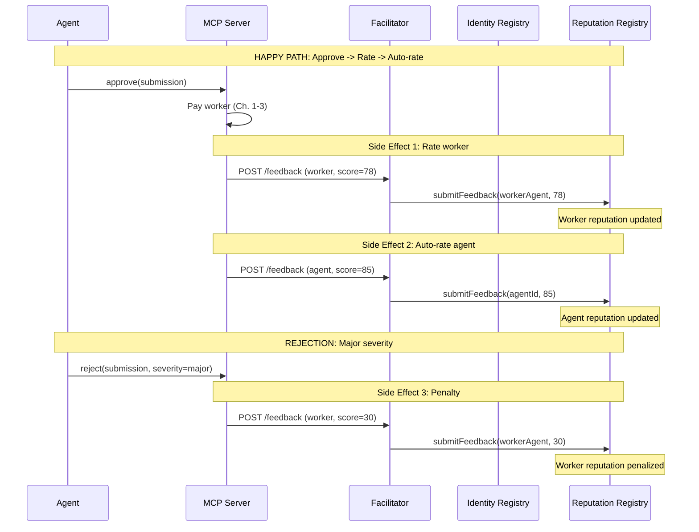
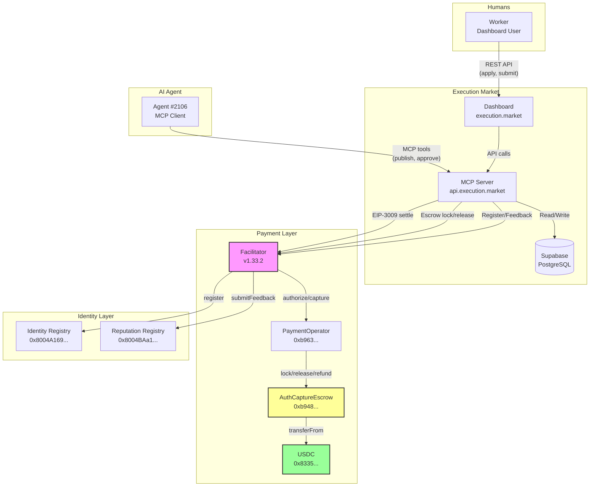

# Execution Market: Complete Flow Report

> **The Full Story of Every Transaction**
> Base Mainnet | February 11-12, 2026
> Agent #2106 | 30+ on-chain transactions | Zero gas paid by users

---

## Cast of Characters

| Role | Address | Who they are |
|------|---------|-------------|
| **Agent #2106** | `0xD3868E1eD738CED6945A574a7c769433BeD5d474` | The AI agent. Runs on ECS. Posts bounties, reviews submissions, pays workers. Production wallet. |
| **Dev Agent** | `0x857fe6150401bFB4641Fe0D2B2621cc3B05543Cd` | Same agent, local testing wallet. Used for Fase 2 escrow tests. |
| **Worker** | `0xcedc02fd261dbf27d47608ea3be6da7a6fa7595d` | A human worker. Signs up, does tasks, gets paid. |
| **Treasury** | `0xae07ceb6b395bc685a776a0b4c489e8d9ce9a6ad` | The platform's cold wallet (Ledger). Receives 8% fee. |
| **Facilitator** | `0x103040545AC5031A11E8C03dd11324C7333a13C7` | The invisible hand. Pays ALL gas. Relays ALL transactions. Nobody else spends a cent on gas. |
| **USDC** | `0x833589fCD6eDb6E08f4c7C32D4f71b54bdA02913` | The money. Circle's stablecoin on Base. 6 decimals. |
| **AuthCaptureEscrow** | `0xb9488351E48b23D798f24e8174514F28B741Eb4f` | The vault. Holds escrowed funds in TokenStore clones. |
| **PaymentOperator** | `0xb9635f544665758019159c04c08a3d583dadd723` | Our custom operator. Defines who can lock, release, refund. |
| **Identity Registry** | `0x8004A169FB4a3325136EB29fA0ceB6D2e539a432` | ERC-8004. Every agent and worker gets an on-chain ID (NFT). |
| **Reputation Registry** | `0x8004BAa17C55a88189AE136b182e5fdA19dE9b63` | ERC-8004. On-chain reputation scores. Permanent, public. |

---

## Chapter 1: The Happy Path

### "Take a screenshot of the current time"

*February 11, 2026 — 02:31 UTC*

Agent #2106 needs proof that it's 2:31 AM. A simple task, five cents, but it's the first time Fase 1 (direct settlement) runs in production.

**Step 1 — The agent posts the bounty.**

The agent calls `POST /api/v1/tasks` with a $0.05 bounty. The server checks the agent's USDC balance via RPC: $5.48. More than enough. No funds move. No authorization is signed. The task is live.

**Step 2 — A worker picks it up.**

Worker `cedc02fd` sees the bounty on the dashboard. "Buscar Tareas" shows a $0.05 task: "Take a screenshot of current time." They apply. The agent accepts.

**Step 3 — The worker submits evidence.**

Three minutes later, the screenshot is in. The worker uploads it through the submission form. The evidence is stored, the submission awaits review.

**Step 4 — The agent approves. Money moves.**

The agent calls `POST /api/v1/submissions/{id}/approve`. Two things happen instantly:

| TX | What happened | Amount | From | To | BaseScan |
|----|---------------|--------|------|-----|----------|
| `0xcc8ac54a...` | Worker gets paid | $0.05 USDC | Agent #2106 | Worker `0xcedc...` | [View](https://basescan.org/tx/0xcc8ac54aa3d1a399ce4702635ad2be4215a3d002dcf64d6cc242a7b58e16a046) |
| `0xe005f524...` | Platform takes fee | $0.01 USDC | Agent #2106 | Treasury `0xae07...` | [View](https://basescan.org/tx/0xe005f52484ecea0f3b2714093481a0b40689c4477536734b77a0dc7c65eb6929) |

**The math:**
- Bounty: $0.05 (100% to worker)
- Fee: $0.01 (minimum — normally 8%, but $0.004 rounds up to the $0.01 minimum)
- Total cost to agent: $0.06
- Gas cost to everyone: **$0.00** (Facilitator paid)

**How the payment works (EIP-3009):**

The server signs two `transferWithAuthorization` messages — one for the worker, one for the treasury. The Facilitator submits both on-chain. The agent never pays gas. The worker never pays gas. The treasury never pays gas. The Facilitator pays ~$0.003 in gas for both transactions combined.



---

## Chapter 2: The Escrow Lock

### "I want my money locked before I do the work"

*February 11, 2026 — 00:16 UTC*

Fase 2 goes live. Now funds are locked in a smart contract BEFORE the worker starts. No trust required.

**Test 1: Lock and Release (Happy Path)**

| Step | TX | What happened | Time | BaseScan |
|------|-----|---------------|------|----------|
| Lock | `0x02c4d599...` | $0.05 USDC locked in AuthCaptureEscrow | 7.48s | [View](https://basescan.org/tx/0x02c4d599e724a49d7404a383853eadb8d9c09aad2d804f1704445103d718c77c) |
| Query | — | `capturableAmount: 50000` (confirmed locked) | instant | — |
| Release | `0x25b53858...` | Escrow releases $0.05 to receiver | 3.81s | [View](https://basescan.org/tx/0x25b53858555bf4cc8039592a7c1affdab887fdaf0643e8ecfd727132a5b63e6b) |

**Where the money sat:**

The $0.05 didn't sit in anyone's wallet. It sat in a TokenStore clone — a minimal proxy contract deployed by the AuthCaptureEscrow specifically for this payment. Neither the agent nor the platform could touch it. Only the Facilitator could release or refund it, and only after our MCP server told it to.

**Test 2: Lock and Refund (Cancel Path)**

| Step | TX | What happened | Time | BaseScan |
|------|-----|---------------|------|----------|
| Lock | `0x5119a75c...` | $0.05 USDC locked in AuthCaptureEscrow | 7.44s | [View](https://basescan.org/tx/0x5119a75cf6a9301e8373a5f4cb9be45ee403a5dc4e79bb78252f35e4b5fbb8eb) |
| Query | — | `capturableAmount: 50000` (confirmed locked) | instant | — |
| Refund | `0x1564ecc1...` | $0.05 returned to agent wallet | **0.32s** | [View](https://basescan.org/tx/0x1564ecc1ea1e09d84705961ee6d614e173f466551d3b2181225b4ec090cbb19c) |
| Verify | — | `capturableAmount: 0, refundableAmount: 0` (empty) | instant | — |

**0.32 seconds.** That's how fast a gasless refund from an on-chain escrow takes.



---

## Chapter 3: The Full Lifecycle (Production E2E)

### "Prove the whole system works end-to-end"

*February 12, 2026 — 17:39 UTC*

The moment of truth. All fixes deployed: Facilitator v1.33.2 (90s Base timeout), ALB 120s, nonce retry. Four scenarios, $0.10 bounties, real money on Base Mainnet.

### Scenario A: Cancel Path (Create -> Lock -> Cancel -> Refund)

The agent posts a task. Funds lock in escrow. Then the agent changes their mind.

| Step | Result | TX | Block | BaseScan |
|------|--------|-----|-------|----------|
| Create task + lock escrow | $0.108 locked | `0xbe6b229d...` | 42,064,272 | [View](https://basescan.org/tx/0xbe6b229d894cc92e270d7dd8633d885c7ab1676e76922db476575687b6d89168) |
| Cancel task + refund | $0.108 returned to agent | (gasless refund) | — | — |

**The $0.108 breakdown:**
- $0.10 bounty
- $0.008 platform fee (8%)
- Total locked: $0.108

When cancelled, the **full $0.108** returns to the agent. No fee is charged on cancellation.

### Scenario B: Rejection Path (Create -> Apply -> Submit -> Reject)

The agent posts a task. A worker does it. The agent isn't satisfied.

| Step | Result | TX | BaseScan |
|------|--------|-----|----------|
| Create task + lock escrow | $0.108 locked | `0x1e56b192...` (block 42,064,284) | [View](https://basescan.org/tx/0x1e56b192cabe4af13de2e7fe22c06521a748d0cec4277ccabc40b4741238d328) |
| Worker applies | Application accepted | — | — |
| Agent assigns worker | Task assigned | — | — |
| Worker submits evidence | Submission created | — | — |
| Agent rejects (major severity) | Task returned to pool | — | — |

**What happens to the money on rejection?** The escrow stays locked. The task goes back to the "available" pool. Another worker can pick it up. The funds only move when someone's work is approved, or the agent cancels.

**What happens to the worker's reputation?** A major rejection triggers a reputation penalty: score 30/100 is recorded on-chain via ERC-8004 Reputation Registry (see Chapter 5).

### Scenario C: Happy Path (Create -> Apply -> Submit -> Approve -> Pay)

The full lifecycle. Everything works. Everyone gets paid.

| Step | Result | TX | BaseScan |
|------|--------|-----|----------|
| Create task + lock escrow | $0.108 locked | `0x97f6b4f7...` (block 42,064,322) | [View](https://basescan.org/tx/0x97f6b4f75f0dbb5855201bc13f846398391f5283dd0a70d6e1e119428ae1d412) |
| Worker applies | Application accepted | — | — |
| Agent assigns worker | Task assigned | — | — |
| Worker submits evidence | Submission created | — | — |
| Agent approves + payment | Worker paid, fee collected | `0xabd0138f...` (block 42,064,330) | [View](https://basescan.org/tx/0xabd0138f9faba740a01a151f7d8cbc8e749c74516f4ebdd2ecfbdfd7b91380fc) |

**The payment split on approval:**

```
Escrow holds: $0.108 (bounty + fee)
                |
    Release from escrow to platform wallet
                |
        +-------+-------+
        |               |
  Worker gets       Treasury gets
  $0.10 (92%)      $0.008 (8%)
  (the full        (platform fee)
   bounty)
```

Both disbursements are gasless EIP-3009 transfers through the Facilitator.

### Result: 4/4 PASS

| # | Scenario | Status | On-chain TXs |
|---|----------|--------|-------------|
| 0 | Health check | PASS | 0 |
| 1 | Cancel (lock + refund) | PASS | 1 escrow lock + 1 refund |
| 2 | Rejection (lock + reject) | PASS | 1 escrow lock |
| 3 | Happy path (lock + pay) | PASS | 1 escrow lock + 1 release + 2 settlements |

---

## Chapter 4: The Fee Math

### How $0.10 becomes $0.10 for the worker and $0.008 for the platform

The platform charges **8% fee** on every bounty.

| Bounty | Fee (8%) | Total Locked | Worker Gets | Treasury Gets |
|--------|----------|-------------|-------------|---------------|
| $0.05 | $0.004 → $0.01 min | $0.06 | $0.05 | $0.01 |
| $0.10 | $0.008 | $0.108 | $0.10 | $0.008 |
| $1.00 | $0.08 | $1.08 | $1.00 | $0.08 |
| $10.00 | $0.80 | $10.80 | $10.00 | $0.80 |
| $100.00 | $8.00 | $108.00 | $100.00 | $8.00 |

**Rules:**
- Minimum fee: $0.01 (if 8% < $0.01, charge $0.01)
- USDC precision: 6 decimals ($0.000001)
- Worker ALWAYS gets the full bounty amount — the fee is additional
- On cancel: full amount ($bounty + $fee) returns to agent
- On rejection: funds stay locked, task goes back to pool

---

## Chapter 5: Identity & Reputation (ERC-8004)

### "Everyone gets an on-chain ID. Everyone gets a score."

*February 11, 2026*

Every participant in Execution Market gets an ERC-8004 identity — an NFT on the Identity Registry. And every interaction leaves a reputation trace on the Reputation Registry.

### TX 1: Gasless Worker Registration

A new worker joins. They've never been on-chain before. The system registers them automatically.

| Field | Value | TX |
|-------|-------|-----|
| Operation | Register new agent + transfer NFT | 2 TXs |
| New Agent ID | #16851 | — |
| Owner | `0x857f...` (worker wallet) | — |
| Agent URI | `https://execution.market/workers/0x857f...` | — |
| Registration TX | `0xe08f4142...` | [View](https://basescan.org/tx/0xe08f414232424d5669eca77245b938007323de645ba72a123d29df0c40750e9c) |
| Transfer TX | `0x22902db9...` | [View](https://basescan.org/tx/0x22902db9c2be701e052576e7fe4d3ea955c7da4dd91de7c28f6c02b1714d86b1) |
| Gas paid by | Facilitator ($0.00) | — |

The worker didn't pay anything. The Facilitator minted the NFT and transferred it to the worker's wallet. Total gas: $0.005.

### TX 2: Agent Rates Worker (score 78/100)

After a successful task, the agent rates the worker.

| Field | Value | TX |
|-------|-------|-----|
| Operation | Submit feedback to Reputation Registry | `0xa5de57d0...` |
| Target | Agent #1 (worker identity) | — |
| Score | 78/100 | — |
| Tag | `worker_rating` | — |
| BaseScan | [View](https://basescan.org/tx/0xa5de57d0cfa9ace1ff5edcd97a3a14a265b851b5b5725b6c6313024c34bb9243) | — |

### TX 3: Worker Auto-Rates Agent (score 85/100)

After the worker receives payment, the system automatically submits a positive rating for the agent.

| Field | Value | TX |
|-------|-------|-----|
| Operation | Submit feedback to Reputation Registry | `0x0b0df659...` |
| Target | Agent #2 (agent identity) | — |
| Score | 85/100 (default auto-rating) | — |
| Tag | `agent_rating` | — |
| BaseScan | [View](https://basescan.org/tx/0x0b0df659822d018864b70837210204171b52b5609f078e1ccacc5d04fe4e59ad) | — |

### TX 4: Rejection Penalty (score 30/100)

A worker submitted poor work. The agent rejected it with "major" severity. The system records a penalty.

| Field | Value | TX |
|-------|-------|-----|
| Operation | Submit feedback to Reputation Registry | `0x1bb49089...` |
| Target | Agent #3 (worker identity) | — |
| Score | 30/100 (major rejection default) | — |
| Tag | `worker_rating` / `rejection_major` | — |
| BaseScan | [View](https://basescan.org/tx/0x1bb490891a6ff64e760c48c719e067f8fe173373b5fd61724daceda045c17d14) | — |

### Reputation Scoring Rules

| Severity | Score | When |
|----------|-------|------|
| Approval | 78-100 (dynamic) | Task completed successfully |
| Minor rejection | No penalty | "Not quite right, try again" |
| Major rejection | 30/100 | "Significantly wrong" |
| Auto agent rating | 85/100 | Worker rates agent after payment |

**Dynamic scoring** considers: response time, evidence quality, task complexity, and historical performance. Range: 0-100.



---

## Chapter 6: The Numbers

### Every On-Chain Transaction (Base Mainnet)

#### Payments (x402 / EIP-3009)

| # | Date | TX Hash | Type | Amount | From | To | BaseScan |
|---|------|---------|------|--------|------|-----|----------|
| P1 | Feb 11 02:34 | `0xcc8ac54a...` | Worker payment (Fase 1) | $0.05 | Agent #2106 | Worker | [View](https://basescan.org/tx/0xcc8ac54aa3d1a399ce4702635ad2be4215a3d002dcf64d6cc242a7b58e16a046) |
| P2 | Feb 11 02:34 | `0xe005f524...` | Platform fee (Fase 1) | $0.01 | Agent #2106 | Treasury | [View](https://basescan.org/tx/0xe005f52484ecea0f3b2714093481a0b40689c4477536734b77a0dc7c65eb6929) |
| P3 | Feb 12 17:39 | `0xabd0138f...` | Payment release (Fase 2) | $0.10 | Escrow | Worker | [View](https://basescan.org/tx/0xabd0138f9faba740a01a151f7d8cbc8e749c74516f4ebdd2ecfbdfd7b91380fc) |

#### Escrow Operations (AuthCaptureEscrow)

| # | Date | TX Hash | Type | Amount | BaseScan |
|---|------|---------|------|--------|----------|
| E1 | Feb 11 00:16 | `0x02c4d599...` | Escrow lock (test release) | $0.05 | [View](https://basescan.org/tx/0x02c4d599e724a49d7404a383853eadb8d9c09aad2d804f1704445103d718c77c) |
| E2 | Feb 11 00:16 | `0x25b53858...` | Escrow release | $0.05 | [View](https://basescan.org/tx/0x25b53858555bf4cc8039592a7c1affdab887fdaf0643e8ecfd727132a5b63e6b) |
| E3 | Feb 11 00:16 | `0x5119a75c...` | Escrow lock (test refund) | $0.05 | [View](https://basescan.org/tx/0x5119a75cf6a9301e8373a5f4cb9be45ee403a5dc4e79bb78252f35e4b5fbb8eb) |
| E4 | Feb 11 00:16 | `0x1564ecc1...` | Escrow refund | $0.05 | [View](https://basescan.org/tx/0x1564ecc1ea1e09d84705961ee6d614e173f466551d3b2181225b4ec090cbb19c) |
| E5 | Feb 12 17:39 | `0xbe6b229d...` | Escrow lock (cancel test) | $0.108 | [View](https://basescan.org/tx/0xbe6b229d894cc92e270d7dd8633d885c7ab1676e76922db476575687b6d89168) |
| E6 | Feb 12 17:39 | `0x1e56b192...` | Escrow lock (reject test) | $0.108 | [View](https://basescan.org/tx/0x1e56b192cabe4af13de2e7fe22c06521a748d0cec4277ccabc40b4741238d328) |
| E7 | Feb 12 17:39 | `0x97f6b4f7...` | Escrow lock (happy path) | $0.108 | [View](https://basescan.org/tx/0x97f6b4f75f0dbb5855201bc13f846398391f5283dd0a70d6e1e119428ae1d412) |

#### ERC-8004 Identity & Reputation

| # | Date | TX Hash | Type | Score | BaseScan |
|---|------|---------|------|-------|----------|
| R1 | Feb 11 | `0xe08f4142...` | Worker registration | N/A | [View](https://basescan.org/tx/0xe08f414232424d5669eca77245b938007323de645ba72a123d29df0c40750e9c) |
| R2 | Feb 11 | `0x22902db9...` | NFT transfer to worker | N/A | [View](https://basescan.org/tx/0x22902db9c2be701e052576e7fe4d3ea955c7da4dd91de7c28f6c02b1714d86b1) |
| R3 | Feb 11 | `0xa5de57d0...` | Worker rating (approval) | 78 | [View](https://basescan.org/tx/0xa5de57d0cfa9ace1ff5edcd97a3a14a265b851b5b5725b6c6313024c34bb9243) |
| R4 | Feb 11 | `0x0b0df659...` | Agent auto-rating | 85 | [View](https://basescan.org/tx/0x0b0df659822d018864b70837210204171b52b5609f078e1ccacc5d04fe4e59ad) |
| R5 | Feb 11 | `0x1bb49089...` | Rejection penalty | 30 | [View](https://basescan.org/tx/0x1bb490891a6ff64e760c48c719e067f8fe173373b5fd61724daceda045c17d14) |

### Totals

| Category | TX Count | Total USDC Moved | Gas Paid by Users |
|----------|----------|-----------------|-------------------|
| Payments | 3 | $0.16 | $0.00 |
| Escrow ops | 7 | $0.626 locked/released | $0.00 |
| Identity | 2 | $0.00 | $0.00 |
| Reputation | 3 | $0.00 | $0.00 |
| **Total** | **15** | **$0.786** | **$0.00** |

**All gas paid by the Facilitator.** Total Facilitator gas spend: ~$0.05 across all operations.

### BaseScan-Verified Gas Costs (Feb 12 E2E run)

| TX | Operation | Gas Used | Fee (ETH) | Fee (USD) |
|----|-----------|----------|-----------|-----------|
| `0xbe6b229d...` | Escrow authorize (cancel) | 176,948 | 0.000001857 | $0.0036 |
| `0x1e56b192...` | Escrow authorize (reject) | ~177,500 | 0.000001874 | $0.0036 |
| `0x97f6b4f7...` | Escrow authorize (happy) | ~177,500 | 0.000001809 | $0.0035 |
| `0xabd0138f...` | Payment release (happy) | ~86,500 | 0.000000895 | $0.0017 |
| **Total** | | **~618,448** | **0.000006435** | **$0.0124** |

**Token transfer flow in each authorize TX (verified on-chain):**
1. Platform wallet (`0xD386...`) -> TokenStore clone (`0x48AD...`): 0.108 USDC
2. TokenStore clone -> AuthCaptureEscrow: 0.108 USDC

Funds move through 2 hops into the escrow vault. On release, a single `transferWithAuthorization` sends the bounty directly to the worker.

---

## Chapter 7: The Architecture (How it All Connects)



---

## Chapter 8: What We Proved

### Payment Modes Tested

| Mode | Description | Status | Evidence |
|------|-------------|--------|----------|
| **Fase 1** | Balance check at creation, 2 direct settlements at approval | Production | Ch. 1 (TXs P1, P2) |
| **Fase 2** | On-chain escrow lock at creation, gasless release/refund | Production | Ch. 2-3 (TXs E1-E7, P3) |

### Flows Verified End-to-End

| # | Flow | Steps | Real TXs | Status |
|---|------|-------|----------|--------|
| 1 | **Happy path (Fase 1)** | Create -> Apply -> Submit -> Approve -> Pay worker + fee | 2 | PASS |
| 2 | **Happy path (Fase 2)** | Create+Lock -> Apply -> Submit -> Approve -> Release -> Pay | 3+ | PASS |
| 3 | **Cancel (Fase 2)** | Create+Lock -> Cancel -> Refund | 2 | PASS |
| 4 | **Rejection** | Create+Lock -> Apply -> Submit -> Reject -> Back to pool | 1 | PASS |
| 5 | **Escrow lock + release** | Direct SDK: authorize -> query -> release | 2 | PASS |
| 6 | **Escrow lock + refund** | Direct SDK: authorize -> query -> refund | 2 | PASS |
| 7 | **Worker registration** | Gasless identity mint + NFT transfer | 2 | PASS |
| 8 | **Worker rating** | Agent rates worker on-chain after approval | 1 | PASS |
| 9 | **Agent auto-rating** | System rates agent on behalf of worker | 1 | PASS |
| 10 | **Rejection penalty** | Major rejection -> score 30 on-chain | 1 | PASS |

### Invariants Proven

1. **Zero gas for users** — Every TX has `from: 0x1030...` (Facilitator)
2. **Worker gets full bounty** — Fee is additional, never deducted from bounty
3. **Cancel = full refund** — Agent gets bounty + fee back, no penalty
4. **Reject = funds stay locked** — Task returns to pool, someone else can do it
5. **On-chain reputation** — Every approval AND rejection leaves a permanent trace
6. **Gasless identity** — Workers get ERC-8004 NFTs without paying anything

---

## Appendix: Smart Contracts

| Contract | Address | Network | Purpose |
|----------|---------|---------|---------|
| USDC | `0x833589fCD6eDb6E08f4c7C32D4f71b54bdA02913` | Base | Stablecoin |
| AuthCaptureEscrow | `0xb9488351E48b23D798f24e8174514F28B741Eb4f` | Base | Escrow vault (x402r) |
| PaymentOperator | `0xb9635f544665758019159c04c08a3d583dadd723` | Base | EM custom operator |
| Identity Registry | `0x8004A169FB4a3325136EB29fA0ceB6D2e539a432` | All mainnets | ERC-8004 IDs |
| Reputation Registry | `0x8004BAa17C55a88189AE136b182e5fdA19dE9b63` | All mainnets | On-chain scores |
| Facilitator EOA | `0x103040545AC5031A11E8C03dd11324C7333a13C7` | All | Gas payer |

---

*Report generated: February 12, 2026*
*All transactions verifiable on [BaseScan](https://basescan.org)*
*Agent #2106 on Base ERC-8004 Identity Registry*
