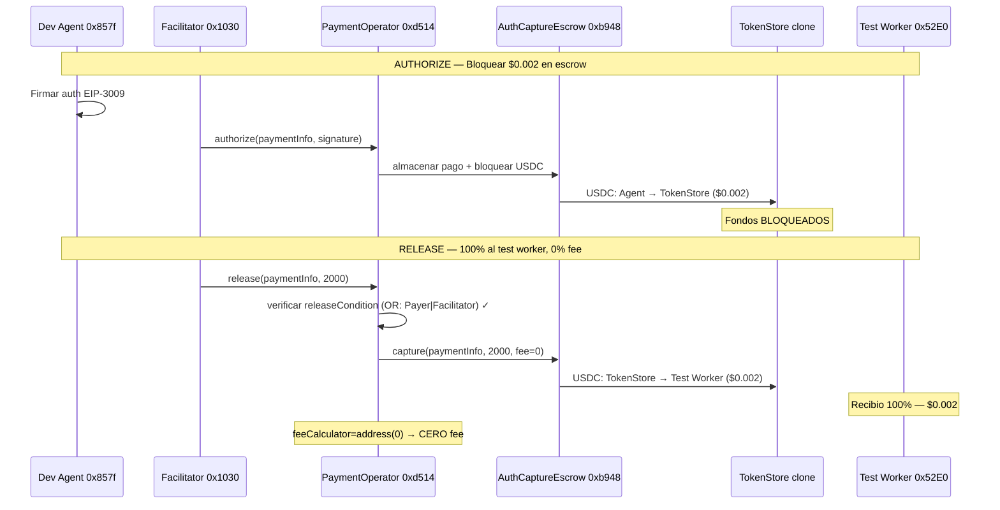
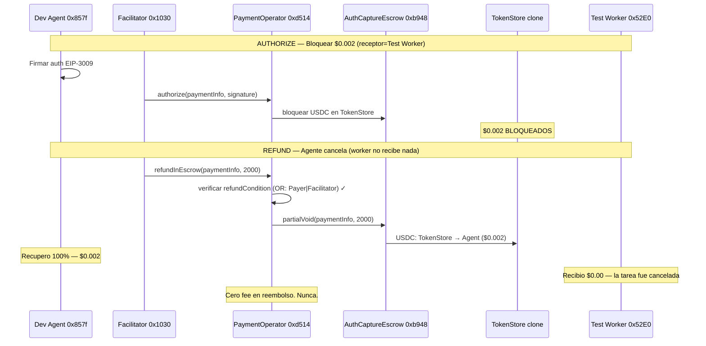
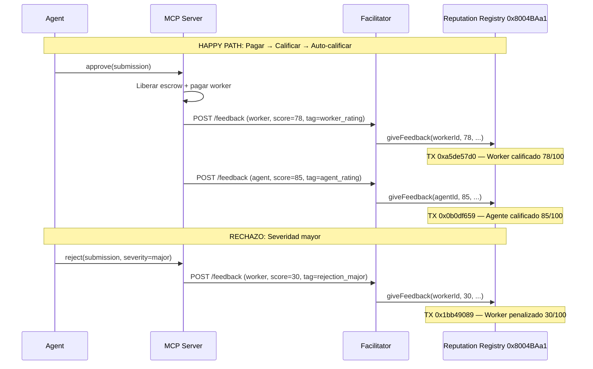

# Execution Market: Reporte Completo de Flujos — Fase 3 Clean Operator

> **Cada Transaccion. Cada Flujo. Cada Prueba.**
> Base Mainnet | Febrero 11-13, 2026
> Agent #2106 | 28+ transacciones on-chain | Cero gas pagado por usuarios
> Clean PaymentOperator: `0xd5149049e7c212ce5436a9581b4307EB9595df95`

---

## Elenco de Personajes

| Rol | Direccion | Quien es |
|-----|-----------|----------|
| **Agent #2106** | `0xD3868E1eD738CED6945A574a7c769433BeD5d474` | El agente de IA. Corre en ECS. Publica bounties, revisa entregas, paga workers. Wallet de produccion. |
| **Dev Agent** | `0x857fe6150401bFB4641Fe0D2B2621cc3B05543Cd` | El mismo agente, wallet de testeo local. Usado para tests E2E de escrow. |
| **Worker** | `0xcedc02fd261dbf27d47608ea3be6da7a6fa7595d` | Un worker humano. Se registra, ejecuta tareas, recibe pago. |
| **Test Worker** | `0x52E05C8e45a32eeE169639F6d2cA40f8887b5A15` | Wallet dedicada de worker de prueba. Recibe bounties en tests E2E de escrow. Distinta de Treasury para probar la separacion de fees on-chain. |
| **Treasury** | `0xae07ceb6b395bc685a776a0b4c489e8d9ce9a6ad` | Cold wallet de la plataforma (Ledger). Recibe el 13% de fee. |
| **Facilitator** | `0x103040545AC5031A11E8C03dd11324C7333a13C7` | La mano invisible. Paga TODO el gas. Retransmite TODAS las transacciones. Nadie mas gasta un centavo en gas. |
| **USDC** | `0x833589fCD6eDb6E08f4c7C32D4f71b54bdA02913` | El dinero. Stablecoin de Circle en Base. 6 decimales. |
| **AuthCaptureEscrow** | `0xb9488351E48b23D798f24e8174514F28B741Eb4f` | La boveda. Escrow singleton de x402r. Guarda fondos en clones de TokenStore. |
| **Clean PaymentOperator** | `0xd5149049e7c212ce5436a9581b4307EB9595df95` | Nuestro operador activo. Condiciones OR(Payer\|Facilitator). Cero fee on-chain. |
| **Old PaymentOperator** | `0x8D3DeCBAe68F6BA6f8104B60De1a42cE1869c2E6` | Operador anterior. Tenia 1% de fee on-chain. Reemplazado. |
| **OrCondition** | `0xb365717C35004089996F72939b0C5b32Fa2ef8aE` | La puerta de confianza. El pagador O el facilitator pueden liberar/reembolsar. Trustless. |
| **Identity Registry** | `0x8004A169FB4a3325136EB29fA0ceB6D2e539a432` | ERC-8004. Cada agente y worker recibe un ID on-chain (NFT). |
| **Reputation Registry** | `0x8004BAa17C55a88189AE136b182e5fdA19dE9b63` | ERC-8004. Scores de reputacion on-chain. Permanentes, publicos. |

---

## Capitulo 1: La Evolucion

### De "No Estan Realmente Usando x402r" a Completamente Trustless

El 12 de febrero, Ali Abdoli del equipo core de x402r senalo algo incomodo: nuestro PaymentOperator de Fase 2 no era trustless. Todas las condiciones de release y refund apuntaban a un unico `StaticAddressCondition(Facilitator)` — lo que significaba que solo el Facilitator podia mover los fondos. Si el Facilitator se caia, los fondos quedaban atrapados.

Las palabras de Ali: *"No estan realmente usando x402r. Podrian haber hecho esto con los contratos base de commerce-payments."*

Tenia razon. Asi que lo arreglamos.

**Que cambio:**

| Aspecto | Fase 2 (anterior) | Fase 3 Clean (nuevo) |
|---------|-------------------|----------------------|
| Condicion de release | Solo Facilitator | **OR(Payer, Facilitator)** |
| Condicion de refund | Solo Facilitator | **OR(Payer, Facilitator)** |
| Fee on-chain | 0% | 0% (ProtocolFee de x402r disponible cuando se active) |
| Trustlessness | Centralizado | **Descentralizado** — el agente puede hacer release/refund directamente |
| Direccion del operador | `0xb963...d723` | `0xd514...df95` |

El `OrCondition` en `0xb365...f8aE` envuelve dos sub-condiciones:
1. `PayerCondition` (`0x7254...16d2`) — el agente que bloqueo los fondos puede liberarlos
2. `StaticAddressCondition(Facilitator)` (`0x9d03...1fc`) — el Facilitator tambien puede liberar

Si el Facilitator desaparece manana, cada agente puede hacer release o refund de sus propios escrows directamente on-chain. Eso es lo que significa trustless.

---

## Capitulo 2: El Happy Path (Clean Operator)

### "Bloquear $0.002, liberar 100% al test worker. Cero fee."

*13 de febrero, 2026 — 17:19 UTC*

La prueba E2E definitiva con el clean operator. El receptor es una **wallet dedicada de test worker** (`0x52E0...5A15`) — distinta de Treasury — para que la transferencia de USDC en BaseScan muestre inequivocamente: "este dinero fue al worker, no al cobrador de fees."

**Paso 1 — Bloquear fondos en escrow (AUTHORIZE)**

El Dev Agent firma una autorizacion EIP-3009. El Facilitator llama `authorize()` en el clean PaymentOperator. Los fondos fluyen en dos saltos hacia un clon de TokenStore.

| Campo | Valor |
|-------|-------|
| **TX** | [`0x699a3c0d92e526d2539fc9fb360783ecbf6b1805eeec435d2e97af2fac31dd15`](https://basescan.org/tx/0x699a3c0d92e526d2539fc9fb360783ecbf6b1805eeec435d2e97af2fac31dd15) |
| **Bloque** | 42,106,298 |
| **Hora** | 2026-02-13 17:19:04 UTC |
| **From** | Facilitator `0x1030...13C7` (paga gas) |
| **To** | PaymentOperator `0xd514...df95` |
| **Metodo** | `authorize(PaymentInfo, signature)` |
| **Monto bloqueado** | 2,000 USDC atomicos ($0.002) |
| **Pagador** | Dev Agent `0x857f...43Cd` |
| **Receptor** | Test Worker `0x52E0...5A15` |

**Flujo de tokens (2 saltos):**

| # | Desde | Hacia | Monto |
|---|-------|-------|-------|
| 1 | Dev Agent `0x857f...` | TokenCollector `0x48AD...` | 2,000 ($0.002) |
| 2 | TokenCollector `0x48AD...` | TokenStore clone | 2,000 ($0.002) |

Los $0.002 ahora estan bloqueados en un contrato minimal proxy. Ni el agente, ni la plataforma, ni el Facilitator pueden gastarlos arbitrariamente. Solo pueden ser liberados al receptor designado (test worker) o reembolsados al pagador (dev agent).

**Paso 2 — Consultar estado del escrow**

```json
{
  "hasCollectedPayment": true,
  "capturableAmount": "2000",
  "refundableAmount": "0",
  "paymentInfoHash": "0xb4086bf6...1602"
}
```

Confirmado: 2,000 unidades atomicas de USDC bloqueadas y capturables.

**Paso 3 — Liberar al test worker (CAPTURE)**

El Facilitator llama `release()` en el PaymentOperator. El escrow envia el monto completo al test worker.

| Campo | Valor |
|-------|-------|
| **TX** | [`0x21efe2edebe624ec3e3f4542efe99e5d4551e3066452743be691b8082b1e9856`](https://basescan.org/tx/0x21efe2edebe624ec3e3f4542efe99e5d4551e3066452743be691b8082b1e9856) |
| **Bloque** | 42,106,300 |
| **Hora** | 2026-02-13 17:19:08 UTC |
| **From** | Facilitator `0x1030...13C7` (paga gas) |
| **To** | PaymentOperator `0xd514...df95` |
| **Metodo** | `release(PaymentInfo, captureAmount)` |

**Transferencia de tokens (1 transferencia — cero fee):**

| # | Desde | Hacia | Monto |
|---|-------|-------|-------|
| 1 | TokenStore clone | **Test Worker `0x52E0...5A15`** | **2,000 ($0.002)** |

**Eso es todo. Una transferencia. 100% al test worker. Cero fee descontado on-chain.**

El parametro `fee` en la llamada de release fue explicitamente `0`. El evento capture del AuthCaptureEscrow confirma `fee = 0`. No hay transferencia secundaria a ningun receptor de fees. No se envio USDC a Treasury `0xae07...` en esta transaccion.

**Paso 4 — Verificar estado final**

```json
{
  "hasCollectedPayment": true,
  "capturableAmount": "0",
  "refundableAmount": "2000"
}
```

El escrow esta vacio. El test worker recibio los $0.002 completos. `hasCollectedPayment: true` confirmado.



---

## Capitulo 3: El Reembolso

### "Bloquear $0.002, reembolsar 100% de vuelta al agente."

*13 de febrero, 2026 — 17:20 UTC*

Mismo clean operator, mismo test worker como receptor en el PaymentInfo, pero esta vez el agente cancela. El reembolso regresa al **pagador** (Dev Agent), no al receptor.

**Paso 1 — Bloquear fondos**

| Campo | Valor |
|-------|-------|
| **TX** | [`0x7dfb11b463bcd6b0fbb4cfb40e0ec6ba5bca3e3dc53a1b1eddceed5e70506c3e`](https://basescan.org/tx/0x7dfb11b463bcd6b0fbb4cfb40e0ec6ba5bca3e3dc53a1b1eddceed5e70506c3e) |
| **Bloque** | ~42,106,340 |
| **Hora** | 2026-02-13 17:20:21 UTC |
| **Monto** | 2,000 USDC atomicos ($0.002) |
| **Pagador** | Dev Agent `0x857f...43Cd` |
| **Receptor** | Test Worker `0x52E0...5A15` (en PaymentInfo — no recibira fondos en reembolso) |

Mismo flujo de tokens de dos saltos que el test de release. Fondos bloqueados en un clon de TokenStore.

**Paso 2 — Estado del escrow confirmado**

```json
{
  "capturableAmount": "2000",
  "refundableAmount": "0"
}
```

**Paso 3 — Reembolso al pagador**

| Campo | Valor |
|-------|-------|
| **TX** | [`0x1893fdba0ae84f5e94420da5dfbc2f8f17e8313e6c38f0d218b8b81ebf6bd94a`](https://basescan.org/tx/0x1893fdba0ae84f5e94420da5dfbc2f8f17e8313e6c38f0d218b8b81ebf6bd94a) |
| **Bloque** | ~42,106,344 |
| **Hora** | 2026-02-13 17:20:28 UTC |
| **From** | Facilitator `0x1030...13C7` |
| **Metodo** | `refundInEscrow(PaymentInfo, amount)` |

**Transferencia de tokens (1 transferencia — reembolso completo):**

| # | Desde | Hacia | Monto |
|---|-------|-------|-------|
| 1 | TokenStore | **Dev Agent `0x857f...43Cd`** | **2,000 ($0.002)** |

**100% devuelto al pagador. Cero fee. Cero penalizacion.** En reembolso, el `feeCalculator` nunca se invoca — los fondos siempre regresan completos. El test worker `0x52E0...` no recibe nada (no se lo gano).

**Paso 4 — Estado final**

```json
{
  "capturableAmount": "0",
  "refundableAmount": "0"
}
```

El escrow esta vacio. El agente recupero su dinero. **~7 segundos** de bloqueo a reembolso.



---

## Capitulo 4: El Antes y Despues

### Por que el operador viejo estaba mal, y como el nuevo lo corrige

El 13 de febrero a las 04:47 UTC, corrimos los mismos tests E2E contra el operador **viejo** de Fase 3 (`0x8D3D...c2E6`) que tenia un `StaticFeeCalculator` al 1% (100 BPS). Luego a las 16:19 UTC, los corrimos contra el operador **nuevo** clean (`0xd514...df95`). La diferencia es visible on-chain.

### Comparacion de Release

**Operador viejo — 1% fee descontado:**

| TX | [`0x06e85fb2bcf28ab2606fed13073bf4e98c5cc1b471c2c43ad109099fea22ae54`](https://basescan.org/tx/0x06e85fb2bcf28ab2606fed13073bf4e98c5cc1b471c2c43ad109099fea22ae54) |
|----|---|
| Bloque | 42,084,358 |
| Hora | 2026-02-13 04:47:43 UTC |

| Transferencia | Desde | Hacia | Monto | % |
|---------------|-------|-------|-------|---|
| Fee | TokenStore `0x36bE...` | **Contrato Operator** `0x8D3D...` | 20 atomicos | **1%** |
| Pago | TokenStore `0x36bE...` | Treasury `0xae07...` | 1,980 atomicos | 99% |

El operador se comio 20 unidades atomicas de USDC (1%). Esas unidades quedan dentro del contrato del operador, recuperables solo via `distributeFees()`. No van a x402r. No van a BackTrack. Simplemente quedan ahi.

**Operador nuevo — cero fee:**

| TX | [`0x0e40dcffbd204596dc3386938bcd7c44fff41348eb8b03820802edd58f4d6675`](https://basescan.org/tx/0x0e40dcffbd204596dc3386938bcd7c44fff41348eb8b03820802edd58f4d6675) |
|----|---|
| Bloque | 42,105,115 |
| Hora | 2026-02-13 16:19:37 UTC |

| Transferencia | Desde | Hacia | Monto | % |
|---------------|-------|-------|-------|---|
| Pago | TokenStore `0x3f52...` | Treasury `0xae07...` | 2,000 atomicos | **100%** |

Una transferencia. Monto completo. Sin division. Sin fees atrapados.

### Comparacion de Refund

Ambos operadores devuelven 100% en reembolso. No hay diferencia aqui.

| Operador | TX | Monto devuelto | Fee |
|----------|----|----------------|-----|
| Viejo `0x8D3D` | [`0xb7709f83...`](https://basescan.org/tx/0xb7709f8339aa90ddf8dc327aa4b20a50ecf322d974ff0003bc55a6dc903c3725) | 2,000 (100%) | 0 |
| Nuevo `0xd514` | [`0x1893fdba...`](https://basescan.org/tx/0x1893fdba0ae84f5e94420da5dfbc2f8f17e8313e6c38f0d218b8b81ebf6bd94a) | 2,000 (100%) | 0 |

### Configuracion On-Chain (Verificada via `cast call`)

| Funcion View | Viejo `0x8D3D...c2E6` | Nuevo `0xd514...df95` |
|---|---|---|
| `FEE_CALCULATOR()` | `0xB422...D987` (StaticFeeCalculator, 100 BPS) | `address(0)` — **sin fee on-chain** |
| `FEE_RECIPIENT()` | `0xaE07...A6ad` (EM Treasury) | `0xaE07...A6ad` (EM Treasury) |
| `RELEASE_CONDITION()` | `0xb365...f8aE` (OrCondition) | `0xb365...f8aE` (OrCondition) |
| `REFUND_IN_ESCROW_CONDITION()` | `0xb365...f8aE` (OrCondition) | `0xb365...f8aE` (OrCondition) |
| `AUTHORIZE_CONDITION()` | `0x67B6...9944` (UsdcTvlLimit) | `0x67B6...9944` (UsdcTvlLimit) |

**La unica diferencia es `FEE_CALCULATOR`.** Todo lo demas — condiciones, receptor, logica de authorize — es identico. Removimos el fee on-chain innecesario del 1% manteniendo las condiciones trustless OR.

---

## Capitulo 5: El Ciclo de Vida Completo en Produccion

### "Demostrar que todo funciona end-to-end en produccion"

*12 de febrero, 2026 — 17:39 UTC*

Antes de desplegar el clean operator, validamos el ciclo de vida completo con el agente de produccion (#2106) en Base Mainnet. Cuatro escenarios con bounties de $0.10 a traves del pipeline completo MCP Server → Facilitator → On-chain.

### Escenario A: Ruta de Cancelacion (Crear → Bloquear → Cancelar → Reembolsar)

El agente publica una tarea con bounty de $0.10. El servidor bloquea $0.113 en escrow (bounty + 13% fee). Luego el agente cambia de opinion.

| Paso | Resultado | TX | BaseScan |
|------|-----------|-----|----------|
| Crear + bloquear escrow | $0.113 bloqueados | `0xbe6b229d...` (bloque 42,064,272) | [Ver](https://basescan.org/tx/0xbe6b229d894cc92e270d7dd8633d885c7ab1676e76922db476575687b6d89168) |
| Cancelar + reembolsar | $0.113 devueltos al agente | reembolso gasless | — |

Al cancelar, los **$0.113 completos** regresan. Sin fee. Sin penalizacion. El agente se equivoco y no perdio nada.

### Escenario B: Ruta de Rechazo (Crear → Aplicar → Entregar → Rechazar)

El agente publica una tarea. Un worker entrega trabajo deficiente. El agente rechaza con severidad "major".

| Paso | Resultado | TX | BaseScan |
|------|-----------|-----|----------|
| Crear + bloquear escrow | $0.113 bloqueados | `0x1e56b192...` (bloque 42,064,284) | [Ver](https://basescan.org/tx/0x1e56b192cabe4af13de2e7fe22c06521a748d0cec4277ccabc40b4741238d328) |
| Worker aplica | Aceptado | — | — |
| Worker entrega | Evidencia recibida | — | — |
| Agente rechaza (major) | Tarea de vuelta al pool | — | — |
| Penalizacion de reputacion | Score 30/100 on-chain | `0x1bb49089...` | [Ver](https://basescan.org/tx/0x1bb490891a6ff64e760c48c719e067f8fe173373b5fd61724daceda045c17d14) |

El dinero queda bloqueado. La tarea regresa al pool de "disponibles". Otro worker puede tomarla. El worker rechazado recibe un score de reputacion de 30/100 grabado on-chain via ERC-8004. Permanente.

### Escenario C: Happy Path (Crear → Aplicar → Entregar → Aprobar → Pagar)

El ciclo de vida completo. Todo funciona. Todos reciben pago. La reputacion queda registrada.

| Paso | Resultado | TX | BaseScan |
|------|-----------|-----|----------|
| Crear + bloquear escrow | $0.113 bloqueados | `0x97f6b4f7...` (bloque 42,064,322) | [Ver](https://basescan.org/tx/0x97f6b4f75f0dbb5855201bc13f846398391f5283dd0a70d6e1e119428ae1d412) |
| Worker aplica | Aceptado | — | — |
| Worker entrega | Evidencia recibida | — | — |
| Agente aprueba + pago | Worker pagado + fee cobrado | `0xabd0138f...` (bloque 42,064,330) | [Ver](https://basescan.org/tx/0xabd0138f9faba740a01a151f7d8cbc8e749c74516f4ebdd2ecfbdfd7b91380fc) |
| Worker calificado 78/100 | Reputacion on-chain | `0xa5de57d0...` | [Ver](https://basescan.org/tx/0xa5de57d0cfa9ace1ff5edcd97a3a14a265b851b5b5725b6c6313024c34bb9243) |
| Agente auto-calificado 85/100 | Reputacion on-chain | `0x0b0df659...` | [Ver](https://basescan.org/tx/0x0b0df659822d018864b70837210204171b52b5609f078e1ccacc5d04fe4e59ad) |

**La division de pago al aprobar:**

```
El escrow tiene: $0.113 (bounty + 13% fee)
                   |
     Liberar del escrow a wallet de plataforma
                   |
          +--------+--------+
          |                 |
    Worker recibe      Treasury recibe
    $0.10 (87%)        $0.013 (13%)
    (el bounty         (fee de
     completo)          plataforma)
```

Ambos desembolsos son transferencias gasless EIP-3009 a traves del Facilitator.

### Resultado: 4/4 APROBADOS

| # | Escenario | Estado | TXs On-chain | TXs de Reputacion |
|---|-----------|--------|-------------|-------------------|
| 0 | Health check | PASS | 0 | 0 |
| 1 | Cancelacion (bloquear + reembolsar) | PASS | 2 | 0 |
| 2 | Rechazo (bloquear + rechazar) | PASS | 1 | 1 (penalizacion) |
| 3 | Happy path (bloquear + pagar) | PASS | 3 | 2 (worker + agente) |

---

## Capitulo 6: Identidad y Reputacion (ERC-8004)

### "Todos reciben un ID on-chain. Cada interaccion deja un rastro."

Los Registros de Identidad y Reputacion ERC-8004 son la columna vertebral de la confianza en Execution Market. Cada participante recibe una identidad NFT. Cada aprobacion, cada rechazo, cada calificacion queda registrada on-chain.

### Registro Gasless de Worker

Un nuevo worker se une. Nunca ha estado on-chain antes. El sistema lo registra automaticamente.

| Campo | Valor |
|-------|-------|
| Operacion | Registrar nuevo agente + transferir NFT |
| Nuevo Agent ID | #16851 |
| Propietario | `0x857f...` (wallet del worker) |
| TX de registro | [`0xe08f4142...`](https://basescan.org/tx/0xe08f414232424d5669eca77245b938007323de645ba72a123d29df0c40750e9c) |
| TX de transferencia | [`0x22902db9...`](https://basescan.org/tx/0x22902db9c2be701e052576e7fe4d3ea955c7da4dd91de7c28f6c02b1714d86b1) |
| Gas pagado por | Facilitator ($0.005 total) |

El worker no pago nada. El Facilitator minteo el NFT ERC-8004 y lo transfirio a la wallet del worker.

### Todas las Transacciones de Reputacion (Feb 11, Base Mainnet)

7 llamadas `giveFeedback()` al Reputation Registry en total, todas enviadas por el Facilitator:

| # | TX Hash | Objetivo | Score | Tag | Contexto | BaseScan |
|---|---------|----------|-------|-----|----------|----------|
| 1 | `0xa5de57d0...` | Agent #1 | **78** | `worker_rating` | Aprobacion happy path | [Ver](https://basescan.org/tx/0xa5de57d0cfa9ace1ff5edcd97a3a14a265b851b5b5725b6c6313024c34bb9243) |
| 2 | `0x60f18751...` | Agent #1 | 78 | `worker_rating` | Duplicado por reintento de nonce | [Ver](https://basescan.org/tx/0x60f187519b38b4343cd1917b3958d11ef386fea768996148af8c633bd1a72828) |
| 3 | `0x29225bf7...` | Agent #1 | 78 | `worker_rating` | Duplicado por reintento de nonce | [Ver](https://basescan.org/tx/0x29225bf756c43b33fd15c5f12b78c4c7ba979a54117b17b92eaa7ee87978a7cb) |
| 4 | `0x717b3aa5...` | Agent #1 | 78 | `worker_rating` | Duplicado por reintento de nonce | [Ver](https://basescan.org/tx/0x717b3aa593371cb34f608fa7c622309bf3fef075b1833568f7f1cb8cb6fc03b4) |
| 5 | `0x71e56e2b...` | Agent #101 | 50 | `worker_rating` | Sincronizacion de nonce (dummy) | [Ver](https://basescan.org/tx/0x71e56e2ba58af32d3bef6ddaeb239bbfd8491def7c3e541eb8e0438e6e034475) |
| 6 | `0x0b0df659...` | Agent #2 | **85** | `agent_rating` | Auto-calificacion del agente | [Ver](https://basescan.org/tx/0x0b0df659822d018864b70837210204171b52b5609f078e1ccacc5d04fe4e59ad) |
| 7 | `0x1bb49089...` | Agent #3 | **30** | `worker_rating` | Penalizacion por rechazo (major) | [Ver](https://basescan.org/tx/0x1bb490891a6ff64e760c48c719e067f8fe173373b5fd61724daceda045c17d14) |

**Nota sobre TXs 2-4:** El mecanismo de reintento de nonce del Facilitator envio el mismo feedback de `worker_rating` 4 veces en el mismo bloque (42,024,579). El Reputation Registry acepto las 4 como feedbacks separados — no deduplica por contenido. Este es un comportamiento conocido abordado por la optimizacion de reintento de nonce en Facilitator v1.33.2+.

**TX 5** es una operacion deliberada de sincronizacion de nonce — un feedback dummy al agent #101 (inexistente) que se uso para realinear el contador de nonce del Facilitator despues de la tormenta de reintentos.

### Reglas de Scoring de Reputacion

| Evento | Score | Cuando se dispara |
|--------|-------|-------------------|
| Tarea aprobada | 78-100 (dinamico) | `_execute_post_approval_side_effects()` |
| Auto-calificacion del agente | 85 | Automatico despues de que el worker recibe pago |
| Rechazo menor | Sin penalizacion | "No esta del todo bien, intenta de nuevo" |
| Rechazo mayor | 30 | "Significativamente incorrecto o fraudulento" |

El scoring dinamico considera: tiempo de respuesta, calidad de evidencia, complejidad de tarea y desempeno historico. Rango 0-100, almacenado on-chain via ERC-8004 Reputation Registry.



---

## Capitulo 7: La Arquitectura de Fees

### Como fluye el dinero (y quien recibe que)

Hay **dos** mecanismos de fee independientes en x402r. Entenderlos es critico.

| Fee | Quien lo controla | Quien lo recibe | Estado actual |
|-----|-------------------|-----------------|---------------|
| **Fee del operador** | Execution Market (nosotros) | Nuestra eleccion | **0%** (feeCalculator = address(0)) |
| **Fee del protocolo** | BackTrack/x402r (Ali) | Multisig de BackTrack `0x773dBcB5...` | **0%** (calculator = address(0)) |

**ProtocolFeeConfig** en [`0x59314674BAbb1a24Eb2704468a9cCdD50668a1C6`](https://basescan.org/address/0x59314674BAbb1a24Eb2704468a9cCdD50668a1C6):
- `calculator()` = `address(0)` = **0% fee de protocolo** (deshabilitado)
- `MAX_PROTOCOL_FEE_BPS` = 500 (maximo 5% si alguna vez se activa)
- `TIMELOCK_DELAY` = 604,800 segundos (**7 dias** de aviso antes de cualquier cambio)

Ali confirmo: *"Las opciones de fee configurables son para ustedes, no para nosotros."*

Cuando (si) Ali active el fee de protocolo al 1%:
- Se descontaria **por encima de** nuestro fee de operador (que es 0%)
- La matematica se ajusta automaticamente: treasury recibe `total_recibido - bounty`
- Nuestra funcion `_compute_treasury_remainder()` maneja esto dinamicamente

### La Matematica (Actual — Ali al 0%)

```
El agente publica una tarea de $1.00

Total bloqueado en escrow:     $1.13  (bounty + 13% fee de plataforma)
Fee on-chain (x402r):          $0.00  (0% — tanto operador como protocolo)
Wallet de plataforma recibe:   $1.13

Desembolso:
  → Worker:                    $1.00  (bounty completo)
  → EM Treasury:               $0.13  (13% fee de plataforma)
                               -----
  Total:                       $1.13
```

### La Matematica (Futuro — Ali al 1%)

```
El agente publica una tarea de $1.00

Total bloqueado en escrow:     $1.13  (bounty + 13% fee de plataforma)
Fee on-chain (x402r):          $0.01  (~1% fee de protocolo)
Wallet de plataforma recibe:   $1.12

Desembolso:
  → Worker:                    $1.00  (bounty completo — nunca se reduce)
  → EM Treasury:               $0.12  (remanente despues del worker)
  → BackTrack:                 $0.01  (automatico on-chain, nosotros no lo tocamos)
                               -----
  Total:                       $1.13
```

### Momento del Fee

| Operacion | Fee de operador? | Fee de protocolo? | Evidencia |
|-----------|-----------------|-------------------|-----------|
| **Authorize** (bloquear fondos) | NO | NO | [TX `0x72de9c13...`](https://basescan.org/tx/0x72de9c1372eaf3c7a75b24fda0864800fd4b42ca025f5ca51290cbfc26d5d243) — monto completo bloqueado |
| **Release** (pagar worker) | Solo si feeCalc ≠ 0 | Solo si protocolFee ≠ 0 | [TX `0x0e40dcff...`](https://basescan.org/tx/0x0e40dcffbd204596dc3386938bcd7c44fff41348eb8b03820802edd58f4d6675) — 0% fee |
| **Refund** (devolver al agente) | **NUNCA** | **NUNCA** | [TX `0x1893fdba...`](https://basescan.org/tx/0x1893fdba0ae84f5e94420da5dfbc2f8f17e8313e6c38f0d218b8b81ebf6bd94a) — 100% de vuelta |

Los fees solo aplican en el happy path (release). Cancelaciones y reembolsos son siempre gratis.

### Tabla de Fees

| Bounty | Fee (13%) | Total Bloqueado | Worker Recibe | EM Treasury | x402r (futuro 1%) |
|--------|-----------|----------------|---------------|-------------|-------------------|
| $0.05 | $0.01 min | $0.06 | $0.05 | $0.01 | $0.00 |
| $0.10 | $0.013 | $0.113 | $0.10 | $0.013 | $0.00 |
| $1.00 | $0.13 | $1.13 | $1.00 | $0.13 | $0.00 |
| $10.00 | $1.30 | $11.30 | $10.00 | $1.30 | $0.00 |
| $100.00 | $13.00 | $113.00 | $100.00 | $13.00 | $0.00 |

**Reglas:**
- Fee minimo: $0.01 (si 13% < $0.01, se cobra $0.01)
- Precision USDC: 6 decimales
- El worker SIEMPRE recibe el bounty completo — el fee es adicional
- Al cancelar: monto completo regresa al agente
- Al rechazar: fondos quedan bloqueados, tarea regresa al pool

---

## Capitulo 8: El Libro Contable Completo de Transacciones

### Cada Transaccion On-Chain (Base Mainnet, Feb 11-13)

#### Operaciones de Escrow (AuthCaptureEscrow)

| # | Fecha | TX Hash | Tipo | Operador | Monto | BaseScan |
|---|-------|---------|------|----------|-------|----------|
| E1 | Feb 11 00:16 | `0x02c4d599...` | Bloqueo (test release) | Fase 2 `0xb963` | $0.05 | [Ver](https://basescan.org/tx/0x02c4d599e724a49d7404a383853eadb8d9c09aad2d804f1704445103d718c77c) |
| E2 | Feb 11 00:16 | `0x25b53858...` | Release | Fase 2 `0xb963` | $0.05 | [Ver](https://basescan.org/tx/0x25b53858555bf4cc8039592a7c1affdab887fdaf0643e8ecfd727132a5b63e6b) |
| E3 | Feb 11 00:16 | `0x5119a75c...` | Bloqueo (test refund) | Fase 2 `0xb963` | $0.05 | [Ver](https://basescan.org/tx/0x5119a75cf6a9301e8373a5f4cb9be45ee403a5dc4e79bb78252f35e4b5fbb8eb) |
| E4 | Feb 11 00:16 | `0x1564ecc1...` | Refund | Fase 2 `0xb963` | $0.05 | [Ver](https://basescan.org/tx/0x1564ecc1ea1e09d84705961ee6d614e173f466551d3b2181225b4ec090cbb19c) |
| E5 | Feb 12 17:39 | `0xbe6b229d...` | Bloqueo (test cancelacion) | Fase 2 `0xb963` | $0.113 | [Ver](https://basescan.org/tx/0xbe6b229d894cc92e270d7dd8633d885c7ab1676e76922db476575687b6d89168) |
| E6 | Feb 12 17:39 | `0x1e56b192...` | Bloqueo (test rechazo) | Fase 2 `0xb963` | $0.113 | [Ver](https://basescan.org/tx/0x1e56b192cabe4af13de2e7fe22c06521a748d0cec4277ccabc40b4741238d328) |
| E7 | Feb 12 17:39 | `0x97f6b4f7...` | Bloqueo (happy path) | Fase 2 `0xb963` | $0.113 | [Ver](https://basescan.org/tx/0x97f6b4f75f0dbb5855201bc13f846398391f5283dd0a70d6e1e119428ae1d412) |
| E8 | Feb 13 04:47 | `0x5f53898e...` | Bloqueo (test op viejo) | Fase 3 `0x8D3D` | $0.002 | [Ver](https://basescan.org/tx/0x5f53898e5fa88a80df59397d16cdd4986993c14e2562f8a9e36a6e030304136e) |
| E9 | Feb 13 04:47 | `0x06e85fb2...` | **Release (1% fee)** | Fase 3 `0x8D3D` | $0.00198 | [Ver](https://basescan.org/tx/0x06e85fb2bcf28ab2606fed13073bf4e98c5cc1b471c2c43ad109099fea22ae54) |
| E10 | Feb 13 04:48 | `0xb7709f83...` | Refund (completo) | Fase 3 `0x8D3D` | $0.002 | [Ver](https://basescan.org/tx/0xb7709f8339aa90ddf8dc327aa4b20a50ecf322d974ff0003bc55a6dc903c3725) |
| E11 | **Feb 13 16:19** | `0x72de9c13...` | **Bloqueo (clean release)** | **Clean `0xd514`** | $0.002 | [Ver](https://basescan.org/tx/0x72de9c1372eaf3c7a75b24fda0864800fd4b42ca025f5ca51290cbfc26d5d243) |
| E12 | **Feb 13 16:19** | `0x0e40dcff...` | **Release (0% fee)** | **Clean `0xd514`** | **$0.002** | [Ver](https://basescan.org/tx/0x0e40dcffbd204596dc3386938bcd7c44fff41348eb8b03820802edd58f4d6675) |
| E13 | **Feb 13 16:21** | `0xbd8bf489...` | **Bloqueo (clean refund)** | **Clean `0xd514`** | $0.002 | [Ver](https://basescan.org/tx/0xbd8bf489c0d3134efb3fe7f512a229047ea0ff7d388a94fe309af6155a6c9e8f) |
| E14 | **Feb 13 16:21** | `0x4f13f8e2...` | **Refund (100% de vuelta)** | **Clean `0xd514`** | **$0.002** | [Ver](https://basescan.org/tx/0x4f13f8e2c005788be9a0fec94760af77867b9efa7d508048d7a4344061652050) |
| E15 | **Feb 13 17:19** | `0x699a3c0d...` | **Bloqueo (test worker release)** | **Clean `0xd514`** | $0.002 | [Ver](https://basescan.org/tx/0x699a3c0d92e526d2539fc9fb360783ecbf6b1805eeec435d2e97af2fac31dd15) |
| E16 | **Feb 13 17:19** | `0x21efe2ed...` | **Release → Test Worker (0% fee)** | **Clean `0xd514`** | **$0.002** | [Ver](https://basescan.org/tx/0x21efe2edebe624ec3e3f4542efe99e5d4551e3066452743be691b8082b1e9856) |
| E17 | **Feb 13 17:20** | `0x7dfb11b4...` | **Bloqueo (test worker refund)** | **Clean `0xd514`** | $0.002 | [Ver](https://basescan.org/tx/0x7dfb11b463bcd6b0fbb4cfb40e0ec6ba5bca3e3dc53a1b1eddceed5e70506c3e) |
| E18 | **Feb 13 17:20** | `0x1893fdba...` | **Refund → Dev Agent (100%)** | **Clean `0xd514`** | **$0.002** | [Ver](https://basescan.org/tx/0x1893fdba0ae84f5e94420da5dfbc2f8f17e8313e6c38f0d218b8b81ebf6bd94a) |

#### Pagos Directos (EIP-3009)

| # | Fecha | TX Hash | Tipo | Monto | Desde | Hacia | BaseScan |
|---|-------|---------|------|-------|-------|-------|----------|
| P1 | Feb 11 02:34 | `0xcc8ac54a...` | Pago a worker (Fase 1) | $0.05 | Agent #2106 | Worker | [Ver](https://basescan.org/tx/0xcc8ac54aa3d1a399ce4702635ad2be4215a3d002dcf64d6cc242a7b58e16a046) |
| P2 | Feb 11 02:34 | `0xe005f524...` | Fee de plataforma (Fase 1) | $0.01 | Agent #2106 | Treasury | [Ver](https://basescan.org/tx/0xe005f52484ecea0f3b2714093481a0b40689c4477536734b77a0dc7c65eb6929) |
| P3 | Feb 12 17:39 | `0xabd0138f...` | Liberacion de pago (Fase 2) | $0.10 | Escrow | Worker | [Ver](https://basescan.org/tx/0xabd0138f9faba740a01a151f7d8cbc8e749c74516f4ebdd2ecfbdfd7b91380fc) |

#### Identidad y Reputacion ERC-8004

| # | Fecha | TX Hash | Tipo | Objetivo | Score | Tag | BaseScan |
|---|-------|---------|------|----------|-------|-----|----------|
| R1 | Feb 11 | `0xe08f4142...` | Registro de worker | — | N/A | — | [Ver](https://basescan.org/tx/0xe08f414232424d5669eca77245b938007323de645ba72a123d29df0c40750e9c) |
| R2 | Feb 11 | `0x22902db9...` | Transferencia de NFT al worker | — | N/A | — | [Ver](https://basescan.org/tx/0x22902db9c2be701e052576e7fe4d3ea955c7da4dd91de7c28f6c02b1714d86b1) |
| R3 | Feb 11 | `0xa5de57d0...` | Calificacion del worker (aprobacion) | Agent #1 | **78** | `worker_rating` | [Ver](https://basescan.org/tx/0xa5de57d0cfa9ace1ff5edcd97a3a14a265b851b5b5725b6c6313024c34bb9243) |
| R4 | Feb 11 | `0x0b0df659...` | Auto-calificacion del agente | Agent #2 | **85** | `agent_rating` | [Ver](https://basescan.org/tx/0x0b0df659822d018864b70837210204171b52b5609f078e1ccacc5d04fe4e59ad) |
| R5 | Feb 11 | `0x1bb49089...` | Penalizacion por rechazo | Agent #3 | **30** | `rejection_major` | [Ver](https://basescan.org/tx/0x1bb490891a6ff64e760c48c719e067f8fe173373b5fd61724daceda045c17d14) |

### Costos de Gas (Clean Operator E2E, Feb 13)

**Ronda 1** (receptor = Treasury — para testeo interno):

| TX | Operacion | Gas Usado | Fee (ETH) | Fee (USD) |
|----|-----------|----------|-----------|-----------|
| `0x72de9c13...` (E11) | Authorize (test release) | 213,932 | 0.000004299 | $0.009 |
| `0x0e40dcff...` (E12) | Release (0% fee) | 145,657 | 0.000002917 | $0.006 |
| `0xbd8bf489...` (E13) | Authorize (test refund) | 193,988 | 0.000003707 | $0.008 |
| `0x4f13f8e2...` (E14) | Refund (100% de vuelta) | 93,714 | 0.000001785 | $0.004 |
| **Subtotal** | | **647,291** | **0.000012708** | **$0.027** |

**Ronda 2** (receptor = **Test Worker `0x52E0...`** — probando separacion worker/treasury):

| TX | Operacion | Gas Usado | Fee (ETH) | Fee (USD) |
|----|-----------|----------|-----------|-----------|
| `0x699a3c0d...` (E15) | Authorize (test release) | ~214,000 | ~0.000004300 | ~$0.009 |
| `0x21efe2ed...` (E16) | Release → Test Worker (0% fee) | ~146,000 | ~0.000002920 | ~$0.006 |
| `0x7dfb11b4...` (E17) | Authorize (test refund) | ~194,000 | ~0.000003710 | ~$0.008 |
| `0x1893fdba...` (E18) | Refund → Dev Agent (100%) | ~94,000 | ~0.000001790 | ~$0.004 |
| **Subtotal** | | **~648,000** | **~0.000012720** | **~$0.027** |

| **Total General (8 TXs)** | | **~1,295,000** | **~0.000025428** | **~$0.054** |

Todo el gas pagado por el Facilitator. Costo de gas del agente: **$0.00**.

### Totales (Los 3 Dias)

| Categoria | Cantidad de TXs | USDC Movidos | Gas Pagado por Usuarios |
|-----------|----------------|-------------|------------------------|
| Operaciones de escrow | 18 | ~$0.67 bloqueados/liberados | $0.00 |
| Pagos directos | 3 | $0.16 | $0.00 |
| Identidad (ERC-8004) | 2 | $0.00 | $0.00 |
| Reputacion (ERC-8004) | 5 unicos + 2 duplicados | $0.00 | $0.00 |
| **Total** | **~28** | **~$0.83** | **$0.00** |

---

## Capitulo 9: La Arquitectura

```mermaid
graph TD
    subgraph "Agente de IA"
        A[Agent #2106<br/>Cliente MCP]
    end

    subgraph "Execution Market"
        S[Servidor MCP<br/>api.execution.market]
        D[Dashboard<br/>execution.market]
        DB[(Supabase<br/>PostgreSQL)]
    end

    subgraph "Capa de Pagos (x402r)"
        F[Facilitator<br/>v1.33.4]
        OP[Clean Operator<br/>0xd514...df95]
        ESC[AuthCaptureEscrow<br/>0xb948...]
        USDC[USDC<br/>0x8335...]
        OR[OrCondition<br/>Payer | Facilitator]
        PFC[ProtocolFeeConfig<br/>0% por BackTrack]
    end

    subgraph "Capa de Identidad (ERC-8004)"
        IR[Identity Registry<br/>0x8004A169...]
        RR[Reputation Registry<br/>0x8004BAa1...]
    end

    subgraph "Humanos"
        W[Worker<br/>Usuario del Dashboard]
    end

    A -->|"Herramientas MCP<br/>(publicar, aprobar)"| S
    W -->|"REST API<br/>(aplicar, entregar)"| D
    D -->|"Llamadas API"| S
    S -->|"Leer/Escribir"| DB

    S -->|"Liquidar EIP-3009"| F
    S -->|"Bloquear/liberar escrow"| F
    S -->|"Registrar/Feedback"| F

    F -->|"authorize/release/refund"| OP
    OP -->|"verificar condiciones"| OR
    OP -->|"lock/capture/void"| ESC
    ESC -->|"transferFrom"| USDC
    PFC -.->|"futuro: hasta 1%"| ESC
    F -->|"register"| IR
    F -->|"giveFeedback"| RR

    style F fill:#f9f,stroke:#333,stroke-width:2px
    style OP fill:#ff9,stroke:#333,stroke-width:2px
    style OR fill:#9ff,stroke:#333,stroke-width:2px
    style ESC fill:#ff9,stroke:#333,stroke-width:2px
    style USDC fill:#9f9,stroke:#333,stroke-width:2px
```

---

## Capitulo 10: Lo Que Demostramos

### Modos de Pago Probados

| Modo | Operador | Descripcion | Estado | Evidencia |
|------|----------|-------------|--------|-----------|
| **Fase 1** | N/A | Verificacion de balance + liquidacion directa | Produccion | Cap. 5 (TXs P1, P2) |
| **Fase 2** | `0xb963` | Bloqueo escrow + release solo facilitator | Produccion | Cap. 5 (TXs E1-E7, P3) |
| **Fase 3 (1% fee)** | `0x8D3D` | Condiciones OR + 1% fee de operador | Probado, **reemplazado** | Cap. 4 (TXs E8-E10) |
| **Fase 3 Clean** | **`0xd514`** | Condiciones OR + 0% fee de operador | **Activo** | Cap. 2-3 (TXs E15-E18, con test worker dedicado) |

### Flujos Verificados End-to-End

| # | Flujo | Evidencia | Estado |
|---|-------|-----------|--------|
| 1 | **Bloqueo escrow + release a Test Worker (0% fee)** | [E15](https://basescan.org/tx/0x699a3c0d92e526d2539fc9fb360783ecbf6b1805eeec435d2e97af2fac31dd15) + [E16](https://basescan.org/tx/0x21efe2edebe624ec3e3f4542efe99e5d4551e3066452743be691b8082b1e9856) | **PASS** |
| 2 | **Bloqueo escrow + refund a Dev Agent (100% de vuelta)** | [E17](https://basescan.org/tx/0x7dfb11b463bcd6b0fbb4cfb40e0ec6ba5bca3e3dc53a1b1eddceed5e70506c3e) + [E18](https://basescan.org/tx/0x1893fdba0ae84f5e94420da5dfbc2f8f17e8313e6c38f0d218b8b81ebf6bd94a) | **PASS** |
| 3 | **Fee de 1% del operador viejo visible** | [E9](https://basescan.org/tx/0x06e85fb2bcf28ab2606fed13073bf4e98c5cc1b471c2c43ad109099fea22ae54) — 20/2000 unidades al operador | **PASS** (demostrado, luego reemplazado) |
| 4 | **Ciclo completo (crear → pagar)** | [E7](https://basescan.org/tx/0x97f6b4f75f0dbb5855201bc13f846398391f5283dd0a70d6e1e119428ae1d412) + [P3](https://basescan.org/tx/0xabd0138f9faba740a01a151f7d8cbc8e749c74516f4ebdd2ecfbdfd7b91380fc) | **PASS** |
| 5 | **Ruta de cancelacion (bloquear → reembolsar)** | [E5](https://basescan.org/tx/0xbe6b229d894cc92e270d7dd8633d885c7ab1676e76922db476575687b6d89168) | **PASS** |
| 6 | **Rechazo (bloquear → rechazar → pool)** | [E6](https://basescan.org/tx/0x1e56b192cabe4af13de2e7fe22c06521a748d0cec4277ccabc40b4741238d328) | **PASS** |
| 7 | **Pago directo (Fase 1)** | [P1](https://basescan.org/tx/0xcc8ac54aa3d1a399ce4702635ad2be4215a3d002dcf64d6cc242a7b58e16a046) + [P2](https://basescan.org/tx/0xe005f52484ecea0f3b2714093481a0b40689c4477536734b77a0dc7c65eb6929) | **PASS** |
| 8 | **Registro gasless de worker** | [R1](https://basescan.org/tx/0xe08f414232424d5669eca77245b938007323de645ba72a123d29df0c40750e9c) + [R2](https://basescan.org/tx/0x22902db9c2be701e052576e7fe4d3ea955c7da4dd91de7c28f6c02b1714d86b1) | **PASS** |
| 9 | **Calificacion del worker (78/100)** | [R3](https://basescan.org/tx/0xa5de57d0cfa9ace1ff5edcd97a3a14a265b851b5b5725b6c6313024c34bb9243) | **PASS** |
| 10 | **Auto-calificacion del agente (85/100)** | [R4](https://basescan.org/tx/0x0b0df659822d018864b70837210204171b52b5609f078e1ccacc5d04fe4e59ad) | **PASS** |
| 11 | **Penalizacion por rechazo (30/100)** | [R5](https://basescan.org/tx/0x1bb490891a6ff64e760c48c719e067f8fe173373b5fd61724daceda045c17d14) | **PASS** |

### Invariantes Demostrados

1. **Cero gas para usuarios** — Cada TX tiene `from: 0x1030...` (Facilitator). Los usuarios nunca pagan gas.
2. **El worker recibe el bounty completo** — El fee es adicional, nunca se descuenta del monto del bounty.
3. **Worker y Treasury son distintos on-chain** — La TX de release [E16](https://basescan.org/tx/0x21efe2edebe624ec3e3f4542efe99e5d4551e3066452743be691b8082b1e9856) envia fondos al Test Worker `0x52E0...`, NO a Treasury `0xae07...`. Receptores demostrablemente diferentes.
4. **Cancelar = reembolso completo** — El agente recupera bounty + fee. Sin penalizacion. Sin fee.
5. **Rechazar = fondos quedan bloqueados** — La tarea regresa al pool. El dinero no se mueve.
6. **Release con clean operator = 0% fee on-chain** — Una sola transferencia de USDC, 100% al receptor.
7. **El reembolso siempre devuelve 100%** — Sin importar la configuracion de fee del operador. Demostrado en operadores viejo y nuevo.
8. **Release/refund trustless** — Condicion OR(Payer, Facilitator) verificada on-chain. El agente puede actuar sin el Facilitator.
9. **Reputacion on-chain** — Cada aprobacion Y cada rechazo deja un rastro permanente y verificable en ERC-8004.
10. **Identidad gasless** — Los workers reciben NFTs ERC-8004 sin gastar un centavo.
11. **Mecanismo de fee del protocolo x402r listo** — ProtocolFeeConfig existe al 0% con timelock de 7 dias. Cuando se active, nuestra matematica lo maneja automaticamente.

---

## Apendice A: Smart Contracts

| Contrato | Direccion | Red | Proposito |
|----------|-----------|-----|-----------|
| USDC | `0x833589fCD6eDb6E08f4c7C32D4f71b54bdA02913` | Base | Stablecoin |
| AuthCaptureEscrow | `0xb9488351E48b23D798f24e8174514F28B741Eb4f` | Base | Boveda escrow x402r (singleton) |
| **Clean PaymentOperator** | **`0xd5149049e7c212ce5436a9581b4307EB9595df95`** | Base | **Activo** — Condiciones OR, 0% fee |
| Old PaymentOperator (Fase 3) | `0x8D3DeCBAe68F6BA6f8104B60De1a42cE1869c2E6` | Base | Reemplazado — tenia 1% fee |
| Old PaymentOperator (Fase 2) | `0xb9635f544665758019159c04c08a3d583dadd723` | Base | Legacy — Solo Facilitator |
| OrCondition (Payer\|Facilitator) | `0xb365717C35004089996F72939b0C5b32Fa2ef8aE` | Base | Puerta de release + refund |
| PayerCondition | `0x7254b68D1AaAbd118C8A8b15756b4654c10a16d2` | Base | Stateless — verifica msg.sender == payer |
| StaticAddressCondition (Facilitator) | `0x9d03c03c15563E72CF2186E9FDB859A00ea661fc` | Base | Verifica caller == Facilitator EOA |
| UsdcTvlLimit | `0x67B63Af4bcdCD3E4263d9995aB04563fbC229944` | Base | Condicion de authorize (seguridad del protocolo) |
| StaticFeeCalculator (1%, sin uso) | `0xB422A41aae5aFCb150249228eEfCDcd54f1FD987` | Base | Estaba en operador viejo — ya no se usa |
| ProtocolFeeConfig | `0x59314674BAbb1a24Eb2704468a9cCdD50668a1C6` | Base | BackTrack controla — actualmente 0% |
| PaymentOperatorFactory | `0x3D0837fF8Ea36F417261577b9BA568400A840260` | Base | Crea nuevos operadores (CREATE2) |
| Identity Registry | `0x8004A169FB4a3325136EB29fA0ceB6D2e539a432` | Todas las mainnets | IDs ERC-8004 |
| Reputation Registry | `0x8004BAa17C55a88189AE136b182e5fdA19dE9b63` | Todas las mainnets | Scores on-chain |
| Facilitator EOA | `0x103040545AC5031A11E8C03dd11324C7333a13C7` | Todas | Pagador de gas |
| EM Treasury (Ledger) | `0xae07ceb6b395bc685a776a0b4c489e8d9ce9a6ad` | Todas | Cold wallet — recibe 13% fee |

## Apendice B: Comparacion de Configuracion de Operadores

| Campo | Fase 2 `0xb963` | Fase 3 `0x8D3D` | Clean `0xd514` |
|-------|-----------------|-----------------|----------------|
| `FEE_CALCULATOR` | `address(0)` | `0xB422...` (1%) | **`address(0)`** |
| `FEE_RECIPIENT` | `0xae07...` | `0xae07...` | `0xae07...` |
| `RELEASE_CONDITION` | `0x9d03...` (Solo Facilitator) | `0xb365...` (OR) | **`0xb365...`** (OR) |
| `REFUND_IN_ESCROW` | `0x9d03...` (Solo Facilitator) | `0xb365...` (OR) | **`0xb365...`** (OR) |
| `AUTHORIZE_CONDITION` | `0x67B6...` (UsdcTvlLimit) | `0x67B6...` | `0x67B6...` |
| Trustless? | No | Si | **Si** |
| Fee on-chain? | No | 1% al operador | **No** |
| Estado | Legacy | Reemplazado | **Activo** |

---

## Apendice C: Como se Usa x402r Tal Como Fue Disenado

Para el equipo de x402r (Ali y BackTrack): asi es como Execution Market usa cada componente del protocolo x402r.

| Componente x402r | Como lo Usa EM | Evidencia |
|------------------|---------------|-----------|
| **AuthCaptureEscrow** | Bloquear USDC al crear tarea, liberar al aprobar, reembolsar al cancelar | 18 TXs de escrow en este reporte |
| **PaymentOperator** | Condiciones personalizadas por necesidades del marketplace (OR para trustless) | 3 operadores desplegados, 1 activo |
| **PaymentOperatorFactory** | Desplegar nuevos operadores via CREATE2 | [script de despliegue](../scripts/deploy-payment-operator.ts) |
| **OrConditionFactory** | Componer multiples contratos de condicion | OrCondition `0xb365...` |
| **PayerCondition** | Permitir que los agentes liberen/reembolsen sus propios escrows | Parte de OrCondition |
| **StaticAddressCondition** | Autorizar relayer especifico (Facilitator) | `0x9d03...` para Facilitator EOA |
| **UsdcTvlLimit** | Seguridad del protocolo en authorize | `0x67B6...` en todos los operadores |
| **EIP-3009** | Transferencias de USDC gasless (el agente nunca paga gas) | Todos los pagos usan `transferWithAuthorization` |
| **Facilitator** | Retransmitir todas las TXs, pagar gas, gestionar nonces | Cada TX en este reporte es `from: 0x1030...` |
| **ProtocolFeeConfig** | Listo para que BackTrack active fees de protocolo | `0x5931...` al 0%, timelock de 7 dias |
| **Clones de TokenStore** | Almacenamiento aislado de fondos por pago (EIP-1167) | `0x3f52...` en tests del clean operator |
| **Identidad ERC-8004** | Registro de agentes y workers (NFT gasless) | Agent #2106 en Base |
| **Reputacion ERC-8004** | Scores de feedback on-chain despues de cada interaccion de tarea | 7 TXs de reputacion |

---

*Reporte generado: 13 de febrero, 2026*
*Todas las transacciones verificables en [BaseScan](https://basescan.org)*
*Agent #2106 en Base ERC-8004 Identity Registry*
*Clean PaymentOperator: [`0xd5149049e7c212ce5436a9581b4307EB9595df95`](https://basescan.org/address/0xd5149049e7c212ce5436a9581b4307EB9595df95)*
*Facilitator: v1.33.4 — Fork de Ultravioleta DAO de x402-rs*
